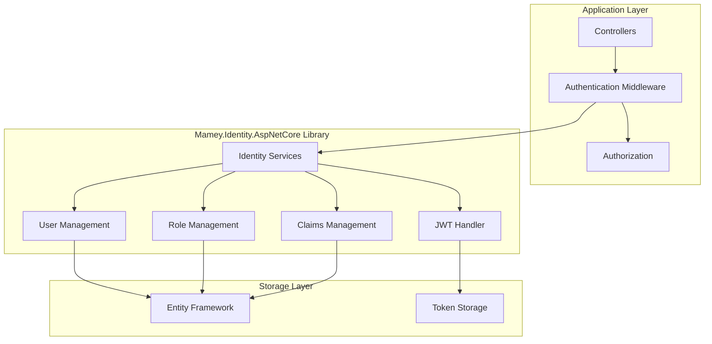
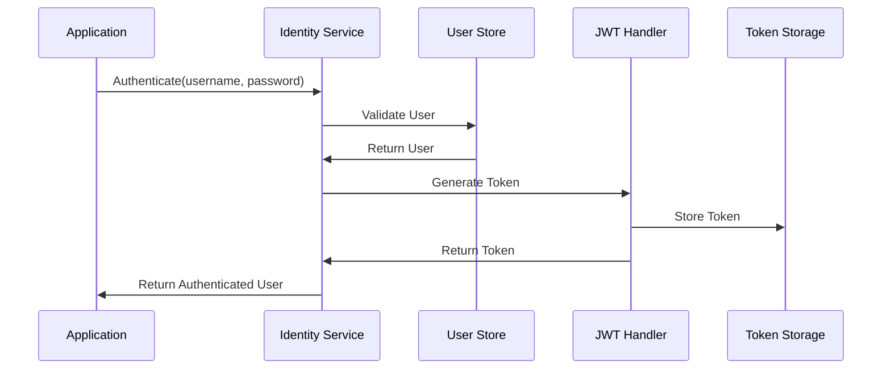

# Mamey.Identity.AspNetCore

**Library**: `Mamey.Identity.AspNetCore`  
**Location**: `Mamey/src/Mamey.Identity.AspNetCore/`  
**Type**: Identity Library - ASP.NET Core  
**Version**: 2.0.*  
**Files**: 41 C# files  
**Namespace**: `Mamey.Identity.AspNetCore`

## Overview

Mamey.Identity.AspNetCore provides comprehensive ASP.NET Core Identity integration for the Mamey framework. It includes full authentication and authorization capabilities with JWT support, role-based access control, and claims-based authorization.

### Conceptual Foundation

**ASP.NET Core Identity** is Microsoft's identity management framework for ASP.NET Core applications. Key concepts:

1. **User Management**: User creation, authentication, and management
2. **Role Management**: Role-based authorization and access control
3. **Claims Management**: Claims-based identity and authorization
4. **Password Management**: Password hashing, validation, and reset
5. **Multi-Factor Authentication**: Enhanced security with MFA support
6. **Token Management**: JWT token generation and validation

**Why Mamey.Identity.AspNetCore?**

Provides:
- **ASP.NET Core Identity**: Full ASP.NET Core Identity integration
- **User Management**: User creation and management
- **Role Management**: Role-based authorization
- **Claims Management**: Claims-based authorization
- **Password Management**: Password hashing and validation
- **JWT Integration**: JWT token generation and validation
- **Multi-Tenant Support**: Tenant isolation and management

**Use Cases:**
- ASP.NET Core web applications
- API applications
- Multi-tenant applications
- Enterprise applications
- Applications requiring role-based access control

## Architecture

### ASP.NET Core Identity Architecture



### Authentication Flow



## Core Components

### Extensions - Identity Extensions

Extension methods for ASP.NET Core Identity configuration:

```csharp
public static class Extensions
{
    public static IMameyBuilder AddMameyAuthIdentity(
        this IMameyBuilder builder,
        string sectionName = "auth",
        Action<JwtBearerOptions> optionsFactory = null,
        IList<IModule> modules = null,
        AuthorizationOptions? authorizationOptions = null,
        AuthenticationOptions? authenticationOptions = null);
}
```

**Features:**
- **JWT Configuration**: Configures JWT Bearer authentication
- **Cookie Authentication**: Configures cookie authentication
- **Entity Framework Identity**: Configures EF Core Identity storage
- **Authorization Policies**: Configures authorization policies

### AuthOptions - Authentication Configuration

Configuration class for authentication:

```csharp
public class AuthOptions : IdentityOptions
{
    public bool AuthenticationDisabled { get; set; }
    public string Issuer { get; set; }
    public int ExpiryMinutes { get; set; }
    public CertificateOptions Certificate { get; set; }
    public string IssuerSigningKey { get; set; }
    public string Authority { get; set; }
    public string Audience { get; set; }
    public bool ValidateIssuer { get; set; }
    public bool ValidateAudience { get; set; }
    public bool ValidateLifetime { get; set; }
    public CookieOptions Cookie { get; set; }
}
```

### IJwtHandler - JWT Handler Interface

Interface for JWT token operations:

```csharp
public interface IJwtHandler
{
    JsonWebToken CreateToken(
        string userId,
        string role = null,
        string audience = null,
        IDictionary<string, string> claims = null);
    
    JsonWebTokenPayload GetTokenPayload(string accessToken);
}
```

### JwtHandler - JWT Handler Implementation

Implementation of JWT token operations:

```csharp
public class JwtHandler : IJwtHandler
{
    public JsonWebToken CreateToken(
        string userId,
        string role = null,
        string audience = null,
        IDictionary<string, string> claims = null);
    
    public JsonWebTokenPayload GetTokenPayload(string accessToken);
}
```

## Installation

### Prerequisites

1. **.NET 9.0**: Ensure .NET 9.0 SDK is installed
2. **ASP.NET Core**: ASP.NET Core application
3. **Entity Framework Core**: EF Core for identity storage (optional)

### NuGet Package

```bash
dotnet add package Mamey.Identity.AspNetCore
```

### Dependencies

- **Mamey** - Core framework
- **Mamey.Identity.Core** - Core identity abstractions
- **Microsoft.AspNetCore.Identity** - ASP.NET Core Identity
- **Microsoft.AspNetCore.Authentication.JwtBearer** - JWT Bearer authentication

## Quick Start

### Basic Setup

```csharp
using Mamey.Identity.AspNetCore;

var builder = WebApplication.CreateBuilder(args);

builder.Services
    .AddMamey()
    .AddMameyAuthIdentity(options =>
    {
        options.IssuerSigningKey = "your-secret-key";
        options.ValidIssuer = "mamey-app";
        options.ValidAudience = "mamey-api";
        options.ValidateIssuer = true;
        options.ValidateAudience = true;
        options.ValidateLifetime = true;
    });

var app = builder.Build();

app.UseAuthentication();
app.UseAuthorization();

app.Run();
```

### Configuration

Add to `appsettings.json`:

```json
{
  "Auth": {
    "IssuerSigningKey": "your-secret-key",
    "ValidIssuer": "mamey-app",
    "ValidAudience": "mamey-api",
    "ValidateIssuer": true,
    "ValidateAudience": true,
    "ValidateLifetime": true,
    "ExpiryMinutes": 60,
    "Cookie": {
      "HttpOnly": true,
      "Secure": true,
      "SameSite": "Lax"
    }
  }
}
```

## Usage Examples

### Example 1: Authenticate User

```csharp
using Mamey.Identity.AspNetCore;
using Microsoft.AspNetCore.Identity;

public class AuthController : ControllerBase
{
    private readonly SignInManager<ApplicationUser> _signInManager;
    private readonly UserManager<ApplicationUser> _userManager;
    private readonly IJwtHandler _jwtHandler;
    private readonly ILogger<AuthController> _logger;

    public AuthController(
        SignInManager<ApplicationUser> signInManager,
        UserManager<ApplicationUser> userManager,
        IJwtHandler jwtHandler,
        ILogger<AuthController> logger)
    {
        _signInManager = signInManager;
        _userManager = userManager;
        _jwtHandler = jwtHandler;
        _logger = logger;
    }

    [HttpPost("login")]
    public async Task<IActionResult> Login([FromBody] LoginRequest request)
    {
        try
        {
            _logger.LogInformation("Login attempt for user: {Username}", request.Username);

            var user = await _userManager.FindByNameAsync(request.Username);
            if (user == null)
            {
                return Unauthorized("Invalid credentials");
            }

            var result = await _signInManager.CheckPasswordSignInAsync(
                user,
                request.Password,
                lockoutOnFailure: false);

            if (!result.Succeeded)
            {
                return Unauthorized("Invalid credentials");
            }

            var token = _jwtHandler.CreateToken(
                user.Id.ToString(),
                (await _userManager.GetRolesAsync(user)).FirstOrDefault(),
                "mamey-api",
                new Dictionary<string, string>
                {
                    { "email", user.Email },
                    { "name", user.UserName }
                });

            _logger.LogInformation("User logged in successfully: {UserId}", user.Id);

            return Ok(new
            {
                UserId = user.Id,
                Name = user.UserName,
                Email = user.Email,
                AccessToken = token.AccessToken,
                RefreshToken = token.RefreshToken,
                Expires = token.Expires
            });
        }
        catch (Exception ex)
        {
            _logger.LogError(ex, "Login failed for user: {Username}", request.Username);
            return BadRequest("Login failed");
        }
    }
}
```

### Example 2: Register User

```csharp
[HttpPost("register")]
public async Task<IActionResult> Register([FromBody] RegisterRequest request)
{
    try
    {
        _logger.LogInformation("Registration attempt for user: {Username}", request.Username);

        var user = new ApplicationUser
        {
            UserName = request.Username,
            Email = request.Email,
            EmailConfirmed = false
        };

        var result = await _userManager.CreateAsync(user, request.Password);

        if (!result.Succeeded)
        {
            return BadRequest(result.Errors);
        }

        _logger.LogInformation("User registered successfully: {UserId}", user.Id);

        return Ok(new { UserId = user.Id, Username = user.UserName });
    }
    catch (Exception ex)
    {
        _logger.LogError(ex, "Registration failed for user: {Username}", request.Username);
        return BadRequest("Registration failed");
    }
}
```

### Example 3: Protect API Endpoints

```csharp
using Microsoft.AspNetCore.Authorization;
using Microsoft.AspNetCore.Mvc;

[ApiController]
[Route("api/[controller]")]
[Authorize] // Requires authentication
public class DataController : ControllerBase
{
    [HttpGet]
    public IActionResult GetData()
    {
        var userId = User.FindFirst("sub")?.Value;
        var userName = User.Identity?.Name;
        
        return Ok(new { UserId = userId, UserName = userName });
    }
}
```

### Example 4: Role-Based Authorization

```csharp
[ApiController]
[Route("api/[controller]")]
[Authorize(Roles = "Admin")] // Requires Admin role
public class AdminController : ControllerBase
{
    [HttpGet]
    public IActionResult GetAdminData()
    {
        return Ok("Admin data");
    }
}
```

## Related Libraries

- **Mamey.Identity.Core**: Core identity abstractions
- **Mamey.Identity.EntityFramework**: Entity Framework Identity storage
- **Mamey.Identity.Jwt**: JWT Identity implementation
- **Mamey.Identity.Redis**: Redis Identity storage

## Additional Resources

- [ASP.NET Core Identity Documentation](https://docs.microsoft.com/aspnet/core/security/authentication/identity)
- [JWT Authentication](https://docs.microsoft.com/aspnet/core/security/authentication/jwt-authn)
- [Mamey Framework Documentation](../../documentation/)
- [Mamey.Identity.AspNetCore Memory Documentation](../../.skmemory/v1/memory/public/mid-term/libraries/identity/mamey-identity-aspnetcore.md)

## Tags

#identity #aspnet-core #authentication #authorization #jwt #mamey

