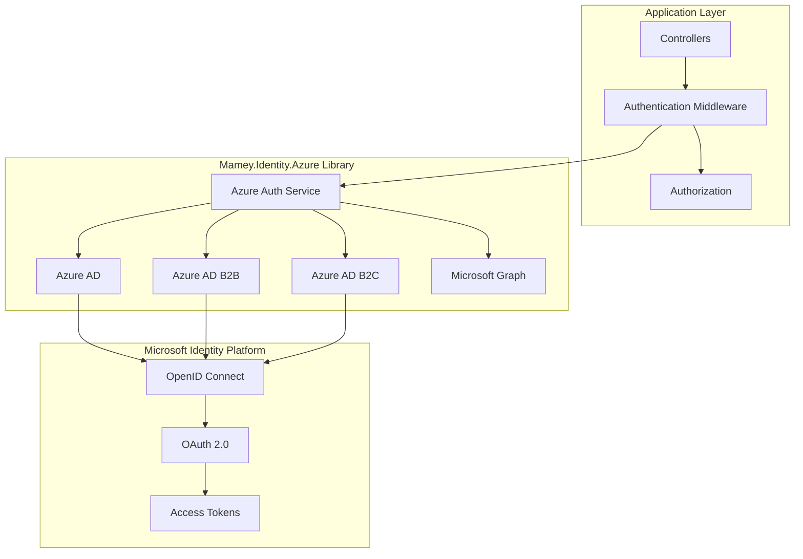
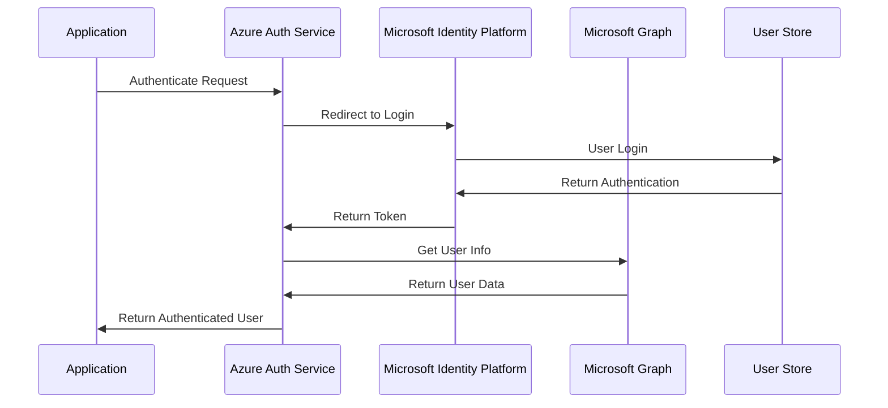

# Mamey.Identity.Azure

**Library**: `Mamey.Identity.Azure`  
**Location**: `Mamey/src/Mamey.Identity.Azure/`  
**Type**: Identity Library - Azure AD Authentication  
**Version**: 2.0.*  
**Files**: 8 C# files  
**Namespace**: `Mamey.Identity.Azure`

## Overview

Mamey.Identity.Azure provides comprehensive Azure Active Directory (Azure AD) authentication integration for the Mamey framework. It supports Azure AD, Azure AD B2B (Business-to-Business), and Azure AD B2C (Business-to-Consumer) authentication scenarios with Microsoft Graph API integration.

### Conceptual Foundation

**Azure Active Directory** is Microsoft's cloud-based identity and access management service. Key concepts:

1. **Azure AD**: Enterprise identity service for organizations
2. **Azure AD B2B**: Collaboration with external partners and guests
3. **Azure AD B2C**: Customer identity and access management
4. **Microsoft Identity Platform**: OAuth 2.0 and OpenID Connect authentication
5. **Microsoft Graph API**: Unified API for Microsoft 365 services
6. **Claims-Based Authentication**: Token-based authentication with claims

**Why Mamey.Identity.Azure?**

Provides:
- **Azure AD Integration**: Complete Azure AD authentication support
- **B2B Support**: Business-to-business collaboration scenarios
- **B2C Support**: Customer identity management
- **Microsoft Graph**: Integration with Microsoft Graph API
- **OpenID Connect**: Standards-based authentication protocol
- **Token Management**: Automatic token acquisition and caching

**Use Cases:**
- Enterprise applications with Azure AD
- Multi-tenant SaaS applications
- Customer-facing applications (B2C)
- Partner collaboration (B2B)
- Microsoft 365 integration
- SharePoint integration

## Architecture

### Azure Identity Architecture



### Authentication Flow



## Core Components

### IAzureAuthService - Azure Authentication Service Interface

Interface for Azure authentication operations:

```csharp
public interface IAzureAuthService
{
    Task<AuthenticatedUser?> GetAuthenticatedUserAsync(ClaimsPrincipal claimsPrincipal);
    Task<AuthenticatedUser?> GetUserAsync(string userId);
    Task<bool> IsUserInRoleAsync(ClaimsPrincipal claimsPrincipal, string role);
}
```

### AzureAuthService - Azure Authentication Service Implementation

Implementation of Azure authentication:

```csharp
public class AzureAuthService : IAzureAuthService
{
    private readonly GraphServiceClient _graphServiceClient;
    private readonly AzureOptions _azureOptions;
    private readonly ILogger<AzureAuthService> _logger;

    public async Task<AuthenticatedUser?> GetAuthenticatedUserAsync(ClaimsPrincipal claimsPrincipal);
    public async Task<AuthenticatedUser?> GetUserAsync(string userId);
    public async Task<bool> IsUserInRoleAsync(ClaimsPrincipal claimsPrincipal, string role);
}
```

### AzureOptions - Azure Configuration

Configuration class for Azure authentication:

```csharp
public class AzureOptions
{
    public bool Enabled { get; set; }
    public string Type { get; set; } // "azuread", "b2b", "b2c"
    public string Instance { get; set; } // "https://login.microsoftonline.com/"
    public string TenantId { get; set; }
    public string ClientId { get; set; }
    public string ClientSecret { get; set; }
    public string Domain { get; set; }
    public string CallbackPath { get; set; }
    public string SignedOutCallbackPath { get; set; }
    public string SignUpSignInPolicyId { get; set; } // B2C
    public string ResetPasswordPolicyId { get; set; } // B2C
    public string EditProfilePolicyId { get; set; } // B2C
}
```

### B2BAuthenticationService - B2B Authentication

Service for Azure AD B2B authentication:

```csharp
public class B2BAuthenticationService
{
    // B2B authentication implementation
}
```

### B2CAuthenticationService - B2C Authentication

Service for Azure AD B2C authentication:

```csharp
public class B2CAuthenticationService
{
    // B2C authentication implementation
}
```

### IGraphService - Microsoft Graph Service Interface

Interface for Microsoft Graph API operations:

```csharp
public interface IGraphService
{
    Task<User?> GetUserAsync(string userId);
    Task<List<User>> GetUsersAsync();
    Task<Group?> GetGroupAsync(string groupId);
    Task<List<Group>> GetGroupsAsync();
}
```

## Installation

### Prerequisites

1. **.NET 9.0**: Ensure .NET 9.0 SDK is installed
2. **Azure AD App Registration**: Azure AD application registered in Azure Portal
3. **Microsoft Identity Web**: Microsoft.Identity.Web NuGet package

### NuGet Package

```bash
dotnet add package Mamey.Identity.Azure
```

### Dependencies

- **Mamey** - Core framework
- **Mamey.Identity.Core** - Core identity abstractions
- **Microsoft.Identity.Web** - Microsoft Identity Platform
- **Microsoft.Graph** - Microsoft Graph SDK

## Quick Start

### Basic Setup

```csharp
using Mamey.Identity.Azure;

var builder = WebApplication.CreateBuilder(args);

builder.Services
    .AddMamey()
    .AddAzureAuthentication();

var app = builder.Build();

app.UseAuthentication();
app.UseAuthorization();

app.Run();
```

### Configuration

Add to `appsettings.json`:

```json
{
  "AzureAd": {
    "Enabled": true,
    "Type": "azuread",
    "Instance": "https://login.microsoftonline.com/",
    "TenantId": "your-tenant-id",
    "ClientId": "your-client-id",
    "ClientSecret": "your-client-secret",
    "CallbackPath": "/signin-oidc",
    "SignedOutCallbackPath": "/signout-callback-oidc",
    "Domain": "yourdomain.com"
  }
}
```

### Azure AD B2B Configuration

```json
{
  "AzureAd": {
    "Enabled": true,
    "Type": "b2b",
    "Instance": "https://login.microsoftonline.com/",
    "TenantId": "your-tenant-id",
    "ClientId": "your-client-id",
    "ClientSecret": "your-client-secret"
  }
}
```

### Azure AD B2C Configuration

```json
{
  "AzureAd": {
    "Enabled": true,
    "Type": "b2c",
    "Instance": "https://your-tenant.b2clogin.com/",
    "TenantId": "your-tenant-id",
    "ClientId": "your-client-id",
    "ClientSecret": "your-client-secret",
    "SignUpSignInPolicyId": "B2C_1_SignUpSignIn",
    "ResetPasswordPolicyId": "B2C_1_ResetPassword",
    "EditProfilePolicyId": "B2C_1_EditProfile"
  }
}
```

## Usage Examples

### Example 1: Authenticate with Azure AD

```csharp
using Microsoft.AspNetCore.Authorization;
using Microsoft.AspNetCore.Mvc;
using Mamey.Identity.Azure;

[ApiController]
[Route("api/[controller]")]
public class AuthController : ControllerBase
{
    private readonly IAzureAuthService _azureAuthService;
    private readonly ILogger<AuthController> _logger;

    public AuthController(
        IAzureAuthService azureAuthService,
        ILogger<AuthController> logger)
    {
        _azureAuthService = azureAuthService;
        _logger = logger;
    }

    [HttpGet("me")]
    [Authorize]
    public async Task<IActionResult> GetCurrentUser()
    {
        try
        {
            var user = await _azureAuthService.GetAuthenticatedUserAsync(User);

            if (user == null)
            {
                return Unauthorized();
            }

            return Ok(user);
        }
        catch (Exception ex)
        {
            _logger.LogError(ex, "Failed to get authenticated user");
            return BadRequest();
        }
    }
}
```

### Example 2: Protect API Endpoints

```csharp
[ApiController]
[Route("api/[controller]")]
[Authorize] // Requires Azure AD authentication
public class DataController : ControllerBase
{
    [HttpGet]
    public IActionResult GetData()
    {
        var userId = User.FindFirst("sub")?.Value;
        var email = User.FindFirst("email")?.Value;
        var name = User.FindFirst("name")?.Value;
        
        return Ok(new { UserId = userId, Email = email, Name = name });
    }
}
```

### Example 3: Role-Based Authorization

```csharp
[ApiController]
[Route("api/[controller]")]
[Authorize(Roles = "Admin")] // Requires Admin role in Azure AD
public class AdminController : ControllerBase
{
    [HttpGet]
    public IActionResult GetAdminData()
    {
        return Ok("Admin data");
    }
}
```

### Example 4: Use Microsoft Graph

```csharp
using Mamey.Identity.Azure.Graph;
using Microsoft.Graph.Models;

public class UserService
{
    private readonly IGraphService _graphService;
    private readonly ILogger<UserService> _logger;

    public UserService(
        IGraphService graphService,
        ILogger<UserService> logger)
    {
        _graphService = graphService;
        _logger = logger;
    }

    public async Task<User?> GetUserAsync(string userId)
    {
        try
        {
            _logger.LogInformation("Retrieving user from Microsoft Graph: {UserId}", userId);

            var user = await _graphService.GetUserAsync(userId);

            _logger.LogInformation("Retrieved user: {DisplayName}", user?.DisplayName);

            return user;
        }
        catch (Exception ex)
        {
            _logger.LogError(ex, "Failed to retrieve user from Microsoft Graph");
            throw;
        }
    }

    public async Task<List<User>> GetAllUsersAsync()
    {
        try
        {
            _logger.LogInformation("Retrieving all users from Microsoft Graph");

            var users = await _graphService.GetUsersAsync();

            _logger.LogInformation("Retrieved {Count} users", users.Count);

            return users;
        }
        catch (Exception ex)
        {
            _logger.LogError(ex, "Failed to retrieve users from Microsoft Graph");
            throw;
        }
    }
}
```

### Example 5: B2B Guest User Handling

```csharp
public class GuestUserService
{
    private readonly IAzureAuthService _azureAuthService;
    private readonly ILogger<GuestUserService> _logger;

    public async Task<bool> IsGuestUserAsync(ClaimsPrincipal claimsPrincipal)
    {
        try
        {
            var user = await _azureAuthService.GetAuthenticatedUserAsync(claimsPrincipal);
            
            if (user == null)
            {
                return false;
            }

            // Check if user is a guest user
            var userType = claimsPrincipal.FindFirst("userType")?.Value;
            return userType == "Guest";
        }
        catch (Exception ex)
        {
            _logger.LogError(ex, "Failed to check guest user status");
            return false;
        }
    }
}
```

### Example 6: B2C User Profile Management

```csharp
[ApiController]
[Route("api/[controller]")]
[Authorize]
public class ProfileController : ControllerBase
{
    private readonly IAzureAuthService _azureAuthService;
    private readonly ILogger<ProfileController> _logger;

    [HttpGet]
    public async Task<IActionResult> GetProfile()
    {
        try
        {
            var user = await _azureAuthService.GetAuthenticatedUserAsync(User);

            if (user == null)
            {
                return Unauthorized();
            }

            return Ok(new
            {
                UserId = user.UserId,
                Name = user.Name,
                Email = user.Email,
                Role = user.Role,
                Claims = user.Claims
            });
        }
        catch (Exception ex)
        {
            _logger.LogError(ex, "Failed to get user profile");
            return BadRequest();
        }
    }
}
```

## Extension Methods

### AddAzureAuthentication

Registers Azure authentication services:

```csharp
public static IMameyBuilder AddAzureAuthentication(this IMameyBuilder builder)
```

**Features:**
- Configures Azure AD, B2B, or B2C authentication based on configuration
- Registers Microsoft Graph client
- Registers Azure authentication service

### AddB2BAuthentication

Registers Azure AD B2B authentication:

```csharp
public static IMameyBuilder AddB2BAuthentication(this IMameyBuilder builder, AzureOptions azureOptions)
```

### AddB2CAuthentication

Registers Azure AD B2C authentication:

```csharp
public static IMameyBuilder AddB2CAuthentication(this IMameyBuilder builder, AzureOptions azureOptions)
```

### AddAzureADAuthentication

Registers standard Azure AD authentication:

```csharp
public static IMameyBuilder AddAzureADAuthentication(this IMameyBuilder builder, AzureOptions azureOptions)
```

## Best Practices

### 1. Configure Proper Scopes

**✅ Good: Request necessary Microsoft Graph scopes**
```csharp
// In Azure AD app registration, configure API permissions
// User.Read, Group.Read.All, etc.
```

### 2. Use Token Caching

**✅ Good: Microsoft Identity Web caches tokens automatically**
```csharp
// Tokens are automatically cached and refreshed
// No manual token management needed
```

### 3. Handle Guest Users

**✅ Good: Handle B2B guest users appropriately**
```csharp
var userType = User.FindFirst("userType")?.Value;
if (userType == "Guest")
{
    // Handle guest user access
}
```

### 4. Validate Claims

**✅ Good: Validate claims from Azure AD tokens**
```csharp
var tenantId = User.FindFirst("tid")?.Value;
var appId = User.FindFirst("appid")?.Value;
// Validate tenant and application claims
```

### 5. Use Authorization Policies

**✅ Good: Use authorization policies for complex requirements**
```csharp
builder.Services.AddAuthorization(options =>
{
    options.AddPolicy("RequireAzureB2B", policy =>
        policy.RequireClaim("iss", $"{azureOptions.Instance}/{azureOptions.TenantId}/v2.0"));
});
```

## Troubleshooting

### Common Issues

#### Authentication Fails

**Problem**: Users cannot authenticate with Azure AD.

**Solution**:
1. Verify Azure AD app registration is correct
2. Check ClientId and ClientSecret are correct
3. Verify redirect URIs are configured in Azure Portal
4. Check TenantId is correct

#### Token Validation Fails

**Problem**: Token validation fails after authentication.

**Solution**:
1. Verify issuer URL matches Azure AD instance
2. Check audience claim matches ClientId
3. Verify token signing keys are valid
4. Check token expiration settings

#### Microsoft Graph API Fails

**Problem**: Microsoft Graph API calls fail.

**Solution**:
1. Verify API permissions are granted in Azure Portal
2. Check admin consent is granted for delegated permissions
3. Verify GraphServiceClient is properly configured
4. Check token scopes include required permissions

## Related Libraries

- **Mamey.Identity.Core**: Core identity abstractions
- **Mamey.Identity.AspNetCore**: ASP.NET Core Identity integration
- **Mamey.Graph**: Microsoft Graph API integration
- **Mamey.Identity.Jwt**: JWT Identity implementation

## Additional Resources

- [Microsoft Identity Platform Documentation](https://docs.microsoft.com/azure/active-directory/develop/)
- [Azure AD B2B Documentation](https://docs.microsoft.com/azure/active-directory/external-identities/what-is-b2b)
- [Azure AD B2C Documentation](https://docs.microsoft.com/azure/active-directory-b2c/)
- [Microsoft Graph API Documentation](https://docs.microsoft.com/graph/)
- [Mamey Framework Documentation](../../documentation/)
- [Mamey.Identity.Azure Memory Documentation](../../.skmemory/v1/memory/public/mid-term/libraries/identity/mamey-identity-azure.md)

## Tags

#identity #azure-ad #authentication #b2b #b2c #microsoft-graph #mamey


