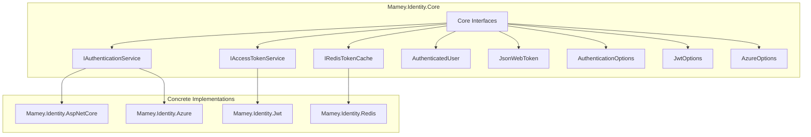
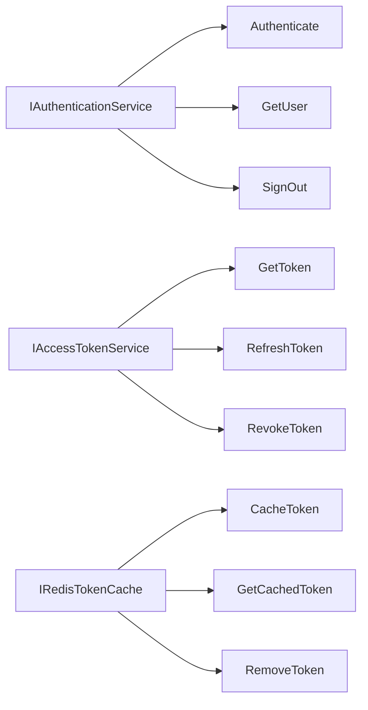

# Mamey.Identity.Core

**Library**: `Mamey.Identity.Core`  
**Location**: `Mamey/src/Mamey.Identity.Core/`  
**Type**: Identity Library - Core  
**Version**: 2.0.*  
**Files**: 9 C# files  
**Namespace**: `Mamey.Identity.Core`

## Overview

Mamey.Identity.Core provides core identity management abstractions and interfaces for the Mamey framework. It defines the fundamental contracts and data structures that enable a unified identity experience across different identity providers and implementations.

### Conceptual Foundation

**Identity and Access Management (IAM)** is a framework of business processes, policies, and technologies that facilitates the management of electronic or digital identities. Key concepts:

1. **Authentication**: Verifying the identity of users, services, or applications
2. **Authorization**: Controlling access to resources based on user identity and permissions
3. **User Lifecycle**: Managing user accounts from creation to deletion
4. **Single Sign-On**: Allowing users to authenticate once and access multiple systems
5. **Multi-Factor Authentication**: Using multiple verification methods for enhanced security

**Why Mamey.Identity.Core?**

Provides:
- **Core Interfaces**: Essential interfaces for identity operations
- **Identity Models**: Base identity models and data structures
- **Abstractions**: Identity abstractions for different implementations
- **Base Classes**: Base classes for identity services
- **Type Safety**: Strongly-typed interfaces for better development experience
- **Consistency**: Uniform patterns across identity libraries

**Use Cases:**
- Base contracts for identity implementations
- Type-safe identity data structures
- Consistent API across identity libraries
- Framework for implementing new identity providers

## Architecture

### Identity Core Architecture



### Interface Hierarchy



## Core Components

### IAuthenticationService - Authentication Service Interface

Core interface for authentication operations:

```csharp
public interface IAuthenticationService
{
    Task<AuthenticatedUser?> AuthenticateAsync(string username, string password);
    Task<AuthenticatedUser?> GetUserAsync(string userId);
    Task SignOutAsync(string userId);
    bool IsAuthenticated { get; }
    AuthenticatedUser? AuthenticatedUser { get; }
}
```

### IAccessTokenService - Access Token Service Interface

Interface for access token operations:

```csharp
public interface IAccessTokenService
{
    Task<string?> GetTokenAsync(string userId);
    Task RefreshTokenAsync(string userId);
    Task RevokeTokenAsync(string userId);
}
```

### IRedisTokenCache - Redis Token Cache Interface

Interface for Redis-based token caching:

```csharp
public interface IRedisTokenCache
{
    Task CacheTokenAsync(string userId, string token, TimeSpan expiration);
    Task<string?> GetCachedTokenAsync(string userId);
    Task RemoveTokenAsync(string userId);
}
```

### AuthenticatedUser - Authenticated User Model

Model representing an authenticated user:

```csharp
public class AuthenticatedUser
{
    public string UserId { get; set; }
    public string Name { get; set; }
    public string Email { get; set; }
    public string Role { get; set; }
    public string AccessToken { get; set; }
    public DateTime Expires { get; set; }
    public IDictionary<string, IEnumerable<string>> Claims { get; set; }
}
```

### JsonWebToken - JWT Token Model

Model representing a JWT token:

```csharp
public class JsonWebToken
{
    public string AccessToken { get; set; }
    public string RefreshToken { get; set; }
    public DateTime Expires { get; set; }
    public string Id { get; set; }
    public string Role { get; set; }
    public IDictionary<string, IEnumerable<string>> Claims { get; set; }
}
```

### JsonWebTokenPayload - JWT Payload Model

Model representing JWT token payload:

```csharp
public class JsonWebTokenPayload
{
    public string Sub { get; set; }
    public string Exp { get; set; }
    public string Iat { get; set; }
    public string Iss { get; set; }
    public string Aud { get; set; }
    public IDictionary<string, object> Claims { get; set; }
}
```

### AuthenticationOptions - Authentication Configuration

Base configuration class for authentication:

```csharp
public class AuthenticationOptions
{
    public bool Enabled { get; set; }
    public string Type { get; set; }
    // Additional authentication options
}
```

### JwtOptions - JWT Configuration

Configuration class for JWT authentication:

```csharp
public class JwtOptions
{
    public string IssuerSigningKey { get; set; }
    public string ValidIssuer { get; set; }
    public string ValidAudience { get; set; }
    public bool ValidateIssuer { get; set; }
    public bool ValidateAudience { get; set; }
    public bool ValidateLifetime { get; set; }
}
```

### AzureOptions - Azure Configuration

Configuration class for Azure authentication:

```csharp
public class AzureOptions
{
    public string TenantId { get; set; }
    public string ClientId { get; set; }
    public string ClientSecret { get; set; }
    public string Instance { get; set; }
    public string Domain { get; set; }
}
```

## Installation

### Prerequisites

1. **.NET 9.0**: Ensure .NET 9.0 SDK is installed
2. **Mamey**: Core framework

### NuGet Package

```bash
dotnet add package Mamey.Identity.Core
```

### Dependencies

- **Mamey** - Core framework

## Quick Start

### Basic Setup

```csharp
using Mamey.Identity.Core;

// Interfaces are used by concrete implementations
// No direct usage required - use concrete identity libraries instead
```

## Usage Examples

### Example 1: Using Authentication Service

```csharp
using Mamey.Identity.Core;

public class UserService
{
    private readonly IAuthenticationService _authService;
    private readonly ILogger<UserService> _logger;

    public UserService(
        IAuthenticationService authService,
        ILogger<UserService> logger)
    {
        _authService = authService;
        _logger = logger;
    }

    public async Task<AuthenticatedUser?> AuthenticateUserAsync(string username, string password)
    {
        try
        {
            _logger.LogInformation("Authenticating user: {Username}", username);

            var user = await _authService.AuthenticateAsync(username, password);

            if (user == null)
            {
                _logger.LogWarning("Authentication failed for user: {Username}", username);
                return null;
            }

            _logger.LogInformation("User authenticated successfully: {UserId}", user.UserId);

            return user;
        }
        catch (Exception ex)
        {
            _logger.LogError(ex, "Failed to authenticate user: {Username}", username);
            throw;
        }
    }
}
```

### Example 2: Using Access Token Service

```csharp
public class TokenService
{
    private readonly IAccessTokenService _tokenService;
    private readonly ILogger<TokenService> _logger;

    public TokenService(
        IAccessTokenService tokenService,
        ILogger<TokenService> logger)
    {
        _tokenService = tokenService;
        _logger = logger;
    }

    public async Task<string?> GetAccessTokenAsync(string userId)
    {
        try
        {
            _logger.LogInformation("Retrieving access token for user: {UserId}", userId);

            var token = await _tokenService.GetTokenAsync(userId);

            if (token == null)
            {
                _logger.LogWarning("Token not found for user: {UserId}", userId);
                return null;
            }

            _logger.LogInformation("Access token retrieved for user: {UserId}", userId);

            return token;
        }
        catch (Exception ex)
        {
            _logger.LogError(ex, "Failed to retrieve access token for user: {UserId}", userId);
            throw;
        }
    }
}
```

### Example 3: Using Redis Token Cache

```csharp
public class TokenCacheService
{
    private readonly IRedisTokenCache _tokenCache;
    private readonly ILogger<TokenCacheService> _logger;

    public TokenCacheService(
        IRedisTokenCache tokenCache,
        ILogger<TokenCacheService> logger)
    {
        _tokenCache = tokenCache;
        _logger = logger;
    }

    public async Task CacheTokenAsync(string userId, string token, TimeSpan expiration)
    {
        try
        {
            _logger.LogInformation("Caching token for user: {UserId}", userId);

            await _tokenCache.CacheTokenAsync(userId, token, expiration);

            _logger.LogInformation("Token cached successfully for user: {UserId}", userId);
        }
        catch (Exception ex)
        {
            _logger.LogError(ex, "Failed to cache token for user: {UserId}", userId);
            throw;
        }
    }
}
```

## Extension Points

### Creating New Identity Service Interfaces

```csharp
namespace Mamey.Identity.Core;

// Define a new identity service interface
public interface IIdentityService
{
    Task<IdentityResult> CreateIdentityAsync(IdentityRequest request);
    Task<IdentityResult> UpdateIdentityAsync(string identityId, IdentityRequest request);
    Task<Identity?> GetIdentityAsync(string identityId);
}
```

### Implementing Identity Service Abstractions

```csharp
using Mamey.Identity.Core;

// Implement the interface in a concrete library
public class IdentityService : IIdentityService
{
    public async Task<IdentityResult> CreateIdentityAsync(IdentityRequest request)
    {
        // Implementation
    }
}
```

## Related Libraries

All identity libraries implement these abstractions:

- **Mamey.Identity.AspNetCore**: ASP.NET Core Identity implementation
- **Mamey.Identity.Azure**: Azure Identity implementation
- **Mamey.Identity.Jwt**: JWT Identity implementation
- **Mamey.Identity.Redis**: Redis Identity implementation
- **Mamey.Identity.EntityFramework**: Entity Framework Identity implementation
- **Mamey.Identity.Blazor**: Blazor Identity implementation
- **Mamey.Identity.Decentralized**: Decentralized Identity implementation
- **Mamey.Identity.Distributed**: Distributed Identity implementation

## Best Practices

### 1. Use Abstractions for Type Safety

**✅ Good: Use interface types**
```csharp
public class UserService
{
    private readonly IAuthenticationService _authService; // Use interface, not concrete type

    public UserService(IAuthenticationService authService)
    {
        _authService = authService;
    }
}
```

### 2. Implement Abstractions Consistently

**✅ Good: Follow interface contracts**
```csharp
public class AuthenticationService : IAuthenticationService
{
    // Implement all interface members
    public Task<AuthenticatedUser?> AuthenticateAsync(string username, string password);
    public Task<AuthenticatedUser?> GetUserAsync(string userId);
    public Task SignOutAsync(string userId);
}
```

### 3. Extend Abstractions for New Providers

**✅ Good: Create new interfaces for new providers**
```csharp
public interface IIdentityProvider
{
    // Define new identity provider interface
}
```

## Additional Resources

- [Identity and Access Management](https://en.wikipedia.org/wiki/Identity_management)
- [Mamey Framework Documentation](../../documentation/)
- [Mamey.Identity.Core Memory Documentation](../../.skmemory/v1/memory/public/mid-term/libraries/identity/mamey-identity-core.md)

## Tags

#identity #core #abstractions #authentication #authorization #mamey

