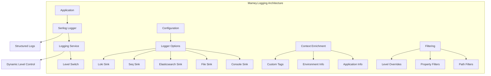

# Mamey.Logging

A comprehensive logging library for the Mamey framework, providing structured logging capabilities with Serilog integration. This library offers multiple logging sinks, dynamic log level control, and enterprise-grade logging features for microservices and distributed systems.

## Table of Contents

- [Overview](#overview)
- [Key Features](#key-features)
- [Architecture](#architecture)
- [Installation](#installation)
- [Quick Start](#quick-start)
- [Core Components](#core-components)
- [API Reference](#api-reference)
- [Usage Examples](#usage-examples)
- [Configuration](#configuration)
- [Best Practices](#best-practices)
- [Troubleshooting](#troubleshooting)

## Overview

Mamey.Logging is a comprehensive logging library that provides structured logging capabilities for the Mamey framework. It integrates with Serilog to offer multiple logging sinks, dynamic log level control, and enterprise-grade logging features.

### Technical Overview

The library provides:

- **Structured Logging**: JSON-formatted logs with rich context information
- **Multiple Sinks**: Console, File, Elasticsearch, Seq, and Grafana Loki support
- **Dynamic Log Level Control**: Runtime log level adjustment via HTTP endpoint
- **Context Enrichment**: Automatic enrichment with application metadata
- **Filtering**: Path and property-based log filtering
- **Performance**: High-performance logging with minimal overhead
- **Enterprise Features**: Authentication, indexing, and advanced configuration

## Key Features

### Core Features

- **Structured Logging**: JSON-formatted logs with rich context information
- **Multiple Sinks**: Console, File, Elasticsearch, Seq, and Grafana Loki support
- **Dynamic Log Level Control**: Runtime log level adjustment via HTTP endpoint
- **Context Enrichment**: Automatic enrichment with application metadata
- **Filtering**: Path and property-based log filtering
- **Performance**: High-performance logging with minimal overhead
- **Enterprise Features**: Authentication, indexing, and advanced configuration

### Advanced Features

- **Multiple Output Formats**: Support for various log output formats
- **Log Level Overrides**: Per-namespace log level configuration
- **Path Filtering**: Exclude specific request paths from logging
- **Property Filtering**: Exclude specific properties from logs
- **Custom Tags**: Add custom tags to all log entries
- **Rolling Files**: Configurable file rolling intervals
- **Authentication**: Support for authenticated log sinks
- **Batch Processing**: Efficient batch processing for log sinks

## Architecture



## Installation

### Package Manager
```bash
Install-Package Mamey.Logging
```

### .NET CLI
```bash
dotnet add package Mamey.Logging
```

### PackageReference
```xml
<PackageReference Include="Mamey.Logging" Version="2.0.*" />
```

## Quick Start

### Basic Setup

```csharp
using Mamey.Logging;

var builder = WebApplication.CreateBuilder(args);

// Add Mamey logging
builder.Host.UseLogging();

var app = builder.Build();

app.Run();
```

### With Custom Configuration

```csharp
builder.Host.UseLogging((context, loggerConfiguration) =>
{
    loggerConfiguration
        .WriteTo.Console()
        .WriteTo.File("logs/app.log");
});
```

### With Configuration File

```csharp
// appsettings.json
{
  "logger": {
    "level": "Information",
    "console": {
      "enabled": true
    },
    "file": {
      "enabled": true,
      "path": "logs/app.log"
    }
  }
}

// Program.cs
builder.Host.UseLogging();
```

## Core Components

### Configuration System

#### LoggerOptions
```csharp
public class LoggerOptions
{
    public string Level { get; set; }
    public ConsoleOptions Console { get; set; }
    public FileOptions File { get; set; }
    public ElkOptions Elk { get; set; }
    public SeqOptions Seq { get; set; }
    public LokiOptions Loki { get; set; }
    public IDictionary<string, string> MinimumLevelOverrides { get; set; }
    public IEnumerable<string> ExcludePaths { get; set; }
    public IEnumerable<string> ExcludeProperties { get; set; }
    public IDictionary<string, object> Tags { get; set; }
}
```

#### Sink Options

##### ConsoleOptions
```csharp
public class ConsoleOptions
{
    public bool Enabled { get; set; }
}
```

##### FileOptions
```csharp
public class FileOptions
{
    public bool Enabled { get; set; }
    public string Path { get; set; }
    public string Interval { get; set; }
}
```

##### ElkOptions
```csharp
public class ElkOptions
{
    public bool Enabled { get; set; }
    public string Url { get; set; }
    public bool BasicAuthEnabled { get; set; }
    public string Username { get; set; }
    public string Password { get; set; }
    public string IndexFormat { get; set; }
}
```

##### SeqOptions
```csharp
public class SeqOptions
{
    public bool Enabled { get; set; }
    public string Url { get; set; }
    public string ApiKey { get; set; }
}
```

##### LokiOptions
```csharp
public class LokiOptions
{
    public bool Enabled { get; set; }
    public string Url { get; set; }
    public string LokiUsername { get; set; }
    public string LokiPassword { get; set; }
    public int? BatchPostingLimit { get; set; }
    public int? QueueLimit { get; set; }
    public TimeSpan? Period { get; set; }
}
```

### Logging Service

#### ILoggingService
```csharp
public interface ILoggingService
{
    void SetLoggingLevel(string logEventLevel);
}
```

#### LoggingService
```csharp
public class LoggingService : ILoggingService
{
    public void SetLoggingLevel(string logEventLevel)
        => Extensions.LoggingLevelSwitch.MinimumLevel = Extensions.GetLogEventLevel(logEventLevel);
}
```

## API Reference

### Extension Methods

#### IHostBuilder Extensions

```csharp
public static IHostBuilder UseLogging(
    this IHostBuilder hostBuilder,
    Action<HostBuilderContext, LoggerConfiguration> configure = null,
    string loggerSectionName = "logger",
    string appSectionName = "app");
```

#### IWebHostBuilder Extensions

```csharp
public static IWebHostBuilder UseLogging(
    this IWebHostBuilder webHostBuilder,
    Action<WebHostBuilderContext, LoggerConfiguration> configure = null,
    string loggerSectionName = "logger",
    string appSectionName = "app");
```

#### IEndpointRouteBuilder Extensions

```csharp
public static IEndpointConventionBuilder MapLogLevelHandler(
    this IEndpointRouteBuilder builder,
    string endpointRoute = "~/logging/level");
```

### Configuration Options

#### LoggerOptions
```csharp
public class LoggerOptions
{
    public string Level { get; set; }                    // Global log level
    public ConsoleOptions Console { get; set; }          // Console sink options
    public FileOptions File { get; set; }                // File sink options
    public ElkOptions Elk { get; set; }                  // Elasticsearch sink options
    public SeqOptions Seq { get; set; }                  // Seq sink options
    public LokiOptions Loki { get; set; }                // Loki sink options
    public IDictionary<string, string> MinimumLevelOverrides { get; set; }  // Per-namespace levels
    public IEnumerable<string> ExcludePaths { get; set; }                   // Excluded request paths
    public IEnumerable<string> ExcludeProperties { get; set; }              // Excluded properties
    public IDictionary<string, object> Tags { get; set; }                   // Custom tags
}
```

## Usage Examples

### Basic Logging Setup

```csharp
public class Program
{
    public static void Main(string[] args)
    {
        var builder = WebApplication.CreateBuilder(args);

        // Add Mamey logging
        builder.Host.UseLogging();

        var app = builder.Build();

        // Map log level control endpoint
        app.MapLogLevelHandler();

        app.Run();
    }
}
```

### With Custom Configuration

```csharp
builder.Host.UseLogging((context, loggerConfiguration) =>
{
    loggerConfiguration
        .WriteTo.Console()
        .WriteTo.File("logs/app.log", rollingInterval: RollingInterval.Day)
        .WriteTo.Seq("http://localhost:5341");
});
```

### With Configuration File

```csharp
// appsettings.json
{
  "logger": {
    "level": "Information",
    "console": {
      "enabled": true
    },
    "file": {
      "enabled": true,
      "path": "logs/app.log",
      "interval": "Day"
    },
    "elk": {
      "enabled": true,
      "url": "http://localhost:9200",
      "indexFormat": "app-logs-{0:yyyy.MM.dd}"
    },
    "seq": {
      "enabled": true,
      "url": "http://localhost:5341"
    },
    "minimumLevelOverrides": {
      "Microsoft": "Warning",
      "System": "Warning"
    },
    "excludePaths": [
      "/health",
      "/metrics"
    ],
    "tags": {
      "Environment": "Production",
      "Service": "MyService"
    }
  }
}
```

### Using in Services

```csharp
public class UserService
{
    private readonly ILogger<UserService> _logger;

    public UserService(ILogger<UserService> logger)
    {
        _logger = logger;
    }

    public async Task<User> CreateUserAsync(CreateUserRequest request)
    {
        _logger.LogInformation("Creating user with email {Email}", request.Email);
        
        try
        {
            var user = new User
            {
                Id = Guid.NewGuid(),
                Name = request.Name,
                Email = request.Email,
                CreatedAt = DateTime.UtcNow
            };

            // Business logic here
            await SaveUserAsync(user);
            
            _logger.LogInformation("User created successfully with ID {UserId}", user.Id);
            return user;
        }
        catch (Exception ex)
        {
            _logger.LogError(ex, "Failed to create user with email {Email}", request.Email);
            throw;
        }
    }
}
```

### Dynamic Log Level Control

```csharp
// Map the log level control endpoint
app.MapLogLevelHandler("/logging/level");

// Change log level at runtime
// POST /logging/level?level=Debug
// POST /logging/level?level=Warning
// POST /logging/level?level=Error
```

### Structured Logging Examples

```csharp
public class OrderService
{
    private readonly ILogger<OrderService> _logger;

    public async Task<Order> ProcessOrderAsync(OrderRequest request)
    {
        using var activity = _logger.BeginScope(new Dictionary<string, object>
        {
            ["OrderId"] = request.OrderId,
            ["CustomerId"] = request.CustomerId,
            ["Amount"] = request.Amount
        });

        _logger.LogInformation("Processing order {OrderId} for customer {CustomerId}", 
            request.OrderId, request.CustomerId);

        try
        {
            // Process order
            var order = await ProcessOrderInternalAsync(request);
            
            _logger.LogInformation("Order processed successfully {OrderId} in {Duration}ms", 
                order.Id, order.ProcessingTime);
            
            return order;
        }
        catch (ValidationException ex)
        {
            _logger.LogWarning(ex, "Order validation failed for {OrderId}: {ValidationErrors}", 
                request.OrderId, ex.Errors);
            throw;
        }
        catch (Exception ex)
        {
            _logger.LogError(ex, "Unexpected error processing order {OrderId}", request.OrderId);
            throw;
        }
    }
}
```

## Configuration

### Basic Configuration

```csharp
builder.Host.UseLogging();
```

### With Custom Options

```csharp
builder.Host.UseLogging((context, loggerConfiguration) =>
{
    loggerConfiguration
        .WriteTo.Console()
        .WriteTo.File("logs/app.log");
});
```

### With Configuration Section

```csharp
// appsettings.json
{
  "logger": {
    "level": "Information",
    "console": {
      "enabled": true
    },
    "file": {
      "enabled": true,
      "path": "logs/app.log"
    }
  }
}

// Program.cs
builder.Host.UseLogging();
```

### Advanced Configuration

```csharp
// appsettings.json
{
  "logger": {
    "level": "Information",
    "console": {
      "enabled": true
    },
    "file": {
      "enabled": true,
      "path": "logs/app.log",
      "interval": "Day"
    },
    "elk": {
      "enabled": true,
      "url": "http://localhost:9200",
      "basicAuthEnabled": true,
      "username": "elastic",
      "password": "password",
      "indexFormat": "app-logs-{0:yyyy.MM.dd}"
    },
    "seq": {
      "enabled": true,
      "url": "http://localhost:5341",
      "apiKey": "your-api-key"
    },
    "loki": {
      "enabled": true,
      "url": "http://localhost:3100",
      "lokiUsername": "admin",
      "lokiPassword": "password",
      "batchPostingLimit": 1000,
      "queueLimit": 10000,
      "period": "00:00:05"
    },
    "minimumLevelOverrides": {
      "Microsoft": "Warning",
      "System": "Warning",
      "MyApp": "Debug"
    },
    "excludePaths": [
      "/health",
      "/metrics",
      "/swagger"
    ],
    "excludeProperties": [
      "Password",
      "Secret",
      "Token"
    ],
    "tags": {
      "Environment": "Production",
      "Service": "MyService",
      "Version": "1.0.0"
    }
  }
}
```

## Best Practices

### Structured Logging

1. **Use Structured Properties**: Use structured properties instead of string interpolation
2. **Consistent Naming**: Use consistent property names across your application
3. **Context Enrichment**: Use scopes to add context to log entries
4. **Avoid Sensitive Data**: Never log passwords, tokens, or sensitive information

```csharp
// Good: Structured logging
_logger.LogInformation("User {UserId} created order {OrderId} with amount {Amount}", 
    userId, orderId, amount);

// Bad: String interpolation
_logger.LogInformation($"User {userId} created order {orderId} with amount {amount}");
```

### Log Levels

1. **Use Appropriate Levels**: Use the right log level for each message
2. **Debug for Development**: Use Debug level for detailed development information
3. **Information for Business Events**: Use Information for important business events
4. **Warning for Recoverable Issues**: Use Warning for recoverable issues
5. **Error for Exceptions**: Use Error for exceptions and failures

```csharp
_logger.LogDebug("Processing request {RequestId} with parameters {Parameters}", requestId, parameters);
_logger.LogInformation("User {UserId} logged in successfully", userId);
_logger.LogWarning("Rate limit exceeded for user {UserId}", userId);
_logger.LogError(ex, "Failed to process payment for order {OrderId}", orderId);
```

### Performance Considerations

1. **Avoid Expensive Operations**: Don't perform expensive operations in log statements
2. **Use Conditional Logging**: Use conditional logging for expensive operations
3. **Batch Processing**: Use batch processing for high-volume logging
4. **Async Logging**: Use async logging for better performance

```csharp
// Good: Conditional logging
if (_logger.IsEnabled(LogLevel.Debug))
{
    var expensiveData = await GetExpensiveDataAsync();
    _logger.LogDebug("Expensive data: {Data}", expensiveData);
}

// Good: Async logging
await _logger.LogAsync(LogLevel.Information, "Async log message");
```

### Error Handling

1. **Log Exceptions**: Always log exceptions with context
2. **Include Stack Traces**: Include stack traces for debugging
3. **Don't Log and Re-throw**: Avoid logging and re-throwing the same exception
4. **Use Structured Exception Logging**: Use structured logging for exceptions

```csharp
try
{
    await ProcessOrderAsync(order);
}
catch (ValidationException ex)
{
    _logger.LogWarning(ex, "Order validation failed for {OrderId}: {ValidationErrors}", 
        order.Id, ex.Errors);
    throw; // Re-throw without logging again
}
catch (Exception ex)
{
    _logger.LogError(ex, "Unexpected error processing order {OrderId}", order.Id);
    throw;
}
```

## Troubleshooting

### Common Issues

#### 1. Logs Not Appearing

**Problem**: Logs are not appearing in the configured sinks.

**Solution**: Check configuration and ensure sinks are properly enabled.

```csharp
// Check if logging is properly configured
builder.Host.UseLogging((context, loggerConfiguration) =>
{
    loggerConfiguration
        .WriteTo.Console()
        .WriteTo.Debug(); // Add debug sink for troubleshooting
});
```

#### 2. Performance Issues

**Problem**: Logging is causing performance issues.

**Solution**: Optimize logging configuration and use appropriate log levels.

```csharp
// Use appropriate log levels
builder.Host.UseLogging((context, loggerConfiguration) =>
{
    loggerConfiguration
        .MinimumLevel.Information() // Set appropriate minimum level
        .WriteTo.Console();
});
```

#### 3. Memory Issues

**Problem**: High memory usage due to logging.

**Solution**: Configure appropriate queue limits and batch sizes.

```csharp
// Configure queue limits
builder.Host.UseLogging((context, loggerConfiguration) =>
{
    loggerConfiguration
        .WriteTo.Console()
        .WriteTo.File("logs/app.log", 
            rollingInterval: RollingInterval.Day,
            retainedFileCountLimit: 7); // Limit retained files
});
```

#### 4. Sink Configuration Issues

**Problem**: Specific sinks are not working.

**Solution**: Check sink-specific configuration and connectivity.

```csharp
// Test individual sinks
builder.Host.UseLogging((context, loggerConfiguration) =>
{
    loggerConfiguration
        .WriteTo.Console()
        .WriteTo.Seq("http://localhost:5341", 
            apiKey: "your-api-key");
});
```

### Debugging Tips

1. **Enable Debug Logging**: Use debug level for troubleshooting
2. **Check Sink Connectivity**: Verify sink endpoints are accessible
3. **Monitor Performance**: Monitor logging performance metrics
4. **Use Structured Logging**: Use structured logging for better debugging

```csharp
// Enable debug logging
builder.Host.UseLogging((context, loggerConfiguration) =>
{
    loggerConfiguration
        .MinimumLevel.Debug()
        .WriteTo.Console()
        .WriteTo.Debug();
});
```

### Performance Monitoring

1. **Log Volume**: Monitor log volume and growth
2. **Sink Performance**: Monitor sink performance and errors
3. **Memory Usage**: Monitor memory usage for log queues
4. **Disk Usage**: Monitor disk usage for file sinks

```csharp
// Add performance monitoring
builder.Host.UseLogging((context, loggerConfiguration) =>
{
    loggerConfiguration
        .WriteTo.Console()
        .WriteTo.File("logs/app.log", 
            rollingInterval: RollingInterval.Day,
            retainedFileCountLimit: 7,
            fileSizeLimitBytes: 100 * 1024 * 1024); // 100MB file size limit
});
```

## License

This project is licensed under the MIT License - see the [LICENSE](LICENSE) file for details.

## Contributing

Please read [CONTRIBUTING.md](CONTRIBUTING.md) for details on our code of conduct and the process for submitting pull requests.

## Support

For support and questions, please open an issue in the [GitHub repository](https://github.com/mamey-io/mamey-logging/issues).
