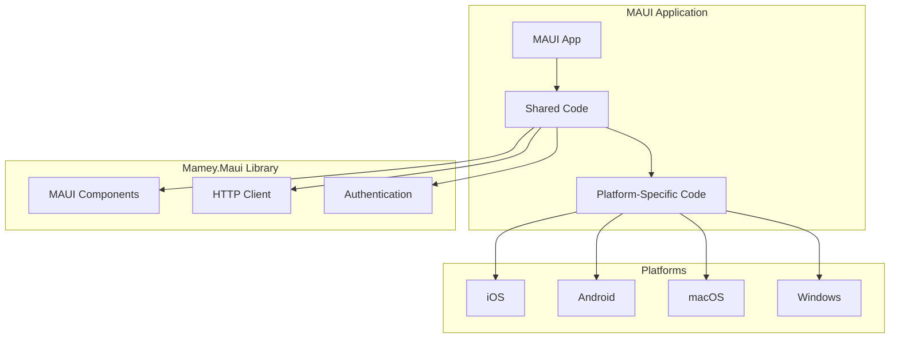

# Mamey.Maui

**Library**: `Mamey.Maui`  
**Location**: `Mamey/src/Mamey.Maui/`  
**Type**: UI Library - .NET MAUI  
**Version**: 2.0.*  
**Files**: 1 C# file  
**Namespace**: `Mamey.Maui`

## Overview

Mamey.Maui provides .NET MAUI (Multi-platform App UI) support for the Mamey framework, enabling cross-platform mobile and desktop applications. It allows developers to build native applications for iOS, Android, macOS, Windows, and more using a single codebase.

### Conceptual Foundation

**.NET MAUI** is Microsoft's framework for building native cross-platform applications. Key concepts:

1. **Cross-Platform**: Single codebase for multiple platforms
2. **Native Performance**: Native UI rendering and performance
3. **Platform-Specific**: Access to platform-specific APIs
4. **Shared Code**: Shared business logic across platforms
5. **Native Controls**: Platform-native UI controls

**Why Mamey.Maui?**

Provides:
- **MAUI Integration**: .NET MAUI integration
- **Cross-Platform**: Support for iOS, Android, macOS, Windows
- **Component Library**: Pre-built MAUI components
- **API Integration**: HTTP client integration for MAUI apps
- **Authentication**: Authentication support for MAUI apps

**Use Cases:**
- Cross-platform mobile applications
- Desktop applications
- Native mobile apps
- Single codebase for multiple platforms

## Architecture

### MAUI Application Architecture



## Installation

### Prerequisites

1. **.NET 9.0**: Ensure .NET 9.0 SDK is installed
2. **.NET MAUI**: .NET MAUI workload installed
3. **Platform SDKs**: Platform-specific SDKs (Xcode, Android SDK, etc.)

### NuGet Package

```bash
dotnet add package Mamey.Maui
```

### Dependencies

- **Mamey** - Core framework
- **Microsoft.Maui.Controls** - MAUI controls

## Quick Start

### Basic Setup

```csharp
using Mamey.Maui;

var builder = MauiApp.CreateBuilder();

builder.Services
    .AddMamey()
    .AddMaui();

var app = builder.Build();
app.Run();
```

## Usage Examples

### Example 1: Basic MAUI Page

```csharp
using Mamey.Maui;

public class MainPage : ContentPage
{
    public MainPage()
    {
        Content = new StackLayout
        {
            Children =
            {
                new Label { Text = "Welcome to Mamey!" }
            }
        };
    }
}
```

### Example 2: HTTP Client Integration

```csharp
using Mamey.Maui;

public class DataService
{
    private readonly HttpClient _httpClient;

    public DataService(HttpClient httpClient)
    {
        _httpClient = httpClient;
    }

    public async Task<string> GetDataAsync()
    {
        return await _httpClient.GetStringAsync("/api/data");
    }
}
```

## Related Libraries

- **Mamey.Http**: HTTP client integration
- **Mamey.Auth**: Authentication for mobile apps
- **Mamey.BlazorWasm**: Alternative web UI option

## Additional Resources

- [.NET MAUI Documentation](https://docs.microsoft.com/dotnet/maui/)
- [MAUI Getting Started](https://docs.microsoft.com/dotnet/maui/get-started/)
- [Mamey Framework Documentation](../../documentation/)
- [Mamey.Maui Memory Documentation](../../.skmemory/v1/memory/public/mid-term/libraries/ui/mamey-maui.md)

## Tags

#maui #mobile #cross-platform #ui #native #mamey

