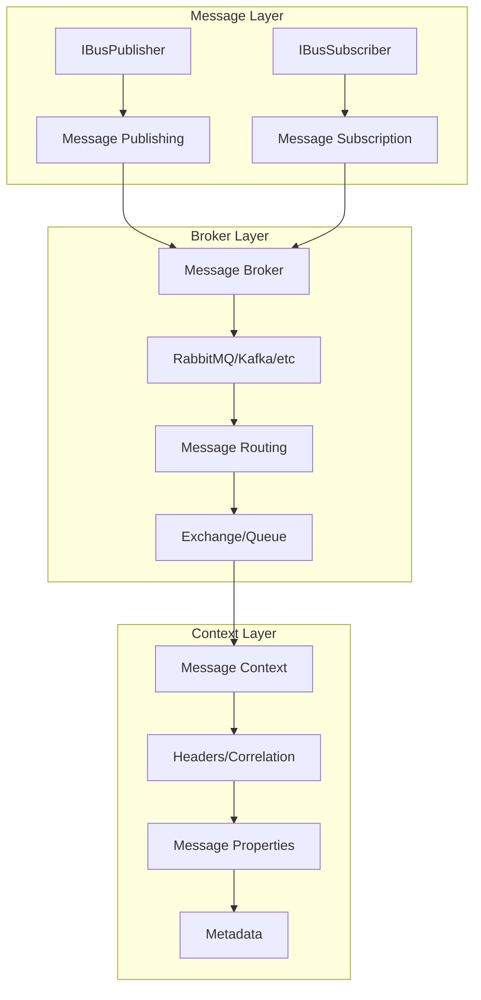
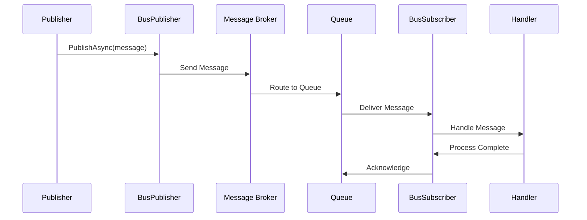
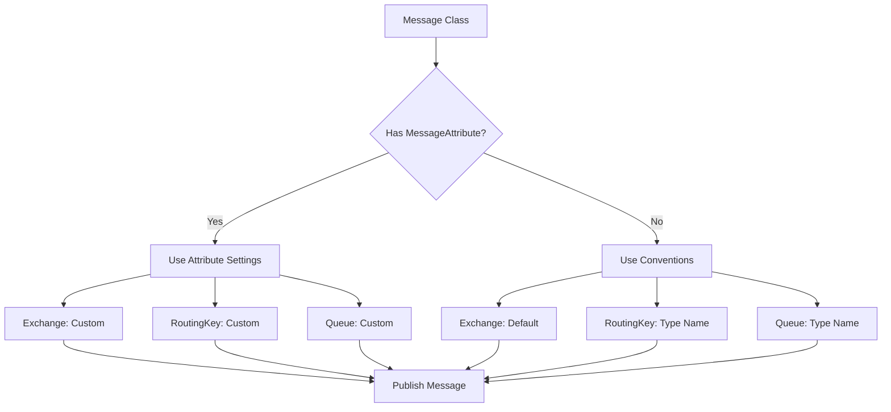
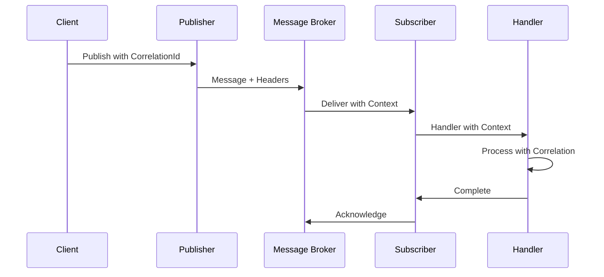

# Mamey.MessageBrokers

The Mamey.MessageBrokers library provides a comprehensive abstraction layer for message broker implementations in microservices architectures. It offers a unified interface for publishing and subscribing to messages across different message broker technologies, with built-in support for correlation context, message properties, and routing.

## Asynchronous Messaging in Mamey

**RabbitMQ Integration with CQRS, Jaeger, Outbox Patterns, and Dead Letter Queues**

Mamey's messaging module provides seamless RabbitMQ integration for .NET microservices, enabling asynchronous message handling across services using:
* RabbitMQ as the transport layer
* Declarative configuration and convention-based routing
* CQRS integration for commands and events
* Optional Jaeger tracing and Outbox support

This guide covers how to install, configure, publish, subscribe, trace, and guarantee delivery of messages using Mamey.

## Technical Overview

Mamey.MessageBrokers implements several key patterns:

- **Message Broker Abstraction**: Unified interface for different message broker implementations
- **Publisher-Subscriber Pattern**: Clean separation between message publishing and consumption
- **Correlation Context**: Built-in support for distributed tracing and correlation
- **Message Properties**: Rich metadata support for messages including headers and routing
- **Routing Configuration**: Declarative routing configuration using attributes
- **Dependency Injection**: Seamless integration with .NET DI container

## Architecture

The library follows a layered architecture:



### Message Broker Flow



### Message Routing with Attributes



### Message Context and Correlation



## Core Components

### Message Publishing
- **IBusPublisher**: Interface for publishing messages to message brokers
- **Message Routing**: Support for exchange, routing key, and queue configuration
- **Message Metadata**: Support for message ID, correlation ID, and custom headers

### Message Subscription
- **IBusSubscriber**: Interface for subscribing to messages from message brokers
- **Handler Registration**: Type-safe message handler registration
- **Disposable Pattern**: Proper resource cleanup for subscriptions

### Message Properties
- **IMessageProperties**: Interface for message metadata and properties
- **Correlation Context**: Support for distributed tracing and request correlation
- **Message Headers**: Custom header support for message routing and processing

### Routing Configuration
- **MessageAttribute**: Declarative configuration for message routing
- **Exchange Configuration**: Support for different exchange types
- **Queue Management**: Automatic queue creation and binding

## Installation

### NuGet Package
```bash
dotnet add package Mamey.MessageBrokers
```

### Prerequisites
- .NET 9.0 or later
- Mamey (core framework)
- Message broker implementation (RabbitMQ, Kafka, etc.)

## Key Features

- **Message Broker Abstraction**: Unified interface for different message brokers
- **Publisher-Subscriber Pattern**: Clean separation of concerns for messaging
- **Correlation Context**: Built-in support for distributed tracing
- **Message Properties**: Rich metadata support for messages
- **Routing Configuration**: Declarative routing using attributes
- **Dependency Injection**: Seamless integration with .NET DI container
- **Async Support**: Full async/await support for message operations
- **Error Handling**: Built-in error handling and retry mechanisms

## Quick Start

### Basic Setup

```csharp
using Mamey;
using Mamey.MessageBrokers;

var builder = WebApplication.CreateBuilder(args);

// Create Mamey builder
var mameyBuilder = MameyBuilder.Create(builder.Services, builder.Configuration);

// Add message broker (implementation-specific)
mameyBuilder.AddMessageBroker();

var app = builder.Build();
app.Run();
```

### Define Messages

```csharp
using Mamey.MessageBrokers;

// Simple message
public class UserCreatedMessage
{
    public Guid UserId { get; set; }
    public string Name { get; set; }
    public string Email { get; set; }
    public DateTime CreatedAt { get; set; }
}

// Message with routing configuration
[Message(exchange: "users", routingKey: "user.created")]
public class UserCreatedEvent
{
    public Guid UserId { get; set; }
    public string Name { get; set; }
    public string Email { get; set; }
    public DateTime CreatedAt { get; set; }
}

// Message with external routing
[Message(exchange: "external", routingKey: "notification.send", external: true)]
public class NotificationMessage
{
    public string Recipient { get; set; }
    public string Subject { get; set; }
    public string Body { get; set; }
}
```

### Publish Messages

```csharp
using Mamey.MessageBrokers;

public class UserService
{
    private readonly IBusPublisher _publisher;
    private readonly ILogger<UserService> _logger;

    public UserService(IBusPublisher publisher, ILogger<UserService> logger)
    {
        _publisher = publisher;
        _logger = logger;
    }

    public async Task CreateUserAsync(string name, string email)
    {
        var user = new User
        {
            Id = Guid.NewGuid(),
            Name = name,
            Email = email,
            CreatedAt = DateTime.UtcNow
        };

        // Save user to database
        await _userRepository.AddAsync(user);

        // Publish user created message
        var message = new UserCreatedMessage
        {
            UserId = user.Id,
            Name = user.Name,
            Email = user.Email,
            CreatedAt = user.CreatedAt
        };

        await _publisher.PublishAsync(message);
        _logger.LogInformation("User created and message published: {UserId}", user.Id);
    }

    public async Task PublishWithCorrelationAsync(string name, string email, string correlationId)
    {
        var message = new UserCreatedMessage
        {
            UserId = Guid.NewGuid(),
            Name = name,
            Email = email,
            CreatedAt = DateTime.UtcNow
        };

        // Publish with correlation ID for distributed tracing
        await _publisher.PublishAsync(
            message, 
            correlationId: correlationId,
            headers: new Dictionary<string, object>
            {
                ["source"] = "user-service",
                ["version"] = "1.0.0"
            });

        _logger.LogInformation("User message published with correlation: {CorrelationId}", correlationId);
    }
}
```

### Subscribe to Messages

```csharp
using Mamey.MessageBrokers;

public class UserEventHandler
{
    private readonly ILogger<UserEventHandler> _logger;

    public UserEventHandler(ILogger<UserEventHandler> logger)
    {
        _logger = logger;
    }

    public async Task HandleUserCreatedAsync(UserCreatedMessage message, object context)
    {
        _logger.LogInformation("Processing user created event: {UserId}", message.UserId);
        
        // Process the message
        await ProcessUserCreatedAsync(message);
    }

    private async Task ProcessUserCreatedAsync(UserCreatedMessage message)
    {
        // Send welcome email
        await _emailService.SendWelcomeEmailAsync(message.Email, message.Name);
        
        // Update analytics
        await _analyticsService.TrackUserCreatedAsync(message.UserId);
        
        _logger.LogInformation("User created event processed: {UserId}", message.UserId);
    }
}

// Register subscribers
public class MessageBrokerConfiguration
{
    public static void ConfigureSubscribers(IBusSubscriber subscriber, IServiceProvider serviceProvider)
    {
        subscriber.Subscribe<UserCreatedMessage>(async (sp, message, context) =>
        {
            var handler = sp.GetRequiredService<UserEventHandler>();
            await handler.HandleUserCreatedAsync(message, context);
        });
    }
}
```

## API Reference

### Core Interfaces

#### IBusPublisher

Interface for publishing messages to message brokers.

```csharp
public interface IBusPublisher
{
    Task PublishAsync<T>(T message, string messageId = null, string correlationId = null, 
        string spanContext = null, object messageContext = null, 
        IDictionary<string, object> headers = null) where T : class;
}
```

**Generic Parameters:**
- `T`: The type of message to publish (must be a class)

**Parameters:**
- `message`: The message object to publish
- `messageId`: Optional unique identifier for the message
- `correlationId`: Optional correlation ID for distributed tracing
- `spanContext`: Optional span context for distributed tracing
- `messageContext`: Optional context object for message processing
- `headers`: Optional custom headers for the message

**Methods:**
- `PublishAsync<T>()`: Publishes a message asynchronously

**Usage:**
```csharp
// Simple publish
await _publisher.PublishAsync(new UserCreatedMessage { UserId = Guid.NewGuid() });

// Publish with correlation
await _publisher.PublishAsync(message, correlationId: correlationId);

// Publish with headers
await _publisher.PublishAsync(message, headers: new Dictionary<string, object>
{
    ["source"] = "user-service",
    ["version"] = "1.0.0"
});
```

#### IBusSubscriber

Interface for subscribing to messages from message brokers.

```csharp
public interface IBusSubscriber : IDisposable
{
    IBusSubscriber Subscribe<T>(Func<IServiceProvider, T, object, Task> handle) where T : class;
}
```

**Generic Parameters:**
- `T`: The type of message to subscribe to (must be a class)

**Methods:**
- `Subscribe<T>(Func<IServiceProvider, T, object, Task> handle)`: Subscribes to messages of type T
- `Dispose()`: Disposes the subscriber and cleans up resources

**Parameters:**
- `handle`: Function that handles the message, receiving service provider, message, and context

**Usage:**
```csharp
subscriber.Subscribe<UserCreatedMessage>(async (sp, message, context) =>
{
    var handler = sp.GetRequiredService<UserEventHandler>();
    await handler.HandleAsync(message, context);
});
```

#### IMessageProperties

Interface for message metadata and properties.

```csharp
public interface IMessageProperties
{
    string MessageId { get; }
    string CorrelationId { get; }
    long Timestamp { get; }
    IDictionary<string, object> Headers { get; }
}
```

**Properties:**
- `MessageId`: Unique identifier for the message
- `CorrelationId`: Correlation ID for distributed tracing
- `Timestamp`: Unix timestamp when the message was created
- `Headers`: Custom headers for the message

#### ICorrelationContextAccessor

Interface for accessing correlation context in message handlers.

```csharp
public interface ICorrelationContextAccessor
{
    object CorrelationContext { get; set; }
}
```

**Properties:**
- `CorrelationContext`: The correlation context object for distributed tracing

### Core Classes

#### MessageProperties

Default implementation of message properties.

```csharp
public class MessageProperties : IMessageProperties
{
    public string MessageId { get; set; }
    public string CorrelationId { get; set; }
    public long Timestamp { get; set; }
    public IDictionary<string, object> Headers { get; set; }
}
```

#### MessageAttribute

Attribute for configuring message routing.

```csharp
[AttributeUsage(AttributeTargets.Class)]
public class MessageAttribute : Attribute
{
    public string Exchange { get; }
    public string RoutingKey { get; }
    public string Queue { get; }
    public bool External { get; }

    public MessageAttribute(string exchange = null, string routingKey = null, 
        string queue = null, bool external = false);
}
```

**Properties:**
- `Exchange`: The exchange name for message routing
- `RoutingKey`: The routing key for message routing
- `Queue`: The queue name for message consumption
- `External`: Whether the message is from an external system

## Usage Examples

### Example 1: Basic Message Publishing and Consumption

```csharp
using Mamey.MessageBrokers;

// Define message
public class OrderCreatedMessage
{
    public Guid OrderId { get; set; }
    public Guid CustomerId { get; set; }
    public decimal TotalAmount { get; set; }
    public DateTime CreatedAt { get; set; }
}

// Publisher
public class OrderService
{
    private readonly IBusPublisher _publisher;
    private readonly ILogger<OrderService> _logger;

    public OrderService(IBusPublisher publisher, ILogger<OrderService> logger)
    {
        _publisher = publisher;
        _logger = logger;
    }

    public async Task CreateOrderAsync(Guid customerId, decimal totalAmount)
    {
        var order = new Order
        {
            Id = Guid.NewGuid(),
            CustomerId = customerId,
            TotalAmount = totalAmount,
            CreatedAt = DateTime.UtcNow
        };

        // Save order
        await _orderRepository.AddAsync(order);

        // Publish message
        var message = new OrderCreatedMessage
        {
            OrderId = order.Id,
            CustomerId = order.CustomerId,
            TotalAmount = order.TotalAmount,
            CreatedAt = order.CreatedAt
        };

        await _publisher.PublishAsync(message);
        _logger.LogInformation("Order created and message published: {OrderId}", order.Id);
    }
}

// Subscriber
public class OrderEventHandler
{
    private readonly ILogger<OrderEventHandler> _logger;

    public OrderEventHandler(ILogger<OrderEventHandler> logger)
    {
        _logger = logger;
    }

    public async Task HandleOrderCreatedAsync(OrderCreatedMessage message, object context)
    {
        _logger.LogInformation("Processing order created event: {OrderId}", message.OrderId);
        
        // Send confirmation email
        await _emailService.SendOrderConfirmationAsync(message.CustomerId, message.OrderId);
        
        // Update inventory
        await _inventoryService.ReserveItemsAsync(message.OrderId);
        
        _logger.LogInformation("Order created event processed: {OrderId}", message.OrderId);
    }
}

// Registration
public class MessageBrokerConfiguration
{
    public static void ConfigureSubscribers(IBusSubscriber subscriber, IServiceProvider serviceProvider)
    {
        subscriber.Subscribe<OrderCreatedMessage>(async (sp, message, context) =>
        {
            var handler = sp.GetRequiredService<OrderEventHandler>();
            await handler.HandleOrderCreatedAsync(message, context);
        });
    }
}
```

### Example 2: Message with Routing Configuration

```csharp
using Mamey.MessageBrokers;

// Message with routing configuration
[Message(exchange: "orders", routingKey: "order.created")]
public class OrderCreatedEvent
{
    public Guid OrderId { get; set; }
    public Guid CustomerId { get; set; }
    public decimal TotalAmount { get; set; }
    public DateTime CreatedAt { get; set; }
}

// Message with external routing
[Message(exchange: "external", routingKey: "payment.processed", external: true)]
public class PaymentProcessedEvent
{
    public Guid OrderId { get; set; }
    public string TransactionId { get; set; }
    public decimal Amount { get; set; }
    public DateTime ProcessedAt { get; set; }
}

// Publisher with routing
public class OrderService
{
    private readonly IBusPublisher _publisher;

    public OrderService(IBusPublisher publisher)
    {
        _publisher = publisher;
    }

    public async Task CreateOrderAsync(Order order)
    {
        // Save order
        await _orderRepository.AddAsync(order);

        // Publish with routing
        var message = new OrderCreatedEvent
        {
            OrderId = order.Id,
            CustomerId = order.CustomerId,
            TotalAmount = order.TotalAmount,
            CreatedAt = order.CreatedAt
        };

        await _publisher.PublishAsync(message);
    }
}
```

### Example 3: Message with Correlation Context

```csharp
using Mamey.MessageBrokers;

public class UserService
{
    private readonly IBusPublisher _publisher;
    private readonly ICorrelationContextAccessor _correlationContextAccessor;

    public UserService(
        IBusPublisher publisher,
        ICorrelationContextAccessor correlationContextAccessor)
    {
        _publisher = publisher;
        _correlationContextAccessor = correlationContextAccessor;
    }

    public async Task CreateUserAsync(string name, string email)
    {
        var user = new User
        {
            Id = Guid.NewGuid(),
            Name = name,
            Email = email,
            CreatedAt = DateTime.UtcNow
        };

        // Save user
        await _userRepository.AddAsync(user);

        // Get correlation context
        var correlationContext = _correlationContextAccessor.CorrelationContext;
        var correlationId = correlationContext?.ToString() ?? Guid.NewGuid().ToString();

        // Publish with correlation
        var message = new UserCreatedMessage
        {
            UserId = user.Id,
            Name = user.Name,
            Email = user.Email,
            CreatedAt = user.CreatedAt
        };

        await _publisher.PublishAsync(
            message,
            correlationId: correlationId,
            headers: new Dictionary<string, object>
            {
                ["source"] = "user-service",
                ["version"] = "1.0.0",
                ["correlation-context"] = correlationContext
            });
    }
}

// Handler with correlation context
public class UserEventHandler
{
    private readonly ICorrelationContextAccessor _correlationContextAccessor;

    public UserEventHandler(ICorrelationContextAccessor correlationContextAccessor)
    {
        _correlationContextAccessor = correlationContextAccessor;
    }

    public async Task HandleUserCreatedAsync(UserCreatedMessage message, object context)
    {
        // Set correlation context for downstream processing
        _correlationContextAccessor.CorrelationContext = message.CorrelationId;

        // Process message
        await ProcessUserCreatedAsync(message);
    }

    private async Task ProcessUserCreatedAsync(UserCreatedMessage message)
    {
        // Send welcome email
        await _emailService.SendWelcomeEmailAsync(message.Email, message.Name);
        
        // Update analytics
        await _analyticsService.TrackUserCreatedAsync(message.UserId);
    }
}
```

### Example 4: Message with Custom Headers

```csharp
using Mamey.MessageBrokers;

public class NotificationService
{
    private readonly IBusPublisher _publisher;

    public NotificationService(IBusPublisher publisher)
    {
        _publisher = publisher;
    }

    public async Task SendNotificationAsync(string recipient, string subject, string body)
    {
        var message = new NotificationMessage
        {
            Recipient = recipient,
            Subject = subject,
            Body = body
        };

        // Publish with custom headers
        await _publisher.PublishAsync(
            message,
            headers: new Dictionary<string, object>
            {
                ["priority"] = "high",
                ["retry-count"] = 0,
                ["max-retries"] = 3,
                ["ttl"] = 3600000, // 1 hour in milliseconds
                ["source"] = "notification-service",
                ["version"] = "1.0.0"
            });
    }
}

// Handler with header processing
public class NotificationHandler
{
    public async Task HandleNotificationAsync(NotificationMessage message, object context)
    {
        // Process headers
        var headers = GetMessageHeaders(context);
        var priority = headers.GetValueOrDefault("priority", "normal").ToString();
        var retryCount = Convert.ToInt32(headers.GetValueOrDefault("retry-count", 0));
        var maxRetries = Convert.ToInt32(headers.GetValueOrDefault("max-retries", 3));

        try
        {
            // Send notification
            await _notificationService.SendAsync(message.Recipient, message.Subject, message.Body);
        }
        catch (Exception ex)
        {
            if (retryCount < maxRetries)
            {
                // Retry with incremented count
                await RetryNotificationAsync(message, retryCount + 1);
            }
            else
            {
                // Max retries exceeded, log error
                _logger.LogError(ex, "Failed to send notification after {MaxRetries} retries", maxRetries);
            }
        }
    }

    private IDictionary<string, object> GetMessageHeaders(object context)
    {
        // Extract headers from context (implementation-specific)
        return new Dictionary<string, object>();
    }
}
```

### Example 5: Message Broker Configuration

```csharp
using Mamey;
using Mamey.MessageBrokers;

public class Program
{
    public static void Main(string[] args)
    {
        var builder = WebApplication.CreateBuilder(args);

        // Create Mamey builder
        var mameyBuilder = MameyBuilder.Create(builder.Services, builder.Configuration);

        // Configure message broker
        mameyBuilder
            .AddMessageBroker()
            .AddMessageBrokerSubscribers();

        var app = builder.Build();

        // Configure message subscribers
        var subscriber = app.Services.GetRequiredService<IBusSubscriber>();
        ConfigureSubscribers(subscriber, app.Services);

        app.Run();
    }

    private static void ConfigureSubscribers(IBusSubscriber subscriber, IServiceProvider serviceProvider)
    {
        // User events
        subscriber.Subscribe<UserCreatedMessage>(async (sp, message, context) =>
        {
            var handler = sp.GetRequiredService<UserEventHandler>();
            await handler.HandleUserCreatedAsync(message, context);
        });

        // Order events
        subscriber.Subscribe<OrderCreatedMessage>(async (sp, message, context) =>
        {
            var handler = sp.GetRequiredService<OrderEventHandler>();
            await handler.HandleOrderCreatedAsync(message, context);
        });

        // Payment events
        subscriber.Subscribe<PaymentProcessedEvent>(async (sp, message, context) =>
        {
            var handler = sp.GetRequiredService<PaymentEventHandler>();
            await handler.HandlePaymentProcessedAsync(message, context);
        });
    }
}
```

## Integration Patterns

### Integration with Other Mamey Libraries

The MessageBrokers library integrates seamlessly with other Mamey libraries:

- **Mamey.CQRS.Events**: Events can be published through message brokers
- **Mamey.CQRS.Commands**: Commands can be sent through message brokers
- **Mamey.Logging**: Built-in logging support for message operations
- **Mamey.Tracing**: Integration with distributed tracing systems

### Integration with ASP.NET Core

```csharp
// Program.cs
var builder = WebApplication.CreateBuilder(args);

var mameyBuilder = MameyBuilder.Create(builder.Services, builder.Configuration);
mameyBuilder.AddMessageBroker();

var app = builder.Build();

// Configure subscribers
var subscriber = app.Services.GetRequiredService<IBusSubscriber>();
ConfigureSubscribers(subscriber, app.Services);

app.Run();
```

### Integration with Background Services

```csharp
public class MessageProcessingService : BackgroundService
{
    private readonly IBusSubscriber _subscriber;
    private readonly IServiceProvider _serviceProvider;

    public MessageProcessingService(IBusSubscriber subscriber, IServiceProvider serviceProvider)
    {
        _subscriber = subscriber;
        _serviceProvider = serviceProvider;
    }

    protected override async Task ExecuteAsync(CancellationToken stoppingToken)
    {
        // Configure subscribers
        _subscriber.Subscribe<UserCreatedMessage>(async (sp, message, context) =>
        {
            var handler = sp.GetRequiredService<UserEventHandler>();
            await handler.HandleAsync(message, context);
        });

        // Keep service running
        while (!stoppingToken.IsCancellationRequested)
        {
            await Task.Delay(1000, stoppingToken);
        }
    }
}
```

## Configuration Reference

### Service Registration

```csharp
// Register message broker
mameyBuilder.AddMessageBroker();

// Register with specific configuration
mameyBuilder.AddMessageBroker(options =>
{
    options.ConnectionString = "amqp://localhost:5672";
    options.ExchangeName = "mamey";
    options.QueueName = "mamey-queue";
});

// Register subscribers
mameyBuilder.AddMessageBrokerSubscribers();
```

### Message Routing Configuration

```csharp
// Using attributes
[Message(exchange: "users", routingKey: "user.created")]
public class UserCreatedEvent { }

// Using configuration
public class MessageBrokerConfiguration
{
    public static void ConfigureRouting(IMessageBrokerConfiguration config)
    {
        config.ConfigureMessage<UserCreatedEvent>(options =>
        {
            options.Exchange = "users";
            options.RoutingKey = "user.created";
            options.Queue = "user-created-queue";
        });
    }
}
```

## Best Practices

1. **Message Design**: Design messages to be immutable and serializable
2. **Error Handling**: Implement proper error handling and retry mechanisms
3. **Correlation**: Use correlation IDs for distributed tracing
4. **Headers**: Use headers for metadata and routing information
5. **Idempotency**: Make message handlers idempotent when possible
6. **Logging**: Add comprehensive logging for message operations
7. **Testing**: Write unit tests for message handlers
8. **Monitoring**: Monitor message throughput and error rates
9. **Dead Letter Queues**: Configure dead letter queues for failed messages
10. **Message Ordering**: Consider message ordering requirements

## Troubleshooting

### Common Issues

**Message Not Published**: Check message broker connection and configuration

**Message Not Received**: Verify subscriber registration and message routing

**Correlation Context Lost**: Ensure correlation context is properly propagated

**Headers Missing**: Check header serialization and deserialization

### Debugging

Enable detailed logging to troubleshoot issues:

```csharp
builder.Logging.AddConsole();
builder.Logging.SetMinimumLevel(LogLevel.Debug);
```

## Related Libraries

- [Mamey.MessageBrokers.RabbitMQ](MessageBrokers.RabbitMQ/README.md) - RabbitMQ implementation
- [Mamey.CQRS.Events](CQRS.Events/README.md) - Event handling and dispatching
- [Mamey.Logging](Logging/README.md) - Logging infrastructure
- [Mamey.Tracing](Tracing/README.md) - Distributed tracing

## Additional Resources

- [Message Broker Patterns](../guides/message-broker-patterns.md)
- [Event-Driven Architecture](../guides/event-driven-architecture.md)
- [Distributed Tracing](../guides/distributed-tracing.md)
- [Message Serialization](../guides/message-serialization.md)
