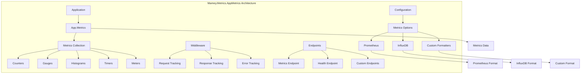

# Mamey.Metrics.AppMetrics

A comprehensive metrics collection library for the Mamey framework, providing App.Metrics integration for application performance monitoring. This library enables collection of various metrics including counters, gauges, histograms, and timers, with support for multiple output formats and reporting destinations.

## Table of Contents

- [Overview](#overview)
- [Key Features](#key-features)
- [Architecture](#architecture)
- [Installation](#installation)
- [Quick Start](#quick-start)
- [Core Components](#core-components)
- [API Reference](#api-reference)
- [Usage Examples](#usage-examples)
- [Configuration](#configuration)
- [Best Practices](#best-practices)
- [Troubleshooting](#troubleshooting)

## Overview

Mamey.Metrics.AppMetrics is a comprehensive metrics collection library that provides App.Metrics integration for the Mamey framework. It enables collection of various metrics including counters, gauges, histograms, and timers, with support for multiple output formats and reporting destinations.

### Technical Overview

The library provides:

- **Metrics Collection**: Counters, gauges, histograms, meters, and timers
- **Multiple Outputs**: Prometheus, InfluxDB, and custom formatters
- **Health Checks**: Built-in health check system
- **Middleware**: Automatic request/response tracking
- **Endpoints**: Expose metrics via HTTP endpoints
- **Performance**: High-performance metrics collection with minimal overhead
- **Flexibility**: Configurable metrics collection and reporting

## Key Features

### Core Features

- **Metrics Collection**: Counters, gauges, histograms, meters, and timers
- **Multiple Outputs**: Prometheus, InfluxDB, and custom formatters
- **Health Checks**: Built-in health check system
- **Middleware**: Automatic request/response tracking
- **Endpoints**: Expose metrics via HTTP endpoints
- **Performance**: High-performance metrics collection with minimal overhead
- **Flexibility**: Configurable metrics collection and reporting

### Advanced Features

- **Custom Metrics**: Support for custom metric types
- **Tagging**: Rich tagging system for metric categorization
- **Sampling**: Configurable sampling for performance
- **Batch Processing**: Efficient batch processing for metrics
- **Error Handling**: Comprehensive error handling and logging
- **Configuration**: Flexible configuration options
- **Integration**: Easy integration with monitoring systems

## Architecture



## Installation

### Package Manager
```bash
Install-Package Mamey.Metrics.AppMetrics
```

### .NET CLI
```bash
dotnet add package Mamey.Metrics.AppMetrics
```

### PackageReference
```xml
<PackageReference Include="Mamey.Metrics.AppMetrics" Version="2.0.*" />
```

## Quick Start

### Basic Setup

```csharp
using Mamey.Metrics.AppMetrics;

var builder = WebApplication.CreateBuilder(args);

// Add Mamey services
builder.Services.AddMamey()
    .AddMetrics();

var app = builder.Build();

// Use metrics middleware
app.UseMetrics();

app.Run();
```

### With Custom Configuration

```csharp
builder.Services.AddMamey()
    .AddMetrics(options =>
    {
        options.Enabled = true;
        options.PrometheusEnabled = true;
        options.PrometheusFormatter = "text";
        options.Tags = new Dictionary<string, string>
        {
            ["app"] = "my-service",
            ["env"] = "production"
        };
    });
```

### With Configuration File

```csharp
// appsettings.json
{
  "metrics": {
    "enabled": true,
    "prometheusEnabled": true,
    "prometheusFormatter": "text",
    "tags": {
      "app": "my-service",
      "env": "production"
    }
  }
}

// Program.cs
builder.Services.AddMamey()
    .AddMetrics();
```

## Core Components

### Configuration System

#### MetricsOptions
```csharp
public class MetricsOptions
{
    public bool Enabled { get; set; }
    public bool InfluxEnabled { get; set; }
    public bool PrometheusEnabled { get; set; }
    public string PrometheusFormatter { get; set; }
    public string InfluxUrl { get; set; }
    public string Database { get; set; }
    public int Interval { get; set; }
    public IDictionary<string, string> Tags { get; set; }
}
```

### Builder Pattern

#### IMetricsOptionsBuilder
```csharp
public interface IMetricsOptionsBuilder
{
    IMetricsOptionsBuilder Enabled(bool enabled);
    IMetricsOptionsBuilder InfluxEnabled(bool influxEnabled);
    IMetricsOptionsBuilder PrometheusEnabled(bool prometheusEnabled);
    IMetricsOptionsBuilder PrometheusFormatter(string prometheusFormatter);
    IMetricsOptionsBuilder InfluxUrl(string influxUrl);
    IMetricsOptionsBuilder Database(string database);
    IMetricsOptionsBuilder Interval(int interval);
    IMetricsOptionsBuilder Tags(IDictionary<string, string> tags);
    MetricsOptions Build();
}
```

#### MetricsOptionsBuilder
```csharp
public class MetricsOptionsBuilder : IMetricsOptionsBuilder
{
    // Implementation of IMetricsOptionsBuilder
}
```

## API Reference

### Extension Methods

#### IMameyBuilder Extensions

```csharp
public static IMameyBuilder AddMetrics(
    this IMameyBuilder builder,
    string metricsSectionName = "metrics",
    string appSectionName = "app");

public static IMameyBuilder AddMetrics(
    this IMameyBuilder builder,
    Func<IMetricsOptionsBuilder, IMetricsOptionsBuilder> buildOptions,
    string appSectionName = "app");

public static IMameyBuilder AddMetrics(
    this IMameyBuilder builder,
    MetricsOptions metricsOptions,
    AppOptions appOptions);
```

#### IApplicationBuilder Extensions

```csharp
public static IApplicationBuilder UseMetrics(this IApplicationBuilder app);
```

### Configuration Options

#### MetricsOptions
```csharp
public class MetricsOptions
{
    public bool Enabled { get; set; }                    // Enable/disable metrics
    public bool InfluxEnabled { get; set; }              // Enable InfluxDB reporting
    public bool PrometheusEnabled { get; set; }          // Enable Prometheus endpoint
    public string PrometheusFormatter { get; set; }      // Prometheus formatter (text/protobuf)
    public string InfluxUrl { get; set; }                // InfluxDB URL
    public string Database { get; set; }                 // InfluxDB database name
    public int Interval { get; set; }                    // Reporting interval in seconds
    public IDictionary<string, string> Tags { get; set; } // Global tags
}
```

## Usage Examples

### Basic Metrics Setup

```csharp
public class Program
{
    public static void Main(string[] args)
    {
        var builder = WebApplication.CreateBuilder(args);

        // Add Mamey services with metrics
        builder.Services.AddMamey()
            .AddMetrics();

        var app = builder.Build();

        // Use metrics middleware
        app.UseMetrics();

        app.Run();
    }
}
```

### With Custom Configuration

```csharp
builder.Services.AddMamey()
    .AddMetrics(options =>
    {
        options.Enabled = true;
        options.PrometheusEnabled = true;
        options.PrometheusFormatter = "text";
        options.Tags = new Dictionary<string, string>
        {
            ["app"] = "my-service",
            ["env"] = "production",
            ["version"] = "1.0.0"
        };
    });
```

### With InfluxDB Reporting

```csharp
builder.Services.AddMamey()
    .AddMetrics(options =>
    {
        options.Enabled = true;
        options.InfluxEnabled = true;
        options.InfluxUrl = "http://localhost:8086";
        options.Database = "myapp_metrics";
        options.Interval = 10;
        options.Tags = new Dictionary<string, string>
        {
            ["app"] = "my-service",
            ["env"] = "production"
        };
    });
```

### With Configuration File

```csharp
// appsettings.json
{
  "metrics": {
    "enabled": true,
    "prometheusEnabled": true,
    "prometheusFormatter": "text",
    "influxEnabled": true,
    "influxUrl": "http://localhost:8086",
    "database": "myapp_metrics",
    "interval": 10,
    "tags": {
      "app": "my-service",
      "env": "production",
      "version": "1.0.0"
    }
  }
}

// Program.cs
builder.Services.AddMamey()
    .AddMetrics();
```

### Using in Services

```csharp
public class UserService
{
    private readonly IMetrics _metrics;

    public UserService(IMetrics metrics)
    {
        _metrics = metrics;
    }

    public async Task<User> CreateUserAsync(CreateUserRequest request)
    {
        // Increment counter
        _metrics.Measure.Counter.Increment(new CounterOptions
        {
            Name = "users_created_total",
            Tags = new MetricTags("service", "user-service")
        });

        // Start timer
        using var timer = _metrics.Measure.Timer.Time(new TimerOptions
        {
            Name = "user_creation_duration",
            Tags = new MetricTags("service", "user-service")
        });

        try
        {
            // Business logic here
            var user = await ProcessUserCreationAsync(request);
            
            // Record success
            _metrics.Measure.Counter.Increment(new CounterOptions
            {
                Name = "users_created_success_total",
                Tags = new MetricTags("service", "user-service")
            });
            
            return user;
        }
        catch (Exception ex)
        {
            // Record error
            _metrics.Measure.Counter.Increment(new CounterOptions
            {
                Name = "users_created_error_total",
                Tags = new MetricTags("service", "user-service", "error", ex.GetType().Name)
            });
            throw;
        }
    }
}
```

### Custom Metrics Examples

```csharp
public class OrderService
{
    private readonly IMetrics _metrics;

    public OrderService(IMetrics metrics)
    {
        _metrics = metrics;
    }

    public async Task<Order> ProcessOrderAsync(OrderRequest request)
    {
        // Counter for total orders
        _metrics.Measure.Counter.Increment(new CounterOptions
        {
            Name = "orders_processed_total",
            Tags = new MetricTags("service", "order-service")
        });

        // Gauge for order amount
        _metrics.Measure.Gauge.SetValue(new GaugeOptions
        {
            Name = "order_amount",
            Tags = new MetricTags("service", "order-service")
        }, request.Amount);

        // Histogram for order processing time
        using var timer = _metrics.Measure.Timer.Time(new TimerOptions
        {
            Name = "order_processing_duration",
            Tags = new MetricTags("service", "order-service")
        });

        try
        {
            // Process order
            var order = await ProcessOrderInternalAsync(request);
            
            // Record success metrics
            _metrics.Measure.Counter.Increment(new CounterOptions
            {
                Name = "orders_processed_success_total",
                Tags = new MetricTags("service", "order-service")
            });

            return order;
        }
        catch (Exception ex)
        {
            // Record error metrics
            _metrics.Measure.Counter.Increment(new CounterOptions
            {
                Name = "orders_processed_error_total",
                Tags = new MetricTags("service", "order-service", "error", ex.GetType().Name)
            });
            throw;
        }
    }
}
```

## Configuration

### Basic Configuration

```csharp
builder.Services.AddMamey()
    .AddMetrics();
```

### With Custom Options

```csharp
builder.Services.AddMamey()
    .AddMetrics(options =>
    {
        options.Enabled = true;
        options.PrometheusEnabled = true;
        options.PrometheusFormatter = "text";
    });
```

### With Configuration Section

```csharp
// appsettings.json
{
  "metrics": {
    "enabled": true,
    "prometheusEnabled": true,
    "prometheusFormatter": "text"
  }
}

// Program.cs
builder.Services.AddMamey()
    .AddMetrics();
```

### Advanced Configuration

```csharp
// appsettings.json
{
  "metrics": {
    "enabled": true,
    "prometheusEnabled": true,
    "prometheusFormatter": "text",
    "influxEnabled": true,
    "influxUrl": "http://localhost:8086",
    "database": "myapp_metrics",
    "interval": 10,
    "tags": {
      "app": "my-service",
      "env": "production",
      "version": "1.0.0",
      "region": "us-east-1"
    }
  }
}
```

## Best Practices

### Metric Naming

1. **Use Descriptive Names**: Use descriptive names for metrics
2. **Follow Conventions**: Follow Prometheus naming conventions
3. **Use Consistent Naming**: Use consistent naming across your application
4. **Include Units**: Include units in metric names when appropriate

```csharp
// Good: Descriptive metric names
"users_created_total"
"order_processing_duration_seconds"
"http_requests_total"
"database_connections_active"

// Bad: Generic metric names
"counter1"
"timer1"
"gauge1"
```

### Tagging

1. **Use Consistent Tags**: Use consistent tag names across your application
2. **Add Context**: Add relevant context to metrics
3. **Include Identifiers**: Include relevant identifiers in tags
4. **Avoid High Cardinality**: Avoid high cardinality tags

```csharp
// Good: Meaningful tags
new MetricTags("service", "user-service", "method", "create")
new MetricTags("database", "users", "operation", "insert")
new MetricTags("http_method", "POST", "status_code", "200")

// Bad: High cardinality tags
new MetricTags("user_id", userId) // High cardinality
new MetricTags("timestamp", DateTime.UtcNow.ToString()) // High cardinality
```

### Performance Considerations

1. **Use Appropriate Metrics**: Use appropriate metric types for your use case
2. **Avoid Expensive Operations**: Don't perform expensive operations in metric collection
3. **Use Sampling**: Use sampling for high-volume metrics
4. **Monitor Performance**: Monitor metrics collection performance

```csharp
// Good: Appropriate metric types
_metrics.Measure.Counter.Increment(counterOptions); // For counting events
_metrics.Measure.Gauge.SetValue(gaugeOptions, value); // For current values
_metrics.Measure.Timer.Time(timerOptions, () => operation()); // For timing operations

// Good: Sampling for high-volume metrics
if (Random.NextDouble() < 0.1) // 10% sampling
{
    _metrics.Measure.Counter.Increment(counterOptions);
}
```

### Error Handling

1. **Handle Metric Errors**: Handle errors in metric collection gracefully
2. **Don't Fail on Metrics**: Don't let metric collection failures affect business logic
3. **Log Metric Errors**: Log metric collection errors
4. **Use Try-Catch**: Use try-catch blocks around metric operations

```csharp
try
{
    _metrics.Measure.Counter.Increment(counterOptions);
}
catch (Exception ex)
{
    // Log error but don't fail the operation
    _logger.LogWarning(ex, "Failed to record metric");
}
```

## Troubleshooting

### Common Issues

#### 1. Metrics Not Appearing

**Problem**: Metrics are not appearing in Prometheus or InfluxDB.

**Solution**: Check configuration and ensure metrics are properly enabled.

```csharp
// Verify metrics are enabled
builder.Services.AddMamey()
    .AddMetrics(options =>
    {
        options.Enabled = true; // Ensure metrics are enabled
        options.PrometheusEnabled = true; // Ensure Prometheus is enabled
    });
```

#### 2. Performance Issues

**Problem**: Metrics collection is causing performance issues.

**Solution**: Optimize metric collection and use appropriate sampling.

```csharp
// Use sampling for high-volume metrics
if (Random.NextDouble() < 0.01) // 1% sampling
{
    _metrics.Measure.Counter.Increment(counterOptions);
}
```

#### 3. Memory Issues

**Problem**: High memory usage due to metrics collection.

**Solution**: Configure appropriate intervals and batch sizes.

```csharp
// Configure reporting interval
builder.Services.AddMamey()
    .AddMetrics(options =>
    {
        options.Interval = 30; // Report every 30 seconds
    });
```

#### 4. InfluxDB Connection Issues

**Problem**: Cannot connect to InfluxDB.

**Solution**: Check InfluxDB configuration and connectivity.

```csharp
// Verify InfluxDB configuration
builder.Services.AddMamey()
    .AddMetrics(options =>
    {
        options.InfluxEnabled = true;
        options.InfluxUrl = "http://localhost:8086"; // Verify URL
        options.Database = "myapp_metrics"; // Verify database name
    });
```

### Debugging Tips

1. **Enable Debug Logging**: Use debug level for troubleshooting
2. **Check Endpoints**: Verify metrics endpoints are accessible
3. **Monitor Performance**: Monitor metrics collection performance
4. **Use Health Checks**: Use health checks to verify metrics system

```csharp
// Enable debug logging
builder.Logging.SetMinimumLevel(LogLevel.Debug);

// Add metrics with debug options
builder.Services.AddMamey()
    .AddMetrics(options =>
    {
        options.Enabled = true;
        options.PrometheusEnabled = true;
    });
```

### Performance Monitoring

1. **Metric Volume**: Monitor metric volume and growth
2. **Collection Performance**: Monitor metrics collection performance
3. **Memory Usage**: Monitor memory usage for metrics
4. **Network Traffic**: Monitor network traffic to reporting systems

```csharp
// Monitor metric volume
builder.Services.AddMamey()
    .AddMetrics(options =>
    {
        options.Interval = 60; // Report every minute
        options.Tags = new Dictionary<string, string>
        {
            ["environment"] = "production"
        };
    });
```

## License

This project is licensed under the MIT License - see the [LICENSE](LICENSE) file for details.

## Contributing

Please read [CONTRIBUTING.md](CONTRIBUTING.md) for details on our code of conduct and the process for submitting pull requests.

## Support

For support and questions, please open an issue in the [GitHub repository](https://github.com/mamey-io/mamey-metrics-appmetrics/issues).
