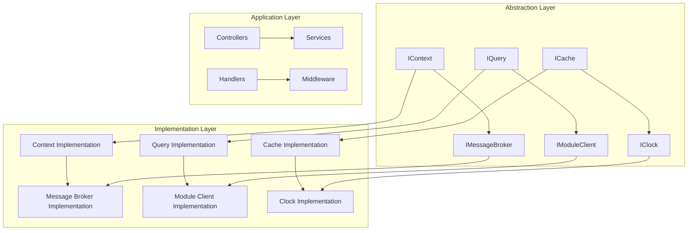

# Mamey.MicroMonolith.Abstractions

The Mamey.MicroMonolith.Abstractions library provides the core abstractions and interfaces for building modular monolith applications with the Mamey framework. It defines the contracts and data structures that enable a unified development experience across different implementations and infrastructure providers.

## Technical Overview

Mamey.MicroMonolith.Abstractions serves as the foundation for the Mamey modular monolith system by providing:

- **Core Interfaces**: Essential interfaces for modular monolith operations
- **Context Abstractions**: Request context and identity management interfaces
- **Messaging Abstractions**: Message broker and communication interfaces
- **Query Abstractions**: Query pattern interfaces and implementations
- **Module Abstractions**: Module system interfaces
- **Storage Abstractions**: Data storage and caching interfaces
- **Time Abstractions**: Clock and time management interfaces
- **Exception Abstractions**: Error handling and mapping interfaces
- **Contract Abstractions**: API contract definitions
- **Utility Extensions**: Common utility methods and extensions

## Architecture

The library provides a clean abstraction layer that enables different modular monolith implementations:



## Core Components

### Context Abstractions
- **IContext**: Request context interface
- **IIdentityContext**: Identity context interface
- **Context Management**: Request-scoped context management

### Messaging Abstractions
- **IMessageBroker**: Message broker interface
- **IMessageContext**: Message context interface
- **IMessageContextProvider**: Message context provider interface
- **MessageAttribute**: Message routing attribute

### Query Abstractions
- **IQuery**: Base query interface
- **IQueryHandler**: Query handler interface
- **IQueryDispatcher**: Query dispatcher interface
- **IFilter**: Query filter interface
- **IPagedQuery**: Paginated query interface
- **IPagedFilter**: Paginated filter interface

### Module Abstractions
- **IModuleClient**: Module client interface
- **IModuleSubscriber**: Module subscriber interface
- **Module Communication**: Inter-module communication

### Storage Abstractions
- **IRequestStorage**: Request storage interface
- **Storage Management**: Data storage management

### Time Abstractions
- **IClock**: Clock interface
- **Time Management**: Time-related operations

### Exception Abstractions
- **IExceptionToResponseMapper**: Exception mapping interface
- **ExceptionResponse**: Exception response model
- **Error Handling**: Error handling abstractions

### Contract Abstractions
- **IContract**: API contract interface
- **Contract Management**: API contract definitions

## Installation

### NuGet Package
```bash
dotnet add package Mamey.MicroMonolith.Abstractions
```

### Prerequisites
- .NET 9.0 or later
- Mamey (core framework)
- Mamey.CQRS (Commands, Events, Queries)

## Key Features

### Core Abstraction Features

- **Unified Interfaces**: Common interfaces for all modular monolith operations
- **Provider Agnostic**: Works with any modular monolith implementation
- **Type Safety**: Strongly typed interfaces and data structures
- **Extensibility**: Easy to extend with custom implementations
- **Dependency Injection**: Full dependency injection support
- **Async/Await**: Modern async programming patterns
- **Error Handling**: Comprehensive exception handling
- **Context Management**: Request-scoped context management

### Context Features

- **Request Context**: Request-scoped context management
- **Identity Context**: User identity and authentication context
- **Correlation Tracking**: Request correlation and tracing
- **Context Propagation**: Context propagation across boundaries

### Messaging Features

- **Message Brokers**: Unified message broker interface
- **Message Context**: Request-scoped message context
- **Message Routing**: Message routing and delivery
- **Async Messaging**: Asynchronous message processing

### Query Features

- **Query Pattern**: CQRS query pattern support
- **Query Handlers**: Query handler implementations
- **Query Dispatching**: Query dispatching and routing
- **Filtering**: Query filtering capabilities
- **Pagination**: Paginated query support

### Module Features

- **Module Communication**: Inter-module communication
- **Module Discovery**: Module discovery and registration
- **Module Lifecycle**: Module lifecycle management
- **Module Serialization**: Message serialization

### Storage Features

- **Request Storage**: Request-scoped storage
- **Data Persistence**: Data persistence abstractions
- **Cache Management**: Caching abstractions

### Time Features

- **Clock Abstraction**: Time-related operations
- **Time Management**: Time zone and clock management
- **Timestamp Operations**: Timestamp utilities

## Quick Start

### Basic Setup

```csharp
using Mamey.MicroMonolith.Abstractions;

// Register services
builder.Services.AddScoped<IContext, Context>();
builder.Services.AddScoped<IMessageBroker, InMemoryMessageBroker>();
builder.Services.AddScoped<IClock, UtcClock>();
```

### Basic Usage

```csharp
using Mamey.MicroMonolith.Abstractions;

public class UserService
{
    private readonly IContext _context;
    private readonly IMessageBroker _messageBroker;
    private readonly IClock _clock;

    public UserService(IContext context, IMessageBroker messageBroker, IClock clock)
    {
        _context = context;
        _messageBroker = messageBroker;
        _clock = clock;
    }

    public async Task<string> CreateUserAsync(CreateUserRequest request)
    {
        // Create user with context information
        var user = new User
        {
            Id = Guid.NewGuid(),
            Name = request.Name,
            Email = request.Email,
            CreatedAt = _clock.CurrentDateTime(),
            CreatedBy = _context.Identity.UserId
        };

        // Publish user created event
        var userCreatedEvent = new UserCreatedEvent
        {
            UserId = user.Id,
            Name = user.Name,
            Email = user.Email,
            CreatedAt = user.CreatedAt,
            CorrelationId = _context.CorrelationId
        };

        await _messageBroker.PublishAsync(userCreatedEvent);

        return user.Id.ToString();
    }
}
```

## API Reference

### Core Interfaces

#### IContext

Interface for request context management.

```csharp
public interface IContext
{
    Guid RequestId { get; }
    Guid CorrelationId { get; }
    string TraceId { get; }
    string IpAddress { get; }
    string UserAgent { get; }
    IIdentityContext Identity { get; }
}
```

**Properties:**
- `RequestId`: Unique request identifier
- `CorrelationId`: Request correlation identifier
- `TraceId`: Request trace identifier
- `IpAddress`: Client IP address
- `UserAgent`: Client user agent
- `Identity`: User identity context

#### IIdentityContext

Interface for identity context management.

```csharp
public interface IIdentityContext
{
    string UserId { get; }
    string Role { get; }
    bool IsAuthenticated { get; }
    IDictionary<string, string> Claims { get; }
}
```

**Properties:**
- `UserId`: User identifier
- `Role`: User role
- `IsAuthenticated`: Authentication status
- `Claims`: User claims

#### IMessageBroker

Interface for message broker operations.

```csharp
public interface IMessageBroker
{
    Task PublishAsync(IMessage message, CancellationToken cancellationToken = default);
    Task PublishAsync(IMessage[] messages, CancellationToken cancellationToken = default);
}
```

**Methods:**
- `PublishAsync(IMessage message)`: Publishes a single message
- `PublishAsync(IMessage[] messages)`: Publishes multiple messages

#### IQuery

Base interface for queries.

```csharp
public interface IQuery
{
}
```

#### IQueryHandler

Interface for query handlers.

```csharp
public interface IQueryHandler<TQuery, TResult> where TQuery : IQuery
{
    Task<TResult> HandleAsync(TQuery query, CancellationToken cancellationToken = default);
}
```

**Methods:**
- `HandleAsync(TQuery query, CancellationToken cancellationToken)`: Handles a query

#### IQueryDispatcher

Interface for query dispatching.

```csharp
public interface IQueryDispatcher
{
    Task<TResult> QueryAsync<TQuery, TResult>(TQuery query, CancellationToken cancellationToken = default) 
        where TQuery : IQuery;
}
```

**Methods:**
- `QueryAsync<TQuery, TResult>(TQuery query, CancellationToken cancellationToken)`: Dispatches a query

#### IClock

Interface for time operations.

```csharp
public interface IClock
{
    DateTime CurrentDateTime();
    DateTimeOffset CurrentDateTimeOffset();
    long CurrentTimestamp();
}
```

**Methods:**
- `CurrentDateTime()`: Gets current date and time
- `CurrentDateTimeOffset()`: Gets current date and time with offset
- `CurrentTimestamp()`: Gets current timestamp

### Core Classes

#### PagedQuery

Base class for paginated queries.

```csharp
public abstract class PagedQuery : IQuery
{
    public int Page { get; set; } = 1;
    public int Results { get; set; } = 10;
    public string OrderBy { get; set; }
    public string SortOrder { get; set; } = "asc";
}
```

**Properties:**
- `Page`: Page number
- `Results`: Number of results per page
- `OrderBy`: Field to order by
- `SortOrder`: Sort order (asc/desc)

#### Paged

Generic paginated result class.

```csharp
public class Paged<T>
{
    public IEnumerable<T> Items { get; set; }
    public int CurrentPage { get; set; }
    public int ResultsPerPage { get; set; }
    public int TotalPages { get; set; }
    public long TotalResults { get; set; }
}
```

**Properties:**
- `Items`: Paginated items
- `CurrentPage`: Current page number
- `ResultsPerPage`: Results per page
- `TotalPages`: Total number of pages
- `TotalResults`: Total number of results

## Usage Examples

### Example 1: Context Usage

```csharp
using Mamey.MicroMonolith.Abstractions;

public class UserController : ControllerBase
{
    private readonly IContext _context;
    private readonly IUserService _userService;

    public UserController(IContext context, IUserService userService)
    {
        _context = context;
        _userService = userService;
    }

    [HttpGet("{id}")]
    public async Task<IActionResult> GetUser(Guid id)
    {
        // Log request with context information
        _logger.LogInformation("Getting user {UserId} for request {RequestId}", 
            id, _context.RequestId);

        var user = await _userService.GetUserAsync(id);
        if (user == null)
        {
            return NotFound();
        }

        return Ok(user);
    }
}
```

### Example 2: Query Usage

```csharp
using Mamey.MicroMonolith.Abstractions;

public class GetUsersQuery : IQuery
{
    public string SearchTerm { get; set; }
    public int Page { get; set; } = 1;
    public int Results { get; set; } = 10;
}

public class GetUsersQueryHandler : IQueryHandler<GetUsersQuery, Paged<User>>
{
    private readonly IUserRepository _userRepository;

    public GetUsersQueryHandler(IUserRepository userRepository)
    {
        _userRepository = userRepository;
    }

    public async Task<Paged<User>> HandleAsync(GetUsersQuery query, CancellationToken cancellationToken = default)
    {
        var users = await _userRepository.GetUsersAsync(query.SearchTerm, query.Page, query.Results);
        return users;
    }
}
```

### Example 3: Messaging Usage

```csharp
using Mamey.MicroMonolith.Abstractions;

public class UserService
{
    private readonly IMessageBroker _messageBroker;
    private readonly IContext _context;

    public UserService(IMessageBroker messageBroker, IContext context)
    {
        _messageBroker = messageBroker;
        _context = context;
    }

    public async Task CreateUserAsync(CreateUserCommand command)
    {
        // Create user logic
        var user = new User
        {
            Id = Guid.NewGuid(),
            Name = command.Name,
            Email = command.Email
        };

        // Publish user created event with context
        var userCreatedEvent = new UserCreatedEvent
        {
            UserId = user.Id,
            Name = user.Name,
            Email = user.Email,
            CreatedAt = DateTime.UtcNow,
            CorrelationId = _context.CorrelationId,
            RequestId = _context.RequestId
        };

        await _messageBroker.PublishAsync(userCreatedEvent);
    }
}
```

### Example 4: Module Communication

```csharp
using Mamey.MicroMonolith.Abstractions;

public class UserModule : IModule
{
    private readonly IModuleClient _moduleClient;

    public UserModule(IModuleClient moduleClient)
    {
        _moduleClient = moduleClient;
    }

    public async Task ProcessOrderAsync(ProcessOrderCommand command)
    {
        // Send message to order module
        var orderCreatedEvent = new OrderCreatedEvent
        {
            OrderId = command.OrderId,
            UserId = command.UserId,
            Amount = command.Amount
        };

        await _moduleClient.PublishAsync(orderCreatedEvent);
    }
}
```

### Example 5: Time Usage

```csharp
using Mamey.MicroMonolith.Abstractions;

public class AuditService
{
    private readonly IClock _clock;

    public AuditService(IClock clock)
    {
        _clock = clock;
    }

    public async Task LogActionAsync(string action, string userId)
    {
        var auditLog = new AuditLog
        {
            Id = Guid.NewGuid(),
            Action = action,
            UserId = userId,
            Timestamp = _clock.CurrentTimestamp(),
            DateTime = _clock.CurrentDateTime()
        };

        await _auditRepository.AddAsync(auditLog);
    }
}
```

## Integration Patterns

### Integration with Dependency Injection

```csharp
// Program.cs
var builder = WebApplication.CreateBuilder(args);

// Register abstractions
builder.Services.AddScoped<IContext, Context>();
builder.Services.AddScoped<IMessageBroker, InMemoryMessageBroker>();
builder.Services.AddScoped<IClock, UtcClock>();
builder.Services.AddScoped<IQueryDispatcher, QueryDispatcher>();

var app = builder.Build();
app.Run();
```

### Integration with Custom Implementations

```csharp
public class CustomContext : IContext
{
    public Guid RequestId { get; } = Guid.NewGuid();
    public Guid CorrelationId { get; } = Guid.NewGuid();
    public string TraceId { get; } = Guid.NewGuid().ToString();
    public string IpAddress { get; } = "127.0.0.1";
    public string UserAgent { get; } = "CustomAgent/1.0";
    public IIdentityContext Identity { get; } = new CustomIdentityContext();
}

public class CustomIdentityContext : IIdentityContext
{
    public string UserId { get; } = "system";
    public string Role { get; } = "admin";
    public bool IsAuthenticated { get; } = true;
    public IDictionary<string, string> Claims { get; } = new Dictionary<string, string>();
}
```

## Configuration Reference

### Service Registration

```csharp
// Register all abstractions
builder.Services.AddScoped<IContext, Context>();
builder.Services.AddScoped<IMessageBroker, InMemoryMessageBroker>();
builder.Services.AddScoped<IClock, UtcClock>();
builder.Services.AddScoped<IQueryDispatcher, QueryDispatcher>();
```

### Configuration Options

```json
{
  "context": {
    "enableCorrelationId": true,
    "enableTraceId": true
  },
  "messaging": {
    "broker": "InMemory",
    "serialization": "Json"
  },
  "time": {
    "timeZone": "UTC"
  }
}
```

## Best Practices

1. **Interface Segregation**: Use specific interfaces for specific purposes
2. **Dependency Injection**: Register all services with dependency injection
3. **Async/Await**: Use async patterns consistently
4. **Error Handling**: Implement comprehensive error handling
5. **Logging**: Add detailed logging for debugging and monitoring
6. **Configuration**: Use strongly typed configuration classes
7. **Validation**: Implement proper input validation
8. **Security**: Implement proper security measures
9. **Testing**: Write comprehensive unit tests
10. **Documentation**: Document all public APIs and configurations

## Troubleshooting

### Common Issues

**Interface Not Found**: Ensure all interfaces are properly registered
**Configuration Issues**: Check configuration binding and validation
**Context Issues**: Verify context propagation
**Messaging Issues**: Check message broker configuration
**Query Issues**: Verify query handler registration

### Debugging

Enable detailed logging to troubleshoot issues:

```csharp
builder.Logging.AddConsole();
builder.Logging.SetMinimumLevel(LogLevel.Debug);
```

## Related Libraries

- [Mamey.MicroMonolith.Infrastructure](micromonolith-infrastructure.md) - MicroMonolith infrastructure implementation
- [Mamey.CQRS](cqrs-commands.md) - CQRS pattern implementation
- [Mamey](mamey.md) - Core Mamey framework

## Additional Resources

- [Modular Monolith Guide](../guides/modular-monolith.md)
- [CQRS Pattern Guide](../guides/cqrs-pattern.md)
- [Context Management Guide](../guides/context-management.md)