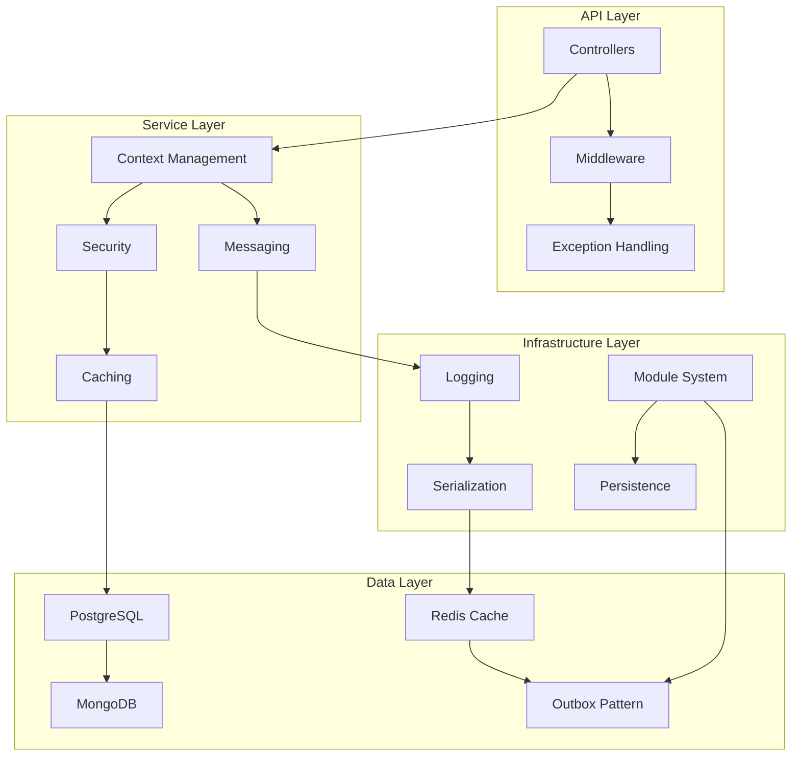

# Mamey.MicroMonolith.Infrastructure

The Mamey.MicroMonolith.Infrastructure library provides comprehensive infrastructure components for building modular monolith applications with the Mamey framework. It offers a complete set of services for API development, messaging, caching, security, logging, and data persistence.

## Technical Overview

Mamey.MicroMonolith.Infrastructure is a comprehensive infrastructure library that provides:

- **Modular Architecture**: Support for modular monolith applications
- **API Infrastructure**: Complete API development infrastructure
- **Messaging System**: In-memory and distributed messaging capabilities
- **Caching Layer**: Redis-based distributed caching
- **Security Services**: Authentication, authorization, and encryption
- **Logging Framework**: Structured logging with multiple sinks
- **Data Persistence**: Support for multiple database providers
- **Exception Handling**: Comprehensive error handling and mapping
- **Context Management**: Request context and correlation tracking
- **Module System**: Dynamic module loading and management

## Architecture

The library provides a layered architecture for modular monolith applications:



## Core Components

### API Infrastructure
- **CORS Configuration**: Cross-origin resource sharing setup
- **Swagger Integration**: API documentation and testing
- **Controller Management**: Dynamic controller loading
- **Content Type Handling**: Default content type configuration

### Messaging System
- **In-Memory Broker**: Fast in-memory message processing
- **Message Context**: Request-scoped message context
- **Async Dispatcher**: Asynchronous message dispatching
- **Outbox Pattern**: Reliable message delivery

### Caching Layer
- **Redis Integration**: Distributed caching with Redis
- **Cache Interface**: Unified caching abstraction
- **Cache Options**: Configurable cache settings

### Security Services
- **Authentication**: Identity and authentication services
- **Authorization**: Role-based access control
- **Encryption**: Data encryption and decryption
- **Security Provider**: Centralized security management

### Logging Framework
- **Structured Logging**: JSON-based structured logging
- **Multiple Sinks**: Console, file, and Seq logging
- **Logging Decorators**: Automatic logging for handlers
- **Logging Options**: Configurable logging settings

### Data Persistence
- **PostgreSQL**: Relational database support
- **MongoDB**: Document database support
- **Redis**: Key-value store support
- **Unit of Work**: Transaction management

### Module System
- **Module Registry**: Dynamic module management
- **Module Client**: Inter-module communication
- **Module Serialization**: Message serialization
- **Module Loading**: Dynamic module loading

## Installation

### NuGet Package
```bash
dotnet add package Mamey.MicroMonolith.Infrastructure
```

### Prerequisites
- .NET 9.0 or later
- Mamey (core framework)
- Mamey.MicroMonolith.Abstractions
- Mamey.CQRS (Commands, Events, Queries)
- Mamey.Persistence (Redis, PostgreSQL, MongoDB)

## Key Features

### Modular Architecture Features

- **Dynamic Module Loading**: Load modules at runtime
- **Module Communication**: Inter-module messaging
- **Module Registry**: Centralized module management
- **Module Serialization**: Message serialization support
- **Module Discovery**: Automatic module discovery

### API Features

- **Swagger Integration**: Complete API documentation
- **CORS Support**: Cross-origin resource sharing
- **Controller Management**: Dynamic controller loading
- **Content Type Handling**: Automatic content type detection
- **API Versioning**: API version management

### Messaging Features

- **In-Memory Messaging**: Fast local messaging
- **Message Context**: Request-scoped context
- **Async Processing**: Asynchronous message handling
- **Outbox Pattern**: Reliable message delivery
- **Message Serialization**: Multiple serialization formats

### Caching Features

- **Redis Integration**: Distributed caching
- **Cache Interface**: Unified caching abstraction
- **Cache Options**: Configurable cache settings
- **Cache Decorators**: Automatic caching for handlers

### Security Features

- **Authentication**: Identity management
- **Authorization**: Role-based access control
- **Encryption**: Data encryption services
- **Security Provider**: Centralized security management

### Logging Features

- **Structured Logging**: JSON-based logging
- **Multiple Sinks**: Console, file, and Seq
- **Logging Decorators**: Automatic logging
- **Logging Options**: Configurable settings

### Data Persistence Features

- **PostgreSQL**: Relational database support
- **MongoDB**: Document database support
- **Redis**: Key-value store support
- **Unit of Work**: Transaction management
- **Repository Pattern**: Data access abstraction

## Quick Start

### Basic Setup

```csharp
using Mamey.MicroMonolith.Infrastructure;

// Register modular infrastructure
builder.Services.AddModularInfrastructure(assemblies, modules);

// Use modular infrastructure
app.UseModularInfrastructure();
```

### Advanced Setup

```csharp
using Mamey.MicroMonolith.Infrastructure;

public class Program
{
    public static void Main(string[] args)
    {
        var builder = WebApplication.CreateBuilder(args);
        
        // Get assemblies and modules
        var assemblies = AppDomain.CurrentDomain.GetAssemblies();
        var modules = GetModules();
        
        // Add modular infrastructure
        builder.Services.AddModularInfrastructure(assemblies, modules);
        
        var app = builder.Build();
        
        // Use modular infrastructure
        app.UseModularInfrastructure();
        
        app.Run();
    }
    
    private static List<IModule> GetModules()
    {
        return new List<IModule>
        {
            new UserModule(),
            new OrderModule(),
            new PaymentModule()
        };
    }
}
```

## API Reference

### Core Interfaces

#### IContext

Interface for request context management.

```csharp
public interface IContext
{
    Guid RequestId { get; }
    Guid CorrelationId { get; }
    string TraceId { get; }
    string IpAddress { get; }
    string UserAgent { get; }
    IIdentityContext Identity { get; }
}
```

#### IMessageBroker

Interface for message broker operations.

```csharp
public interface IMessageBroker
{
    Task PublishAsync(IMessage message, CancellationToken cancellationToken = default);
    Task PublishAsync(IMessage[] messages, CancellationToken cancellationToken = default);
}
```

#### ICache

Interface for caching operations.

```csharp
public interface ICache
{
    Task<T> GetAsync<T>(string key);
    Task SetAsync<T>(string key, T value, TimeSpan? expiry = null);
    Task RemoveAsync(string key);
    Task RemoveByPatternAsync(string pattern);
}
```

### Core Classes

#### Context

Request context implementation.

```csharp
public class Context : IContext
{
    public Guid RequestId { get; }
    public Guid CorrelationId { get; }
    public string TraceId { get; }
    public string IpAddress { get; }
    public string UserAgent { get; }
    public IIdentityContext Identity { get; }
}
```

#### RedisCache

Redis cache implementation.

```csharp
public class RedisCache : ICache
{
    private readonly IDatabase _database;
    private readonly IJsonSerializer _jsonSerializer;
    
    public async Task<T> GetAsync<T>(string key);
    public async Task SetAsync<T>(string key, T value, TimeSpan? expiry = null);
    public async Task RemoveAsync(string key);
    public async Task RemoveByPatternAsync(string pattern);
}
```

## Usage Examples

### Example 1: Basic Module Setup

```csharp
using Mamey.MicroMonolith.Infrastructure;

public class UserModule : IModule
{
    public string Name => "users";
    public string Path => "users";
    public IEnumerable<string> Policies => new[] { "users" };
    
    public void Register(IServiceCollection services)
    {
        services.AddScoped<IUserService, UserService>();
        services.AddScoped<IUserRepository, UserRepository>();
    }
}

public class Program
{
    public static void Main(string[] args)
    {
        var builder = WebApplication.CreateBuilder(args);
        
        var assemblies = AppDomain.CurrentDomain.GetAssemblies();
        var modules = new List<IModule> { new UserModule() };
        
        builder.Services.AddModularInfrastructure(assemblies, modules);
        
        var app = builder.Build();
        app.UseModularInfrastructure();
        
        app.Run();
    }
}
```

### Example 2: Messaging Setup

```csharp
using Mamey.MicroMonolith.Infrastructure;

public class UserService
{
    private readonly IMessageBroker _messageBroker;
    private readonly IContext _context;

    public UserService(IMessageBroker messageBroker, IContext context)
    {
        _messageBroker = messageBroker;
        _context = context;
    }

    public async Task CreateUserAsync(CreateUserCommand command)
    {
        // Create user logic
        var user = new User
        {
            Id = Guid.NewGuid(),
            Name = command.Name,
            Email = command.Email
        };

        // Publish user created event
        var userCreatedEvent = new UserCreatedEvent
        {
            UserId = user.Id,
            Name = user.Name,
            Email = user.Email,
            CreatedAt = DateTime.UtcNow
        };

        await _messageBroker.PublishAsync(userCreatedEvent);
    }
}
```

### Example 3: Caching Setup

```csharp
using Mamey.MicroMonolith.Infrastructure;

public class UserService
{
    private readonly ICache _cache;
    private readonly IUserRepository _userRepository;

    public UserService(ICache cache, IUserRepository userRepository)
    {
        _cache = cache;
        _userRepository = userRepository;
    }

    public async Task<User> GetUserAsync(Guid userId)
    {
        var cacheKey = $"user:{userId}";
        
        // Try to get from cache
        var cachedUser = await _cache.GetAsync<User>(cacheKey);
        if (cachedUser != null)
        {
            return cachedUser;
        }

        // Get from repository
        var user = await _userRepository.GetByIdAsync(userId);
        if (user != null)
        {
            // Cache for 1 hour
            await _cache.SetAsync(cacheKey, user, TimeSpan.FromHours(1));
        }

        return user;
    }
}
```

### Example 4: Security Setup

```csharp
using Mamey.MicroMonolith.Infrastructure;

public class SecurityService
{
    private readonly ISecurityProvider _securityProvider;
    private readonly IContext _context;

    public SecurityService(ISecurityProvider securityProvider, IContext context)
    {
        _securityProvider = securityProvider;
        _context = context;
    }

    public async Task<string> EncryptDataAsync(string data)
    {
        return await _securityProvider.EncryptAsync(data);
    }

    public async Task<string> DecryptDataAsync(string encryptedData)
    {
        return await _securityProvider.DecryptAsync(encryptedData);
    }

    public bool IsAuthorized(string resource, string action)
    {
        return _securityProvider.IsAuthorized(_context.Identity, resource, action);
    }
}
```

### Example 5: Logging Setup

```csharp
using Mamey.MicroMonolith.Infrastructure;

public class UserService
{
    private readonly ILogger<UserService> _logger;
    private readonly IContext _context;

    public UserService(ILogger<UserService> logger, IContext context)
    {
        _logger = logger;
        _context = context;
    }

    public async Task CreateUserAsync(CreateUserCommand command)
    {
        _logger.LogInformation("Creating user {UserName} with email {Email}", 
            command.Name, command.Email);

        try
        {
            // Create user logic
            var user = new User
            {
                Id = Guid.NewGuid(),
                Name = command.Name,
                Email = command.Email
            };

            _logger.LogInformation("User {UserId} created successfully", user.Id);
        }
        catch (Exception ex)
        {
            _logger.LogError(ex, "Failed to create user {UserName}", command.Name);
            throw;
        }
    }
}
```

## Integration Patterns

### Integration with ASP.NET Core

```csharp
// Program.cs
var builder = WebApplication.CreateBuilder(args);

// Get assemblies and modules
var assemblies = AppDomain.CurrentDomain.GetAssemblies();
var modules = GetModules();

// Add modular infrastructure
builder.Services.AddModularInfrastructure(assemblies, modules);

var app = builder.Build();

// Use modular infrastructure
app.UseModularInfrastructure();

app.Run();
```

### Integration with CQRS

```csharp
public class UserCommandHandler : ICommandHandler<CreateUserCommand>
{
    private readonly IUserRepository _userRepository;
    private readonly IMessageBroker _messageBroker;
    private readonly ILogger<UserCommandHandler> _logger;

    public UserCommandHandler(
        IUserRepository userRepository,
        IMessageBroker messageBroker,
        ILogger<UserCommandHandler> logger)
    {
        _userRepository = userRepository;
        _messageBroker = messageBroker;
        _logger = logger;
    }

    public async Task HandleAsync(CreateUserCommand command, CancellationToken cancellationToken = default)
    {
        _logger.LogInformation("Creating user {UserName}", command.Name);

        var user = new User
        {
            Id = Guid.NewGuid(),
            Name = command.Name,
            Email = command.Email
        };

        await _userRepository.AddAsync(user);

        var userCreatedEvent = new UserCreatedEvent
        {
            UserId = user.Id,
            Name = user.Name,
            Email = user.Email
        };

        await _messageBroker.PublishAsync(userCreatedEvent);
    }
}
```

## Configuration Reference

### App Configuration

```json
{
  "app": {
    "name": "Modular API",
    "version": "1.0.0"
  }
}
```

### Redis Configuration

```json
{
  "redis": {
    "connectionString": "localhost:6379",
    "database": 0
  }
}
```

### PostgreSQL Configuration

```json
{
  "postgres": {
    "connectionString": "Host=localhost;Database=modular_api;Username=postgres;Password=password"
  }
}
```

### MongoDB Configuration

```json
{
  "mongo": {
    "connectionString": "mongodb://localhost:27017",
    "database": "modular_api"
  }
}
```

### Logging Configuration

```json
{
  "logging": {
    "console": {
      "enabled": true
    },
    "file": {
      "enabled": true,
      "path": "logs/app.log"
    },
    "seq": {
      "enabled": true,
      "url": "http://localhost:5341"
    }
  }
}
```

## Best Practices

1. **Module Design**: Design modules to be loosely coupled and highly cohesive
2. **Error Handling**: Implement comprehensive error handling and logging
3. **Caching Strategy**: Use appropriate caching strategies for performance
4. **Security**: Implement proper authentication and authorization
5. **Logging**: Use structured logging for better observability
6. **Testing**: Write comprehensive unit and integration tests
7. **Configuration**: Use strongly typed configuration classes
8. **Performance**: Monitor and optimize performance
9. **Documentation**: Document APIs and modules thoroughly
10. **Monitoring**: Implement proper monitoring and alerting

## Troubleshooting

### Common Issues

**Module Loading Fails**: Check module registration and dependencies
**Caching Issues**: Verify Redis connection and configuration
**Database Connection**: Check database connection strings
**Logging Issues**: Verify logging configuration and sinks
**Security Issues**: Check authentication and authorization setup

### Debugging

Enable detailed logging to troubleshoot issues:

```csharp
builder.Logging.AddConsole();
builder.Logging.SetMinimumLevel(LogLevel.Debug);
```

## Related Libraries

- [Mamey.MicroMonolith.Abstractions](micromonolith-abstractions.md) - MicroMonolith abstractions
- [Mamey.CQRS](cqrs-commands.md) - CQRS pattern implementation
- [Mamey.Persistence](persistence-redis.md) - Data persistence libraries

## Additional Resources

- [Modular Monolith Guide](../guides/modular-monolith.md)
- [CQRS Pattern Guide](../guides/cqrs-pattern.md)
- [Messaging Guide](../guides/messaging.md)
