# Mamey.Persistence.Minio

A comprehensive .NET library for MinIO object storage integration within the Mamey framework. This library provides a complete set of services for managing buckets, objects, policies, encryption, lifecycle, and more with MinIO-compatible object storage systems.

## Overview

Mamey.Persistence.Minio offers a robust, feature-rich interface for object storage operations, built on top of the MinIO .NET client. It provides specialized services for different aspects of object storage management, comprehensive error handling, and seamless integration with the Mamey framework.

## Key Features

- **Comprehensive Object Storage Operations**: Complete CRUD operations for buckets and objects
- **Advanced Security**: Server-side encryption, bucket policies, and access control
- **Lifecycle Management**: Automated object transitions and expiration policies
- **Presigned URLs**: Secure temporary access to objects
- **Object Locking**: Compliance and legal hold capabilities
- **Versioning Support**: Full object versioning and management
- **Tagging System**: Flexible object and bucket tagging
- **Notification System**: Event-driven notifications for object operations
- **Error Handling**: Specialized exceptions for different operation types

## Architecture

```mermaid
graph TB
    A[IMinioService] --> B[IBucketService]
    A --> C[IBucketObjectService]
    A --> D[IPresignedObjectService]
    A --> E[IBucketPolicyService]
    A --> F[IEncryptionService]
    A --> G[ILifecycleService]
    A --> H[IObjectLockService]
    
    B --> I[Bucket Operations]
    C --> J[Object Operations]
    D --> K[Presigned URLs]
    E --> L[Policies & Notifications]
    F --> M[Encryption Management]
    G --> N[Lifecycle Rules]
    H --> O[Object Locking]
    
    I --> P[Create/Delete/List Buckets]
    I --> Q[Versioning Management]
    I --> R[Bucket Tagging]
    
    J --> S[Get/Put/Copy Objects]
    J --> T[Object Metadata]
    J --> U[Legal Hold & Retention]
    J --> V[Object Tagging]
    
    K --> W[Presigned GET URLs]
    K --> X[Presigned PUT URLs]
    K --> Y[POST Policy URLs]
    
    L --> Z[Bucket Policies]
    L --> AA[Event Notifications]
    
    M --> BB[SSE Configuration]
    M --> CC[KMS Integration]
    
    N --> DD[Transition Rules]
    N --> EE[Expiration Policies]
    
    O --> FF[Object Lock Configuration]
    O --> GG[Retention Policies]
```



## Installation

```bash
dotnet add package Mamey.Persistence.Minio
```

## Configuration

### appsettings.json

```json
{
  "Minio": {
    "Endpoint": "localhost:9000",
    "AccessKey": "minioadmin",
    "SecretKey": "minioadmin",
    "Bucket": "default-bucket",
    "Region": "us-east-1",
    "UseSSL": false,
    "TimeoutSeconds": 60,
    "RetryCount": 3
  }
}
```

### Service Registration

```csharp
using Mamey.Persistence.Minio;

var builder = WebApplication.CreateBuilder(args);

builder.Services
    .AddMamey()
    .AddMinio();
```

## Core Services

### IMinioService

The main service interface that provides access to all specialized MinIO services.

```csharp
public interface IMinioService
{
    IBucketService BucketOperations { get; }
    IBucketObjectService ObjectOperations { get; }
    IPresignedObjectService PresignedObjectOperations { get; }
    IBucketPolicyService BucketPolicyOperations { get; }
    IEncryptionService EncryptionOperations { get; }
    ILifecycleService LifecycleOperations { get; }
    IObjectLockService ObjectLockOperations { get; }
}
```

### IBucketService

Manages bucket operations including creation, deletion, listing, versioning, and tagging.

```csharp
// Create a bucket
await minioService.BucketOperations.MakeBucketAsync("my-bucket");

// List all buckets
var buckets = await minioService.BucketOperations.ListBucketsAsync();

// Check if bucket exists
var exists = await minioService.BucketOperations.BucketExistsAsync("my-bucket");

// Enable versioning
await minioService.BucketOperations.EnableVersioningAsync("my-bucket");

// Set bucket tags
var tags = new Tags();
tags.TagSet.Add(new TagSet { Key = "Environment", Value = "Production" });
await minioService.BucketOperations.SetBucketTagsAsync("my-bucket", tags);
```

### IBucketObjectService

Handles all object operations including upload, download, copy, metadata management, and retention.

```csharp
// Upload an object
var request = new PutObjectRequest
{
    BucketName = "my-bucket",
    ObjectName = "documents/file.pdf",
    Data = fileStream,
    Size = fileStream.Length,
    ContentType = "application/pdf",
    Metadata = new Dictionary<string, string>
    {
        { "Author", "John Doe" },
        { "Department", "Finance" }
    }
};
await minioService.ObjectOperations.PutObjectAsync(request);

// Download an object
var getRequest = new GetObjectRequest
{
    BucketName = "my-bucket",
    ObjectName = "documents/file.pdf"
};
var objectStream = await minioService.ObjectOperations.GetObjectAsync(getRequest);

// Get object metadata
var metadata = await minioService.ObjectOperations.StatObjectAsync("my-bucket", "documents/file.pdf");

// Set object retention
var retention = new RetentionConfiguration
{
    Mode = "GOVERNANCE",
    RetainUntilDate = DateTime.UtcNow.AddYears(7)
};
await minioService.ObjectOperations.SetObjectRetentionAsync("my-bucket", "documents/file.pdf", retention);
```

### IPresignedObjectService

Generates presigned URLs for secure temporary access to objects.

```csharp
// Generate presigned GET URL
var presignedRequest = new PresignedUrlRequest
{
    BucketName = "my-bucket",
    ObjectName = "documents/file.pdf",
    ExpiresInSeconds = 3600,
    Method = "GET"
};
var presignedUrl = await minioService.PresignedObjectOperations.PresignedGetObjectAsync(presignedRequest);

// Generate presigned POST policy for direct uploads
var postPolicyRequest = new PresignedPostPolicyRequest
{
    BucketName = "my-bucket",
    ExpiresInSeconds = 3600,
    Conditions = new List<PostPolicyCondition>
    {
        new() { Operator = "starts-with", Key = "key", Value = "uploads/" },
        new() { Operator = "content-length-range", Key = "content-length-range", Value = "1,10485760" }
    }
};
var postPolicy = await minioService.PresignedObjectOperations.PresignedPostPolicyAsync(postPolicyRequest);
```

### IBucketPolicyService

Manages bucket policies and notification configurations.

```csharp
// Set bucket policy
var policy = new BucketPolicyInfo
{
    Version = "2012-10-17",
    Statement = new List<PolicyStatement>
    {
        new()
        {
            Effect = "Allow",
            Principal = "*",
            Action = "s3:GetObject",
            Resource = "arn:aws:s3:::my-bucket/*"
        }
    }
};
await minioService.BucketPolicyOperations.SetBucketPolicyAsync("my-bucket", policy);

// Configure bucket notifications
var notification = new NotificationConfiguration
{
    TopicConfigurations = new List<TopicConfiguration>
    {
        new()
        {
            TopicArn = "arn:aws:sns:us-east-1:123456789012:my-topic",
            Events = new List<string> { "s3:ObjectCreated:*" }
        }
    }
};
await minioService.BucketPolicyOperations.SetBucketNotificationAsync("my-bucket", notification);
```

### IEncryptionService

Manages server-side encryption for buckets.

```csharp
// Set bucket encryption
var encryption = new BucketEncryptionInfo
{
    Rules = new List<EncryptionRule>
    {
        new()
        {
            ApplyServerSideEncryptionByDefault = new ServerSideEncryptionConfiguration
            {
                SSEAlgorithm = "AES256"
            },
            BucketKeyEnabled = true
        }
    }
};
await minioService.EncryptionOperations.SetBucketEncryptionAsync("my-bucket", encryption);
```

### ILifecycleService

Manages object lifecycle rules for automatic transitions and expiration.

```csharp
// Set lifecycle configuration
var lifecycle = new LifecycleConfiguration
{
    Rules = new List<LifecycleRule>
    {
        new()
        {
            Id = "archive-old-files",
            Status = "Enabled",
            Filter = new LifecycleFilter
            {
                Prefix = "documents/"
            },
            Transitions = new List<LifecycleTransition>
            {
                new() { Days = 30, StorageClass = "STANDARD_IA" },
                new() { Days = 90, StorageClass = "GLACIER" }
            },
            Expiration = new LifecycleExpiration { Days = 2555 } // 7 years
        }
    }
};
await minioService.LifecycleOperations.SetBucketLifecycleAsync("my-bucket", lifecycle);
```

### IObjectLockService

Manages object lock configuration for compliance and legal hold.

```csharp
// Set object lock configuration
var lockConfig = new ObjectLockConfiguration
{
    ObjectLockEnabled = "Enabled",
    Rule = new DefaultRetention
    {
        Mode = "GOVERNANCE",
        Days = 30
    }
};
await minioService.ObjectLockOperations.SetObjectLockConfigurationAsync("my-bucket", lockConfig);
```

## Data Models

### Request Models

- **PutObjectRequest**: Object upload configuration
- **GetObjectRequest**: Object download parameters
- **CopyObjectRequest**: Object copy operations
- **ListObjectsRequest**: Object listing with filters
- **PresignedUrlRequest**: Presigned URL generation
- **PresignedPostPolicyRequest**: POST policy configuration

### Response Models

- **BucketInfo**: Bucket information and metadata
- **ObjectInfo**: Object listing information
- **ObjectMetadata**: Detailed object metadata
- **PresignedUrlResult**: Generated presigned URL
- **BucketVersioningInfo**: Versioning configuration
- **LifecycleConfiguration**: Lifecycle rules
- **RetentionConfiguration**: Object retention settings

## Error Handling

The library provides specialized exceptions for different operation types:

```csharp
try
{
    await minioService.BucketOperations.MakeBucketAsync("my-bucket");
}
catch (BucketOperationException ex)
{
    // Handle bucket-specific errors
    Console.WriteLine($"Bucket operation failed: {ex.Operation} on {ex.BucketName}");
}
catch (ObjectOperationException ex)
{
    // Handle object-specific errors
    Console.WriteLine($"Object operation failed: {ex.Operation} on {ex.ObjectName}");
}
catch (MinioServiceException ex)
{
    // Handle general MinIO service errors
    Console.WriteLine($"MinIO error: {ex.Message}");
}
```

## Advanced Features

### Server-Side Encryption

```csharp
var putRequest = new PutObjectRequest
{
    BucketName = "secure-bucket",
    ObjectName = "sensitive-data.txt",
    Data = dataStream,
    Size = dataStream.Length,
    ServerSideEncryption = new ServerSideEncryption
    {
        Algorithm = "AES256"
    }
};
await minioService.ObjectOperations.PutObjectAsync(putRequest);
```

### Object Tagging

```csharp
var tags = new Tags();
tags.TagSet.Add(new TagSet { Key = "Project", Value = "Alpha" });
tags.TagSet.Add(new TagSet { Key = "Owner", Value = "Development Team" });

await minioService.ObjectOperations.SetObjectTagsAsync("my-bucket", "documents/file.pdf", tags);
```

### Legal Hold

```csharp
var legalHold = new LegalHold { Status = "ON" };
await minioService.ObjectOperations.SetLegalHoldAsync("my-bucket", "documents/file.pdf", legalHold);
```

## Best Practices

1. **Use Appropriate Storage Classes**: Configure lifecycle rules to transition objects to cost-effective storage classes
2. **Implement Proper Error Handling**: Use specific exception types for different error scenarios
3. **Secure Access**: Use presigned URLs for temporary access instead of exposing credentials
4. **Monitor Operations**: Implement logging and monitoring for all object storage operations
5. **Version Management**: Enable versioning for critical data and implement retention policies
6. **Encryption**: Always use server-side encryption for sensitive data
7. **Lifecycle Management**: Configure appropriate lifecycle rules to manage storage costs

## Performance Considerations

- **Connection Pooling**: The library uses connection pooling for optimal performance
- **Retry Logic**: Built-in retry mechanism for transient failures
- **Async Operations**: All operations are asynchronous for better scalability
- **Streaming**: Large objects are handled using streaming to minimize memory usage

## Troubleshooting

### Common Issues

1. **Connection Timeout**: Increase `TimeoutSeconds` in configuration
2. **Access Denied**: Verify credentials and bucket policies
3. **SSL Errors**: Check `UseSSL` setting and certificate configuration
4. **Bucket Not Found**: Ensure bucket exists before performing operations

### Debugging

Enable detailed logging to troubleshoot issues:

```csharp
builder.Services.AddLogging(logging =>
{
    logging.AddConsole();
    logging.SetMinimumLevel(LogLevel.Debug);
});
```

## Dependencies

- **Minio**: 6.0.5 - Core MinIO .NET client
- **Mamey**: Core Mamey framework
- **Microsoft.Extensions.Logging**: Logging infrastructure
- **Microsoft.Extensions.Options**: Configuration management

## License

This library is part of the Mamey framework and follows the same licensing terms.