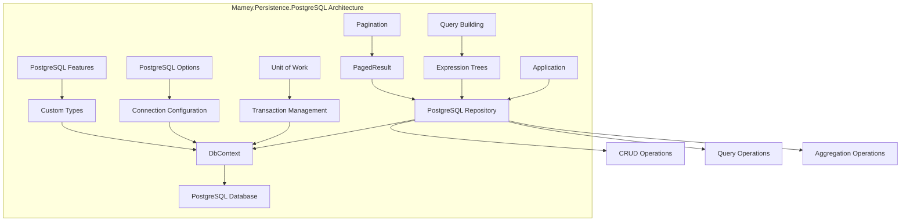

# Mamey.Persistence.PostgreSQL

A specialized PostgreSQL persistence library for the Mamey framework, providing optimized Entity Framework Core integration with PostgreSQL databases. This library extends the base SQL persistence capabilities with PostgreSQL-specific features and optimizations.

## Table of Contents

- [Overview](#overview)
- [Key Features](#key-features)
- [Architecture](#architecture)
- [Installation](#installation)
- [Quick Start](#quick-start)
- [Core Components](#core-components)
- [API Reference](#api-reference)
- [Usage Examples](#usage-examples)
- [Configuration](#configuration)
- [Best Practices](#best-practices)
- [Troubleshooting](#troubleshooting)

## Overview

Mamey.Persistence.PostgreSQL is a specialized persistence library that provides PostgreSQL integration for the Mamey framework. It extends the base SQL persistence capabilities with PostgreSQL-specific features, optimizations, and configurations.

### Technical Overview

The library provides:

- **PostgreSQL Integration**: Optimized Entity Framework Core integration with PostgreSQL
- **Unit of Work Pattern**: Transaction management and change tracking
- **Repository Pattern**: Generic repository implementation for PostgreSQL
- **Type Safety**: Full compile-time type safety for all database operations
- **Async Operations**: Full async/await support for all operations
- **PostgreSQL Features**: Support for PostgreSQL-specific features and data types
- **Performance Optimization**: PostgreSQL-specific optimizations and configurations

## Key Features

### Core Features

- **PostgreSQL Integration**: Optimized Entity Framework Core integration with PostgreSQL
- **Unit of Work Pattern**: Transaction management and change tracking
- **Repository Pattern**: Generic repository implementation for PostgreSQL
- **Type Safety**: Full compile-time type safety for all database operations
- **Async Operations**: Full async/await support for all operations
- **PostgreSQL Features**: Support for PostgreSQL-specific features and data types
- **Performance Optimization**: PostgreSQL-specific optimizations and configurations

### Advanced Features

- **Custom Repositories**: Support for custom repository implementations
- **Entity Tracking**: Configurable entity tracking for performance optimization
- **Batch Operations**: Support for batch insert, update, and delete operations
- **Query Optimization**: Built-in query optimization and performance monitoring
- **Error Handling**: Comprehensive error handling and logging
- **Migration Support**: Built-in support for Entity Framework migrations
- **PostgreSQL Extensions**: Support for PostgreSQL extensions and custom types

## Architecture



## Installation

### Package Manager
```bash
Install-Package Mamey.Persistence.PostgreSQL
```

### .NET CLI
```bash
dotnet add package Mamey.Persistence.PostgreSQL
```

### PackageReference
```xml
<PackageReference Include="Mamey.Persistence.PostgreSQL" Version="2.0.*" />
```

## Quick Start

### Basic Setup

```csharp
using Mamey.Postgres;

var builder = WebApplication.CreateBuilder(args);

// Add Mamey services
builder.Services.AddMamey()
    .AddMameyPersistence()
    .AddPostgres<MyDbContext>();

var app = builder.Build();

app.Run();
```

### With Custom Configuration

```csharp
builder.Services.AddMamey()
    .AddMameyPersistence()
    .AddPostgres<MyDbContext>(options =>
    {
        options.UseNpgsql(connectionString, npgsqlOptions =>
        {
            npgsqlOptions.EnableRetryOnFailure(3);
            npgsqlOptions.CommandTimeout(30);
        });
    });
```

### With Unit of Work

```csharp
builder.Services.AddMamey()
    .AddMameyPersistence()
    .AddPostgres<MyDbContext>()
    .AddUnitOfWork<MyUnitOfWork>();
```

## Core Components

### Configuration System

#### PostgresOptions
```csharp
public class PostgresOptions : SQLOptions
{
    // Inherits from SQLOptions
    // Additional PostgreSQL-specific options can be added here
}
```

#### SQLOptions Base Class
```csharp
public class SQLOptions
{
    public string ConnectionString { get; set; }
}
```

### Extension Methods

#### AddPostgres Extensions
```csharp
public static class PostgresExtensions
{
    public static IServiceCollection AddPostgres(this IServiceCollection services);
    
    public static IServiceCollection AddPostgres<T>(this IServiceCollection services, 
        Action<NpgsqlDbContextOptionsBuilder>? postgresSqlOptions = null) 
        where T : DbContext;
}
```

#### AddUnitOfWork Extensions
```csharp
public static class UnitOfWorkExtensions
{
    public static IServiceCollection AddUnitOfWork<T>(this IServiceCollection services) 
        where T : class, IUnitOfWork;
}
```

### Unit of Work System

#### UnitOfWorkTypeRegistry
```csharp
public class UnitOfWorkTypeRegistry
{
    public void Register<T>() where T : class, IUnitOfWork;
    public bool IsRegistered<T>() where T : class, IUnitOfWork;
}
```

## API Reference

### Extension Methods

#### IServiceCollection Extensions

```csharp
public static class PostgresExtensions
{
    public static IServiceCollection AddPostgres(this IServiceCollection services);
    
    public static IServiceCollection AddPostgres<T>(this IServiceCollection services, 
        Action<NpgsqlDbContextOptionsBuilder>? postgresSqlOptions = null) 
        where T : DbContext;
}

public static class UnitOfWorkExtensions
{
    public static IServiceCollection AddUnitOfWork<T>(this IServiceCollection services) 
        where T : class, IUnitOfWork;
}
```

### Configuration Options

#### PostgresOptions
```csharp
public class PostgresOptions : SQLOptions
{
    // Inherits connection string from SQLOptions
    // Additional PostgreSQL-specific options can be added
}
```

#### NpgsqlDbContextOptionsBuilder
```csharp
public class NpgsqlDbContextOptionsBuilder
{
    public NpgsqlDbContextOptionsBuilder UseNpgsql(string connectionString, 
        Action<NpgsqlDbContextOptionsBuilder>? npgsqlOptionsAction = null);
    
    public NpgsqlDbContextOptionsBuilder EnableRetryOnFailure(int maxRetryCount);
    public NpgsqlDbContextOptionsBuilder CommandTimeout(int timeout);
    // Additional Npgsql-specific options
}
```

## Usage Examples

### Basic PostgreSQL Setup

```csharp
public class Program
{
    public static void Main(string[] args)
    {
        var builder = WebApplication.CreateBuilder(args);

        builder.Services.AddMamey()
            .AddMameyPersistence()
            .AddPostgres<MyDbContext>();

        var app = builder.Build();
        app.Run();
    }
}

public class MyDbContext : DbContext
{
    public MyDbContext(DbContextOptions<MyDbContext> options) : base(options)
    {
    }

    public DbSet<User> Users { get; set; }
    public DbSet<Profile> Profiles { get; set; }

    protected override void OnModelCreating(ModelBuilder modelBuilder)
    {
        modelBuilder.Entity<User>(entity =>
        {
            entity.HasKey(e => e.Id);
            entity.Property(e => e.Email).IsRequired().HasMaxLength(255);
            entity.HasIndex(e => e.Email).IsUnique();
        });
    }
}
```

### With Custom PostgreSQL Configuration

```csharp
builder.Services.AddMamey()
    .AddMameyPersistence()
    .AddPostgres<MyDbContext>(options =>
    {
        options.UseNpgsql(connectionString, npgsqlOptions =>
        {
            npgsqlOptions.EnableRetryOnFailure(3);
            npgsqlOptions.CommandTimeout(30);
            npgsqlOptions.EnableLegacyTimestampBehavior();
        });
    });
```

### With Unit of Work Pattern

```csharp
public class MyUnitOfWork : IUnitOfWork
{
    private readonly MyDbContext _context;

    public MyUnitOfWork(MyDbContext context)
    {
        _context = context;
    }

    public async Task ExecuteAsync(Func<Task> action)
    {
        using var transaction = await _context.Database.BeginTransactionAsync();
        try
        {
            await action();
            await _context.SaveChangesAsync();
            await transaction.CommitAsync();
        }
        catch
        {
            await transaction.RollbackAsync();
            throw;
        }
    }
}

// Register unit of work
builder.Services.AddMamey()
    .AddMameyPersistence()
    .AddPostgres<MyDbContext>()
    .AddUnitOfWork<MyUnitOfWork>();
```

### Repository Usage

```csharp
public class UserService
{
    private readonly IEFRepository<User, Guid> _userRepository;
    private readonly IUnitOfWork _unitOfWork;

    public UserService(IEFRepository<User, Guid> userRepository, IUnitOfWork unitOfWork)
    {
        _userRepository = userRepository;
        _unitOfWork = unitOfWork;
    }

    public async Task<User> CreateUserAsync(CreateUserRequest request)
    {
        await _unitOfWork.ExecuteAsync(async () =>
        {
            var user = new User
            {
                Id = Guid.NewGuid(),
                Name = request.Name,
                Email = request.Email,
                CreatedAt = DateTime.UtcNow
            };

            await _userRepository.AddAsync(user);
        });

        return await _userRepository.GetByIdAsync(user.Id);
    }

    public async Task<IEnumerable<User>> GetUsersPagedAsync(int page, int pageSize)
    {
        return await _userRepository.GetPagedAsync(page, pageSize, u => u.CreatedAt, ascending: false);
    }
}
```

### PostgreSQL-Specific Features

```csharp
public class MyDbContext : DbContext
{
    protected override void OnModelCreating(ModelBuilder modelBuilder)
    {
        // Use PostgreSQL-specific data types
        modelBuilder.Entity<User>(entity =>
        {
            entity.Property(e => e.CreatedAt)
                .HasColumnType("timestamp with time zone");
            
            entity.Property(e => e.UpdatedAt)
                .HasColumnType("timestamp with time zone");
            
            entity.Property(e => e.Metadata)
                .HasColumnType("jsonb");
        });

        // Use PostgreSQL extensions
        modelBuilder.HasPostgresExtension("uuid-ossp");
        modelBuilder.HasPostgresExtension("pg_trgm");
    }
}
```

## Configuration

### Basic Configuration

```csharp
builder.Services.AddMamey()
    .AddMameyPersistence()
    .AddPostgres<MyDbContext>();
```

### With Custom Options

```csharp
builder.Services.AddMamey()
    .AddMameyPersistence()
    .AddPostgres<MyDbContext>(options =>
    {
        options.UseNpgsql(connectionString, npgsqlOptions =>
        {
            npgsqlOptions.EnableRetryOnFailure(3);
            npgsqlOptions.CommandTimeout(30);
        });
    });
```

### With Configuration Section

```csharp
// appsettings.json
{
  "Postgres": {
    "ConnectionString": "Host=localhost;Database=MyDatabase;Username=postgres;Password=password"
  }
}

// Program.cs
builder.Services.AddMamey()
    .AddMameyPersistence()
    .AddPostgres<MyDbContext>();
```

### With Unit of Work

```csharp
builder.Services.AddMamey()
    .AddMameyPersistence()
    .AddPostgres<MyDbContext>()
    .AddUnitOfWork<MyUnitOfWork>();
```

## Best Practices

### PostgreSQL-Specific Optimizations

1. **Use Appropriate Data Types**: Use PostgreSQL-specific data types for better performance
2. **Indexing**: Create appropriate indexes for PostgreSQL
3. **Connection Pooling**: Configure connection pooling for PostgreSQL
4. **Query Optimization**: Use PostgreSQL-specific query optimizations

```csharp
public class OptimizedDbContext : DbContext
{
    protected override void OnModelCreating(ModelBuilder modelBuilder)
    {
        // Use PostgreSQL-specific data types
        modelBuilder.Entity<User>(entity =>
        {
            entity.Property(e => e.CreatedAt)
                .HasColumnType("timestamp with time zone");
            
            entity.Property(e => e.Metadata)
                .HasColumnType("jsonb");
            
            // Create indexes for better performance
            entity.HasIndex(e => e.Email)
                .IsUnique()
                .HasDatabaseName("IX_Users_Email");
        });
    }
}
```

### Connection Management

1. **Connection String**: Use proper PostgreSQL connection string format
2. **Connection Pooling**: Configure connection pooling appropriately
3. **Retry Logic**: Implement retry logic for transient failures
4. **Timeout Configuration**: Set appropriate command timeouts

```csharp
builder.Services.AddMamey()
    .AddMameyPersistence()
    .AddPostgres<MyDbContext>(options =>
    {
        options.UseNpgsql(connectionString, npgsqlOptions =>
        {
            npgsqlOptions.EnableRetryOnFailure(3);
            npgsqlOptions.CommandTimeout(30);
            npgsqlOptions.EnableLegacyTimestampBehavior();
        });
    });
```

### Error Handling

1. **PostgreSQL Exceptions**: Handle PostgreSQL-specific exceptions
2. **Logging**: Log all errors with appropriate context
3. **Retry Logic**: Implement retry logic for transient failures
4. **Validation**: Validate data before database operations

```csharp
public class UserService
{
    private readonly IEFRepository<User, Guid> _userRepository;
    private readonly ILogger<UserService> _logger;

    public async Task<User> CreateUserAsync(CreateUserRequest request)
    {
        try
        {
            var user = new User
            {
                Id = Guid.NewGuid(),
                Name = request.Name,
                Email = request.Email,
                CreatedAt = DateTime.UtcNow
            };

            await _userRepository.AddAsync(user);
            return user;
        }
        catch (PostgresException ex) when (ex.SqlState == "23505") // Unique violation
        {
            _logger.LogWarning("User with email {Email} already exists", request.Email);
            throw new DuplicateEmailException(request.Email);
        }
        catch (Exception ex)
        {
            _logger.LogError(ex, "Error creating user with email {Email}", request.Email);
            throw;
        }
    }
}
```

## Troubleshooting

### Common Issues

#### 1. Connection String Issues

**Problem**: Cannot connect to PostgreSQL server.

**Solution**: Ensure proper connection string format and PostgreSQL server is running.

```csharp
// Correct connection string format
var connectionString = "Host=localhost;Database=MyDatabase;Username=postgres;Password=password";
// Or with additional options
var connectionString = "Host=localhost;Database=MyDatabase;Username=postgres;Password=password;Port=5432;SSL Mode=Require;";
```

#### 2. Migration Issues

**Problem**: Database migrations not applying.

**Solution**: Ensure migrations are properly configured and applied.

```csharp
// Apply migrations
using var scope = app.Services.CreateScope();
var context = scope.ServiceProvider.GetRequiredService<MyDbContext>();
await context.Database.MigrateAsync();
```

#### 3. Timestamp Issues

**Problem**: Timestamp behavior issues with PostgreSQL.

**Solution**: Enable legacy timestamp behavior or use proper timezone handling.

```csharp
// Enable legacy timestamp behavior
AppContext.SetSwitch("Npgsql.EnableLegacyTimestampBehavior", true);

// Or configure in DbContext options
options.UseNpgsql(connectionString, npgsqlOptions =>
{
    npgsqlOptions.EnableLegacyTimestampBehavior();
});
```

#### 4. Performance Issues

**Problem**: Queries are slow.

**Solution**: Create appropriate indexes and optimize queries for PostgreSQL.

```csharp
// Create indexes in DbContext
protected override void OnModelCreating(ModelBuilder modelBuilder)
{
    modelBuilder.Entity<User>()
        .HasIndex(u => u.Email)
        .IsUnique()
        .HasDatabaseName("IX_Users_Email");
    
    modelBuilder.Entity<User>()
        .HasIndex(u => u.CreatedAt)
        .HasDatabaseName("IX_Users_CreatedAt");
}
```

### Performance Considerations

1. **Connection Pooling**: Use connection pooling for better performance
2. **Indexing**: Create appropriate indexes for query patterns
3. **Pagination**: Use pagination for large datasets
4. **Memory Management**: Dispose of resources properly

```csharp
public class OptimizedUserService
{
    private readonly IEFRepository<User, Guid> _userRepository;
    private readonly IMemoryCache _cache;

    public async Task<User> GetUserAsync(Guid id)
    {
        var cacheKey = $"user_{id}";
        
        if (_cache.TryGetValue(cacheKey, out User cachedUser))
        {
            return cachedUser;
        }

        var user = await _userRepository.GetByIdAsync(id);
        _cache.Set(cacheKey, user, TimeSpan.FromMinutes(5));
        
        return user;
    }
}
```

### Debugging Tips

1. **Enable Logging**: Use structured logging for better debugging
2. **Query Analysis**: Use PostgreSQL query analysis tools
3. **Connection Monitoring**: Monitor connection pool usage
4. **Performance Profiling**: Use performance profiling tools

```csharp
public class UserRepository
{
    private readonly IEFRepository<User, Guid> _userRepository;
    private readonly ILogger<UserRepository> _logger;

    public async Task<User> GetUserAsync(Guid id)
    {
        _logger.LogInformation("Retrieving user with ID: {UserId}", id);
        
        var stopwatch = Stopwatch.StartNew();
        var user = await _userRepository.GetByIdAsync(id);
        stopwatch.Stop();
        
        _logger.LogInformation("User retrieved in {ElapsedMs}ms", stopwatch.ElapsedMilliseconds);
        
        return user;
    }
}
```

## License

This project is licensed under the MIT License - see the [LICENSE](LICENSE) file for details.

## Contributing

Please read [CONTRIBUTING.md](CONTRIBUTING.md) for details on our code of conduct and the process for submitting pull requests.

## Support

For support and questions, please open an issue in the [GitHub repository](https://github.com/mamey-io/mamey-persistence-postgresql/issues).
