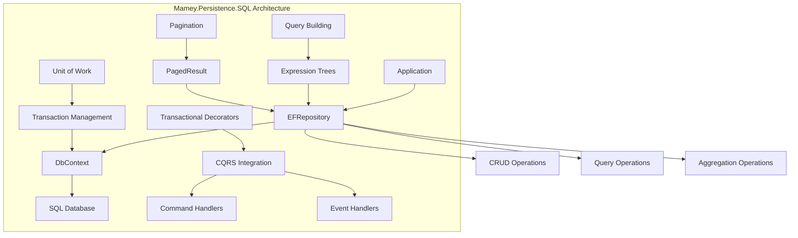

# Mamey.Persistence.SQL

A comprehensive SQL persistence library for the Mamey framework, providing Entity Framework Core integration with built-in support for repositories, unit of work patterns, and transactional decorators. This library offers a clean, type-safe approach to relational database operations.

## Table of Contents

- [Overview](#overview)
- [Key Features](#key-features)
- [Architecture](#architecture)
- [Installation](#installation)
- [Quick Start](#quick-start)
- [Core Components](#core-components)
- [API Reference](#api-reference)
- [Usage Examples](#usage-examples)
- [Configuration](#configuration)
- [Best Practices](#best-practices)
- [Troubleshooting](#troubleshooting)

## Overview

Mamey.Persistence.SQL is a specialized persistence library that provides Entity Framework Core integration for the Mamey framework. It offers repository pattern implementation, unit of work patterns, and transactional decorators for CQRS operations.

### Technical Overview

The library provides:

- **Repository Pattern**: Generic repository implementation for Entity Framework Core
- **Unit of Work**: Transaction management and change tracking
- **Transactional Decorators**: Automatic transaction management for CQRS operations
- **Type Safety**: Full compile-time type safety for all database operations
- **Async Operations**: Full async/await support for all operations
- **Query Building**: Expression-based query building for complex queries
- **Pagination**: Built-in pagination support for large datasets

## Key Features

### Core Features

- **Repository Pattern**: Generic repository implementation for Entity Framework Core
- **Unit of Work**: Transaction management and change tracking
- **Transactional Decorators**: Automatic transaction management for CQRS operations
- **Type Safety**: Full compile-time type safety for all database operations
- **Async Operations**: Full async/await support for all operations
- **Query Building**: Expression-based query building for complex queries
- **Pagination**: Built-in pagination support for large datasets

### Advanced Features

- **Custom Repositories**: Support for custom repository implementations
- **Entity Tracking**: Configurable entity tracking for performance optimization
- **Batch Operations**: Support for batch insert, update, and delete operations
- **Query Optimization**: Built-in query optimization and performance monitoring
- **Error Handling**: Comprehensive error handling and logging
- **Migration Support**: Built-in support for Entity Framework migrations

## Architecture



## Installation

### Package Manager
```bash
Install-Package Mamey.Persistence.SQL
```

### .NET CLI
```bash
dotnet add package Mamey.Persistence.SQL
```

### PackageReference
```xml
<PackageReference Include="Mamey.Persistence.SQL" Version="2.0.*" />
```

## Quick Start

### Basic Setup

```csharp
using Mamey.Persistence.SQL;

var builder = WebApplication.CreateBuilder(args);

// Add Mamey services
builder.Services.AddMamey()
    .AddMameyPersistence();

var app = builder.Build();

app.Run();
```

### With Entity Framework

```csharp
builder.Services.AddMamey()
    .AddMameyPersistence()
    .AddDbContext<MyDbContext>(options =>
        options.UseSqlServer(connectionString));
```

### With Transactional Decorators

```csharp
builder.Services.AddMamey()
    .AddMameyPersistence()
    .AddTransactionalDecorators();
```

## Core Components

### Repository System

#### IEFRepository Interface
```csharp
public interface IEFRepository<TEntity, in TIdentifiable> 
    where TEntity : IIdentifiable<TIdentifiable>
{
    Task<IEnumerable<TEntity>> GetAllAsync(bool noTracking = false, CancellationToken cancellationToken = default);
    Task<TEntity?> GetByIdAsync(TIdentifiable id, CancellationToken cancellationToken = default);
    Task AddAsync(TEntity entity, CancellationToken cancellationToken = default);
    void Update(TEntity entity);
    Task UpdateAsync(TEntity entity, CancellationToken cancellationToken = default);
    void Delete(TEntity entity);
    Task<IEnumerable<TEntity>> FindAsync(Expression<Func<TEntity, bool>> predicate, bool noTracking = false, CancellationToken cancellationToken = default);
    Task<int> CountAsync(Expression<Func<TEntity, bool>> predicate, CancellationToken cancellationToken = default);
    Task<bool> ExistsAsync(Expression<Func<TEntity, bool>> predicate, CancellationToken cancellationToken = default);
    Task<IEnumerable<TEntity>> GetPagedAsync(int pageNumber, int pageSize, Expression<Func<TEntity, object>> orderBy, bool ascending = true, CancellationToken cancellationToken = default);
    Task<TEntity?> GetSingleOrDefaultAsync(Expression<Func<TEntity, bool>> predicate, CancellationToken cancellationToken = default);
    Task<decimal> SumAsync(Expression<Func<TEntity, decimal>> selector, CancellationToken cancellationToken = default);
    Task<decimal> AverageAsync(Expression<Func<TEntity, decimal>> selector, CancellationToken cancellationToken = default);
    Task<TEntity?> MaxAsync(Expression<Func<TEntity, decimal>> selector, CancellationToken cancellationToken = default);
    Task<TEntity?> MinAsync(Expression<Func<TEntity, decimal>> selector, CancellationToken cancellationToken = default);
}
```

#### EFRepository Implementation
```csharp
public class EFRepository<TEntity, TIdentifiable> : IEFRepository<TEntity, TIdentifiable>
    where TEntity : class, IIdentifiable<TIdentifiable>
{
    private readonly DbContext _context;
    private readonly DbSet<TEntity> _dbSet;

    public EFRepository(DbContext context)
    {
        _context = context;
        _dbSet = _context.Set<TEntity>();
    }

    // Implementation details...
}
```

### Unit of Work System

#### IUnitOfWork Interface
```csharp
public interface IUnitOfWork
{
    Task ExecuteAsync(Func<Task> action);
}
```

#### UnitOfWorkTypeRegistry
```csharp
public class UnitOfWorkTypeRegistry
{
    public void Register<T>() where T : class, IUnitOfWork;
    public bool IsRegistered<T>() where T : class, IUnitOfWork;
}
```

### Transactional Decorators

#### TransactionalCommandHandlerDecorator
```csharp
public class TransactionalCommandHandlerDecorator<T> : ICommandHandler<T>
    where T : class, ICommand
{
    private readonly ICommandHandler<T> _handler;
    private readonly IUnitOfWork _unitOfWork;

    public async Task HandleAsync(T command, CancellationToken cancellationToken = default)
    {
        await _unitOfWork.ExecuteAsync(async () =>
        {
            await _handler.HandleAsync(command, cancellationToken);
        });
    }
}
```

#### TransactionalEventHandlerDecorator
```csharp
public class TransactionalEventHandlerDecorator<T> : IEventHandler<T>
    where T : class, IEvent
{
    private readonly IEventHandler<T> _handler;
    private readonly IUnitOfWork _unitOfWork;

    public async Task HandleAsync(T @event, CancellationToken cancellationToken = default)
    {
        await _unitOfWork.ExecuteAsync(async () =>
        {
            await _handler.HandleAsync(@event, cancellationToken);
        });
    }
}
```

## API Reference

### Extension Methods

#### IMameyBuilder Extensions

```csharp
public static class SQLExtensions
{
    public static IMameyBuilder AddMameyPersistence(this IMameyBuilder builder);
}
```

#### IServiceCollection Extensions

```csharp
public static class TransactionalDecoratorExtensions
{
    public static IServiceCollection AddTransactionalDecorators(this IServiceCollection services);
}
```

### Repository Methods

```csharp
public interface IEFRepository<TEntity, in TIdentifiable>
{
    // Get operations
    Task<IEnumerable<TEntity>> GetAllAsync(bool noTracking = false, CancellationToken cancellationToken = default);
    Task<TEntity?> GetByIdAsync(TIdentifiable id, CancellationToken cancellationToken = default);
    Task<TEntity?> GetSingleOrDefaultAsync(Expression<Func<TEntity, bool>> predicate, CancellationToken cancellationToken = default);
    
    // Find operations
    Task<IEnumerable<TEntity>> FindAsync(Expression<Func<TEntity, bool>> predicate, bool noTracking = false, CancellationToken cancellationToken = default);
    Task<IEnumerable<TEntity>> GetPagedAsync(int pageNumber, int pageSize, Expression<Func<TEntity, object>> orderBy, bool ascending = true, CancellationToken cancellationToken = default);
    
    // CRUD operations
    Task AddAsync(TEntity entity, CancellationToken cancellationToken = default);
    void Update(TEntity entity);
    Task UpdateAsync(TEntity entity, CancellationToken cancellationToken = default);
    void Delete(TEntity entity);
    
    // Utility operations
    Task<int> CountAsync(Expression<Func<TEntity, bool>> predicate, CancellationToken cancellationToken = default);
    Task<bool> ExistsAsync(Expression<Func<TEntity, bool>> predicate, CancellationToken cancellationToken = default);
    Task<decimal> SumAsync(Expression<Func<TEntity, decimal>> selector, CancellationToken cancellationToken = default);
    Task<decimal> AverageAsync(Expression<Func<TEntity, decimal>> selector, CancellationToken cancellationToken = default);
    Task<TEntity?> MaxAsync(Expression<Func<TEntity, decimal>> selector, CancellationToken cancellationToken = default);
    Task<TEntity?> MinAsync(Expression<Func<TEntity, decimal>> selector, CancellationToken cancellationToken = default);
}
```

## Usage Examples

### Basic Repository Usage

```csharp
public class UserService
{
    private readonly IEFRepository<User, Guid> _userRepository;

    public UserService(IEFRepository<User, Guid> userRepository)
    {
        _userRepository = userRepository;
    }

    public async Task<User> GetUserAsync(Guid id)
    {
        return await _userRepository.GetByIdAsync(id);
    }

    public async Task<IEnumerable<User>> GetActiveUsersAsync()
    {
        return await _userRepository.FindAsync(u => u.IsActive);
    }

    public async Task<IEnumerable<User>> GetUsersPagedAsync(int page, int pageSize)
    {
        return await _userRepository.GetPagedAsync(page, pageSize, u => u.CreatedAt, ascending: false);
    }
}
```

### Custom Repository Implementation

```csharp
public class UserRepository : IEFRepository<User, Guid>
{
    private readonly DbContext _context;
    private readonly DbSet<User> _dbSet;

    public UserRepository(DbContext context)
    {
        _context = context;
        _dbSet = _context.Set<User>();
    }

    public async Task<User> GetByEmailAsync(string email)
    {
        return await _dbSet.FirstOrDefaultAsync(u => u.Email == email);
    }

    public async Task<IEnumerable<User>> GetUsersByRoleAsync(string role)
    {
        return await _dbSet.Where(u => u.Roles.Any(r => r.Name == role)).ToListAsync();
    }

    // Implement other interface methods...
}
```

### Unit of Work Pattern

```csharp
public class UserService
{
    private readonly IEFRepository<User, Guid> _userRepository;
    private readonly IEFRepository<Profile, Guid> _profileRepository;
    private readonly IUnitOfWork _unitOfWork;

    public UserService(
        IEFRepository<User, Guid> userRepository,
        IEFRepository<Profile, Guid> profileRepository,
        IUnitOfWork unitOfWork)
    {
        _userRepository = userRepository;
        _profileRepository = profileRepository;
        _unitOfWork = unitOfWork;
    }

    public async Task CreateUserWithProfileAsync(CreateUserRequest request)
    {
        await _unitOfWork.ExecuteAsync(async () =>
        {
            var user = new User
            {
                Id = Guid.NewGuid(),
                Name = request.Name,
                Email = request.Email
            };

            await _userRepository.AddAsync(user);

            var profile = new Profile
            {
                Id = Guid.NewGuid(),
                UserId = user.Id,
                Bio = request.Bio
            };

            await _profileRepository.AddAsync(profile);
        });
    }
}
```

### Transactional CQRS Operations

```csharp
public class CreateUserCommandHandler : ICommandHandler<CreateUserCommand>
{
    private readonly IEFRepository<User, Guid> _userRepository;
    private readonly IEFRepository<Profile, Guid> _profileRepository;

    public CreateUserCommandHandler(
        IEFRepository<User, Guid> userRepository,
        IEFRepository<Profile, Guid> profileRepository)
    {
        _userRepository = userRepository;
        _profileRepository = profileRepository;
    }

    public async Task HandleAsync(CreateUserCommand command, CancellationToken cancellationToken = default)
    {
        var user = new User
        {
            Id = Guid.NewGuid(),
            Name = command.Name,
            Email = command.Email
        };

        await _userRepository.AddAsync(user, cancellationToken);

        var profile = new Profile
        {
            Id = Guid.NewGuid(),
            UserId = user.Id,
            Bio = command.Bio
        };

        await _profileRepository.AddAsync(profile, cancellationToken);
    }
}

// Register with transactional decorators
builder.Services.AddMamey()
    .AddMameyPersistence()
    .AddTransactionalDecorators();
```

## Configuration

### Basic Configuration

```csharp
builder.Services.AddMamey()
    .AddMameyPersistence();
```

### With Entity Framework

```csharp
builder.Services.AddMamey()
    .AddMameyPersistence()
    .AddDbContext<MyDbContext>(options =>
        options.UseSqlServer(connectionString));
```

### With Transactional Decorators

```csharp
builder.Services.AddMamey()
    .AddMameyPersistence()
    .AddTransactionalDecorators();
```

### With Custom Unit of Work

```csharp
public class CustomUnitOfWork : IUnitOfWork
{
    private readonly DbContext _context;

    public CustomUnitOfWork(DbContext context)
    {
        _context = context;
    }

    public async Task ExecuteAsync(Func<Task> action)
    {
        using var transaction = await _context.Database.BeginTransactionAsync();
        try
        {
            await action();
            await _context.SaveChangesAsync();
            await transaction.CommitAsync();
        }
        catch
        {
            await transaction.RollbackAsync();
            throw;
        }
    }
}

// Register custom unit of work
builder.Services.AddMamey()
    .AddMameyPersistence()
    .AddUnitOfWork<CustomUnitOfWork>();
```

## Best Practices

### Repository Design

1. **Single Responsibility**: Each repository should handle one entity type
2. **Async Operations**: Use async/await for all I/O operations
3. **Error Handling**: Implement proper error handling and logging
4. **Query Optimization**: Use appropriate indexes and query patterns

```csharp
public class UserRepository
{
    private readonly IEFRepository<User, Guid> _userRepository;
    private readonly ILogger<UserRepository> _logger;

    public UserRepository(IEFRepository<User, Guid> userRepository, ILogger<UserRepository> logger)
    {
        _userRepository = userRepository;
        _logger = logger;
    }

    public async Task<User> GetUserAsync(Guid id)
    {
        try
        {
            return await _userRepository.GetByIdAsync(id);
        }
        catch (Exception ex)
        {
            _logger.LogError(ex, "Error retrieving user with ID: {UserId}", id);
            throw;
        }
    }

    public async Task<IEnumerable<User>> GetUsersPagedAsync(int page, int pageSize)
    {
        try
        {
            return await _userRepository.GetPagedAsync(page, pageSize, u => u.CreatedAt, ascending: false);
        }
        catch (Exception ex)
        {
            _logger.LogError(ex, "Error retrieving paged users");
            throw;
        }
    }
}
```

### Query Optimization

1. **Use Indexes**: Create appropriate indexes for frequently queried fields
2. **Limit Results**: Use pagination for large datasets
3. **Project Fields**: Only select necessary fields when possible
4. **Use NoTracking**: Use AsNoTracking() for read-only operations

```csharp
public class OptimizedUserRepository
{
    private readonly IEFRepository<User, Guid> _userRepository;

    public async Task<IEnumerable<User>> GetUsersOptimizedAsync(int page, int pageSize)
    {
        // Use pagination to limit results
        return await _userRepository.GetPagedAsync(page, pageSize, u => u.CreatedAt, ascending: false);
    }

    public async Task<IEnumerable<User>> GetUsersByRoleAsync(string role)
    {
        // Use indexed field for better performance
        return await _userRepository.FindAsync(u => u.Roles.Any(r => r.Name == role), noTracking: true);
    }
}
```

### Error Handling

1. **Logging**: Log all errors with appropriate context
2. **Exception Handling**: Handle specific database exceptions
3. **Retry Logic**: Implement retry logic for transient failures
4. **Validation**: Validate data before database operations

```csharp
public class UserService
{
    private readonly IEFRepository<User, Guid> _userRepository;
    private readonly ILogger<UserService> _logger;

    public async Task<User> CreateUserAsync(CreateUserRequest request)
    {
        try
        {
            var user = new User
            {
                Id = Guid.NewGuid(),
                Name = request.Name,
                Email = request.Email,
                CreatedAt = DateTime.UtcNow
            };

            await _userRepository.AddAsync(user);
            return user;
        }
        catch (DbUpdateException ex) when (ex.InnerException?.Message.Contains("UNIQUE") == true)
        {
            _logger.LogWarning("User with email {Email} already exists", request.Email);
            throw new DuplicateEmailException(request.Email);
        }
        catch (Exception ex)
        {
            _logger.LogError(ex, "Error creating user with email {Email}", request.Email);
            throw;
        }
    }
}
```

## Troubleshooting

### Common Issues

#### 1. Connection String Issues

**Problem**: Database connection fails.

**Solution**: Ensure proper connection string format and database server is running.

```csharp
// Correct connection string format
var connectionString = "Server=localhost;Database=MyDatabase;Trusted_Connection=true;";
// Or with SQL Server authentication
var connectionString = "Server=localhost;Database=MyDatabase;User Id=username;Password=password;";
```

#### 2. Migration Issues

**Problem**: Database migrations not applying.

**Solution**: Ensure migrations are properly configured and applied.

```csharp
// Apply migrations
using var scope = app.Services.CreateScope();
var context = scope.ServiceProvider.GetRequiredService<MyDbContext>();
await context.Database.MigrateAsync();
```

#### 3. Performance Issues

**Problem**: Queries are slow.

**Solution**: Create appropriate indexes and optimize queries.

```csharp
// Create indexes in DbContext
protected override void OnModelCreating(ModelBuilder modelBuilder)
{
    modelBuilder.Entity<User>()
        .HasIndex(u => u.Email)
        .IsUnique();
}
```

#### 4. Transaction Issues

**Problem**: Transactions not working as expected.

**Solution**: Ensure proper unit of work configuration and transaction scope.

```csharp
// Use unit of work for transactions
await _unitOfWork.ExecuteAsync(async () =>
{
    await _userRepository.AddAsync(user);
    await _profileRepository.AddAsync(profile);
});
```

### Performance Considerations

1. **Connection Pooling**: Use connection pooling for better performance
2. **Indexing**: Create appropriate indexes for query patterns
3. **Pagination**: Use pagination for large datasets
4. **Memory Management**: Dispose of resources properly

```csharp
public class OptimizedUserService
{
    private readonly IEFRepository<User, Guid> _userRepository;
    private readonly IMemoryCache _cache;

    public async Task<User> GetUserAsync(Guid id)
    {
        var cacheKey = $"user_{id}";
        
        if (_cache.TryGetValue(cacheKey, out User cachedUser))
        {
            return cachedUser;
        }

        var user = await _userRepository.GetByIdAsync(id);
        _cache.Set(cacheKey, user, TimeSpan.FromMinutes(5));
        
        return user;
    }
}
```

### Debugging Tips

1. **Enable Logging**: Use structured logging for better debugging
2. **Query Analysis**: Use Entity Framework query analysis tools
3. **Connection Monitoring**: Monitor connection pool usage
4. **Performance Profiling**: Use performance profiling tools

```csharp
public class UserRepository
{
    private readonly IEFRepository<User, Guid> _userRepository;
    private readonly ILogger<UserRepository> _logger;

    public async Task<User> GetUserAsync(Guid id)
    {
        _logger.LogInformation("Retrieving user with ID: {UserId}", id);
        
        var stopwatch = Stopwatch.StartNew();
        var user = await _userRepository.GetByIdAsync(id);
        stopwatch.Stop();
        
        _logger.LogInformation("User retrieved in {ElapsedMs}ms", stopwatch.ElapsedMilliseconds);
        
        return user;
    }
}
```

## License

This project is licensed under the MIT License - see the [LICENSE](LICENSE) file for details.

## Contributing

Please read [CONTRIBUTING.md](CONTRIBUTING.md) for details on our code of conduct and the process for submitting pull requests.

## Support

For support and questions, please open an issue in the [GitHub repository](https://github.com/mamey-io/mamey-persistence-sql/issues).
