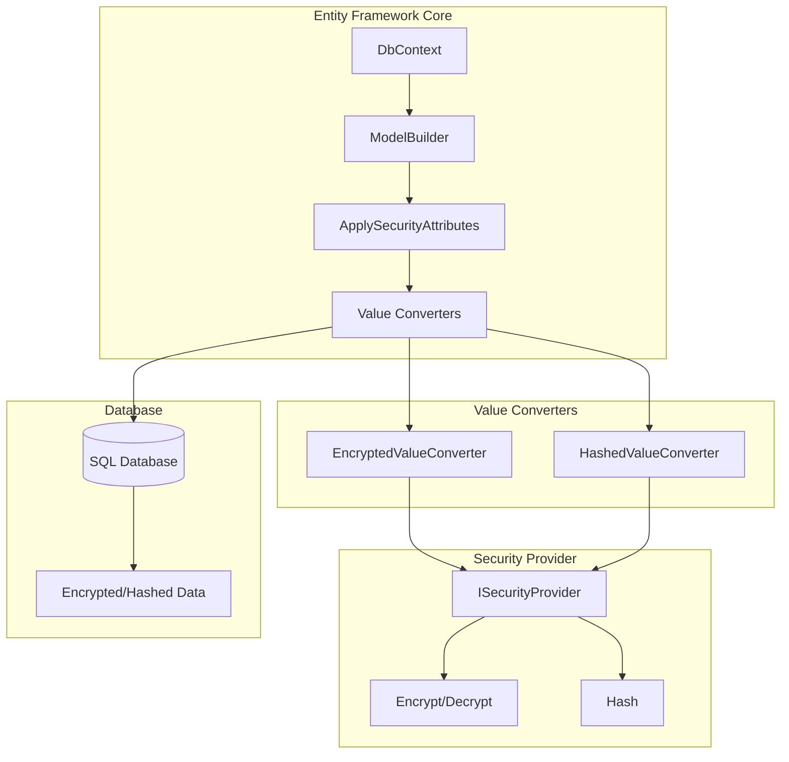
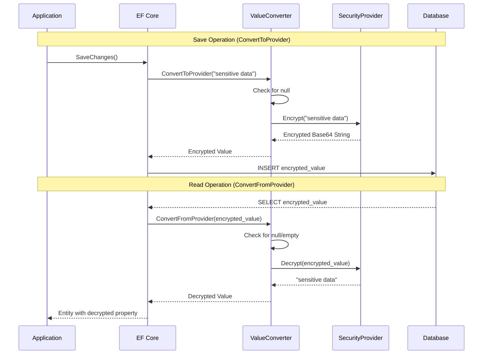
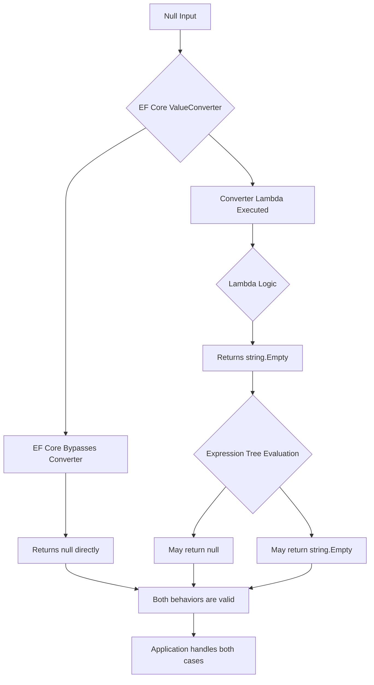
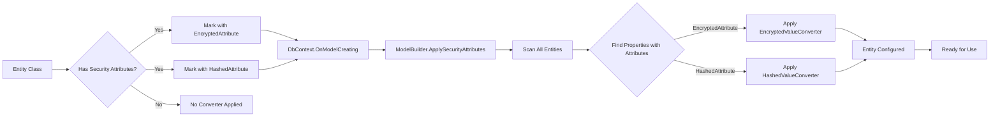
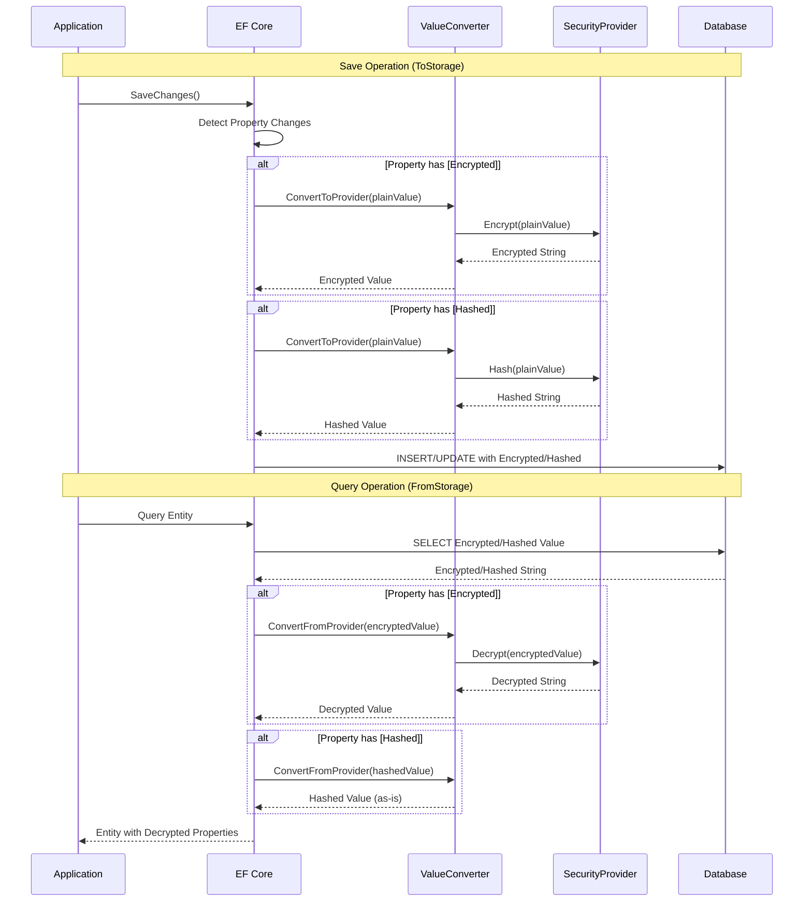
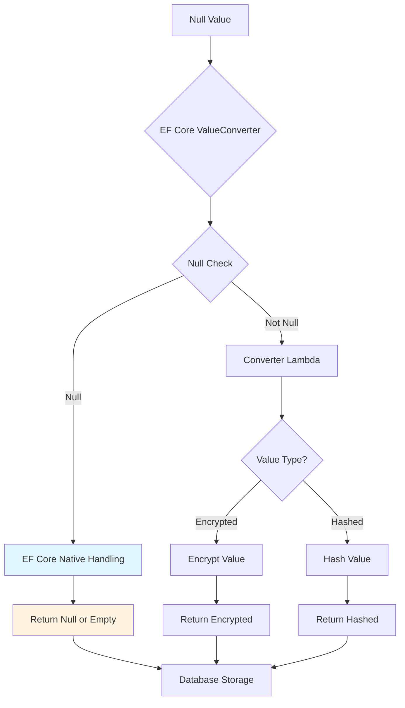
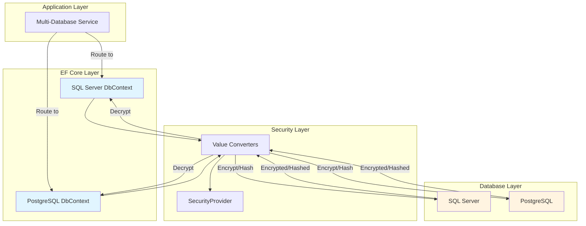
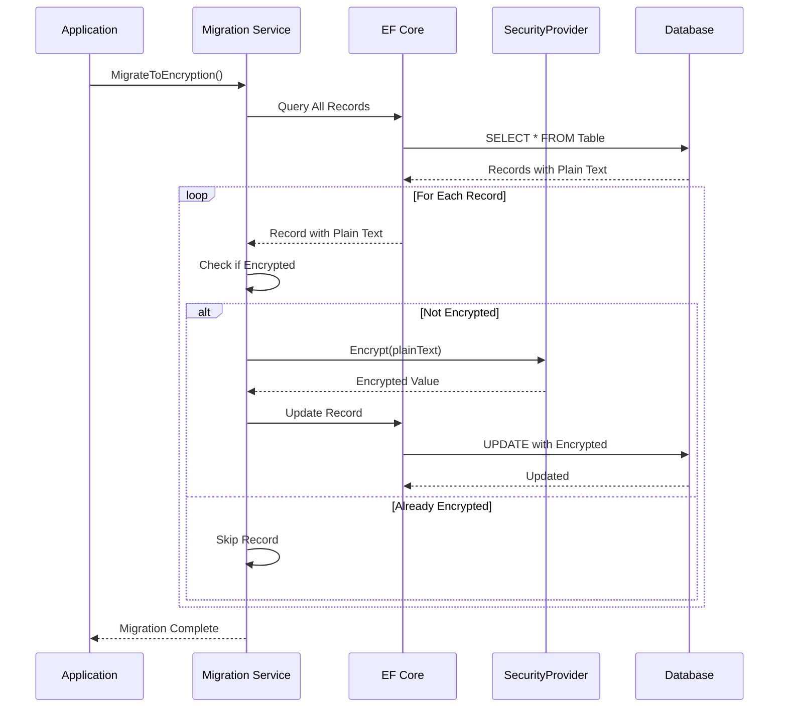
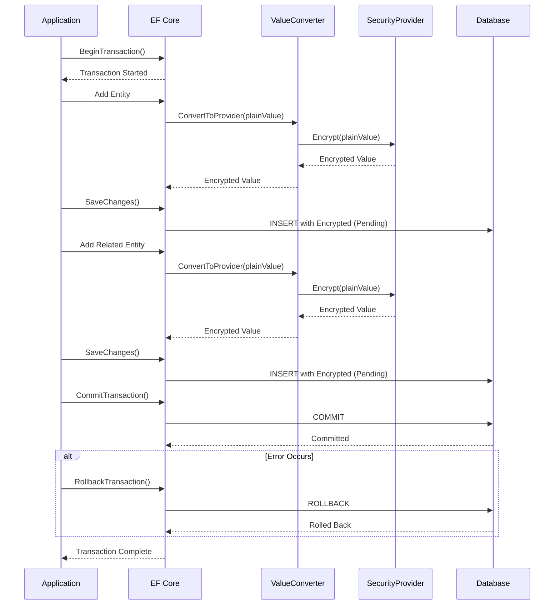

# Mamey.Security.EntityFramework


A specialized security library for Entity Framework Core integration with the Mamey framework, providing automatic encryption and hashing for properties marked with `[EncryptedAttribute]` and `[HashedAttribute]`.

> **🔐 Automatic Security**: Transparent encryption/hashing | Zero configuration | Attribute-based | Full EF Core integration

## Table of Contents

- [Overview](#overview)
- [Key Features](#key-features)
- [Architecture](#architecture)
- [Installation](#installation)
- [Quick Start](#quick-start)
- [Usage Examples](#usage-examples)
- [API Reference](#api-reference)
- [Configuration](#configuration)
- [Best Practices](#best-practices)
- [Troubleshooting](#troubleshooting)

## Overview

Mamey.Security.EntityFramework extends the Mamey.Security library with Entity Framework Core value converters that automatically encrypt and hash properties based on attributes. This provides seamless integration between security features and database persistence.

### Technical Overview

The library provides:

- **EF Core Value Converters**: Automatic encryption/hashing when saving to database
- **Automatic Decryption**: Encrypted properties are automatically decrypted when reading from database
- **Attribute-Based Configuration**: Uses `[EncryptedAttribute]` and `[HashedAttribute]` attributes
- **Automatic Application**: Scans all entities and applies converters automatically
- **Service Provider Integration**: Works seamlessly with dependency injection

### Why Use This Library?

- **Transparent Security**: Encrypt/hash data automatically without manual intervention
- **Type Safety**: Full compile-time type safety for all database operations
- **Zero Configuration**: Works out of the box with minimal setup
- **Performance**: Efficient value converters with minimal overhead
- **Integration**: Seamless integration with existing EF Core code

## Key Features

### Core Features

- **Automatic Encryption**: Properties marked with `[EncryptedAttribute]` are automatically encrypted when saving to database
- **Automatic Hashing**: Properties marked with `[HashedAttribute]` are automatically hashed when saving to database
- **Automatic Decryption**: Encrypted properties are automatically decrypted when reading from database
- **ModelBuilder Extensions**: Easy-to-use extension methods for applying security attributes
- **Service Provider Support**: Works with dependency injection containers

## Architecture

### Core Architecture



### Value Converter Workflow



### Null Value Handling Flow



### Entity Configuration Flow



### Value Converter Flow



### Null Value Handling Flow



### Multi-Database Architecture



### Migration Flow



### Transaction Flow with Encryption



## Installation

### Package Manager
```bash
Install-Package Mamey.Security.EntityFramework
```

### .NET CLI
```bash
dotnet add package Mamey.Security.EntityFramework
```

### PackageReference
```xml
<PackageReference Include="Mamey.Security.EntityFramework" Version="2.0.*" />
```

### Dependencies

This library requires:
- `Mamey.Security` (core security library)
- `Microsoft.EntityFrameworkCore` (9.0.11 or later)

## Quick Start

### Basic Setup

```csharp
using Mamey.Security;
using Mamey.Security.EntityFramework;
using Microsoft.EntityFrameworkCore;

public class Program
{
    public static void Main(string[] args)
    {
        var builder = WebApplication.CreateBuilder(args);
        
        builder.Services
            .AddMamey()
            .AddSecurity()
            .AddSecurityEntityFramework();
            
        // Configure DbContext
        builder.Services.AddDbContext<ApplicationDbContext>(options =>
            options.UseSqlServer(connectionString));
            
        var app = builder.Build();
        app.Run();
    }
}
```

### Entity Configuration

```csharp
using Mamey.Security;

public class User
{
    public int Id { get; set; }
    public string Name { get; set; }
    
    [Encrypted]
    public string Email { get; set; }
    
    [Encrypted]
    public string Phone { get; set; }
    
    [Hashed]
    public string PasswordHash { get; set; }
    
    public DateTime CreatedAt { get; set; }
}
```

### DbContext Configuration

```csharp
using Mamey.Security.EntityFramework;
using Microsoft.EntityFrameworkCore;

public class ApplicationDbContext : DbContext
{
    private readonly IServiceProvider _serviceProvider;

    public ApplicationDbContext(DbContextOptions<ApplicationDbContext> options, IServiceProvider serviceProvider)
        : base(options)
    {
        _serviceProvider = serviceProvider;
    }

    public DbSet<User> Users { get; set; }

    protected override void OnModelCreating(ModelBuilder modelBuilder)
    {
        base.OnModelCreating(modelBuilder);
        
        // Automatically apply security attributes
        modelBuilder.ApplySecurityAttributes(_serviceProvider);
        
        // Or use security provider directly
        // var securityProvider = _serviceProvider.GetRequiredService<ISecurityProvider>();
        // modelBuilder.ApplySecurityAttributes(securityProvider);
    }
}
```

## Usage Examples

This section provides comprehensive examples covering both basic and advanced scenarios for Entity Framework Core integration.

### Basic Example

```csharp
using Mamey.Security;
using Mamey.Security.EntityFramework;
using Microsoft.EntityFrameworkCore;

var builder = WebApplication.CreateBuilder(args);

// Add Mamey services
builder.Services
    .AddMamey()
    .AddSecurity()
    .AddSecurityEntityFramework();

// Configure DbContext
builder.Services.AddDbContext<ApplicationDbContext>(options =>
    options.UseSqlServer(connectionString));

var app = builder.Build();

// Usage in services
public class UserService
{
    private readonly ApplicationDbContext _context;

    public UserService(ApplicationDbContext context)
    {
        _context = context;
    }

    public async Task CreateUserAsync(string name, string email, string password)
    {
        var user = new User
        {
            Name = name,
            Email = email,        // Will be encrypted automatically
            PasswordHash = password, // Will be hashed automatically
            CreatedAt = DateTime.UtcNow
        };

        _context.Users.Add(user);
        await _context.SaveChangesAsync();
        // Email and PasswordHash are automatically encrypted/hashed
    }

    public async Task<User> GetUserAsync(int id)
    {
        var user = await _context.Users.FindAsync(id);
        // Email is automatically decrypted when reading from database
        return user;
    }
}
```

### Advanced Example - Complex Entity Relationships

```csharp
public class AdvancedUserService
{
    private readonly ApplicationDbContext _context;
    private readonly ILogger<AdvancedUserService> _logger;
    
    public AdvancedUserService(
        ApplicationDbContext context,
        ILogger<AdvancedUserService> logger)
    {
        _context = context;
        _logger = logger;
    }
    
    // Create user with related entities
    public async Task<User> CreateUserWithProfileAsync(CreateUserRequest request)
    {
        var user = new User
        {
            Name = request.Name,
            Email = request.Email,        // Encrypted automatically
            Phone = request.Phone,         // Encrypted automatically
            PasswordHash = request.Password // Hashed automatically
        };
        
        var profile = new UserProfile
        {
            User = user,
            Address = request.Address,     // Encrypted automatically
            Ssn = request.Ssn              // Encrypted automatically
        };
        
        user.Profile = profile;
        
        _context.Users.Add(user);
        await _context.SaveChangesAsync();
        
        _logger.LogInformation("User created with profile: {UserId}", user.Id);
        return user;
    }
    
    // Update user with automatic encryption
    public async Task<User> UpdateUserAsync(int userId, UpdateUserRequest request)
    {
        var user = await _context.Users.FindAsync(userId);
        if (user == null)
            throw new NotFoundException($"User {userId} not found");
        
        // Update encrypted fields - will be encrypted automatically on save
        if (!string.IsNullOrEmpty(request.Email))
            user.Email = request.Email;
        
        if (!string.IsNullOrEmpty(request.Phone))
            user.Phone = request.Phone;
        
        await _context.SaveChangesAsync();
        
        _logger.LogInformation("User updated: {UserId}", userId);
        return user;
    }
    
    // Batch operations
    public async Task<List<User>> CreateUsersBatchAsync(List<CreateUserRequest> requests)
    {
        var users = requests.Select(r => new User
        {
            Name = r.Name,
            Email = r.Email,        // Will be encrypted automatically
            Phone = r.Phone,        // Will be encrypted automatically
            PasswordHash = r.Password // Will be hashed automatically
        }).ToList();
        
        _context.Users.AddRange(users);
        await _context.SaveChangesAsync();
        
        _logger.LogInformation("Created {Count} users", users.Count);
        return users;
    }
    
    // Query with automatic decryption
    public async Task<List<User>> GetUsersByEmailDomainAsync(string domain)
    {
        // Note: EF Core cannot query encrypted fields directly
        // You need to load all records and filter in memory
        var users = await _context.Users.ToListAsync();
        return users.Where(u => u.Email.EndsWith($"@{domain}")).ToList();
    }
    
    // Transaction with automatic encryption/decryption
    public async Task<User> CreateUserWithTransactionAsync(CreateUserRequest request)
    {
        using var transaction = await _context.Database.BeginTransactionAsync();
        try
        {
            var user = new User
            {
                Name = request.Name,
                Email = request.Email,        // Encrypted automatically
                Phone = request.Phone,       // Encrypted automatically
                PasswordHash = request.Password // Hashed automatically
            };
            
            _context.Users.Add(user);
            await _context.SaveChangesAsync();
            
            // Create related entities
            var profile = new UserProfile
            {
                UserId = user.Id,
                Address = request.Address    // Encrypted automatically
            };
            
            _context.UserProfiles.Add(profile);
            await _context.SaveChangesAsync();
            
            await transaction.CommitAsync();
            
            _logger.LogInformation("User created with transaction: {UserId}", user.Id);
            return user;
        }
        catch (Exception ex)
        {
            await transaction.RollbackAsync();
            _logger.LogError(ex, "Failed to create user with transaction");
            throw;
        }
    }
}
```

### Advanced Example - Migration Scenarios

```csharp
public class MigrationService
{
    private readonly ApplicationDbContext _context;
    private readonly ISecurityProvider _securityProvider;
    private readonly ILogger<MigrationService> _logger;
    
    public MigrationService(
        ApplicationDbContext context,
        ISecurityProvider securityProvider,
        ILogger<MigrationService> logger)
    {
        _context = context;
        _securityProvider = securityProvider;
        _logger = logger;
    }
    
    // Migrate unencrypted data to encrypted
    public async Task MigrateToEncryptionAsync()
    {
        var users = await _context.Users
            .Where(u => !string.IsNullOrEmpty(u.Email))
            .ToListAsync();
        
        int migrated = 0;
        int failed = 0;
        
        foreach (var user in users)
        {
            try
            {
                // Check if already encrypted
                if (!IsEncrypted(user.Email))
                {
                    // Temporarily disable value converter to get raw value
                    // This is a simplified example - adjust based on your needs
                    var originalEmail = user.Email;
                    
                    // Re-encrypt with current key
                    user.Email = _securityProvider.Encrypt(originalEmail);
                    
                    migrated++;
                    _logger.LogInformation("Migrated user {UserId} email to encrypted", user.Id);
                }
            }
            catch (Exception ex)
            {
                failed++;
                _logger.LogError(ex, "Failed to migrate user {UserId}", user.Id);
            }
        }
        
        await _context.SaveChangesAsync();
        
        _logger.LogInformation("Migration completed: {Migrated} migrated, {Failed} failed", 
            migrated, failed);
    }
    
    private bool IsEncrypted(string value)
    {
        // Check if value looks encrypted
        // Adjust based on your encryption format
        return value.Length > 50 && value.Contains("=");
    }
}
```

### Advanced Example - Performance Optimization

```csharp
public class OptimizedUserService
{
    private readonly ApplicationDbContext _context;
    private readonly IMemoryCache _cache;
    private readonly ILogger<OptimizedUserService> _logger;
    
    public OptimizedUserService(
        ApplicationDbContext context,
        IMemoryCache cache,
        ILogger<OptimizedUserService> logger)
    {
        _context = context;
        _cache = cache;
        _logger = logger;
    }
    
    // Cache decrypted values
    public async Task<User?> GetUserCachedAsync(int userId)
    {
        var cacheKey = $"user:{userId}";
        
        if (_cache.TryGetValue(cacheKey, out User cachedUser))
        {
            return cachedUser;
        }
        
        var user = await _context.Users.FindAsync(userId);
        if (user == null)
            return null;
        
        // Email is automatically decrypted by value converter
        // Cache the decrypted user
        _cache.Set(cacheKey, user, TimeSpan.FromMinutes(5));
        
        return user;
    }
    
    // Batch load with caching
    public async Task<List<User>> GetUsersBatchAsync(List<int> userIds)
    {
        var users = new List<User>();
        var uncachedIds = new List<int>();
        
        // Check cache first
        foreach (var userId in userIds)
        {
            var cacheKey = $"user:{userId}";
            if (_cache.TryGetValue(cacheKey, out User cachedUser))
            {
                users.Add(cachedUser);
            }
            else
            {
                uncachedIds.Add(userId);
            }
        }
        
        // Load uncached users
        if (uncachedIds.Any())
        {
            var dbUsers = await _context.Users
                .Where(u => uncachedIds.Contains(u.Id))
                .ToListAsync();
            
            // Cache loaded users
            foreach (var user in dbUsers)
            {
                var cacheKey = $"user:{user.Id}";
                _cache.Set(cacheKey, user, TimeSpan.FromMinutes(5));
                users.Add(user);
            }
        }
        
        return users;
    }
}
```

### Multiple Entities

```csharp
public class ApplicationDbContext : DbContext
{
    private readonly IServiceProvider _serviceProvider;

    public ApplicationDbContext(DbContextOptions<ApplicationDbContext> options, IServiceProvider serviceProvider)
        : base(options)
    {
        _serviceProvider = serviceProvider;
    }

    public DbSet<User> Users { get; set; }
    public DbSet<Order> Orders { get; set; }
    public DbSet<Payment> Payments { get; set; }

    protected override void OnModelCreating(ModelBuilder modelBuilder)
    {
        base.OnModelCreating(modelBuilder);
        
        // Apply security attributes to all entities
        modelBuilder.ApplySecurityAttributes(_serviceProvider);
    }
}
```

### Custom Entity Configuration

```csharp
protected override void OnModelCreating(ModelBuilder modelBuilder)
{
    base.OnModelCreating(modelBuilder);
    
    // Apply security attributes
    modelBuilder.ApplySecurityAttributes(_serviceProvider);
    
    // Additional entity configuration
    modelBuilder.Entity<User>(entity =>
    {
        entity.HasIndex(e => e.Email);
        entity.Property(e => e.Name).IsRequired();
    });
}
```

## API Reference

### Extension Methods

#### AddSecurityEntityFramework
Registers Entity Framework Core security support.

**Key Features:**
- **No Service Registration**: Value converters are applied via ModelBuilder extensions
- **Attribute-Based**: Automatically applies converters based on `[EncryptedAttribute]` and `[HashedAttribute]`
- **Zero Configuration**: Works out of the box with minimal setup

```csharp
public static IMameyBuilder AddSecurityEntityFramework(this IMameyBuilder builder)
```

**Usage:**

```csharp
builder.Services
    .AddMamey()
    .AddSecurity()
    .AddSecurityEntityFramework();
```

#### ApplySecurityAttributes
Applies security attributes to all entities in the model. Scans all entity types and applies value converters to properties marked with security attributes.

**Key Features:**
- **Automatic Scanning**: Scans all entity types in the model
- **Property Detection**: Automatically detects properties with `[EncryptedAttribute]` and `[HashedAttribute]`
- **Converter Application**: Applies appropriate value converters
- **Service Provider Support**: Can resolve `ISecurityProvider` from service provider

```csharp
// With ISecurityProvider
public static ModelBuilder ApplySecurityAttributes(
    this ModelBuilder modelBuilder, 
    ISecurityProvider securityProvider)

// With IServiceProvider
public static ModelBuilder ApplySecurityAttributes(
    this ModelBuilder modelBuilder, 
    IServiceProvider serviceProvider)
```

**Usage:**

```csharp
// In DbContext.OnModelCreating
protected override void OnModelCreating(ModelBuilder modelBuilder)
{
    base.OnModelCreating(modelBuilder);
    
    // Apply security attributes (with service provider)
    modelBuilder.ApplySecurityAttributes(_serviceProvider);
    
    // Or with direct security provider
    var securityProvider = _serviceProvider.GetRequiredService<ISecurityProvider>();
    modelBuilder.ApplySecurityAttributes(securityProvider);
}
```

**How It Works:**
1. Scans all entity types in the model
2. For each entity, scans all string properties
3. Checks for `[EncryptedAttribute]` or `[HashedAttribute]`
4. Applies appropriate value converter to the property
5. Converter handles encryption/hashing automatically during save/load operations

### Value Converters

#### EncryptedValueConverter
EF Core value converter for automatically encrypting/decrypting string properties.

**Key Features:**
- **Automatic Encryption**: Encrypts values when saving to database
- **Automatic Decryption**: Decrypts values when reading from database
- **Null Handling**: Handles null values (EF Core may return null even if converter returns empty string)
- **Empty String Handling**: Handles empty strings correctly

```csharp
public class EncryptedValueConverter : ValueConverter<string, string>
{
    public EncryptedValueConverter(ISecurityProvider securityProvider)
        : base(
            // ConvertToProvider: Encrypt when saving to database
            v => v == null ? string.Empty : securityProvider.Encrypt(v),
            // ConvertFromProvider: Decrypt when reading from database
            v => (v == null || v.Length == 0) ? string.Empty : (securityProvider.Decrypt(v) ?? string.Empty))
    {
        if (securityProvider == null)
            throw new ArgumentNullException(nameof(securityProvider));
    }
}
```

**Behavior:**
- **Null Input**: Returns empty string (EF Core may still return null due to expression tree evaluation)
- **Empty String**: Returns empty string (not encrypted)
- **Valid Data**: Encrypts/decrypts automatically

**Usage:**

```csharp
// Applied automatically via ModelBuilder.ApplySecurityAttributes
// No manual usage required
```

#### HashedValueConverter
EF Core value converter for automatically hashing string properties.

**Key Features:**
- **Automatic Hashing**: Hashes values when saving to database
- **One-Way Operation**: Hashing is one-way (returns stored hash when reading)
- **Null Handling**: Handles null values correctly
- **Empty String Handling**: Handles empty strings correctly

```csharp
public class HashedValueConverter : ValueConverter<string, string>
{
    public HashedValueConverter(ISecurityProvider securityProvider)
        : base(
            // ConvertToProvider: Hash when saving to database
            v => (v == null || v.Length == 0) ? string.Empty : securityProvider.Hash(v),
            // ConvertFromProvider: Return stored hash (hashing is one-way)
            v => (v == null || v.Length == 0) ? string.Empty : (v ?? string.Empty))
    {
        if (securityProvider == null)
            throw new ArgumentNullException(nameof(securityProvider));
    }
}
```

**Behavior:**
- **Null Input**: Returns empty string (EF Core may still return null)
- **Empty String**: Returns empty string (not hashed)
- **Valid Data**: Hashes automatically (one-way operation)

**Usage:**

```csharp
// Applied automatically via ModelBuilder.ApplySecurityAttributes
// No manual usage required
```

### ModelBuilder Extensions

#### ApplySecurityAttributes (Detailed)

**Implementation Details:**

```csharp
public static ModelBuilder ApplySecurityAttributes(this ModelBuilder modelBuilder, ISecurityProvider securityProvider)
{
    foreach (var entityType in modelBuilder.Model.GetEntityTypes())
    {
        foreach (var property in entityType.GetProperties())
        {
            // Only process string properties
            if (property.ClrType != typeof(string))
                continue;

            var memberInfo = property.PropertyInfo as MemberInfo ?? property.FieldInfo as MemberInfo;
            if (memberInfo == null)
                continue;

            // Check for EncryptedAttribute
            if (memberInfo.GetCustomAttributes(typeof(EncryptedAttribute), inherit: true).Any())
            {
                property.SetValueConverter(new EncryptedValueConverter(securityProvider));
            }
            // Check for HashedAttribute
            else if (memberInfo.GetCustomAttributes(typeof(HashedAttribute), inherit: true).Any())
            {
                property.SetValueConverter(new HashedValueConverter(securityProvider));
            }
        }
    }

    return modelBuilder;
}
```

**Key Points:**
- Only processes string properties
- Checks both PropertyInfo and FieldInfo
- Uses `inherit: true` to check base class attributes
- Applies converters only to properties with attributes

## Configuration

### appsettings.json

```json
{
  "security": {
    "encryption": {
      "enabled": true,
      "key": "your-32-character-encryption-key-here"
    }
  },
  "ConnectionStrings": {
    "DefaultConnection": "Server=localhost;Database=MyApp;Trusted_Connection=True;"
  }
}
```

### Program.cs

```csharp
var builder = WebApplication.CreateBuilder(args);

builder.Services
    .AddMamey()
    .AddSecurity()  // Must be called first
    .AddSecurityEntityFramework();

builder.Services.AddDbContext<ApplicationDbContext>(options =>
    options.UseSqlServer(builder.Configuration.GetConnectionString("DefaultConnection")));
```

## Best Practices

### Security

1. **Use Strong Keys**: Use strong encryption keys (32 characters for AES-256)
2. **Secure Storage**: Store keys securely (use Azure Key Vault, AWS KMS, etc.)
3. **Key Rotation**: Regularly rotate encryption keys
4. **Separate Keys**: Use different keys for different environments

### Performance

1. **Index Considerations**: Encrypted/hashed values are stored in database, so indexing works normally
2. **Query Performance**: Encrypted values cannot be queried directly (use application-level filtering)
3. **Hashing**: Remember that hashing is one-way - you cannot retrieve the original value
4. **Bulk Operations**: Value converters work efficiently with bulk operations

### Entity Design

1. **Mark Sensitive Properties**: Use `[EncryptedAttribute]` for PII and sensitive data
2. **Mark Passwords**: Use `[HashedAttribute]` for passwords and other one-way hashes
3. **Avoid Over-Encryption**: Don't encrypt properties that need to be queried frequently
4. **Consider Indexing**: Encrypted values can still be indexed, but queries won't work as expected

### Database Design

1. **Column Types**: Use appropriate column types (NVARCHAR for encrypted strings)
2. **Length Considerations**: Encrypted values may be longer than original values
3. **Migration Strategy**: Plan migrations carefully when adding encryption to existing columns

## Troubleshooting

### Common Issues

#### 1. Encryption Key Issues

**Problem**: Encryption key is invalid or missing.

**Solution**: Ensure encryption key is configured and is exactly 32 characters.

```json
{
  "security": {
    "encryption": {
      "enabled": true,
      "key": "your-32-character-encryption-key-here"
    }
  }
}
```

#### 2. Value Converter Not Applied

**Problem**: Properties are not being encrypted/hashed.

**Solution**: Ensure `ApplySecurityAttributes()` is called in `OnModelCreating()`.

```csharp
protected override void OnModelCreating(ModelBuilder modelBuilder)
{
    base.OnModelCreating(modelBuilder);
    modelBuilder.ApplySecurityAttributes(_serviceProvider);
}
```

#### 3. Service Provider Not Available

**Problem**: Cannot resolve `ISecurityProvider` in `OnModelCreating()`.

**Solution**: Use the service provider passed to DbContext constructor.

```csharp
public ApplicationDbContext(DbContextOptions<ApplicationDbContext> options, IServiceProvider serviceProvider)
    : base(options)
{
    _serviceProvider = serviceProvider;
}
```

#### 4. Null Value Handling

**Problem**: Null values are not being handled correctly by value converters.

**Solution**: EF Core's `ValueConverter` does NOT process `null` values natively. EF Core handles `null` separately from converters. When testing or using value converters with null values:

- **For implementations**: The converter lambda should handle null, but EF Core may still return `null` due to expression tree evaluation
- **For tests**: Accept both `null` and `string.Empty` as valid behaviors when testing null handling

```csharp
// In tests - accept both null and empty string
var decrypted = converter.ConvertFromProvider(encrypted);
(decrypted == null || decrypted == string.Empty).ShouldBeTrue();
```

**Important**: This is by design in EF Core to allow the same converter to work with both nullable and non-nullable properties. Expression tree evaluation may differ from direct lambda execution.

#### 5. Wrong Key Decryption

**Problem**: Decrypting with wrong key doesn't throw exception.

**Solution**: When testing decryption with wrong keys, ensure different `SecurityProvider` instances use different encryption keys. AES decryption with wrong keys throws `CryptographicException` with message "Padding is invalid and cannot be removed".

```csharp
// Create second provider with different key
var securityOptions2 = new SecurityOptions
{
    Encryption = new EncryptionOptions
    {
        Enabled = true,
        Key = "different-32-character-key-here" // Different key
    }
};
var securityProvider2 = new SecurityProvider(/* ... */, securityOptions2);
var converter2 = new EncryptedValueConverter(securityProvider2);

// Should throw CryptographicException
Should.Throw<CryptographicException>(() => converter2.ConvertFromProvider(encrypted));
```

#### 6. Migration Issues

**Problem**: Migrations fail when adding encryption to existing columns.

**Solution**: Create a data migration to encrypt existing data.

```csharp
protected override void Up(MigrationBuilder migrationBuilder)
{
    // Add encrypted column
    migrationBuilder.AddColumn<string>(
        name: "EmailEncrypted",
        table: "Users",
        nullable: true);
    
    // Migrate existing data (encrypt)
    // Note: This requires running encryption logic
    
    // Remove old column
    migrationBuilder.DropColumn(
        name: "Email",
        table: "Users");
    
    // Rename encrypted column
    migrationBuilder.RenameColumn(
        name: "EmailEncrypted",
        table: "Users",
        newName: "Email");
}
```

### Debugging Tips

1. **Enable Logging**: Enable EF Core logging to see value converter operations
2. **Check Configuration**: Verify security configuration is correct
3. **Test Operations**: Test encryption/decryption operations separately
4. **Monitor Performance**: Monitor database operations for performance issues
5. **Null Handling**: Be aware that EF Core may return `null` for null inputs even when converter logic returns `string.Empty`

## EF Core ValueConverter Null Handling

### Important: EF Core Null Behavior

**Critical Understanding**: EF Core's `ValueConverter` does NOT process `null` values through the converter. This is by design to allow the same converter to work with both nullable and non-nullable properties.

**Expression Tree Evaluation**: When EF Core compiles converter lambdas into expression trees, the evaluation of `null` values may differ from direct lambda execution. The expression tree may return `null` even when the lambda logic explicitly returns `string.Empty`.

### Implementation Pattern

```csharp
public class EncryptedValueConverter : ValueConverter<string, string>
{
    public EncryptedValueConverter(ISecurityProvider securityProvider)
        : base(
            v => v == null ? string.Empty : securityProvider.Encrypt(v),
            v => (v == null || v.Length == 0) ? string.Empty : (securityProvider.Decrypt(v) ?? string.Empty))
    {
        if (securityProvider == null)
            throw new ArgumentNullException(nameof(securityProvider));
    }
}
```

### Test Pattern

When testing ValueConverter null handling, accept both `null` and `string.Empty` as valid behaviors:

```csharp
[Fact]
public void EncryptedValueConverter_NullValue_ShouldHandleNull()
{
    var converter = new EncryptedValueConverter(_fixture.SecurityProvider);
    string? value = null;
    
    var encrypted = converter.ConvertToProvider(value!);
    var decrypted = converter.ConvertFromProvider(encrypted);
    
    // Accept either null or string.Empty - both are valid EF Core behaviors
    (decrypted == null || decrypted == string.Empty).ShouldBeTrue();
}
```

### Why This Happens

1. **EF Core Design**: EF Core intentionally doesn't process `null` through converters
2. **Expression Trees**: Expression tree evaluation may differ from compiled code
3. **Nullable Support**: Allows same converter to work with nullable and non-nullable properties

## Related Libraries

- [Mamey.Security](../Mamey.Security/README.md) - Core security library
- [Mamey.Security.MongoDB](../Mamey.Security.MongoDB/README.md) - MongoDB integration
- [Mamey.Security.Redis](../Mamey.Security.Redis/README.md) - Redis integration

## License

This project is licensed under the MIT License - see the [LICENSE](LICENSE) file for details.

## Contributing

Please read [CONTRIBUTING.md](CONTRIBUTING.md) for details on our code of conduct and the process for submitting pull requests.

## Support

For support and questions, please open an issue in the [GitHub repository](https://github.com/mamey-io/mamey-security-entityframework/issues).
