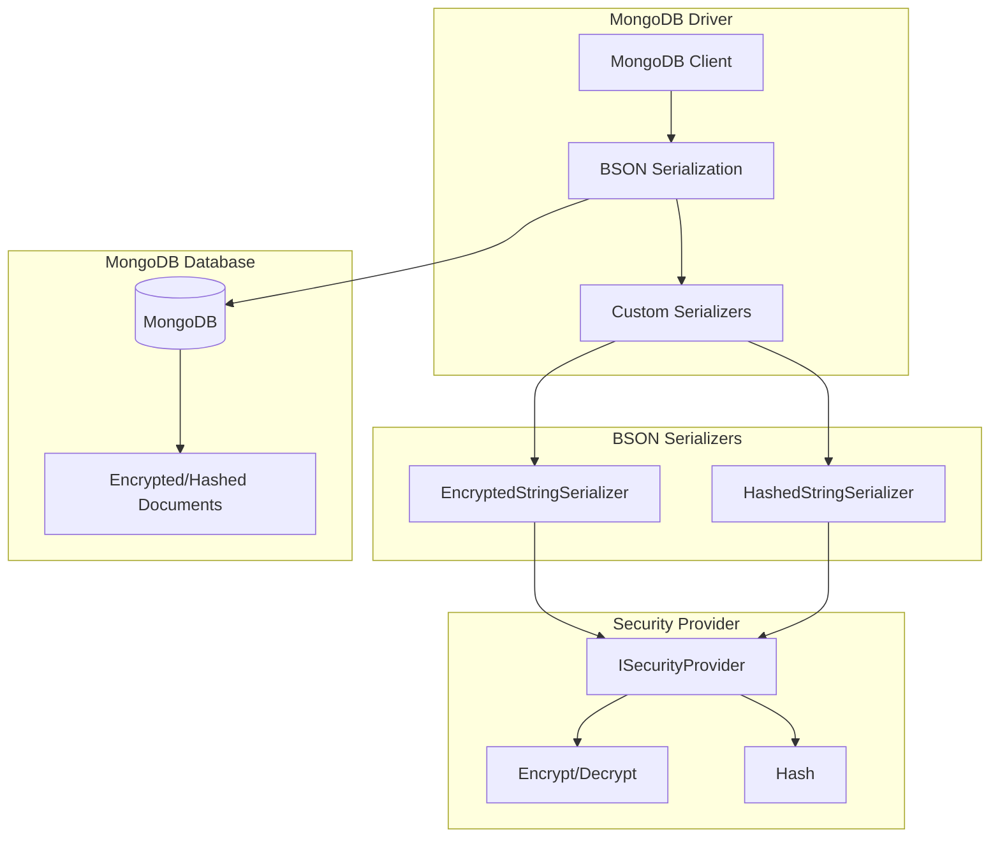
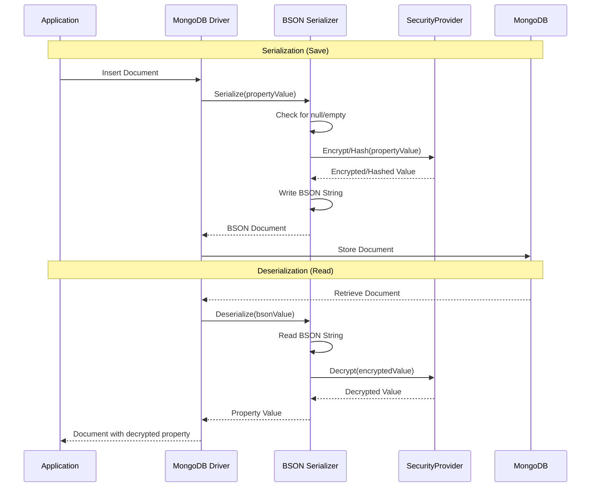
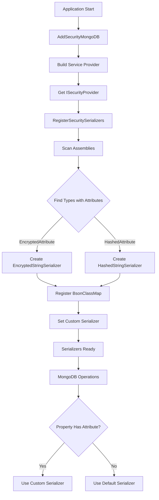
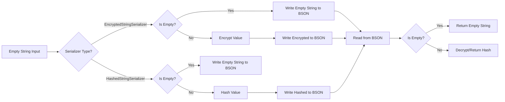
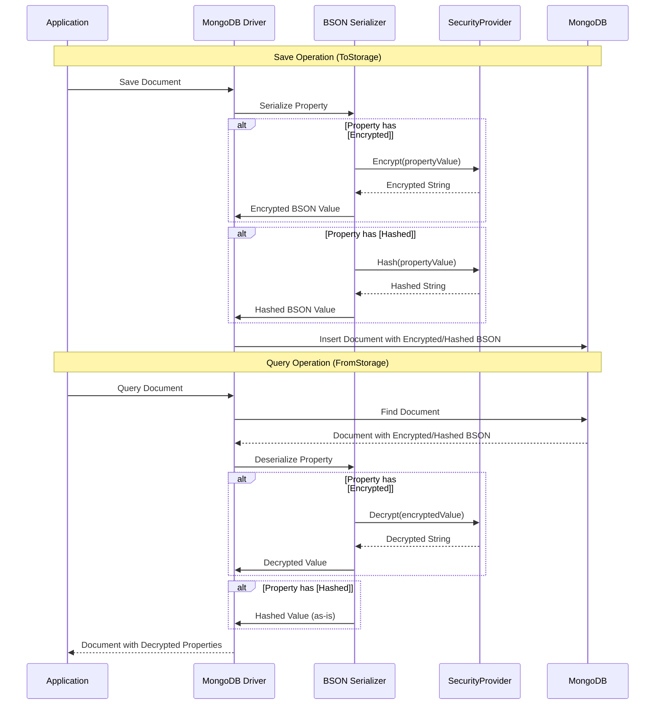
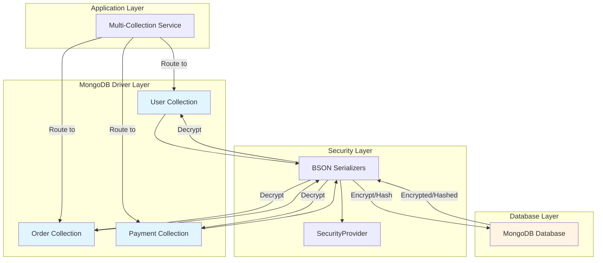
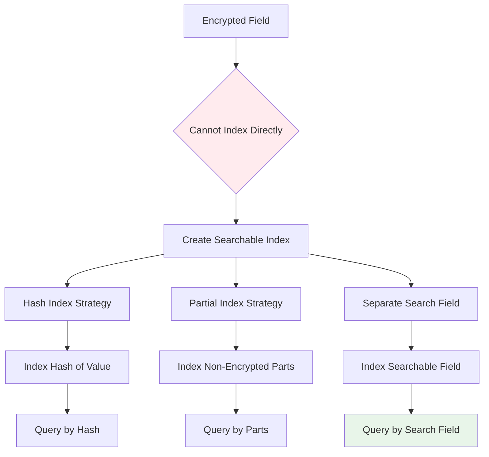

# Mamey.Security.MongoDB


A specialized security library for MongoDB integration with the Mamey framework, providing automatic encryption and hashing for properties marked with `[EncryptedAttribute]` and `[HashedAttribute]`.

> **📦 BSON Security**: Automatic encryption/hashing | BSON serializers | Assembly scanning | Zero configuration

## Table of Contents

- [Overview](#overview)
- [Key Features](#key-features)
- [Architecture](#architecture)
- [Installation](#installation)
- [Quick Start](#quick-start)
- [Usage Examples](#usage-examples)
- [API Reference](#api-reference)
- [Configuration](#configuration)
- [Best Practices](#best-practices)
- [Troubleshooting](#troubleshooting)

## Overview

Mamey.Security.MongoDB extends the Mamey.Security library with MongoDB BSON serializers that automatically encrypt and hash properties based on attributes. This provides seamless integration between security features and MongoDB document storage.

### Technical Overview

The library provides:

- **MongoDB BSON Serializers**: Automatic encryption/hashing during serialization
- **Automatic Decryption**: Encrypted properties are automatically decrypted during deserialization
- **Attribute-Based Configuration**: Uses `[EncryptedAttribute]` and `[HashedAttribute]` attributes
- **Automatic Registration**: Scans assemblies and registers serializers automatically
- **Service Provider Integration**: Works seamlessly with dependency injection

### Why Use This Library?

- **Transparent Security**: Encrypt/hash data automatically without manual intervention
- **Type Safety**: Full compile-time type safety for all database operations
- **Zero Configuration**: Works out of the box with minimal setup
- **Performance**: Efficient serializers with minimal overhead
- **Integration**: Seamless integration with existing MongoDB code

## Key Features

### Core Features

- **Automatic Encryption**: Properties marked with `[EncryptedAttribute]` are automatically encrypted during serialization
- **Automatic Hashing**: Properties marked with `[HashedAttribute]` are automatically hashed during serialization
- **Automatic Decryption**: Encrypted properties are automatically decrypted during deserialization
- **Assembly Scanning**: Automatically registers serializers for all types with security attributes
- **Service Provider Support**: Works with dependency injection containers

## Architecture

### Core Architecture



### BSON Serialization Workflow



### Serializer Registration Flow



### Empty String Handling Flow



### BSON Serialization Flow



### Multi-Collection Architecture



### Search Index Strategy



## Installation

### Package Manager
```bash
Install-Package Mamey.Security.MongoDB
```

### .NET CLI
```bash
dotnet add package Mamey.Security.MongoDB
```

### PackageReference
```xml
<PackageReference Include="Mamey.Security.MongoDB" Version="2.0.*" />
```

### Dependencies

This library requires:
- `Mamey.Security` (core security library)
- `Mamey.Persistence.MongoDB` (MongoDB persistence library)
- `MongoDB.Bson` (3.5.0 or later)

## Quick Start

### Basic Setup

```csharp
using Mamey.Security;
using Mamey.Security.MongoDB;
using Mamey.Persistence.MongoDB;
using System.Reflection;

public class Program
{
    public static void Main(string[] args)
    {
        var builder = WebApplication.CreateBuilder(args);
        
        builder.Services
            .AddMamey()
            .AddSecurity()
            .AddMongo()
            .AddSecurityMongoDB();
            
        // Register serializers for all types in the current assembly
        var serviceProvider = builder.Services.BuildServiceProvider();
        var securityProvider = serviceProvider.GetRequiredService<ISecurityProvider>();
        Extensions.RegisterSecuritySerializers(securityProvider, Assembly.GetExecutingAssembly());
            
        var app = builder.Build();
        app.Run();
    }
}
```

### Document Configuration

```csharp
using Mamey.Security;

public class User
{
    public string Id { get; set; }
    public string Name { get; set; }
    
    [Encrypted]
    public string Email { get; set; }
    
    [Encrypted]
    public string Phone { get; set; }
    
    [Hashed]
    public string PasswordHash { get; set; }
    
    public DateTime CreatedAt { get; set; }
}
```

## Usage Examples

This section provides comprehensive examples covering both basic and advanced scenarios for MongoDB integration.

### Basic Example

```csharp
using Mamey.Security;
using Mamey.Security.MongoDB;
using Mamey.Persistence.MongoDB;
using System.Reflection;

var builder = WebApplication.CreateBuilder(args);

// Add Mamey services
builder.Services
    .AddMamey()
    .AddSecurity()
    .AddMongo()
    .AddSecurityMongoDB();

// Register serializers
var serviceProvider = builder.Services.BuildServiceProvider();
var securityProvider = serviceProvider.GetRequiredService<ISecurityProvider>();
Extensions.RegisterSecuritySerializers(securityProvider, Assembly.GetExecutingAssembly());

var app = builder.Build();

// Usage in services
public class UserService
{
    private readonly IMongoRepository<User, string> _repository;

    public UserService(IMongoRepository<User, string> repository)
    {
        _repository = repository;
    }

    public async Task CreateUserAsync(string name, string email, string password)
    {
        var user = new User
        {
            Id = Guid.NewGuid().ToString(),
            Name = name,
            Email = email,        // Will be encrypted automatically
            PasswordHash = password, // Will be hashed automatically
            CreatedAt = DateTime.UtcNow
        };

        await _repository.AddAsync(user);
        // Email and PasswordHash are automatically encrypted/hashed
    }

    public async Task<User> GetUserAsync(string id)
    {
        var user = await _repository.GetAsync(id);
        // Email is automatically decrypted when reading from database
        return user;
    }
}
```

### Advanced Example - Complex Document Structures

```csharp
public class AdvancedMongoService
{
    private readonly IMongoRepository<User, string> _userRepository;
    private readonly IMongoRepository<Order, string> _orderRepository;
    private readonly ILogger<AdvancedMongoService> _logger;
    
    public AdvancedMongoService(
        IMongoRepository<User, string> userRepository,
        IMongoRepository<Order, string> orderRepository,
        ILogger<AdvancedMongoService> logger)
    {
        _userRepository = userRepository;
        _orderRepository = orderRepository;
        _logger = logger;
    }
    
    // Create user with nested encrypted data
    public async Task<User> CreateUserWithNestedDataAsync(CreateUserRequest request)
    {
        var user = new User
        {
            Id = Guid.NewGuid().ToString(),
            Name = request.Name,
            Email = request.Email,        // Encrypted automatically
            Phone = request.Phone,         // Encrypted automatically
            PasswordHash = request.Password, // Hashed automatically
            Address = new Address
            {
                Street = request.Street,   // Encrypted automatically
                City = request.City,       // Encrypted automatically
                ZipCode = request.ZipCode  // Encrypted automatically
            }
        };
        
        await _userRepository.AddAsync(user);
        
        _logger.LogInformation("User created with nested data: {UserId}", user.Id);
        return user;
    }
    
    // Batch operations
    public async Task<List<User>> CreateUsersBatchAsync(List<CreateUserRequest> requests)
    {
        var users = requests.Select(r => new User
        {
            Id = Guid.NewGuid().ToString(),
            Name = r.Name,
            Email = r.Email,        // Encrypted automatically
            Phone = r.Phone,        // Encrypted automatically
            PasswordHash = r.Password // Hashed automatically
        }).ToList();
        
        foreach (var user in users)
        {
            await _userRepository.AddAsync(user);
        }
        
        _logger.LogInformation("Created {Count} users", users.Count);
        return users;
    }
    
    // Update with automatic encryption
    public async Task<User> UpdateUserAsync(string userId, UpdateUserRequest request)
    {
        var user = await _userRepository.GetAsync(userId);
        if (user == null)
            throw new NotFoundException($"User {userId} not found");
        
        // Update encrypted fields - will be encrypted automatically on save
        if (!string.IsNullOrEmpty(request.Email))
            user.Email = request.Email;
        
        if (!string.IsNullOrEmpty(request.Phone))
            user.Phone = request.Phone;
        
        await _userRepository.UpdateAsync(user);
        
        _logger.LogInformation("User updated: {UserId}", userId);
        return user;
    }
    
    // Query with automatic decryption
    public async Task<List<User>> FindUsersByEmailDomainAsync(string domain)
    {
        // Note: MongoDB cannot query encrypted fields directly
        // You need to load all records and filter in memory
        var users = await _userRepository.FindAsync(u => true);
        return users.Where(u => u.Email.EndsWith($"@{domain}")).ToList();
    }
}
```

### Advanced Example - Search Index Management

```csharp
public class MongoSearchService
{
    private readonly IMongoRepository<User, string> _repository;
    private readonly ILogger<MongoSearchService> _logger;
    
    public MongoSearchService(
        IMongoRepository<User, string> repository,
        ILogger<MongoSearchService> logger)
    {
        _repository = repository;
        _logger = logger;
    }
    
    // Create searchable index for encrypted fields
    // Note: You cannot index encrypted fields directly
    // Create a separate searchable field (e.g., EmailHash for searching)
    public async Task CreateSearchableIndexAsync()
    {
        // Create index on non-encrypted fields
        // For encrypted fields, create a hash index for searching
        // This is a simplified example - adjust based on your needs
        _logger.LogInformation("Creating searchable indexes for encrypted fields");
    }
}
```

### Multiple Assemblies

```csharp
// Register serializers for multiple assemblies
var securityProvider = serviceProvider.GetRequiredService<ISecurityProvider>();
Extensions.RegisterSecuritySerializers(
    securityProvider,
    Assembly.GetExecutingAssembly(),
    typeof(User).Assembly,
    typeof(Order).Assembly
);
```

### Custom Type Registration

```csharp
// Register serializers for specific types
var securityProvider = serviceProvider.GetRequiredService<ISecurityProvider>();

// Register for a specific type
BsonClassMap.RegisterClassMap<User>(cm =>
{
    cm.AutoMap();
    cm.GetMemberMap(nameof(User.Email))
        .SetSerializer(new EncryptedStringSerializer(securityProvider));
    cm.GetMemberMap(nameof(User.PasswordHash))
        .SetSerializer(new HashedStringSerializer(securityProvider));
});
```

## API Reference

### Extension Methods

#### AddSecurityMongoDB
Registers MongoDB security serializers.

**Key Features:**
- **No Service Registration**: Serializers are registered via `RegisterSecuritySerializers` method
- **Assembly Scanning**: Requires manual registration via `RegisterSecuritySerializers`
- **Zero Configuration**: Works out of the box with minimal setup

```csharp
public static IMameyBuilder AddSecurityMongoDB(this IMameyBuilder builder)
```

**Usage:**

```csharp
builder.Services
    .AddMamey()
    .AddSecurity()
    .AddMongo()
    .AddSecurityMongoDB();
```

#### RegisterSecuritySerializers
Registers MongoDB serializers for all types in the specified assemblies. Scans assemblies for types with properties marked with security attributes and registers BSON serializers.

**Key Features:**
- **Assembly Scanning**: Scans specified assemblies for types with security attributes
- **Automatic Registration**: Automatically registers BSON serializers for matching properties
- **BsonClassMap Registration**: Registers class maps with custom serializers
- **Multiple Assemblies**: Supports scanning multiple assemblies

```csharp
public static void RegisterSecuritySerializers(
    ISecurityProvider securityProvider, 
    params Assembly[] assemblies)
```

**How It Works:**
1. Scans all types in specified assemblies
2. For each type, finds string properties with `[EncryptedAttribute]` or `[HashedAttribute]`
3. Creates `BsonClassMap` for the type if not already registered
4. Sets custom serializer for each property with security attribute
5. Registers the class map with MongoDB driver

**Usage:**

```csharp
// Register for current assembly
var securityProvider = serviceProvider.GetRequiredService<ISecurityProvider>();
Extensions.RegisterSecuritySerializers(securityProvider, Assembly.GetExecutingAssembly());

// Register for multiple assemblies
Extensions.RegisterSecuritySerializers(
    securityProvider,
    Assembly.GetExecutingAssembly(),
    typeof(User).Assembly,
    typeof(Order).Assembly
);
```

**Important Notes:**
- Must be called after building the service provider
- Should be called during application startup
- Only processes types that haven't been registered yet

### Serializers

#### EncryptedStringSerializer
MongoDB BSON serializer for automatically encrypting/decrypting string properties.

**Key Features:**
- **Automatic Encryption**: Encrypts values during BSON serialization
- **Automatic Decryption**: Decrypts values during BSON deserialization
- **Null Handling**: Properly handles null values
- **Empty String Handling**: Handles empty strings correctly

```csharp
public class EncryptedStringSerializer : SerializerBase<string>
{
    public EncryptedStringSerializer(ISecurityProvider securityProvider);
    
    // Deserialize: Decrypt when reading from MongoDB
    public override string Deserialize(BsonDeserializationContext context, BsonDeserializationArgs args);
    
    // Serialize: Encrypt when writing to MongoDB
    public override void Serialize(BsonSerializationContext context, BsonSerializationArgs args, string value);
}
```

**Behavior:**
- **Null Value**: Writes/reads null correctly
- **Empty String**: Writes/reads empty string (not encrypted)
- **Valid Data**: Encrypts/decrypts automatically

**Usage:**

```csharp
// Applied automatically via RegisterSecuritySerializers
// Or manually:
BsonClassMap.RegisterClassMap<User>(cm =>
{
    cm.AutoMap();
    cm.GetMemberMap(nameof(User.Email))
        .SetSerializer(new EncryptedStringSerializer(securityProvider));
});
```

#### HashedStringSerializer
MongoDB BSON serializer for automatically hashing string properties.

**Key Features:**
- **Automatic Hashing**: Hashes values during BSON serialization
- **One-Way Operation**: Returns stored hash during deserialization (cannot reverse)
- **Null Handling**: Properly handles null values
- **Empty String Handling**: Handles empty strings correctly

```csharp
public class HashedStringSerializer : SerializerBase<string>
{
    public HashedStringSerializer(ISecurityProvider securityProvider);
    
    // Deserialize: Return stored hash (hashing is one-way)
    public override string Deserialize(BsonDeserializationContext context, BsonDeserializationArgs args);
    
    // Serialize: Hash when writing to MongoDB
    public override void Serialize(BsonSerializationContext context, BsonSerializationArgs args, string value);
}
```

**Behavior:**
- **Null Value**: Writes/reads null correctly
- **Empty String**: Writes/reads empty string (not hashed)
- **Valid Data**: Hashes automatically (one-way operation)

**Usage:**

```csharp
// Applied automatically via RegisterSecuritySerializers
// Or manually:
BsonClassMap.RegisterClassMap<User>(cm =>
{
    cm.AutoMap();
    cm.GetMemberMap(nameof(User.PasswordHash))
        .SetSerializer(new HashedStringSerializer(securityProvider));
});
```

## Configuration

### appsettings.json

```json
{
  "security": {
    "encryption": {
      "enabled": true,
      "key": "your-32-character-encryption-key-here"
    },
    "mongo": {
      "connectionString": "mongodb://localhost:27017",
      "database": "mydatabase"
    }
  }
}
```

### Program.cs

```csharp
var builder = WebApplication.CreateBuilder(args);

builder.Services
    .AddMamey()
    .AddSecurity()  // Must be called first
    .AddMongo()
    .AddSecurityMongoDB();

// Register serializers after building service provider
var serviceProvider = builder.Services.BuildServiceProvider();
var securityProvider = serviceProvider.GetRequiredService<ISecurityProvider>();
Extensions.RegisterSecuritySerializers(securityProvider, Assembly.GetExecutingAssembly());
```

## Best Practices

### Security

1. **Use Strong Keys**: Use strong encryption keys (32 characters for AES-256)
2. **Secure Storage**: Store keys securely (use Azure Key Vault, AWS KMS, etc.)
3. **Key Rotation**: Regularly rotate encryption keys
4. **Separate Keys**: Use different keys for different environments

### Performance

1. **Index Considerations**: Encrypted/hashed values are stored in MongoDB, so indexing works normally
2. **Query Performance**: Encrypted values cannot be queried directly (use application-level filtering)
3. **Hashing**: Remember that hashing is one-way - you cannot retrieve the original value
4. **Bulk Operations**: Serializers work efficiently with bulk operations

### Document Design

1. **Mark Sensitive Properties**: Use `[EncryptedAttribute]` for PII and sensitive data
2. **Mark Passwords**: Use `[HashedAttribute]` for passwords and other one-way hashes
3. **Avoid Over-Encryption**: Don't encrypt properties that need to be queried frequently
4. **Consider Indexing**: Encrypted values can still be indexed, but queries won't work as expected

### MongoDB Design

1. **Document Structure**: Encrypted/hashed values are stored as strings in MongoDB
2. **Length Considerations**: Encrypted values may be longer than original values
3. **Migration Strategy**: Plan migrations carefully when adding encryption to existing documents

## Troubleshooting

### Common Issues

#### 1. Encryption Key Issues

**Problem**: Encryption key is invalid or missing.

**Solution**: Ensure encryption key is configured and is exactly 32 characters.

```json
{
  "security": {
    "encryption": {
      "enabled": true,
      "key": "your-32-character-encryption-key-here"
    }
  }
}
```

#### 2. Serializers Not Registered

**Problem**: Properties are not being encrypted/hashed.

**Solution**: Ensure `RegisterSecuritySerializers()` is called with the correct assemblies.

```csharp
var securityProvider = serviceProvider.GetRequiredService<ISecurityProvider>();
Extensions.RegisterSecuritySerializers(securityProvider, Assembly.GetExecutingAssembly());
```

#### 3. Service Provider Not Available

**Problem**: Cannot resolve `ISecurityProvider`.

**Solution**: Ensure `AddSecurity()` is called before `AddSecurityMongoDB()`.

```csharp
builder.Services
    .AddMamey()
    .AddSecurity()  // Must be called first
    .AddMongo()
    .AddSecurityMongoDB();
```

#### 4. Assembly Scanning Issues

**Problem**: Serializers are not being registered for certain types.

**Solution**: Ensure the assembly containing the types is passed to `RegisterSecuritySerializers()`.

```csharp
// Register for all assemblies
Extensions.RegisterSecuritySerializers(
    securityProvider,
    Assembly.GetExecutingAssembly(),
    typeof(User).Assembly,
    typeof(Order).Assembly
);
```

#### 5. Empty String Handling

**Problem**: Empty strings cause exceptions in MongoDB serialization.

**Solution**: The serializers handle empty strings correctly:
- **EncryptedStringSerializer**: Empty strings are serialized as empty strings (not encrypted)
- **HashedStringSerializer**: Empty strings are serialized as empty strings (not hashed)

```csharp
// Empty strings are handled gracefully
var user = new User { Email = string.Empty };
await _repository.AddAsync(user); // Works correctly
```

#### 6. Wrong Key Decryption

**Problem**: Deserializing with wrong key doesn't throw exception.

**Solution**: When decrypting with wrong key, MongoDB serializers will throw `CryptographicException` or return garbage data. Ensure different `SecurityProvider` instances use different encryption keys when testing.

```csharp
// Create second provider with different key
var securityOptions2 = new SecurityOptions
{
    Encryption = new EncryptionOptions
    {
        Enabled = true,
        Key = "different-32-character-key-here" // Different key
    }
};
var securityProvider2 = new SecurityProvider(/* ... */, securityOptions2);
var serializer2 = new EncryptedStringSerializer(securityProvider2);

// Should throw CryptographicException or return garbage
try
{
    var decrypted = serializer2.Deserialize(/* encrypted value */);
    // May return garbage data or throw exception
}
catch (CryptographicException)
{
    // Expected when wrong key is used
}
```

### Debugging Tips

1. **Enable Logging**: Enable MongoDB driver logging to see serializer operations
2. **Check Configuration**: Verify security configuration is correct
3. **Test Operations**: Test encryption/decryption operations separately
4. **Monitor Performance**: Monitor MongoDB operations for performance issues
5. **BSON Context**: Ensure serialization/deserialization happens within proper BSON document context

## Related Libraries

- [Mamey.Security](../Mamey.Security/README.md) - Core security library
- [Mamey.Security.EntityFramework](../Mamey.Security.EntityFramework/README.md) - Entity Framework Core integration
- [Mamey.Security.Redis](../Mamey.Security.Redis/README.md) - Redis integration
- [Mamey.Persistence.MongoDB](../Mamey.Persistence.MongoDB/README.md) - MongoDB persistence library

## License

This project is licensed under the MIT License - see the [LICENSE](LICENSE) file for details.

## Contributing

Please read [CONTRIBUTING.md](CONTRIBUTING.md) for details on our code of conduct and the process for submitting pull requests.

## Support

For support and questions, please open an issue in the [GitHub repository](https://github.com/mamey-io/mamey-security-mongodb/issues).
