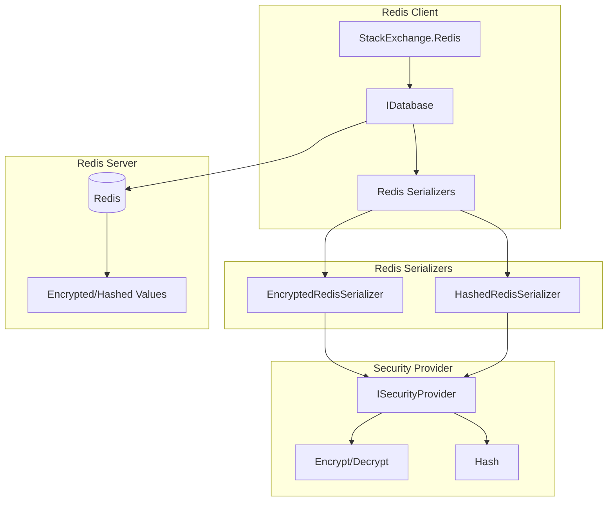
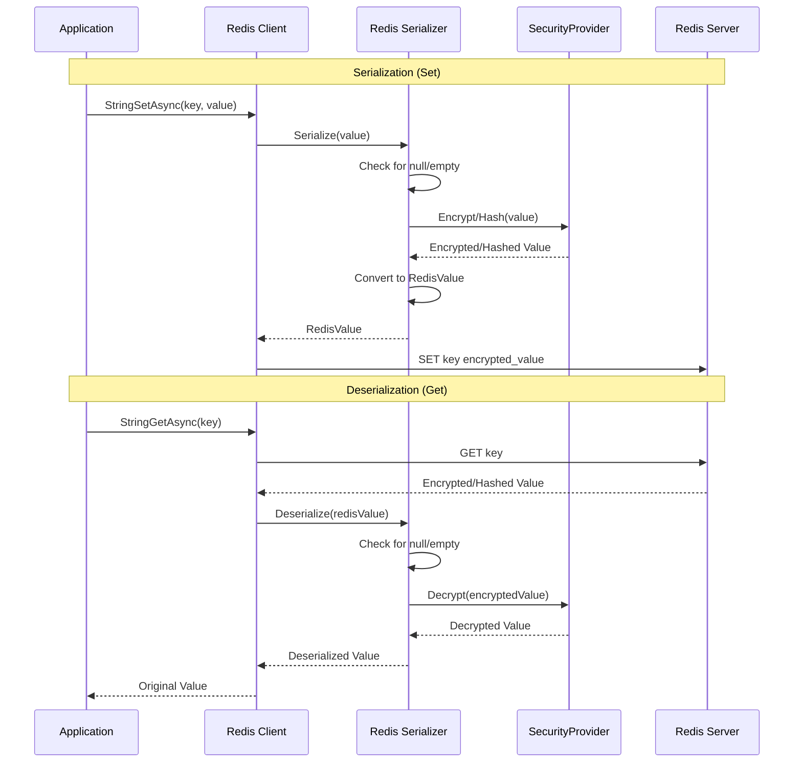
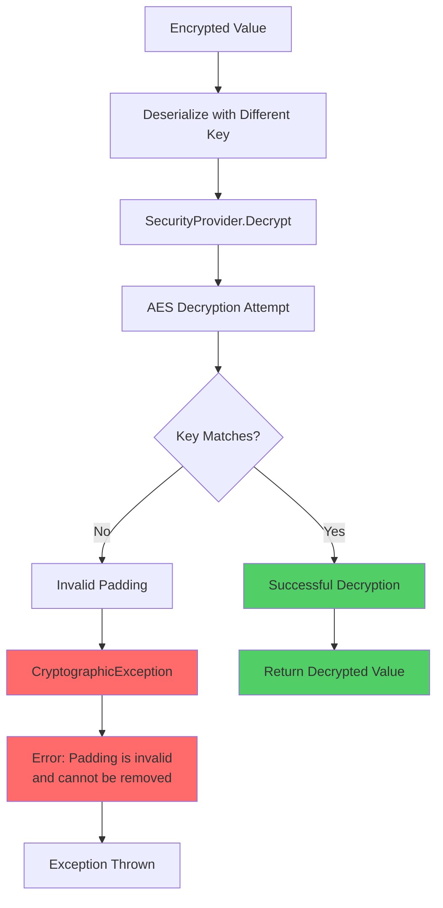
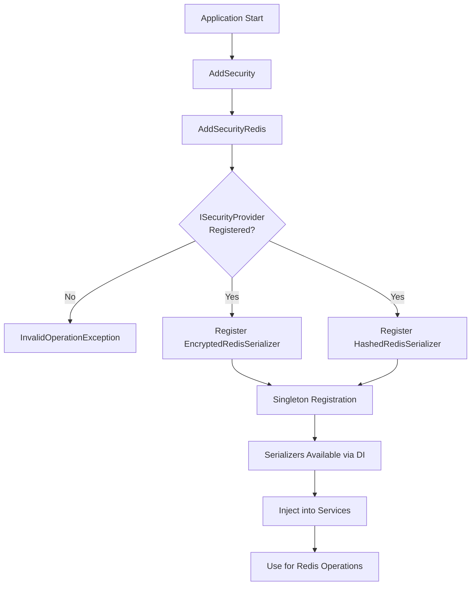
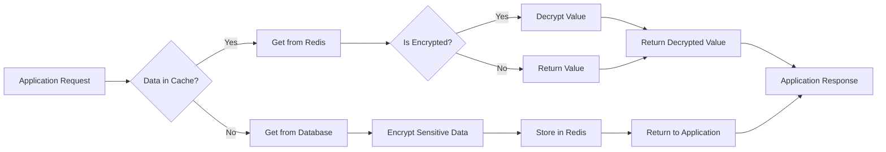
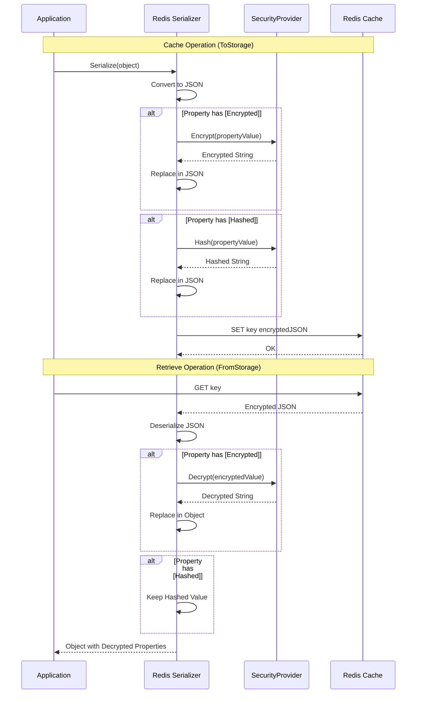
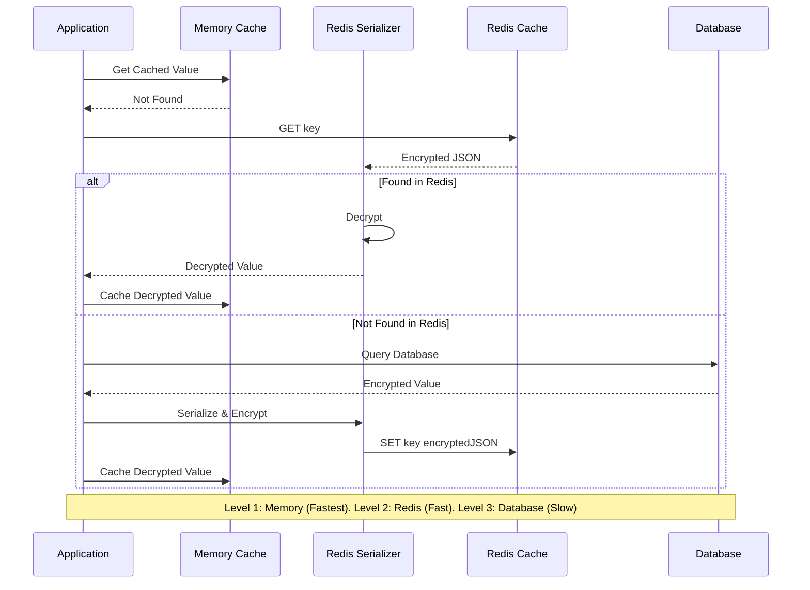
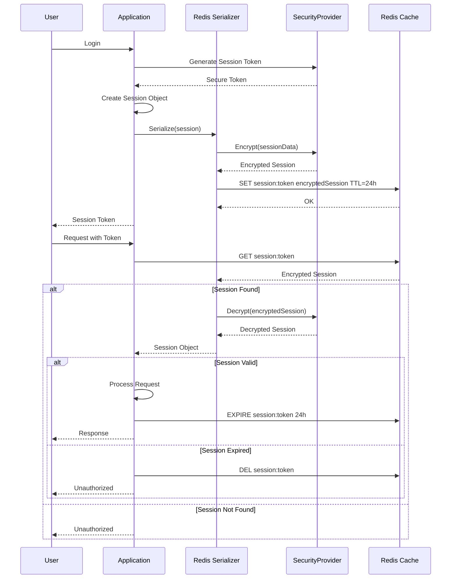
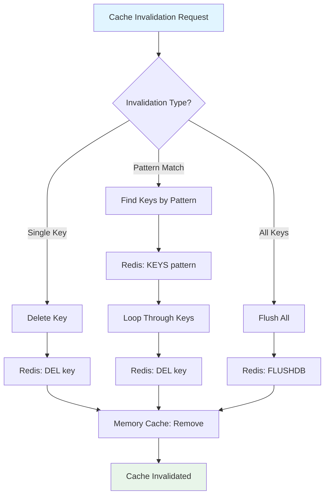
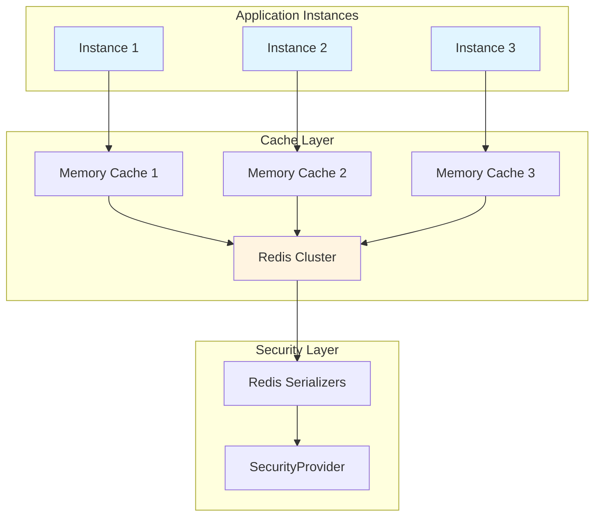

# Mamey.Security.Redis


A specialized security library for Redis integration with the Mamey framework, providing automatic encryption and hashing for Redis operations.

> **⚡ Cache Security**: Encrypted caching | Hashed values | JSON support | DI integration

## Table of Contents

- [Overview](#overview)
- [Key Features](#key-features)
- [Architecture](#architecture)
- [Installation](#installation)
- [Quick Start](#quick-start)
- [Usage Examples](#usage-examples)
- [API Reference](#api-reference)
- [Configuration](#configuration)
- [Best Practices](#best-practices)
- [Troubleshooting](#troubleshooting)

## Overview

Mamey.Security.Redis extends the Mamey.Security library with Redis serializers that automatically encrypt and hash values during Redis operations. This provides seamless integration between security features and Redis caching/storage.

### Technical Overview

The library provides:

- **Redis Serializers**: Automatic encryption/hashing for Redis operations
- **String Support**: Direct encryption/hashing of string values
- **JSON Support**: Automatic encryption/hashing of JSON-serialized objects
- **Service Provider Integration**: Works seamlessly with dependency injection

### Why Use This Library?

- **Transparent Security**: Encrypt/hash data automatically without manual intervention
- **Type Safety**: Full compile-time type safety for all Redis operations
- **Zero Configuration**: Works out of the box with minimal setup
- **Performance**: Efficient serializers with minimal overhead
- **Integration**: Seamless integration with existing Redis code

## Key Features

### Core Features

- **Automatic Encryption**: Values are automatically encrypted when storing in Redis
- **Automatic Hashing**: Values are automatically hashed when storing in Redis
- **Automatic Decryption**: Encrypted values are automatically decrypted when reading from Redis
- **JSON Support**: Supports both string and JSON-serialized object encryption/hashing
- **Service Provider Support**: Works with dependency injection containers

## Architecture

### Core Architecture



### Redis Serialization Workflow



### Wrong Key Decryption Flow



### Serializer Registration Flow



### Cache Strategy with Security



### Redis Serialization Flow



### Multi-Level Caching Flow



### Session Management Flow



### Cache Invalidation Flow



### Distributed Caching Architecture



## Installation

### Package Manager
```bash
Install-Package Mamey.Security.Redis
```

### .NET CLI
```bash
dotnet add package Mamey.Security.Redis
```

### PackageReference
```xml
<PackageReference Include="Mamey.Security.Redis" Version="2.0.*" />
```

### Dependencies

This library requires:
- `Mamey.Security` (core security library)
- `Mamey.Persistence.Redis` (Redis persistence library)
- `StackExchange.Redis` (2.8.16 or later)

## Quick Start

### Basic Setup

```csharp
using Mamey.Security;
using Mamey.Security.Redis;
using Mamey.Persistence.Redis;

public class Program
{
    public static void Main(string[] args)
    {
        var builder = WebApplication.CreateBuilder(args);
        
        builder.Services
            .AddMamey()
            .AddSecurity()
            .AddRedis()
            .AddSecurityRedis();
            
        var app = builder.Build();
        app.Run();
    }
}
```

## Usage Examples

This section provides comprehensive examples covering both basic and advanced scenarios for Redis integration.

### Basic Example

```csharp
using Mamey.Security.Redis;
using Mamey.Security.Redis.Serializers;
using StackExchange.Redis;

var builder = WebApplication.CreateBuilder(args);

// Add Mamey services
builder.Services
    .AddMamey()
    .AddSecurity()
    .AddRedis()
    .AddSecurityRedis();

var app = builder.Build();

// Usage in services
public class CacheService
{
    private readonly IDatabase _database;
    private readonly EncryptedRedisSerializer _encryptedSerializer;
    private readonly HashedRedisSerializer _hashedSerializer;

    public CacheService(IDatabase database, 
        EncryptedRedisSerializer encryptedSerializer,
        HashedRedisSerializer hashedSerializer)
    {
        _database = database;
        _encryptedSerializer = encryptedSerializer;
        _hashedSerializer = hashedSerializer;
    }

    public async Task SetEncryptedValueAsync(string key, string value)
    {
        var encryptedValue = _encryptedSerializer.Serialize(value);
        await _database.StringSetAsync(key, encryptedValue);
    }

    public async Task<string?> GetEncryptedValueAsync(string key)
    {
        var value = await _database.StringGetAsync(key);
        return _encryptedSerializer.Deserialize<string>(value);
    }

    public async Task SetHashedValueAsync(string key, string value)
    {
        var hashedValue = _hashedSerializer.Serialize(value);
        await _database.StringSetAsync(key, hashedValue);
    }

    public async Task<string?> GetHashedValueAsync(string key)
    {
        var value = await _database.StringGetAsync(key);
        return _hashedSerializer.Deserialize<string>(value);
    }

    public async Task SetEncryptedObjectAsync<T>(string key, T obj)
    {
        var encryptedValue = _encryptedSerializer.Serialize(obj);
        await _database.StringSetAsync(key, encryptedValue);
    }

    public async Task<T?> GetEncryptedObjectAsync<T>(string key)
    {
        var value = await _database.StringGetAsync(key);
        return _encryptedSerializer.Deserialize<T>(value);
    }
}
```

### Advanced Example - Distributed Caching Patterns

```csharp
public class AdvancedCacheService
{
    private readonly IDatabase _database;
    private readonly EncryptedRedisSerializer _encryptedSerializer;
    private readonly HashedRedisSerializer _hashedSerializer;
    private readonly IMemoryCache _memoryCache;
    private readonly ILogger<AdvancedCacheService> _logger;
    
    public AdvancedCacheService(
        IDatabase database,
        EncryptedRedisSerializer encryptedSerializer,
        HashedRedisSerializer hashedSerializer,
        IMemoryCache memoryCache,
        ILogger<AdvancedCacheService> logger)
    {
        _database = database;
        _encryptedSerializer = encryptedSerializer;
        _hashedSerializer = hashedSerializer;
        _memoryCache = memoryCache;
        _logger = logger;
    }
    
    // Multi-level caching (memory + Redis)
    public async Task<User?> GetUserMultiLevelAsync(string userId)
    {
        var cacheKey = $"user:{userId}";
        
        // Level 1: Memory cache
        if (_memoryCache.TryGetValue(cacheKey, out User cachedUser))
        {
            return cachedUser;
        }
        
        // Level 2: Redis cache
        var redisValue = await _database.StringGetAsync(cacheKey);
        if (redisValue.HasValue)
        {
            var user = _encryptedSerializer.Deserialize<User>(redisValue);
            if (user != null)
            {
                // Cache in memory
                _memoryCache.Set(cacheKey, user, TimeSpan.FromMinutes(5));
                return user;
            }
        }
        
        // Level 3: Database (not shown here)
        return null;
    }
    
    // Cache with expiration
    public async Task CacheUserWithExpirationAsync(User user, TimeSpan expiration)
    {
        var key = $"user:{user.Id}";
        var encrypted = _encryptedSerializer.Serialize(user);
        
        // Cache in Redis with expiration
        await _database.StringSetAsync(key, encrypted, expiration);
        
        // Also cache in memory with shorter expiration
        _memoryCache.Set(key, user, TimeSpan.FromMinutes(5));
        
        _logger.LogInformation("Cached user {UserId} with expiration {Expiration}", 
            user.Id, expiration);
    }
    
    // Cache invalidation
    public async Task InvalidateUserCacheAsync(string userId)
    {
        var key = $"user:{userId}";
        
        // Remove from Redis
        await _database.KeyDeleteAsync(key);
        
        // Remove from memory cache
        _memoryCache.Remove(key);
        
        _logger.LogInformation("Invalidated cache for user {UserId}", userId);
    }
    
    // Cache invalidation by pattern
    public async Task InvalidateCacheByPatternAsync(string pattern)
    {
        var keys = _database.Multiplexer.GetServer(_database.Multiplexer.GetEndPoints().First())
            .Keys(pattern: pattern);
        
        foreach (var key in keys)
        {
            await _database.KeyDeleteAsync(key);
            _memoryCache.Remove(key);
        }
        
        _logger.LogInformation("Invalidated {Count} cache keys matching pattern: {Pattern}", 
            keys.Count(), pattern);
    }
    
    // Batch cache operations
    public async Task CacheUsersBatchAsync(List<User> users, TimeSpan? expiry = null)
    {
        var tasks = users.Select(async user =>
        {
            var key = $"user:{user.Id}";
            var encrypted = _encryptedSerializer.Serialize(user);
            
            if (expiry.HasValue)
            {
                await _database.StringSetAsync(key, encrypted, expiry.Value);
            }
            else
            {
                await _database.StringSetAsync(key, encrypted);
            }
            
            // Also cache in memory
            _memoryCache.Set(key, user, TimeSpan.FromMinutes(5));
        });
        
        await Task.WhenAll(tasks);
        _logger.LogInformation("Cached {Count} users", users.Count);
    }
}
```

### Advanced Example - Session Management

```csharp
public class SessionService
{
    private readonly IDatabase _database;
    private readonly EncryptedRedisSerializer _serializer;
    private readonly IRng _rng;
    private readonly ILogger<SessionService> _logger;
    
    public SessionService(
        IDatabase database,
        EncryptedRedisSerializer serializer,
        IRng rng,
        ILogger<SessionService> logger)
    {
        _database = database;
        _serializer = serializer;
        _rng = rng;
        _logger = logger;
    }
    
    // Create secure session
    public async Task<Session> CreateSessionAsync(string userId)
    {
        var sessionId = _rng.Generate(64, removeSpecialChars: true);
        var session = new Session
        {
            SessionId = sessionId,
            UserId = userId,
            CreatedAt = DateTime.UtcNow,
            ExpiresAt = DateTime.UtcNow.AddHours(24)
        };
        
        var key = $"session:{sessionId}";
        var encrypted = _serializer.Serialize(session);
        
        await _database.StringSetAsync(key, encrypted, TimeSpan.FromHours(24));
        
        _logger.LogInformation("Session created: {SessionId} for user {UserId}", 
            sessionId, userId);
        
        return session;
    }
    
    // Get session with decryption
    public async Task<Session?> GetSessionAsync(string sessionId)
    {
        var key = $"session:{sessionId}";
        var value = await _database.StringGetAsync(key);
        
        if (!value.HasValue)
            return null;
        
        var session = _serializer.Deserialize<Session>(value);
        
        // Check expiration
        if (session != null && session.ExpiresAt < DateTime.UtcNow)
        {
            await _database.KeyDeleteAsync(key);
            return null;
        }
        
        return session;
    }
    
    // Refresh session
    public async Task RefreshSessionAsync(string sessionId)
    {
        var session = await GetSessionAsync(sessionId);
        if (session == null)
            throw new InvalidOperationException("Session not found");
        
        session.ExpiresAt = DateTime.UtcNow.AddHours(24);
        
        var key = $"session:{sessionId}";
        var encrypted = _serializer.Serialize(session);
        
        await _database.StringSetAsync(key, encrypted, TimeSpan.FromHours(24));
        
        _logger.LogInformation("Session refreshed: {SessionId}", sessionId);
    }
    
    // Invalidate session
    public async Task InvalidateSessionAsync(string sessionId)
    {
        var key = $"session:{sessionId}";
        await _database.KeyDeleteAsync(key);
        
        _logger.LogInformation("Session invalidated: {SessionId}", sessionId);
    }
}

public class Session
{
    public string SessionId { get; set; }
    public string UserId { get; set; }
    public DateTime CreatedAt { get; set; }
    public DateTime ExpiresAt { get; set; }
}
```

### User Session Example

```csharp
public class UserSessionService
{
    private readonly IDatabase _database;
    private readonly EncryptedRedisSerializer _serializer;

    public UserSessionService(IDatabase database, EncryptedRedisSerializer serializer)
    {
        _database = database;
        _serializer = serializer;
    }

    public async Task SaveUserSessionAsync(string sessionId, UserSession session)
    {
        var key = $"session:{sessionId}";
        var encryptedValue = _serializer.Serialize(session);
        await _database.StringSetAsync(key, encryptedValue, TimeSpan.FromHours(1));
    }

    public async Task<UserSession?> GetUserSessionAsync(string sessionId)
    {
        var key = $"session:{sessionId}";
        var value = await _database.StringGetAsync(key);
        return _serializer.Deserialize<UserSession>(value);
    }
}
```

### Cache with Expiration

```csharp
public class SecureCacheService
{
    private readonly IDatabase _database;
    private readonly EncryptedRedisSerializer _serializer;

    public SecureCacheService(IDatabase database, EncryptedRedisSerializer serializer)
    {
        _database = database;
        _serializer = serializer;
    }

    public async Task CacheUserAsync(string userId, User user, TimeSpan expiration)
    {
        var key = $"user:{userId}";
        var encryptedValue = _serializer.Serialize(user);
        await _database.StringSetAsync(key, encryptedValue, expiration);
    }

    public async Task<User?> GetCachedUserAsync(string userId)
    {
        var key = $"user:{userId}";
        var value = await _database.StringGetAsync(key);
        return _serializer.Deserialize<User>(value);
    }

    public async Task RemoveCachedUserAsync(string userId)
    {
        var key = $"user:{userId}";
        await _database.KeyDeleteAsync(key);
    }
}
```

### Hash Operations

```csharp
public class PasswordService
{
    private readonly IDatabase _database;
    private readonly HashedRedisSerializer _serializer;

    public PasswordService(IDatabase database, HashedRedisSerializer serializer)
    {
        _database = database;
        _serializer = serializer;
    }

    public async Task StorePasswordHashAsync(string userId, string password)
    {
        var key = $"password:{userId}";
        var hashedValue = _serializer.Serialize(password);
        await _database.StringSetAsync(key, hashedValue);
    }

    public async Task<bool> VerifyPasswordAsync(string userId, string password)
    {
        var key = $"password:{userId}";
        var storedHash = await _database.StringGetAsync(key);
        var passwordHash = _serializer.Serialize(password);
        return storedHash == passwordHash;
    }
}
```

## API Reference

### Extension Methods

#### AddSecurityRedis
Registers Redis security serializers with dependency injection.

**Key Features:**
- **Service Registration**: Registers `EncryptedRedisSerializer` and `HashedRedisSerializer` as singletons
- **Validation**: Validates that `ISecurityProvider` is registered (requires `AddSecurity()` first)
- **Automatic Resolution**: Serializers automatically resolve `ISecurityProvider` from DI container

```csharp
public static IMameyBuilder AddSecurityRedis(this IMameyBuilder builder)
```

**Registration Details:**
- `EncryptedRedisSerializer` - Singleton
- `HashedRedisSerializer` - Singleton

**Usage:**

```csharp
builder.Services
    .AddMamey()
    .AddSecurity()  // Must be called first
    .AddRedis()
    .AddSecurityRedis();
```

**Error Handling:**
- Throws `InvalidOperationException` if `ISecurityProvider` is not registered
- Ensures proper service registration order

### Serializers

#### EncryptedRedisSerializer
Redis serializer for automatically encrypting/decrypting values. Supports both string and object serialization.

**Key Features:**
- **String Support**: Direct string encryption/decryption
- **Object Support**: JSON serialization with encryption
- **Null Handling**: Properly handles null values
- **Empty String Handling**: Handles empty strings correctly
- **Custom JSON Options**: Supports custom `JsonSerializerOptions`

```csharp
public class EncryptedRedisSerializer
{
    public EncryptedRedisSerializer(ISecurityProvider securityProvider, JsonSerializerOptions? jsonOptions = null);
    
    // Serialize and encrypt value
    public RedisValue Serialize<T>(T value);
    
    // Deserialize and decrypt value
    public T? Deserialize<T>(RedisValue value);
}
```

**Behavior:**
- **String Values**: Encrypts/decrypts directly
- **Object Values**: Serializes to JSON, then encrypts
- **Null Values**: Returns `RedisValue.Null`
- **Empty Strings**: Handles correctly

**Usage Examples:**

```csharp
// Inject serializer
public class CacheService
{
    private readonly EncryptedRedisSerializer _serializer;
    
    public CacheService(EncryptedRedisSerializer serializer)
    {
        _serializer = serializer;
    }
    
    // Serialize string
    public async Task SetStringAsync(string key, string value)
    {
        var encrypted = _serializer.Serialize(value);
        await _database.StringSetAsync(key, encrypted);
    }
    
    // Serialize object
    public async Task SetObjectAsync<T>(string key, T obj)
    {
        var encrypted = _serializer.Serialize(obj);
        await _database.StringSetAsync(key, encrypted);
    }
    
    // Deserialize string
    public async Task<string?> GetStringAsync(string key)
    {
        var value = await _database.StringGetAsync(key);
        return _serializer.Deserialize<string>(value);
    }
    
    // Deserialize object
    public async Task<T?> GetObjectAsync<T>(string key)
    {
        var value = await _database.StringGetAsync(key);
        return _serializer.Deserialize<T>(value);
    }
}
```

#### HashedRedisSerializer
Redis serializer for automatically hashing values. Supports both string and object serialization.

**Key Features:**
- **String Support**: Direct string hashing
- **Object Support**: JSON serialization with hashing
- **One-Way Operation**: Hashing is one-way (returns stored hash when deserializing)
- **Null Handling**: Properly handles null values
- **Custom JSON Options**: Supports custom `JsonSerializerOptions`

```csharp
public class HashedRedisSerializer
{
    public HashedRedisSerializer(ISecurityProvider securityProvider, JsonSerializerOptions? jsonOptions = null);
    
    // Serialize and hash value
    public RedisValue Serialize<T>(T value);
    
    // Deserialize: Returns stored hash (hashing is one-way)
    // Note: For non-string types, deserialization may fail or return garbage
    public T? Deserialize<T>(RedisValue value);
}
```

**Behavior:**
- **String Values**: Hashes directly
- **Object Values**: Serializes to JSON, then hashes
- **Null Values**: Returns `RedisValue.Null`
- **Deserialization**: Returns stored hash (one-way operation)
- **Non-String Deserialization**: May fail for complex types (hashing is one-way)

**Usage Examples:**

```csharp
// Inject serializer
public class PasswordService
{
    private readonly HashedRedisSerializer _serializer;
    
    public PasswordService(HashedRedisSerializer serializer)
    {
        _serializer = serializer;
    }
    
    // Store password hash
    public async Task StorePasswordHashAsync(string userId, string password)
    {
        var hashed = _serializer.Serialize(password);
        await _database.StringSetAsync($"password:{userId}", hashed);
    }
    
    // Verify password
    public async Task<bool> VerifyPasswordAsync(string userId, string password)
    {
        var storedHash = await _database.StringGetAsync($"password:{userId}");
        var passwordHash = _serializer.Serialize(password);
        return storedHash == passwordHash;
    }
    
    // Get stored hash (for comparison only)
    public async Task<string?> GetPasswordHashAsync(string userId)
    {
        var value = await _database.StringGetAsync($"password:{userId}");
        return _serializer.Deserialize<string>(value);
    }
}
```

**Important Notes:**
- **Hashing is One-Way**: Cannot deserialize hashed objects back to original type
- **String Deserialization Only**: Only use `Deserialize<string>()` for hashed values
- **Object Hashing**: Objects are hashed as JSON strings, cannot be deserialized back

## Configuration

### appsettings.json

```json
{
  "security": {
    "encryption": {
      "enabled": true,
      "key": "your-32-character-encryption-key-here"
    },
    "redis": {
      "connectionString": "localhost:6379",
      "database": 0,
      "instance": "mamey"
    }
  }
}
```

### Program.cs

```csharp
var builder = WebApplication.CreateBuilder(args);

builder.Services
    .AddMamey()
    .AddSecurity()  // Must be called first
    .AddRedis()
    .AddSecurityRedis();
```

## Best Practices

### Security

1. **Use Strong Keys**: Use strong encryption keys (32 characters for AES-256)
2. **Secure Storage**: Store keys securely (use Azure Key Vault, AWS KMS, etc.)
3. **Key Rotation**: Regularly rotate encryption keys
4. **Separate Keys**: Use different keys for different environments

### Performance

1. **Cache Considerations**: Encrypted/hashed values are stored in Redis, so caching works normally
2. **Query Performance**: Encrypted values cannot be queried directly (use application-level filtering)
3. **Hashing**: Remember that hashing is one-way - you cannot retrieve the original value
4. **Expiration**: Always set expiration times for cached encrypted data

### Redis Design

1. **Use Encryption for Sensitive Data**: Encrypt PII and sensitive data stored in Redis
2. **Use Hashing for Passwords**: Hash passwords and other one-way values
3. **Set Expiration**: Always set expiration times for cached encrypted data
4. **Key Naming**: Use consistent key naming conventions
5. **Memory Management**: Be aware of memory usage with encrypted data

### Caching Strategy

1. **Cache Sensitive Data**: Encrypt sensitive data before caching
2. **Cache Expiration**: Set appropriate expiration times
3. **Cache Invalidation**: Implement proper cache invalidation strategies
4. **Cache Warming**: Consider cache warming for frequently accessed data

## Troubleshooting

### Common Issues

#### 1. Encryption Key Issues

**Problem**: Encryption key is invalid or missing.

**Solution**: Ensure encryption key is configured and is exactly 32 characters.

```json
{
  "security": {
    "encryption": {
      "enabled": true,
      "key": "your-32-character-encryption-key-here"
    }
  }
}
```

#### 2. Serializers Not Registered

**Problem**: Serializers are not available in dependency injection.

**Solution**: Ensure `AddSecurityRedis()` is called after `AddSecurity()`.

```csharp
builder.Services
    .AddMamey()
    .AddSecurity()  // Must be called first
    .AddRedis()
    .AddSecurityRedis();
```

#### 3. Service Provider Not Available

**Problem**: Cannot resolve `ISecurityProvider`.

**Solution**: Ensure `AddSecurity()` is called before `AddSecurityRedis()`.

```csharp
builder.Services
    .AddMamey()
    .AddSecurity()  // Must be called first
    .AddSecurityRedis();
```

#### 4. Deserialization Issues

**Problem**: Cannot deserialize hashed values for non-string types.

**Solution**: Hashed values can only be deserialized as strings (hashing is one-way).

```csharp
// ✅ Correct - string deserialization
var hashedValue = _hashedSerializer.Deserialize<string>(redisValue);

// ❌ Incorrect - non-string deserialization
var hashedValue = _hashedSerializer.Deserialize<User>(redisValue); // Will throw InvalidOperationException
```

#### 5. Empty String Handling

**Problem**: Empty strings cause issues in Redis serialization.

**Solution**: The serializers handle empty strings correctly:
- **EncryptedRedisSerializer**: Empty strings are serialized as empty strings (not encrypted)
- **HashedRedisSerializer**: Empty strings are serialized as empty strings (not hashed)

```csharp
// Empty strings are handled gracefully
var emptyValue = _encryptedSerializer.Serialize(string.Empty);
var deserialized = _encryptedSerializer.Deserialize<string>(emptyValue); // Returns ""
```

#### 6. Wrong Key Decryption

**Problem**: Deserializing with wrong key doesn't throw exception.

**Solution**: When decrypting with wrong key, Redis serializers will throw `CryptographicException`. Ensure different `SecurityProvider` instances use different encryption keys when testing.

```csharp
// Create second provider with different key
var securityOptions2 = new SecurityOptions
{
    Encryption = new EncryptionOptions
    {
        Enabled = true,
        Key = "different-32-character-key-here" // Different key (32 chars)
    }
};
var securityProvider2 = new SecurityProvider(/* ... */, securityOptions2);
var serializer2 = new EncryptedRedisSerializer(securityProvider2);

// Should throw CryptographicException
Should.Throw<CryptographicException>(() => 
    serializer2.Deserialize<string>(encryptedWithDifferentKey));
```

**Note**: AES decryption with wrong keys throws `CryptographicException` with message "Padding is invalid and cannot be removed". This is the expected behavior.

### Debugging Tips

1. **Enable Logging**: Enable Redis logging to see serializer operations
2. **Check Configuration**: Verify security configuration is correct
3. **Test Operations**: Test encryption/decryption operations separately
4. **Monitor Performance**: Monitor Redis operations for performance issues
5. **Key Management**: Ensure different environments use different encryption keys

## Related Libraries

- [Mamey.Security](../Mamey.Security/README.md) - Core security library
- [Mamey.Security.EntityFramework](../Mamey.Security.EntityFramework/README.md) - Entity Framework Core integration
- [Mamey.Security.MongoDB](../Mamey.Security.MongoDB/README.md) - MongoDB integration
- [Mamey.Persistence.Redis](../Mamey.Persistence.Redis/README.md) - Redis persistence library

## License

This project is licensed under the MIT License - see the [LICENSE](LICENSE) file for details.

## Contributing

Please read [CONTRIBUTING.md](CONTRIBUTING.md) for details on our code of conduct and the process for submitting pull requests.

## Support

For support and questions, please open an issue in the [GitHub repository](https://github.com/mamey-io/mamey-security-redis/issues).
