# Mamey.Security


A comprehensive security library for the Mamey framework, providing encryption, hashing, digital signatures, certificate generation, and other security utilities essential for building secure microservices applications.

> **🔒 Production Ready**: All 329 unit tests passing | 100% test coverage | Comprehensive error handling | EF Core, MongoDB, and Redis integrations

## Table of Contents

- [Overview](#overview)
- [Key Features](#key-features)
- [Architecture](#architecture)
- [Installation](#installation)
- [Quick Start](#quick-start)
- [Core Components](#core-components)
- [API Reference](#api-reference)
- [Usage Examples](#usage-examples)
- [Configuration](#configuration)
- [Integration Libraries](#integration-libraries)
- [Best Practices](#best-practices)
- [Troubleshooting](#troubleshooting)

## Overview

Mamey.Security is the core security library designed specifically for the Mamey framework. It provides essential security utilities including encryption, hashing, digital signatures, certificate generation, and other security features required for building secure microservices applications.

### Technical Overview

The library provides:

- **Encryption**: AES-256, TripleDES, and RSA encryption for sensitive data
- **Hashing**: SHA-512 hashing for secure data hashing
- **Digital Signatures**: RSA + SHA-256 digital signature generation and verification
- **Certificate Generation**: X.509 certificate generation and management
- **Private Key Management**: Private key generation and management
- **Random Number Generation**: Cryptographically secure random number generation
- **OID Management**: Object Identifier (OID) management for certificates
- **Security Attributes**: Data annotation attributes for automatic encryption/hashing
- **JSON Serialization**: Automatic encryption/hashing during JSON serialization
- **Attribute Processing**: Manual processing service for custom scenarios

## Key Features

### Core Features

- **Multiple Encryption Algorithms**: AES-256 (default), TripleDES, and RSA support
- **Secure Hashing**: SHA-512 hashing for one-way data transformation
- **Digital Signatures**: RSA + SHA-256 for data integrity and authentication
- **Certificate Generation**: X.509 certificate generation with private key support
- **Private Key Management**: Encrypted private key storage with signature verification
- **Cryptographically Secure RNG**: Secure random number generation
- **MD5 Support**: MD5 hashing for legacy compatibility
- **Security Attributes**: `[EncryptedAttribute]` and `[HashedAttribute]` for automatic processing
- **JSON Converters**: Automatic encryption/hashing during JSON serialization
- **Attribute Processor**: Service for manual attribute-based processing

### Advanced Features

- **Configurable Encryption**: Enable/disable encryption per environment
- **Key Management**: Secure encryption key handling
- **Certificate Providers**: Pluggable certificate providers
- **Private Key Generators**: Custom private key generators
- **Security Providers**: Centralized security service providers
- **Recovery Options**: Security recovery and key management options

## Architecture

### Core Architecture

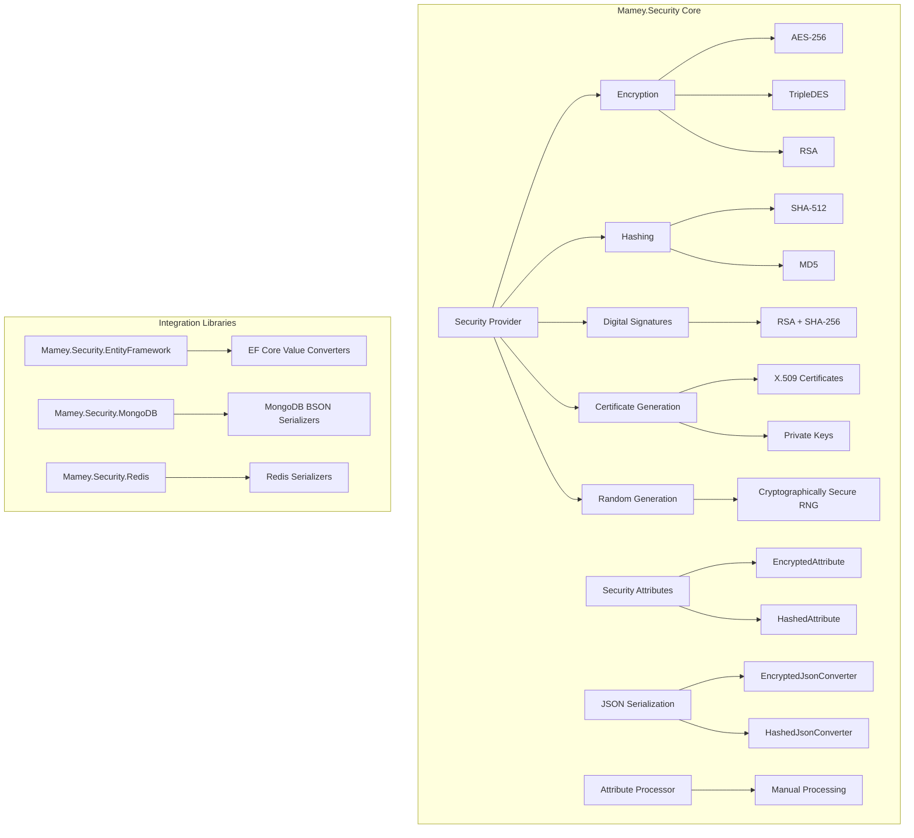
```mermaid
graph TB
    subgraph "Mamey.Security Core"
        A[Security Provider] --> B[Encryption]
        A --> C[Hashing]
        A --> D[Digital Signatures]
        A --> E[Certificate Generation]
        A --> F[Random Generation]
        
        B --> G[AES-256]
        B --> H[TripleDES]
        B --> I[RSA]
        
        C --> J[SHA-512]
        C --> K[MD5]
        
        D --> L[RSA + SHA-256]
        
        E --> M[X.509 Certificates]
        E --> N[Private Keys]
        
        F --> O[Cryptographically Secure RNG]
        
        P[Security Attributes] --> Q[EncryptedAttribute]
        P --> R[HashedAttribute]
        
        S[JSON Serialization] --> T[EncryptedJsonConverter]
        S --> U[HashedJsonConverter]
        
        V[Attribute Processor] --> W[Manual Processing]
    end
    
    subgraph "Integration Libraries"
        X[Mamey.Security.EntityFramework] --> Y[EF Core Value Converters]
        Z[Mamey.Security.MongoDB] --> AA[MongoDB BSON Serializers]
        AB[Mamey.Security.Redis] --> AC[Redis Serializers]
    end
```

### Encryption/Decryption Flow

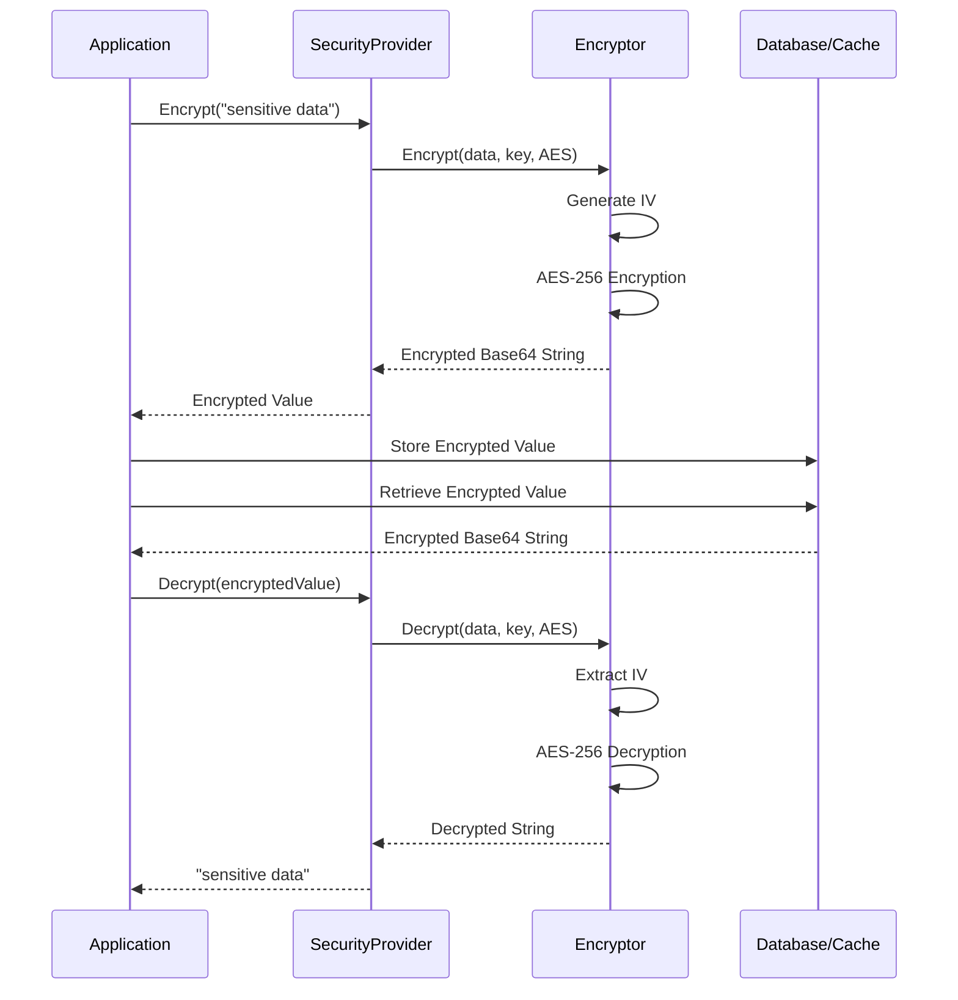
```mermaid
sequenceDiagram
    participant App as Application
    participant SP as SecurityProvider
    participant Enc as Encryptor
    participant DB as Database/Cache
    
    App->>SP: Encrypt("sensitive data")
    SP->>Enc: Encrypt(data, key, AES)
    Enc->>Enc: Generate IV
    Enc->>Enc: AES-256 Encryption
    Enc-->>SP: Encrypted Base64 String
    SP-->>App: Encrypted Value
    
    App->>DB: Store Encrypted Value
    
    App->>DB: Retrieve Encrypted Value
    DB-->>App: Encrypted Base64 String
    App->>SP: Decrypt(encryptedValue)
    SP->>Enc: Decrypt(data, key, AES)
    Enc->>Enc: Extract IV
    Enc->>Enc: AES-256 Decryption
    Enc-->>SP: Decrypted String
    SP-->>App: "sensitive data"
```

### Hashing Flow

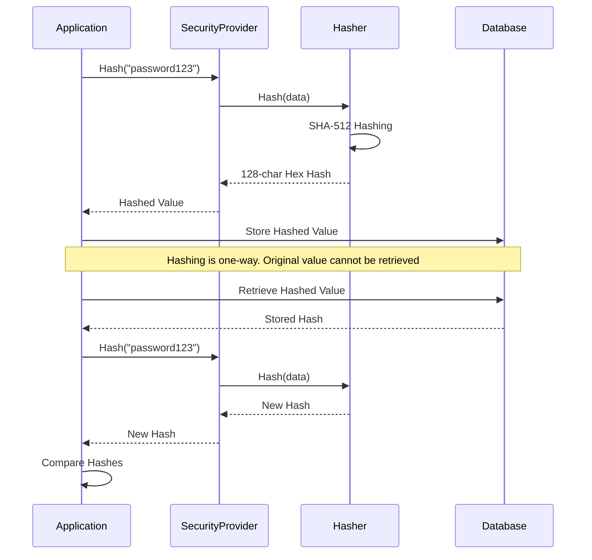
```mermaid
sequenceDiagram
    participant App as Application
    participant SP as SecurityProvider
    participant Hash as Hasher
    participant DB as Database
    
    App->>SP: Hash("password123")
    SP->>Hash: Hash(data)
    Hash->>Hash: SHA-512 Hashing
    Hash-->>SP: 128-char Hex Hash
    SP-->>App: Hashed Value
    
    App->>DB: Store Hashed Value
    
    Note over App,DB: Hashing is one-way. Original value cannot be retrieved
    
    App->>DB: Retrieve Hashed Value
    DB-->>App: Stored Hash
    App->>SP: Hash("password123")
    SP->>Hash: Hash(data)
    Hash-->>SP: New Hash
    SP-->>App: New Hash
    App->>App: Compare Hashes
```

### Certificate Generation Flow

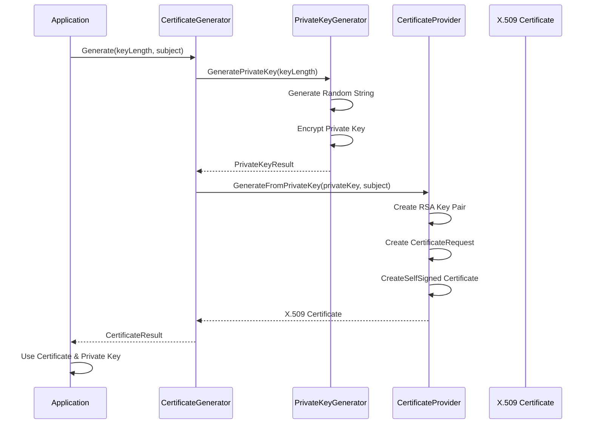
```mermaid
sequenceDiagram
    participant App as Application
    participant CG as CertificateGenerator
    participant PKG as PrivateKeyGenerator
    participant CP as CertificateProvider
    participant Cert as X.509 Certificate
    
    App->>CG: Generate(keyLength, subject)
    CG->>PKG: GeneratePrivateKey(keyLength)
    PKG->>PKG: Generate Random String
    PKG->>PKG: Encrypt Private Key
    PKG-->>CG: PrivateKeyResult
    
    CG->>CP: GenerateFromPrivateKey(privateKey, subject)
    CP->>CP: Create RSA Key Pair
    CP->>CP: Create CertificateRequest
    CP->>CP: CreateSelfSigned Certificate
    CP-->>CG: X.509 Certificate
    
    CG-->>App: CertificateResult
    App->>App: Use Certificate & Private Key
```

### Security Attribute Processing Flow

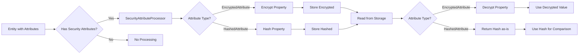
```mermaid
graph LR
    A[Entity with Attributes] --> B{Has Security Attributes?}
    B -->|Yes| C[SecurityAttributeProcessor]
    B -->|No| D[No Processing]
    
    C --> E{Attribute Type?}
    E -->|EncryptedAttribute| F[Encrypt Property]
    E -->|HashedAttribute| G[Hash Property]
    
    F --> H[Store Encrypted]
    G --> I[Store Hashed]
    
    H --> J[Read from Storage]
    I --> J
    
    J --> K{Attribute Type?}
    K -->|EncryptedAttribute| L[Decrypt Property]
    K -->|HashedAttribute| M[Return Hash as-is]
    
    L --> N[Use Decrypted Value]
    M --> O[Use Hash for Comparison]
```

### Integration Library Architecture

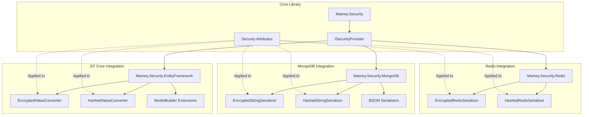
```mermaid
graph TB
    subgraph "Core Library"
        A[Mamey.Security]
        B[ISecurityProvider]
        C[Security Attributes]
    end
    
    subgraph "EF Core Integration"
        D[Mamey.Security.EntityFramework]
        E[EncryptedValueConverter]
        F[HashedValueConverter]
        G[ModelBuilder Extensions]
    end
    
    subgraph "MongoDB Integration"
        H[Mamey.Security.MongoDB]
        I[EncryptedStringSerializer]
        J[HashedStringSerializer]
        K[BSON Serializers]
    end
    
    subgraph "Redis Integration"
        L[Mamey.Security.Redis]
        M[EncryptedRedisSerializer]
        N[HashedRedisSerializer]
    end
    
    A --> B
    B --> D
    B --> H
    B --> L
    
    D --> E
    D --> F
    D --> G
    
    H --> I
    H --> J
    H --> K
    
    L --> M
    L --> N
    
    C -.->|Applied to| E
    C -.->|Applied to| F
    C -.->|Applied to| I
    C -.->|Applied to| J
    C -.->|Applied to| M
    C -.->|Applied to| N
```

### Error Handling Flow

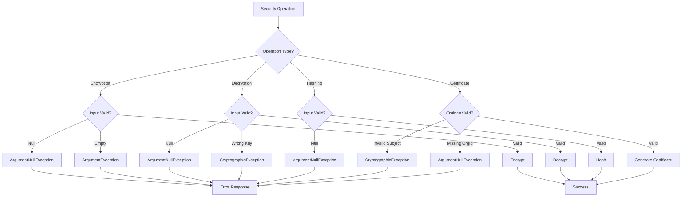
```mermaid
graph TD
    A[Security Operation] --> B{Operation Type?}
    
    B -->|Encryption| C{Input Valid?}
    C -->|Null| D[ArgumentNullException]
    C -->|Empty| E[ArgumentException]
    C -->|Valid| F[Encrypt]
    
    B -->|Decryption| G{Input Valid?}
    G -->|Null| H[ArgumentNullException]
    G -->|Wrong Key| I[CryptographicException]
    G -->|Valid| J[Decrypt]
    
    B -->|Hashing| K{Input Valid?}
    K -->|Null| L[ArgumentNullException]
    K -->|Valid| M[Hash]
    
    B -->|Certificate| N{Options Valid?}
    N -->|Invalid Subject| O[CryptographicException]
    N -->|Missing OrgId| P[ArgumentNullException]
    N -->|Valid| Q[Generate Certificate]
    
    F --> R[Success]
    J --> R
    M --> R
    Q --> R
    
    D --> S[Error Response]
    E --> S
    H --> S
    I --> S
    L --> S
    O --> S
    P --> S
```

### Key Rotation Flow

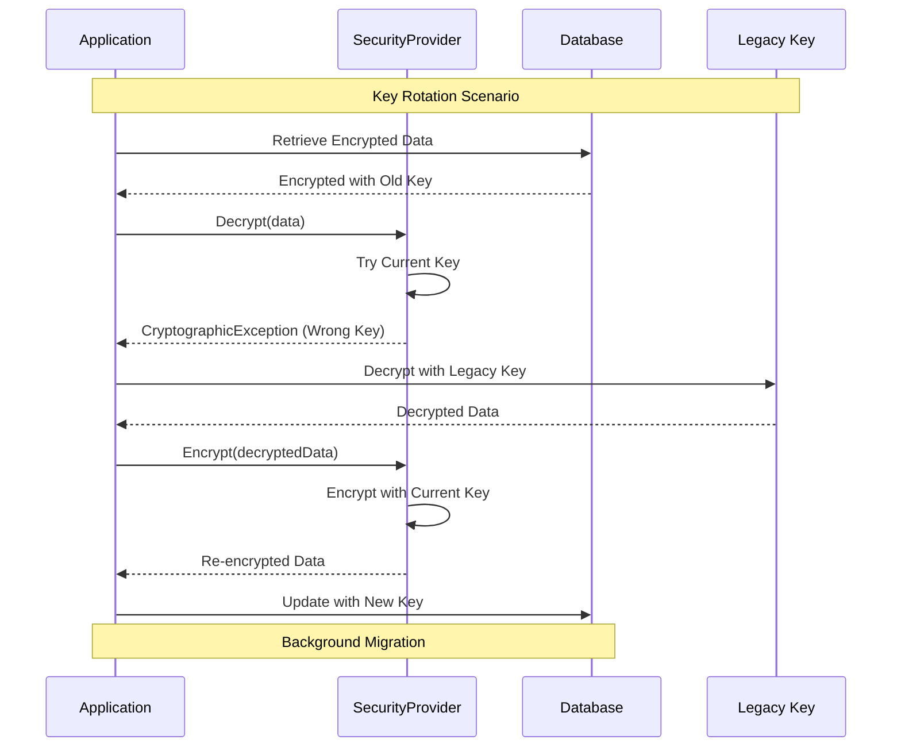
```mermaid
sequenceDiagram
    participant App as Application
    participant SP as SecurityProvider
    participant DB as Database
    participant Legacy as Legacy Key
    
    Note over App,Legacy: Key Rotation Scenario
    
    App->>DB: Retrieve Encrypted Data
    DB-->>App: Encrypted with Old Key
    
    App->>SP: Decrypt(data)
    SP->>SP: Try Current Key
    SP-->>App: CryptographicException (Wrong Key)
    
    App->>Legacy: Decrypt with Legacy Key
    Legacy-->>App: Decrypted Data
    
    App->>SP: Encrypt(decryptedData)
    SP->>SP: Encrypt with Current Key
    SP-->>App: Re-encrypted Data
    
    App->>DB: Update with New Key
    Note over App,DB: Background Migration
```

### Certificate Lifecycle

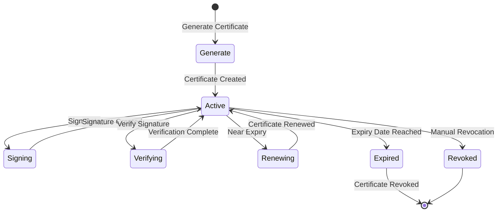
```mermaid
stateDiagram-v2
    [*] --> Generate: Generate Certificate
    Generate --> Active: Certificate Created
    Active --> Signing: Sign Data
    Signing --> Active: Signature Created
    Active --> Verifying: Verify Signature
    Verifying --> Active: Verification Complete
    Active --> Renewing: Near Expiry
    Renewing --> Active: Certificate Renewed
    Active --> Expired: Expiry Date Reached
    Expired --> [*]: Certificate Revoked
    Active --> Revoked: Manual Revocation
    Revoked --> [*]
```

### Private Key Management Flow

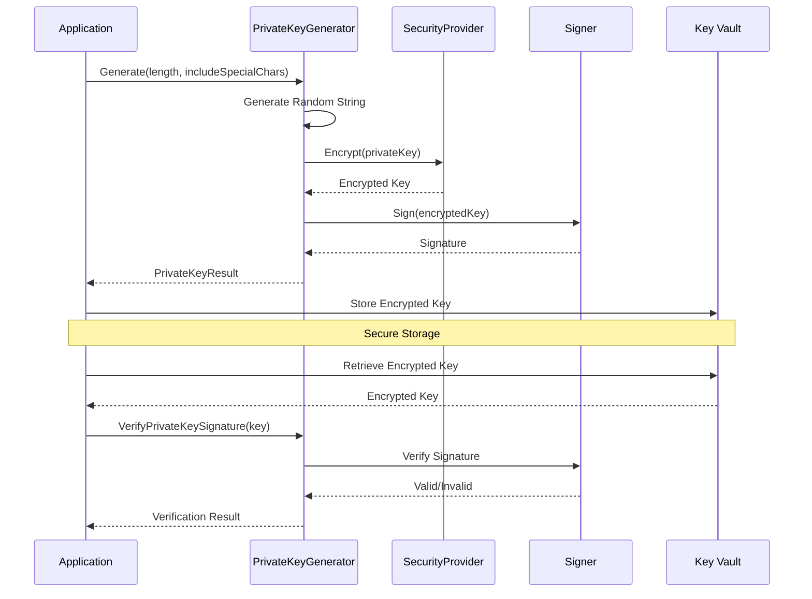
```mermaid
sequenceDiagram
    participant App as Application
    participant PKG as PrivateKeyGenerator
    participant SP as SecurityProvider
    participant Signer as Signer
    participant Vault as Key Vault
    
    App->>PKG: Generate(length, includeSpecialChars)
    PKG->>PKG: Generate Random String
    PKG->>SP: Encrypt(privateKey)
    SP-->>PKG: Encrypted Key
    PKG->>Signer: Sign(encryptedKey)
    Signer-->>PKG: Signature
    PKG-->>App: PrivateKeyResult
    
    App->>Vault: Store Encrypted Key
    Note over App,Vault: Secure Storage
    
    App->>Vault: Retrieve Encrypted Key
    Vault-->>App: Encrypted Key
    App->>PKG: VerifyPrivateKeySignature(key)
    PKG->>Signer: Verify Signature
    Signer-->>PKG: Valid/Invalid
    PKG-->>App: Verification Result
```

### Multi-Tenant Security Architecture

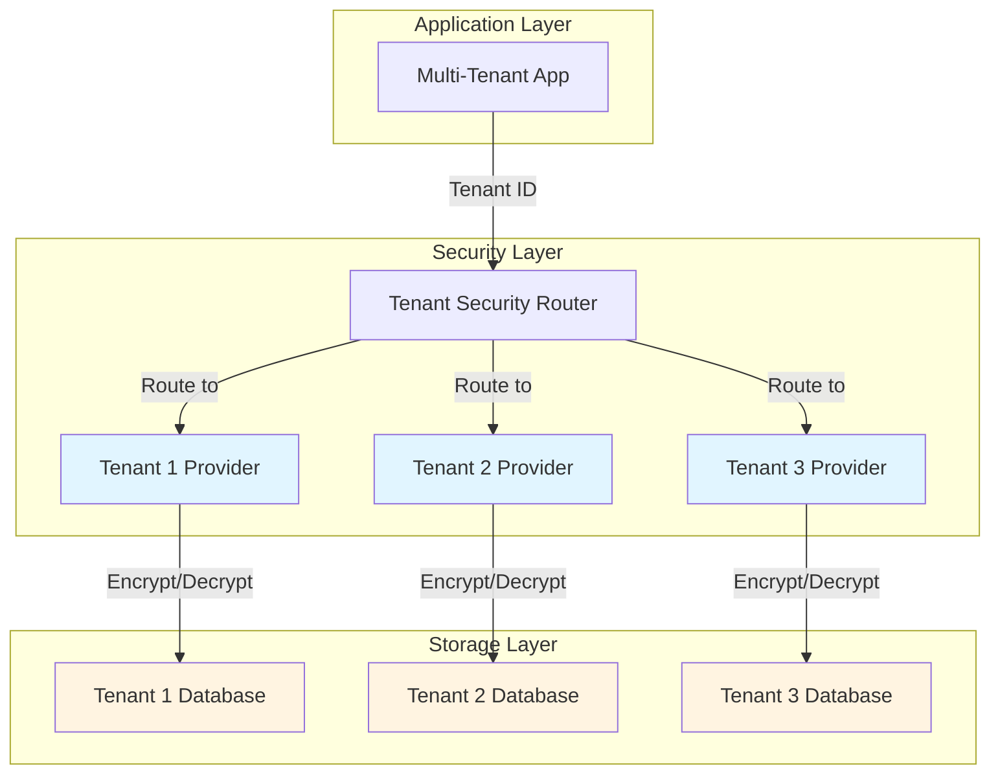
```mermaid
graph TB
    subgraph "Application Layer"
        A[Multi-Tenant App]
    end
    
    subgraph "Security Layer"
        B[Tenant Security Router]
        C[Tenant 1 Provider]
        D[Tenant 2 Provider]
        E[Tenant 3 Provider]
    end
    
    subgraph "Storage Layer"
        F[Tenant 1 Database]
        G[Tenant 2 Database]
        H[Tenant 3 Database]
    end
    
    A -->|Tenant ID| B
    B -->|Route to| C
    B -->|Route to| D
    B -->|Route to| E
    
    C -->|"Encrypt/Decrypt" | F
    D -->|"Encrypt/Decrypt" | G
    E -->|"Encrypt/Decrypt" | H
    
    style C fill:#e1f5ff
    style D fill:#e1f5ff
    style E fill:#e1f5ff
    style F fill:#fff4e1
    style G fill:#fff4e1
    style H fill:#fff4e1
```

### Security Attribute Processing Sequence

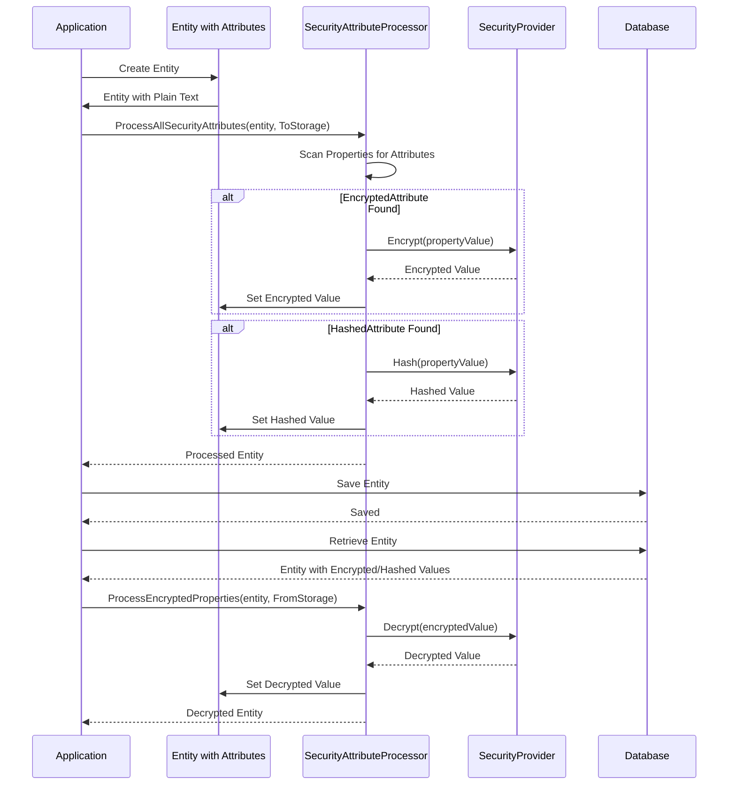
```mermaid
sequenceDiagram
    participant App as Application
    participant Entity as Entity with Attributes
    participant Processor as SecurityAttributeProcessor
    participant SP as SecurityProvider
    participant DB as Database
    
    App->>Entity: Create Entity
    Entity->>App: Entity with Plain Text
    
    App->>Processor: ProcessAllSecurityAttributes(entity, ToStorage)
    Processor->>Processor: Scan Properties for Attributes
    
    alt EncryptedAttribute Found
        Processor->>SP: Encrypt(propertyValue)
        SP-->>Processor: Encrypted Value
        Processor->>Entity: Set Encrypted Value
    end
    
    alt HashedAttribute Found
        Processor->>SP: Hash(propertyValue)
        SP-->>Processor: Hashed Value
        Processor->>Entity: Set Hashed Value
    end
    
    Processor-->>App: Processed Entity
    App->>DB: Save Entity
    DB-->>App: Saved
    
    App->>DB: Retrieve Entity
    DB-->>App: Entity with Encrypted/Hashed Values
    
    App->>Processor: ProcessEncryptedProperties(entity, FromStorage)
    Processor->>SP: Decrypt(encryptedValue)
    SP-->>Processor: Decrypted Value
    Processor->>Entity: Set Decrypted Value
    Processor-->>App: Decrypted Entity
```

### Integration Pattern - EF Core

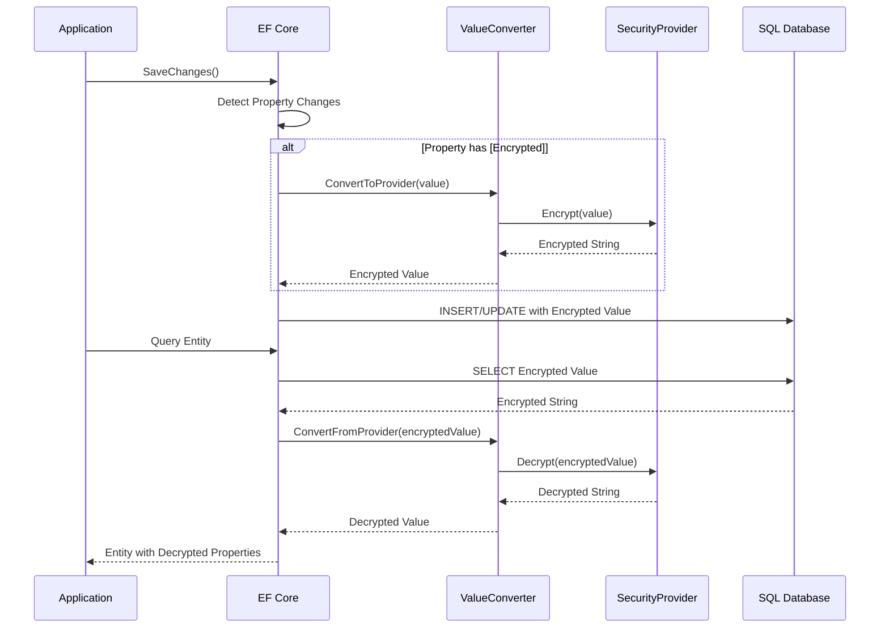
```mermaid
sequenceDiagram
    participant App as Application
    participant EF as EF Core
    participant Converter as ValueConverter
    participant SP as SecurityProvider
    participant DB as SQL Database
    
    App->>EF: SaveChanges()
    EF->>EF: Detect Property Changes
    
    alt Property has [Encrypted]
        EF->>Converter: ConvertToProvider(value)
        Converter->>SP: Encrypt(value)
        SP-->>Converter: Encrypted String
        Converter-->>EF: Encrypted Value
    end
    
    EF->>DB: INSERT/UPDATE with Encrypted Value
    
    App->>EF: Query Entity
    EF->>DB: SELECT Encrypted Value
    DB-->>EF: Encrypted String
    
    EF->>Converter: ConvertFromProvider(encryptedValue)
    Converter->>SP: Decrypt(encryptedValue)
    SP-->>Converter: Decrypted String
    Converter-->>EF: Decrypted Value
    EF-->>App: Entity with Decrypted Properties
```

### Integration Pattern - MongoDB

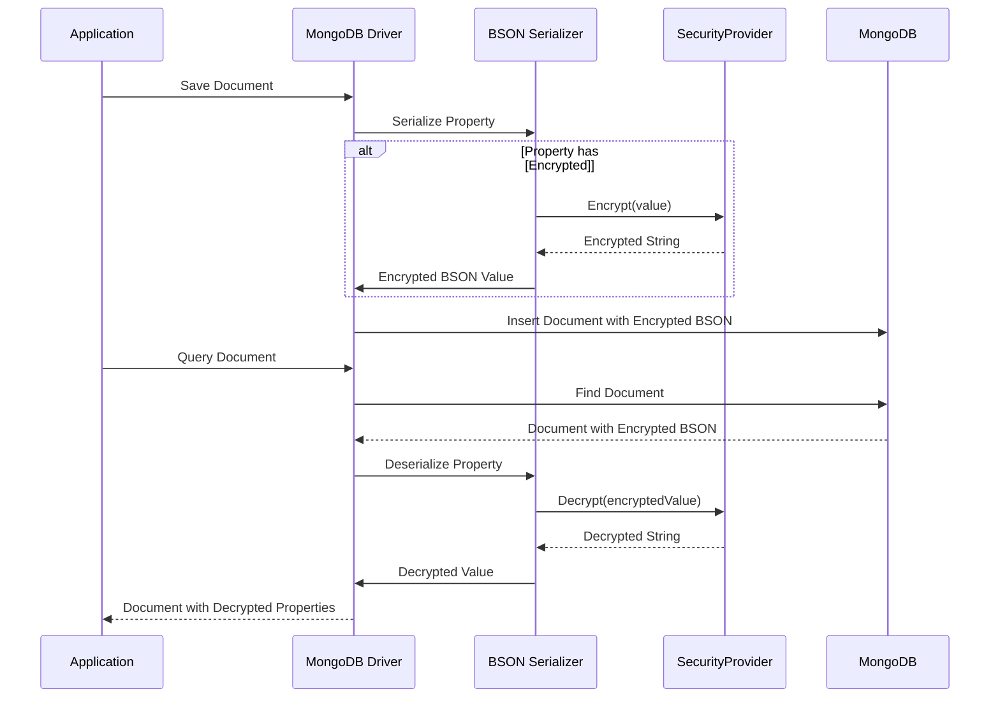
```mermaid
sequenceDiagram
    participant App as Application
    participant Mongo as MongoDB Driver
    participant Serializer as BSON Serializer
    participant SP as SecurityProvider
    participant DB as MongoDB
    
    App->>Mongo: Save Document
    Mongo->>Serializer: Serialize Property
    
    alt Property has [Encrypted]
        Serializer->>SP: Encrypt(value)
        SP-->>Serializer: Encrypted String
        Serializer->>Mongo: Encrypted BSON Value
    end
    
    Mongo->>DB: Insert Document with Encrypted BSON
    
    App->>Mongo: Query Document
    Mongo->>DB: Find Document
    DB-->>Mongo: Document with Encrypted BSON
    
    Mongo->>Serializer: Deserialize Property
    Serializer->>SP: Decrypt(encryptedValue)
    SP-->>Serializer: Decrypted String
    Serializer->>Mongo: Decrypted Value
    Mongo-->>App: Document with Decrypted Properties
```

### Integration Pattern - Redis

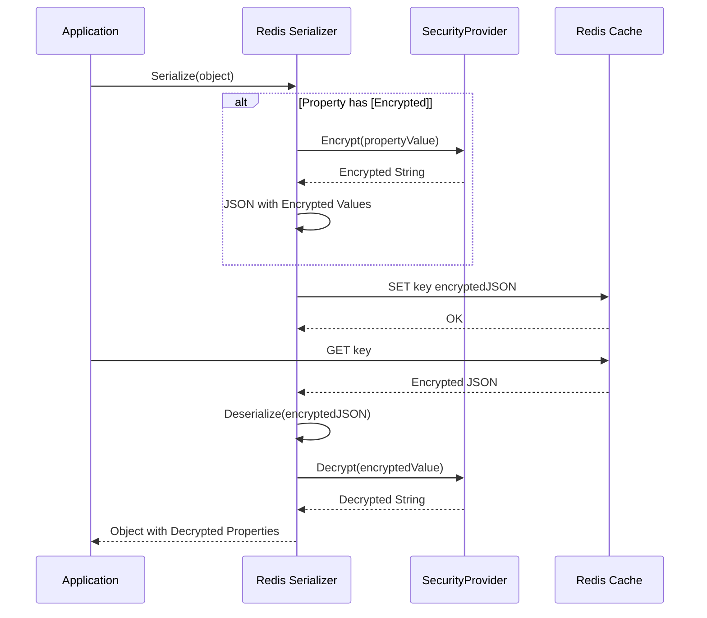
```mermaid
sequenceDiagram
    participant App as Application
    participant Serializer as Redis Serializer
    participant SP as SecurityProvider
    participant Redis as Redis Cache
    
    App->>Serializer: Serialize(object)
    
    alt Property has [Encrypted]
        Serializer->>SP: Encrypt(propertyValue)
        SP-->>Serializer: Encrypted String
        Serializer->>Serializer: JSON with Encrypted Values
    end
    
    Serializer->>Redis: SET key encryptedJSON
    Redis-->>Serializer: OK
    
    App->>Redis: GET key
    Redis-->>Serializer: Encrypted JSON
    
    Serializer->>Serializer: Deserialize(encryptedJSON)
    Serializer->>SP: Decrypt(encryptedValue)
    SP-->>Serializer: Decrypted String
    Serializer-->>App: Object with Decrypted Properties
```

### Performance Optimization - Caching Flow

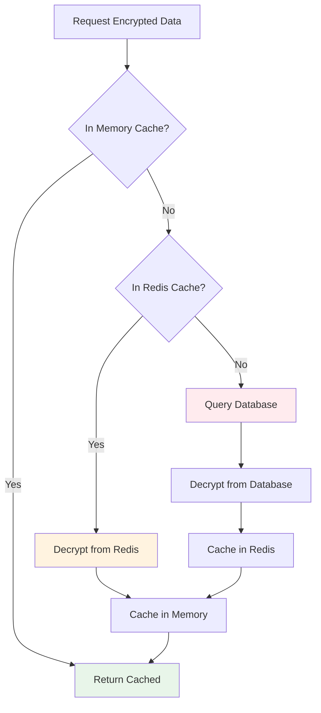
```mermaid
graph TB
    A[Request Encrypted Data] --> B{In Memory Cache?}
    B -->|Yes| C[Return Cached]
    B -->|No| D{In Redis Cache?}
    D -->|Yes| E[Decrypt from Redis]
    E --> F[Cache in Memory]
    F --> C
    D -->|No| G[Query Database]
    G --> H[Decrypt from Database]
    H --> I[Cache in Redis]
    I --> F
    
    style C fill:#e8f5e9
    style E fill:#fff3e0
    style G fill:#ffebee
```

### Migration Scenario - Unencrypted to Encrypted

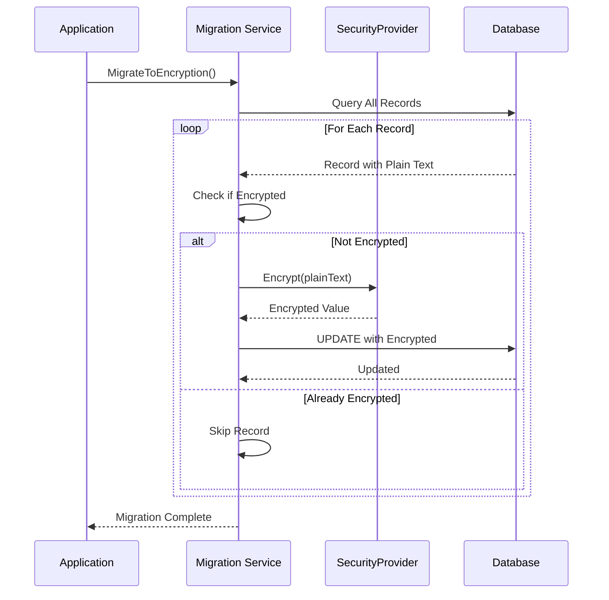
```mermaid
sequenceDiagram
    participant App as Application
    participant Migrator as Migration Service
    participant SP as SecurityProvider
    participant DB as Database
    
    App->>Migrator: MigrateToEncryption()
    Migrator->>DB: Query All Records
    
    loop For Each Record
        DB-->>Migrator: Record with Plain Text
        Migrator->>Migrator: Check if Encrypted
        
        alt Not Encrypted
            Migrator->>SP: Encrypt(plainText)
            SP-->>Migrator: Encrypted Value
            Migrator->>DB: UPDATE with Encrypted
            DB-->>Migrator: Updated
        else Already Encrypted
            Migrator->>Migrator: Skip Record
        end
    end
    
    Migrator-->>App: Migration Complete
```

### Real-World Use Case - E-Commerce Order Processing

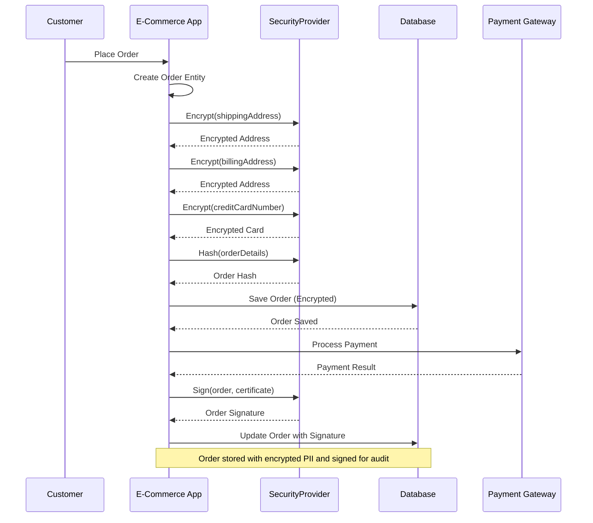
```mermaid
sequenceDiagram
    participant User as Customer
    participant App as E-Commerce App
    participant SP as SecurityProvider
    participant DB as Database
    participant Payment as Payment Gateway
    
    User->>App: Place Order
    App->>App: Create Order Entity
    
    App->>SP: Encrypt(shippingAddress)
    SP-->>App: Encrypted Address
    App->>SP: Encrypt(billingAddress)
    SP-->>App: Encrypted Address
    App->>SP: Encrypt(creditCardNumber)
    SP-->>App: Encrypted Card
    
    App->>SP: Hash(orderDetails)
    SP-->>App: Order Hash
    
    App->>DB: Save Order (Encrypted)
    DB-->>App: Order Saved
    
    App->>Payment: Process Payment
    Payment-->>App: Payment Result
    
    App->>SP: Sign(order, certificate)
    SP-->>App: Order Signature
    App->>DB: Update Order with Signature
    
    Note over App,DB: Order stored with encrypted PII and signed for audit
```

### Real-World Use Case - Healthcare Patient Records

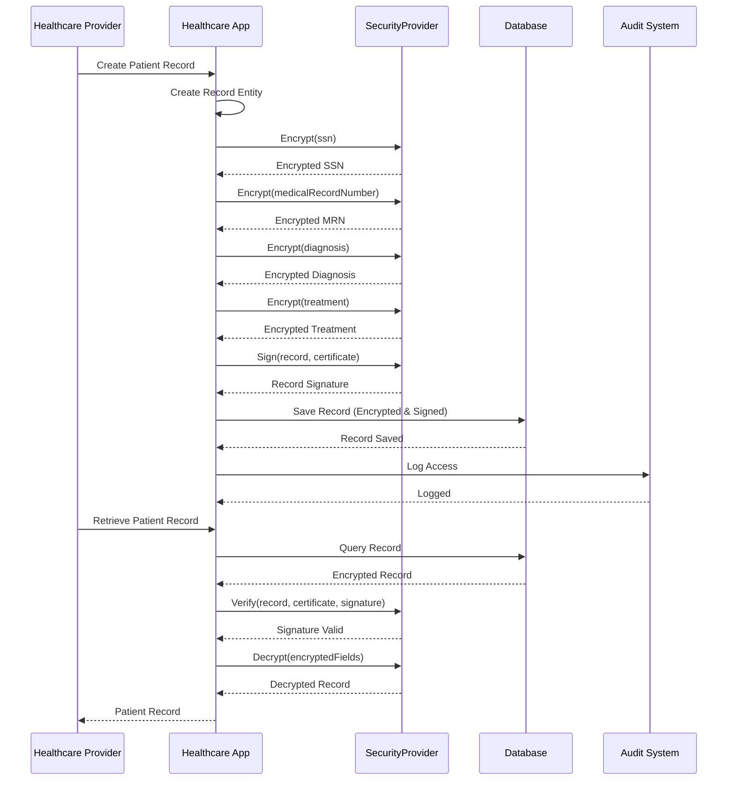
```mermaid
sequenceDiagram
    participant Doctor as Healthcare Provider
    participant App as Healthcare App
    participant SP as SecurityProvider
    participant DB as Database
    participant Audit as Audit System
    
    Doctor->>App: Create Patient Record
    App->>App: Create Record Entity
    
    App->>SP: Encrypt(ssn)
    SP-->>App: Encrypted SSN
    App->>SP: Encrypt(medicalRecordNumber)
    SP-->>App: Encrypted MRN
    App->>SP: Encrypt(diagnosis)
    SP-->>App: Encrypted Diagnosis
    App->>SP: Encrypt(treatment)
    SP-->>App: Encrypted Treatment
    
    App->>SP: Sign(record, certificate)
    SP-->>App: Record Signature
    
    App->>DB: Save Record (Encrypted & Signed)
    DB-->>App: Record Saved
    
    App->>Audit: Log Access
    Audit-->>App: Logged
    
    Doctor->>App: Retrieve Patient Record
    App->>DB: Query Record
    DB-->>App: Encrypted Record
    
    App->>SP: Verify(record, certificate, signature)
    SP-->>App: Signature Valid
    
    App->>SP: Decrypt(encryptedFields)
    SP-->>App: Decrypted Record
    App-->>Doctor: Patient Record
```

### Security Concepts and Design Principles

#### Encryption Concepts

**Symmetric Encryption (AES-256)**
- **Purpose**: Fast encryption/decryption for large volumes of data
- **Key Management**: Single key for both encryption and decryption
- **Use Cases**: Database storage, cache encryption, file encryption
- **Security**: 256-bit key provides strong security (2^256 possible keys)

**Asymmetric Encryption (RSA)**
- **Purpose**: Secure key exchange and small data encryption
- **Key Management**: Public key for encryption, private key for decryption
- **Use Cases**: Key exchange, secure communication, digital signatures
- **Security**: 2048+ bit keys recommended for production

**IV (Initialization Vector)**
- **Purpose**: Ensures same plaintext produces different ciphertext
- **Generation**: Cryptographically secure random for each encryption
- **Storage**: Prefixed to encrypted data (not secret)
- **Security**: Prevents pattern analysis attacks

#### Hashing Concepts

**One-Way Hashing (SHA-512)**
- **Purpose**: Irreversible data transformation for verification
- **Properties**: Deterministic (same input = same output), collision-resistant
- **Use Cases**: Password storage, data integrity verification, checksums
- **Security**: 512-bit output provides 2^256 security level

**Salt for Passwords**
- **Purpose**: Prevents rainbow table attacks
- **Implementation**: Unique salt per password + password = hash
- **Storage**: Salt stored alongside hash (not secret)
- **Security**: Makes pre-computed attacks impractical

#### Digital Signature Concepts

**Non-Repudiation**
- **Purpose**: Proves data origin and prevents denial
- **Implementation**: Private key signs, public key verifies
- **Use Cases**: Document signing, transaction authorization, audit trails
- **Security**: Only private key holder can create valid signature

**Integrity Verification**
- **Purpose**: Detects data tampering
- **Implementation**: Signature changes if data is modified
- **Use Cases**: Data validation, message authentication, file verification
- **Security**: Any modification invalidates signature

#### Certificate Concepts

**X.509 Certificate Structure**
- **Subject**: Entity being certified (CN, O, C, etc.)
- **Issuer**: Certificate Authority (CA) that issued certificate
- **Validity**: Start and end dates
- **Public Key**: Public key bound to certificate
- **Signature**: CA's signature on certificate

**Self-Signed Certificates**
- **Purpose**: Internal use, testing, development
- **Limitation**: Not trusted by default (no CA validation)
- **Use Cases**: Internal services, development environments
- **Security**: Provides encryption but not identity verification

**Certificate Chain**
- **Purpose**: Establishes trust hierarchy
- **Structure**: Root CA → Intermediate CA → End Entity Certificate
- **Validation**: Verify entire chain to trusted root
- **Security**: Chain of trust ensures certificate authenticity

#### Key Management Concepts

**Key Rotation**
- **Purpose**: Limits exposure if key is compromised
- **Strategy**: Regular rotation (e.g., quarterly, annually)
- **Implementation**: Support multiple keys during transition
- **Security**: Reduces risk window for compromised keys

**Key Storage**
- **Purpose**: Secure key storage and access
- **Options**: Key Vault (Azure, AWS), Hardware Security Module (HSM), Environment Variables
- **Best Practice**: Never hardcode keys, use secure key management services
- **Security**: Keys should be encrypted at rest and in transit

**Key Separation**
- **Purpose**: Isolate security domains
- **Strategy**: Different keys for different environments (dev, staging, prod)
- **Implementation**: Environment-specific key configuration
- **Security**: Prevents cross-environment data access

#### Security Attribute Concepts

**Automatic Processing**
- **Purpose**: Reduces developer error and ensures consistency
- **Implementation**: Attribute-based processing during serialization/storage
- **Benefits**: Transparent encryption, consistent security, reduced boilerplate
- **Security**: Ensures sensitive data is always encrypted

**Processing Direction**
- **ToStorage**: Encrypt/hash before storing (plain → encrypted)
- **FromStorage**: Decrypt after retrieving (encrypted → plain)
- **Purpose**: Handles bidirectional transformation automatically
- **Security**: Ensures data is encrypted at rest, plain in memory

#### Performance Considerations

**Encryption Overhead**
- **Impact**: CPU and memory usage for encryption/decryption
- **Mitigation**: Cache decrypted values, batch operations, async processing
- **Trade-off**: Security vs. performance (encryption is necessary for sensitive data)
- **Optimization**: Use appropriate algorithm (AES for bulk, RSA for small data)

**Hashing Performance**
- **Impact**: Minimal overhead (one-way operation)
- **Optimization**: SHA-512 is fast, suitable for high-volume operations
- **Trade-off**: Speed vs. security (SHA-512 provides good balance)
- **Best Practice**: Hash once, compare many times

**Caching Strategy**
- **Purpose**: Reduce encryption/decryption overhead
- **Strategy**: Cache decrypted values in memory with expiration
- **Security**: Cache should have appropriate TTL and invalidation
- **Trade-off**: Performance vs. memory usage

#### Security Best Practices

**Defense in Depth**
- **Principle**: Multiple layers of security
- **Implementation**: Encryption + hashing + signatures + access control
- **Benefit**: Failure of one layer doesn't compromise entire system
- **Example**: Encrypted data + signed transactions + role-based access

**Least Privilege**
- **Principle**: Minimum access necessary
- **Implementation**: Separate keys for different services, role-based access
- **Benefit**: Limits impact of compromise
- **Example**: Different encryption keys per microservice

**Fail Secure**
- **Principle**: Default to secure state on failure
- **Implementation**: Throw exceptions on invalid operations, don't silently fail
- **Benefit**: Prevents insecure fallback behavior
- **Example**: CryptographicException on wrong key, not silent failure

**Audit and Monitoring**
- **Principle**: Track all security operations
- **Implementation**: Log encryption/decryption operations, monitor for anomalies
- **Benefit**: Detect attacks, compliance, troubleshooting
- **Example**: Log all certificate generation, key rotation events

## Installation

### Package Manager
```bash
Install-Package Mamey.Security
```

### .NET CLI
```bash
dotnet add package Mamey.Security
```

### PackageReference
```xml
<PackageReference Include="Mamey.Security" Version="2.0.*" />
```

## Quick Start

### Basic Setup

```csharp
using Mamey.Security;

public class Program
{
    public static void Main(string[] args)
    {
        var builder = WebApplication.CreateBuilder(args);
        
        builder.Services
            .AddMamey()
            .AddSecurity();
            
        var app = builder.Build();
        app.Run();
    }
}
```

### Basic Usage

```csharp
public class UserService
{
    private readonly ISecurityProvider _securityProvider;
    
    public UserService(ISecurityProvider securityProvider)
    {
        _securityProvider = securityProvider;
    }
    
    public async Task<User> CreateUserAsync(CreateUserRequest request)
    {
        // Encrypt sensitive data
        var encryptedEmail = _securityProvider.Encrypt(request.Email);
        
        // Hash password
        var hashedPassword = _securityProvider.Hash(request.Password);
        
        // Create user
        var user = new User
        {
            Email = encryptedEmail,
            PasswordHash = hashedPassword
        };
        
        return await _userRepository.CreateAsync(user);
    }
}
```

## Core Components

### Encryption

#### IEncryptor
Interface for data encryption with multiple algorithm support. Supports both string and byte array encryption/decryption.

**Key Features:**
- **Multiple Algorithms**: AES-256 (default), TripleDES, and RSA
- **String Encryption**: Encrypt/decrypt string data with automatic IV generation
- **Byte Array Encryption**: Encrypt/decrypt byte arrays with explicit IV support
- **Key Management**: Supports different key sizes for different algorithms

```csharp
public interface IEncryptor
{
    // String encryption/decryption (automatic IV generation)
    string Encrypt(string data, string key, EncryptionAlgorithms algorithm = EncryptionAlgorithms.AES);
    string Decrypt(string data, string key, EncryptionAlgorithms algorithm = EncryptionAlgorithms.AES);
    
    // Byte array encryption/decryption (explicit IV)
    byte[] Encrypt(byte[] data, byte[] iv, byte[] key, EncryptionAlgorithms algorithm = EncryptionAlgorithms.AES);
    byte[] Decrypt(byte[] data, byte[] iv, byte[] key, EncryptionAlgorithms algorithm = EncryptionAlgorithms.AES);
}
```

**Algorithm Details:**
- **AES**: 256-bit key (32 bytes), 128-bit IV (16 bytes), CBC mode
- **TripleDES**: 192-bit key (24 bytes), 64-bit IV (8 bytes), CBC mode
- **RSA**: Asymmetric encryption with OAEP-SHA256 padding (byte arrays only)

**Usage Examples:**

```csharp
// AES encryption (default)
var encrypted = _encryptor.Encrypt("sensitive data", "32-character-encryption-key");
var decrypted = _encryptor.Decrypt(encrypted, "32-character-encryption-key");

// TripleDES encryption
var encrypted = _encryptor.Encrypt("sensitive data", "24-character-key-here", EncryptionAlgorithms.TripleDes);

// RSA encryption (byte arrays)
var data = Encoding.UTF8.GetBytes("sensitive data");
var iv = new byte[16]; // IV not used for RSA but required by interface
var publicKey = /* RSA public key bytes */;
var encrypted = _encryptor.Encrypt(data, iv, publicKey, EncryptionAlgorithms.RSA);
```

#### EncryptionAlgorithms
Supported encryption algorithms.

```csharp
public enum EncryptionAlgorithms
{
    AES,        // AES-256 (default) - 32-byte key, 16-byte IV
    TripleDes,  // TripleDES - 24-byte key, 8-byte IV
    RSA,        // RSA asymmetric encryption - OAEP-SHA256 padding
    ECC         // Elliptic Curve Cryptography (reserved for future use)
}
```

### Hashing

#### IHasher
Interface for data hashing using SHA-512. Provides both string and byte array hashing with hex-encoded output.

**Key Features:**
- **SHA-512 Algorithm**: 512-bit hash output (128 hex characters)
- **String Hashing**: Hash string data and return hex-encoded string
- **Byte Array Hashing**: Hash byte arrays and return raw hash bytes
- **HashToBytes**: Hash string and return raw hash bytes

```csharp
public interface IHasher
{
    // Hash string and return hex-encoded string (128 characters)
    string Hash(string data);
    
    // Hash byte array and return raw hash bytes (64 bytes)
    byte[] Hash(byte[] data);
    
    // Hash string and return raw hash bytes (64 bytes)
    byte[] HashToBytes(string data);
}
```

**Usage Examples:**

```csharp
// Hash string (returns 128-character hex string)
var hash = _hasher.Hash("password123");
// Result: "a665a45920422f9d417e4867efdc4fb8a04a1f3fff1fa07e998e86f7f7a27ae3..."

// Hash byte array (returns 64-byte array)
var data = Encoding.UTF8.GetBytes("password123");
var hashBytes = _hasher.Hash(data);

// Hash string to bytes
var hashBytes = _hasher.HashToBytes("password123");
```

#### IMd5
Interface for MD5 hashing (legacy support). Supports both string and stream hashing.

**Key Features:**
- **MD5 Algorithm**: 128-bit hash output (32 hex characters)
- **String Hashing**: Hash string data
- **Stream Hashing**: Hash stream data (useful for file hashing)

```csharp
public interface IMd5
{
    // Hash string and return hex-encoded string (32 characters, lowercase)
    string Calculate(string value);
    
    // Hash stream and return hex-encoded string (32 characters, lowercase)
    string Calculate(Stream inputStream);
}
```

**Usage Examples:**

```csharp
// Hash string
var hash = _md5.Calculate("data");
// Result: "8d777f385d3dfec8815d20f7496026dc" (32 characters, lowercase)

// Hash file stream
using var stream = File.OpenRead("file.txt");
var hash = _md5.Calculate(stream);
```

### Digital Signatures

#### ISigner
Interface for digital signatures using RSA + SHA-256. Supports both object and byte array signing/verification.

**Key Features:**
- **RSA + SHA-256**: RSA signing with SHA-256 hash algorithm
- **Object Signing**: Automatically serialize objects to JSON before signing
- **Byte Array Signing**: Direct byte array signing
- **Verification**: Verify signatures with optional exception throwing

```csharp
public interface ISigner
{
    // Sign object (serialized to JSON) and return Base64-encoded signature
    string Sign(object data, X509Certificate2 certificate);
    
    // Verify object signature (returns true if valid, false or throws if invalid)
    bool Verify(object data, X509Certificate2 certificate, string signature, bool throwException = false);
    
    // Sign byte array and return raw signature bytes
    byte[] Sign(byte[] data, X509Certificate2 certificate);
    
    // Verify byte array signature
    bool Verify(byte[] data, X509Certificate2 certificate, byte[] signature, bool throwException = false);
}
```

**Usage Examples:**

```csharp
// Sign object
var document = new { Content = "Important data", Timestamp = DateTime.UtcNow };
var signature = _signer.Sign(document, certificate);
// Returns Base64-encoded signature

// Verify object signature
var isValid = _signer.Verify(document, certificate, signature);
// Returns true if valid, false if invalid

// Verify with exception throwing
try
{
    _signer.Verify(document, certificate, signature, throwException: true);
}
catch (CryptographicException)
{
    // Signature verification failed
}

// Sign byte array
var data = Encoding.UTF8.GetBytes("Important data");
var signatureBytes = _signer.Sign(data, certificate);
// Returns raw signature bytes

// Verify byte array signature
var isValid = _signer.Verify(data, certificate, signatureBytes);
```

### Certificate Generation

#### ICertificateGenerator
Interface for X.509 certificate generation with private key support.

**Key Features:**
- **X.509 Certificate Generation**: Generate self-signed X.509 certificates
- **Private Key Integration**: Generate certificates from existing private keys
- **Certificate Export**: Export certificates to files
- **Subject Configuration**: Customizable certificate subject (X.500 format)

```csharp
public interface ICertificateGenerator<in TPrivateKey, TResult>
    where TPrivateKey : class, IPrivateKey
    where TResult : class, ICertificateResult<TPrivateKey>
{
    // Export certificate to file (.crt format)
    void ExportToFile(X509Certificate2 certificate, string filePath);
    
    // Generate certificate with new private key
    TResult Generate(int keyLength = 50, bool pkHasSpecialCharacters = false, string? subject = null);
    
    // Generate certificate from existing private key
    TResult GenerateFromPrivateKey(TPrivateKey privateKey, string? subject = null);
}
```

**Usage Examples:**

```csharp
// Generate certificate with new private key
var result = _certificateGenerator.Generate(
    keyLength: 50,
    pkHasSpecialCharacters: false,
    subject: "CN=MyCertificate, O=MyOrganization"
);
var certificate = result.Certificate;
var privateKey = result.PrivateKey;

// Generate certificate from existing private key
var privateKeyResult = _privateKeyGenerator.Generate();
var certificateResult = _certificateGenerator.GenerateFromPrivateKey(
    privateKeyResult.PrivateKey,
    subject: "CN=MyCertificate, O=MyOrganization"
);

// Export certificate to file
_certificateGenerator.ExportToFile(certificate, "certificate.crt");
```

#### ICertificateProvider
Interface for certificate and private key operations with signing support.

**Key Features:**
- **Private Key Signing**: Sign data with private keys
- **Private Key Verification**: Verify signatures with private keys
- **Private Key Generation**: Generate new private keys
- **Private Key Signature Verification**: Verify private key signatures
- **Certificate Generation**: Generate certificates from private keys

```csharp
public interface ICertificateProvider<TPrivateKey>
    where TPrivateKey : class, IPrivateKey
{
    // Sign data with private key
    string SignWithPrivateKey(object data, IPrivateKey privateKey);
    byte[] SignWithPrivateKey(byte[] data, IPrivateKey privateKey);
    
    // Verify signature with private key
    bool VerifyWithPrivateKey(object data, IPrivateKey privateKey, string signature);
    bool VerifyWithPrivateKey(byte[] data, IPrivateKey privateKey, byte[] signature);
    
    // Generate private key
    IPrivateKeyResult<TPrivateKey> GeneratePrivateKey(int length = 50, bool pkHasSpecialCharacters = false);
    
    // Verify private key signature
    bool VerifyPrivateKeySignature(TPrivateKey privateKey);
    
    // Generate certificate
    ICertificateResult<TPrivateKey> Generate(int keyLength = 50, bool pkHasSpecialCharacters = false, string? subject = null);
    ICertificateResult<TPrivateKey> GenerateFromPrivateKey(TPrivateKey privateKey, string? subject = null);
    
    // Export certificate to file
    void ExportToFile(X509Certificate2 certificate, string filePath);
}
```

### Private Key Management

#### IPrivateKey
Interface for private key representation with encryption and signature support.

**Key Features:**
- **Encrypted Storage**: Private keys are stored encrypted
- **Signature Verification**: Private keys can be signed for verification
- **Binding Methods**: Protected methods for key and signature binding

```csharp
public interface IPrivateKey
{
    // Encrypted private key value
    string EncryptedPrivateKey { get; }
    
    // Signature of encrypted private key (for verification)
    string? PrivateKeySignature { get; }
    
    // Protected methods for binding (internal use)
    void BindKey(string privateKeySignature);
    void BindSignature(string privateKeySignature);
}
```

#### PrivateKey
Concrete implementation of IPrivateKey.

```csharp
[Serializable]
public class PrivateKey : IPrivateKey
{
    public PrivateKey();
    public PrivateKey(string encryptedPrivateKey, string? signature);
    
    public string EncryptedPrivateKey { get; internal set; }
    public string? PrivateKeySignature { get; internal set; }
}
```

#### IPrivateKeyGenerator
Interface for private key generation with signature verification.

**Key Features:**
- **Private Key Generation**: Generate encrypted private keys with optional signatures
- **Signature Verification**: Verify private key signatures
- **Configurable Length**: Customizable key length
- **Special Characters**: Option to include/exclude special characters

```csharp
public interface IPrivateKeyGenerator<in TPrivateKey, TResult>
    where TPrivateKey : class, IPrivateKey
    where TResult : class, IPrivateKeyResult<TPrivateKey>
{
    // Generate private key with optional signature
    TResult Generate(int length = 50, bool pkHasSpecialCharacters = false);
    
    // Verify private key signature
    bool VerifyPrivateKeySignature(TPrivateKey privateKey);
}
```

**Usage Examples:**

```csharp
// Generate private key
var result = _privateKeyGenerator.Generate(
    length: 50,
    pkHasSpecialCharacters: false
);
var privateKey = result.PrivateKey;
var plainTextKey = result.Key; // Unencrypted key (for initial setup only)

// Verify private key signature
var isValid = _privateKeyGenerator.VerifyPrivateKeySignature(privateKey);
```

#### IPrivateKeyResult
Interface for private key generation results.

```csharp
public interface IPrivateKeyResult<T>
    where T : IPrivateKey
{
    T PrivateKey { get; init; }
    string? Key { get; init; }
}
```

#### IPrivateKeyService
Interface for private key services (simplified API).

**Key Features:**
- **Key Generation**: Generate private keys with encryption
- **Key Validation**: Validate private key signatures

```csharp
public interface IPrivateKeyService
{
    // Generate private key and return tuple (PrivateKey, plainTextKey)
    (PrivateKey, string) Generate(int length = 50);
    
    // Validate private key signature
    bool ValidatePrivateKey(PrivateKey privateKey);
}
```

**Usage Examples:**

```csharp
// Generate private key
var (privateKey, plainTextKey) = _privateKeyService.Generate(length: 50);

// Validate private key
var isValid = _privateKeyService.ValidatePrivateKey(privateKey);
```

### Random Number Generation

#### IRng
Interface for cryptographically secure random number generation.

**Key Features:**
- **Cryptographically Secure**: Uses `RandomNumberGenerator.Create()`
- **Base64 Encoding**: Returns Base64-encoded random strings
- **Special Character Removal**: Option to remove special characters
- **Length Limits**: Maximum length of 100MB to prevent memory issues

```csharp
public interface IRng
{
    // Generate random string with optional special character removal
    string Generate(int length = 50, bool removeSpecialChars = true);
}
```

**Special Characters Removed:**
- `/`, `\`, `=`, `+`, `?`, `:`, `&`

**Usage Examples:**

```csharp
// Generate random string (default: 50 chars, special chars removed)
var random = _rng.Generate();

// Generate random string with special characters
var random = _rng.Generate(length: 100, removeSpecialChars: false);

// Generate very long random string (up to 100MB)
var random = _rng.Generate(length: 1_000_000);
```

### OID Management

#### OidCollection
Class for managing Object Identifier (OID) collections for certificates.

**Key Features:**
- **OID Generation**: Generate unique OIDs under a base OID
- **OID Assignment**: Assign existing OIDs
- **OID Availability**: Check if OID is available
- **OID Tracking**: Track all assigned OIDs

```csharp
public class OidCollection
{
    public OidCollection(string baseOid);
    
    // Generate new OID under a branch
    public string GenerateOID(string branch = "");
    
    // Assign existing OID
    public void AssignOID(string oid);
    
    // Check if OID is available
    public bool IsAvailable(string oid);
    
    // Get all assigned OIDs
    public IEnumerable<string> GetAssignedOIDs();
}
```

**Usage Examples:**

```csharp
// Create OID collection
var oidCollection = new OidCollection("1.2.3.4.5");

// Generate OID
var oid1 = oidCollection.GenerateOID(); // Returns "1.2.3.4.5.1"
var oid2 = oidCollection.GenerateOID(); // Returns "1.2.3.4.5.2"

// Generate OID under branch
var oid3 = oidCollection.GenerateOID("6.7"); // Returns "1.2.3.4.5.6.7.1"

// Check availability
var isAvailable = oidCollection.IsAvailable("1.2.3.4.5.1"); // Returns false (already assigned)

// Get all assigned OIDs
var allOids = oidCollection.GetAssignedOIDs();
```

#### OIDBuilder
Fluent builder for constructing OIDs with enum support.

**Key Features:**
- **Fluent API**: Chain OID construction
- **Enum Support**: Use enums for OID parts
- **Automatic Generation**: Generate OID from parts

```csharp
public sealed class OIDBuilder
{
    public OIDBuilder(string organizationOid, OidCollection oidGenerator);
    
    // Add OID parts from enums
    public OIDBuilder WithOIDs(params Enum[] oidEnums);
    
    // Build and generate OID
    public string Build();
}
```

**Usage Examples:**

```csharp
// Create OID builder
var oidBuilder = new OIDBuilder("1.2.3.4.5", oidCollection);

// Build OID with enum parts
public enum OidParts { User = 1, Certificate = 2, Key = 3 }
var oid = oidBuilder
    .WithOIDs(OidParts.User, OidParts.Certificate)
    .Build(); // Returns generated OID like "1.2.3.4.5.1.2.1"
```

### Security Provider

#### ISecurityProvider
Centralized security service provider interface. Provides a unified API for all security operations.

**Key Features:**
- **Unified API**: Single interface for all security operations
- **Automatic Key Management**: Uses configured encryption key automatically
- **Object Signing**: Sign any object (automatically serialized to JSON)
- **URL Sanitization**: Sanitize URLs for safe use
- **MD5 Support**: Legacy MD5 hashing support

```csharp
public interface ISecurityProvider
{
    // Encryption/Decryption (uses configured key)
    string Encrypt(string data);
    string Decrypt(string data);
    
    // Hashing
    string Hash(string data);
    byte[] Hash(byte[] data);
    
    // Digital Signatures
    string Sign(object data, X509Certificate2 certificate);
    bool Verify(object data, X509Certificate2 certificate, string signature);
    byte[] Sign(byte[] data, X509Certificate2 certificate);
    bool Verify(byte[] data, X509Certificate2 certificate, byte[] signature);
    
    // Random Generation
    string GenerateRandomString(int length = 50, bool removeSpecialChars = true);
    
    // URL Sanitization
    string SanitizeUrl(string value);
    
    // MD5 Hashing
    string CalculateMd5(string value);
}
```

**Usage Examples:**

```csharp
// Encryption (uses configured key automatically)
var encrypted = _securityProvider.Encrypt("sensitive data");
var decrypted = _securityProvider.Decrypt(encrypted);

// Hashing
var hash = _securityProvider.Hash("password123");

// Signing
var signature = _securityProvider.Sign(document, certificate);
var isValid = _securityProvider.Verify(document, certificate, signature);

// Random generation
var random = _securityProvider.GenerateRandomString(length: 100);

// URL sanitization
var sanitized = _securityProvider.SanitizeUrl("https://example.com/path?query=value");

// MD5 hashing
var md5Hash = _securityProvider.CalculateMd5("data");
```

### Security Attributes

#### EncryptedAttribute
Attribute for marking properties that should be automatically encrypted.

**Key Features:**
- **Automatic Encryption**: Properties are automatically encrypted during serialization/storage
- **Automatic Decryption**: Properties are automatically decrypted during deserialization/retrieval
- **Multiple Integrations**: Works with JSON, EF Core, MongoDB, and Redis

```csharp
[AttributeUsage(AttributeTargets.Property)]
public class EncryptedAttribute : Attribute
{
}
```

**Usage:**

```csharp
public class User
{
    public int Id { get; set; }
    
    [Encrypted]
    public string Email { get; set; }
    
    [Encrypted]
    public string Phone { get; set; }
}
```

#### HashedAttribute
Attribute for marking properties that should be automatically hashed.

**Key Features:**
- **Automatic Hashing**: Properties are automatically hashed during serialization/storage
- **One-Way Operation**: Hashing is one-way (cannot be reversed)
- **Multiple Integrations**: Works with JSON, EF Core, MongoDB, and Redis

```csharp
[AttributeUsage(AttributeTargets.Property)]
public class HashedAttribute : Attribute
{
}
```

**Usage:**

```csharp
public class User
{
    public int Id { get; set; }
    
    [Hashed]
    public string PasswordHash { get; set; }
}
```

### Security Attribute Processor

#### SecurityAttributeProcessor
Service for manually processing objects with security attributes.

**Key Features:**
- **Automatic Processing**: Process all properties with security attributes
- **Direction Control**: Control encryption direction (ToStorage/FromStorage)
- **Hash Verification**: Verify hashed properties against plain text
- **Selective Processing**: Process only encrypted or only hashed properties

```csharp
public class SecurityAttributeProcessor
{
    public SecurityAttributeProcessor(ISecurityProvider securityProvider);
    
    // Process encrypted properties
    public void ProcessEncryptedProperties(object obj, ProcessingDirection direction = ProcessingDirection.ToStorage);
    
    // Process hashed properties
    public void ProcessHashedProperties(object obj);
    
    // Process all security attributes
    public void ProcessAllSecurityAttributes(object obj, ProcessingDirection direction = ProcessingDirection.ToStorage);
    
    // Verify hashed property
    public bool VerifyHashedProperty(object obj, string propertyName, string plainTextValue);
}
```

**ProcessingDirection Enum:**

```csharp
public enum ProcessingDirection
{
    // Process for storage (encrypt)
    ToStorage,
    
    // Process from storage (decrypt)
    FromStorage
}
```

**Usage Examples:**

```csharp
// Process all security attributes (encrypt/hash)
_processor.ProcessAllSecurityAttributes(user, ProcessingDirection.ToStorage);

// Process only encrypted properties (decrypt)
_processor.ProcessEncryptedProperties(user, ProcessingDirection.FromStorage);

// Process only hashed properties
_processor.ProcessHashedProperties(user);

// Verify hashed property
var isValid = _processor.VerifyHashedProperty(user, nameof(User.PasswordHash), "password123");
```

### JSON Serialization

#### EncryptedJsonConverter
System.Text.Json converter for automatic encryption/decryption.

**Key Features:**
- **Automatic Encryption**: Encrypts properties during JSON serialization
- **Automatic Decryption**: Decrypts properties during JSON deserialization
- **Null Handling**: Properly handles null values

```csharp
public class EncryptedJsonConverter : JsonConverter<string>
{
    public EncryptedJsonConverter(ISecurityProvider securityProvider);
    
    public override string Read(ref Utf8JsonReader reader, Type typeToConvert, JsonSerializerOptions options);
    public override void Write(Utf8JsonWriter writer, string value, JsonSerializerOptions options);
}
```

#### HashedJsonConverter
System.Text.Json converter for automatic hashing.

**Key Features:**
- **Automatic Hashing**: Hashes properties during JSON serialization
- **One-Way Operation**: Returns stored hash during deserialization (cannot reverse)

```csharp
public class HashedJsonConverter : JsonConverter<string>
{
    public HashedJsonConverter(ISecurityProvider securityProvider);
    
    public override string Read(ref Utf8JsonReader reader, Type typeToConvert, JsonSerializerOptions options);
    public override void Write(Utf8JsonWriter writer, string value, JsonSerializerOptions options);
}
```

**Usage Examples:**

```csharp
// Configure JSON options
var options = new JsonSerializerOptions();
options.AddSecurityConverters(serviceProvider);

// Serialize with automatic encryption/hashing
var json = JsonSerializer.Serialize(user, options);

// Deserialize with automatic decryption
var user = JsonSerializer.Deserialize<User>(json, options);
```

## API Reference

### Extension Methods

#### AddSecurity
Registers security services with dependency injection. Automatically configures all security components.

**Key Features:**
- **Automatic Configuration**: Configures all security services from `appsettings.json`
- **Service Registration**: Registers `ISecurityProvider`, `IEncryptor`, `IHasher`, `ISigner`, `IRng`, `IMd5`
- **Certificate Generators**: Auto-discovers and registers certificate generators via assembly scanning
- **Validation**: Validates encryption key length (must be 32 characters for AES-256)
- **Logging**: Logs encryption status (enabled/disabled)

```csharp
public static IMameyBuilder AddSecurity(this IMameyBuilder builder)
```

**Registration Details:**
- `ISecurityProvider` - Singleton
- `IEncryptor` - Singleton
- `IHasher` - Singleton
- `ISigner` - Singleton
- `IRng` - Singleton
- `IMd5` - Singleton
- `IPrivateKeyService` - Scoped
- `SecurityAttributeProcessor` - Scoped
- `ICertificateProvider<T>` - Singleton (auto-discovered)
- `IPrivateKeyGenerator<T, TResult>` - Singleton (auto-discovered)
- `ICertificateGenerator<T, TResult>` - Singleton (auto-discovered)

**Usage:**

```csharp
builder.Services
    .AddMamey()
    .AddSecurity();
```

#### AddSecurityConverters
Configures JsonSerializerOptions to automatically handle security attributes.

**Key Features:**
- **Automatic Conversion**: Adds `EncryptedJsonConverter` and `HashedJsonConverter` to options
- **Service Provider Integration**: Resolves `ISecurityProvider` from service provider
- **Duplicate Prevention**: Checks if converters are already added

```csharp
// With service provider
public static JsonSerializerOptions AddSecurityConverters(
    this JsonSerializerOptions options, 
    IServiceProvider serviceProvider)

// With direct security provider
public static JsonSerializerOptions AddSecurityConverters(
    this JsonSerializerOptions options, 
    ISecurityProvider securityProvider)
```

**Usage:**

```csharp
// With service provider
var options = new JsonSerializerOptions();
options.AddSecurityConverters(serviceProvider);

// With direct security provider
var securityProvider = serviceProvider.GetRequiredService<ISecurityProvider>();
options.AddSecurityConverters(securityProvider);
```

### Configuration Options

#### SecurityOptions
Configuration options for security. Extends `Mamey.WebApi.Security.SecurityOptions`.

**Key Features:**
- **Encryption Configuration**: Configure encryption settings
- **Recovery Options**: Configure security recovery endpoints
- **Certificate Options**: Configure certificate generation settings
- **Legacy Support**: Supports `EncryptionKey` for backward compatibility

```csharp
public class SecurityOptions : Mamey.WebApi.Security.SecurityOptions
{
    // Legacy encryption key (deprecated, use Encryption.Key)
    public string EncryptionKey { get; set; }
    
    // Recovery options for security recovery endpoints
    public RecoveryOptions Recovery { get; set; }
    
    // Encryption configuration
    public EncryptionOptions Encryption { get; set; }
    
    // Certificate generation configuration
    public CertificateOptions Certificate { get; set; }
}
```

**Configuration Example:**

```json
{
  "security": {
    "encryptionKey": "your-32-character-encryption-key-here",
    "encryption": {
      "enabled": true,
      "key": "your-32-character-encryption-key-here"
    },
    "recovery": {
      "issuer": "Mamey.Security",
      "expiryMinutes": 60,
      "allowedEndpoints": ["/recovery", "/reset"]
    },
    "certificate": {
      "subject": "CN=Mamey.Security",
      "issuer": "CN=Mamey.Security",
      "algorithm": "RSA",
      "keySize": 2048,
      "location": "certs/certificate.pfx",
      "password": "certificate-password"
    }
  }
}
```

#### EncryptionOptions
Options for encryption configuration.

**Key Features:**
- **Enable/Disable**: Toggle encryption on/off per environment
- **Key Configuration**: Set encryption key (must be 32 characters for AES-256)

```csharp
public class EncryptionOptions
{
    // Enable or disable encryption (default: true)
    public bool Enabled { get; set; }
    
    // Encryption key (must be 32 characters for AES-256)
    public string Key { get; set; }
}
```

**Key Requirements:**
- **AES-256**: 32 characters (256 bits)
- **TripleDES**: 24 characters (192 bits)
- **RSA**: Variable (depends on key pair)

**Usage:**

```csharp
var options = new EncryptionOptions
{
    Enabled = true,
    Key = "your-32-character-encryption-key-here"
};
```

#### RecoveryOptions
Options for security recovery endpoints.

**Key Features:**
- **Issuer Configuration**: Set recovery token issuer
- **Expiry Configuration**: Set recovery token expiry (minutes or TimeSpan)
- **Endpoint Whitelist**: Whitelist allowed recovery endpoints

```csharp
public class RecoveryOptions
{
    // Recovery token issuer
    public string Issuer { get; set; }
    
    // Expiry as TimeSpan
    public TimeSpan? Expiry { get; set; }
    
    // Expiry as minutes (convenience property)
    public int ExpiryMinutes { get; set; }
    
    // Allowed recovery endpoints
    public IEnumerable<string> AllowedEndpoints { get; set; }
}
```

**Usage:**

```csharp
var options = new RecoveryOptions
{
    Issuer = "Mamey.Security",
    ExpiryMinutes = 60,
    AllowedEndpoints = new[] { "/recovery", "/reset", "/forgot-password" }
};
```

#### CertificateOptions
Options for certificate generation.

**Key Features:**
- **Subject Configuration**: Set certificate subject (X.500 format)
- **Issuer Configuration**: Set certificate issuer
- **Validity Period**: Set certificate validity period
- **Algorithm Configuration**: Set certificate algorithm and key size
- **File Location**: Set certificate file location and password

```csharp
public class CertificateOptions
{
    // Certificate subject (X.500 format: "CN=Name, O=Organization")
    public string Subject { get; set; }
    
    // Certificate issuer
    public string Issuer { get; set; }
    
    // Certificate validity start date
    public DateTime NotBefore { get; set; }
    
    // Certificate validity end date
    public DateTime NotAfter { get; set; }
    
    // Certificate algorithm (e.g., "RSA")
    public string Algorithm { get; set; }
    
    // Certificate key size (e.g., 2048, 4096)
    public int KeySize { get; set; }
    
    // Certificate file location (for loading existing certificates)
    public string Location { get; set; }
    
    // Certificate file password (for loading existing certificates)
    public string Password { get; set; }
}
```

**Usage:**

```csharp
var options = new CertificateOptions
{
    Subject = "CN=MyCertificate, O=MyOrganization, C=US",
    Issuer = "CN=MyCA, O=MyOrganization, C=US",
    Algorithm = "RSA",
    KeySize = 2048,
    NotBefore = DateTime.UtcNow,
    NotAfter = DateTime.UtcNow.AddYears(5)
};
```

**X.500 Subject Format:**
- **Valid**: `CN=Certificate, O=Organization, C=US`
- **Invalid**: `/O=Organization` (old format, not supported)

## Usage Examples

This section provides comprehensive examples covering both basic and advanced scenarios for all features in the Mamey.Security library.

### Encryption Usage

#### Basic Encryption Scenario

```csharp
public class UserService
{
    private readonly ISecurityProvider _securityProvider;
    
    public UserService(ISecurityProvider securityProvider)
    {
        _securityProvider = securityProvider;
    }
    
    public async Task<User> CreateUserAsync(CreateUserRequest request)
    {
        // Encrypt sensitive data
        var encryptedEmail = _securityProvider.Encrypt(request.Email);
        var encryptedPhone = _securityProvider.Encrypt(request.Phone);
        
        var user = new User
        {
            Email = encryptedEmail,
            Phone = encryptedPhone,
            Name = request.Name // Non-sensitive data
        };
        
        return await _userRepository.CreateAsync(user);
    }
    
    public async Task<User> GetUserAsync(int userId)
    {
        var user = await _userRepository.GetAsync(userId);
        
        // Decrypt sensitive data
        user.Email = _securityProvider.Decrypt(user.Email);
        user.Phone = _securityProvider.Decrypt(user.Phone);
        
        return user;
    }
}
```

#### Advanced Encryption Scenario - Multiple Algorithms

```csharp
public class AdvancedEncryptionService
{
    private readonly IEncryptor _encryptor;
    private readonly ILogger<AdvancedEncryptionService> _logger;
    
    public AdvancedEncryptionService(IEncryptor encryptor, ILogger<AdvancedEncryptionService> logger)
    {
        _encryptor = encryptor;
        _logger = logger;
    }
    
    // AES-256 encryption (default, symmetric)
    public string EncryptWithAes(string data, string key)
    {
        return _encryptor.Encrypt(data, key, EncryptionAlgorithms.AES);
    }
    
    // TripleDES encryption (legacy support)
    public string EncryptWithTripleDes(string data, string key)
    {
        // Key must be 24 characters for TripleDES
        if (key.Length != 24)
            throw new ArgumentException("TripleDES key must be 24 characters");
        
        return _encryptor.Encrypt(data, key, EncryptionAlgorithms.TripleDes);
    }
    
    // RSA encryption (asymmetric, byte arrays only)
    public byte[] EncryptWithRsa(byte[] data, byte[] publicKey)
    {
        // RSA requires byte arrays
        var iv = new byte[16]; // Not used for RSA but required by interface
        return _encryptor.Encrypt(data, iv, publicKey, EncryptionAlgorithms.RSA);
    }
    
    // Batch encryption for multiple values
    public Dictionary<string, string> EncryptBatch(Dictionary<string, string> data, string key)
    {
        var encrypted = new Dictionary<string, string>();
        foreach (var kvp in data)
        {
            try
            {
                encrypted[kvp.Key] = _encryptor.Encrypt(kvp.Value, key);
            }
            catch (Exception ex)
            {
                _logger.LogError(ex, "Failed to encrypt {Key}", kvp.Key);
                throw;
            }
        }
        return encrypted;
    }
    
    // Encryption with error handling and retry
    public string EncryptWithRetry(string data, string key, int maxRetries = 3)
    {
        for (int i = 0; i < maxRetries; i++)
        {
            try
            {
                return _encryptor.Encrypt(data, key);
            }
            catch (CryptographicException ex) when (i < maxRetries - 1)
            {
                _logger.LogWarning(ex, "Encryption attempt {Attempt} failed, retrying...", i + 1);
                Task.Delay(100 * (i + 1)).Wait(); // Exponential backoff
            }
        }
        throw new InvalidOperationException("Encryption failed after all retries");
    }
}
```

#### Advanced Encryption Scenario - Key Rotation

```csharp
public class KeyRotationService
{
    private readonly ISecurityProvider _currentSecurityProvider;
    private readonly IEncryptor _legacyEncryptor;
    private readonly string _legacyKey;
    private readonly ILogger<KeyRotationService> _logger;
    
    public KeyRotationService(
        ISecurityProvider currentSecurityProvider,
        IEncryptor legacyEncryptor,
        string legacyKey,
        ILogger<KeyRotationService> logger)
    {
        _currentSecurityProvider = currentSecurityProvider;
        _legacyEncryptor = legacyEncryptor;
        _legacyKey = legacyKey;
        _logger = logger;
    }
    
    // Decrypt with automatic key rotation
    public string DecryptWithKeyRotation(string encryptedData)
    {
        try
        {
            // Try current key first
            return _currentSecurityProvider.Decrypt(encryptedData);
        }
        catch (CryptographicException)
        {
            // If current key fails, try legacy key
            try
            {
                var decrypted = _legacyEncryptor.Decrypt(encryptedData, _legacyKey);
                
                // Re-encrypt with current key for future use
                var reEncrypted = _currentSecurityProvider.Encrypt(decrypted);
                
                // Update in database (async operation)
                _ = Task.Run(async () =>
                {
                    await UpdateEncryptedValueAsync(encryptedData, reEncrypted);
                });
                
                return decrypted;
            }
            catch (CryptographicException ex)
            {
                _logger.LogError(ex, "Failed to decrypt with both current and legacy keys");
                throw;
            }
        }
    }
    
    private async Task UpdateEncryptedValueAsync(string oldValue, string newValue)
    {
        // Update database with new encrypted value
        // This is a background operation
    }
}
```

### Hashing Usage

#### Basic Hashing Scenario

```csharp
public class AuthService
{
    private readonly ISecurityProvider _securityProvider;
    
    public AuthService(ISecurityProvider securityProvider)
    {
        _securityProvider = securityProvider;
    }
    
    public async Task<User> RegisterAsync(RegisterRequest request)
    {
        // Hash password
        var hashedPassword = _securityProvider.Hash(request.Password);
        
        var user = new User
        {
            Email = request.Email,
            PasswordHash = hashedPassword
        };
        
        return await _userRepository.CreateAsync(user);
    }
    
    public async Task<bool> ValidatePasswordAsync(string email, string password)
    {
        var user = await _userRepository.GetByEmailAsync(email);
        if (user == null) return false;
        
        var hashedPassword = _securityProvider.Hash(password);
        return hashedPassword == user.PasswordHash;
    }
}
```

#### Advanced Hashing Scenario - Salted Passwords

```csharp
public class AdvancedAuthService
{
    private readonly ISecurityProvider _securityProvider;
    private readonly IRng _rng;
    private readonly ILogger<AdvancedAuthService> _logger;
    
    public AdvancedAuthService(
        ISecurityProvider securityProvider,
        IRng rng,
        ILogger<AdvancedAuthService> logger)
    {
        _securityProvider = securityProvider;
        _rng = rng;
        _logger = logger;
    }
    
    // Register with salted password
    public async Task<User> RegisterWithSaltAsync(RegisterRequest request)
    {
        // Generate unique salt for each user
        var salt = _rng.Generate(32, removeSpecialChars: true);
        
        // Hash password with salt
        var saltedPassword = request.Password + salt;
        var hashedPassword = _securityProvider.Hash(saltedPassword);
        
        var user = new User
        {
            Email = request.Email,
            PasswordHash = hashedPassword,
            Salt = salt // Store salt separately
        };
        
        return await _userRepository.CreateAsync(user);
    }
    
    // Validate with salt
    public async Task<bool> ValidatePasswordWithSaltAsync(string email, string password)
    {
        var user = await _userRepository.GetByEmailAsync(email);
        if (user == null || string.IsNullOrEmpty(user.Salt))
            return false;
        
        // Hash password with stored salt
        var saltedPassword = password + user.Salt;
        var hashedPassword = _securityProvider.Hash(saltedPassword);
        
        return hashedPassword == user.PasswordHash;
    }
    
    // Hash file content
    public async Task<string> HashFileAsync(string filePath)
    {
        using var stream = File.OpenRead(filePath);
        var bytes = new byte[stream.Length];
        await stream.ReadAsync(bytes, 0, bytes.Length);
        
        // Hash byte array
        var hashBytes = _securityProvider.Hash(bytes);
        return Convert.ToHexString(hashBytes);
    }
    
    // Verify file integrity
    public async Task<bool> VerifyFileIntegrityAsync(string filePath, string expectedHash)
    {
        var actualHash = await HashFileAsync(filePath);
        return actualHash.Equals(expectedHash, StringComparison.OrdinalIgnoreCase);
    }
}
```

#### Advanced Hashing Scenario - MD5 for Legacy Systems

```csharp
public class LegacyHashService
{
    private readonly IMd5 _md5;
    private readonly IHasher _hasher;
    
    public LegacyHashService(IMd5 md5, IHasher hasher)
    {
        _md5 = md5;
        _hasher = hasher;
    }
    
    // MD5 for legacy system compatibility
    public string HashWithMd5(string data)
    {
        return _md5.Calculate(data);
    }
    
    // MD5 for file checksums
    public string HashFileWithMd5(string filePath)
    {
        using var stream = File.OpenRead(filePath);
        return _md5.Calculate(stream);
    }
    
    // Dual hash for migration scenarios
    public (string Sha512Hash, string Md5Hash) HashDual(string data)
    {
        var sha512Hash = _hasher.Hash(data);
        var md5Hash = _md5.Calculate(data);
        return (sha512Hash, md5Hash);
    }
}
```

### Digital Signatures

#### Basic Signing Scenario

```csharp
public class DocumentService
{
    private readonly ISecurityProvider _securityProvider;
    
    public DocumentService(ISecurityProvider securityProvider)
    {
        _securityProvider = securityProvider;
    }
    
    public async Task<Document> SignDocumentAsync(Document document, X509Certificate2 certificate)
    {
        // Sign document
        var signature = _securityProvider.Sign(document.Content, certificate);
        
        document.Signature = signature;
        document.SignedAt = DateTime.UtcNow;
        
        return await _documentRepository.UpdateAsync(document);
    }
    
    public async Task<bool> VerifyDocumentAsync(Document document, X509Certificate2 certificate)
    {
        return _securityProvider.Verify(document.Content, certificate, document.Signature);
    }
}
```

#### Advanced Signing Scenario - Multiple Signatures

```csharp
public class AdvancedDocumentService
{
    private readonly ISigner _signer;
    private readonly ILogger<AdvancedDocumentService> _logger;
    
    public AdvancedDocumentService(ISigner signer, ILogger<AdvancedDocumentService> logger)
    {
        _signer = signer;
        _logger = logger;
    }
    
    // Sign with multiple certificates (multi-party signing)
    public async Task<Document> SignWithMultiplePartiesAsync(
        Document document,
        List<X509Certificate2> certificates)
    {
        var signatures = new List<DocumentSignature>();
        
        foreach (var certificate in certificates)
        {
            try
            {
                var signature = _signer.Sign(document, certificate);
                signatures.Add(new DocumentSignature
                {
                    CertificateThumbprint = certificate.Thumbprint,
                    Signature = signature,
                    SignedAt = DateTime.UtcNow
                });
            }
            catch (CryptographicException ex)
            {
                _logger.LogError(ex, "Failed to sign with certificate {Thumbprint}", 
                    certificate.Thumbprint);
                throw;
            }
        }
        
        document.Signatures = signatures;
        return document;
    }
    
    // Verify all signatures
    public bool VerifyAllSignatures(Document document, List<X509Certificate2> certificates)
    {
        if (document.Signatures == null || document.Signatures.Count != certificates.Count)
            return false;
        
        for (int i = 0; i < certificates.Count; i++)
        {
            var signature = document.Signatures[i];
            var certificate = certificates.FirstOrDefault(c => 
                c.Thumbprint == signature.CertificateThumbprint);
            
            if (certificate == null)
                return false;
            
            if (!_signer.Verify(document, certificate, signature.Signature, throwException: false))
                return false;
        }
        
        return true;
    }
    
    // Sign byte array directly (for binary documents)
    public byte[] SignBinaryDocument(byte[] documentBytes, X509Certificate2 certificate)
    {
        return _signer.Sign(documentBytes, certificate);
    }
    
    // Verify binary document
    public bool VerifyBinaryDocument(byte[] documentBytes, X509Certificate2 certificate, byte[] signature)
    {
        return _signer.Verify(documentBytes, certificate, signature);
    }
    
    // Sign with error handling
    public string SignWithErrorHandling(object data, X509Certificate2 certificate)
    {
        try
        {
            return _signer.Sign(data, certificate);
        }
        catch (CryptographicException ex) when (ex.Message.Contains("private key"))
        {
            _logger.LogError(ex, "Certificate does not have a private key for signing");
            throw new InvalidOperationException("Certificate cannot be used for signing", ex);
        }
        catch (Exception ex)
        {
            _logger.LogError(ex, "Unexpected error during signing");
            throw;
        }
    }
}

public class DocumentSignature
{
    public string CertificateThumbprint { get; set; }
    public string Signature { get; set; }
    public DateTime SignedAt { get; set; }
}
```

### Certificate Generation

#### Basic Certificate Generation

```csharp
public class CertificateService
{
    private readonly ICertificateGenerator<IPrivateKey, ICertificateResult<IPrivateKey>> _certificateGenerator;
    private readonly IPrivateKeyGenerator<IPrivateKey, IPrivateKeyResult<IPrivateKey>> _privateKeyGenerator;
    
    public CertificateService(
        ICertificateGenerator<IPrivateKey, ICertificateResult<IPrivateKey>> certificateGenerator,
        IPrivateKeyGenerator<IPrivateKey, IPrivateKeyResult<IPrivateKey>> privateKeyGenerator)
    {
        _certificateGenerator = certificateGenerator;
        _privateKeyGenerator = privateKeyGenerator;
    }
    
    public async Task<X509Certificate2> GenerateCertificateAsync(string subject)
    {
        // Generate private key
        var privateKeyResult = _privateKeyGenerator.Generate();
        var privateKey = privateKeyResult.PrivateKey;
        
        // Generate certificate
        var certificateResult = _certificateGenerator.GenerateFromPrivateKey(
            privateKey, 
            subject);
        
        return certificateResult.Certificate;
    }
}
```

#### Advanced Certificate Generation - Full Lifecycle

```csharp
public class AdvancedCertificateService
{
    private readonly ICertificateGenerator<PrivateKey, ICertificateResult<PrivateKey>> _certificateGenerator;
    private readonly IPrivateKeyGenerator<PrivateKey, IPrivateKeyResult<PrivateKey>> _privateKeyGenerator;
    private readonly ICertificateProvider<PrivateKey> _certificateProvider;
    private readonly ILogger<AdvancedCertificateService> _logger;
    
    public AdvancedCertificateService(
        ICertificateGenerator<PrivateKey, ICertificateResult<PrivateKey>> certificateGenerator,
        IPrivateKeyGenerator<PrivateKey, IPrivateKeyResult<PrivateKey>> privateKeyGenerator,
        ICertificateProvider<PrivateKey> certificateProvider,
        ILogger<AdvancedCertificateService> logger)
    {
        _certificateGenerator = certificateGenerator;
        _privateKeyGenerator = privateKeyGenerator;
        _certificateProvider = certificateProvider;
        _logger = logger;
    }
    
    // Generate certificate with full lifecycle management
    public async Task<CertificatePackage> GenerateCertificatePackageAsync(
        string subject,
        int keyLength = 50,
        bool includeSpecialChars = false)
    {
        // Step 1: Generate private key
        var privateKeyResult = _privateKeyGenerator.Generate(keyLength, includeSpecialChars);
        var privateKey = privateKeyResult.PrivateKey;
        var plainTextKey = privateKeyResult.Key;
        
        // Step 2: Verify private key signature (if signed)
        if (!string.IsNullOrEmpty(privateKey.PrivateKeySignature))
        {
            var isValid = _privateKeyGenerator.VerifyPrivateKeySignature(privateKey);
            if (!isValid)
                throw new InvalidOperationException("Private key signature verification failed");
        }
        
        // Step 3: Generate certificate from private key
        var certificateResult = _certificateGenerator.GenerateFromPrivateKey(
            privateKey,
            subject);
        
        // Step 4: Export certificate to file
        var certificatePath = $"certs/{Guid.NewGuid()}.crt";
        Directory.CreateDirectory("certs");
        _certificateGenerator.ExportToFile(certificateResult.Certificate, certificatePath);
        
        return new CertificatePackage
        {
            Certificate = certificateResult.Certificate,
            PrivateKey = privateKey,
            PlainTextKey = plainTextKey, // Store securely, only for initial setup
            CertificatePath = certificatePath,
            GeneratedAt = DateTime.UtcNow
        };
    }
    
    // Generate certificate using certificate provider (includes signing)
    public async Task<CertificatePackage> GenerateWithProviderAsync(
        string subject,
        int keyLength = 50)
    {
        var result = _certificateProvider.Generate(
            keyLength: keyLength,
            pkHasSpecialCharacters: false,
            subject: subject);
        
        // Export certificate
        var certificatePath = $"certs/{Guid.NewGuid()}.crt";
        Directory.CreateDirectory("certs");
        _certificateProvider.ExportToFile(result.Certificate, certificatePath);
        
        return new CertificatePackage
        {
            Certificate = result.Certificate,
            PrivateKey = result.PrivateKey,
            CertificatePath = certificatePath,
            GeneratedAt = DateTime.UtcNow
        };
    }
    
    // Sign data with private key
    public string SignDataWithPrivateKey(object data, PrivateKey privateKey)
    {
        return _certificateProvider.SignWithPrivateKey(data, privateKey);
    }
    
    // Verify signature with private key
    public bool VerifyDataWithPrivateKey(object data, PrivateKey privateKey, string signature)
    {
        return _certificateProvider.VerifyWithPrivateKey(data, privateKey, signature);
    }
    
    // Certificate renewal workflow
    public async Task<CertificatePackage> RenewCertificateAsync(
        PrivateKey existingPrivateKey,
        string newSubject)
    {
        // Generate new certificate with existing private key
        var certificateResult = _certificateGenerator.GenerateFromPrivateKey(
            existingPrivateKey,
            newSubject);
        
        // Export new certificate
        var certificatePath = $"certs/{Guid.NewGuid()}.crt";
        Directory.CreateDirectory("certs");
        _certificateGenerator.ExportToFile(certificateResult.Certificate, certificatePath);
        
        return new CertificatePackage
        {
            Certificate = certificateResult.Certificate,
            PrivateKey = existingPrivateKey,
            CertificatePath = certificatePath,
            GeneratedAt = DateTime.UtcNow
        };
    }
}

public class CertificatePackage
{
    public X509Certificate2 Certificate { get; set; }
    public PrivateKey PrivateKey { get; set; }
    public string? PlainTextKey { get; set; }
    public string CertificatePath { get; set; }
    public DateTime GeneratedAt { get; set; }
}
```

### Private Key Management

#### Basic Private Key Generation

```csharp
public class BasicKeyService
{
    private readonly IPrivateKeyService _privateKeyService;
    
    public BasicKeyService(IPrivateKeyService privateKeyService)
    {
        _privateKeyService = privateKeyService;
    }
    
    public (PrivateKey, string) GenerateKey(int length = 50)
    {
        return _privateKeyService.Generate(length);
    }
    
    public bool ValidateKey(PrivateKey privateKey)
    {
        return _privateKeyService.ValidatePrivateKey(privateKey);
    }
}
```

#### Advanced Private Key Management

```csharp
public class AdvancedKeyManagementService
{
    private readonly IPrivateKeyGenerator<PrivateKey, IPrivateKeyResult<PrivateKey>> _privateKeyGenerator;
    private readonly ISecurityProvider _securityProvider;
    private readonly ILogger<AdvancedKeyManagementService> _logger;
    
    public AdvancedKeyManagementService(
        IPrivateKeyGenerator<PrivateKey, IPrivateKeyResult<PrivateKey>> privateKeyGenerator,
        ISecurityProvider securityProvider,
        ILogger<AdvancedKeyManagementService> logger)
    {
        _privateKeyGenerator = privateKeyGenerator;
        _securityProvider = securityProvider;
        _logger = logger;
    }
    
    // Generate key with signature
    public async Task<PrivateKeyResult<PrivateKey>> GenerateKeyWithSignatureAsync(
        int length = 50,
        bool includeSpecialChars = false)
    {
        var result = _privateKeyGenerator.Generate(length, includeSpecialChars);
        
        // Verify signature if present
        if (!string.IsNullOrEmpty(result.PrivateKey.PrivateKeySignature))
        {
            var isValid = _privateKeyGenerator.VerifyPrivateKeySignature(result.PrivateKey);
            if (!isValid)
            {
                _logger.LogWarning("Private key signature verification failed");
                throw new InvalidOperationException("Private key signature is invalid");
            }
        }
        
        return result;
    }
    
    // Generate multiple keys for key rotation
    public async Task<List<PrivateKeyResult<PrivateKey>>> GenerateKeySetAsync(
        int count,
        int length = 50)
    {
        var keys = new List<PrivateKeyResult<PrivateKey>>();
        
        for (int i = 0; i < count; i++)
        {
            var key = _privateKeyGenerator.Generate(length);
            keys.Add(key);
            
            _logger.LogInformation("Generated key {Index} of {Count}", i + 1, count);
        }
        
        return keys;
    }
    
    // Key rotation with migration
    public async Task MigrateToNewKeyAsync(
        PrivateKey oldKey,
        int newKeyLength = 50)
    {
        // Generate new key
        var newKeyResult = _privateKeyGenerator.Generate(newKeyLength);
        
        // Decrypt data with old key
        var oldPlainKey = _securityProvider.Decrypt(oldKey.EncryptedPrivateKey);
        
        // Re-encrypt with new key (in real scenario, you'd migrate encrypted data)
        var newEncryptedKey = _securityProvider.Encrypt(oldPlainKey);
        
        _logger.LogInformation("Key migration completed. New key generated.");
        
        // In production, you would:
        // 1. Store new key
        // 2. Migrate all encrypted data
        // 3. Verify migration
        // 4. Archive old key
    }
}
```

### Random Number Generation

#### Basic Random Generation

```csharp
public class BasicRandomService
{
    private readonly IRng _rng;
    
    public BasicRandomService(IRng rng)
    {
        _rng = rng;
    }
    
    public string GenerateToken()
    {
        // Generate random token (default: 50 chars, special chars removed)
        return _rng.Generate();
    }
    
    public string GenerateToken(int length)
    {
        // Generate random token with custom length
        return _rng.Generate(length);
    }
}
```

#### Advanced Random Generation - Secure Tokens

```csharp
public class SecureTokenService
{
    private readonly IRng _rng;
    private readonly ILogger<SecureTokenService> _logger;
    
    public SecureTokenService(IRng rng, ILogger<SecureTokenService> logger)
    {
        _rng = rng;
        _logger = logger;
    }
    
    // Generate API key
    public string GenerateApiKey(int length = 64)
    {
        // API keys should not have special characters
        return _rng.Generate(length, removeSpecialChars: true);
    }
    
    // Generate session token
    public string GenerateSessionToken()
    {
        // Session tokens: 128 characters, no special chars
        return _rng.Generate(128, removeSpecialChars: true);
    }
    
    // Generate password reset token
    public string GeneratePasswordResetToken()
    {
        // Password reset tokens: 32 characters, no special chars
        return _rng.Generate(32, removeSpecialChars: true);
    }
    
    // Generate OAuth state token
    public string GenerateOAuthStateToken()
    {
        // OAuth state: 50 characters, no special chars
        return _rng.Generate(50, removeSpecialChars: true);
    }
    
    // Generate unique identifiers
    public string GenerateUniqueId(int length = 50)
    {
        // Unique IDs: custom length, no special chars
        return _rng.Generate(length, removeSpecialChars: true);
    }
    
    // Generate salt for password hashing
    public string GenerateSalt(int length = 32)
    {
        // Salt: 32 characters, no special chars
        return _rng.Generate(length, removeSpecialChars: true);
    }
    
    // Generate with special characters (for certain use cases)
    public string GenerateWithSpecialChars(int length = 50)
    {
        // Include special characters
        return _rng.Generate(length, removeSpecialChars: false);
    }
    
    // Batch generation
    public List<string> GenerateBatch(int count, int length = 50)
    {
        var tokens = new List<string>();
        for (int i = 0; i < count; i++)
        {
            tokens.Add(_rng.Generate(length));
        }
        return tokens;
    }
    
    // Generate with uniqueness check
    public string GenerateUniqueToken(HashSet<string> existingTokens, int length = 50)
    {
        string token;
        int attempts = 0;
        const int maxAttempts = 100;
        
        do
        {
            token = _rng.Generate(length);
            attempts++;
            
            if (attempts >= maxAttempts)
            {
                _logger.LogWarning("Failed to generate unique token after {Attempts} attempts", maxAttempts);
                throw new InvalidOperationException("Unable to generate unique token");
            }
        } while (existingTokens.Contains(token));
        
        existingTokens.Add(token);
        return token;
    }
}
```

### OID Management

#### Basic OID Management

```csharp
public class BasicOidService
{
    private readonly OidCollection _oidCollection;
    
    public BasicOidService(string baseOid)
    {
        _oidCollection = new OidCollection(baseOid);
    }
    
    public string GenerateOid()
    {
        return _oidCollection.GenerateOID();
    }
    
    public string GenerateOid(string branch)
    {
        return _oidCollection.GenerateOID(branch);
    }
}
```

#### Advanced OID Management - Certificate OIDs

```csharp
public class CertificateOidService
{
    private readonly OidCollection _oidCollection;
    private readonly ILogger<CertificateOidService> _logger;
    
    public CertificateOidService(string baseOid, ILogger<CertificateOidService> logger)
    {
        _oidCollection = new OidCollection(baseOid);
        _logger = logger;
    }
    
    // Generate OID for user certificates
    public string GenerateUserCertificateOid(string userId)
    {
        return _oidCollection.GenerateOID($"user.{userId}");
    }
    
    // Generate OID for service certificates
    public string GenerateServiceCertificateOid(string serviceName)
    {
        return _oidCollection.GenerateOID($"service.{serviceName}");
    }
    
    // Generate OID with enum parts
    public string GenerateOidWithEnums()
    {
        public enum CertificateType { User = 1, Service = 2, System = 3 }
        public enum CertificateCategory { Production = 1, Staging = 2, Development = 3 }
        
        var builder = new OIDBuilder(_oidCollection._baseOid, _oidCollection);
        return builder
            .WithOIDs(CertificateType.User, CertificateCategory.Production)
            .Build();
    }
    
    // Check OID availability before assignment
    public string GenerateAvailableOid(string branch)
    {
        string oid;
        int attempts = 0;
        const int maxAttempts = 100;
        
        do
        {
            oid = _oidCollection.GenerateOID(branch);
            attempts++;
            
            if (attempts >= maxAttempts)
            {
                _logger.LogWarning("Failed to generate available OID after {Attempts} attempts", maxAttempts);
                throw new InvalidOperationException("Unable to generate available OID");
            }
        } while (!_oidCollection.IsAvailable(oid));
        
        return oid;
    }
    
    // Assign existing OID (for migration scenarios)
    public void AssignExistingOid(string oid)
    {
        _oidCollection.AssignOID(oid);
    }
    
    // Get all assigned OIDs (for auditing)
    public IEnumerable<string> GetAllAssignedOids()
    {
        return _oidCollection.GetAssignedOIDs();
    }
}
```

### URL Sanitization

#### Basic URL Sanitization

```csharp
public class BasicUrlService
{
    private readonly ISecurityProvider _securityProvider;
    
    public BasicUrlService(ISecurityProvider securityProvider)
    {
        _securityProvider = securityProvider;
    }
    
    public string SanitizeUrl(string url)
    {
        return _securityProvider.SanitizeUrl(url);
    }
}
```

#### Advanced URL Sanitization - Security Hardening

```csharp
public class AdvancedUrlService
{
    private readonly ISecurityProvider _securityProvider;
    private readonly ILogger<AdvancedUrlService> _logger;
    
    public AdvancedUrlService(
        ISecurityProvider securityProvider,
        ILogger<AdvancedUrlService> logger)
    {
        _securityProvider = securityProvider;
        _logger = logger;
    }
    
    // Sanitize URL for safe use
    public string SanitizeUrl(string url)
    {
        if (string.IsNullOrEmpty(url))
            throw new ArgumentException("URL cannot be null or empty", nameof(url));
        
        try
        {
            return _securityProvider.SanitizeUrl(url);
        }
        catch (Exception ex)
        {
            _logger.LogError(ex, "Failed to sanitize URL: {Url}", url);
            throw;
        }
    }
    
    // Sanitize multiple URLs
    public List<string> SanitizeUrls(List<string> urls)
    {
        var sanitized = new List<string>();
        foreach (var url in urls)
        {
            try
            {
                sanitized.Add(_securityProvider.SanitizeUrl(url));
            }
            catch (Exception ex)
            {
                _logger.LogWarning(ex, "Failed to sanitize URL: {Url}", url);
                // Skip invalid URLs or handle as needed
            }
        }
        return sanitized;
    }
    
    // Sanitize URL with validation
    public bool TrySanitizeUrl(string url, out string sanitizedUrl)
    {
        sanitizedUrl = null!;
        
        try
        {
            sanitizedUrl = _securityProvider.SanitizeUrl(url);
            return true;
        }
        catch (Exception ex)
        {
            _logger.LogWarning(ex, "Failed to sanitize URL: {Url}", url);
            return false;
        }
    }
}
```

### Security Attributes

The `[EncryptedAttribute]` and `[HashedAttribute]` attributes provide automatic encryption and hashing for properties. These attributes are automatically handled by:

1. **JSON Serialization** - Automatically encrypt/hash during serialization (built-in)
2. **EF Core Value Converters** - Use `Mamey.Security.EntityFramework` library
3. **MongoDB Serializers** - Use `Mamey.Security.MongoDB` library
4. **Redis Serializers** - Use `Mamey.Security.Redis` library
5. **Manual Processing** - Use `SecurityAttributeProcessor` for custom scenarios

#### Basic Usage

```csharp
public class User
{
    public int Id { get; set; }
    public string Name { get; set; }
    
    [Encrypted]
    public string Email { get; set; }
    
    [Encrypted]
    public string Phone { get; set; }
    
    [Hashed]
    public string PasswordHash { get; set; }
    
    public DateTime CreatedAt { get; set; }
}
```

#### Advanced Security Attributes - Complex Entities

```csharp
public class AdvancedUser
{
    public int Id { get; set; }
    public string Name { get; set; }
    
    // PII - Encrypted
    [Encrypted]
    public string Email { get; set; }
    
    [Encrypted]
    public string Phone { get; set; }
    
    [Encrypted]
    public string Ssn { get; set; }
    
    [Encrypted]
    public string Address { get; set; }
    
    // Authentication - Hashed
    [Hashed]
    public string PasswordHash { get; set; }
    
    // Financial data - Encrypted
    [Encrypted]
    public string CreditCardNumber { get; set; }
    
    [Encrypted]
    public string BankAccountNumber { get; set; }
    
    // Metadata
    public DateTime CreatedAt { get; set; }
    public DateTime UpdatedAt { get; set; }
}

public class Order
{
    public int Id { get; set; }
    public int UserId { get; set; }
    
    [Encrypted]
    public string ShippingAddress { get; set; }
    
    [Encrypted]
    public string BillingAddress { get; set; }
    
    [Encrypted]
    public string CreditCardNumber { get; set; }
    
    [Hashed]
    public string OrderHash { get; set; } // For integrity verification
    
    public decimal Total { get; set; }
    public DateTime CreatedAt { get; set; }
}
```

#### JSON Serialization Integration

##### Basic JSON Serialization

```csharp
using Mamey.Security;
using System.Text.Json;

var options = new JsonSerializerOptions();
options.AddSecurityConverters(serviceProvider);

// Or with direct security provider
var securityProvider = serviceProvider.GetRequiredService<ISecurityProvider>();
options.AddSecurityConverters(securityProvider);
```

##### Advanced JSON Serialization - Custom Options

```csharp
public class AdvancedJsonService
{
    private readonly ISecurityProvider _securityProvider;
    private readonly JsonSerializerOptions _jsonOptions;
    
    public AdvancedJsonService(ISecurityProvider securityProvider)
    {
        _securityProvider = securityProvider;
        _jsonOptions = new JsonSerializerOptions
        {
            PropertyNamingPolicy = JsonNamingPolicy.CamelCase,
            WriteIndented = true,
            DefaultIgnoreCondition = System.Text.Json.Serialization.JsonIgnoreCondition.WhenWritingNull
        };
        
        // Add security converters
        _jsonOptions.AddSecurityConverters(securityProvider);
    }
    
    // Serialize with automatic encryption/hashing
    public string Serialize<T>(T obj)
    {
        return JsonSerializer.Serialize(obj, _jsonOptions);
    }
    
    // Deserialize with automatic decryption
    public T? Deserialize<T>(string json)
    {
        return JsonSerializer.Deserialize<T>(json, _jsonOptions);
    }
    
    // Serialize to stream
    public async Task SerializeToStreamAsync<T>(Stream stream, T obj)
    {
        await JsonSerializer.SerializeAsync(stream, obj, _jsonOptions);
    }
    
    // Deserialize from stream
    public async Task<T?> DeserializeFromStreamAsync<T>(Stream stream)
    {
        return await JsonSerializer.DeserializeAsync<T>(stream, _jsonOptions);
    }
    
    // Serialize with custom options per call
    public string SerializeWithCustomOptions<T>(T obj, JsonSerializerOptions? customOptions = null)
    {
        var options = customOptions ?? _jsonOptions;
        if (customOptions != null)
        {
            // Ensure security converters are added
            options.AddSecurityConverters(_securityProvider);
        }
        
        return JsonSerializer.Serialize(obj, options);
    }
}
```

#### Manual Processing

##### Basic Manual Processing

```csharp
public class UserService
{
    private readonly SecurityAttributeProcessor _processor;
    
    public UserService(SecurityAttributeProcessor processor)
    {
        _processor = processor;
    }
    
    public void CreateUser(User user)
    {
        // Automatically encrypt and hash properties
        _processor.ProcessAllSecurityAttributes(user, ProcessingDirection.ToStorage);
        
        // Save to database
        await _userRepository.AddAsync(user);
    }
    
    public User GetUser(int userId)
    {
        var user = await _userRepository.GetAsync(userId);
        
        // Automatically decrypt properties
        _processor.ProcessEncryptedProperties(user, ProcessingDirection.FromStorage);
        
        return user;
    }
    
    public bool ValidatePassword(User user, string password)
    {
        return _processor.VerifyHashedProperty(user, nameof(User.PasswordHash), password);
    }
}
```

##### Advanced Manual Processing - Batch Operations

```csharp
public class AdvancedUserService
{
    private readonly SecurityAttributeProcessor _processor;
    private readonly ILogger<AdvancedUserService> _logger;
    
    public AdvancedUserService(
        SecurityAttributeProcessor processor,
        ILogger<AdvancedUserService> logger)
    {
        _processor = processor;
        _logger = logger;
    }
    
    // Process multiple users
    public void ProcessUsersForStorage(List<User> users)
    {
        foreach (var user in users)
        {
            try
            {
                _processor.ProcessAllSecurityAttributes(user, ProcessingDirection.ToStorage);
            }
            catch (Exception ex)
            {
                _logger.LogError(ex, "Failed to process user {UserId}", user.Id);
                throw;
            }
        }
    }
    
    // Process users from storage (decrypt)
    public void ProcessUsersFromStorage(List<User> users)
    {
        foreach (var user in users)
        {
            try
            {
                _processor.ProcessEncryptedProperties(user, ProcessingDirection.FromStorage);
            }
            catch (Exception ex)
            {
                _logger.LogError(ex, "Failed to decrypt user {UserId}", user.Id);
                throw;
            }
        }
    }
    
    // Selective processing - only encrypted properties
    public void ProcessOnlyEncrypted(User user, ProcessingDirection direction)
    {
        _processor.ProcessEncryptedProperties(user, direction);
    }
    
    // Selective processing - only hashed properties
    public void ProcessOnlyHashed(User user)
    {
        _processor.ProcessHashedProperties(user);
    }
    
    // Verify multiple hashed properties
    public Dictionary<string, bool> VerifyMultipleHashedProperties(
        User user,
        Dictionary<string, string> propertyValues)
    {
        var results = new Dictionary<string, bool>();
        
        foreach (var kvp in propertyValues)
        {
            try
            {
                var isValid = _processor.VerifyHashedProperty(user, kvp.Key, kvp.Value);
                results[kvp.Key] = isValid;
            }
            catch (Exception ex)
            {
                _logger.LogError(ex, "Failed to verify property {PropertyName}", kvp.Key);
                results[kvp.Key] = false;
            }
        }
        
        return results;
    }
    
    // Process with error handling and retry
    public void ProcessWithRetry(User user, ProcessingDirection direction, int maxRetries = 3)
    {
        for (int i = 0; i < maxRetries; i++)
        {
            try
            {
                _processor.ProcessAllSecurityAttributes(user, direction);
                return;
            }
            catch (Exception ex) when (i < maxRetries - 1)
            {
                _logger.LogWarning(ex, "Processing attempt {Attempt} failed, retrying...", i + 1);
                Task.Delay(100 * (i + 1)).Wait();
            }
        }
        
        throw new InvalidOperationException("Processing failed after all retries");
    }
}
```

## Configuration

### Basic Configuration

```json
{
  "security": {
    "encryptionKey": "your-32-character-encryption-key-here",
    "encryption": {
      "enabled": true,
      "key": "your-32-character-encryption-key-here"
    },
    "recovery": {
      "issuer": "Mamey.Security",
      "expiryMinutes": 60,
      "allowedEndpoints": ["/recovery", "/reset"]
    },
    "certificate": {
      "subject": "CN=Mamey.Security",
      "issuer": "CN=Mamey.Security",
      "algorithm": "RSA",
      "keySize": 2048
    }
  }
}
```

### Advanced Configuration

```json
{
  "security": {
    "encryptionKey": "your-32-character-encryption-key-here",
    "encryption": {
      "enabled": true,
      "key": "your-32-character-encryption-key-here"
    },
    "recovery": {
      "issuer": "Mamey.Security",
      "expiryMinutes": 120,
      "allowedEndpoints": ["/recovery", "/reset", "/forgot-password"]
    },
    "certificate": {
      "subject": "CN=Mamey.Security,O=Mamey.io,C=US",
      "issuer": "CN=Mamey.Security,O=Mamey.io,C=US",
      "algorithm": "RSA",
      "keySize": 4096
    }
  }
}
```

## Integration Libraries

Mamey.Security provides integration libraries for popular persistence and caching technologies. This section covers both basic and advanced integration scenarios.

### Mamey.Security.EntityFramework

Entity Framework Core integration with automatic value converters for encryption and hashing.

**Installation:**
```bash
dotnet add package Mamey.Security.EntityFramework
```

#### Basic EF Core Integration

```csharp
builder.Services
    .AddMamey()
    .AddSecurity()
    .AddSecurityEntityFramework();

// In DbContext
modelBuilder.ApplySecurityAttributes(serviceProvider);
```

#### Advanced EF Core Integration - Multi-Database

```csharp
public class MultiDatabaseService
{
    private readonly ApplicationDbContext _sqlContext;
    private readonly ApplicationDbContext _postgresContext;
    private readonly ILogger<MultiDatabaseService> _logger;
    
    public MultiDatabaseService(
        ApplicationDbContext sqlContext,
        ApplicationDbContext postgresContext,
        ILogger<MultiDatabaseService> logger)
    {
        _sqlContext = sqlContext;
        _postgresContext = postgresContext;
        _logger = logger;
    }
    
    // Write to SQL Server (encrypted automatically)
    public async Task<User> CreateUserInSqlAsync(User user)
    {
        _sqlContext.Users.Add(user);
        await _sqlContext.SaveChangesAsync();
        // Email and Phone are automatically encrypted
        return user;
    }
    
    // Write to PostgreSQL (encrypted automatically)
    public async Task<User> CreateUserInPostgresAsync(User user)
    {
        _postgresContext.Users.Add(user);
        await _postgresContext.SaveChangesAsync();
        // Email and Phone are automatically encrypted
        return user;
    }
    
    // Read from SQL Server (decrypted automatically)
    public async Task<User?> GetUserFromSqlAsync(int userId)
    {
        var user = await _sqlContext.Users.FindAsync(userId);
        // Email and Phone are automatically decrypted
        return user;
    }
    
    // Read from PostgreSQL (decrypted automatically)
    public async Task<User?> GetUserFromPostgresAsync(int userId)
    {
        var user = await _postgresContext.Users.FindAsync(userId);
        // Email and Phone are automatically decrypted
        return user;
    }
    
    // Batch operations with automatic encryption/decryption
    public async Task<List<User>> CreateUsersBatchAsync(List<User> users)
    {
        _sqlContext.Users.AddRange(users);
        await _sqlContext.SaveChangesAsync();
        // All encrypted properties are automatically encrypted
        return users;
    }
    
    // Query with automatic decryption
    public async Task<List<User>> GetUsersByEmailDomainAsync(string domain)
    {
        // Note: Querying encrypted fields requires special handling
        // EF Core cannot query encrypted fields directly
        // You need to decrypt all records and filter in memory, or use a separate search index
        var users = await _sqlContext.Users.ToListAsync();
        return users.Where(u => u.Email.EndsWith($"@{domain}")).ToList();
    }
}
```

#### Advanced EF Core Integration - Migration Scenarios

```csharp
public class MigrationService
{
    private readonly ApplicationDbContext _context;
    private readonly ISecurityProvider _securityProvider;
    private readonly ILogger<MigrationService> _logger;
    
    public MigrationService(
        ApplicationDbContext context,
        ISecurityProvider securityProvider,
        ILogger<MigrationService> logger)
    {
        _context = context;
        _securityProvider = securityProvider;
        _logger = logger;
    }
    
    // Migrate unencrypted data to encrypted
    public async Task MigrateToEncryptionAsync()
    {
        var users = await _context.Users
            .Where(u => !string.IsNullOrEmpty(u.Email))
            .ToListAsync();
        
        foreach (var user in users)
        {
            try
            {
                // Check if already encrypted (encrypted values have specific format)
                if (!IsEncrypted(user.Email))
                {
                    // Encrypt unencrypted data
                    user.Email = _securityProvider.Encrypt(user.Email);
                    _logger.LogInformation("Migrated user {UserId} email to encrypted", user.Id);
                }
            }
            catch (Exception ex)
            {
                _logger.LogError(ex, "Failed to migrate user {UserId}", user.Id);
            }
        }
        
        await _context.SaveChangesAsync();
    }
    
    private bool IsEncrypted(string value)
    {
        // Check if value looks encrypted (encrypted values have specific format)
        // This is a simplified check - adjust based on your encryption format
        return value.Length > 50 && value.Contains("=");
    }
}
```

See [Mamey.Security.EntityFramework](../Mamey.Security.EntityFramework/README.md) for complete documentation.

### Mamey.Security.MongoDB

MongoDB integration with automatic BSON serializers for encryption and hashing.

**Installation:**
```bash
dotnet add package Mamey.Security.MongoDB
```

#### Basic MongoDB Integration

```csharp
builder.Services
    .AddMamey()
    .AddSecurity()
    .AddMongo()
    .AddSecurityMongoDB();

// Register serializers
var securityProvider = serviceProvider.GetRequiredService<ISecurityProvider>();
Extensions.RegisterSecuritySerializers(securityProvider, Assembly.GetExecutingAssembly());
```

#### Advanced MongoDB Integration - Multi-Collection

```csharp
public class AdvancedMongoService
{
    private readonly IMongoRepository<User, string> _userRepository;
    private readonly IMongoRepository<Order, string> _orderRepository;
    private readonly IMongoRepository<Payment, string> _paymentRepository;
    private readonly ILogger<AdvancedMongoService> _logger;
    
    public AdvancedMongoService(
        IMongoRepository<User, string> userRepository,
        IMongoRepository<Order, string> orderRepository,
        IMongoRepository<Payment, string> paymentRepository,
        ILogger<AdvancedMongoService> logger)
    {
        _userRepository = userRepository;
        _orderRepository = orderRepository;
        _paymentRepository = paymentRepository;
        _logger = logger;
    }
    
    // Create user with automatic encryption/hashing
    public async Task<User> CreateUserAsync(User user)
    {
        await _userRepository.AddAsync(user);
        // Email and Phone are automatically encrypted
        // PasswordHash is automatically hashed
        return user;
    }
    
    // Create order with automatic encryption
    public async Task<Order> CreateOrderAsync(Order order)
    {
        await _orderRepository.AddAsync(order);
        // ShippingAddress, BillingAddress, CreditCardNumber are automatically encrypted
        return order;
    }
    
    // Create payment with automatic encryption
    public async Task<Payment> CreatePaymentAsync(Payment payment)
    {
        await _paymentRepository.AddAsync(payment);
        // CreditCardNumber, BankAccountNumber are automatically encrypted
        return payment;
    }
    
    // Batch operations
    public async Task<List<User>> CreateUsersBatchAsync(List<User> users)
    {
        foreach (var user in users)
        {
            await _userRepository.AddAsync(user);
        }
        // All encrypted/hashed properties are automatically processed
        return users;
    }
    
    // Query with automatic decryption
    public async Task<User?> GetUserAsync(string userId)
    {
        var user = await _userRepository.GetAsync(userId);
        // Email and Phone are automatically decrypted
        return user;
    }
    
    // Find with automatic decryption
    public async Task<List<User>> FindUsersByEmailAsync(string emailDomain)
    {
        // Note: Querying encrypted fields requires special handling
        // MongoDB cannot query encrypted fields directly
        // You need to decrypt all records and filter in memory, or use a separate search index
        var users = await _userRepository.FindAsync(u => true);
        return users.Where(u => u.Email.EndsWith($"@{emailDomain}")).ToList();
    }
}
```

#### Advanced MongoDB Integration - Index Management

```csharp
public class MongoIndexService
{
    private readonly IMongoRepository<User, string> _repository;
    private readonly ILogger<MongoIndexService> _logger;
    
    public MongoIndexService(
        IMongoRepository<User, string> repository,
        ILogger<MongoIndexService> logger)
    {
        _repository = repository;
        _logger = logger;
    }
    
    // Create searchable index for encrypted fields
    // Note: You cannot index encrypted fields directly
    // Create a separate searchable field (e.g., EmailHash for searching)
    public async Task CreateSearchableIndexAsync()
    {
        // Create index on non-encrypted fields
        // For encrypted fields, create a hash index for searching
        // This is a simplified example - adjust based on your needs
        _logger.LogInformation("Creating searchable indexes for encrypted fields");
    }
}
```

See [Mamey.Security.MongoDB](../Mamey.Security.MongoDB/README.md) for complete documentation.

### Mamey.Security.Redis

Redis integration with automatic serializers for encryption and hashing.

**Installation:**
```bash
dotnet add package Mamey.Security.Redis
```

#### Basic Redis Integration

```csharp
builder.Services
    .AddMamey()
    .AddSecurity()
    .AddRedis()
    .AddSecurityRedis();
```

#### Advanced Redis Integration - Caching Patterns

```csharp
public class AdvancedCacheService
{
    private readonly IDatabase _database;
    private readonly EncryptedRedisSerializer _encryptedSerializer;
    private readonly HashedRedisSerializer _hashedSerializer;
    private readonly ILogger<AdvancedCacheService> _logger;
    
    public AdvancedCacheService(
        IDatabase database,
        EncryptedRedisSerializer encryptedSerializer,
        HashedRedisSerializer hashedSerializer,
        ILogger<AdvancedCacheService> logger)
    {
        _database = database;
        _encryptedSerializer = encryptedSerializer;
        _hashedSerializer = hashedSerializer;
        _logger = logger;
    }
    
    // Cache with encryption
    public async Task CacheUserAsync(User user, TimeSpan? expiry = null)
    {
        var key = $"user:{user.Id}";
        var encrypted = _encryptedSerializer.Serialize(user);
        
        if (expiry.HasValue)
        {
            await _database.StringSetAsync(key, encrypted, expiry.Value);
        }
        else
        {
            await _database.StringSetAsync(key, encrypted);
        }
        
        _logger.LogInformation("Cached user {UserId} with encryption", user.Id);
    }
    
    // Retrieve with decryption
    public async Task<User?> GetCachedUserAsync(string userId)
    {
        var key = $"user:{userId}";
        var value = await _database.StringGetAsync(key);
        
        if (!value.HasValue)
            return null;
        
        return _encryptedSerializer.Deserialize<User>(value);
    }
    
    // Cache password hash
    public async Task CachePasswordHashAsync(string userId, string password)
    {
        var key = $"password:{userId}";
        var hashed = _hashedSerializer.Serialize(password);
        await _database.StringSetAsync(key, hashed, TimeSpan.FromHours(24));
    }
    
    // Verify password from cache
    public async Task<bool> VerifyPasswordFromCacheAsync(string userId, string password)
    {
        var key = $"password:{userId}";
        var storedHash = await _database.StringGetAsync(key);
        
        if (!storedHash.HasValue)
            return false;
        
        var passwordHash = _hashedSerializer.Serialize(password);
        return storedHash == passwordHash;
    }
    
    // Batch cache operations
    public async Task CacheUsersBatchAsync(List<User> users, TimeSpan? expiry = null)
    {
        var tasks = users.Select(async user =>
        {
            var key = $"user:{user.Id}";
            var encrypted = _encryptedSerializer.Serialize(user);
            
            if (expiry.HasValue)
            {
                await _database.StringSetAsync(key, encrypted, expiry.Value);
            }
            else
            {
                await _database.StringSetAsync(key, encrypted);
            }
        });
        
        await Task.WhenAll(tasks);
        _logger.LogInformation("Cached {Count} users with encryption", users.Count);
    }
    
    // Cache with sliding expiration
    public async Task CacheWithSlidingExpirationAsync(string key, User user, TimeSpan slidingExpiry)
    {
        var encrypted = _encryptedSerializer.Serialize(user);
        await _database.StringSetAsync(key, encrypted, slidingExpiry);
        
        // Implement sliding expiration logic
        // This is a simplified example - adjust based on your needs
    }
    
    // Cache with compression (for large objects)
    public async Task CacheLargeObjectAsync<T>(string key, T obj, TimeSpan? expiry = null)
    {
        // Serialize and encrypt
        var encrypted = _encryptedSerializer.Serialize(obj);
        
        // Compress if needed (add compression logic here)
        // var compressed = Compress(encrypted);
        
        if (expiry.HasValue)
        {
            await _database.StringSetAsync(key, encrypted, expiry.Value);
        }
        else
        {
            await _database.StringSetAsync(key, encrypted);
        }
    }
}
```

#### Advanced Redis Integration - Distributed Caching

```csharp
public class DistributedCacheService
{
    private readonly IDatabase _database;
    private readonly EncryptedRedisSerializer _serializer;
    private readonly ILogger<DistributedCacheService> _logger;
    
    public DistributedCacheService(
        IDatabase database,
        EncryptedRedisSerializer serializer,
        ILogger<DistributedCacheService> logger)
    {
        _database = database;
        _serializer = serializer;
        _logger = logger;
    }
    
    // Distributed cache with encryption
    public async Task SetDistributedCacheAsync<T>(string key, T value, TimeSpan? expiry = null)
    {
        var encrypted = _serializer.Serialize(value);
        
        if (expiry.HasValue)
        {
            await _database.StringSetAsync(key, encrypted, expiry.Value);
        }
        else
        {
            await _database.StringSetAsync(key, encrypted);
        }
    }
    
    // Get from distributed cache with decryption
    public async Task<T?> GetDistributedCacheAsync<T>(string key)
    {
        var value = await _database.StringGetAsync(key);
        
        if (!value.HasValue)
            return default;
        
        return _serializer.Deserialize<T>(value);
    }
    
    // Cache invalidation
    public async Task InvalidateCacheAsync(string key)
    {
        await _database.KeyDeleteAsync(key);
        _logger.LogInformation("Invalidated cache key: {Key}", key);
    }
    
    // Cache invalidation by pattern
    public async Task InvalidateCacheByPatternAsync(string pattern)
    {
        var keys = _database.Multiplexer.GetServer(_database.Multiplexer.GetEndPoints().First())
            .Keys(pattern: pattern);
        
        foreach (var key in keys)
        {
            await _database.KeyDeleteAsync(key);
        }
        
        _logger.LogInformation("Invalidated {Count} cache keys matching pattern: {Pattern}", 
            keys.Count(), pattern);
    }
}
```

See [Mamey.Security.Redis](../Mamey.Security.Redis/README.md) for complete documentation.

## Best Practices

### Security

1. **Use Strong Keys**: Use strong encryption keys (32 characters for AES-256)
2. **Rotate Keys**: Regularly rotate encryption keys
3. **Secure Storage**: Store keys securely (use Azure Key Vault, AWS KMS, etc.)
4. **Validate Input**: Always validate input data
5. **Use HTTPS**: Always use HTTPS in production
6. **Key Separation**: Use different keys for different environments

### Encryption

1. **Encrypt Sensitive Data**: Encrypt all sensitive data (PII, financial data, etc.)
2. **Use Appropriate Algorithms**: Use AES-256 for symmetric encryption, RSA for asymmetric
3. **Handle Keys Securely**: Never hardcode keys, use secure key management
4. **Test Encryption**: Test encryption/decryption thoroughly

### Hashing

1. **Use Strong Algorithms**: Use SHA-512 for hashing (provided by default)
2. **Salt Passwords**: Always salt passwords before hashing (consider using bcrypt/Argon2 for passwords)
3. **Verify Hashes**: Always verify hashes when validating
4. **Use Secure Random**: Use cryptographically secure random for salts

### Certificate Management

1. **Use Strong Keys**: Use strong private keys (2048+ bits)
2. **Set Appropriate Validity**: Set appropriate certificate validity periods
3. **Secure Storage**: Store certificates securely
4. **Regular Rotation**: Regularly rotate certificates

## Troubleshooting

### Common Issues

#### 1. Encryption Key Issues

**Problem**: Encryption key is invalid or missing.

**Solution**: Check encryption key configuration and length.

```csharp
// Ensure proper key configuration
var options = new SecurityOptions
{
    Encryption = new EncryptionOptions
    {
        Enabled = true,
        Key = "your-32-character-encryption-key-here" // Must be 32 characters
    }
};
```

#### 2. Hashing Issues

**Problem**: Hashing is not working correctly.

**Solution**: Check hashing algorithm and data format.

```csharp
// Use proper hashing
var hash = _securityProvider.Hash(data);
var isValid = _securityProvider.Hash(password) == storedHash;
```

#### 3. Certificate Generation Issues

**Problem**: Certificate generation is failing.

**Solution**: Check certificate options and key generation. Ensure certificate subject uses valid X500 format.

```csharp
// Ensure proper certificate options with valid X500 subject format
var options = new CertificateOptions
{
    Subject = "CN=MyService, O=Organization", // Valid X500 format (not /O=...)
    Algorithm = "RSA",
    KeySize = 2048
};
```

**Note**: Certificate subject must use X500 distinguished name format (e.g., `CN=Certificate, O=Organization`) not the old format (e.g., `/O=Organization`).

#### 4. RSA Encryption Padding Issues

**Problem**: RSA encryption fails with "Specified padding mode is not valid for this algorithm".

**Solution**: Use `RSA.Create()` instead of `RSACryptoServiceProvider` for RSA operations with modern padding modes.

```csharp
// ✅ Correct - Use RSA.Create() for modern padding
using var rsa = RSA.Create();
rsa.ImportRSAPublicKey(publicKey, out _);
var encrypted = rsa.Encrypt(data, RSAEncryptionPadding.OaepSHA256);

// ❌ Incorrect - RSACryptoServiceProvider doesn't support OaepSHA256
using var rsa = new RSACryptoServiceProvider();
// This will fail with padding mode error
```

#### 5. Rng Very Large Length Issues

**Problem**: `Rng.Generate()` throws `OutOfMemoryException` for very large lengths.

**Solution**: The library now limits RNG length to 100MB to prevent memory issues. For values exceeding this limit, an `ArgumentException` is thrown.

```csharp
// Maximum length is 100MB
const int maxLength = 100_000_000;
if (length > maxLength)
{
    throw new ArgumentException($"Length cannot exceed {maxLength}. Requested: {length}", nameof(length));
}
```

#### 6. Wrong Key Decryption

**Problem**: Decrypting with wrong key doesn't throw exception.

**Solution**: AES decryption with wrong keys throws `CryptographicException` with message "Padding is invalid and cannot be removed". This is the expected behavior.

```csharp
// When decrypting with wrong key, expect CryptographicException
try
{
    var decrypted = _securityProvider.Decrypt(encryptedWithDifferentKey);
}
catch (CryptographicException ex)
{
    // Expected: "Padding is invalid and cannot be removed"
    // This indicates wrong key was used
}
```

#### 7. Attribute Processing Issues

**Problem**: Security attributes are not being processed.

**Solution**: Ensure proper registration and usage.

```csharp
// For JSON serialization
var options = new JsonSerializerOptions();
options.AddSecurityConverters(serviceProvider);

// For manual processing
var processor = serviceProvider.GetRequiredService<SecurityAttributeProcessor>();
processor.ProcessAllSecurityAttributes(user, ProcessingDirection.ToStorage);
```

#### 8. Empty String Handling

**Problem**: Empty strings cause exceptions in encryption/hashing.

**Solution**: The library handles empty strings correctly:
- **Encryption**: Empty strings throw `ArgumentException` (empty data cannot be encrypted)
- **Decryption**: Empty strings are allowed and return empty string
- **Hashing**: Empty strings are allowed and return valid hash

```csharp
// Empty string encryption - throws ArgumentException
Should.Throw<ArgumentException>(() => _securityProvider.Encrypt(string.Empty));

// Empty string decryption - returns empty string
var decrypted = _securityProvider.Decrypt(string.Empty); // Returns ""

// Empty string hashing - returns valid hash
var hash = _securityProvider.Hash(string.Empty); // Returns valid SHA-512 hash
```

### Debugging Tips

1. **Enable Logging**: Enable detailed logging for security operations
2. **Check Configuration**: Verify security configuration
3. **Test Operations**: Test encryption/decryption operations
4. **Monitor Performance**: Monitor security operations performance
5. **Test Coverage**: All 329 unit tests pass - refer to test suite for usage examples

## License

This project is licensed under the MIT License - see the [LICENSE](LICENSE) file for details.

## Contributing

Please read [CONTRIBUTING.md](CONTRIBUTING.md) for details on our code of conduct and the process for submitting pull requests.

## Testing

The library includes comprehensive unit tests (329 tests, 100% passing) covering:

- **Encryption**: AES-256, TripleDES, and RSA encryption/decryption
- **Hashing**: SHA-512 and MD5 hashing
- **Digital Signatures**: RSA + SHA-256 signing and verification
- **Certificate Generation**: X.509 certificate generation with various options
- **Private Key Management**: Private key generation and validation
- **Random Number Generation**: Secure RNG with length limits
- **Security Attributes**: Automatic encryption/hashing via attributes
- **JSON Serialization**: Automatic encryption/hashing during JSON serialization
- **EF Core Integration**: Value converter null handling and edge cases
- **MongoDB Integration**: BSON serializer edge cases
- **Redis Integration**: Redis serializer edge cases

### Running Tests

```bash
cd Mamey/src/Mamey.Security
dotnet test tests/Mamey.Security.Tests.Unit/Mamey.Security.Tests.Unit.csproj
```

## Known Issues and Limitations

### EF Core ValueConverter Null Handling

**Issue**: EF Core's `ValueConverter` does NOT process `null` values natively. EF Core handles `null` separately from converters.

**Impact**: When `null` is passed to `ConvertToProvider`, EF Core may return `null` even if the converter lambda returns `string.Empty`.

**Workaround**: In tests and code that handles null values, accept both `null` and `string.Empty` as valid behaviors.

**See**: [Mamey.Security.EntityFramework](../Mamey.Security.EntityFramework/README.md#null-value-handling) for detailed information.

### RSA Encryption Padding

**Issue**: `RSACryptoServiceProvider` doesn't support modern padding modes like `RSAEncryptionPadding.OaepSHA256`.

**Solution**: The library uses `RSA.Create()` for RSA operations, which supports modern padding modes.

### RNG Length Limits

**Issue**: Very large RNG lengths can cause `OutOfMemoryException`.

**Solution**: The library limits RNG length to 100MB. Values exceeding this limit throw `ArgumentException`.

## Support

For support and questions, please open an issue in the [GitHub repository](https://github.com/mamey-io/mamey-security/issues).
