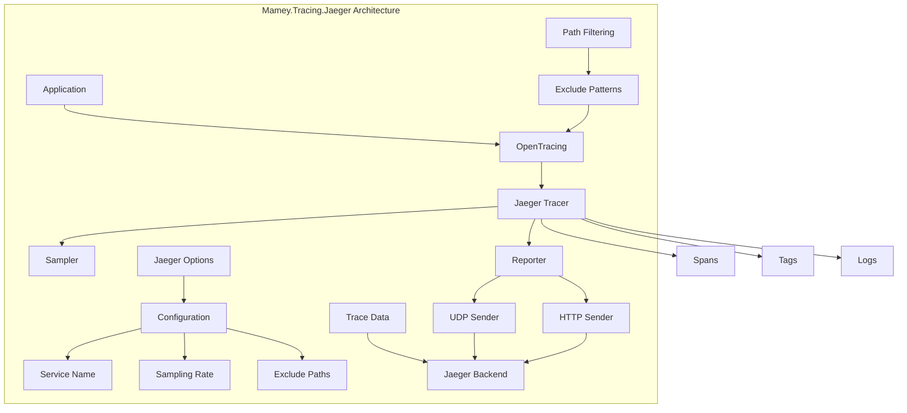

# Mamey.Tracing.Jaeger

A distributed tracing library for the Mamey framework, providing Jaeger integration for OpenTracing. This library enables distributed tracing across microservices, allowing you to track requests as they flow through your system and identify performance bottlenecks and errors.

## Table of Contents

- [Overview](#overview)
- [Key Features](#key-features)
- [Architecture](#architecture)
- [Installation](#installation)
- [Quick Start](#quick-start)
- [Core Components](#core-components)
- [API Reference](#api-reference)
- [Usage Examples](#usage-examples)
- [Configuration](#configuration)
- [Best Practices](#best-practices)
- [Troubleshooting](#troubleshooting)

## Overview

Mamey.Tracing.Jaeger is a distributed tracing library that provides Jaeger integration for the Mamey framework. It enables distributed tracing across microservices, allowing you to track requests as they flow through your system and identify performance bottlenecks and errors.

### Technical Overview

The library provides:

- **Distributed Tracing**: Track requests across multiple services
- **Jaeger Integration**: Full integration with Jaeger tracing backend
- **OpenTracing Support**: Compatible with OpenTracing standard
- **Multiple Senders**: Support for UDP and HTTP senders
- **Sampling Strategies**: Configurable sampling for performance
- **Path Filtering**: Exclude specific paths from tracing
- **Performance**: High-performance tracing with minimal overhead

## Key Features

### Core Features

- **Distributed Tracing**: Track requests across multiple services
- **Jaeger Integration**: Full integration with Jaeger tracing backend
- **OpenTracing Support**: Compatible with OpenTracing standard
- **Multiple Senders**: Support for UDP and HTTP senders
- **Sampling Strategies**: Configurable sampling for performance
- **Path Filtering**: Exclude specific paths from tracing
- **Performance**: High-performance tracing with minimal overhead

### Advanced Features

- **Custom Samplers**: Support for const, rate limiting, and probabilistic samplers
- **Authentication**: Support for authenticated Jaeger endpoints
- **Custom Headers**: Support for custom HTTP headers
- **Batch Processing**: Efficient batch processing for trace data
- **Error Handling**: Comprehensive error handling and logging
- **Configuration**: Flexible configuration options
- **Middleware Integration**: Easy integration with ASP.NET Core middleware

## Architecture



## Installation

### Package Manager
```bash
Install-Package Mamey.Tracing.Jaeger
```

### .NET CLI
```bash
dotnet add package Mamey.Tracing.Jaeger
```

### PackageReference
```xml
<PackageReference Include="Mamey.Tracing.Jaeger" Version="2.0.*" />
```

## Quick Start

### Basic Setup

```csharp
using Mamey.Tracing.Jaeger;

var builder = WebApplication.CreateBuilder(args);

// Add Mamey services
builder.Services.AddMamey()
    .AddJaeger();

var app = builder.Build();

app.Run();
```

### With Custom Configuration

```csharp
builder.Services.AddMamey()
    .AddJaeger(options =>
    {
        options.ServiceName = "my-service";
        options.Enabled = true;
        options.UdpHost = "localhost";
        options.UdpPort = 6831;
        options.Sampler = "probabilistic";
        options.SamplingRate = 0.1;
    });
```

### With Configuration File

```csharp
// appsettings.json
{
  "jaeger": {
    "enabled": true,
    "serviceName": "my-service",
    "udpHost": "localhost",
    "udpPort": 6831,
    "sampler": "probabilistic",
    "samplingRate": 0.1
  }
}

// Program.cs
builder.Services.AddMamey()
    .AddJaeger();
```

## Core Components

### Configuration System

#### JaegerOptions
```csharp
public class JaegerOptions
{
    public bool Enabled { get; set; }
    public string ServiceName { get; set; }
    public string UdpHost { get; set; }
    public int UdpPort { get; set; }
    public int MaxPacketSize { get; set; } = 64967;
    public string Sampler { get; set; }
    public double MaxTracesPerSecond { get; set; } = 5;
    public double SamplingRate { get; set; } = 0.2;
    public IEnumerable<string> ExcludePaths { get; set; }
    public string Sender { get; set; }
    public HttpSenderOptions HttpSender { get; set; }
}
```

#### HttpSenderOptions
```csharp
public class HttpSenderOptions
{
    public string Endpoint { get; set; }
    public string AuthToken { get; set; }
    public string Username { get; set; }
    public string Password { get; set; }
    public string UserAgent { get; set; }
    public int MaxPacketSize { get; set; } = 1048576;
}
```

### Builder Pattern

#### IJaegerOptionsBuilder
```csharp
public interface IJaegerOptionsBuilder
{
    IJaegerOptionsBuilder Enabled(bool enabled);
    IJaegerOptionsBuilder ServiceName(string serviceName);
    IJaegerOptionsBuilder UdpHost(string udpHost);
    IJaegerOptionsBuilder UdpPort(int udpPort);
    IJaegerOptionsBuilder Sampler(string sampler);
    IJaegerOptionsBuilder SamplingRate(double samplingRate);
    IJaegerOptionsBuilder ExcludePaths(IEnumerable<string> excludePaths);
    IJaegerOptionsBuilder Sender(string sender);
    IJaegerOptionsBuilder HttpSender(Action<HttpSenderOptions> httpSender);
    JaegerOptions Build();
}
```

#### JaegerOptionsBuilder
```csharp
public class JaegerOptionsBuilder : IJaegerOptionsBuilder
{
    // Implementation of IJaegerOptionsBuilder
}
```

## API Reference

### Extension Methods

#### IMameyBuilder Extensions

```csharp
public static IMameyBuilder AddJaeger(
    this IMameyBuilder builder, 
    string sectionName = "jaeger",
    Action<IOpenTracingBuilder> openTracingBuilder = null);

public static IMameyBuilder AddJaeger(
    this IMameyBuilder builder,
    Func<IJaegerOptionsBuilder, IJaegerOptionsBuilder> buildOptions,
    string sectionName = "jaeger",
    Action<IOpenTracingBuilder> openTracingBuilder = null);

public static IMameyBuilder AddJaeger(
    this IMameyBuilder builder, 
    JaegerOptions options,
    string sectionName = "jaeger", 
    Action<IOpenTracingBuilder> openTracingBuilder = null);
```

#### IApplicationBuilder Extensions

```csharp
public static IApplicationBuilder UseJaeger(this IApplicationBuilder app);
```

### Configuration Options

#### JaegerOptions
```csharp
public class JaegerOptions
{
    public bool Enabled { get; set; }                    // Enable/disable tracing
    public string ServiceName { get; set; }              // Service name for traces
    public string UdpHost { get; set; }                  // UDP host for Jaeger agent
    public int UdpPort { get; set; }                     // UDP port for Jaeger agent
    public int MaxPacketSize { get; set; } = 64967;      // Maximum packet size
    public string Sampler { get; set; }                  // Sampling strategy
    public double MaxTracesPerSecond { get; set; } = 5;  // Max traces per second
    public double SamplingRate { get; set; } = 0.2;      // Sampling rate
    public IEnumerable<string> ExcludePaths { get; set; } // Paths to exclude
    public string Sender { get; set; }                   // Sender type (udp/http)
    public HttpSenderOptions HttpSender { get; set; }    // HTTP sender options
}
```

## Usage Examples

### Basic Tracing Setup

```csharp
public class Program
{
    public static void Main(string[] args)
    {
        var builder = WebApplication.CreateBuilder(args);

        // Add Mamey services with Jaeger tracing
        builder.Services.AddMamey()
            .AddJaeger();

        var app = builder.Build();

        // Use Jaeger middleware
        app.UseJaeger();

        app.Run();
    }
}
```

### With Custom Configuration

```csharp
builder.Services.AddMamey()
    .AddJaeger(options =>
    {
        options.ServiceName = "my-service";
        options.Enabled = true;
        options.UdpHost = "localhost";
        options.UdpPort = 6831;
        options.Sampler = "probabilistic";
        options.SamplingRate = 0.1;
        options.ExcludePaths = new[] { "/health", "/metrics" };
    });
```

### With HTTP Sender

```csharp
builder.Services.AddMamey()
    .AddJaeger(options =>
    {
        options.ServiceName = "my-service";
        options.Enabled = true;
        options.Sender = "http";
        options.HttpSender = new JaegerOptions.HttpSenderOptions
        {
            Endpoint = "http://localhost:14268/api/traces",
            AuthToken = "your-auth-token"
        };
    });
```

### With Configuration File

```csharp
// appsettings.json
{
  "jaeger": {
    "enabled": true,
    "serviceName": "my-service",
    "sender": "udp",  // Optional: defaults to "udp" if not specified
    "udpHost": "localhost",  // Optional: defaults to "localhost"
    "udpPort": 6831,  // Optional: defaults to 6831
    "sampler": "probabilistic",
    "samplingRate": 0.1,
    "excludePaths": [
      "/health",
      "/metrics",
      "/swagger"
    ]
  }
}

// Program.cs
builder.Services.AddMamey()
    .AddJaeger();
```

### Using in Services

```csharp
public class UserService
{
    private readonly ITracer _tracer;

    public UserService(ITracer tracer)
    {
        _tracer = tracer;
    }

    public async Task<User> CreateUserAsync(CreateUserRequest request)
    {
        using var scope = _tracer.BuildSpan("create_user")
            .WithTag("user.email", request.Email)
            .WithTag("user.name", request.Name)
            .StartActive();

        try
        {
            // Business logic here
            var user = await ProcessUserCreationAsync(request);
            
            scope.Span.SetTag("user.id", user.Id.ToString());
            scope.Span.SetTag("success", true);
            
            return user;
        }
        catch (Exception ex)
        {
            scope.Span.SetTag("error", true);
            scope.Span.SetTag("error.message", ex.Message);
            scope.Span.Log(DateTimeOffset.UtcNow, ex.Message);
            throw;
        }
    }
}
```

### Custom Span Creation

```csharp
public class OrderService
{
    private readonly ITracer _tracer;

    public async Task<Order> ProcessOrderAsync(OrderRequest request)
    {
        using var scope = _tracer.BuildSpan("process_order")
            .WithTag("order.id", request.OrderId)
            .WithTag("order.amount", request.Amount)
            .WithTag("customer.id", request.CustomerId)
            .StartActive();

        try
        {
            // Validate order
            using var validationScope = _tracer.BuildSpan("validate_order")
                .AsChildOf(scope.Span)
                .StartActive();
            
            await ValidateOrderAsync(request);
            validationScope.Span.SetTag("validation.success", true);

            // Process payment
            using var paymentScope = _tracer.BuildSpan("process_payment")
                .AsChildOf(scope.Span)
                .WithTag("payment.method", request.PaymentMethod)
                .StartActive();
            
            var payment = await ProcessPaymentAsync(request);
            paymentScope.Span.SetTag("payment.id", payment.Id);
            paymentScope.Span.SetTag("payment.success", true);

            // Create order
            var order = await CreateOrderAsync(request, payment);
            scope.Span.SetTag("order.created", true);
            scope.Span.SetTag("order.id", order.Id);

            return order;
        }
        catch (Exception ex)
        {
            scope.Span.SetTag("error", true);
            scope.Span.SetTag("error.message", ex.Message);
            scope.Span.Log(DateTimeOffset.UtcNow, ex.Message);
            throw;
        }
    }
}
```

## Configuration

### Basic Configuration

```csharp
builder.Services.AddMamey()
    .AddJaeger();
```

### With Custom Options

```csharp
builder.Services.AddMamey()
    .AddJaeger(options =>
    {
        options.ServiceName = "my-service";
        options.Enabled = true;
        options.UdpHost = "localhost";
        options.UdpPort = 6831;
    });
```

### With Configuration Section

```csharp
// appsettings.json
{
  "jaeger": {
    "enabled": true,
    "serviceName": "my-service",
    "udpHost": "localhost",
    "udpPort": 6831
  }
}

// Program.cs
builder.Services.AddMamey()
    .AddJaeger();
```

### Advanced Configuration

```csharp
// appsettings.json
{
  "jaeger": {
    "enabled": true,
    "serviceName": "my-service",
    "udpHost": "localhost",
    "udpPort": 6831,
    "maxPacketSize": 64967,
    "sampler": "probabilistic",
    "maxTracesPerSecond": 10,
    "samplingRate": 0.1,
    "excludePaths": [
      "/health",
      "/metrics",
      "/swagger"
    ],
    "sender": "http",
    "httpSender": {
      "endpoint": "http://localhost:14268/api/traces",
      "authToken": "your-auth-token",
      "username": "jaeger",
      "password": "password",
      "userAgent": "MyService/1.0",
      "maxPacketSize": 1048576
    }
  }
}
```

## Best Practices

### Span Naming

1. **Use Descriptive Names**: Use descriptive names for spans
2. **Follow Conventions**: Follow OpenTracing naming conventions
3. **Use Hierarchical Names**: Use hierarchical names for related operations
4. **Avoid Generic Names**: Avoid generic names like "operation" or "process"

```csharp
// Good: Descriptive span names
_tracer.BuildSpan("user.create")
_tracer.BuildSpan("order.process_payment")
_tracer.BuildSpan("inventory.check_availability")

// Bad: Generic span names
_tracer.BuildSpan("operation")
_tracer.BuildSpan("process")
_tracer.BuildSpan("method")
```

### Tagging

1. **Use Consistent Tags**: Use consistent tag names across your application
2. **Add Business Context**: Add business context to spans
3. **Include Identifiers**: Include relevant identifiers in tags
4. **Avoid Sensitive Data**: Never include sensitive data in tags

```csharp
// Good: Meaningful tags
scope.Span.SetTag("user.id", user.Id);
scope.Span.SetTag("order.amount", order.Amount);
scope.Span.SetTag("payment.method", payment.Method);

// Bad: Generic or sensitive tags
scope.Span.SetTag("data", sensitiveData);
scope.Span.SetTag("value", "some value");
```

### Error Handling

1. **Tag Errors**: Always tag spans when errors occur
2. **Log Exceptions**: Log exceptions in spans
3. **Include Error Context**: Include relevant error context
4. **Don't Swallow Errors**: Don't swallow errors in tracing code

```csharp
try
{
    await ProcessOrderAsync(order);
    scope.Span.SetTag("success", true);
}
catch (Exception ex)
{
    scope.Span.SetTag("error", true);
    scope.Span.SetTag("error.message", ex.Message);
    scope.Span.Log(DateTimeOffset.UtcNow, ex.Message);
    throw; // Re-throw the exception
}
```

### Performance Considerations

1. **Use Sampling**: Use appropriate sampling rates for production
2. **Avoid Expensive Operations**: Don't perform expensive operations in span creation
3. **Use Conditional Tracing**: Use conditional tracing for expensive operations
4. **Monitor Performance**: Monitor tracing performance impact

```csharp
// Good: Conditional tracing
if (_tracer.ActiveSpan != null)
{
    using var scope = _tracer.BuildSpan("expensive_operation").StartActive();
    await ExpensiveOperationAsync();
}

// Good: Appropriate sampling
builder.Services.AddMamey()
    .AddJaeger(options =>
    {
        options.SamplingRate = 0.1; // 10% sampling in production
    });
```

## Troubleshooting

### Common Issues

#### 1. Traces Not Appearing

**Problem**: Traces are not appearing in Jaeger UI.

**Solution**: Check Jaeger agent connectivity and configuration.

```csharp
// Verify Jaeger agent is running
// Check UDP port 6831 or HTTP endpoint
// Verify service name is set correctly
builder.Services.AddMamey()
    .AddJaeger(options =>
    {
        options.ServiceName = "my-service"; // Ensure service name is set
        options.Enabled = true; // Ensure tracing is enabled
        options.UdpHost = "localhost"; // Verify host
        options.UdpPort = 6831; // Verify port
    });
```

#### 2. Performance Issues

**Problem**: Tracing is causing performance issues.

**Solution**: Adjust sampling rate and exclude unnecessary paths.

```csharp
// Reduce sampling rate
builder.Services.AddMamey()
    .AddJaeger(options =>
    {
        options.SamplingRate = 0.01; // 1% sampling
        options.ExcludePaths = new[] { "/health", "/metrics" };
    });
```

#### 3. Memory Issues

**Problem**: High memory usage due to tracing.

**Solution**: Configure appropriate packet sizes and sampling.

```csharp
// Configure packet sizes
builder.Services.AddMamey()
    .AddJaeger(options =>
    {
        options.MaxPacketSize = 32768; // Reduce packet size
        options.SamplingRate = 0.05; // Reduce sampling rate
    });
```

#### 4. Authentication Issues

**Problem**: Authentication failures with Jaeger HTTP endpoint.

**Solution**: Check authentication configuration.

```csharp
// Configure authentication
builder.Services.AddMamey()
    .AddJaeger(options =>
    {
        options.Sender = "http";
        options.HttpSender = new JaegerOptions.HttpSenderOptions
        {
            Endpoint = "http://localhost:14268/api/traces",
            AuthToken = "your-auth-token" // Verify token
        };
    });
```

### Debugging Tips

1. **Enable Debug Logging**: Use debug level for troubleshooting
2. **Check Jaeger Agent**: Verify Jaeger agent is running and accessible
3. **Monitor Network**: Monitor network traffic to Jaeger
4. **Use Jaeger UI**: Use Jaeger UI to verify trace data

```csharp
// Enable debug logging
builder.Logging.SetMinimumLevel(LogLevel.Debug);

// Add Jaeger with debug options
builder.Services.AddMamey()
    .AddJaeger(options =>
    {
        options.ServiceName = "my-service";
        options.Enabled = true;
        options.SamplingRate = 1.0; // 100% sampling for debugging
    });
```

### Performance Monitoring

1. **Trace Volume**: Monitor trace volume and growth
2. **Sampling Rate**: Monitor sampling rate effectiveness
3. **Memory Usage**: Monitor memory usage for trace data
4. **Network Traffic**: Monitor network traffic to Jaeger

```csharp
// Monitor trace volume
builder.Services.AddMamey()
    .AddJaeger(options =>
    {
        options.SamplingRate = 0.1; // 10% sampling
        options.MaxTracesPerSecond = 100; // Limit trace rate
    });
```

## License

This project is licensed under the MIT License - see the [LICENSE](LICENSE) file for details.

## Contributing

Please read [CONTRIBUTING.md](CONTRIBUTING.md) for details on our code of conduct and the process for submitting pull requests.

## Support

For support and questions, please open an issue in the [GitHub repository](https://github.com/mamey-io/mamey-tracing-jaeger/issues).
