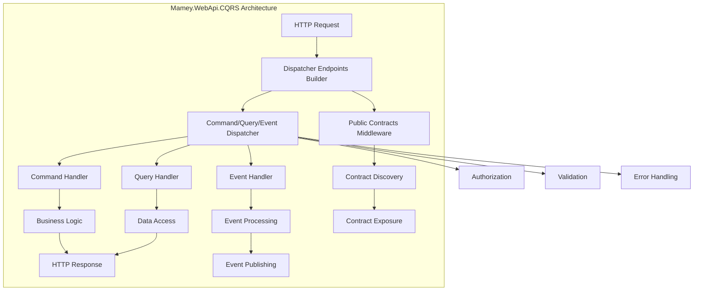

# Mamey.WebApi.CQRS

A powerful integration library that seamlessly combines the Mamey WebApi framework with CQRS (Command Query Responsibility Segregation) patterns. This library provides a unified approach to building web APIs that follow CQRS principles with built-in support for commands, queries, and events.

## Table of Contents

- [Overview](#overview)
- [Key Features](#key-features)
- [Architecture](#architecture)
- [Installation](#installation)
- [Quick Start](#quick-start)
- [Core Components](#core-components)
- [API Reference](#api-reference)
- [Usage Examples](#usage-examples)
- [Configuration](#configuration)
- [Best Practices](#best-practices)
- [Troubleshooting](#troubleshooting)

## Overview

Mamey.WebApi.CQRS extends the Mamey.WebApi library to provide seamless integration with CQRS patterns. It allows you to build web APIs that naturally separate read and write operations while maintaining a clean, type-safe approach to handling HTTP requests.

### Technical Overview

The library provides:

- **CQRS Integration**: Seamless integration between WebApi and CQRS patterns
- **Unified Dispatcher**: Single interface for handling commands, queries, and events
- **Endpoint Builder**: Fluent API for defining CQRS-based endpoints
- **Public Contracts**: Automatic exposure of command and event contracts
- **Type Safety**: Full type safety for all CQRS operations
- **Middleware Support**: Built-in middleware for CQRS-specific functionality

## Key Features

### Core Features

- **Unified Dispatcher**: Single `IDispatcher` interface for commands, queries, and events
- **CQRS Endpoints**: Fluent API for defining CQRS-based HTTP endpoints
- **Public Contracts**: Automatic exposure of command and event contracts via middleware
- **Type Safety**: Full compile-time type safety for all operations
- **Dependency Injection**: Seamless integration with ASP.NET Core DI container
- **Middleware Pipeline**: Built-in middleware for CQRS-specific functionality

### Advanced Features

- **Before/After Hooks**: Support for pre and post-processing of CQRS operations
- **Authorization Integration**: Built-in support for authorization policies and roles
- **Error Handling**: Comprehensive error handling for CQRS operations
- **Request Validation**: Automatic validation of CQRS requests
- **Response Mapping**: Automatic mapping of CQRS responses to HTTP responses

## Architecture



## Installation

### Package Manager
```bash
Install-Package Mamey.WebApi.CQRS
```

### .NET CLI
```bash
dotnet add package Mamey.WebApi.CQRS
```

### PackageReference
```xml
<PackageReference Include="Mamey.WebApi.CQRS" Version="2.0.*" />
```

## Quick Start

### Basic Setup

```csharp
using Mamey.WebApi.CQRS;
using Mamey.CQRS.Commands;
using Mamey.CQRS.Queries;

var builder = WebApplication.CreateBuilder(args);

// Add Mamey services
builder.Services.AddMamey()
    .AddWebApi()
    .AddCommands()
    .AddQueries()
    .AddInMemoryDispatcher();

var app = builder.Build();

// Configure CQRS endpoints
app.UseDispatcherEndpoints(dispatcher =>
{
    dispatcher
        .Post<CreateUserCommand>("/api/users", auth: true)
        .Get<GetUserQuery, UserDto>("/api/users/{id}", auth: true)
        .Put<UpdateUserCommand>("/api/users/{id}", auth: true)
        .Delete<DeleteUserCommand>("/api/users/{id}", auth: true);
});

app.Run();
```

### With Public Contracts

```csharp
// Enable public contracts exposure
app.UsePublicContracts<PublicContractAttribute>();

// Configure endpoints
app.UseDispatcherEndpoints(dispatcher =>
{
    dispatcher
        .Post<CreateUserCommand>("/api/users")
        .Get<GetUserQuery, UserDto>("/api/users/{id}");
});
```

## Core Components

### Dispatcher System

#### IDispatcher Interface
```csharp
public interface IDispatcher
{
    Task SendAsync<T>(T command, CancellationToken cancellationToken = default) 
        where T : class, ICommand;
    
    Task PublishAsync<T>(T @event, CancellationToken cancellationToken = default) 
        where T : class, IEvent;
    
    Task<TResult> QueryAsync<TResult>(IQuery<TResult> query, CancellationToken cancellationToken = default);
}
```

#### InMemoryDispatcher Implementation
```csharp
public class InMemoryDispatcher : IDispatcher
{
    private readonly ICommandDispatcher _commandDispatcher;
    private readonly IEventDispatcher _eventDispatcher;
    private readonly IQueryDispatcher _queryDispatcher;

    // Implementation details...
}
```

### Endpoint Builder

#### IDispatcherEndpointsBuilder Interface
```csharp
public interface IDispatcherEndpointsBuilder
{
    IDispatcherEndpointsBuilder Get(string path, Func<HttpContext, Task> context = null,
        Action<IEndpointConventionBuilder> endpoint = null, bool auth = false, string roles = null,
        params string[] policies);

    IDispatcherEndpointsBuilder Get<TQuery, TResult>(string path,
        Func<TQuery, HttpContext, Task> beforeDispatch = null,
        Func<TQuery, TResult, HttpContext, Task> afterDispatch = null,
        Action<IEndpointConventionBuilder> endpoint = null, bool auth = false, string roles = null,
        params string[] policies) where TQuery : class, IQuery<TResult>;

    IDispatcherEndpointsBuilder Post<T>(string path, Func<T, HttpContext, Task> beforeDispatch = null,
        Func<T, HttpContext, Task> afterDispatch = null, Action<IEndpointConventionBuilder> endpoint = null,
        bool auth = false, string roles = null, params string[] policies)
        where T : class, ICommand;

    // ... other HTTP methods
}
```

### Public Contracts

#### PublicContractAttribute
```csharp
[AttributeUsage(AttributeTargets.Class)]
public class PublicContractAttribute : Attribute
{
}
```

#### PublicContractsMiddleware
```csharp
public class PublicContractsMiddleware
{
    public Task InvokeAsync(HttpContext context)
    {
        // Exposes command and event contracts
    }
}
```

## API Reference

### Extension Methods

#### IMameyBuilder Extensions

```csharp
public static class WebApiCQRSExtensions
{
    public static IMameyBuilder AddInMemoryDispatcher(this IMameyBuilder builder);
}
```

#### IApplicationBuilder Extensions

```csharp
public static class WebApiCQRSApplicationExtensions
{
    public static IApplicationBuilder UseDispatcherEndpoints(this IApplicationBuilder app,
        Action<IDispatcherEndpointsBuilder> builder, bool useAuthorization = true,
        Action<IApplicationBuilder> middleware = null);

    public static IApplicationBuilder UsePublicContracts<T>(this IApplicationBuilder app,
        string endpoint = "/_contracts");

    public static IApplicationBuilder UsePublicContracts(this IApplicationBuilder app,
        bool attributeRequired, string endpoint = "/_contracts");
}
```

#### HttpContext Extensions

```csharp
public static class HttpContextCQRSExtensions
{
    public static Task SendAsync<T>(this HttpContext context, T command) 
        where T : class, ICommand;

    public static Task<TResult> QueryAsync<TResult>(this HttpContext context, IQuery<TResult> query);

    public static Task<TResult> QueryAsync<TQuery, TResult>(this HttpContext context, TQuery query)
        where TQuery : class, IQuery<TResult>;
}
```

## Usage Examples

### Basic CQRS Endpoints

```csharp
app.UseDispatcherEndpoints(dispatcher =>
{
    // Command endpoints
    dispatcher
        .Post<CreateUserCommand>("/api/users", auth: true, roles: "Admin")
        .Put<UpdateUserCommand>("/api/users/{id}", auth: true)
        .Delete<DeleteUserCommand>("/api/users/{id}", auth: true);

    // Query endpoints
    dispatcher
        .Get<GetUserQuery, UserDto>("/api/users/{id}", auth: true)
        .Get<GetUsersQuery, IEnumerable<UserDto>>("/api/users", auth: true);
});
```

### With Before/After Hooks

```csharp
app.UseDispatcherEndpoints(dispatcher =>
{
    dispatcher
        .Post<CreateUserCommand>("/api/users", 
            beforeDispatch: async (command, ctx) =>
            {
                // Pre-processing logic
                ctx.Items["RequestId"] = Guid.NewGuid();
            },
            afterDispatch: async (command, ctx) =>
            {
                // Post-processing logic
                var requestId = ctx.Items["RequestId"];
                ctx.Response.Headers.Add("X-Request-Id", requestId.ToString());
            })
        .Get<GetUserQuery, UserDto>("/api/users/{id}",
            beforeDispatch: async (query, ctx) =>
            {
                // Pre-processing for queries
                var userId = ctx.Request.RouteValues["id"];
                query.UserId = Guid.Parse(userId.ToString());
            },
            afterDispatch: async (query, result, ctx) =>
            {
                // Post-processing for queries
                if (result == null)
                {
                    ctx.Response.StatusCode = 404;
                }
            });
});
```

### Public Contracts Exposure

```csharp
// Enable public contracts
app.UsePublicContracts<PublicContractAttribute>("/api/contracts");

// Mark commands and events as public
[PublicContract]
public class CreateUserCommand : ICommand
{
    public string Name { get; set; }
    public string Email { get; set; }
}

[PublicContract]
public class UserCreatedEvent : IEvent
{
    public Guid UserId { get; set; }
    public string Name { get; set; }
}
```

### Custom Authorization

```csharp
app.UseDispatcherEndpoints(dispatcher =>
{
    dispatcher
        .Post<CreateUserCommand>("/api/users", 
            auth: true, 
            policies: "CreateUser")
        .Get<GetUserQuery, UserDto>("/api/users/{id}", 
            auth: true, 
            roles: "Admin,User")
        .Delete<DeleteUserCommand>("/api/users/{id}", 
            auth: true, 
            policies: "DeleteUser");
});
```

### Error Handling

```csharp
app.UseDispatcherEndpoints(dispatcher =>
{
    dispatcher
        .Post<CreateUserCommand>("/api/users", 
            beforeDispatch: async (command, ctx) =>
            {
                // Validation
                if (string.IsNullOrEmpty(command.Name))
                {
                    ctx.Response.StatusCode = 400;
                    await ctx.Response.WriteJsonAsync(new { error = "Name is required" });
                    return;
                }
            });
});
```

## Configuration

### Dispatcher Configuration

```csharp
builder.Services.AddMamey()
    .AddWebApi()
    .AddCommands()
    .AddQueries()
    .AddEvents()
    .AddInMemoryDispatcher();
```

### Public Contracts Configuration

```csharp
// Basic configuration
app.UsePublicContracts<PublicContractAttribute>();

// With custom endpoint
app.UsePublicContracts<PublicContractAttribute>("/api/contracts");

// With attribute requirement
app.UsePublicContracts(attributeRequired: true, endpoint: "/api/contracts");
```

### Authorization Configuration

```csharp
builder.Services.AddAuthorization(options =>
{
    options.AddPolicy("CreateUser", policy => 
        policy.RequireRole("Admin").RequireClaim("permission", "create_user"));
    
    options.AddPolicy("DeleteUser", policy => 
        policy.RequireRole("Admin").RequireClaim("permission", "delete_user"));
});
```

## Best Practices

### Command Design

1. **Single Responsibility**: Each command should represent a single business operation
2. **Immutable**: Commands should be immutable after creation
3. **Validation**: Include validation logic in commands
4. **Idempotency**: Design commands to be idempotent when possible

```csharp
public class CreateUserCommand : ICommand
{
    public string Name { get; set; }
    public string Email { get; set; }
    public string Password { get; set; }

    public void Validate()
    {
        if (string.IsNullOrEmpty(Name))
            throw new ValidationException("Name is required");
        
        if (string.IsNullOrEmpty(Email))
            throw new ValidationException("Email is required");
        
        if (!IsValidEmail(Email))
            throw new ValidationException("Invalid email format");
    }

    private bool IsValidEmail(string email)
    {
        return email.Contains("@") && email.Contains(".");
    }
}
```

### Query Design

1. **Read-Only**: Queries should never modify data
2. **Specific**: Queries should be specific to avoid over-fetching
3. **Pagination**: Use pagination for large result sets
4. **Caching**: Consider caching for frequently accessed queries

```csharp
public class GetUsersQuery : IQuery<IEnumerable<UserDto>>
{
    public int Page { get; set; } = 1;
    public int PageSize { get; set; } = 10;
    public string SearchTerm { get; set; }
    public string SortBy { get; set; } = "Name";
    public bool SortDescending { get; set; } = false;
}
```

### Event Design

1. **Past Tense**: Use past tense for event names
2. **Immutable**: Events should be immutable
3. **Descriptive**: Use descriptive names that clearly indicate what happened
4. **Versioning**: Consider versioning for long-lived events

```csharp
public class UserCreatedEvent : IEvent
{
    public Guid UserId { get; set; }
    public string Name { get; set; }
    public string Email { get; set; }
    public DateTime CreatedAt { get; set; }
    public string CreatedBy { get; set; }
}
```

### Endpoint Organization

1. **RESTful Design**: Follow REST conventions for endpoint design
2. **Versioning**: Use API versioning for backward compatibility
3. **Consistent Naming**: Use consistent naming conventions
4. **Documentation**: Use attributes and metadata for API documentation

```csharp
app.UseDispatcherEndpoints(dispatcher =>
{
    // Version 1 endpoints
    dispatcher
        .Post<CreateUserCommand>("/api/v1/users", auth: true)
        .Get<GetUserQuery, UserDto>("/api/v1/users/{id}", auth: true)
        .Put<UpdateUserCommand>("/api/v1/users/{id}", auth: true)
        .Delete<DeleteUserCommand>("/api/v1/users/{id}", auth: true);

    // Version 2 endpoints
    dispatcher
        .Post<CreateUserV2Command>("/api/v2/users", auth: true)
        .Get<GetUserV2Query, UserV2Dto>("/api/v2/users/{id}", auth: true);
});
```

## Troubleshooting

### Common Issues

#### 1. Dispatcher Not Found

**Problem**: `IDispatcher` service not registered.

**Solution**: Ensure the dispatcher is registered in DI container.

```csharp
builder.Services.AddMamey()
    .AddWebApi()
    .AddCommands()
    .AddQueries()
    .AddInMemoryDispatcher(); // This registers IDispatcher
```

#### 2. Command/Query Not Found

**Problem**: Command or query handler not registered.

**Solution**: Ensure handlers are registered in DI container.

```csharp
builder.Services.AddMamey()
    .AddCommands() // This registers command handlers
    .AddQueries(); // This registers query handlers
```

#### 3. Public Contracts Not Working

**Problem**: Public contracts endpoint returning empty response.

**Solution**: Ensure commands and events are marked with the correct attribute.

```csharp
[PublicContract] // This attribute is required
public class CreateUserCommand : ICommand
{
    // Command properties
}
```

#### 4. Authorization Issues

**Problem**: Authorization not working for CQRS endpoints.

**Solution**: Ensure proper authorization configuration and middleware order.

```csharp
// Configure authorization
builder.Services.AddAuthorization(options =>
{
    options.AddPolicy("CreateUser", policy => 
        policy.RequireRole("Admin"));
});

// Ensure proper middleware order
app.UseAuthentication();
app.UseAuthorization();
app.UseDispatcherEndpoints(dispatcher => { /* endpoints */ });
```

### Performance Considerations

1. **Async Operations**: Use async/await for all I/O operations
2. **Caching**: Implement appropriate caching strategies for queries
3. **Pagination**: Use pagination for large result sets
4. **Memory Management**: Dispose of resources properly

```csharp
public class GetUsersQueryHandler : IQueryHandler<GetUsersQuery, IEnumerable<UserDto>>
{
    private readonly IUserRepository _repository;
    private readonly IMemoryCache _cache;

    public async Task<IEnumerable<UserDto>> HandleAsync(GetUsersQuery query, CancellationToken cancellationToken = default)
    {
        var cacheKey = $"users_{query.Page}_{query.PageSize}_{query.SearchTerm}";
        
        if (_cache.TryGetValue(cacheKey, out IEnumerable<UserDto> cachedUsers))
        {
            return cachedUsers;
        }

        var users = await _repository.GetUsersAsync(query.Page, query.PageSize, query.SearchTerm, cancellationToken);
        var userDtos = users.Select(u => new UserDto { Id = u.Id, Name = u.Name });
        
        _cache.Set(cacheKey, userDtos, TimeSpan.FromMinutes(5));
        
        return userDtos;
    }
}
```

### Debugging Tips

1. **Enable Logging**: Use structured logging for better debugging
2. **Request Tracing**: Implement request/response logging
3. **Exception Details**: Log detailed exception information
4. **Performance Monitoring**: Use performance counters and metrics

```csharp
public class CQRSLoggingMiddleware : IMiddleware
{
    private readonly ILogger<CQRSLoggingMiddleware> _logger;

    public async Task InvokeAsync(HttpContext context, RequestDelegate next)
    {
        var stopwatch = Stopwatch.StartNew();
        
        _logger.LogInformation("CQRS Request: {Method} {Path}", 
            context.Request.Method, context.Request.Path);

        await next(context);
        
        stopwatch.Stop();
        
        _logger.LogInformation("CQRS Response: {StatusCode} in {ElapsedMs}ms", 
            context.Response.StatusCode, stopwatch.ElapsedMilliseconds);
    }
}
```

## License

This project is licensed under the MIT License - see the [LICENSE](LICENSE) file for details.

## Contributing

Please read [CONTRIBUTING.md](CONTRIBUTING.md) for details on our code of conduct and the process for submitting pull requests.

## Support

For support and questions, please open an issue in the [GitHub repository](https://github.com/mamey-io/mamey-webapi-cqrs/issues).
