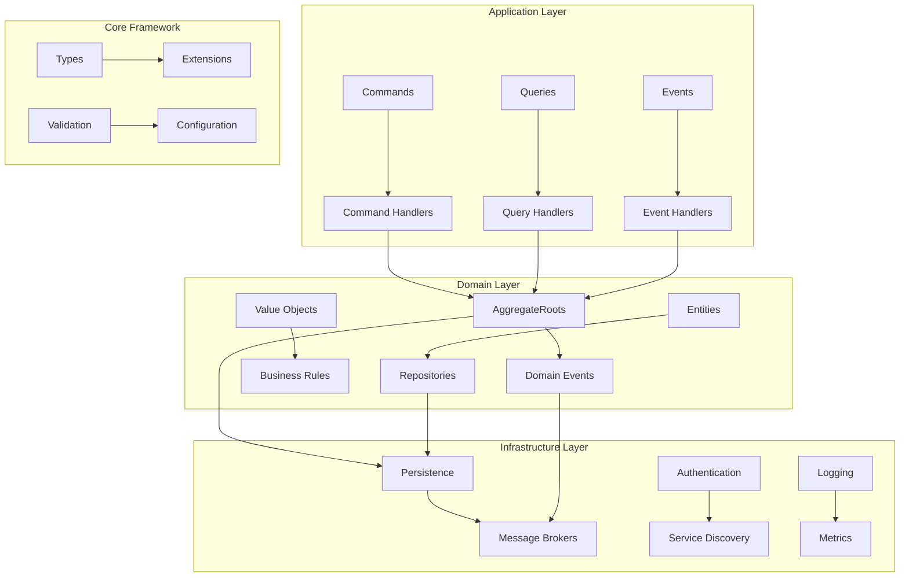
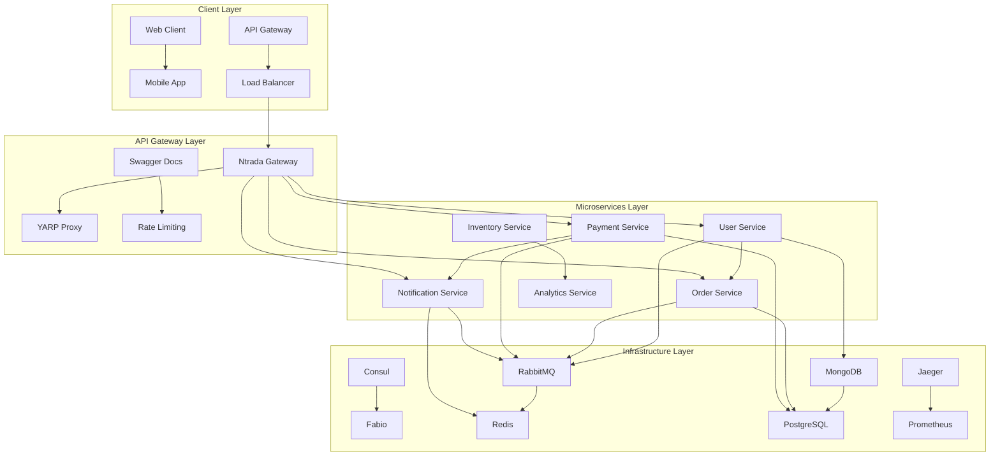
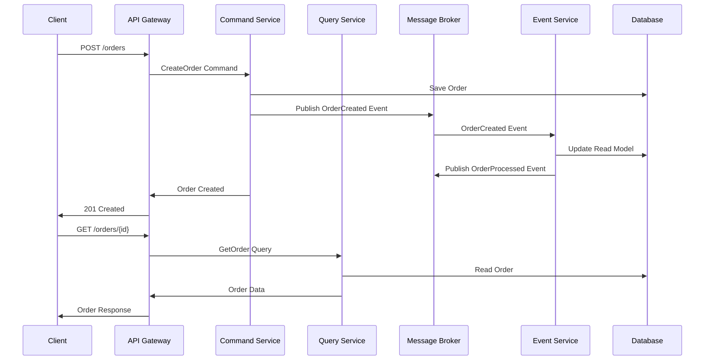
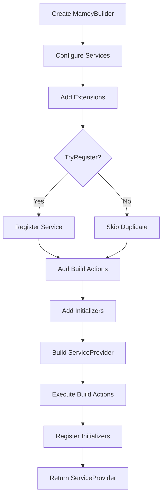
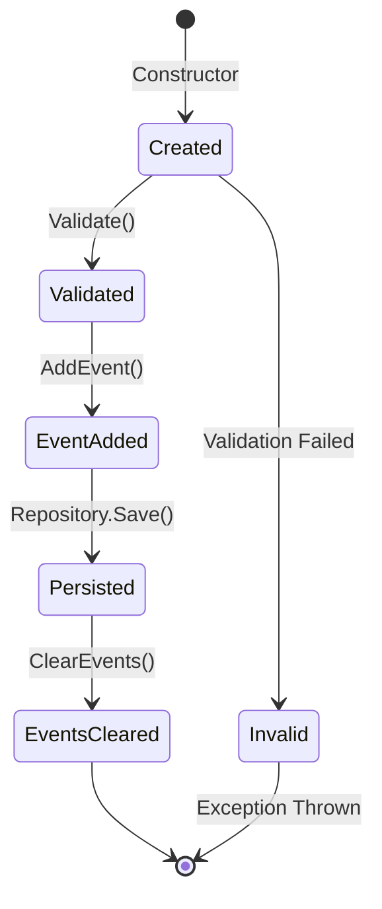
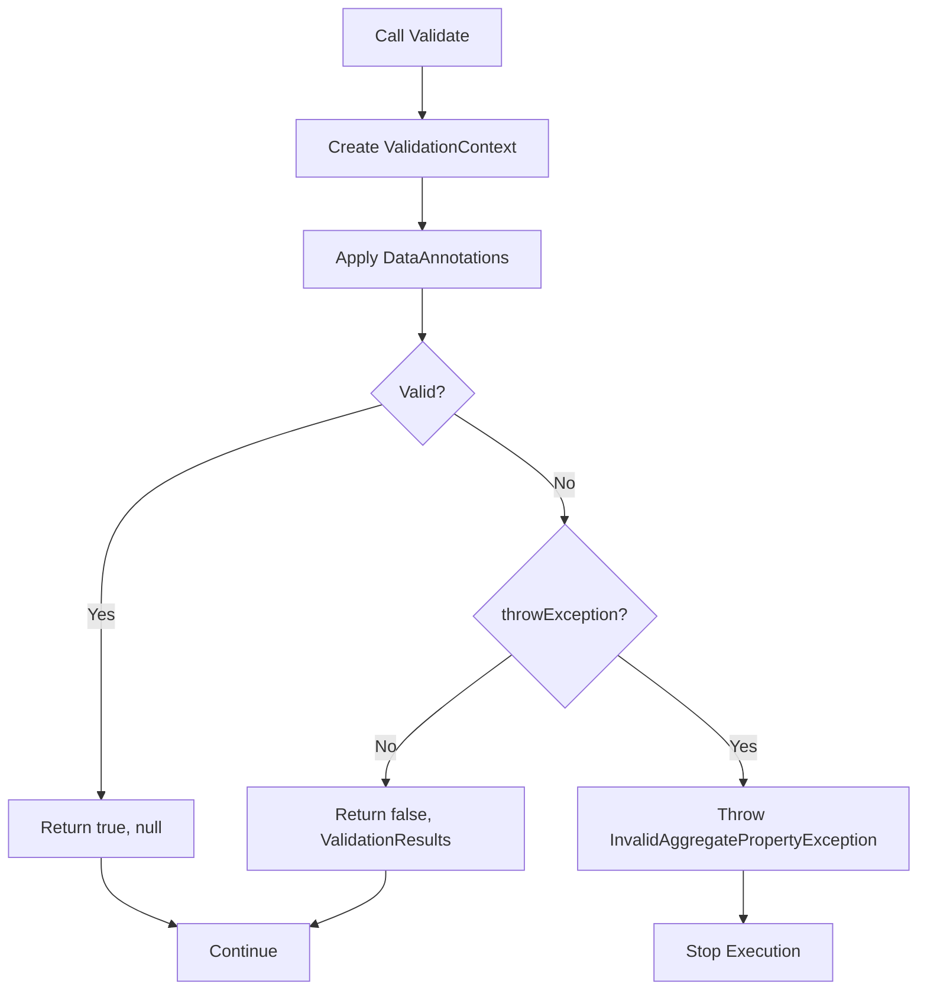

# Mamey Core Framework

**Library**: `Mamey`  
**Location**: `Mamey/src/Mamey/`  
**Type**: Core Foundation Library  
**Version**: 2.0.*  
**Files**: 127 C# files  
**Namespace**: `Mamey`, `Mamey.Types`, `Mamey.CQRS`, `Mamey.Extensions`

## Overview

Mamey Core Framework is the foundational library that provides essential abstractions, patterns, and utilities for building enterprise-grade microservices and distributed systems with .NET. It implements Domain-Driven Design (DDD) principles, CQRS patterns, and provides a fluent configuration API that serves as the backbone for all other Mamey libraries.

### Design Philosophy

Mamey consists of **helper libraries** that are generally **independent from one another**, designed to aid in the development of web applications and microservices. **It is not a framework nor a universal solution**. Rather, **it includes a collection of extension methods and additional abstractions** to address common infrastructural challenges like routing, service discovery, load balancing, tracing, asynchronous messaging, and more.

### Key Characteristics

1. **Cloud-Agnostic**: Uses CNCF tools that work across cloud providers
2. **Modular**: Libraries are independent and can be used separately
3. **Type-Safe**: Strongly-typed identifiers prevent primitive obsession
4. **Event-Driven**: Built for asynchronous, event-driven architectures
5. **Domain-Focused**: Emphasizes Domain-Driven Design patterns

## Conceptual Foundation

### Domain-Driven Design (DDD)

**Domain-Driven Design** is a software development approach that centers the software around real-world concepts and their interactions, facilitating communication between technical experts and domain experts.

#### Key Concepts

**1. Ubiquitous Language**
- Shared vocabulary between developers and domain experts
- Terms from the domain model used in code
- Reduces translation errors and misunderstandings

**2. Bounded Contexts**
- Clear boundaries around domain models
- Prevents conceptual leakage between contexts
- Each context has its own model and terminology

**3. Aggregates**
- Consistency boundaries that ensure business invariants
- Aggregate roots ensure transactional consistency
- External references only to aggregate roots, not internal entities

**4. Value Objects**
- Immutable objects without identity
- Defined entirely by their attributes
- Can be freely shared and replaced

**5. Domain Events**
- Significant business occurrences
- Represent things that happened in the domain
- Enable loose coupling between bounded contexts

#### Why DDD?

**Benefits:**
- **Better Communication**: Shared language between technical and business teams
- **Maintainability**: Code structure reflects business structure
- **Testability**: Domain logic isolated from infrastructure concerns
- **Scalability**: Clear boundaries enable independent scaling

**Trade-offs:**
- **Complexity**: Adds initial complexity for simple domains
- **Learning Curve**: Requires deep understanding of business domain
- **Over-engineering Risk**: Can be over-abstracted for simple CRUD applications

**When to Use:**
- Complex business logic
- Long-lived applications
- Multiple teams working on the same domain
- Need for domain expertise in code

**Resources:**
- [Domain-Driven Design Reference](https://domainlanguage.com/ddd/reference/)
- [Martin Fowler's DDD Article](https://martinfowler.com/bliki/DomainDrivenDesign.html)
- [Eric Evans' Blue Book](https://www.domainlanguage.com/ddd/)

### Command Query Responsibility Segregation (CQRS)

**CQRS** is a software architectural pattern that separates the models for read and update operations.

#### Key Concepts

**1. Commands (Write Side)**
- Represent intent to change state
- No return values (except success/failure)
- Optimized for business logic validation
- Can be asynchronous

**2. Queries (Read Side)**
- Represent intent to retrieve data
- Return data (DTOs, projections)
- Optimized for performance and presentation
- Synchronous by nature

**3. Separate Models**
- Write model optimized for consistency
- Read model optimized for queries
- Can use different databases
- Can be scaled independently

#### Why CQRS?

**Benefits:**
- **Performance**: Optimize reads and writes independently
- **Scalability**: Scale read and write sides separately
- **Security**: Different authorization rules for reads vs writes
- **Flexibility**: Different models for different use cases

**Trade-offs:**
- **Complexity**: More complex than traditional CRUD
- **Eventual Consistency**: Read models may be eventually consistent
- **Code Duplication**: Some duplication between read and write models

**When to Use:**
- High read/write ratio
- Complex business logic on write side
- Need for audit trails
- Different views of the same data

**Resources:**
- [CQRS Pattern by Martin Fowler](https://martinfowler.com/bliki/CQRS.html)
- [Microsoft CQRS Pattern](https://docs.microsoft.com/en-us/azure/architecture/patterns/cqrs)
- [CQRS Journey by Microsoft](https://docs.microsoft.com/en-us/previous-versions/msp-n-p/jj554200(v=pandp.10))

### Event Sourcing

**Event Sourcing** is a pattern where the state of an application is determined by a sequence of events that have occurred, rather than by the current state of the data.

#### Key Concepts

**1. Event Store**
- All state changes stored as events
- Complete history of all changes
- Immutable event log

**2. Replay Capability**
- Can reconstruct state by replaying events
- Can query state at any point in time
- Time-travel debugging

**3. Audit Trail**
- Complete history of all changes
- Who, what, when for every change
- Built-in compliance support

#### Why Event Sourcing?

**Benefits:**
- **Complete Audit Trail**: Every change is recorded
- **Time Travel**: Query state at any point in time
- **Debugging**: Replay events to understand issues
- **Flexibility**: Can create new projections from events

**Trade-offs:**
- **Storage**: Events accumulate over time
- **Complexity**: More complex than traditional CRUD
- **Performance**: Replaying events can be slow
- **Learning Curve**: Requires understanding event streams

**When to Use:**
- Audit requirements
- Complex business rules
- Need for temporal queries
- Event replay for debugging

**Resources:**
- [Event Sourcing Pattern by Martin Fowler](https://martinfowler.com/eaaDev/EventSourcing.html)
- [Microsoft Event Sourcing Pattern](https://docs.microsoft.com/en-us/azure/architecture/patterns/event-sourcing)
- [Event Store Documentation](https://eventstore.com/docs/)

## Architecture

### Layered Architecture

The framework follows a layered architecture with clear separation of concerns:



### Microservice Architecture



### Event-Driven Flow



### Builder Pattern Flow



### Aggregate Lifecycle



### Validation Flow



## Core Components

### IMameyBuilder - Configuration Builder

The `IMameyBuilder` interface is the central configuration mechanism for the Mamey framework. It provides a fluent API for service registration and dependency injection.

#### Conceptual Understanding

**Builder Pattern**: The builder pattern is a creational design pattern that provides a flexible solution to construct complex objects step by step. In Mamey, the builder pattern allows you to configure services in a fluent, readable way.

**Why Use Builder Pattern?**
- **Fluent API**: Chain method calls for readability
- **Thread Safety**: Prevents duplicate registrations
- **Extensibility**: Easy to add new configuration methods
- **Validation**: Can validate configuration before building

#### Interface Definition

```csharp
public interface IMameyBuilder
{
    IServiceCollection Services { get; }
    IConfiguration Configuration { get; }
    bool TryRegister(string name);
    void AddBuildAction(Action<IServiceProvider> execute);
    void AddInitializer(IInitializer initializer);
    void AddInitializer<TInitializer>() where TInitializer : IInitializer;
    IServiceProvider Build();
}
```

#### Key Features

**1. Thread-Safe Registration**
- `TryRegister(string name)` prevents duplicate registrations
- Uses `ConcurrentDictionary<string, bool>` for thread-safe tracking
- Returns `true` if registration successful, `false` if already registered

**2. Build Actions**
- Execute custom logic after service provider is built
- Execute in registration order
- Access to `IServiceProvider` for service resolution

**3. Initializers**
- Register startup tasks via `IInitializer` interface
- Execute after service provider is built
- Can be typed or instance-based

**4. Configuration Access**
- Direct access to `IConfiguration` for reading settings
- Automatic configuration loading from `appsettings.json`
- Environment-specific overrides

#### Implementation Details

```csharp
public sealed class MameyBuilder : IMameyBuilder
{
    private readonly ConcurrentDictionary<string, bool> _registry = new();
    private readonly List<Action<IServiceProvider>> _buildActions;
    private readonly IServiceCollection _services;
    public IConfiguration Configuration { get; }

    public bool TryRegister(string name) => _registry.TryAdd(name, true);

    public void AddBuildAction(Action<IServiceProvider> execute)
        => _buildActions.Add(execute);

    public void AddInitializer(IInitializer initializer)
        => AddBuildAction(sp =>
        {
            var startupInitializer = sp.GetRequiredService<IStartupInitializer>();
            startupInitializer.AddInitializer(initializer);
        });

    public IServiceProvider Build()
    {
        var serviceProvider = _services.BuildServiceProvider();
        _buildActions.ForEach(a => a(serviceProvider));
        return serviceProvider;
    }
}
```

#### Usage Examples

**Basic Setup:**
```csharp
var builder = WebApplication.CreateBuilder(args);

// Create Mamey builder
var mameyBuilder = MameyBuilder.Create(builder.Services, builder.Configuration);

// Register services
mameyBuilder.Services.AddScoped<IUserService, UserService>();

// Prevent duplicate registrations
if (mameyBuilder.TryRegister("MyService"))
{
    mameyBuilder.Services.AddSingleton<IMyService, MyService>();
}

// Add build actions
mameyBuilder.AddBuildAction(serviceProvider =>
{
    var logger = serviceProvider.GetRequiredService<ILogger<Program>>();
    logger.LogInformation("Mamey framework initialized");
});

// Add initializers
mameyBuilder.AddInitializer<DatabaseInitializer>();

// Build
var serviceProvider = mameyBuilder.Build();
```

**Advanced Setup with Initializers:**
```csharp
public class DatabaseInitializer : IInitializer
{
    private readonly ILogger<DatabaseInitializer> _logger;
    private readonly ApplicationDbContext _dbContext;

    public DatabaseInitializer(
        ILogger<DatabaseInitializer> logger,
        ApplicationDbContext dbContext)
    {
        _logger = logger;
        _dbContext = dbContext;
    }

    public async Task InitializeAsync()
    {
        _logger.LogInformation("Initializing database...");
        await _dbContext.Database.MigrateAsync();
        _logger.LogInformation("Database initialized");
    }
}

// Register initializer
mameyBuilder.AddInitializer<DatabaseInitializer>();
```

### AggregateRoot<T> - Domain-Driven Design Base

The `AggregateRoot<T>` class is the foundation for implementing Domain-Driven Design aggregates with event sourcing capabilities.

#### Conceptual Understanding

**Aggregates** in DDD are:
- **Consistency Boundary**: Ensures data consistency within the aggregate
- **Transaction Boundary**: All changes within an aggregate occur in a single transaction
- **Identity Boundary**: Each aggregate has a unique identity (`Id`)
- **Invariant Enforcement**: Business rules are enforced at the aggregate level

**Aggregate Root**: The aggregate root is the only object that external code can hold a reference to. All access to entities within the aggregate must go through the aggregate root.

#### Class Definition

```csharp
public abstract class AggregateRoot<T> : IIdentifiable<T>
{
    public virtual T Id { get; protected set; }
    public virtual int Version { get; protected set; } = 1;
    public IEnumerable<IDomainEvent> Events { get; }
    
    public void AddEvent(IDomainEvent @event);
    public void ClearEvents();
    public void IncrementVersion();
    public (bool, List<ValidationResult>?) Validate(bool throwException = true);
}
```

#### Key Features

**1. Event Sourcing Support**
- Events are added via `AddEvent()` and stored in memory
- Events can be persisted for event sourcing patterns
- Version is automatically incremented when first event is added
- `ClearEvents()` removes pending events (typically after persistence)

**2. Version Management**
- Optimistic concurrency control
- Version starts at 1
- Automatically incremented when first event is added
- Prevents concurrent modification conflicts

**3. Validation Framework**
- Built-in validation using `DataAnnotations`
- `Validate()` performs validation on the aggregate
- Returns tuple: `(bool isValid, List<ValidationResult>? errors)`
- Throws `InvalidAggregatePropertyException<T>` if validation fails

#### Complete Example

```csharp
using Mamey.Types;
using Mamey.CQRS;
using System.ComponentModel.DataAnnotations;

// Define strongly-typed identifier
public record OrderId(Guid Value) : EntityId<Guid>(Value);

// Define domain events
public record OrderCreatedEvent(OrderId OrderId, string CustomerId, decimal TotalAmount, DateTime CreatedAt) : IDomainEvent;
public record OrderConfirmedEvent(OrderId OrderId, DateTime ConfirmedAt) : IDomainEvent;
public record OrderCancelledEvent(OrderId OrderId, string Reason, DateTime CancelledAt) : IDomainEvent;
public record OrderShippedEvent(OrderId OrderId, DateTime ShippedAt) : IDomainEvent;

public enum OrderStatus
{
    Pending,
    Confirmed,
    Shipped,
    Delivered,
    Cancelled
}

// Implement aggregate root
public class Order : AggregateRoot<OrderId>
{
    [Required(ErrorMessage = "Customer ID is required")]
    public string CustomerId { get; private set; }
    
    [Range(0.01, double.MaxValue, ErrorMessage = "Total amount must be greater than zero")]
    public decimal TotalAmount { get; private set; }
    
    public OrderStatus Status { get; private set; }
    public DateTime CreatedAt { get; private set; }
    public DateTime? ConfirmedAt { get; private set; }
    public string? CancellationReason { get; private set; }

    // Required for ORM (Entity Framework, MongoDB, etc.)
    private Order() { }

    // Aggregate constructor
    public Order(OrderId id, string customerId, decimal totalAmount) : base(id)
    {
        // Guard clauses
        if (string.IsNullOrWhiteSpace(customerId))
            throw new ArgumentException("Customer ID cannot be empty", nameof(customerId));
            
        if (totalAmount <= 0)
            throw new ArgumentException("Total amount must be greater than zero", nameof(totalAmount));

        CustomerId = customerId;
        TotalAmount = totalAmount;
        Status = OrderStatus.Pending;
        CreatedAt = DateTime.UtcNow;
        
        // Validate aggregate state
        Validate();
        
        // Add domain event
        AddEvent(new OrderCreatedEvent(Id, CustomerId, TotalAmount, CreatedAt));
    }

    // Business operation: Confirm order
    public void Confirm()
    {
        // Business rule: Only pending orders can be confirmed
        if (Status != OrderStatus.Pending)
            throw new InvalidOperationException($"Cannot confirm order in {Status} status");
            
        Status = OrderStatus.Confirmed;
        ConfirmedAt = DateTime.UtcNow;
        
        // Add domain event for event sourcing and integration
        AddEvent(new OrderConfirmedEvent(Id, ConfirmedAt.Value));
    }

    // Business operation: Cancel order
    public void Cancel(string reason)
    {
        // Business rule: Shipped orders cannot be cancelled
        if (Status == OrderStatus.Shipped)
            throw new InvalidOperationException("Shipped orders cannot be cancelled");
            
        if (string.IsNullOrWhiteSpace(reason))
            throw new ArgumentException("Cancellation reason is required", nameof(reason));
            
        Status = OrderStatus.Cancelled;
        CancellationReason = reason;
        
        // Add domain event
        AddEvent(new OrderCancelledEvent(Id, reason, DateTime.UtcNow));
    }

    // Business operation: Ship order
    public void Ship()
    {
        // Business rule: Only confirmed orders can be shipped
        if (Status != OrderStatus.Confirmed)
            throw new InvalidOperationException($"Cannot ship order in {Status} status");
            
        Status = OrderStatus.Shipped;
        AddEvent(new OrderShippedEvent(Id, DateTime.UtcNow));
    }
}
```

#### Usage in Command Handler

```csharp
using Mamey.CQRS.Commands;

public record CreateOrderCommand(string CustomerId, decimal TotalAmount) : ICommand;

public class CreateOrderCommandHandler : ICommandHandler<CreateOrderCommand>
{
    private readonly IOrderRepository _repository;
    private readonly IEventDispatcher _eventDispatcher;
    private readonly ILogger<CreateOrderCommandHandler> _logger;

    public CreateOrderCommandHandler(
        IOrderRepository repository,
        IEventDispatcher eventDispatcher,
        ILogger<CreateOrderCommandHandler> logger)
    {
        _repository = repository;
        _eventDispatcher = eventDispatcher;
        _logger = logger;
    }

    public async Task HandleAsync(CreateOrderCommand command, CancellationToken cancellationToken = default)
    {
        _logger.LogInformation("Creating order for customer {CustomerId}", command.CustomerId);

        // Create aggregate
        var orderId = new OrderId(Guid.NewGuid());
        var order = new Order(orderId, command.CustomerId, command.TotalAmount);
        
        // Save aggregate (write model)
        await _repository.AddAsync(order, cancellationToken);
        
        // Publish domain events for integration
        foreach (var domainEvent in order.Events)
        {
            await _eventDispatcher.PublishAsync(domainEvent, cancellationToken);
        }
        
        // Clear events after persistence
        order.ClearEvents();
        
        _logger.LogInformation("Order created: {OrderId}", order.Id);
    }
}
```

### EntityId<T> and AggregateId<T> - Strongly-Typed Identifiers

Prevents primitive obsession by providing strongly-typed identifiers.

#### Conceptual Understanding

**Primitive Obsession** is an anti-pattern where primitive types (like `Guid`, `string`, `int`) are used instead of small objects for simple domain concepts.

**Why Strongly-Typed Identifiers?**
- **Type Safety**: Compile-time checking prevents ID mismatches
- **Self-Documenting**: Clear intent from identifier type
- **Prevents Bugs**: Cannot accidentally pass `UserId` where `OrderId` is expected
- **Domain Clarity**: Makes domain concepts explicit in code

#### EntityId<T>

```csharp
public class EntityId : TypeId
{
    public EntityId(Guid value) : base(value) { }
    
    public static implicit operator EntityId(Guid id) => new(id);
    public static implicit operator Guid(EntityId id) => id.Value;
}
```

#### AggregateId<T>

```csharp
public class AggregateId<T> : IEquatable<AggregateId<T>>
{
    public virtual T Value { get; }
    
    public AggregateId(T value);
    
    // Equality implementation
    public bool Equals(AggregateId<T> other);
    public override bool Equals(object obj);
    public override int GetHashCode();
}

public class AggregateId : AggregateId<Guid>
{
    public AggregateId() : this(Guid.NewGuid()) { }
    public AggregateId(Guid value) : base(value) { }
    
    public static implicit operator Guid(AggregateId id) => id.Value;
    public static implicit operator AggregateId(Guid id) => new(id);
}
```

#### Usage Example

```csharp
// Define custom identifier
public record UserId(Guid Value) : EntityId<Guid>(Value);
public record OrderId(Guid Value) : EntityId<Guid>(Value);

// Usage
var userId = new UserId(Guid.NewGuid());
var orderId = new OrderId(Guid.NewGuid());

// Type safety prevents mixing IDs
// This won't compile: var order = GetOrder(userId); // Error: UserId cannot be used where OrderId is expected

// Implicit conversion
Guid guid = userId; // Converts to Guid
UserId id = guid;   // Converts from Guid

// Equality
var id1 = new UserId(someGuid);
var id2 = new UserId(someGuid);
bool areEqual = id1 == id2; // true (value equality)
```

### Value Objects

Value objects are immutable objects without identity that are defined entirely by their attributes.

#### Conceptual Understanding

**Value Objects** in DDD:
- **No Identity**: Equality is based on attribute values, not identity
- **Immutable**: Cannot be changed after creation
- **Replaceable**: Can be replaced with a new instance
- **Self-Validating**: Validation happens during construction

#### Money Value Object

```csharp
public class Money : IEquatable<Money>
{
    public Amount Amount { get; }
    public Currency Currency { get; }

    public Money(Amount amount, Currency currency)
    {
        Amount = amount ?? throw new ArgumentNullException(nameof(amount));
        Currency = currency ?? throw new ArgumentNullException(nameof(currency));
    }

    public static Money Zero(string currencyCode) 
        => new Money(Amount.Zero, new Currency(currencyCode));

    // Operator overloading
    public static Money operator +(Money a, Money b)
    {
        if (a.Currency != b.Currency)
            throw new InvalidOperationException("Cannot add amounts with different currencies.");
        return new Money(a.Amount + b.Amount, a.Currency);
    }

    public static Money operator -(Money a, Money b)
    {
        if (a.Currency != b.Currency)
            throw new InvalidOperationException("Cannot subtract amounts with different currencies.");
        return new Money(a.Amount - b.Amount, a.Currency);
    }
}
```

**Usage:**
```csharp
var price = new Money(new Amount(100.00m), new Currency("USD"));
var tax = new Money(new Amount(10.00m), new Currency("USD"));
var total = price + tax; // Returns new Money(110.00m, USD)

// Cannot add different currencies
var euro = new Money(new Amount(100.00m), new Currency("EUR"));
// This throws: var invalid = price + euro; // InvalidOperationException
```

#### Email Value Object

```csharp
public class Email : IEquatable<Email>
{
    private const int MaxEmailLength = 100;
    private static readonly Regex EmailRegex = new(
        @"^[a-zA-Z0-9._%+-]+@[a-zA-Z0-9.-]+\.[a-zA-Z]{2,}$",
        RegexOptions.Compiled | RegexOptions.IgnoreCase);

    public Email(string value)
    {
        Value = Validate(value);
    }

    public string Value { get; }

    private static string Validate(string value)
    {
        if (string.IsNullOrWhiteSpace(value))
            throw new InvalidEmailException("Email cannot be null, empty, or whitespace.");

        if (value.Length > MaxEmailLength)
            throw new InvalidEmailException($"Email exceeds the maximum allowed length of {MaxEmailLength} characters.");

        value = value.ToLowerInvariant();

        if (!EmailRegex.IsMatch(value))
            throw new InvalidEmailException($"The provided email '{value}' is invalid.");

        return value;
    }

    // Implicit conversions
    public static implicit operator string(Email email) => email.Value;
    public static implicit operator Email(string email) => new(email);
}
```

**Usage:**
```csharp
// Create email with validation
var email = new Email("user@example.com"); // Validates and normalizes

// Implicit conversion
string emailString = email; // "user@example.com"
Email emailObj = "user@example.com"; // Creates Email instance

// Invalid email throws exception
// var invalid = new Email("not-an-email"); // Throws InvalidEmailException
```

#### FullName Value Object

```csharp
public class FullName
{
    public string FirstName { get; }
    public string LastName { get; }
    public string? MiddleName { get; }

    public FullName(string firstName, string lastName, string? middleName = null)
    {
        if (string.IsNullOrWhiteSpace(firstName))
            throw new InvalidFullNameException("First name is required");
        if (string.IsNullOrWhiteSpace(lastName))
            throw new InvalidFullNameException("Last name is required");

        FirstName = firstName;
        LastName = lastName;
        MiddleName = middleName;
    }

    public override string ToString()
    {
        return MiddleName != null 
            ? $"{FirstName} {MiddleName} {LastName}"
            : $"{FirstName} {LastName}";
    }
}
```

### Extension Methods

The framework provides comprehensive extension methods for common operations.

#### String Extensions

```csharp
public static class StringExtensions
{
    // Case conversion
    public static string ToCamelCase(this string str);
    public static string Underscore(this string value);
    
    // Manipulation
    public static string RemoveWhitespace(this string value);
    
    // Validation
    public static int GenerateLuhnCheckDigit(this string input);
}
```

**Usage Examples:**
```csharp
var text = "Hello World";
var camelCase = text.ToCamelCase(); // "helloWorld"
var underscored = text.Underscore(); // "hello_world"
var noWhitespace = "  Hello  World  ".RemoveWhitespace(); // "HelloWorld"
var checkDigit = "123456789".GenerateLuhnCheckDigit(); // Generates Luhn check digit
```

#### Collection Extensions

```csharp
public static class CollectionExtensions
{
    public static void ForEach<T>(this IEnumerable<T> source, Action<T> action);
    public static IEnumerable<T> DistinctBy<T, TKey>(this IEnumerable<T> source, Func<T, TKey> keySelector);
    public static bool IsNullOrEmpty<T>(this IEnumerable<T> source);
    public static bool IsNotNullOrEmpty<T>(this IEnumerable<T> source);
}
```

**Usage Examples:**
```csharp
var users = new List<User> { user1, user2, user3 };

// ForEach
users.ForEach(u => Console.WriteLine(u.Name));

// DistinctBy
var uniqueUsers = users.DistinctBy(u => u.Email);

// Null checks
if (users.IsNotNullOrEmpty())
{
    // Process users
}
```

#### DateTime Extensions

```csharp
public static class DateTimeExtensions
{
    public static long ToUnixTimeSeconds(this DateTime dateTime);
    public static DateTime FromUnixTimeSeconds(long seconds);
    public static DateTime StartOfDay(this DateTime dateTime);
    public static DateTime EndOfDay(this DateTime dateTime);
    public static bool IsWeekend(this DateTime dateTime);
    public static bool IsWeekday(this DateTime dateTime);
}
```

**Usage Examples:**
```csharp
var now = DateTime.UtcNow;
var unixTime = now.ToUnixTimeSeconds();
var startOfDay = now.StartOfDay();
var endOfDay = now.EndOfDay();
bool isWeekend = now.IsWeekend();
```

### Domain Events

The framework provides infrastructure for domain events.

#### Conceptual Understanding

**Domain Events** represent significant business occurrences that happened in the domain. They enable:
- **Loose Coupling**: Services can react to events without knowing about each other
- **Event Sourcing**: Complete history of all changes
- **Integration**: Events can be published to message brokers
- **Audit Trail**: Record of all significant business events

#### Interfaces

```csharp
public interface IDomainEvent
{
}

public interface IDomainEventHandler<in TEvent> where TEvent : IDomainEvent
{
    Task HandleAsync(TEvent @event, CancellationToken cancellationToken = default);
}

public interface IDomainEventDispatcher
{
    Task PublishAsync<TEvent>(TEvent @event, CancellationToken cancellationToken = default) 
        where TEvent : IDomainEvent;
}
```

#### Usage Example

```csharp
// Define domain event
public record OrderCreatedEvent(OrderId OrderId, string CustomerId, decimal TotalAmount, DateTime CreatedAt) : IDomainEvent;

// Event handler
public class OrderCreatedEventHandler : IDomainEventHandler<OrderCreatedEvent>
{
    private readonly IOrderReadRepository _readRepository;
    private readonly IEmailService _emailService;

    public async Task HandleAsync(OrderCreatedEvent @event, CancellationToken cancellationToken = default)
    {
        // Update read model
        var readModel = new OrderReadModel
        {
            Id = @event.OrderId,
            CustomerId = @event.CustomerId,
            TotalAmount = @event.TotalAmount,
            Status = "Pending",
            CreatedAt = @event.CreatedAt
        };
        await _readRepository.AddAsync(readModel);

        // Send notification email
        await _emailService.SendOrderConfirmationAsync(@event.CustomerId, @event.OrderId);
    }
}
```

### Context Management

Request context tracking for correlation and identity.

#### Conceptual Understanding

**Context** represents the request context including:
- **Correlation ID**: Tracks request across services
- **Identity**: Current user identity
- **Trace ID**: Distributed tracing identifier
- **Request Metadata**: IP address, user agent, etc.

#### Interfaces

```csharp
public interface IContext
{
    string RequestId { get; }
    IIdentityContext Identity { get; }
    Guid CorrelationId { get; }
    string TraceId { get; }
    string IpAddress { get; }
    string UserAgent { get; }
}

public interface IIdentityContext
{
    UserId? UserId { get; }
    RoleId? RoleId { get; }
    OrganizationId? OrganizationId { get; }
    IDictionary<string, string> Claims { get; }
}
```

#### Usage Example

```csharp
public class OrderService
{
    private readonly IContext _context;
    private readonly ILogger<OrderService> _logger;

    public OrderService(IContext context, ILogger<OrderService> logger)
    {
        _context = context;
        _logger = logger;
    }

    public async Task<Order> CreateOrderAsync(CreateOrderCommand command)
    {
        // Log with correlation ID
        _logger.LogInformation(
            "Creating order for user {UserId} with correlation {CorrelationId}",
            _context.Identity.UserId,
            _context.CorrelationId);

        // Create order with user context
        var order = new Order(
            new OrderId(Guid.NewGuid()),
            _context.Identity.UserId?.ToString() ?? command.CustomerId,
            command.TotalAmount
        );

        return order;
    }
}
```

### Pagination Support

Built-in pagination types for queries.

#### Interfaces

```csharp
public interface IPagedQuery
{
    int Page { get; set; }
    int PageSize { get; set; }
}

public class PagedResult<T>
{
    public IEnumerable<T> Items { get; set; }
    public int TotalCount { get; set; }
    public int Page { get; set; }
    public int PageSize { get; set; }
    public int TotalPages => (int)Math.Ceiling(TotalCount / (double)PageSize);
    public bool HasPreviousPage => Page > 1;
    public bool HasNextPage => Page < TotalPages;
}
```

#### Usage Example

```csharp
public record GetOrdersQuery(int Page = 1, int PageSize = 10) : IQuery<PagedResult<OrderDto>>, IPagedQuery;

public class GetOrdersQueryHandler : IQueryHandler<GetOrdersQuery, PagedResult<OrderDto>>
{
    private readonly IOrderReadRepository _readRepository;

    public async Task<PagedResult<OrderDto>> HandleAsync(GetOrdersQuery query, CancellationToken cancellationToken = default)
    {
        var result = await _readRepository.BrowseAsync(o => true, query, cancellationToken);
        
        return new PagedResult<OrderDto>
        {
            Items = result.Items.Select(o => MapToDto(o)),
            TotalCount = result.TotalCount,
            Page = result.Page,
            PageSize = result.PageSize
        };
    }
}
```

## Installation

### Prerequisites

1. **Install .NET Core 9**
   This application requires [.NET 9.0](https://dotnet.microsoft.com/en-us/download).

2. **Clone the repositories**
   Clone Mamey.Info Repository. From the root directory for the repositories run the following command:

   ```bash
   ./Mamey.Info/scripts/mamey-git.sh --command clone_repositories
   ```

### NuGet Package

```bash
dotnet add package Mamey
```

### Prerequisites
- .NET 9.0 or later
- .NET Standard 2.1 compatible frameworks

## Quick Start

### Basic Setup

```csharp
using Mamey;

var builder = WebApplication.CreateBuilder(args);

// Create Mamey builder
var mameyBuilder = MameyBuilder.Create(builder.Services, builder.Configuration);

// Build and run
var app = builder.Build();
app.Run();
```

### Advanced Setup

```csharp
using Mamey;

var builder = WebApplication.CreateBuilder(args);

// Create Mamey builder
var mameyBuilder = MameyBuilder.Create(builder.Services, builder.Configuration);

// Register services
mameyBuilder.Services.AddScoped<IUserService, UserService>();

// Prevent duplicate registrations
if (mameyBuilder.TryRegister("MyService"))
{
    mameyBuilder.Services.AddSingleton<IMyService, MyService>();
}

// Add build actions
mameyBuilder.AddBuildAction(serviceProvider =>
{
    var logger = serviceProvider.GetRequiredService<ILogger<Program>>();
    logger.LogInformation("Mamey framework initialized");
});

// Add initializers
mameyBuilder.AddInitializer<DatabaseInitializer>();

// Build
var app = builder.Build();
app.Run();
```

## Best Practices

### 1. Use Strongly-Typed Identifiers

**❌ Bad: Primitive Obsession**
```csharp
public class User
{
    public Guid Id { get; set; }
    public Guid OrderId { get; set; } // Easy to mix up with Id
}

public void ProcessOrder(Guid userId, Guid orderId)
{
    // Easy to mix up parameters
    var order = GetOrder(userId); // Bug: Should be orderId
}
```

**✅ Good: Strongly-Typed Identifiers**
```csharp
public class User : AggregateRoot<UserId>
{
    public UserId Id { get; protected set; }
}

public record UserId(Guid Value) : EntityId<Guid>(Value);
public record OrderId(Guid Value) : EntityId<Guid>(Value);

public void ProcessOrder(UserId userId, OrderId orderId)
{
    // Type safety prevents mixing IDs
    var order = GetOrder(orderId); // Compiler ensures correct type
}
```

### 2. Validate Aggregates

**✅ Always validate aggregates in constructors**
```csharp
public User(UserId id, string name, string email) : base(id)
{
    Name = name;
    Email = email;
    
    // Validate before adding events
    Validate();
    
    AddEvent(new UserCreatedEvent(Id, Name, Email));
}
```

### 3. Use Domain Events

**✅ Add domain events for state changes**
```csharp
public void UpdateEmail(string newEmail)
{
    Email = newEmail;
    AddEvent(new UserEmailUpdatedEvent(Id, newEmail));
}
```

### 4. Guard Clauses

**✅ Use guard clauses for business rules**
```csharp
public void Confirm()
{
    // Business rule: Only pending orders can be confirmed
    if (Status != OrderStatus.Pending)
        throw new InvalidOperationException($"Cannot confirm order in {Status} status");
        
    Status = OrderStatus.Confirmed;
    AddEvent(new OrderConfirmedEvent(Id));
}
```

### 5. Immutable Properties

**✅ Make aggregate properties immutable**
```csharp
public class Order : AggregateRoot<OrderId>
{
    public decimal TotalAmount { get; private set; } // private set
    
    // Change via methods only
    public void UpdateAmount(decimal newAmount)
    {
        TotalAmount = newAmount;
        AddEvent(new OrderAmountUpdatedEvent(Id, newAmount));
    }
}
```

### 6. Clear Events After Persistence

**✅ Always clear events after persistence**
```csharp
await _repository.AddAsync(order);
foreach (var domainEvent in order.Events)
{
    await _eventDispatcher.PublishAsync(domainEvent);
}
order.ClearEvents(); // Clear events after persistence
```

### 7. Use Value Objects

**✅ Use value objects for domain concepts**
```csharp
public class Order : AggregateRoot<OrderId>
{
    public Money TotalAmount { get; private set; } // Value object, not decimal
    public Email CustomerEmail { get; private set; } // Value object, not string
    public FullName CustomerName { get; private set; } // Value object, not string
}
```

## Anti-Patterns to Avoid

### 1. Don't Mix Identifiers

**❌ Bad: Using same type for different IDs**
```csharp
public class User
{
    public Guid Id { get; set; }
    public Guid OrderId { get; set; } // Can be accidentally passed as Id
}
```

**✅ Good: Use strongly-typed identifiers**
```csharp
public class User : AggregateRoot<UserId>
{
    public UserId Id { get; protected set; }
}
```

### 2. Don't Skip Validation

**❌ Bad: No validation**
```csharp
public User(UserId id, string name, string email) : base(id)
{
    Name = name;
    Email = email;
    // Missing validation
}
```

**✅ Good: Always validate**
```csharp
public User(UserId id, string name, string email) : base(id)
{
    Name = name;
    Email = email;
    Validate(); // Validate before adding events
    AddEvent(new UserCreatedEvent(Id, Name, Email));
}
```

### 3. Don't Forget Domain Events

**❌ Bad: No domain events**
```csharp
public void UpdateEmail(string newEmail)
{
    Email = newEmail; // No event, no audit trail
}
```

**✅ Good: Always add events**
```csharp
public void UpdateEmail(string newEmail)
{
    Email = newEmail;
    AddEvent(new UserEmailUpdatedEvent(Id, newEmail));
}
```

### 4. Don't Expose Mutable Collections

**❌ Bad: Mutable collection**
```csharp
public class Order : AggregateRoot<OrderId>
{
    public List<OrderItem> Items { get; set; } // Mutable, can be modified externally
}
```

**✅ Good: Immutable collection**
```csharp
public class Order : AggregateRoot<OrderId>
{
    private readonly List<OrderItem> _items = new();
    public IReadOnlyList<OrderItem> Items => _items.AsReadOnly();
    
    public void AddItem(OrderItem item)
    {
        _items.Add(item);
        AddEvent(new OrderItemAddedEvent(Id, item));
    }
}
```

## Troubleshooting

### Common Issues

#### Validation Not Working

**Problem**: `Validate()` doesn't throw exceptions.

**Solution**: Ensure `DataAnnotations` attributes are applied to properties.

```csharp
[Required]
[Range(0.01, double.MaxValue)]
public decimal TotalAmount { get; private set; }
```

#### Events Not Cleared

**Problem**: Events accumulate across multiple operations.

**Solution**: Always call `ClearEvents()` after persisting aggregates.

```csharp
await _repository.UpdateAsync(order);
order.ClearEvents(); // Clear events after persistence
```

#### Version Not Incrementing

**Problem**: Version remains at 1.

**Solution**: Ensure `AddEvent()` is called before `ClearEvents()`.

```csharp
// ✅ Correct order
order.AddEvent(new OrderCreatedEvent(order.Id));
await _repository.AddAsync(order);
order.ClearEvents();
```

#### Configuration Not Loaded

**Problem**: Configuration values are null.

**Solution**: Verify configuration files are in the correct location and properly formatted.

```json
{
  "app": {
    "name": "My Microservice",
    "displayBanner": true
  }
}
```

#### Service Registration Conflicts

**Problem**: Services registered multiple times.

**Solution**: Use `TryRegister()` to prevent duplicate registrations.

```csharp
if (mameyBuilder.TryRegister("MyService"))
{
    mameyBuilder.Services.AddSingleton<IMyService, MyService>();
}
```

### Debugging

Enable detailed logging:

```csharp
builder.Logging.AddConsole();
builder.Logging.SetMinimumLevel(LogLevel.Debug);
```

Enable detailed exceptions:

```csharp
builder.Logging.AddConsole();
builder.Logging.SetMinimumLevel(LogLevel.Trace);
```

## Related Libraries

- **Mamey.CQRS.Commands**: Command pattern implementation
- **Mamey.CQRS.Queries**: Query pattern implementation
- **Mamey.CQRS.Events**: Event handling and dispatching
- **Mamey.Microservice.Infrastructure**: Shared microservice infrastructure
- **Mamey.Persistence.MongoDB**: MongoDB persistence support
- **Mamey.Persistence.PostgreSQL**: PostgreSQL persistence support

## Additional Resources

- [Mamey Framework Documentation](../../documentation/)
- [Mamey Core Memory Documentation](../../.skmemory/v1/memory/public/mid-term/libraries/core/mamey.md)
- [Domain-Driven Design Guide](https://martinfowler.com/bliki/DomainDrivenDesign.html)
- [CQRS Pattern Guide](https://martinfowler.com/bliki/CQRS.html)
- [Event Sourcing Guide](https://martinfowler.com/eaaDev/EventSourcing.html)

## Tags

#mamey-core #framework #ddd #cqrs #foundation #aggregate-root #domain-events #type-safety #builder-pattern #value-objects
