# Mamey.FWID.Identities Architecture Documentation

## Overview

Mamey.FWID.Identities is the central authentication and identity provider for the FutureWampumID ecosystem. It provides comprehensive authentication, authorization, multi-factor authentication, and identity management capabilities for all applications (BIIS, SICB, Future BDET Bank, Government, Holistic Medicine, RedWebNetwork).

**Service**: Mamey.FWID.Identities  
**Port**: 5001  
**Type**: Identity & Authentication Service  
**Version**: 1.0.0

---

## System Architecture

### High-Level Architecture

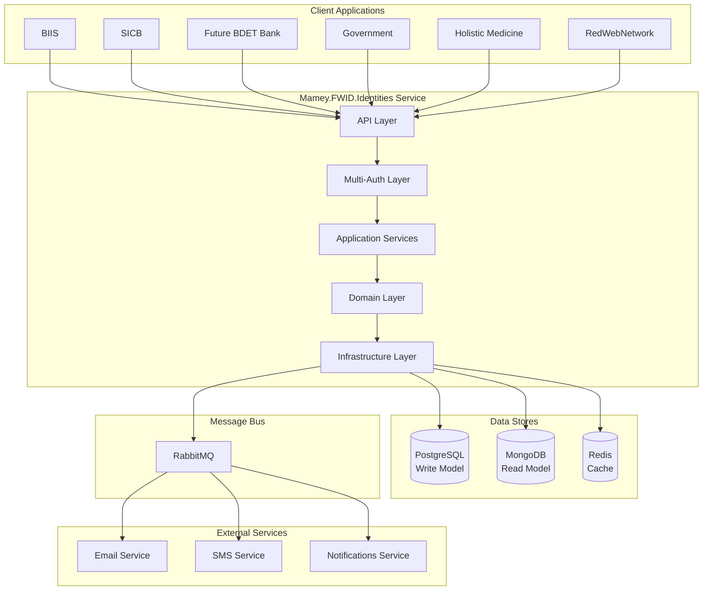

---

## Authentication Flow

### Sign-In Flow

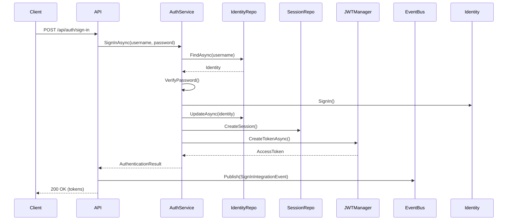

### Token Refresh Flow

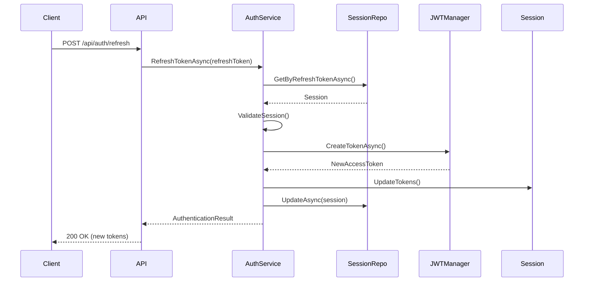

### MFA Setup Flow

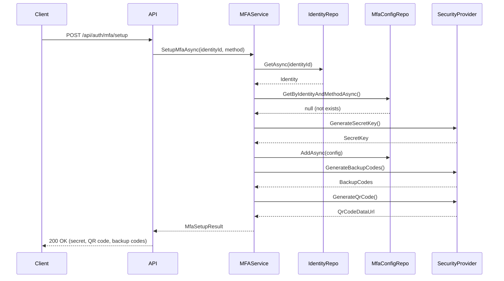

### MFA Verification Flow

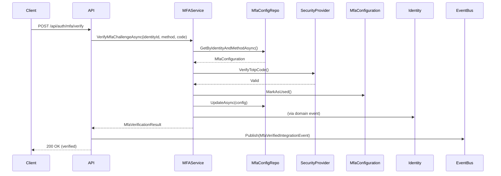

---

## Data Flow

### Write Flow (CQRS)

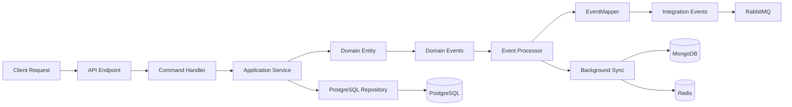

### Read Flow (CQRS)

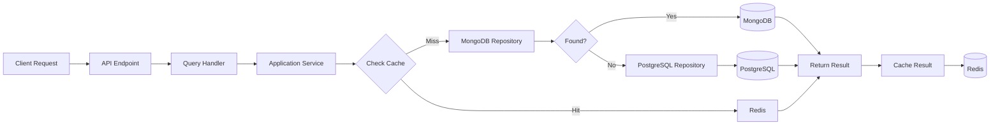

---

## Domain Model

### Identity Aggregate Relationships

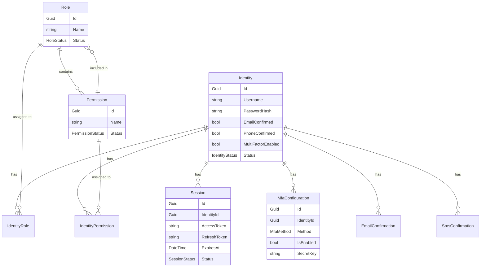

---

## Multi-Authentication Architecture

### Authentication Policy Flow

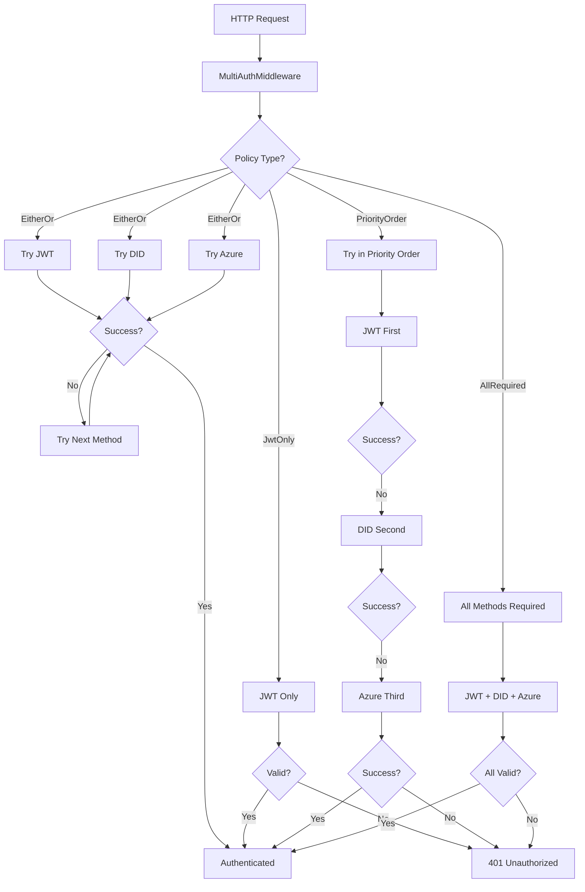

---

## Background Services

### Cleanup Service Flow

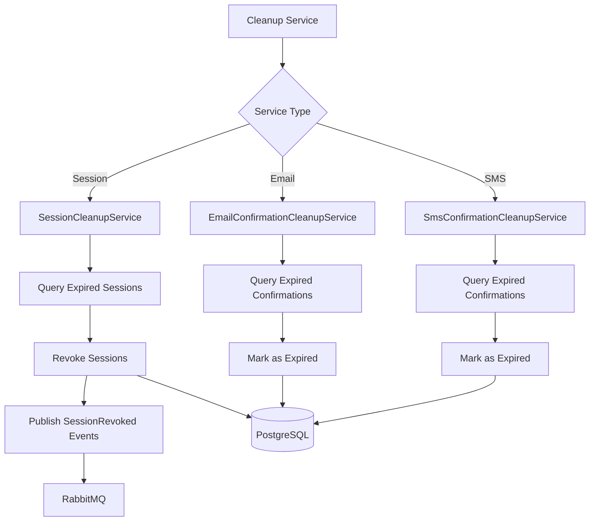

### Sync Service Flow

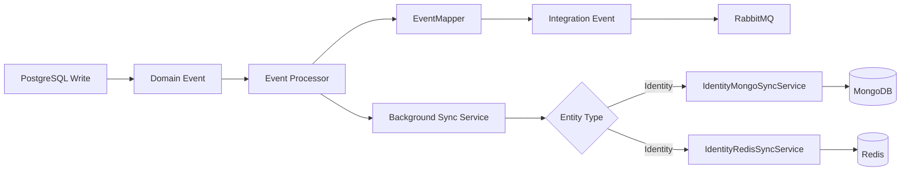

---

## Integration Events Flow

### Event Publishing Flow

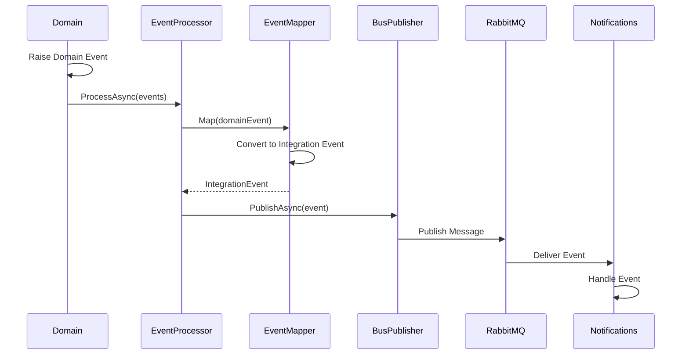

### Event Types

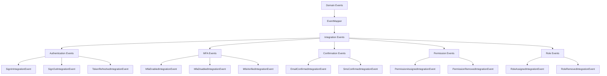

---

## Permission and Role Management

### Permission Assignment Flow

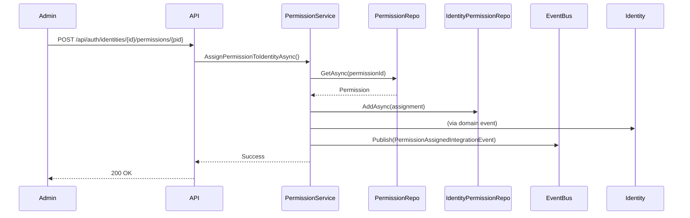

### Role Assignment Flow

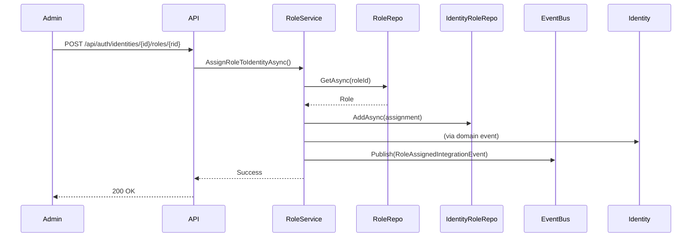

---

## Email/SMS Confirmation Flow

### Email Confirmation Flow

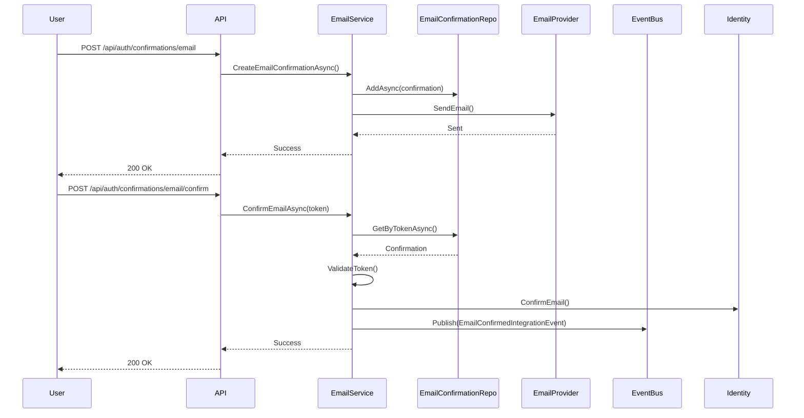

### SMS Confirmation Flow

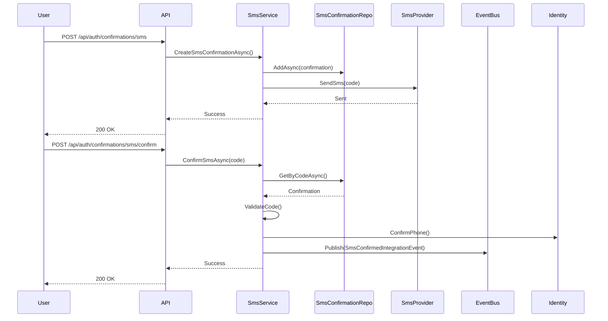

---

## Repository Pattern

### Composite Repository Pattern

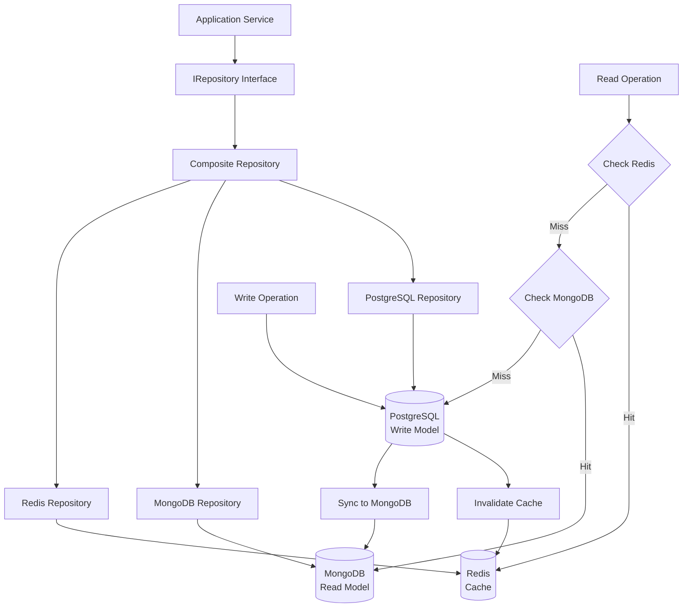

---

## Security Architecture

### Authentication Security Flow

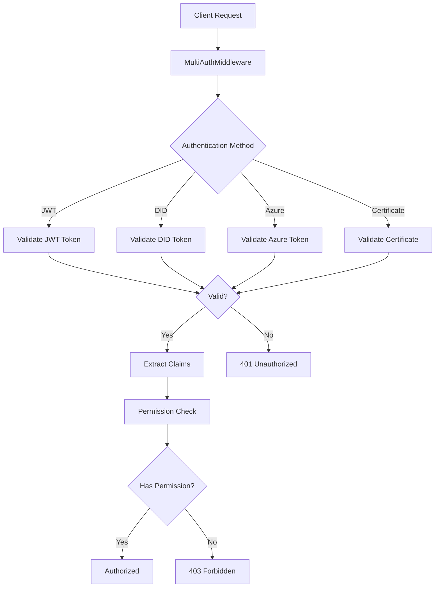

### Account Lockout Flow

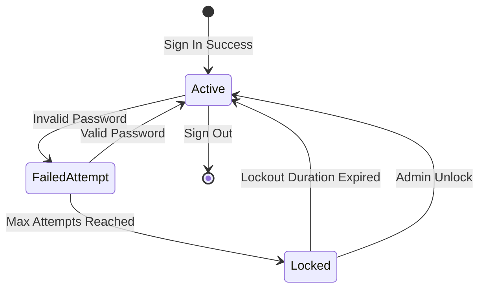

---

## Configuration Architecture

### Configuration Hierarchy

```mermaid
graph TB
    A[appsettings.json] --> B[MultiAuth Options]
    A --> C[JWT Options]
    A --> D[MFA Options]
    A --> E[Email Options]
    A --> F[SMS Options]
    A --> G[Cleanup Options]
    
    B --> H[Authentication Policy]
    B --> I[Enable Flags]
    B --> J[Scheme Names]
    
    C --> K[Token Settings]
    C --> L[Issuer/Audience]
    
    D --> M[MFA Methods]
    D --> N[Challenge Settings]
    
    E --> O[Email Provider]
    E --> P[Template Settings]
    
    F --> Q[SMS Provider]
    F --> R[Code Settings]
    
    G --> S[Cleanup Intervals]
    G --> T[Service Flags]
```

---

## Deployment Architecture

### Container Architecture

```mermaid
graph TB
    subgraph "Kubernetes Cluster"
        subgraph "Pod: identities-service"
            A[Mamey.FWID.Identities]
            B[Health Check]
        end
        
        subgraph "StatefulSet: postgres"
            C[(PostgreSQL)]
        end
        
        subgraph "StatefulSet: mongo"
            D[(MongoDB)]
        end
        
        subgraph "StatefulSet: redis"
            E[(Redis)]
        end
        
        subgraph "Deployment: rabbitmq"
            F[RabbitMQ]
        end
    end
    
    A --> C
    A --> D
    A --> E
    A --> F
    B --> A
```

---

## Testing Architecture

### Test Pyramid

```mermaid
graph TB
    A[End-to-End Tests] --> B[Integration Tests]
    B --> C[Unit Tests]
    
    A --> D[Authentication Flows]
    A --> E[MFA Flows]
    A --> F[Permission Flows]
    
    B --> G[Service Tests]
    B --> H[Repository Tests]
    B --> I[Background Worker Tests]
    
    C --> J[Domain Entity Tests]
    C --> K[Service Tests]
    C --> L[Handler Tests]
    C --> M[Infrastructure Tests]
```

---

## Support

For issues, questions, or contributions, please contact the Mamey Technologies team or refer to the project documentation.

**Copyright**: Mamey Technologies (mamey.io)  
**License**: AGPL-3.0
