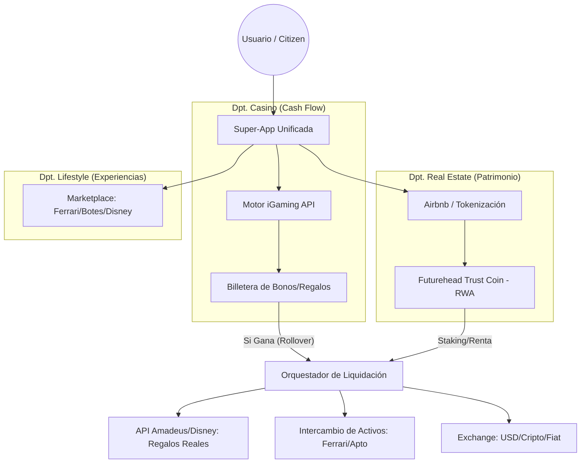

# Ecosistema modular Futurehead — Juntos pero independientes

Arquitectura donde cada departamento opera de forma **independiente** y se conecta mediante un **Hub de integración** y un **Puente (Core)** que traduce puntos/créditos sin mezclar las cajas fuertes. El capital real (Futurehead Trust Coin, FHTC) queda protegido por un **Firewall de valor**. Para unificar todos los departamentos en una sola plataforma sin que el riesgo del casino afecte el valor de los inmuebles (FHTC), se implementa un **Sistema de Orquestación**.

---

## 1. Sistema de Orquestación — Dashboard único (Super-App)

El usuario no salta de web en web. Todo vive en **una sola interfaz** (Next.js + Tailwind CSS, código abierto):

| Zona | Rol |
|------|-----|
| **Bóveda Real Estate (FHTC)** | El dueño ve la plusvalía de su apartamento y sus ganancias en tokens. |
| **Zona de Juego (Casino)** | Conectada vía NuxGame API. Los bonos son créditos "internos" separados del capital inmobiliario. |
| **Concierge de Lujo (Disney / Ferrari)** | Marketplace: el usuario elige gastar ganancias en un Ferrari en Miami o en un viaje a Disney. |

---

## 2. Motor de Unificación (diagrama)

El **Orquestador de Liquidación** (Bridge) es el único punto donde el "dinero de juego" puede convertirse en FHTC o servicios reales, siempre tras validación (p. ej. rollover o staking).

---

### 2.1 Puntos de unión (explicación)

**1. El "Filtro de Riesgo" (Bridge)**  
Para que los bonos de casino no dañen la moneda inmobiliaria:

- **Dinero de juego:** Se queda en el motor del casino (billetera de bonos/regalos).
- **Dinero real:** Solo cuando el usuario **gana** (rollover) o **renta su propiedad**, el Orquestador (con n8n u otra automatización) valida la transacción y permite que el usuario reciba **FHTC** o **servicios reales** (Disney, Ferrari, etc.).

**2. Cómo el dueño del apto gana el "Ferrari Life"**

1. El dueño lista su apartamento en el "Airbnb Crypto".
2. Recibe rentas en **Futurehead Trust Coin**.
3. La plataforma detecta que tiene **50.000 FHTC** en su billetera (Nivel Tycoon).
4. **Unificación:** El sistema le habilita un botón: *"Canjear por 48h de Ferrari en Miami"*.
5. El costo del Ferrari se paga con el **fondo de reserva que genera el casino**, pero el dueño **no gasta su capital**.

**3. Los Paquetes Disney Global**

- **Compra en tiempo real:** La plataforma usa la API de Expedia o Amadeus.
- **Independencia:** Si el usuario tiene puntos de **Lealtad** (ganados por jugar), el sistema los **quema** y compra el ticket de Disney automáticamente. El dinero sale de la **ganancia operativa del casino**, no de los activos inmobiliarios.

---

### 2.2 Componentes de código abierto para lanzar

| Departamento | Herramienta clave | Función |
|--------------|-------------------|---------|
| **Identidad** | Web3Auth | Un solo login para Casino, Airbnb y Viajes. |
| **Moneda** | OpenZeppelin | Crea el Smart Contract del Futurehead Trust Coin. |
| **Reservas** | QloApps | Sistema de reservas de hotel/Airbnb de código abierto. |
| **Exchange** | Uniswap V3 | Para que el "Citizen" cambie sus tokens por $ al instante. |

---

## 3. La arquitectura: Hub + departamentos + puente

| Componente | Rol |
|------------|-----|
| **Hub de integración** | Punto único donde confluyen Casino, Real Estate, Travel, Luxury Exchange. Dashboard unificado para el usuario. |
| **Departamento Casino** | Motor de apuestas (Slots, Live Casino). Bonos = "dinero de juego" (Bonus Balance). No toca la blockchain principal. |
| **Departamento Real Estate (Airbnb/Futurehead)** | Smart contracts (Polygon/BSC) que gestionan propiedad y token FHTC. Tokenización de activos (RWA). |
| **Departamento Travel/Concierge** | Conexión vía API con proveedores (Disney, RentalCars, Expedia). Compra en tiempo real cuando el usuario canjea. |
| **Departamento Luxury Exchange (The Swap)** | Intercambio Ferrari/botes ↔ FHTC; fiat/crypto. |
| **El Puente (Core)** | Traduce puntos de casino a "créditos" que pueden comprar beneficios en otros departamentos **sin mezclar las cajas fuertes**. |

---

## 4. Modelo de intercambio (Luxury Exchange)

| Activo | Departamento | Moneda de cambio |
|--------|--------------|------------------|
| Apto / Casa | Real Estate | Futurehead Trust Coin (FHTC) |
| Bono / Regalo | Casino Bet | Loyalty Points (no afectan al FHTC) |
| Ferrari / Bote | Luxury Rental | FHTC o intercambio directo (Barter) |
| Disney / Viajes | Travel Service | Puntos de Casino + FHTC (opcional) |

---

## 5. El Firewall de seguridad (cómo se unen sin romper)

- **Wallet segregada:** El sistema de apuestas tiene un **límite de salida**. Los bonos viven en base de datos contable, no en el contrato inteligente de Real Estate.
- **Regla de conversión:** El bono de casino es "dinero virtual". Solo cuando el usuario **gana de verdad** (tras cumplir rollover), el sistema del Casino envía una orden al Departamento Real Estate para transferir **FHTC reales** a la wallet del usuario.
- **Oráculo de conversión:** Solo cuando el jugador cumple requisitos (rollover), se permite convertir puntos en FHTC.
- **Cajas independientes:** Cada departamento tiene su propio balance contable. Si el Casino regala muchos bonos, solo afecta al presupuesto de marketing del Casino, **nunca** a la liquidez del token inmobiliario.
- **Reserva de valor:** El token está respaldado por m² de construcción; los bonos de casino están respaldados por el flujo de caja operativo del juego.

---

## 6. Estructura de membresía "Citizen Progress" (por Staking FHTC)

Los niveles se basan en **Staking** (mantener tokens), no solo en juego. Todos progresan hacia la misma vida de lujo.

| Nivel (Tier) | Requisito FHTC | Beneficio inmobiliario | Regalo Casino / Travel |
|--------------|----------------|-------------------------|-------------------------|
| **Explorer** | 1.000 Coins | 5% Descuento Airbnb | Bono de Bienvenida + 10% Rent Car |
| **Investor** | 10.000 Coins | 0% Comisiones en Renta | Habitación Hotel Gratis + Pack Disney |
| **Tycoon** | 50.000 Coins | Acceso a Preventas VIP | Uso de Ferrari/Bote + Vuelos VIP |

---

## 7. Automatización de regalos (sin error humano)

**n8n.io** (flujo de trabajo código abierto) unifica departamentos:

1. **Evento:** Usuario llega al nivel "Tycoon" en el Casino.
2. **Acción:** n8n consulta la API de Amadeus para disponibilidad de autos de lujo en Miami.
3. **Resultado:** El usuario recibe un **QR en la app** para recoger el Ferrari, pagado por las utilidades del casino.

---

## 8. Exchange de producto (Barter) y liquidez

- **Uniswap:** Protocolo para que FHTC tenga **liquidez inmediata** (pool interno).
- **Stripe Crypto / MoonPay:** Si un dueño de casa necesita efectivo (fiat), el sistema cambia sus tokens por dólares.

---

## 9. Códigos abiertos para unificar

- **Ceramic Network:** Identidad descentralizada única: historial del usuario (logros Disney, récord en casino, propiedades) en una sola identidad.
- **OpenZeppelin Governor:** Los "Citizens" **votan** qué nuevas propiedades o Ferraris comprar para la plataforma.

---

## 10. Protección del valor (los regalos no desangran el proyecto)

- **Fondo de Recompensa:** Se alimenta del **2% de cada apuesta en el casino** y del **1% de cada renta en Airbnb**.
- **Independencia total:** Si el Casino tiene un mes de pérdidas, el valor del apartamento (FHTC) **permanece intacto**: legalmente son entidades separadas unidas por software.

---

## 11. Piezas tecnológicas por departamento

### 11.1 Dashboard unificado (Super-App)

- **Next.js + Tailwind CSS:** Interfaz única, código abierto.
- **MedusaJS** (GitHub): Motor de comercio modular. Tiendas independientes bajo una misma cuenta.
- **Web3Auth**: Login con email/Google; por detrás crea billetera crypto para guardar FHTC.

### 11.2 Departamento Casino (operación independiente)

- **NuxGame API**: +4.000 juegos; bonos y free spins en su servidor, no en tu blockchain. Liquida ganancia solo al retiro real.
- **SoftSwiss**: Plataforma robusta para casinos con crypto; módulos de Lealtad (p. ej. tickets Disney al llegar a nivel).
- **Open Loyalty**: Motor de reglas API-first: "Si apuesta $1.000 → cupón Rent-a-Car" vía API externa.
- **Arquitectura headless:** Casino como "proveedor" de datos para la app principal.

### 11.3 Departamento Real Estate (Futurehead Trust Coin)

- **OpenZeppelin / OpenZeppelin Wizard**: Estándar para FHTC y contratos de renta (ERC-20, ERC-721 para propiedades).
- **Propy**: API avanzada para listados reales y cierre de ventas/rentas en blockchain.
- **Origin Protocol**: Código abierto para marketplaces descentralizados (estilo Airbnb) con tokens e intercambio de activos.

### 11.4 Departamento Viajes (Disney & Global Rent-a-Car)

- **Amadeus for Developers**: Car Rental (Hertz, Avis, Budget), hoteles; prueba gratuita para desarrolladores.
- **Duffel**: Vuelos y paquetes de viaje; integración más sencilla.
- **Expedia Partner Solutions (EPS)**: Paquetes Disney (entradas parques, resorts). Puntos de casino → factura Expedia ("puntos por dinero").
- **Sleap.io**: Web3 nativo; +200 criptomonedas para reservar +350.000 hoteles.

Flujo: puntos acumulados en Casino → departamento Viajes usa balance empresa → compra tickets Disney / Rent-a-Car → entrega al usuario como voucher.

### 11.5 Luxury Exchange (Ferrari, botes, fiat/crypto)

- **Origin Protocol**: Mercado donde usuarios "alquilan" Ferrari/bote a cambio de FHTC.
- **Uniswap V3 SDK / Protocol**: Exchange interno: FHTC ↔ USDC/USDT dentro de la app.
- **Fireblocks**: Custodia segura de activos (tokens Real Estate, pagos masivos).
- **Stripe Crypto Onramp**: Usuarios compran tokens con tarjeta para invertir en propiedades.
- **QloApps + BitPay**: Pasarela fiat/crypto para que dueños de apartamentos reciban ganancias en dólares o crypto.

### 11.6 El Puente (automatización)

- **N8N.io**: Tycoon → Amadeus → QR Ferrari; flujos Casino → Regalos/Viajes.

---

## 12. Resumen de enlaces técnicos

| Área | Herramienta | Uso |
|------|-------------|-----|
| Dashboard | [Next.js](https://nextjs.org/) / [Tailwind CSS](https://tailwindcss.com/) | Super-App, interfaz única (código abierto) |
| Dashboard | [MedusaJS](https://github.com/medusajs/medusa) | E-commerce modular, tiendas por departamento |
| Auth/Crypto | [Web3Auth](https://web3auth.io/) | Login social + billetera para FHTC |
| Casino | [NuxGame](https://nuxgame.com/) | API juegos, wallets de bonos |
| Casino | [SoftSwiss](https://softswiss.com/) | Plataforma casino crypto + lealtad |
| Lealtad | [Open Loyalty](https://www.openloyalty.io/) | Reglas, niveles, cupones por API |
| Real Estate | [OpenZeppelin](https://docs.openzeppelin.com/contracts/) | FHTC, ERC-20/721 |
| Real Estate | [Propy](https://propy.com/) | API listados y cierre blockchain |
| Marketplace | [Origin Protocol](https://www.originprotocol.com/) | Marketplace descentralizado |
| Viajes | [Amadeus for Developers](https://developers.amadeus.com/) | Rent-a-Car, hoteles |
| Viajes | [Duffel](https://duffel.com/) | Vuelos y paquetes |
| Viajes | [Expedia Partner Solutions](https://partner.expediagroup.com/) | Paquetes Disney |
| Viajes | [Sleap.io](https://sleap.io/) | Hoteles, pago crypto |
| Exchange | [Uniswap V3](https://github.com/Uniswap/v3-sdk) | Swap FHTC ↔ USDC |
| Custodia | [Fireblocks](https://www.fireblocks.com/) | Custodia institucional |
| Fiat onramp | [Stripe Crypto](https://stripe.com/crypto) / [MoonPay](https://www.moonpay.com/) | Tokens ↔ fiat |
| Identidad | [Ceramic Network](https://ceramic.network/) | Identidad descentralizada única (Disney, casino, propiedades) |
| Gobernanza | [OpenZeppelin Governor](https://docs.openzeppelin.com/contracts/4.x/api/governance) | Votación Citizens: nuevas propiedades, Ferraris |
| Automatización | [N8N](https://n8n.io/) | Tycoon → Amadeus → QR Ferrari; Casino → Regalos |

---

*Documento de arquitectura Futurehead. Sovereign Government of Ierahkwa Ne Kanienke.*
