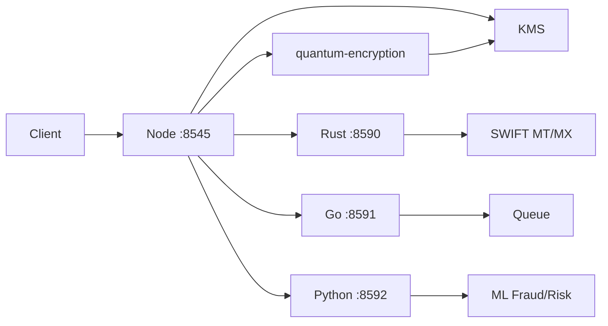

# Multi-Language Ready – IERAHKWA

Node (8545) as orchestrator; Rust (8590), Go (8591), Python (8592) as optional microservices.

## Architecture



## Endpoints

### Node (port 8545)

| Method | Path | Description |
|--------|------|-------------|
| POST | /api/v1/kms/encrypt | KMS encrypt |
| POST | /api/v1/kms/decrypt | KMS decrypt |
| POST | /api/v1/kms/rotate | KMS key rotation |
| GET | /api/v1/quantum/* | Quantum encryption (incl. /capabilities) |
| POST | /api/v1/swift/parse-mt | Proxy to Rust: SWIFT MT |
| POST | /api/v1/swift/parse-mx | Proxy to Rust: SWIFT MX |
| POST | /api/v1/queue/enqueue | Proxy to Go |
| POST | /api/v1/queue/dequeue | Proxy to Go |
| POST | /api/v1/ml/fraud | Proxy to Python |
| POST | /api/v1/ml/risk | Proxy to Python |

### Rust (port 8590)

| Method | Path | Body | Description |
|--------|------|------|-------------|
| GET | /health | - | Health |
| POST | /swift/parse-mt | `{ "raw": "..." }` | SWIFT MT blocks |
| POST | /swift/parse-mx | `{ "xml": "..." }` | ISO 20022 MX |
| POST | /crypto/encrypt | `{ "key", "plaintext", "algo"?"aes" }` | AES or ChaCha |
| POST | /crypto/decrypt | `{ "key", "ciphertext", "nonce", "algo"? }` | Decrypt |

### Go (port 8591)

| Method | Path | Body | Description |
|--------|------|------|-------------|
| GET | /health | - | Health |
| GET | /ready | - | Ready (e.g. k8s) |
| POST | /queue/enqueue | `{ "queue", "payload" }` | Enqueue |
| POST | /queue/dequeue | `{ "queue" }` | Dequeue (204 if empty) |

### Python (port 8592)

| Method | Path | Body | Description |
|--------|------|------|-------------|
| GET | /health | - | Health |
| POST | /ml/fraud | `{ "amount", "currency", "from_country", "to_country", "is_new_counterparty", "hour" }` | Fraud score 0–1, label |
| POST | /ml/risk | `{ "income", "debts", "history_defaults" }` | Credit score 0–100, band |

## Requirements

- **Node** 18+ (required)
- **Rust** (optional): `cargo`, for `services/rust`
- **Go** 1.22+ (optional): for `services/go`
- **Python** 3.11+ (optional): for `services/python`

## Build and run

### Local

**Node only (current):**
```bash
./start.sh
```

**Full multi-language (Node + Rust + Go + Python if built):**
```bash
# Build Rust (optional)
cd services/rust && ./build.sh && cd ../..

# Build Go (optional)
cd services/go && ./build.sh && cd ../..

# Python: run.sh creates .venv and runs (optional)

# Start all
./start-multilang.sh
```

Or use `./start-all-services.sh`, which also starts Platform and, if present, Rust/Go/Python.

### Docker

```bash
docker-compose -f docker-compose.production.yml up -d
```

- `rust-service`, `go-service`, `python-service` are built from `./services/rust`, `./services/go`, `./services/python`.
- `node-app` receives:
  - `RUST_SERVICE_URL=http://rust-service:8590`
  - `GO_SERVICE_URL=http://go-service:8591`
  - `PYTHON_SERVICE_URL=http://python-service:8592`

## Environment variables

| Variable | Used by | Description |
|----------|---------|-------------|
| KMS_MASTER_KEY | Node (KMS) | Master key (dev: derived from env or random) |
| KMS_API_KEY | Node (KMS) | Optional: require `X-API-Key` on /api/v1/kms/* |
| RUST_SERVICE_URL | Node | Default `http://127.0.0.1:8590` |
| GO_SERVICE_URL | Node | Default `http://127.0.0.1:8591` |
| PYTHON_SERVICE_URL | Node | Default `http://127.0.0.1:8592` |
| QUEUE_BACKEND | Go | `redis` to use Redis; else in-memory |
| REDIS_HOST, REDIS_PORT | Go | When `QUEUE_BACKEND=redis` |
| PORT | Python | Default 8592 |

## Proxies and 501

If Rust/Go/Python are down or not deployed, Node proxy routes return **501** with `{ "success": false, "error": "<Service> service unavailable" }`. The rest of the Node API (KMS, quantum, RPC, etc.) works without them.
