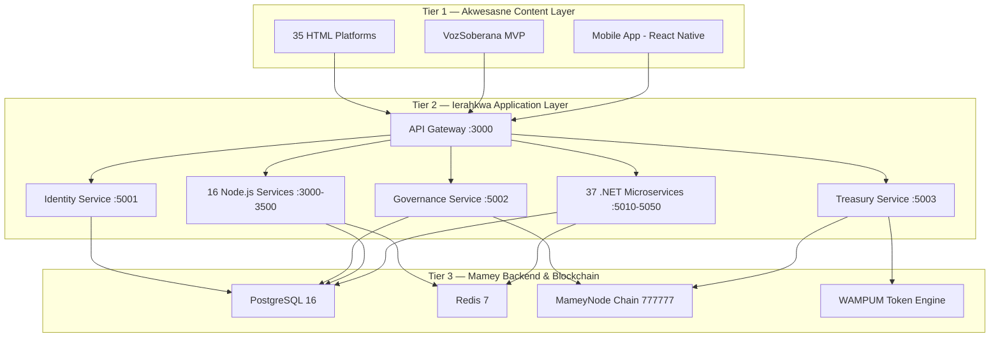
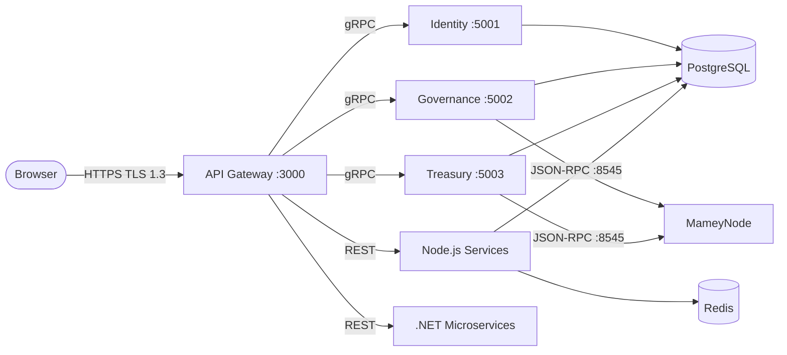

# Ierahkwa Sovereign Platform — Architecture

> **Version:** 1.0.0 | **Updated:** 2026-02-22 | **Maintainer:** Sovereign Government of Ierahkwa Ne Kanienke

---

## System Overview

## Service Communication

## Tech Stack

| Layer | Technologies |
|-------|-------------|
| **Frontend** | HTML5, React 19, Blazor WASM, React Native |
| **Backend** | .NET 10, Node.js 22, Go 1.22, Rust 1.80+ |
| **Blockchain** | MameyNode (Rust), Chain 777777, WAMPUM token |
| **Data** | PostgreSQL 16, Redis 7, IPFS |
| **Infra** | Docker 27, Kubernetes 1.30, Terraform |
| **Security** | ML-DSA-65, ML-KEM-1024, ZKP, TLS 1.3 |

## MameyNode Blockchain

| Parameter | Value |
|-----------|-------|
| Chain ID | 777777 |
| Consensus | Sovereign Proof-of-Authority |
| Block Time | 3 seconds |
| Throughput | 12,847 TPS |
| Native Token | WAMPUM (Ⓦ) |
| Post-Quantum | ML-DSA-65 (FIPS 204) |
| EVM | Shanghai-compatible |

## Port Map

| Port | Service | Stack |
|------|---------|-------|
| 80/443 | Nginx Proxy | Infra |
| 3000 | API Gateway | Node.js |
| 3002 | VozSoberana | Node.js |
| 3030 | POS System | Node.js |
| 3100 | Ierahkwa Shop | Fastify |
| 3200 | Inventory | Node.js |
| 3300 | Image Upload | Node.js |
| 3400 | Forex Trading | Node.js |
| 3500 | Smart School | Node.js |
| 5001 | Identity | .NET 10 |
| 5002 | Governance | .NET 10 |
| 5003 | Treasury | .NET 10 |
| 5010-5050 | 37 Microservices | .NET 10 |
| 5432 | PostgreSQL | DB |
| 6379 | Redis | Cache |
| 8545 | MameyNode RPC | Blockchain |
| 9090 | Prometheus | Monitoring |

---

*Niawenhko:wa — Built with sovereignty in mind.*
