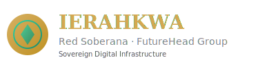
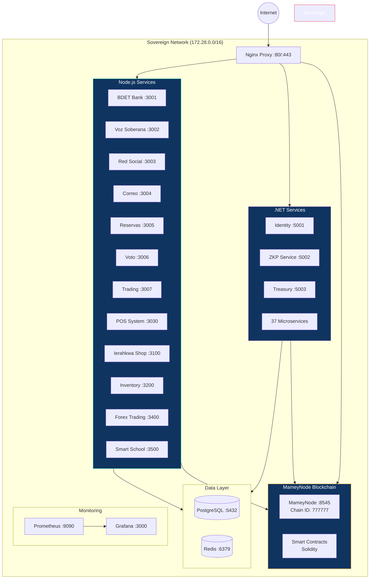

<p align="center">
  
</p>

<h1 align="center">Sovereign Government of Ierahkwa Ne Kanienke</h1>
<h3 align="center">Digital Sovereignty for 72 Million Indigenous People</h3>

<p align="center">
  <a href="https://github.com/rudvincci/ierahkwa-platform/actions"></a>
  <a href="LICENSE"></a>
  <a href="#platforms"></a>
  <a href="#blockchain"></a>
  <a href="#languages"></a>
  <a href="#zero-tax"></a>
  <br>
  <a href="#tech-stack"></a>
  <a href="#tech-stack"></a>
  <a href="#tech-stack"></a>
  <a href="#tech-stack"></a>
  <a href="#tech-stack"></a>
  <a href="#tech-stack"></a>
</p>

<p align="center">
  <strong>51+ sovereign platforms replacing Big Tech for indigenous communities across 19 countries.</strong><br>
  <strong>Zero taxes. Free schools. Free hospitals. Post-quantum encryption.</strong>
</p>

<p align="center">
  <em>51+ plataformas soberanas reemplazando Big Tech para comunidades indigenas en 19 paises.</em><br>
  <em>Cero impuestos. Escuelas gratis. Hospitales gratis. Encriptacion post-cuantica.</em>
</p>

---

## Table of Contents

- [Overview](#overview)
- [Quick Start](#quick-start)
- [Architecture](#architecture)
- [Project Structure](#project-structure)
- [Platforms (310+)](#platforms)
- [Services & Ports](#services--ports)
- [Technology Stack](#tech-stack)
- [Continuous AI](#-continuous-ai--agentic-workflows)
- [Accessibility](#-accessibility--gaad-pledge)
- [Security & Supply Chain](#-security--supply-chain)
- [Zero Tax Model](#zero-tax)
- [Creator Revenue](#creator-revenue)
- [Languages](#languages)
- [Development](#development)
- [Contributing](#contributing)
- [License](#license)

---

## Overview

The **Ierahkwa Ne Kanienke Digital Platform** is a complete sovereign technology ecosystem serving **72 million indigenous people** across **19 countries** in the Americas. It replaces Big Tech dependency with self-governed alternatives — from social media and email to banking, voting, and education.

All services run on **MameyNode**, a post-quantum blockchain with **12,847 TPS** and **Proof-of-Sovereignty** consensus. Citizens pay **zero taxes**; platform transaction fees (5-12%) automatically fund free schools, hospitals, and infrastructure.

### Key Numbers

| Metric | Value |
|--------|-------|
| Indigenous people served | **72M+** across the Americas |
| Countries | **19** |
| Tribal nations | **574** (NCAI recognized) |
| Platforms | **310+** (51 flagship) |
| Languages | **43** (37 indigenous + 6 global) |
| Tax rate | **0%** |
| Blockchain TPS | **12,847** |
| .NET microservices | **37+** |
| Node.js services | **19** |
| Mamey Framework projects | **139** |

---

## Quick Start

```bash
# Clone
git clone https://github.com/rudvincci/ierahkwa-platform.git
cd ierahkwa-platform

# Setup (detects OS, checks prerequisites, generates .env)
chmod +x setup.sh
./setup.sh

# Start everything
make start

# Check status
make status

# Or use Docker directly
docker compose -f docker-compose.sovereign.yml up -d
```

### Prerequisites

| Tool | Required | Purpose |
|------|----------|---------|
| Docker + Compose | Yes | Container orchestration |
| Node.js >= 20 | Yes | Backend services |
| .NET 10 SDK | Optional | .NET microservices |
| Rust (stable) | Optional | MameyForge CLI & SDK |
| Go 1.22+ | Optional | Go microservices & SDKs |
| Git | Yes | Version control |

---

## Architecture



All services bind to `127.0.0.1` only. All traffic encrypted with post-quantum algorithms (ML-DSA-65 + ML-KEM-1024).

---

## Project Structure

```
ierahkwa-platform/
├── 01-documentos/              Legal framework, investors, whitepapers
├── 02-plataformas-html/        51 platform front-end UIs
├── 03-backend/                 19 Node.js services
│   ├── api-gateway/            API Gateway
│   ├── blockchain-api/         MameyNode RPC interface
│   ├── plataforma-principal/   BDET Bank core
│   ├── red-social/             Social network
│   ├── social-media/           Voz Soberana microblogging
│   ├── reservas/               Booking system
│   ├── trading/                Wampum exchange
│   ├── voto-soberano/          Blockchain voting
│   ├── pos-system/             Point of sale
│   ├── ierahkwa-shop/          E-commerce
│   ├── inventory-system/       Inventory management
│   ├── image-upload/           Media service
│   ├── forex-trading-server/   Forex trading
│   ├── smart-school-node/      Education platform
│   ├── mobile-app/             React Native mobile
│   └── server/                 Core server
├── 04-infraestructura/         Docker, K8s, Terraform, Nginx, CI/CD
│   ├── docker/                 Docker Compose configs
│   ├── kubernetes/             K8s manifests
│   ├── nginx/                  Reverse proxy configs
│   ├── terraform/              Infrastructure as Code
│   ├── blockchain/             Smart contracts (Solidity)
│   ├── database/               PostgreSQL schemas
│   ├── config/                 Platform configuration
│   ├── deploy/                 Deployment scripts
│   └── monitoring/             Prometheus + Grafana
├── 05-api/                     OpenAPI specs, gRPC contracts, protos
├── 06-dashboards/              Command center, Maestro dashboard
├── 07-scripts/                 Operational scripts
├── 08-dotnet/                  .NET ecosystem
│   ├── framework/              Mamey Framework (139 projects)
│   ├── government/             Identity, Monolith, Portal, Pupitre, Portals
│   ├── banking/                INKG Bank, NET10
│   ├── microservices/          37 sovereign microservices
│   ├── platform/               Platform libraries
│   └── ui/                     MameyNode.UI (Blazor)
├── 09-assets/                  Logo, branding
├── 10-core/                    Mamey core libraries
├── 11-sdks/                    SDKs (Go, Python, TypeScript)
├── 12-rust/                    MameyForge CLI + gRPC SDK
├── 13-ai/                      MameyFutureAI + code generator
├── 14-blockchain/              Quantum, 210+ tokens, FutureWampum
├── 15-utilities/               Barcode, image processing, templates
├── 16-docs/                    Technical docs + 368 government docs
├── 17-files-originales/        Original project files archive
├── mvp-voz-soberana/           Microblogging MVP
├── pitch/                      Pitch deck, media kit
├── scripts/                    Master launcher + status
├── .github/workflows/          CI/CD (GitHub Actions)
├── docker-compose.sovereign.yml
├── docker-compose.dev.yml
├── docker-compose.infra.yml
├── ARCHITECTURE.md             System architecture diagrams
├── CONTRIBUTING.md             Contribution guidelines
├── SECURITY.md                 Security policy
├── CODE_OF_CONDUCT.md          Community standards
├── LICENSE                     Sovereign License 1.0
├── Makefile                    Build commands
├── setup.sh                    Setup wizard
└── package.json                Monorepo workspaces
```

---

<a name="platforms"></a>
## Platforms (51 Flagship)

| # | Platform | Replaces | Category |
|---|----------|----------|----------|
| 1 | Correo Soberano | Gmail | Communication |
| 2 | Red Soberana | Facebook | Social |
| 3 | Busqueda Soberana | Google Search | Search |
| 4 | Canal Soberano | YouTube | Video |
| 5 | Musica Soberana | Spotify | Music |
| 6 | Hospedaje Soberano | Airbnb | Lodging |
| 7 | Artesania Soberana | Etsy | Artisan Marketplace |
| 8 | Cortos Indigenas | TikTok | Short Video |
| 9 | Comercio Soberano | Shopify | E-commerce |
| 10 | Invertir Soberano | Robinhood | Investments |
| 11 | Docs Soberanos | Google Docs | Documents |
| 12 | Mapa Soberano | Google Maps | Maps (no tracking) |
| 13 | Voz Soberana | Twitter/X | Microblogging |
| 14 | Trabajo Soberano | LinkedIn | Professional Network |
| 15 | Renta Soberano | TaskRabbit | Workforce |
| 16 | BDET Bank | PayPal/Banks | Banking |
| 17 | Sabiduria Soberana | Wikipedia | Encyclopedia |
| 18 | Universidad Soberana | Coursera | Education (FREE) |
| 19 | Noticia Soberana | Google News | News |
| 20 | Cloud Soberana | AWS/GCP | Sovereign Cloud |
| 21 | Code Soberano | GitHub | Code Hosting |
| 22 | Soberano Doctor | Teladoc | Telemedicine (FREE) |
| 23 | Pupitre Soberano | Khan Academy | K-12 Education (FREE) |
| 24 | Soberano Uber | Uber | Rides (95% to drivers) |
| 25 | Soberano Eats | DoorDash | Food Delivery (90%) |
| 26 | Voto Soberano | N/A | Blockchain Voting |
| 27 | Justicia Soberano | N/A | Dispute Resolution |
| 28 | Censo Soberano | N/A | Census System |
| 29 | Soberano ID | N/A | Self-Sovereign Identity |
| 30 | Soberano Servicios | TaskRabbit | 30 Service Categories |
| 31 | Soberano Farm | John Deere | Agriculture AI |
| 32 | Radio Soberana | iHeartRadio | Community Radio |
| 33 | Cooperativa Soberana | N/A | Cooperative Management |
| 34 | Turismo Soberano | TripAdvisor | Cultural Tourism |
| 35 | Soberano Freelance | Fiverr | Gig Marketplace |
| 36 | Soberano POS | Square | Point of Sale |
| 37 | Ofimatica Soberana | LibreOffice | Office Suite |
| 38 | Media Soberana | VLC Media Player | Media Player |
| 39 | Diseño Soberano | GIMP | Design Studio |
| 40 | Navegador Soberano | Mozilla Firefox | Privacy Browser |
| 41 | Llave Soberana | Bitwarden | Password Manager |
| 42 | Transferencia Soberana | FileZilla | File Transfer |
| 43 | Proyecto Soberano | OpenProject | Project Management |
| 44 | Vigilancia Soberana | Wazuh | Security Monitoring (SIEM) |
| 45 | Empresa Soberana | Odoo | ERP System |
| 46 | Conferencia Soberana | Jitsi Meet | Video Conferencing |
| 47 | Robótica Soberana | ROS/NVIDIA Isaac | Sovereign Robotics & Automation |
| 48 | Ecosistema Abierto | GitHub Collections | Sovereign Open Source Ecosystem |

---

## Services & Ports

### Blockchain

| Service | Port | Description |
|---------|------|-------------|
| MameyNode | 8545 | Sovereign blockchain (12,847 TPS, post-quantum) |

### .NET Microservices

| Service | Port | Description |
|---------|------|-------------|
| Identity Service | 5001 | Self-sovereign identity (Face + Sovereign ID) |
| ZKP Service | 5002 | Zero-knowledge proof verification |
| Treasury Service | 5003 | Wampum (WMP) token treasury |
| + 37 microservices | 5010+ | AI Fraud, Biometrics, DeFi, HRM, Voting, etc. |

### Node.js Services

| Service | Port | Description |
|---------|------|-------------|
| BDET Bank | 3001 | Decentralized banking and payments |
| Voz Soberana | 3002 | Microblogging (replaces Twitter/X) |
| Red Social | 3003 | Social network (replaces Facebook) |
| Correo Soberano | 3004 | Post-quantum encrypted email |
| Reservas | 3005 | Booking and reservations |
| Voto Soberano | 3006 | Blockchain-based voting |
| Trading | 3007 | Wampum token exchange |
| POS System | 3030 | Point of sale |
| Ierahkwa Shop | 3100 | E-commerce marketplace |
| Inventory System | 3200 | Inventory management |
| Image Upload | 3300 | Media upload service |
| Forex Trading | 3400 | Forex trading engine |
| Smart School | 3500 | Education platform |
| Conferencia Soberana | 3090 | Video conferencing (replaces Zoom) |
| Vigilancia Soberana | 3091 | Security monitoring (SIEM) |
| Empresa Soberana | 3092 | Enterprise resource planning (ERP) |

### Infrastructure

| Service | Port | Description |
|---------|------|-------------|
| Nginx Proxy | 80/443 | Reverse proxy with SSL/TLS |
| PostgreSQL 16 | 5432 | Primary database |
| Redis 7 | 6379 | Cache and sessions |
| Prometheus | 9090 | Metrics and alerting |
| Grafana | 3000 | Monitoring dashboards |

---

<a name="tech-stack"></a>
## Technology Stack

| Layer | Technology | Details |
|-------|-----------|---------|
| **Blockchain** | MameyNode v4.2 | 12,847 TPS, Proof-of-Sovereignty, Chain ID 777777 |
| **Token** | Wampum (WMP) | 720M max supply, 0.1% burn, governance + gas |
| **Stablecoin** | SICBDC | Central bank digital currency |
| **Backend** | .NET 10 | 139 framework projects + 37 microservices |
| **Backend** | Node.js 22 | 19 sovereign services |
| **Backend** | Rust | MameyForge CLI + gRPC blockchain SDK |
| **Backend** | Go | Microservices + API SDKs |
| **AI** | Python | MameyFutureAI (42 engines), fraud detection |
| **Frontend** | HTML/CSS/JS | 310+ responsive platforms |
| **Frontend** | Blazor | MameyNode.UI + Pupitre education |
| **Database** | PostgreSQL 16 | Primary relational data |
| **Cache** | Redis 7 | Sessions, rate limiting, pub/sub |
| **Encryption** | ML-DSA-65 + ML-KEM-1024 | Post-quantum (NIST standardized) |
| **Identity** | FWID + DID/SSI | Decentralized self-sovereign identity |
| **Translation** | Atabey Neural MT | 37 indigenous + 6 global languages |
| **Infrastructure** | Docker + K8s | Sovereign container orchestration |
| **IaC** | Terraform | Infrastructure as code |
| **Proxy** | Nginx | SSL termination + reverse proxy |
| **Monitoring** | Prometheus + Grafana | Metrics, alerts, dashboards |
| **CI/CD** | GitHub Actions | Multi-stack build validation |

### 🤖 Continuous AI — Agentic Workflows

9 GitHub Agentic Workflows automate repository maintenance:

| Workflow | Trigger | Purpose |
|----------|---------|---------|
| Continuous Triage | New issues | Auto-classify, label, welcome |
| Continuous Docs | Daily | Documentation drift detection |
| Continuous Testing | Weekly | Test coverage gap analysis |
| Continuous Security | Daily + push | OWASP compliance monitoring |
| Continuous Quality | PRs | Architectural quality review |
| Continuous Reporting | Weekly | Platform health reports |
| Continuous Translation | Push (i18n) | Translation drift detection |
| Continuous Performance | PRs + weekly | Performance regression detection |
| Continuous Supply Chain | Daily + push | Shai-Hulud defense, dependency audit |

### ♿ Accessibility — GAAD Pledge

- WCAG 2.2 AA compliance across all platforms
- Shared accessibility middleware (`03-backend/shared/accessibility.js`)
- Automated a11y audit tool scanning 51 platforms (12 WCAG checks)
- E2E accessibility testing with Playwright
- Accessibility CI workflow on every PR touching HTML
- See [ACCESSIBILITY.md](ACCESSIBILITY.md) for full details

### 🔒 Security & Supply Chain

- Post-quantum encryption: ML-DSA-65 + ML-KEM-1024 (NIST standardized)
- Supply chain security: Shai-Hulud defense, SBOM generation, lifecycle script auditing
- Dependabot monitoring: npm, NuGet, Cargo, Docker, GitHub Actions
- See [SECURITY.md](SECURITY.md) for full security policy

---

<a name="zero-tax"></a>
## Zero Tax Model

Citizens pay **zero taxes**. Platform fees (5-12%) auto-allocate to public services:

| Service | Allocation | Impact |
|---------|------------|--------|
| Education | 25% | Free preschool through university |
| Healthcare | 25% | Free doctors, medicines, hospitals |
| Infrastructure | 20% | Internet, water, electricity, roads |
| Technology | 15% | MameyNode, AI, platform development |
| Security | 10% | Emergency services |
| Reserve | 5% | Emergency fund |

---

## Creator Revenue

| Platform | Creator Gets | Big Tech Gives |
|----------|-------------|----------------|
| Video (Canal Soberano) | **92%** | YouTube: 55% |
| Music (Musica Soberana) | **90%** | Spotify: 30% |
| Artisan (Artesania) | **88%** | Etsy: 80% |
| Rides (Soberano Uber) | **95%** | Uber: 70% |
| Food (Soberano Eats) | **90%** | DoorDash: 70% |
| Services | **92%** | TaskRabbit: 70% |
| Freelance | **92%** | Fiverr: 80% |

---

<a name="languages"></a>
## Languages

**Indigenous (37):** Quechua, Nahuatl, Guarani, Aymara, Mapudungun, Maya Yucateco, Zapotec, Garifuna, Taino, Navajo, Cherokee, Lakota, Ojibwe, Cree, K'iche', Kaqchikel, Q'eqchi', Miskito, Wayuunaiki, Shipibo, Tikuna, Embera, Kuna, Mixteco, Tzotzil, Totonaco, P'urhepecha, Raramuri, Bribri, Ngabere, Ashaninka, Wichi, Qom, Yanomami, Shuar, Inuktitut, Mohawk

**Global (6):** Spanish, English, Portuguese, French, Dutch, Haitian Creole

---

## Development

```bash
# Setup environment
./setup.sh

# Common commands
make start          # Start all services
make stop           # Stop all services
make status         # Health check all services
make build-all      # Build everything (.NET, Rust, Docker)
make test           # Run all tests
make clean          # Remove build artifacts
make help           # Show all available commands

# Docker commands
docker compose -f docker-compose.sovereign.yml up -d      # Production
docker compose -f docker-compose.dev.yml up -d             # Development
docker compose -f docker-compose.infra.yml up -d           # Infrastructure only

# View logs
docker logs -f bdet-bank
docker logs -f identity-service

# Rebuild specific service
docker compose -f docker-compose.sovereign.yml build trading
docker compose -f docker-compose.sovereign.yml up -d trading
```

---

## Contributing

We welcome contributions from all indigenous communities and allies. See [CONTRIBUTING.md](CONTRIBUTING.md) for detailed guidelines.

1. Fork the repository
2. Create a feature branch: `git checkout -b feature/mi-mejora`
3. Follow code conventions (see CONTRIBUTING.md)
4. Submit a pull request

---

## License

**[Sovereign License 1.0](LICENSE)**

Free for all indigenous communities and sovereign nations. Commercial use by non-indigenous entities requires written authorization from the Sovereign Government of Ierahkwa Ne Kanienke.

---

## Contact

- **Organization:** Sovereign Government of Ierahkwa Ne Kanienke / FutureHead Group
- **GitHub:** [@rudvincci](https://github.com/rudvincci)
- **Blockchain:** MameyNode v4.2 (Chain ID 777777)
- **Token:** Wampum (WMP)

---

<p align="center">
  <strong>Built for sovereignty. Built for 72 million indigenous people across the Americas.</strong><br>
  <em>Construido para la soberania. Construido para 72 millones de personas indigenas en las Americas.</em><br><br>
  <em>Skennen'kowa — The Great Peace</em><br>
  <em>Niawenhko:wa — We are grateful</em>
</p>
