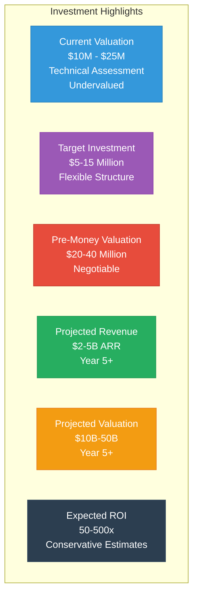
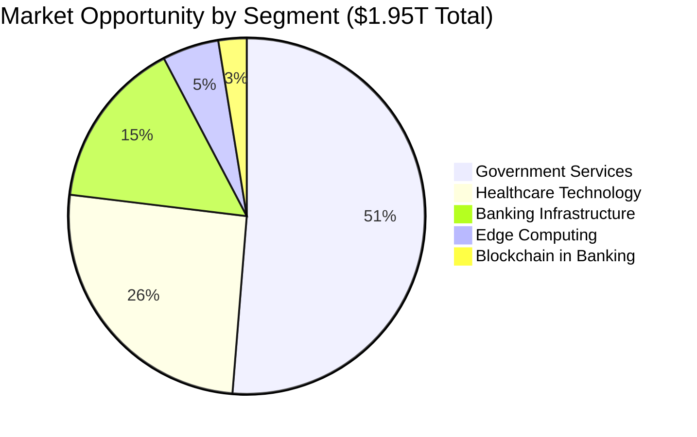

# Mamey Technologies - Investor Quick Start Guide

**Version**: 1.0  
**Date**: 2024-12-21  
**Organization**: Mamey Technologies (mamey.io)  
**Purpose**: Quick reference for using investor-sharing documents

---

## Welcome

This Quick Start Guide helps you navigate the complete Mamey Technologies investor documentation suite. All documents are designed to help you evaluate the investment opportunity in the Mamey Ecosystem.

**📘 MameyNode Information**: Business and conceptual information from MameyNode documentation has been integrated throughout these documents, providing comprehensive details about the blockchain infrastructure, Block Lattice architecture, Master Trust Accounts, and built-in compliance features.

---

## Document Suite Overview

### Core Investment Documents (Start Here)

1. **[Investment One-Pager](01-Investment-One-Pager.md)** - 1-2 page investment overview
2. **[Executive Investment Deck](02-Executive-Investment-Deck.md)** - 15-20 slide presentation
3. **[Investment Memorandum](03-Investment-Memorandum.md)** - Comprehensive investment document
4. **[Financial Projections](04-Financial-Projections.md)** - Detailed financial analysis

### Analysis Documents

5. **[Market Opportunity Analysis](05-Market-Opportunity-Analysis.md)** - TAM/SAM/SOM analysis
6. **[Technology Due Diligence](06-Technology-Due-Diligence.md)** - Technical foundation
7. **[Competitive Analysis](07-Competitive-Analysis.md)** - Competitive position and moat
8. **[Risk Assessment](08-Risk-Assessment.md)** - Comprehensive risk analysis

### Planning Documents

9. **[Use of Funds](09-Use-of-Funds.md)** - Investment allocation plan
10. **[Exit Strategy](10-Exit-Strategy.md)** - Exit scenarios and valuations
11. **[Valuation Analysis](11-Valuation-Analysis.md)** - Valuation methodologies

### Supporting Documents

12. **[Due Diligence Checklist](12-Due-Diligence-Checklist.md)** - Due diligence guide
13. **[Investor FAQ](13-Investor-FAQ.md)** - Common investor questions
14. **[Glossary](14-Glossary.md)** - Terminology reference
15. **[Master Document](15-Master-Document-Investors.md)** - Complete single document

---

## Quick Navigation by Investor Type

### For Venture Capital

**Start Here**:
1. [Investment One-Pager](01-Investment-One-Pager.md) - Quick overview
2. [Executive Investment Deck](02-Executive-Investment-Deck.md) - Full presentation
3. [Investment Memorandum](03-Investment-Memorandum.md) - Comprehensive review

**Deep Dive**:
4. [Financial Projections](04-Financial-Projections.md) - Financial analysis
5. [Technology Due Diligence](06-Technology-Due-Diligence.md) - Technical evaluation
6. [Market Opportunity Analysis](05-Market-Opportunity-Analysis.md) - Market validation

**Reference**:
7. [Due Diligence Checklist](12-Due-Diligence-Checklist.md) - Due diligence guide
8. [Investor FAQ](13-Investor-FAQ.md) - Common questions

---

### For Strategic Investors

**Start Here**:
1. [Investment One-Pager](01-Investment-One-Pager.md) - Quick overview
2. [Executive Investment Deck](02-Executive-Investment-Deck.md) - Full presentation
3. [Competitive Analysis](07-Competitive-Analysis.md) - Market positioning

**Deep Dive**:
4. [Market Opportunity Analysis](05-Market-Opportunity-Analysis.md) - Market analysis
5. [Technology Due Diligence](06-Technology-Due-Diligence.md) - Technical foundation
6. [Investment Memorandum](03-Investment-Memorandum.md) - Comprehensive review

**Reference**:
7. [Exit Strategy](10-Exit-Strategy.md) - Exit scenarios
8. [Investor FAQ](13-Investor-FAQ.md) - Common questions

---

### For Private Equity

**Start Here**:
1. [Investment Memorandum](03-Investment-Memorandum.md) - Comprehensive review
2. [Financial Projections](04-Financial-Projections.md) - Financial analysis
3. [Valuation Analysis](11-Valuation-Analysis.md) - Valuation methodologies

**Deep Dive**:
4. [Risk Assessment](08-Risk-Assessment.md) - Risk analysis
5. [Exit Strategy](10-Exit-Strategy.md) - Exit planning
6. [Use of Funds](09-Use-of-Funds.md) - Investment allocation

**Reference**:
7. [Due Diligence Checklist](12-Due-Diligence-Checklist.md) - Due diligence guide
8. [Master Document](15-Master-Document-Investors.md) - Complete reference

---

## Key Investment Highlights at a Glance

### Investment Opportunity

**Key Investment Metrics**:
- **Current Valuation**: $10M - $25M (technical assessment, significantly undervalued)
- **Target Investment**: $5-15 million (flexible structure)
- **Pre-Money Valuation**: $20-40 million (negotiable based on investment amount)
- **Projected Revenue**: $2-5B ARR by Year 5+ (conservative estimates)
- **Projected Valuation**: $10B-50B by Year 5+ (5-10x revenue multiple)
- **Expected ROI**: 50-500x (depending on investment amount and scenario)

### Market Opportunity

- **Total Addressable Market (TAM)**: $1.95 trillion annually
- **Serviceable Addressable Market (SAM)**: $5+ billion annually
- **Serviceable Obtainable Market (SOM)**: $2-5B ARR by Year 5+
- **Target Markets**: 195+ central banks, 25,000+ commercial banks, governments worldwide

### Technology Foundation

- **Development Investment**: $17M+ across all platforms
- **Code Statistics**: 750,000+ lines of production code
- **Performance**: 24,356+ TPS (measured), 10.3x faster than Visa
- **Status**: Production-ready (100% blockchain, 75-85% core platforms)

### Financial Projections

| Year | ARR | Customers | Gross Margin | Operating Margin |
|------|-----|-----------|--------------|------------------|
| Year 1-2 | $50-200M | 30-200 | 75-85% | 10-20% |
| Year 3-5 | $500M-2B | 200-1000 | 75-85% | 20-50% |
| Year 5+ | $2-5B | 1000-2000 | 75-85% | 30-50% |

### Competitive Advantages

1. ✅ **Complete Ecosystem** - Only platform with complete financial infrastructure
2. ✅ **Proprietary Technology** - Own the core libraries (110+ libraries)
3. ✅ **Production Ready** - 100% complete, not prototypes
4. ✅ **Exceptional Performance** - Industry-leading metrics
5. ✅ **High Margins** - 75-85% gross margins
6. ✅ **Massive Market** - $1.95T TAM
7. ✅ **Unique Position** - No direct competitor

---

## Document Formats

### Available Formats

- **Markdown (.md)**: Source format, editable
- **PDF**: For sharing and printing (convert from markdown)
- **PowerPoint**: For Executive Deck (convert from markdown)
- **Excel**: For Financial Projections (convert from markdown)

### Conversion Tools

- **Markdown to PDF**: Pandoc, Marked, or online converters
- **Markdown to PowerPoint**: Pandoc or manual conversion
- **Financial Models**: Excel or Google Sheets

---

## Distribution Guidelines

### Confidentiality

- **Investment One-Pager**: NDA-required
- **Executive Investment Deck**: NDA-required, serious investors only
- **Investment Memorandum**: Highly confidential, serious investors only
- **Financial Projections**: Highly confidential, due diligence only
- **All Documents**: Confidential, authorized investors only

### Sharing Channels

- **Email**: Attach PDFs (password-protected recommended)
- **Secure Portal**: Use secure data rooms for due diligence
- **Presentations**: Use PowerPoint or PDF
- **Financial Models**: Use Excel or secure sharing

See [Due Diligence Checklist](12-Due-Diligence-Checklist.md) for complete guidelines.

---

## Customization Options

### Investor-Specific

- Add investor-specific metrics
- Customize financial projections
- Adjust valuation scenarios
- Include investor-specific use cases

### Regional Customization

- Add local market data
- Include regional financial projections
- Adjust for local regulations
- Include regional exit scenarios

### Vertical-Specific

- Highlight relevant platforms
- Emphasize industry-specific metrics
- Include vertical financial projections
- Add industry-specific exit scenarios

---

## Support and Resources

### Documentation

- **Main README**: [README.md](README.md) - Complete index
- **API Documentation**: docs.mamey.io/api
- **SDK Documentation**: docs.mamey.io/sdk
- **Integration Guides**: docs.mamey.io/integration

### Contact

- **Investment**: investment@mamey.io
- **Financial**: finance@mamey.io
- **Technical**: tech@mamey.io
- **Due Diligence**: dd@mamey.io
- **General**: info@mamey.io

### Website

- **Main Site**: mamey.io
- **Documentation**: docs.mamey.io
- **Status**: status.mamey.io

---

## Next Steps

### For First-Time Investors

1. **Read**: [Investment One-Pager](01-Investment-One-Pager.md) for quick overview
2. **Review**: [Executive Investment Deck](02-Executive-Investment-Deck.md) for full picture
3. **Explore**: [Investment Memorandum](03-Investment-Memorandum.md) for comprehensive review
4. **Contact**: Reach out with questions or to schedule a meeting

### For Due Diligence

1. **Review**: [Due Diligence Checklist](12-Due-Diligence-Checklist.md)
2. **Analyze**: [Financial Projections](04-Financial-Projections.md) and [Technology Due Diligence](06-Technology-Due-Diligence.md)
3. **Evaluate**: [Risk Assessment](08-Risk-Assessment.md) and [Competitive Analysis](07-Competitive-Analysis.md)
4. **Plan**: [Exit Strategy](10-Exit-Strategy.md) and [Valuation Analysis](11-Valuation-Analysis.md)

### For Investment Decision

1. **Review**: [Investment Memorandum](03-Investment-Memorandum.md) and [Master Document](15-Master-Document-Investors.md)
2. **Analyze**: [Financial Projections](04-Financial-Projections.md) and [Market Opportunity](05-Market-Opportunity-Analysis.md)
3. **Evaluate**: [Risk Assessment](08-Risk-Assessment.md) and [Competitive Analysis](07-Competitive-Analysis.md)
4. **Discuss**: Contact investment@mamey.io to discuss terms

---

## Document Statistics

- **Total Documents**: 15 comprehensive investor documents
- **Total Content**: ~300+ pages
- **Mermaid Diagrams**: 40+ visual diagrams (all optimized for portrait US letter pages)
- **MameyNode Integration**: Business and conceptual information integrated throughout
- **Financial Models**: Multiple scenario analyses
- **Valuation Models**: Multiple methodologies
- **Risk Assessments**: Comprehensive risk analysis

---

## Version Information

- **Current Version**: 1.0
- **Last Updated**: 2024-12-21
- **Next Review**: Quarterly

---

## Feedback

We welcome feedback on these documents. Please contact:
- **Documentation**: docs@mamey.io
- **Investment**: investment@mamey.io
- **Suggestions**: feedback@mamey.io

---

**Mamey Technologies** - Building better financial infrastructure for the sovereign era

*This Quick Start Guide provides an overview. For detailed information, see the individual documents.*

