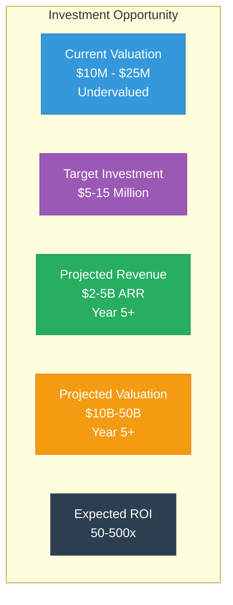
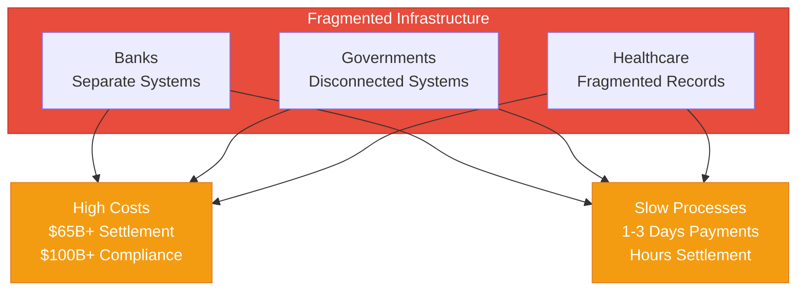
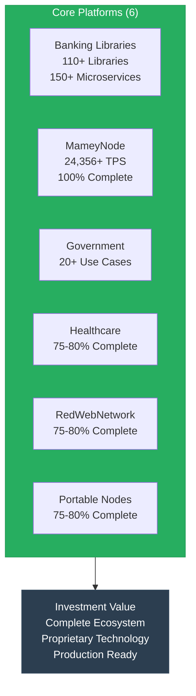
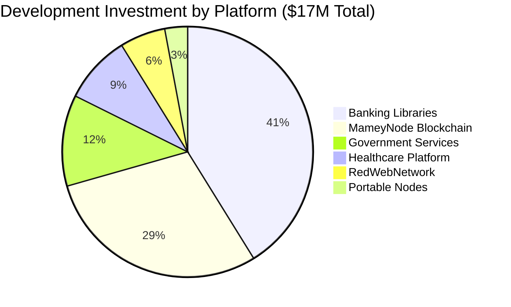
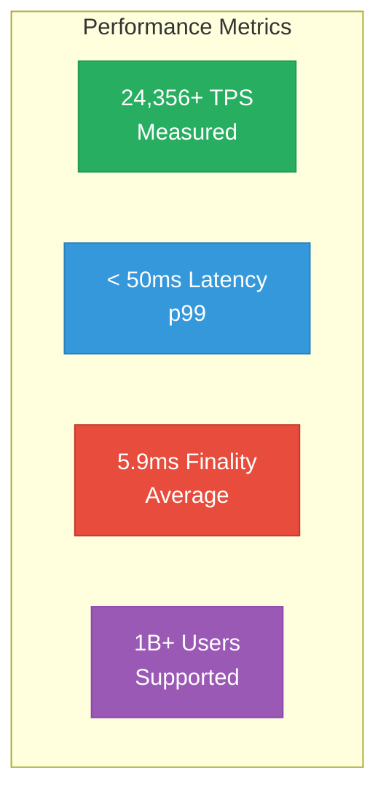
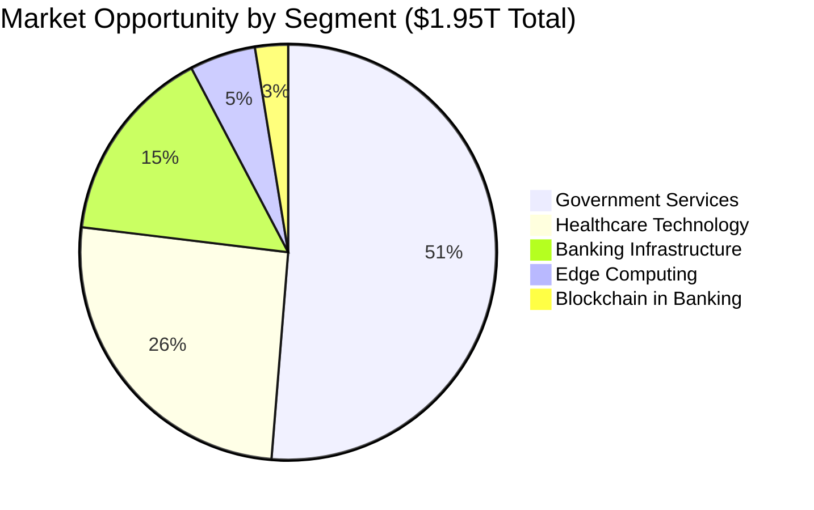
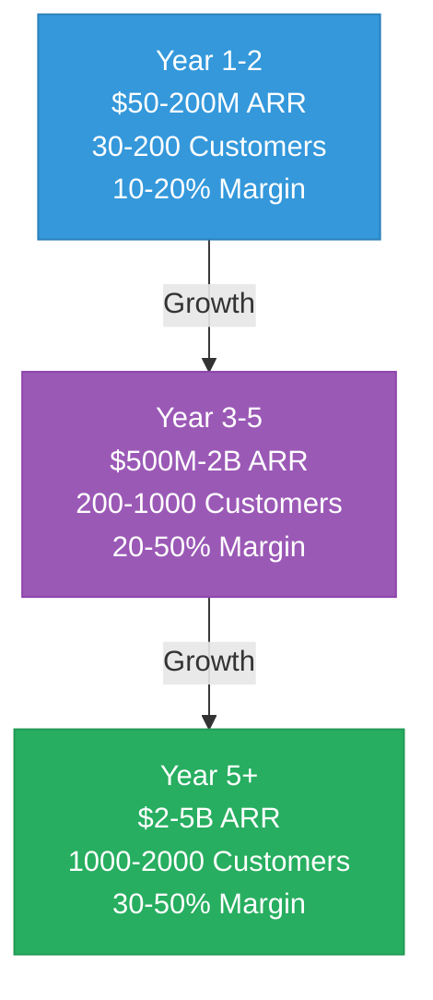
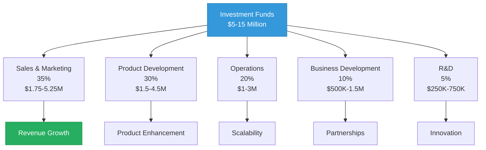
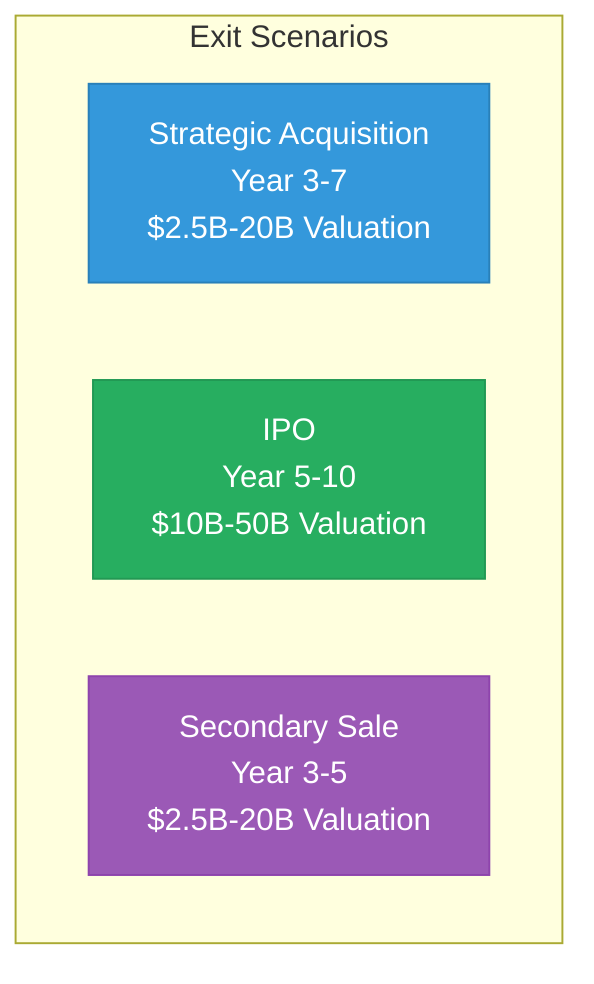

# Mamey Technologies - Executive Investment Deck

**Version**: 1.0  
**Date**: 2024-12-21  
**Organization**: Mamey Technologies (mamey.io)  
**Format**: Presentation (15-20 slides)  
**For**: Investor Meetings, Pitch Presentations, Investment Committees  
**Classification**: Confidential

---

## Slide 1: Title Slide

# Investment Opportunity

**Mamey Technologies - Complete Sovereign Financial Infrastructure Platform**

*Production-Ready. Proven. Transformative.*

**Investment Highlights**:
- Current Valuation: $10M - $25M (undervalued)
- Target Investment: $5-15 million
- Projected Revenue: $2-5B ARR by Year 5+
- Projected Valuation: $10B-50B by Year 5+
- Expected ROI: 50-500x

---

## Slide 2: Investment Opportunity

### Unique Investment Opportunity

**Why Invest Now**:
- Production-ready technology (not prototypes)
- Proven performance (24,356+ TPS, 10.3x faster than Visa)
- Massive market ($1.95T TAM)
- Unique position (no direct competitor)
- Experienced team (750,000+ lines of code)

---

## Slide 3: The Problem

### Current Financial Infrastructure is Fragmented

**The Cost**: $65B+ in settlement costs, $100B+ in compliance costs annually

**Investment Opportunity**: Transform fragmented infrastructure into unified ecosystem

---

## Slide 4: The Solution

### Complete Ecosystem (6 Core + 2 Future Platforms)

**What Makes This Unique**: No competitor offers complete ecosystem + proprietary technology + production readiness

---

## Slide 5: What We've Built

### $17M+ Development Investment

**Code Statistics**:
- **750,000+ lines** of production code
- **110+ proprietary libraries**
- **150+ microservices**
- **35+ blockchain modules** (500+ functions)
- **200+ use cases**

**Status**: Production-ready (100% blockchain, 75-85% core platforms)

---

## Slide 6: Performance Metrics

### Industry-Leading Performance

**Competitive Performance**:
- **10.3x faster than Visa** for blockchain operations
- **1000x faster** than traditional cross-border payments (1-3 days → 5.9ms)
- **Industry-leading** performance across all metrics

---

## Slide 7: Market Opportunity

### $1.95T Total Addressable Market

| Market Segment | Annual Market Size | Target Share | Revenue Potential (Year 5) |
|----------------|-------------------|--------------|---------------------------|
| Banking Infrastructure | $300B | 0.5-1% | $1.5-3B |
| Blockchain in Banking | $50B (2030) | 1-2% | $500M-1B |
| Government Services | $1T | 0.1-0.5% | $1-5B |
| Healthcare Technology | $500B | 0.1-0.3% | $500M-1.5B |
| Edge Computing | $100B | 0.2-0.5% | $200M-500M |
| **Total** | **$1.95T** | **0.2-0.5%** | **$3.7-11B** |

---

## Slide 8: Financial Projections

### Revenue Growth Trajectory

**Unit Economics**:
- **LTV/CAC Ratio**: 10:1 to 50:1 (industry-leading)
- **Payback Period**: 3-6 months (fast payback)
- **Gross Margin**: 75-85% (high-margin business)
- **Operating Margin**: 20-50% (Year 2+)

---

## Slide 9: Revenue Model

### 5 High-Margin Revenue Streams

1. **Dual Licensing** (80-90% margin): $200-800M/year (Year 3-5)
2. **Banking-as-a-Service** (60-70% margin): $300-1.5B/year (Year 3-5)
3. **Network Fees** (70-80% margin): $200-1B/year (Year 3-5)
4. **Implementation Services** (50-60% margin): $100-500M/year (Year 3-5)
5. **Platform Licensing** (75-85% margin): $50-200M/year (Year 3-5)

**Total Projected Revenue**: $2-5 billion ARR by Year 5+

---

## Slide 10: Competitive Advantages

### Unique Competitive Position

1. ✅ **Complete Ecosystem** - Only platform with complete financial infrastructure
2. ✅ **Proprietary Technology** - Own the core libraries (110+ libraries)
3. ✅ **Production Ready** - 100% complete, not prototypes
4. ✅ **Exceptional Performance** - 10.3x faster than Visa
5. ✅ **Lower Cost** - 10-50x more affordable than competitors
6. ✅ **No Vendor Lock-in** - Open-source core with commercial licensing
7. ✅ **Data Sovereignty** - Complete control over data and infrastructure

**No Direct Competitor** with same comprehensive offering.

---

## Slide 11: Use of Funds

### Investment Allocation ($5-15 Million)

**Key Milestones**:
- Year 1-2: $50-200M ARR, 30-200 customers
- Year 3-5: $500M-2B ARR, 200-1000 customers
- Year 5+: $2-5B ARR, 1000-2000 customers

---

## Slide 12: Risk Assessment

### Key Risks (All Well-Mitigated)

1. **Market Adoption** - Strong value proposition, proven performance
2. **Regulatory** - Built-in compliance, regulatory expertise
3. **Competition** - Unique position, proprietary technology
4. **Technology** - Modern stack, modular architecture
5. **Execution** - Experienced team, proven track record

**Risk Mitigation**: All risks are manageable and well-mitigated through strong technical foundation, comprehensive compliance, proven performance, and experienced team.

---

## Slide 13: Exit Strategy

### Multiple Exit Paths

**Valuation Projections**:
- **Year 3-5**: $2.5B-20B (based on $500M-2B ARR, 5-10x multiple)
- **Year 5+**: $10B-50B (based on $2-5B ARR, 5-10x multiple)

**Expected ROI**: 50-500x (depending on investment amount and scenario)

---

## Slide 14: Investment Terms

### Proposed Terms

- **Investment Amount**: $5-15 million (flexible)
- **Pre-Money Valuation**: $20-40 million (negotiable)
- **Post-Money Valuation**: $25-55 million
- **Structure**: Preferred equity (standard terms)
- **Board Seat**: Available for significant investments ($10M+)

**Investor Rights**:
- Information rights
- Pro-rata rights
- Liquidation preferences
- Anti-dilution protection

---

## Slide 15: Why Invest Now

### The Time is Right

✅ **Production-Ready Technology** - Not prototypes, 100% complete (MameyNode)  
✅ **Proven Performance** - 24,356+ TPS, 10.3x faster than Visa  
✅ **Massive Market** - $1.95T TAM, clear path to $2-5B ARR  
✅ **Unique Position** - No direct competitor  
✅ **Experienced Team** - Proven track record, 750,000+ lines of code  
✅ **High Margins** - 75-85% gross margins, 20-50% operating margins  
✅ **Multiple Exits** - Strategic acquisition, IPO, secondary sale options

**The financial infrastructure market is at an inflection point. We've built the solution. It's production-ready. It's proven. It's comprehensive.**

---

## Slide 16: Next Steps

### Investment Process

1. **Review** - Investment Memorandum and supporting documents
2. **Demo** - Technical demonstration of platforms
3. **Due Diligence** - Comprehensive due diligence process
4. **Terms** - Investment terms negotiation
5. **Closing** - Investment closing and funding

**Timeline**: 8-16 weeks from initial interest to closing

---

## Slide 17: Contact

### Investment Inquiries

**Mamey Technologies**  
Email: investment@mamey.io  
Website: mamey.io

**Next Steps**:
1. Review [Investment Memorandum](03-Investment-Memorandum.md)
2. Schedule technical demo
3. Begin due diligence process
4. Discuss investment terms

---

## Slide 18: Appendix

### Additional Resources

- **Investment Memorandum**: Complete investment document
- **Financial Projections**: Detailed financial analysis
- **Market Opportunity**: Comprehensive market analysis
- **Technology Due Diligence**: Technical foundation
- **Competitive Analysis**: Competitive position
- **Risk Assessment**: Comprehensive risk analysis
- **Exit Strategy**: Exit scenarios and valuations

**All documents available in investor-sharing directory**

---

**Mamey Technologies** - Building better financial infrastructure for the sovereign era

*This presentation contains proprietary and confidential information. Distribution is restricted to authorized investors only.*

