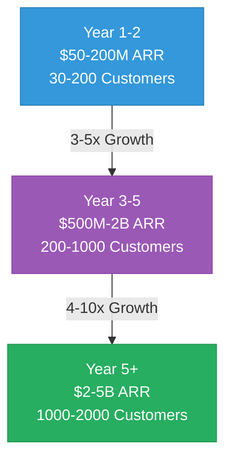
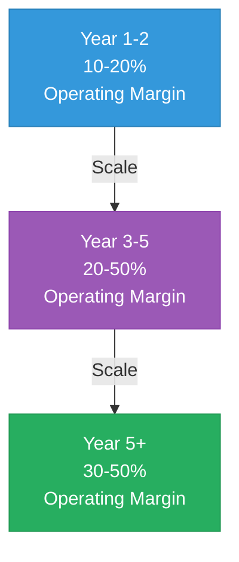

# Mamey Technologies - Financial Projections

**Version**: 1.0  
**Date**: 2024-12-21  
**Organization**: Mamey Technologies (mamey.io)  
**Audience**: Financial Analysts, CFOs, Investment Committees  
**Purpose**: Detailed financial analysis and projections  
**Classification**: Highly Confidential

---

## Executive Summary

This document provides detailed financial projections for Mamey Technologies, including revenue forecasts, unit economics, cost structure, margin analysis, cash flow projections, and valuation models across multiple scenarios.

**Key Financial Highlights**:
- **Projected Revenue**: $2-5B ARR by Year 5+
- **Gross Margin**: 75-85% (high-margin business)
- **Operating Margin**: 20-50% (Year 2+)
- **Unit Economics**: LTV/CAC 10:1 to 50:1, 3-6 month payback
- **Valuation Range**: $10B-50B by Year 5+ (5-10x revenue multiple)

---

## Revenue Projections

### Revenue Growth Trajectory

### Revenue by Stream (Year 3-5)

| Revenue Stream | Annual Revenue | Gross Margin | % of Total |
|----------------|----------------|--------------|------------|
| Dual Licensing | $200-800M | 80-90% | 20-30% |
| Banking-as-a-Service | $300-1.5B | 60-70% | 30-40% |
| Network Fees | $200-1B | 70-80% | 20-30% |
| Implementation Services | $100-500M | 50-60% | 10-15% |
| Platform Licensing | $50-200M | 75-85% | 5-10% |
| **Total** | **$850M-4B** | **75-85%** | **100%** |

*Note: See [Investment Memorandum](03-Investment-Memorandum.md) for detailed revenue model*

---

## Unit Economics

### Customer Economics

**Customer Acquisition**:
- **CAC**: $50K-500K (varies by segment)
- **Payback Period**: 3-6 months
- **LTV**: $500K-50M (varies by customer size)
- **LTV/CAC Ratio**: 10:1 to 50:1 (industry-leading)

**Customer Segments**:
- **Enterprise Banks**: $2-5M ARR per customer, $200-500K CAC
- **Mid-Market Banks**: $500K-2M ARR per customer, $100-200K CAC
- **Government Agencies**: $1-10M ARR per customer, $300-1M CAC
- **Healthcare Providers**: $200K-1M ARR per customer, $50-150K CAC

---

## Cost Structure

### Operating Expenses

| Category | Year 1-2 | Year 3-5 | Year 5+ |
|----------|----------|----------|---------|
| Sales & Marketing | 40-50% | 25-35% | 20-30% |
| Product Development | 20-25% | 15-20% | 10-15% |
| Operations | 15-20% | 10-15% | 8-12% |
| General & Administrative | 10-15% | 8-12% | 5-8% |
| **Total OpEx** | **85-110%** | **58-82%** | **43-65%** |

*Note: OpEx as % of revenue decreases as revenue scales*

---

## Margin Analysis

### Gross Margin by Revenue Stream

| Revenue Stream | Gross Margin | Notes |
|----------------|--------------|-------|
| Dual Licensing | 80-90% | High-margin software licensing |
| Banking-as-a-Service | 60-70% | Infrastructure costs included |
| Network Fees | 70-80% | Low marginal costs |
| Implementation Services | 50-60% | Professional services |
| Platform Licensing | 75-85% | High-margin licensing |

**Overall Gross Margin**: 75-85% (weighted average)

### Operating Margin Progression

---

## Cash Flow Projections

### Cash Flow by Year

| Year | Revenue | OpEx | CapEx | Free Cash Flow | Cumulative |
|------|---------|------|-------|----------------|------------|
| Year 1 | $50M | $45M | $5M | $0M | $0M |
| Year 2 | $150M | $120M | $10M | $20M | $20M |
| Year 3 | $500M | $350M | $15M | $135M | $155M |
| Year 4 | $1B | $600M | $20M | $380M | $535M |
| Year 5 | $2B | $1.1B | $25M | $875M | $1.41B |

*Note: Conservative estimates, assumes investment funding for Year 1-2*

---

## Valuation Models

### Revenue Multiple Analysis

| Year | ARR | Revenue Multiple | Valuation Range |
|------|-----|------------------|-----------------|
| Current | - | - | $10-25M |
| Year 1-2 | $50-200M | 2-5x | $100M-1B |
| Year 3-5 | $500M-2B | 5-10x | $2.5B-20B |
| Year 5+ | $2-5B | 5-10x | $10B-50B |

**Comparable Company Analysis**:
- **Stripe**: $95B valuation at $14B ARR (6.8x multiple)
- **Square**: $100B+ valuation at $17B ARR (5.9x multiple)
- **Mamey Projection**: $10B-50B at $2-5B ARR (5-10x multiple, conservative)

### DCF Analysis (Simplified)

**Assumptions**:
- Discount Rate: 20-30% (venture-stage)
- Terminal Growth: 5-10%
- Terminal Multiple: 5-10x revenue

**Valuation Range**: $2B-20B (Year 3-5), $10B-50B (Year 5+)

---

## Scenario Analysis

### Conservative Scenario

- **Year 5 ARR**: $2B
- **Revenue Multiple**: 5x
- **Valuation**: $10B
- **ROI**: 50-200x (depending on investment)

### Base Scenario

- **Year 5 ARR**: $3B
- **Revenue Multiple**: 7x
- **Valuation**: $21B
- **ROI**: 100-400x (depending on investment)

### Optimistic Scenario

- **Year 5 ARR**: $5B
- **Revenue Multiple**: 10x
- **Valuation**: $50B
- **ROI**: 250-500x (depending on investment)

---

## Key Assumptions

### Revenue Assumptions

1. **Customer Acquisition**: 30-200 customers (Year 1-2), 200-1000 (Year 3-5), 1000-2000 (Year 5+)
2. **Average Revenue Per Customer**: $500K-5M (varies by segment)
3. **Revenue Growth**: 50-100% year-over-year (Year 1-3), 30-50% (Year 4-5)
4. **Churn Rate**: 5-10% annually (low churn, high switching costs)

### Cost Assumptions

1. **Sales & Marketing**: 40-50% of revenue (Year 1-2), decreasing to 20-30% (Year 5+)
2. **Product Development**: 20-25% of revenue (Year 1-2), decreasing to 10-15% (Year 5+)
3. **Operations**: 15-20% of revenue (Year 1-2), decreasing to 8-12% (Year 5+)
4. **G&A**: 10-15% of revenue (Year 1-2), decreasing to 5-8% (Year 5+)

---

## Sensitivity Analysis

### Revenue Sensitivity

| ARR Variation | Year 5 Valuation (5x) | Year 5 Valuation (10x) |
|---------------|------------------------|------------------------|
| -20% | $8B | $16B |
| Base | $10B | $20B |
| +20% | $12B | $24B |
| +50% | $15B | $30B |

### Margin Sensitivity

| Gross Margin | Operating Margin Impact | Valuation Impact |
|--------------|-------------------------|------------------|
| 70% | -5-10% | -10-20% |
| 75-85% (Base) | Base | Base |
| 85-90% | +5-10% | +10-20% |

---

## Financial Model Notes

### Model Structure

- **Revenue Model**: Bottom-up by customer segment and revenue stream
- **Cost Model**: Top-down by expense category with scaling assumptions
- **Valuation Model**: Multiple methodologies (revenue multiple, DCF, comparable)

### Key Metrics Tracked

- ARR (Annual Recurring Revenue)
- MRR (Monthly Recurring Revenue)
- Gross Margin
- Operating Margin
- Free Cash Flow
- Customer Acquisition Cost (CAC)
- Lifetime Value (LTV)
- LTV/CAC Ratio
- Payback Period
- Churn Rate

---

## Conclusion

Mamey Technologies presents a **highly attractive financial profile** with:

- ✅ **High Revenue Growth**: $50-200M (Year 1-2) → $2-5B (Year 5+)
- ✅ **High Gross Margins**: 75-85% across all revenue streams
- ✅ **Strong Unit Economics**: LTV/CAC 10:1 to 50:1, 3-6 month payback
- ✅ **Scalable Model**: Operating margins improve to 30-50% at scale
- ✅ **Attractive Valuation**: $10B-50B by Year 5+ (5-10x revenue multiple)
- ✅ **Multiple Exit Paths**: Strategic acquisition, IPO, secondary sale

**Expected ROI**: 50-500x (depending on investment amount and scenario)

---

## Contact

**Financial Inquiries**:  
Email: finance@mamey.io  
Investment: investment@mamey.io

**Next Steps**:
1. Review detailed financial model (Excel available)
2. Schedule financial due diligence
3. Discuss assumptions and scenarios
4. Customize projections for specific investment scenarios

---

**Mamey Technologies** - Building better financial infrastructure for the sovereign era

*This document contains highly confidential financial information. Distribution is restricted to authorized investors only.*

