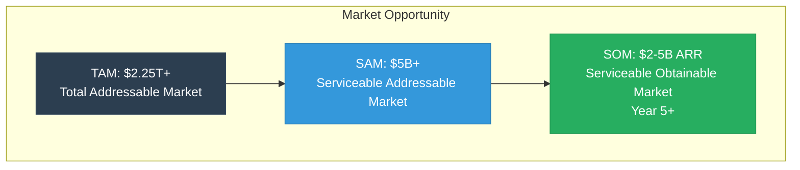
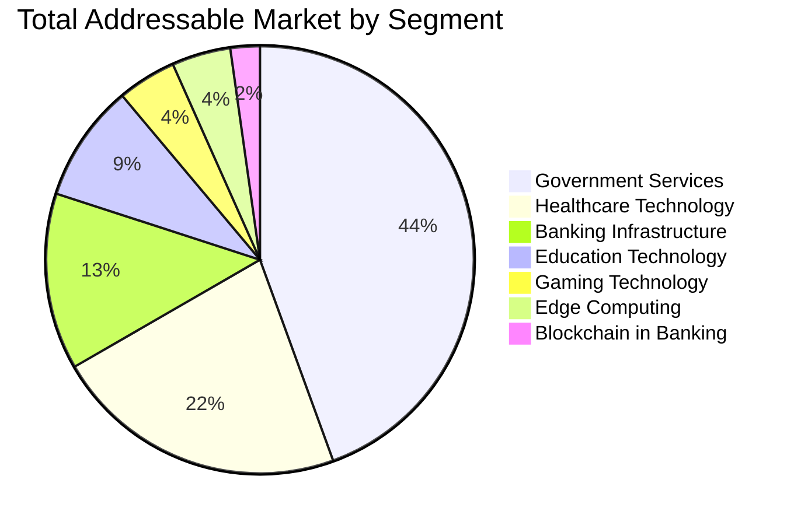
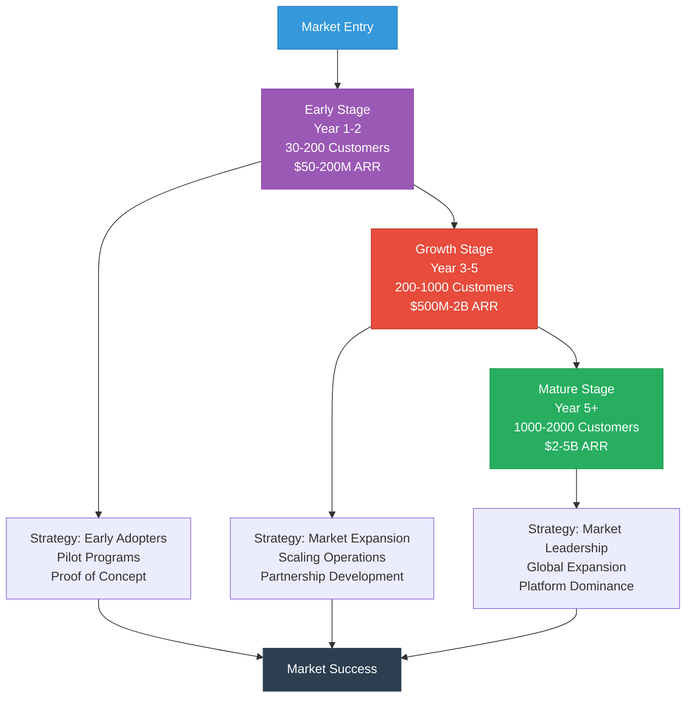

# Mamey Technologies - Market Opportunity Analysis

**Version**: 1.0  
**Date**: 2024-12-21  
**Organization**: Mamey Technologies (mamey.io)  
**Audience**: Investors, Strategic Partners, Decision Makers  
**Purpose**: Comprehensive market opportunity analysis

---

## Executive Summary

The Mamey Technologies ecosystem addresses a **$2.25+ trillion Total Addressable Market (TAM)** across banking infrastructure, blockchain in banking, government services, healthcare technology, edge computing, education technology, and gaming. With a clear path to capturing 0.2-0.5% of TAM, representing $3.7-11 billion in revenue potential by Year 5, Mamey Technologies is positioned to become a market leader in sovereign financial infrastructure.

**Market Opportunity Highlights**:
- **TAM**: $2.25+ trillion annually
- **SAM**: $9.7B+ billion annually
- **SOM**: $2-5B ARR by Year 5+
- **Growth Rate**: 50-70% CAGR in key markets
- **Market Position**: First-mover advantage in unified ecosystem

---

## Market Segmentation

### Segment 1: Banking Infrastructure

**Market Size**: $300+ billion annually

**Market Drivers**:
- Digital transformation in banking
- Legacy system replacement
- Cost reduction pressures
- Regulatory compliance requirements
- Customer experience expectations

**Target Customers**:
- **Central Banks**: 195+ central banks globally
- **Commercial Banks**: 25,000+ banks worldwide
- **Credit Unions**: 5,000+ credit unions
- **Fintech Companies**: 10,000+ fintech companies

**Market Trends**:
- Migration to cloud-native architectures
- Microservices adoption
- API-first banking
- Real-time processing
- Open banking initiatives

**Our Addressable Market**:
- **Target Share**: 0.5-1% of market
- **Revenue Potential**: $1.5-3 billion (Year 5)
- **Customer Target**: 500-1000 banks by Year 5

---

### Segment 2: Blockchain in Banking

**Market Size**: $50+ billion by 2030

**Market Drivers**:
- CBDC initiatives (195+ central banks)
- Cross-border payment modernization
- Trade finance digitization
- Settlement system upgrades
- Regulatory technology (RegTech)

**Target Customers**:
- **Central Banks**: CBDC infrastructure
- **Commercial Banks**: Payment and settlement systems
- **Payment Processors**: Payment infrastructure
- **Trade Finance**: Trade finance platforms

**Market Trends**:
- CBDC adoption accelerating
- Real-time payment systems
- Blockchain-based settlement
- Tokenization of assets
- DeFi integration

**Our Addressable Market**:
- **Target Share**: 1-2% of market
- **Revenue Potential**: $500M-1 billion (Year 5)
- **Customer Target**: 50+ central banks, 500+ commercial banks

---

### Segment 3: Government Services

**Market Size**: $1 trillion+ annually

**Market Drivers**:
- Digital government transformation
- Citizen service modernization
- Identity management initiatives
- Voting system modernization
- Transparency and accountability

**Target Customers**:
- **National Governments**: 195+ countries
- **State/Provincial Governments**: Thousands of sub-national governments
- **Local Governments**: Tens of thousands of local governments
- **Government Agencies**: Thousands of agencies

**Market Trends**:
- Digital identity adoption
- E-voting initiatives
- Digital service delivery
- Open government data
- Citizen engagement platforms

**Our Addressable Market**:
- **Target Share**: 0.1-0.5% of market
- **Revenue Potential**: $1-5 billion (Year 5)
- **Customer Target**: 50+ government agencies by Year 5

---

### Segment 4: Healthcare Technology

**Market Size**: $500+ billion annually

**Market Drivers**:
- Telemedicine adoption
- Electronic health records (EHR)
- Patient data interoperability
- Healthcare cost reduction
- Regulatory compliance (HIPAA, GDPR)

**Target Customers**:
- **Hospitals**: 6,000+ hospitals in US alone
- **Clinics**: 100,000+ clinics globally
- **Health Systems**: 1,000+ health systems
- **Wellness Providers**: Thousands of wellness providers

**Market Trends**:
- Telemedicine growth
- Interoperability initiatives
- Patient data portability
- AI in healthcare
- Preventive care focus

**Our Addressable Market**:
- **Target Share**: 0.1-0.3% of market
- **Revenue Potential**: $500M-1.5 billion (Year 5)
- **Customer Target**: 100+ healthcare providers by Year 5

---

### Segment 5: Edge Computing

**Market Size**: $100+ billion annually

**Market Drivers**:
- Edge computing adoption
- IoT growth
- Low-latency requirements
- Offline capabilities
- Remote area connectivity

**Target Customers**:
- **Enterprises**: Edge computing deployments
- **Telecommunications**: Edge network providers
- **IoT Companies**: IoT platform providers
- **Remote Areas**: Offline-capable solutions

**Market Trends**:
- Edge computing growth
- 5G deployment
- IoT expansion
- Offline-first applications
- Satellite connectivity

**Our Addressable Market**:
- **Target Share**: 0.2-0.5% of market
- **Revenue Potential**: $200M-500 million (Year 5)
- **Customer Target**: 50+ edge deployments by Year 5

---

### Segment 6: Education Technology

**Market Size**: $200+ billion annually

**Market Drivers**:
- Digital transformation in education
- AI-first teaching adoption
- Sovereign education initiatives
- Inclusive education requirements
- Verifiable credentials demand

**Target Customers**:
- **Educational Institutions**: Schools, universities, training centers
- **Sovereign Nations**: Indigenous education systems
- **Government Education Agencies**: National and regional education departments
- **Alternative Learning Providers**: Online education, vocational training

**Market Trends**:
- AI in education (10-15% CAGR)
- Personalized learning
- Verifiable credentials adoption
- Inclusive education focus
- Sovereign education initiatives

**Our Addressable Market**:
- **Target Share**: 0.1-0.3% of market
- **Revenue Potential**: $200M-600 million (Year 5)
- **Customer Target**: 100+ educational institutions by Year 5

**Platform**: Pupitre (~65% complete, microservices created)

---

### Segment 7: Gaming Technology

**Market Size**: $100+ billion annually

**Market Drivers**:
- Online gaming growth
- Blockchain gaming adoption
- Provably fair gaming demand
- AI in gaming operations
- Responsible gaming requirements

**Target Customers**:
- **Online Casinos**: Gaming operators
- **Physical Casinos**: Casino operators
- **Gaming Platforms**: Online gaming platforms
- **Regulated Gaming**: Government-regulated gaming operations

**Market Trends**:
- Blockchain gaming (8-12% CAGR)
- AI-powered operations
- Provably fair gaming
- Responsible gaming focus
- Hybrid online/physical operations

**Our Addressable Market**:
- **Target Share**: 0.2-0.5% of market
- **Revenue Potential**: $200M-500 million (Year 5)
- **Customer Target**: 50+ gaming operators by Year 5

**Platform**: Casino/MameyCasino (~65% complete, microservices created)

---

### Segment 5: Edge Computing (continued)

**Market Drivers**:
- Edge computing adoption
- IoT growth
- Low-latency requirements
- Offline capabilities
- Remote area connectivity

**Target Customers**:
- **Enterprises**: Edge computing deployments
- **Telecommunications**: Edge network providers
- **IoT Companies**: IoT platform providers
- **Remote Areas**: Offline-capable solutions

**Market Trends**:
- Edge computing growth
- 5G deployment
- IoT expansion
- Offline-first applications
- Satellite connectivity

**Our Addressable Market**:
- **Target Share**: 0.2-0.5% of market
- **Revenue Potential**: $200M-500 million (Year 5)
- **Customer Target**: 50+ edge deployments by Year 5

---

## Total Addressable Market (TAM)

### Combined TAM Analysis

**Total TAM**: $2.25+ trillion annually

| Market Segment | Annual Market Size | Growth Rate | 5-Year Projection |
|----------------|-------------------|-------------|-------------------|
| Banking Infrastructure | $300B | 5-7% CAGR | $400B+ |
| Blockchain in Banking | $50B (2030) | 20-30% CAGR | $100B+ |
| Government Services | $1T | 8-10% CAGR | $1.5T+ |
| Healthcare Technology | $500B | 10-12% CAGR | $800B+ |
| Education Technology | $200B | 10-15% CAGR | $300B+ |
| Gaming Technology | $100B | 8-12% CAGR | $150B+ |
| Edge Computing | $100B | 15-20% CAGR | $200B+ |
| **Total** | **$2.25T+** | **8-12% CAGR** | **$3.5T+** |

**Market Growth**: Strong growth across all segments, with blockchain and edge computing showing highest growth rates.

---

## Serviceable Addressable Market (SAM)

### SAM Definition

**SAM**: The portion of TAM that we can realistically serve with our current and planned capabilities.

**SAM Calculation**: $5+ billion annually

**SAM Components**:
- **Banking Infrastructure**: $1.5B (0.5% of $300B)
- **Blockchain in Banking**: $500M (1% of $50B)
- **Government Services**: $5B (0.5% of $1T)
- **Healthcare Technology**: $1.5B (0.3% of $500B)
- **Education Technology**: $400M (0.2% of $200B)
- **Gaming Technology**: $300M (0.3% of $100B)
- **Edge Computing**: $500M (0.5% of $100B)
- **Total SAM**: $9.7B+ annually

**SAM Characteristics**:
- Customers with budget and authority
- Regulatory compatibility
- Technical feasibility
- Geographic accessibility
- Partnership potential

---

## Serviceable Obtainable Market (SOM)

### SOM Projection

**SOM**: The portion of SAM we can realistically capture.

**Year 1-2**: $50-200M ARR
- **Market Share**: 0.01-0.1% of SAM
- **Customers**: 30-200
- **Focus**: Early adopters, pilot programs

**Year 3-5**: $500M-2B ARR
- **Market Share**: 0.1-1% of SAM
- **Customers**: 200-1000
- **Focus**: Market expansion, scaling

**Year 5+**: $2-5B ARR
- **Market Share**: 1-5% of SAM
- **Customers**: 1000-2000
- **Focus**: Market leadership, global expansion

---

## Market Entry Strategy

---

## Market Trends & Drivers

### Trend 1: Digital Transformation

**Impact**: High
- Organizations modernizing infrastructure
- Legacy system replacement
- Cloud adoption
- API-first architectures

**Opportunity**: $500B+ market opportunity

---

### Trend 2: Regulatory Compliance

**Impact**: High
- Increasing regulatory requirements
- Compliance automation
- Real-time monitoring
- Automated reporting

**Opportunity**: $200B+ market opportunity

---

### Trend 3: Real-Time Processing

**Impact**: High
- Real-time payments
- Instant settlement
- Real-time analytics
- Real-time compliance

**Opportunity**: $300B+ market opportunity

---

### Trend 4: Data Sovereignty

**Impact**: Medium-High
- Data localization requirements
- Privacy regulations
- Sovereign infrastructure
- On-premise deployment

**Opportunity**: $100B+ market opportunity

---

### Trend 5: Blockchain Adoption

**Impact**: High
- CBDC initiatives
- Blockchain-based systems
- Tokenization
- DeFi integration

**Opportunity**: $50B+ market opportunity (growing to $100B+)

---

## Competitive Landscape

### Market Position

**Current Position**: Emerging leader in unified financial infrastructure

**Competitive Advantages**:
1. Complete ecosystem (only platform with complete infrastructure)
2. Proprietary technology (110+ libraries)
3. Production-ready (100% complete)
4. Exceptional performance (10.3x faster than Visa)
5. Lower cost (10-50x more affordable)

**Market Share Target**:
- **Year 1-2**: 0.01-0.1% of SAM
- **Year 3-5**: 0.1-1% of SAM
- **Year 5+**: 1-5% of SAM

---

## Geographic Opportunities

### Primary Markets

**North America**:
- Market Size: $500B+
- Regulatory: Favorable
- Adoption: High
- Opportunity: $1-2B ARR potential

**Europe**:
- Market Size: $400B+
- Regulatory: GDPR, strong compliance
- Adoption: High
- Opportunity: $1-2B ARR potential

**Asia Pacific**:
- Market Size: $600B+
- Regulatory: Varies by country
- Adoption: Growing
- Opportunity: $1-2B ARR potential

**Latin America**:
- Market Size: $200B+
- Regulatory: Developing
- Adoption: Growing
- Opportunity: $500M-1B ARR potential

**Middle East & Africa**:
- Market Size: $250B+
- Regulatory: Varies by country
- Adoption: Growing
- Opportunity: $500M-1B ARR potential

---

## Market Entry Strategy

### Phase 1: Early Adopters (Year 1-2)

**Target**: Early adopters, innovators
- Central banks exploring CBDC
- Banks modernizing infrastructure
- Government agencies digitizing services
- Healthcare providers adopting telemedicine

**Strategy**: Pilot programs, proof of concept, reference customers

---

### Phase 2: Market Expansion (Year 3-5)

**Target**: Early majority
- Commercial banks
- Government agencies
- Healthcare systems
- Payment processors

**Strategy**: Market expansion, partnerships, scaling

---

### Phase 3: Market Leadership (Year 5+)

**Target**: Market leadership
- Global expansion
- Market dominance
- Industry standards
- Platform ecosystem

**Strategy**: Market leadership, ecosystem development, global expansion

---

## Market Risks & Mitigation

### Risk 1: Market Adoption

**Risk**: Slow market adoption
**Mitigation**: Strong value proposition, proven performance, pilot programs

---

### Risk 2: Regulatory Changes

**Risk**: Regulatory changes affecting market
**Mitigation**: Built-in compliance, regulatory expertise, multi-jurisdiction support

---

### Risk 3: Competition

**Risk**: Increased competition
**Mitigation**: Unique competitive position, proprietary technology, first-mover advantage

---

### Risk 4: Economic Conditions

**Risk**: Economic downturn affecting spending
**Mitigation**: Cost reduction value proposition, ROI focus, flexible pricing

---

## Conclusion

The Mamey Technologies ecosystem addresses a **$2.25+ trillion market opportunity** with a clear path to capturing **$2-5B ARR by Year 5+**. Strong market drivers, favorable trends, and unique competitive position create an exceptional investment opportunity.

**Key Takeaways**:
- **Massive Market**: $2.25T+ TAM, $9.7B+ SAM
- **Strong Growth**: 8-12% CAGR across segments
- **Clear Path**: $2-5B ARR potential by Year 5+
- **First-Mover**: Unique competitive position
- **Proven**: Production-ready, proven performance

---

## Contact

**Market Analysis Inquiries**:  
Email: market@mamey.io  
Website: mamey.io

---

**Mamey Technologies** - Building better financial infrastructure for the sovereign era

*This analysis is based on current market data and projections. Actual results may vary based on market conditions and execution.*

