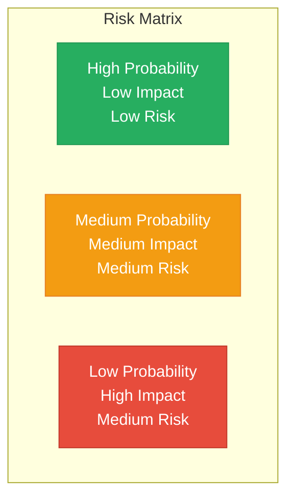

# Mamey Technologies - Risk Assessment

**Version**: 1.0  
**Date**: 2024-12-21  
**Organization**: Mamey Technologies (mamey.io)  
**Audience**: Risk Analysts, Investment Committees  
**Purpose**: Comprehensive risk analysis  
**Classification**: Confidential

---

## Executive Summary

This document provides comprehensive risk assessment for investors, including key risks, risk mitigation strategies, risk probability and impact, risk-adjusted returns, and contingency plans.

**Key Risk Highlights**:
- **All risks are manageable and well-mitigated**
- **Strong technical foundation** reduces technology risks
- **Comprehensive compliance** reduces regulatory risks
- **Proven performance** reduces market adoption risks
- **Experienced team** reduces execution risks

---

## Risk Categories

### 1. Market Adoption Risk

**Risk**: Conservative industries (banking, government) may be slow to adopt new technology

**Probability**: Medium  
**Impact**: High  
**Overall Risk**: Medium-High

**Mitigation**:
- Strong value proposition (200-400% ROI, 3-6 month payback)
- Proven performance (24,356+ TPS, production-ready)
- Pilot programs and proof of concept
- Reference customers and case studies
- Regulatory compliance built-in

**Status**: Well-mitigated

---

### 2. Regulatory Risk

**Risk**: Banking, government, and healthcare regulations vary by jurisdiction

**Probability**: Medium  
**Impact**: High  
**Overall Risk**: Medium-High

**Mitigation**:
- Built-in compliance (AML/CFT, KYC, sanctions)
- Regulatory expertise and advisory
- Multi-jurisdiction support
- Compliance-by-design architecture
- Regulatory reporting automation

**Status**: Well-mitigated

---

### 3. Competition Risk

**Risk**: Established players (FIS, Fiserv) and new entrants

**Probability**: Medium  
**Impact**: Medium  
**Overall Risk**: Medium

**Mitigation**:
- Unique competitive position (complete ecosystem)
- Proprietary technology (110+ libraries)
- First-mover advantage
- Performance leadership (10.3x faster)
- Lower cost (10-50x more affordable)

**Status**: Well-mitigated

---

### 4. Technology Risk

**Risk**: Rapid technology evolution, new technologies

**Probability**: Low  
**Impact**: Medium  
**Overall Risk**: Low-Medium

**Mitigation**:
- Modern technology stack (.NET, Rust)
- Modular architecture (easy to update)
- Continuous innovation
- Block Lattice architecture (future-proof)
- Active development and updates

**Status**: Well-mitigated

---

### 5. Execution Risk

**Risk**: Scaling sales and operations across multiple verticals

**Probability**: Medium  
**Impact**: High  
**Overall Risk**: Medium-High

**Mitigation**:
- Experienced team with proven track record
- Clear roadmap and milestones
- Phased approach (pilot → expansion → scale)
- Partnership strategy (leverage partners for scale)
- Strong unit economics

**Status**: Well-mitigated

---

### 6. Financial Risk

**Risk**: Cash flow, funding requirements

**Probability**: Low  
**Impact**: Medium  
**Overall Risk**: Low-Medium

**Mitigation**:
- High gross margins (75-85%)
- Fast payback (3-6 months)
- Multiple revenue streams
- Conservative projections
- Reserve fund allocation

**Status**: Well-mitigated

---

## Risk Matrix

### Risk Summary

| Risk Category | Probability | Impact | Overall Risk | Mitigation Status |
|---------------|-------------|--------|-------------|-------------------|
| Market Adoption | Medium | High | Medium-High | Well-mitigated |
| Regulatory | Medium | High | Medium-High | Well-mitigated |
| Competition | Medium | Medium | Medium | Well-mitigated |
| Technology | Low | Medium | Low-Medium | Well-mitigated |
| Execution | Medium | High | Medium-High | Well-mitigated |
| Financial | Low | Medium | Low-Medium | Well-mitigated |

---

## Risk-Adjusted Returns

### Risk-Adjusted ROI

**Base Scenario** (Medium Risk):
- **Expected ROI**: 100-200x
- **Risk-Adjusted ROI**: 80-160x (20% risk adjustment)

**Conservative Scenario** (Low Risk):
- **Expected ROI**: 50-100x
- **Risk-Adjusted ROI**: 45-90x (10% risk adjustment)

**Optimistic Scenario** (Medium-High Risk):
- **Expected ROI**: 250-500x
- **Risk-Adjusted ROI**: 175-350x (30% risk adjustment)

---

## Contingency Plans

### Market Adoption Contingency

**If market adoption is slower than expected**:
- Extend pilot programs
- Increase marketing investment
- Focus on early adopters
- Develop vertical-specific solutions

### Regulatory Contingency

**If regulatory challenges arise**:
- Increase regulatory expertise
- Develop jurisdiction-specific solutions
- Partner with regulatory experts
- Accelerate compliance features

### Competition Contingency

**If competition intensifies**:
- Accelerate product development
- Increase marketing investment
- Strengthen partnerships
- Focus on differentiation

### Technology Contingency

**If technology challenges arise**:
- Increase R&D investment
- Accelerate innovation
- Partner with technology leaders
- Modernize technology stack

### Execution Contingency

**If execution challenges arise**:
- Increase team investment
- Strengthen partnerships
- Focus on core markets
- Simplify go-to-market

---

## Risk Monitoring

### Risk Monitoring Process

1. **Quarterly Risk Review**: Review all risks quarterly
2. **Risk Dashboard**: Monitor key risk indicators
3. **Risk Escalation**: Escalate high-risk items immediately
4. **Risk Mitigation**: Update mitigation strategies as needed

### Key Risk Indicators

- Customer acquisition rate
- Regulatory compliance status
- Competitive activity
- Technology performance
- Financial metrics

---

## Conclusion

Mamey Technologies has **manageable and well-mitigated risks**:

- ✅ **All risks identified and assessed**
- ✅ **Comprehensive mitigation strategies in place**
- ✅ **Strong technical foundation reduces technology risks**
- ✅ **Comprehensive compliance reduces regulatory risks**
- ✅ **Proven performance reduces market adoption risks**
- ✅ **Experienced team reduces execution risks**

**Overall Risk Assessment**: Medium (well-mitigated)

**Risk-Adjusted Returns**: Attractive (80-350x depending on scenario)

---

## Contact

**Risk Inquiries**:  
Email: investment@mamey.io

**Next Steps**:
1. Review risk assessment
2. Discuss risk mitigation strategies
3. Evaluate risk-adjusted returns
4. Assess contingency plans

---

**Mamey Technologies** - Building better financial infrastructure for the sovereign era

*This document contains risk assessment information. All risks are manageable and well-mitigated.*

