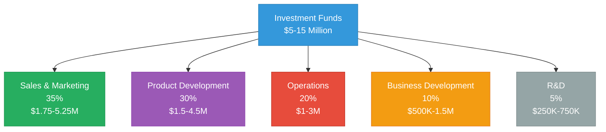

# Mamey Technologies - Use of Funds

**Version**: 1.0  
**Date**: 2024-12-21  
**Organization**: Mamey Technologies (mamey.io)  
**Audience**: Investors, Investment Committees  
**Purpose**: Detailed investment allocation plan  
**Classification**: Confidential

---

## Executive Summary

This document provides detailed use of funds plan for investors, including investment allocation breakdown, sales and marketing plan, product development roadmap, operations scaling plan, team expansion plan, and milestones and KPIs.

**Investment Target**: $5-15 million  
**Investment Allocation**: Sales & Marketing (35%), Product Development (30%), Operations (20%), Business Development (10%), R&D (5%)

---

## Investment Allocation

### Allocation Breakdown

### Detailed Allocation

| Category | Percentage | Amount ($5M) | Amount ($15M) | Key Activities |
|----------|-----------|--------------|---------------|----------------|
| Sales & Marketing | 35% | $1.75M | $5.25M | Enterprise sales team, marketing campaigns, partnerships |
| Product Development | 30% | $1.5M | $4.5M | Additional features, performance optimization, security |
| Operations | 20% | $1M | $3M | Infrastructure scaling, support team, customer success |
| Business Development | 10% | $500K | $1.5M | Strategic partnerships, pilot programs, market expansion |
| R&D | 5% | $250K | $750K | Innovation labs, emerging technology, future platforms |
| **Total** | **100%** | **$5M** | **$15M** | |

---

## Sales & Marketing (35%)

### Enterprise Sales Team

- **Sales Professionals**: 10-20 enterprise sales professionals
- **Sales Leadership**: VP of Sales, Sales Directors
- **Sales Operations**: Sales operations, CRM, analytics
- **Target**: 30-200 customers (Year 1-2)

### Marketing Campaigns

- **Digital Marketing**: SEO, SEM, content marketing
- **Events**: Industry conferences, trade shows, webinars
- **Content**: Whitepapers, case studies, thought leadership
- **Brand Building**: Brand awareness, thought leadership

### Partnership Development

- **Technology Partners**: System integrators, technology partners
- **Channel Partners**: Resellers, distributors
- **Strategic Partners**: Strategic alliances, joint ventures

---

## Product Development (30%)

### Additional Features

- **Platform Expansion**: Additional features and modules
- **Integration Improvements**: API enhancements, SDK improvements
- **Performance Optimization**: Performance improvements, scalability
- **Security Enhancements**: Security features, compliance enhancements

### Platform Expansion

- **Future Platforms**: Pupitre, Casino/MameyCasino completion
- **New Modules**: Additional blockchain modules, banking features
- **Integration**: Platform integration improvements

---

## Operations (20%)

### Infrastructure Scaling

- **Cloud Infrastructure**: AWS, Azure, GCP scaling
- **On-Premise**: On-premise deployment capabilities
- **Monitoring**: Monitoring and observability
- **Security**: Security infrastructure, compliance

### Support Team

- **Customer Support**: Support team expansion
- **Technical Support**: Technical support capabilities
- **Customer Success**: Customer success team
- **Operations Team**: Operations team expansion

---

## Business Development (10%)

### Strategic Partnerships

- **Technology Partners**: System integrators, technology partners
- **Channel Partners**: Resellers, distributors
- **Strategic Alliances**: Joint ventures, strategic alliances

### Pilot Programs

- **Early Adopters**: Pilot programs with early adopters
- **Proof of Concept**: Proof of concept projects
- **Reference Customers**: Reference customer development

### Market Expansion

- **Geographic Expansion**: New geographic markets
- **Vertical Expansion**: New vertical markets
- **Channel Development**: Channel partner development

---

## R&D (5%)

### Innovation Labs

- **Research Initiatives**: Emerging technology research
- **Innovation Projects**: Innovation projects and prototypes
- **Technology Exploration**: New technology exploration

### Future Platforms

- **Pupitre**: Educational platform completion
- **Casino/MameyCasino**: Gaming platform completion
- **New Platforms**: New platform development

---

## Milestones and KPIs

### Year 1-2 Milestones

- **Customers**: 30-200 customers
- **Revenue**: $50-200M ARR
- **Team**: 50-100 employees
- **Market Validation**: Product-market fit, reference customers

### Year 3-5 Milestones

- **Customers**: 200-1000 customers
- **Revenue**: $500M-2B ARR
- **Team**: 200-500 employees
- **Market Leadership**: Market share, brand recognition

### Year 5+ Milestones

- **Customers**: 1000-2000 customers
- **Revenue**: $2-5B ARR
- **Team**: 500-2000 employees
- **Market Dominance**: Market leadership, ecosystem development

---

## Key Performance Indicators

### Sales & Marketing KPIs

- Customer acquisition rate
- Sales pipeline value
- Marketing qualified leads (MQLs)
- Sales qualified leads (SQLs)
- Customer acquisition cost (CAC)
- Sales cycle length

### Product Development KPIs

- Feature delivery rate
- Performance improvements
- Security enhancements
- Platform completion percentage

### Operations KPIs

- Customer satisfaction (CSAT)
- Support ticket resolution time
- Infrastructure uptime
- Customer success metrics

### Business Development KPIs

- Partnership agreements
- Pilot program success rate
- Market expansion progress
- Channel development progress

---

## Conclusion

Mamey Technologies has a **clear and detailed use of funds plan**:

- ✅ **Clear Allocation**: 35% sales, 30% product, 20% operations, 10% BD, 5% R&D
- ✅ **Specific Activities**: Detailed activities for each category
- ✅ **Milestones**: Clear milestones and KPIs
- ✅ **Measurable Outcomes**: Measurable success metrics

**Expected Outcomes**:
- Year 1-2: $50-200M ARR, 30-200 customers
- Year 3-5: $500M-2B ARR, 200-1000 customers
- Year 5+: $2-5B ARR, 1000-2000 customers

---

## Contact

**Investment Inquiries**:  
Email: investment@mamey.io

**Next Steps**:
1. Review use of funds plan
2. Discuss allocation priorities
3. Customize for specific investment scenarios
4. Establish milestones and KPIs

---

**Mamey Technologies** - Building better financial infrastructure for the sovereign era

*This document contains investment allocation information. Allocation can be customized based on investment amount and priorities.*

