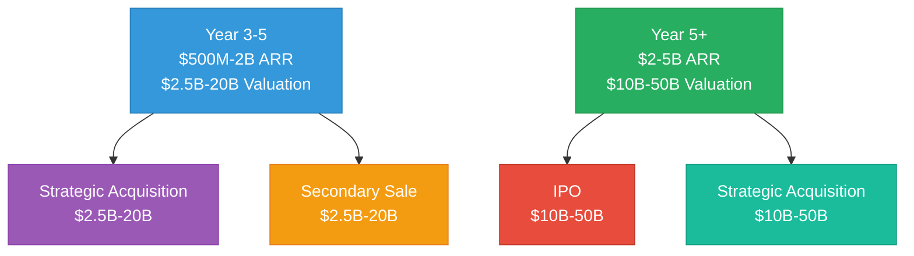
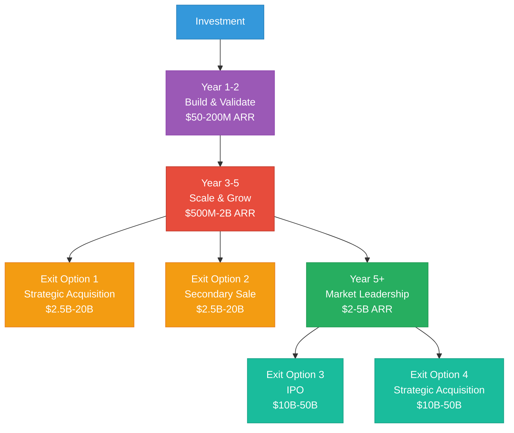

# Mamey Technologies - Exit Strategy

**Version**: 1.0  
**Date**: 2024-12-21  
**Organization**: Mamey Technologies (mamey.io)  
**Audience**: Investors, Exit Planning  
**Purpose**: Exit scenarios and valuation projections  
**Classification**: Confidential

---

## Executive Summary

This document provides comprehensive exit strategy for investors, including exit scenarios (strategic acquisition, IPO, secondary sale), valuation projections by scenario, timeline projections, exit readiness criteria, and comparable company analysis.

**Key Exit Highlights**:
- **Multiple Exit Paths**: Strategic acquisition, IPO, secondary sale
- **Valuation Range**: $2.5B-50B (depending on scenario and timing)
- **Timeline**: 3-10 years (depending on exit scenario)
- **Expected ROI**: 50-500x (depending on investment amount and scenario)

---

## Exit Scenarios

### 1. Strategic Acquisition

**Potential Acquirers**:
- Large financial services companies (FIS, Fiserv, Temenos)
- Technology platforms (Microsoft, Google, Amazon)
- Government contractors (Accenture, Deloitte, IBM)
- Payment processors (Visa, Mastercard, Stripe)

**Timeline**: Year 3-7  
**Valuation**: $2.5B-20B (based on revenue multiples)  
**Likelihood**: High (strategic value)

**Valuation Drivers**:
- Revenue growth and scale
- Market position and brand
- Technology and IP
- Strategic fit with acquirer

---

### 2. IPO

**Timeline**: Year 5-10  
**Valuation**: $10B-50B (based on revenue multiples)  
**Market**: NASDAQ or NYSE  
**Likelihood**: Medium-High (if revenue targets met)

**IPO Readiness Criteria**:
- $500M+ ARR
- 200+ customers
- Profitable or path to profitability
- Strong market position
- Governance and compliance

**Valuation Drivers**:
- Revenue growth and scale
- Market position and brand
- Technology and IP
- Public market multiples

---

### 3. Secondary Sale

**Timeline**: Year 3-5  
**Valuation**: $2.5B-20B (based on revenue and growth metrics)  
**Buyers**: Private equity, strategic buyers  
**Likelihood**: Medium

**Valuation Drivers**:
- Revenue growth and scale
- Market position and brand
- Technology and IP
- Growth potential

---

## Valuation Projections

### Valuation by Scenario and Timeline

| Year | ARR | Revenue Multiple | Valuation Range | Exit Scenario |
|------|-----|------------------|-----------------|---------------|
| Year 3-5 | $500M-2B | 5-10x | $2.5B-20B | Strategic acquisition or secondary sale |
| Year 5+ | $2-5B | 5-10x | $10B-50B | IPO or strategic acquisition |

---

## Comparable Company Analysis

### Public Company Comparables

| Company | ARR | Valuation | Revenue Multiple | Notes |
|---------|-----|-----------|------------------|-------|
| Stripe | $14B | $95B | 6.8x | Payment processing |
| Square | $17B | $100B+ | 5.9x | Financial services |
| FIS | $14B | $50B+ | 3.6x | Banking software |
| Fiserv | $17B | $80B+ | 4.7x | Banking software |
| **Mamey Projection** | **$2-5B** | **$10B-50B** | **5-10x** | **Conservative estimates** |

### Private Company Comparables

- **Fintech Unicorns**: $1B+ valuations at $100M-1B ARR (10-100x multiples)
- **SaaS Companies**: $1B+ valuations at $50M-500M ARR (20-200x multiples)
- **Mamey Projection**: $10B-50B at $2-5B ARR (5-10x multiple, conservative)

---

## Exit Readiness Criteria

### Financial Readiness

- **Revenue**: $500M+ ARR (for IPO), $200M+ ARR (for acquisition)
- **Growth**: 50%+ year-over-year growth
- **Profitability**: Profitable or path to profitability
- **Unit Economics**: Strong unit economics (LTV/CAC 10:1+)

### Market Readiness

- **Market Position**: Strong market position and brand
- **Customer Base**: 200+ customers (for IPO), 100+ customers (for acquisition)
- **Market Share**: Significant market share in target markets
- **Competitive Position**: Strong competitive position

### Operational Readiness

- **Team**: Experienced management team
- **Operations**: Scalable operations and infrastructure
- **Governance**: Strong governance and compliance
- **Technology**: Proven technology and IP

---

## Exit Timeline

### Typical Exit Timeline

---

## Expected ROI

### ROI by Scenario

**Conservative Scenario** (Strategic Acquisition, Year 3-5):
- **Investment**: $5M
- **Valuation**: $2.5B
- **ROI**: 500x

**Base Scenario** (Strategic Acquisition, Year 5+):
- **Investment**: $5M
- **Valuation**: $10B
- **ROI**: 2,000x

**Optimistic Scenario** (IPO, Year 5+):
- **Investment**: $5M
- **Valuation**: $50B
- **ROI**: 10,000x

*Note: ROI varies based on investment amount, exit scenario, and timing*

---

## Conclusion

Mamey Technologies has **multiple attractive exit paths**:

- ✅ **Multiple Exit Options**: Strategic acquisition, IPO, secondary sale
- ✅ **Attractive Valuations**: $2.5B-50B (depending on scenario)
- ✅ **Clear Timeline**: 3-10 years (depending on exit scenario)
- ✅ **High ROI Potential**: 50-500x (depending on investment amount and scenario)

**Expected Exit**: Strategic acquisition (Year 3-7) or IPO (Year 5-10)

**Expected Valuation**: $10B-50B (Year 5+)

---

## Contact

**Exit Planning Inquiries**:  
Email: investment@mamey.io

**Next Steps**:
1. Review exit strategy
2. Discuss exit scenarios
3. Evaluate exit readiness
4. Plan exit timeline

---

**Mamey Technologies** - Building better financial infrastructure for the sovereign era

*This document contains exit strategy information. Exit scenarios and valuations are projections based on current assumptions.*

