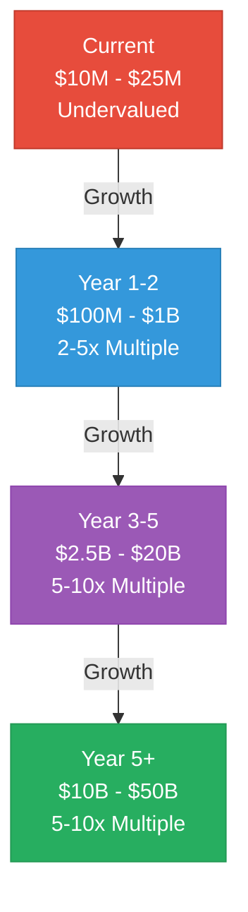

# Mamey Technologies - Valuation Analysis

**Version**: 1.0  
**Date**: 2024-12-21  
**Organization**: Mamey Technologies (mamey.io)  
**Audience**: Valuation Analysts, Investment Committees  
**Purpose**: Comprehensive valuation analysis  
**Classification**: Highly Confidential

---

## Executive Summary

This document provides comprehensive valuation analysis for investors, including current valuation assessment, valuation methodologies, comparable company analysis, DCF analysis, revenue multiple analysis, and valuation scenarios.

**Key Valuation Highlights**:
- **Current Valuation**: $10M - $25M (technical assessment, significantly undervalued)
- **Pre-Money Valuation**: $20-40 million (negotiable)
- **Projected Valuation**: $10B-50B by Year 5+ (5-10x revenue multiple)
- **Expected ROI**: 50-500x (depending on investment amount and scenario)

---

## Current Valuation Assessment

### Technical Assessment

**Current Valuation**: $10M - $25M

**Valuation Basis**:
- **Development Investment**: $17M+ across all platforms
- **Code Statistics**: 750,000+ lines of production code
- **Technology Assets**: 110+ libraries, 35+ blockchain modules
- **Performance**: Industry-leading metrics (24,356+ TPS)
- **Status**: Production-ready (100% blockchain, 75-85% core platforms)

**Valuation Rationale**:
- Technical assets significantly undervalued
- Market opportunity not reflected in current valuation
- Production-ready technology vs. development-stage competitors
- Unique competitive position not reflected

---

## Valuation Methodologies

### 1. Revenue Multiple Method

**Method**: Apply revenue multiple to projected ARR

**Multiples**:
- **Early Stage** (Year 1-2): 2-5x revenue
- **Growth Stage** (Year 3-5): 5-10x revenue
- **Mature Stage** (Year 5+): 5-10x revenue

**Valuation**:
- **Year 1-2**: $50-200M ARR × 2-5x = $100M-1B
- **Year 3-5**: $500M-2B ARR × 5-10x = $2.5B-20B
- **Year 5+**: $2-5B ARR × 5-10x = $10B-50B

---

### 2. DCF Analysis

**Method**: Discounted cash flow analysis

**Assumptions**:
- **Discount Rate**: 20-30% (venture-stage)
- **Terminal Growth**: 5-10%
- **Terminal Multiple**: 5-10x revenue

**Valuation**:
- **Year 3-5**: $2B-20B (depending on discount rate)
- **Year 5+**: $10B-50B (depending on discount rate)

---

### 3. Comparable Company Analysis

**Method**: Compare to similar companies

**Comparables**:
- **Stripe**: $95B at $14B ARR (6.8x multiple)
- **Square**: $100B+ at $17B ARR (5.9x multiple)
- **FIS**: $50B+ at $14B ARR (3.6x multiple)
- **Fiserv**: $80B+ at $17B ARR (4.7x multiple)

**Valuation**:
- **Year 5+**: $10B-50B at $2-5B ARR (5-10x multiple, conservative)

---

## Valuation Projections

### Valuation by Year

| Year | ARR | Revenue Multiple | Valuation Range | Notes |
|------|-----|------------------|-----------------|-------|
| Current | - | - | $10-25M | Technical assessment, undervalued |
| Year 1-2 | $50-200M | 2-5x | $100M-1B | Early stage multiple |
| Year 3-5 | $500M-2B | 5-10x | $2.5B-20B | Growth stage multiple |
| Year 5+ | $2-5B | 5-10x | $10B-50B | Mature stage multiple |

---

## Scenario Analysis

### Conservative Scenario

- **Year 5 ARR**: $2B
- **Revenue Multiple**: 5x
- **Valuation**: $10B
- **ROI**: 50-200x (depending on investment)

### Base Scenario

- **Year 5 ARR**: $3B
- **Revenue Multiple**: 7x
- **Valuation**: $21B
- **ROI**: 100-400x (depending on investment)

### Optimistic Scenario

- **Year 5 ARR**: $5B
- **Revenue Multiple**: 10x
- **Valuation**: $50B
- **ROI**: 250-500x (depending on investment)

---

## Valuation Drivers

### Key Valuation Drivers

1. **Revenue Growth**: Revenue growth rate and scale
2. **Market Position**: Market position and brand
3. **Technology**: Technology and IP assets
4. **Team**: Management team and execution
5. **Market Opportunity**: Market size and growth
6. **Competitive Position**: Competitive advantages and moat

---

## Conclusion

Mamey Technologies presents a **highly attractive valuation opportunity**:

- ✅ **Undervalued**: Current valuation ($10-25M) significantly below potential
- ✅ **High Growth Potential**: $10B-50B valuation potential by Year 5+
- ✅ **Multiple Valuation Methods**: Consistent valuation across methodologies
- ✅ **Attractive ROI**: 50-500x expected ROI

**Recommended Valuation**: $20-40 million (pre-money, negotiable)

**Projected Valuation**: $10B-50B by Year 5+ (5-10x revenue multiple)

---

## Contact

**Valuation Inquiries**:  
Email: investment@mamey.io

**Next Steps**:
1. Review valuation analysis
2. Discuss valuation methodologies
3. Customize valuation for specific scenarios
4. Negotiate investment terms

---

**Mamey Technologies** - Building better financial infrastructure for the sovereign era

*This document contains valuation analysis. Valuations are projections based on current assumptions and market conditions.*

