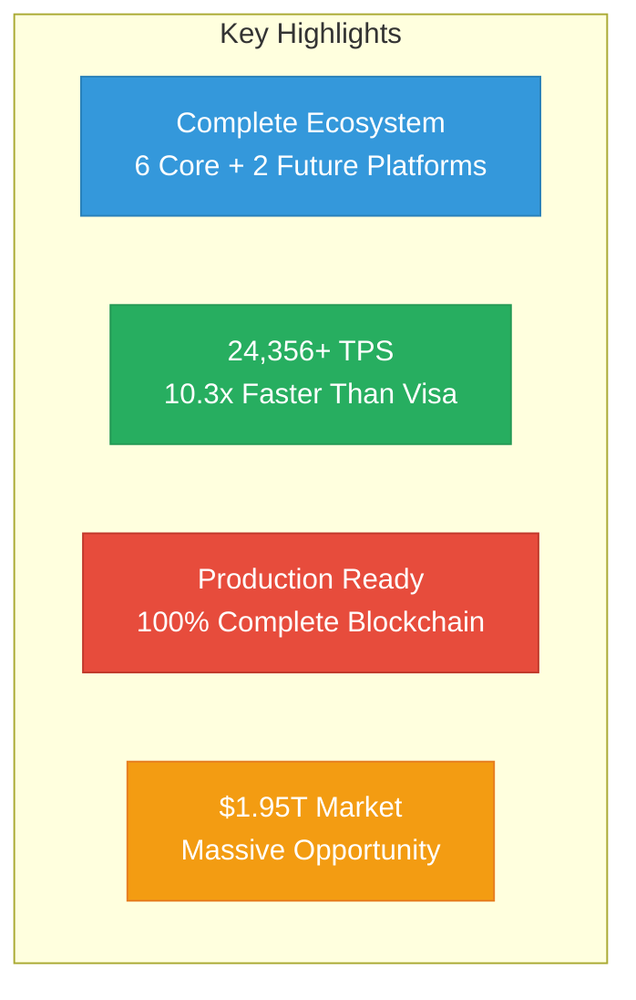

# Mamey Technologies - News & Media Quick Start Guide

**Version**: 1.0  
**Date**: 2024-12-21  
**Organization**: Mamey Technologies (mamey.io)  
**Purpose**: Quick reference for using news and media documentation

---

## Welcome

This Quick Start Guide helps you navigate the complete Mamey Technologies news and media documentation suite. All documents are designed to help you share information about the Mamey Ecosystem with news media, press, and social media platforms.

**📘 MameyNode Information**: Business and conceptual information from MameyNode documentation has been integrated throughout these documents, providing comprehensive details about the blockchain infrastructure, Block Lattice architecture, Master Trust Accounts, and built-in compliance features.

---

## Document Suite Overview

### Core Media Documents (Start Here)

1. **[Press Release Templates](01-Press-Release-Templates.md)** - Ready-to-use press releases
2. **[Media Kit](02-Media-Kit.md)** - Complete media kit for journalists
3. **[Social Media Content Library](03-Social-Media-Content-Library.md)** - Ready-to-use social media posts
4. **[Fact Sheets](05-Fact-Sheets.md)** - Quick reference facts

### Content Creation Documents

5. **[News Article Templates](04-News-Article-Templates.md)** - Article and blog post templates
6. **[Social Media Campaign Templates](08-Social-Media-Campaign-Templates.md)** - Campaign templates
7. **[Image Assets Guide](07-Image-Assets-Guide.md)** - Visual assets guide

### Reference Documents

8. **[Media FAQs](06-Media-FAQs.md)** - Frequently asked questions
9. **[Media Guidelines](10-Media-Guidelines.md)** - Media coverage guidelines
10. **[Press Contact Information](09-Press-Contact-Information.md)** - Contact details
11. **[Glossary](15-Glossary.md)** - Terminology reference

### Specialized Documents

12. **[Social Media Best Practices](12-Social-Media-Best-Practices.md)** - Best practices guide
13. **[Crisis Communication Guide](13-Crisis-Communication-Guide.md)** - Crisis management
14. **[Media Pitch Templates](14-Media-Pitch-Templates.md)** - Media outreach templates
15. **[News Updates & Announcements](11-News-Updates-Announcements.md)** - Recent news

---

## Quick Navigation by Role

### For News Media / Journalists

**Start Here**:
1. [Media Kit](02-Media-Kit.md) - Complete overview
2. [Press Release Templates](01-Press-Release-Templates.md) - Latest announcements
3. [Fact Sheets](05-Fact-Sheets.md) - Quick facts

**Reference**:
4. [Media FAQs](06-Media-FAQs.md) - Common questions
5. [Press Contact Information](09-Press-Contact-Information.md) - Contact details
6. [Glossary](15-Glossary.md) - Terminology

---

### For Social Media Managers

**Start Here**:
1. [Social Media Content Library](03-Social-Media-Content-Library.md) - Ready-to-use posts
2. [Social Media Best Practices](12-Social-Media-Best-Practices.md) - Strategy guide
3. [Social Media Campaign Templates](08-Social-Media-Campaign-Templates.md) - Campaigns

**Reference**:
4. [Image Assets Guide](07-Image-Assets-Guide.md) - Visual assets
5. [Media Guidelines](10-Media-Guidelines.md) - Brand guidelines

---

### For PR Teams

**Start Here**:
1. [Press Release Templates](01-Press-Release-Templates.md) - Announcements
2. [Media Pitch Templates](14-Media-Pitch-Templates.md) - Outreach
3. [Crisis Communication Guide](13-Crisis-Communication-Guide.md) - Crisis management

**Reference**:
4. [Media Guidelines](10-Media-Guidelines.md) - Guidelines
5. [Press Contact Information](09-Press-Contact-Information.md) - Contacts

---

## Key Talking Points

### Core Message

**Mamey Technologies provides a complete sovereign financial infrastructure ecosystem** through six core platforms plus two future platforms that work together seamlessly.

### Key Highlights

**Key Points**:
- **Complete Ecosystem**: Only platform with complete financial infrastructure
- **Production Ready**: 100% complete (MameyNode), not prototypes
- **Proven Performance**: 24,356+ TPS, 10.3x faster than Visa
- **Massive Market**: $1.95T TAM, clear path to $2-5B ARR
- **Unique Position**: No direct competitor

---

## Document Formats

### Available Formats

- **Markdown (.md)**: Source format, editable
- **PDF**: For sharing and printing (convert from markdown)
- **Word**: For editing and customization (convert from markdown)
- **HTML**: For web embedding (convert from markdown)

### Conversion Tools

- **Markdown to PDF**: Pandoc, Marked, or online converters
- **Markdown to Word**: Pandoc or manual conversion
- **Images**: High-resolution formats (PNG, JPG, SVG)

---

## Distribution Guidelines

### Public Distribution

- **Press Releases**: Public (unless embargoed)
- **Media Kit**: Public
- **Social Media Content**: Public
- **Fact Sheets**: Public
- **Media Guidelines**: Public

### Sharing Channels

- **Email**: Attach PDFs or provide links
- **Website**: Host PDFs or embed HTML
- **Social Media**: Share directly or link to content
- **Press Distribution**: Use press distribution services

---

## Social Media Platforms

### Platform-Specific Content

- **LinkedIn**: Professional, B2B content, thought leadership
- **Twitter/X**: Quick updates, news, engagement
- **Facebook**: Broader audience, community building
- **Instagram**: Visual content, stories, reels
- **YouTube**: Video content, tutorials, demos

**Content Available**: 50+ ready-to-use posts across all platforms

---

## Key Metrics at a Glance

### Performance Metrics

- **Blockchain Throughput**: 24,356+ TPS (measured)
- **Transaction Latency**: < 50ms (p99)
- **Finality Time**: ~5.9ms average
- **Scalability**: Supports 1 billion+ concurrent users

### Market Metrics

- **Total Addressable Market**: $1.95 trillion annually
- **Target Markets**: 195+ central banks, 25,000+ commercial banks
- **Revenue Potential**: $2-5B ARR by Year 5+

### Development Metrics

- **Code Statistics**: 750,000+ lines of production code
- **Libraries**: 110+ proprietary libraries
- **Microservices**: 150+ microservices
- **Status**: Production-ready (100% blockchain, 75-85% core platforms)

---

## Next Steps

### For First-Time Users

1. **Read**: [Media Kit](02-Media-Kit.md) for comprehensive overview
2. **Review**: [Press Release Templates](01-Press-Release-Templates.md) for announcements
3. **Explore**: [Social Media Content Library](03-Social-Media-Content-Library.md) for social media
4. **Contact**: Reach out with questions or for more information

### For Regular Users

1. **Update**: Check for document updates
2. **Customize**: Adapt documents for your needs
3. **Distribute**: Share with your audience
4. **Track**: Monitor engagement and outcomes

### For Media Teams

1. **Review**: [Media Guidelines](10-Media-Guidelines.md)
2. **Prepare**: Use templates and fact sheets
3. **Distribute**: Share via appropriate channels
4. **Follow-Up**: Track coverage and engagement

---

## Document Statistics

- **Total Documents**: 15 comprehensive media documents
- **Total Content**: ~200+ pages
- **Press Release Templates**: 5+ ready-to-use templates
- **Social Media Posts**: 50+ ready-to-use posts
- **Fact Sheets**: 5+ comprehensive fact sheets
- **Mermaid Diagrams**: 20+ visual diagrams

---

## Version Information

- **Current Version**: 1.0
- **Last Updated**: 2024-12-21
- **Next Review**: Quarterly

---

## Feedback

We welcome feedback on these documents. Please contact:
- **Press**: press@mamey.io
- **Media**: media@mamey.io
- **Social Media**: social@mamey.io
- **Suggestions**: feedback@mamey.io

---

**Mamey Technologies** - Building better financial infrastructure for the sovereign era

*This Quick Start Guide provides an overview. For detailed information, see the individual documents.*

