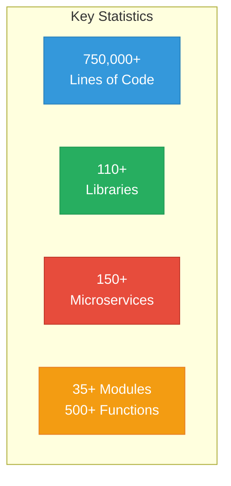
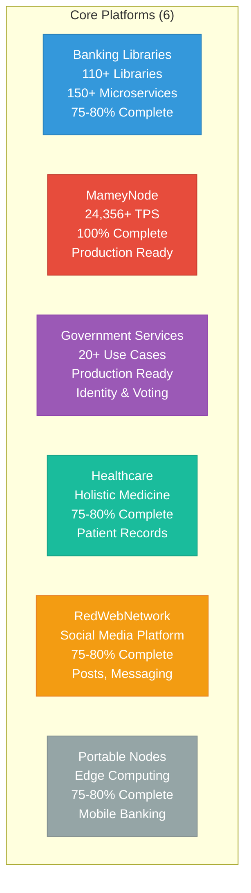
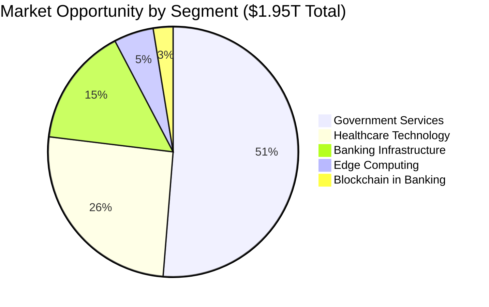

# Mamey Technologies - Media Kit

**Version**: 1.0  
**Date**: 2024-12-21  
**Organization**: Mamey Technologies (mamey.io)  
**Audience**: Journalists, Reporters, Bloggers, Media  
**Purpose**: Complete media kit for journalists  
**Classification**: Public

---

## Company Overview

### About Mamey Technologies

Mamey Technologies provides a **complete sovereign financial infrastructure ecosystem** through six core platforms plus two future platforms that work together seamlessly. Production-ready, proven, and ready to transform financial services, government operations, healthcare, education, and gaming.

**Mission**: Building better financial infrastructure for the sovereign era

**Vision**: Enable organizations to maintain complete control over their financial infrastructure while achieving industry-leading performance and built-in compliance.

---

## Key Facts & Figures

### Company Statistics

**Development Investment**: $17M+ across all platforms  
**Code Statistics**: 750,000+ lines of production code  
**Libraries**: 110+ proprietary .NET libraries  
**Microservices**: 150+ production-ready microservices  
**Blockchain Modules**: 35+ modules (19 core + 16 specialized)  
**Use Cases**: 200+ use cases across all platforms  
**Status**: Production-ready (100% blockchain, 75-85% core platforms)

---

## Performance Metrics

### Blockchain Performance

- **Throughput**: 24,356+ TPS (measured), 672,380 TPS (1B users benchmark)
- **Transaction Latency**: < 50ms (p99), 0.05ms (P99 measured)
- **Finality Time**: ~5.9ms average
- **System Efficiency**: 98.5% throughput utilization
- **Scalability**: Supports 1 billion+ concurrent users

### Competitive Performance

- **10.3x faster than Visa** for blockchain operations
- **1000x faster** than traditional cross-border payments (1-3 days → 5.9ms)
- **Industry-leading** performance across all metrics

---

## Core Platforms

### Platform Overview

**1. Banking Libraries & Microservices**
- 110+ proprietary .NET libraries
- 150+ production-ready microservices
- CQRS, Event Sourcing, DDD patterns
- Status: 75-80% complete

**2. MameyNode Blockchain**
- 24,356+ TPS (measured)
- Block Lattice architecture with DPoS consensus
- 35+ modules (19 core + 16 specialized)
- 200+ use cases
- Built-in compliance (AML/CFT, KYC, sanctions)
- Status: 100% complete, production-ready

**3. Government Services**
- 20+ complete use case implementations
- Digital identity, voting, document verification
- Tax collection, social services, land registry
- Status: Production ready

**4. Holistic Medicine**
- Healthcare and wellness platform
- Patient records management
- Telemedicine infrastructure
- Status: 75-80% complete

**5. RedWebNetwork**
- Social media platform
- Posts, messaging, groups, marketplace
- Status: 75-80% complete

**6. Portable Nodes**
- Mobile and edge computing solutions
- Offline-capable banking
- Satellite connectivity
- Status: 75-80% complete

**Future Platforms (2)** (~65% complete, microservices created):
- **Pupitre**: Educational platform, AI-first teaching
- **Casino/MameyCasino**: Gaming platform, AI dealers, provably fair gaming

---

## Market Opportunity

### Total Addressable Market

- **Total Addressable Market (TAM)**: $1.95 trillion annually
- **Serviceable Addressable Market (SAM)**: $5+ billion annually
- **Target Markets**: 195+ central banks, 25,000+ commercial banks, governments worldwide

---

## Competitive Advantages

1. **Complete Ecosystem** - Only platform with complete financial infrastructure
2. **Proprietary Technology** - Own the core libraries (110+ libraries)
3. **Production Ready** - 100% complete, not prototypes
4. **Exceptional Performance** - 10.3x faster than Visa
5. **Lower Cost** - 10-50x more affordable than competitors
6. **No Vendor Lock-in** - Open-source core with commercial licensing
7. **Data Sovereignty** - Complete control over data and infrastructure

**No Direct Competitor** with same comprehensive offering.

---

## Technology Stack

- **Blockchain**: Rust-based, DPoS consensus, Block Lattice architecture
- **Microservices**: .NET Core, CQRS, Event Sourcing, DDD
- **Databases**: PostgreSQL, MongoDB, Redis, LMDB
- **Message Brokers**: RabbitMQ, Kafka
- **Infrastructure**: Docker, Kubernetes, cloud-agnostic
- **Security**: Military-grade encryption, zero-trust architecture

---

## Use Cases

### Banking
- Cross-border payments (1-3 days → 5.9ms)
- Real-time gross settlement (RTGS)
- CBDC infrastructure
- Trade finance, treasury management, custody

### Government
- Digital identity (DID, verifiable credentials)
- Voting and elections
- Document verification
- Tax collection, social services, land registry

### Healthcare
- Patient records management
- Telemedicine infrastructure
- Wellness tracking
- HIPAA/GDPR compliance

---

## Recent News & Announcements

*See [News Updates & Announcements](11-News-Updates-Announcements.md) for latest news*

---

## Executive Bios

### [Executive Name], [Title]

[Bio information - to be filled in]

**Contact**: [Email]

---

## Press Contact Information

### Media Relations

**Press Inquiries**:  
Email: press@mamey.io  
Phone: [Contact Number]  
Website: mamey.io

**Media Relations Team**:
- [Name], [Title] - press@mamey.io
- [Name], [Title] - media@mamey.io

**Interview Requests**:  
Please contact press@mamey.io with:
- Topic/angle
- Deadline
- Format (print, broadcast, podcast, etc.)
- Preferred date/time

---

## High-Resolution Images

### Available Assets

*Note: Actual image files available upon request*

1. **Company Logo**
   - Formats: PNG, SVG, JPG
   - Variations: Full color, black, white
   - Usage: See [Media Guidelines](10-Media-Guidelines.md)

2. **Product Screenshots**
   - MameyNode interface
   - Banking platform screens
   - Government services interface

3. **Infographics**
   - Ecosystem overview
   - Performance metrics
   - Market opportunity

4. **Team Photos**
   - Executive team
   - Development team

**Request Images**: Contact press@mamey.io

---

## Brand Guidelines

### Logo Usage

- Use approved logo files only
- Maintain minimum clear space
- Do not alter colors or proportions
- See [Media Guidelines](10-Media-Guidelines.md) for details

### Colors

- Primary: [Color codes]
- Secondary: [Color codes]
- Accent: [Color codes]

### Typography

- Primary: [Font name]
- Secondary: [Font name]

---

## Social Media

### Official Accounts

- **LinkedIn**: [URL]
- **Twitter/X**: [URL]
- **Facebook**: [URL]
- **Instagram**: [URL]
- **YouTube**: [URL]

### Hashtags

- #MameyTechnologies
- #FinTech
- #Blockchain
- #Banking
- #SovereignInfrastructure
- #DigitalTransformation

---

## Additional Resources

### Documentation

- **Technical Documentation**: docs.mamey.io
- **API Documentation**: docs.mamey.io/api
- **SDK Documentation**: docs.mamey.io/sdk

### Related Media Materials

- [Press Release Templates](01-Press-Release-Templates.md)
- [Fact Sheets](05-Fact-Sheets.md)
- [Social Media Content Library](03-Social-Media-Content-Library.md)
- [Media FAQs](06-Media-FAQs.md)

---

## Contact

**Mamey Technologies**  
Email: info@mamey.io  
Press: press@mamey.io  
Media: media@mamey.io  
Website: mamey.io

---

**Mamey Technologies** - Building better financial infrastructure for the sovereign era

*This media kit is for public distribution to journalists, reporters, and media outlets.*

