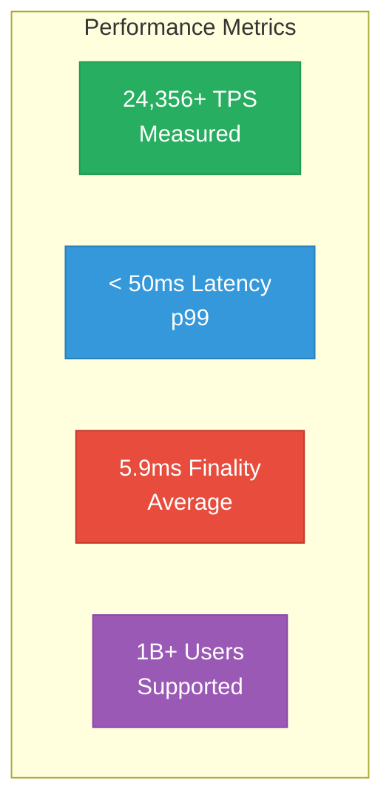
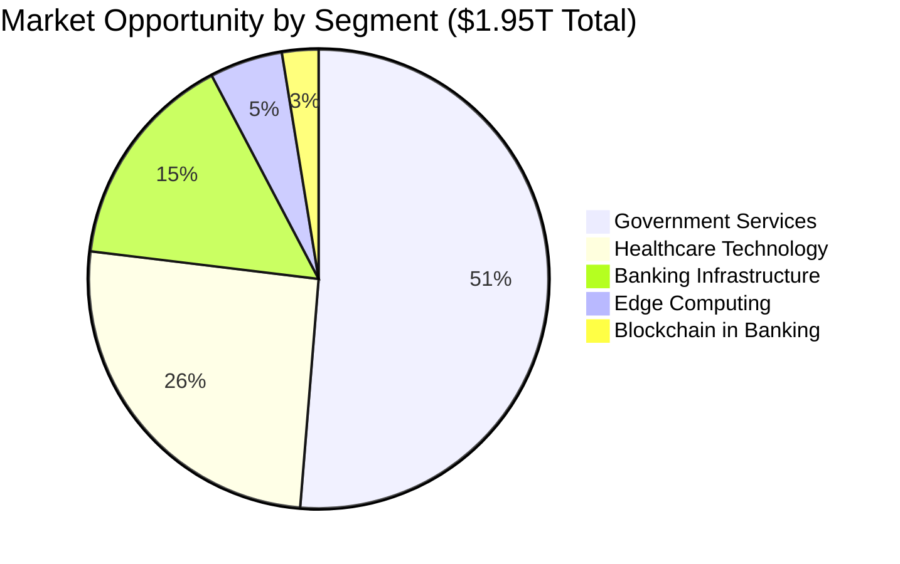

# Mamey Technologies - Fact Sheets

**Version**: 1.0  
**Date**: 2024-12-21  
**Organization**: Mamey Technologies (mamey.io)  
**Audience**: All Media, Quick Reference  
**Purpose**: Quick reference fact sheets  
**Classification**: Public

---

## Company Fact Sheet

### Mamey Technologies - At a Glance

**Company Name**: Mamey Technologies  
**Website**: mamey.io  
**Founded**: [Year]  
**Headquarters**: [Location]  
**Industry**: Financial Technology, Blockchain, Government Services, Healthcare

**Mission**: Building better financial infrastructure for the sovereign era

**Description**: Mamey Technologies provides a complete sovereign financial infrastructure ecosystem through six core platforms plus two future platforms that work together seamlessly.

---

## Product Fact Sheet

### Complete Sovereign Financial Infrastructure Ecosystem

**Core Platforms (6)**:
1. Banking Libraries & Microservices (110+ libraries, 150+ microservices)
2. MameyNode Blockchain (24,356+ TPS, 100% complete)
3. Government Services (20+ use cases, production ready)
4. Holistic Medicine (Healthcare platform, 75-80% complete)
5. RedWebNetwork (Social media platform, 75-80% complete)
6. Portable Nodes (Edge computing, 75-80% complete)

**Future Platforms (2)**:
7. Pupitre (Educational platform, ~65% complete)
8. Casino/MameyCasino (Gaming platform, ~65% complete)

**Status**: Production-ready (100% blockchain, 75-85% core platforms)

---

## Technology Fact Sheet

### MameyNode Blockchain

**Architecture**: Block Lattice with DPoS Consensus

**Performance**:
- **Throughput**: 24,356+ TPS (measured), 672,380 TPS (1B users benchmark)
- **Latency**: < 50ms (p99)
- **Finality**: ~5.9ms average
- **Scalability**: Supports 1 billion+ concurrent users

**Modules**: 35+ modules (19 core + 16 specialized)  
**Functions**: 500+ functions  
**Use Cases**: 200+ use cases

**Technology Stack**:
- **Language**: Rust (283,076 lines)
- **Database**: LMDB (embedded, high-performance)
- **Consensus**: DPoS (Delegated Proof-of-Stake)
- **Architecture**: Block Lattice (parallel processing)

**Competitive Performance**:
- **10.3x faster than Visa** for blockchain operations
- **1000x faster** than traditional cross-border payments (1-3 days → 5.9ms)

---

## Performance Fact Sheet

### Key Performance Metrics

**Blockchain Performance**:
- Throughput: 24,356+ TPS (measured)
- Latency: < 50ms (p99)
- Finality: 5.9ms average
- System Efficiency: 98.5% throughput utilization

**Competitive Comparison**:
- 10.3x faster than Visa
- 1000x faster than traditional cross-border payments
- Industry-leading performance across all metrics

---

## Market Fact Sheet

### Market Opportunity

**Total Addressable Market (TAM)**: $1.95 trillion annually

**Market Segments**:
- Banking Infrastructure: $300 billion
- Blockchain in Banking: $50 billion (2030)
- Government Services: $1 trillion
- Healthcare Technology: $500 billion
- Edge Computing: $100 billion

**Target Markets**:
- 195+ central banks globally
- 25,000+ commercial banks worldwide
- Thousands of government agencies
- Healthcare providers worldwide

---

## Development Fact Sheet

### What We've Built

**Development Investment**: $17M+ across all platforms

**Code Statistics**:
- **Total Code**: 750,000+ lines of production code
- **C# Code**: 274,046 lines (Banking, Healthcare, Social Media, Education)
- **Rust Code**: 283,076 lines (MameyNode Blockchain)
- **Files**: 22,664+ files

**Components**:
- **Libraries**: 110+ proprietary .NET libraries
- **Microservices**: 150+ production-ready microservices
- **Blockchain Modules**: 35+ modules (19 core + 16 specialized)
- **Functions**: 500+ functions
- **Use Cases**: 200+ use cases

**Status**:
- MameyNode: 100% complete, production-ready
- Core Platforms: 75-85% complete
- Future Platforms: ~65% complete (microservices created)

---

## Competitive Fact Sheet

### Competitive Advantages

1. **Complete Ecosystem** - Only platform with complete financial infrastructure
2. **Proprietary Technology** - Own the core libraries (110+ libraries)
3. **Production Ready** - 100% complete, not prototypes
4. **Exceptional Performance** - 10.3x faster than Visa
5. **Lower Cost** - 10-50x more affordable than competitors
6. **No Vendor Lock-in** - Open-source core with commercial licensing
7. **Data Sovereignty** - Complete control over data and infrastructure

**No Direct Competitor** with same comprehensive offering.

---

## Use Case Fact Sheet

### Key Use Cases

**Banking**:
- Cross-border payments (1-3 days → 5.9ms)
- Real-time gross settlement (RTGS)
- CBDC infrastructure
- Trade finance, treasury management, custody

**Government**:
- Digital identity (DID, verifiable credentials)
- Voting and elections
- Document verification
- Tax collection, social services, land registry

**Healthcare**:
- Patient records management
- Telemedicine infrastructure
- Wellness tracking
- HIPAA/GDPR compliance

**Total**: 200+ use cases across all platforms

---

## Contact Fact Sheet

### Press & Media Contact

**Press Inquiries**:  
Email: press@mamey.io  
Phone: [Contact Number]  
Website: mamey.io

**Media Relations**:  
Email: media@mamey.io

**General Inquiries**:  
Email: info@mamey.io

**Social Media**:
- LinkedIn: [URL]
- Twitter/X: [URL]
- Facebook: [URL]

---

## Quick Reference

### Key Numbers

- **750,000+** lines of production code
- **110+** proprietary libraries
- **150+** microservices
- **35+** blockchain modules
- **200+** use cases
- **24,356+** TPS (measured)
- **10.3x** faster than Visa
- **$1.95T** market opportunity
- **100%** blockchain complete
- **75-85%** core platforms complete

---

**Mamey Technologies** - Building better financial infrastructure for the sovereign era

*These fact sheets are for public distribution and quick reference.*

