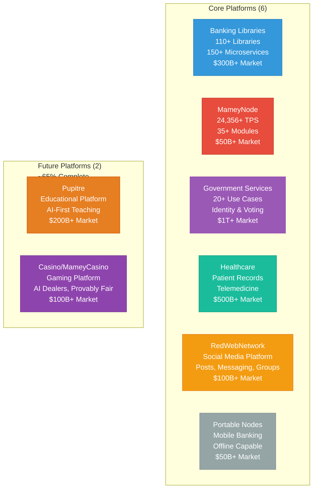
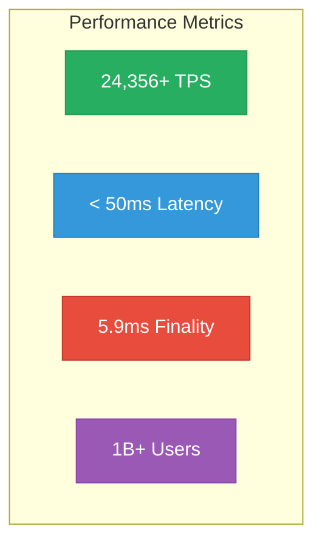
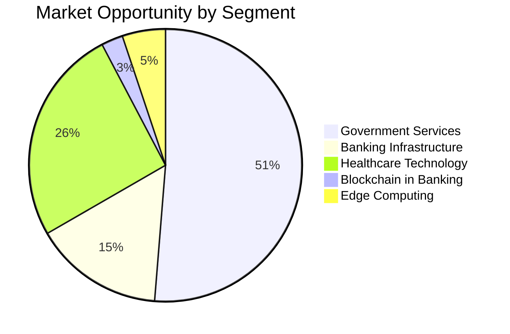
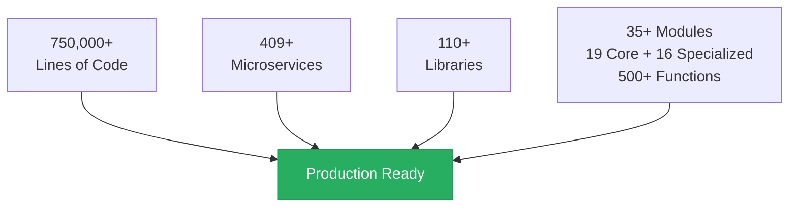

# Mamey Technologies Ecosystem - One-Pager

**Version**: 1.0  
**Date**: 2024-12-21  
**Organization**: Mamey Technologies (mamey.io)  
**For**: Investors, Partners, Stakeholders

---

## The Complete Sovereign Financial Infrastructure Platform

Mamey Technologies provides a **complete sovereign financial infrastructure ecosystem** through six core platforms plus two future platforms that work together seamlessly. Production-ready, proven, and ready to transform financial services, government operations, healthcare, education, and gaming.

---

## Core Platforms (6) + Future Platforms (2)

| Platform | Capabilities | Market Size | Status |
|----------|-------------|-------------|--------|
| **Banking Libraries & Microservices** | 110+ .NET libraries, 150+ microservices, CQRS/Event Sourcing | $300B+ | 75-80% Complete |
| **MameyNode Blockchain** | 24,356+ TPS, 35+ modules (19 core + 16 specialized), 200+ use cases, 10.3x faster than Visa | $50B+ by 2030 | 100% Complete |
| **Government Services** | Identity, voting, documents, 20+ use cases | $1T+ | Production Ready |
| **Holistic Medicine** | Patient records, telemedicine, wellness tracking | $500B+ | 75-80% Complete |
| **RedWebNetwork** | Social media platform, posts, messaging, groups, marketplace | $100B+ | 75-80% Complete |
| **Portable Nodes** | Mobile banking, offline-capable, satellite connectivity | $50B+ | 75-80% Complete |
| **Pupitre** | Educational platform, AI-first teaching, sovereign education | $200B+ | ~65% Complete (Microservices Created) |
| **Casino/MameyCasino** | Gaming platform, AI dealers, provably fair gaming | $100B+ | ~65% Complete (Microservices Created) |

---

## Key Metrics

### Performance

- **Blockchain Throughput**: 24,356+ TPS (measured), 672,380 TPS (1B users benchmark)
- **Transaction Latency**: < 50ms (p99)
- **Finality Time**: ~5.9ms average
- **Scalability**: Supports 1 billion+ concurrent users

### Market Opportunity

- **Total Addressable Market (TAM)**: $1T+ combined
- **Target Markets**: 195+ central banks, 25,000+ commercial banks, governments worldwide
- **Revenue Potential**: $2-5B ARR by Year 5+

### Development Status

---

## Competitive Advantages

✅ **Complete Ecosystem** - Only platform with complete financial infrastructure  
✅ **Proprietary Technology** - Own the core libraries and frameworks  
✅ **Production Ready** - 100% complete, not prototypes  
✅ **Exceptional Performance** - Industry-leading metrics across all platforms  
✅ **Seamless Integration** - All systems work together  
✅ **Data Sovereignty** - Complete control over data and infrastructure  
✅ **Multiple Verticals** - Banking, government, healthcare, blockchain

---

## Revenue Model

1. **Dual Licensing** (80-90% margin): Commercial licenses for institutions
2. **Banking-as-a-Service** (60-70% margin): Managed cloud platform
3. **Network Fees** (70-80% margin): Transaction fees from blockchain operations
4. **Implementation & Consulting** (50-60% margin): Integration services
5. **Platform Licensing** (75-85% margin): Framework and library licensing

**Projected Revenue**: $2-5 billion ARR by Year 5+

---

## Investment Highlights

- **Current Valuation**: $10M - $25M (technical assessment)
- **Strategic Value**: Complete ecosystem with proprietary technology
- **Market Position**: Unique - no direct competitor with same comprehensive offering
- **Growth Potential**: $50-200M ARR (Year 1-2) → $2-5B ARR (Year 5+)

---

## Use Cases

### Banking
- Cross-border payments (1-3 days → 5.9ms)
- Real-time gross settlement (RTGS)
- CBDC infrastructure
- Trade finance, treasury management, custody

### Government
- Digital identity (DID, verifiable credentials)
- Voting and elections
- Document verification
- Tax collection, social services, land registry

### Healthcare
- Patient records management
- Telemedicine infrastructure
- Wellness tracking
- HIPAA/GDPR compliance

---

## Technology Stack

- **Blockchain**: Rust-based, DPoS consensus, modular architecture
- **Microservices**: .NET Core, CQRS, Event Sourcing, DDD
- **Databases**: PostgreSQL, MongoDB, Redis, LMDB
- **Message Brokers**: RabbitMQ, Kafka
- **Infrastructure**: Docker, Kubernetes, cloud-agnostic
- **Security**: Military-grade encryption, zero-trust architecture

---

## Contact

**Mamey Technologies**  
Email: info@mamey.io  
Website: mamey.io

For investment inquiries: investment@mamey.io  
For partnership inquiries: partners@mamey.io

---

**Mamey Technologies** - Building better financial infrastructure for the sovereign era

*This document contains proprietary information. Distribution is restricted to authorized parties only.*

