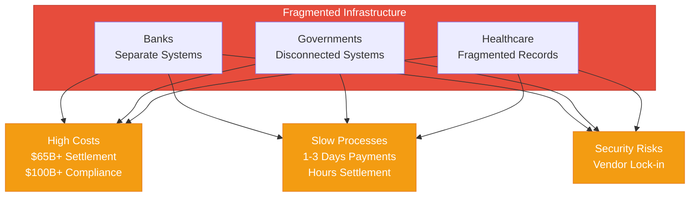
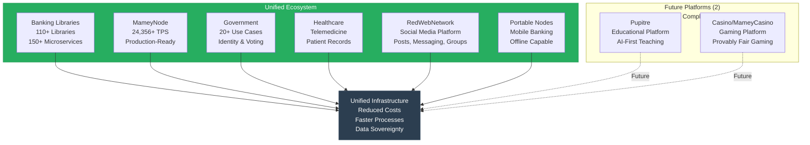
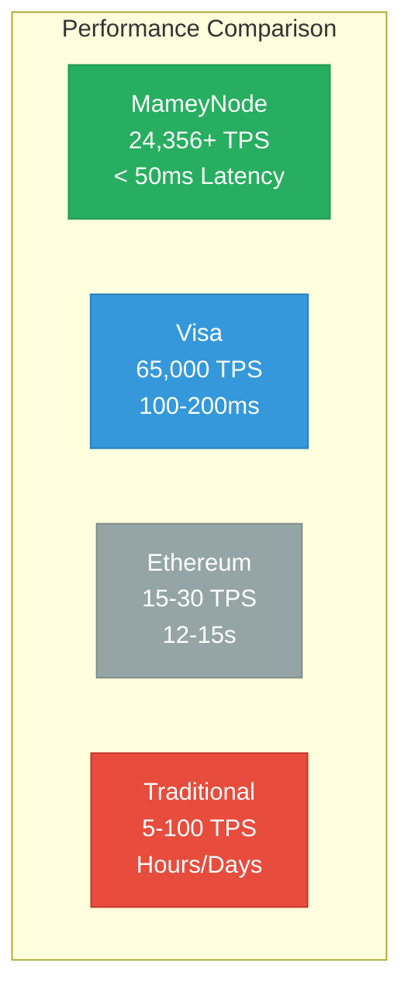
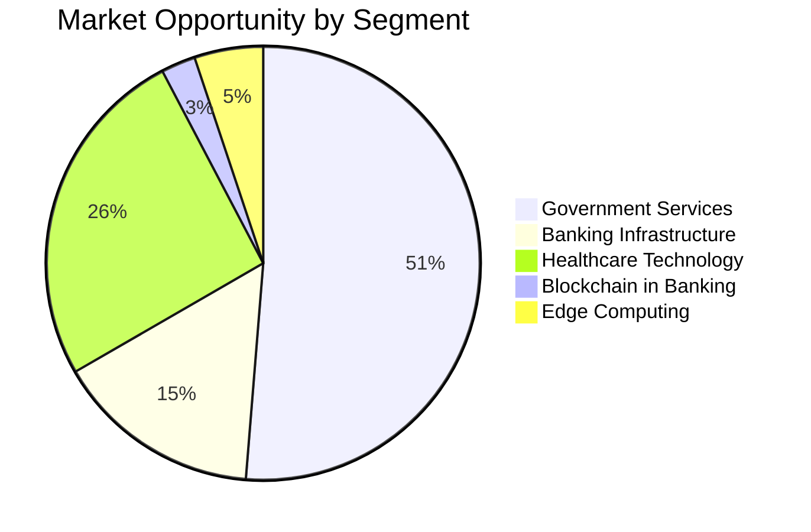
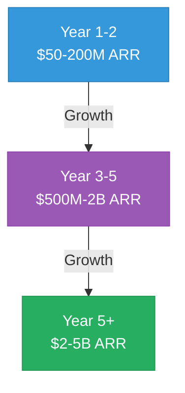

# Mamey Technologies Ecosystem - Executive Summary Deck

**Version**: 1.0  
**Date**: 2024-12-21  
**Organization**: Mamey Technologies (mamey.io)  
**Format**: Presentation (10-15 slides)  
**For**: Investor Meetings, Partner Presentations

---

## Slide 1: Title Slide

# The Complete Sovereign Financial Infrastructure Platform

**Mamey Technologies Ecosystem**

*Production-Ready. Proven. Transformative.*

---

## Slide 2: The Problem

### Current Financial Infrastructure is Fragmented

- Banks use separate systems for core banking, payments, compliance
- Governments operate disconnected systems for identity, voting, services
- Healthcare providers struggle with disconnected patient records
- **Result**: High costs, slow processes, security risks, vendor lock-in

**The Cost**: $65B+ in settlement costs, $100B+ in compliance costs annually

---

## Slide 3: The Solution

### One Unified Ecosystem

**Core Platforms (6) + Future Platforms (2)** that work together seamlessly:

**Core Platforms**:
1. **Banking Libraries & Microservices** - 110+ libraries, 150+ microservices
2. **MameyNode Blockchain** - 24,356+ TPS, production-ready
3. **Government Services** - 20+ use cases, identity, voting
4. **Holistic Medicine** - Healthcare platform with telemedicine
5. **RedWebNetwork** - Social media platform (posts, messaging, groups)
6. **Portable Nodes** - Mobile, offline-capable banking

**Future Platforms** (~65% complete, microservices created):
7. **Pupitre** - Educational platform, AI-first teaching
8. **Casino/MameyCasino** - Gaming platform, provably fair gaming

**Result**: Unified infrastructure, reduced costs, faster processes, data sovereignty

---

## Slide 4: What We've Built

### Production-Ready Technology

- **750,000+ lines** of production code
- **409+ microservices** ready for deployment
- **110+ proprietary libraries** covering all needs
- **35+ blockchain modules** (19 core + 16 specialized) with 500+ functions
- **200+ use cases** across all domains

**Status**: 100% complete (blockchain), 75-85% complete (core platforms), ~65% complete (future platforms - microservices created)

---

## Slide 5: Performance Metrics

### Industry-Leading Performance

| Metric | MameyNode | Visa | Ethereum | Traditional Systems |
|--------|-----------|------|----------|-------------------|
| **TPS** | 24,356+ | 65,000 | 15-30 | 5-100 |
| **Latency** | < 50ms | 100-200ms | 12-15s | Hours/Days |
| **Finality** | 5.9ms | Instant | 12-15s | 1-3 days |
| **Banking Features** | Complete | Limited | None | Partial |

**10.3x faster than Visa** for blockchain operations

---

## Slide 6: Market Opportunity

### $1T+ Total Addressable Market

| Market Segment | Annual Market Size | Target Share | Revenue Potential (Year 5) |
|----------------|-------------------|--------------|---------------------------|
| Banking Infrastructure | $300B | 0.5-1% | $1.5-3B |
| Blockchain in Banking | $50B (2030) | 1-2% | $500M-1B |
| Government Services | $1T | 0.1-0.5% | $1-5B |
| Healthcare Technology | $500B | 0.1-0.3% | $500M-1.5B |
| Edge Computing | $100B | 0.2-0.5% | $200M-500M |
| **Total** | **$1.95T** | **0.2-0.5%** | **$3.7-11B** |

---

## Slide 7: Revenue Model

### Multiple High-Margin Revenue Streams

1. **Dual Licensing** (80-90% margin)
   - Commercial licenses: $100K-5M/year per customer
   - Projected: $200-800M/year (Year 3-5)

2. **Banking-as-a-Service** (60-70% margin)
   - Monthly subscription + volume fees
   - Projected: $300-1.5B/year (Year 3-5)

3. **Network Fees** (70-80% margin)
   - Transaction fees: 0.1-5 bps per transaction
   - Projected: $200-1B/year (Year 3-5)

4. **Implementation & Consulting** (50-60% margin)
   - Integration services: $500K-5M per project
   - Projected: $100-500M/year (Year 3-5)

**Total Projected Revenue**: $2-5 billion ARR by Year 5+

---

## Slide 8: Financial Projections

### Growth Trajectory

| Year | ARR | Customers | Gross Margin | Operating Margin |
|------|-----|-----------|--------------|------------------|
| Year 1-2 | $50-200M | 30-200 | 75-85% | 10-20% |
| Year 3-5 | $500M-2B | 200-1000 | 75-85% | 20-50% |
| Year 5+ | $2-5B | 1000-2000 | 75-85% | 30-50% |

**Valuation Potential**: $10B-50B (Year 5+, based on 5-10x revenue multiples)

---

## Slide 9: Competitive Advantages

### Why We Win

✅ **Complete Ecosystem** - Only platform with complete financial infrastructure  
✅ **Proprietary Technology** - Own the core libraries and frameworks  
✅ **Production Ready** - 100% complete, not prototypes  
✅ **Exceptional Performance** - 10.3x faster than Visa  
✅ **Seamless Integration** - All systems work together  
✅ **Data Sovereignty** - Complete control over data  
✅ **Multiple Verticals** - Banking, government, healthcare

**No Direct Competitor** with same comprehensive offering

---

## Slide 10: Use Cases

### Real-World Applications

**Banking**
- Cross-border payments: 1-3 days → 5.9ms
- CBDC infrastructure for central banks
- Real-time settlement (RTGS)
- Trade finance, treasury, custody

**Government**
- Digital identity with DID and verifiable credentials
- Secure voting and elections
- Document verification (passports, IDs)
- Tax collection, social services

**Healthcare**
- Patient records management
- Telemedicine infrastructure
- Wellness tracking
- HIPAA/GDPR compliance

---

## Slide 11: Technology Stack

### Modern, Scalable Architecture

- **Blockchain**: Rust-based, DPoS consensus, modular (35+ modules: 19 core + 16 specialized)
- **Microservices**: .NET Core, CQRS, Event Sourcing, DDD
- **Databases**: PostgreSQL, MongoDB, Redis, LMDB
- **Message Brokers**: RabbitMQ, Kafka
- **Infrastructure**: Docker, Kubernetes, cloud-agnostic
- **Security**: Military-grade encryption, zero-trust architecture

**Deployment**: On-premise, cloud, hybrid - customer choice

---

## Slide 12: Team & Execution

### Proven Track Record

- **Development Investment**: $17M+ across all platforms
- **Codebase**: 750,000+ lines of production code
- **Microservices**: 409+ production-ready services
- **Performance**: Proven benchmarks (24,356+ TPS measured)
- **Status**: Production-ready, not prototypes

**Partnerships**: Futurehead Group (strategic), S&K Holding QT (infrastructure)

---

## Slide 13: Investment Opportunity

### The Ask

**Target**: $5-15 million  
**Valuation**: $20-40 million pre-money  
**Use of Funds**:
- 35% Sales & Marketing
- 30% Product Development
- 20% Operations
- 10% Business Development
- 5% Research & Development

**Expected Returns**: 50-500x (depending on scenario)

---

## Slide 14: Next Steps

### Join Us in Building the Future

1. **Review Documentation** - Complete due diligence package
2. **Technical Demo** - See the platforms in action
3. **Customer References** - Speak with pilot customers
4. **Financial Models** - Detailed financial projections
5. **Investment Discussion** - Structure and terms

**Contact**:  
Email: investment@mamey.io  
Website: mamey.io

---

## Slide 15: Contact

# Mamey Technologies

**Building better financial infrastructure for the sovereign era**

**Contact Information**:
- Email: info@mamey.io
- Investment: investment@mamey.io
- Partners: partners@mamey.io
- Website: mamey.io

**Confidential**: This presentation contains proprietary information. Distribution is restricted to authorized parties only.

---

**End of Presentation**

