# Mamey Technologies Ecosystem - Architecture Overview

**Version**: 1.0  
**Date**: 2024-12-21  
**Organization**: Mamey Technologies (mamey.io)  
**Audience**: Technical Partners, System Integrators, Architects  
**Purpose**: Technical overview of ecosystem architecture and integration

---

## Executive Summary

The Mamey Technologies ecosystem is built on a **unified modular architecture** that enables seamless integration across six core platforms plus two future platforms. This document provides a technical overview of the architecture, integration patterns, and deployment options for partners and system integrators.

---

## Ecosystem Architecture

### High-Level Architecture

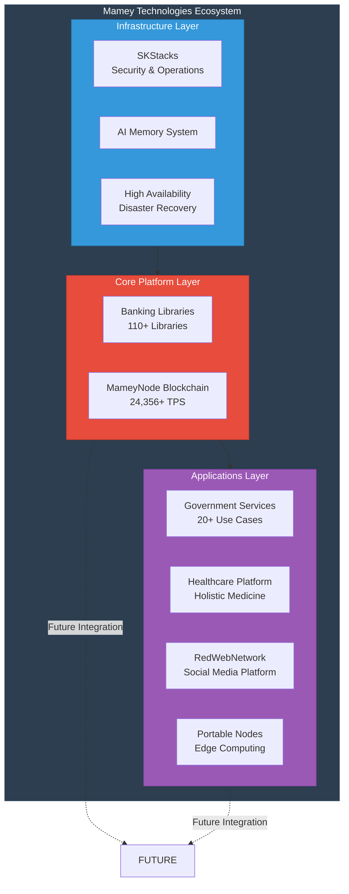

---

## Platform Architecture

### 1. Banking Libraries & Microservices

**Architecture Pattern**: Modular Microservices with CQRS

```mermaid
graph TB
    subgraph BANKING["Banking Libraries Architecture"]
        subgraph FOUNDATION["Foundation Layer"]
            CORE[Core Framework<br/>110+ Libraries]
            CQRS[CQRS Layer<br/>Command/Query Separation]
            PERSIST[Persistence Layer<br/>PostgreSQL, MongoDB, Redis]
        end
        
        subgraph MICRO["Microservices Layer<br/>150+ Services"]
            ACC[Account Management]
            PAY[Payment Processing]
            TXN[Transaction Routing]
            COMP[Compliance Checking]
            RPT[Reporting]
            RISK[Risk Management]
        end
        
        subgraph INTEG["Integration Layer"]
            MSG[Message Brokers<br/>RabbitMQ, Kafka]
            API[API Gateway<br/>REST, gRPC]
            DISC[Service Discovery<br/>Consul]
        end
    end
    
    FOUNDATION --> MICRO
    MICRO --> INTEG
    
    style BANKING fill:#3498db,stroke:#2980b9,color:#fff
    style FOUNDATION fill:#5dade2,stroke:#3498db,color:#000
    style MICRO fill:#85c1e2,stroke:#5dade2,color:#000
    style INTEG fill:#aed6f1,stroke:#85c1e2,color:#000
```

**Key Components**:
- **110+ Libraries**: Modular .NET libraries
- **150+ Microservices**: Independently deployable services
- **CQRS Pattern**: Command/Query separation
- **Event Sourcing**: Complete event history
- **DDD Patterns**: Domain-driven design

**Integration Points**:
- Direct integration with MameyNode blockchain
- Shared identity with Government Services
- Common compliance framework

---

### 2. MameyNode Blockchain

**Architecture Pattern**: Modular Rust Workspace with 19 Crates

```mermaid
graph TB
    subgraph BLOCKCHAIN["MameyNode Blockchain Architecture"]
        subgraph CORE_LAYER["Core Layer"]
            CORE_MOD[Core Module<br/>Data Structures]
            CONSENSUS[Consensus<br/>DPoS]
            NETWORK[Network<br/>P2P Protocol]
        end
        
        subgraph LEDGER["Ledger Layer"]
            BLOCK[Block Processing]
            STATE[State Management]
            FORK[Fork Detection]
            MEMPOOL[Mempool]
        end
        
        subgraph APP_LAYER["Application Layer<br/>9 Modules"]
            BANK[Banking]
            PAYMENTS[Payments]
            LEND[Lending]
            DEX[DEX]
            COMPLIANCE[Compliance]
            GOV[Government]
            BRIDGE[Bridge]
            UPG[UPG]
            ADV[Advanced Features]
        end
        
        subgraph API_LAYER["API Layer"]
            JSONRPC[JSON-RPC]
            WS[WebSocket]
            GRPC[gRPC<br/>9+ Services]
        end
    end
    
    CORE_LAYER --> LEDGER
    LEDGER --> APP_LAYER
    APP_LAYER --> API_LAYER
    
    style BLOCKCHAIN fill:#e74c3c,stroke:#c0392b,color:#fff
    style CORE_LAYER fill:#ec7063,stroke:#e74c3c,color:#000
    style LEDGER fill:#f1948a,stroke:#ec7063,color:#000
    style APP_LAYER fill:#f5b7b1,stroke:#f1948a,color:#000
    style API_LAYER fill:#fadbd8,stroke:#f5b7b1,color:#000
```

**Key Components**:
- **35+ Modules**: 19 core modules + 16 specialized modules
- **500+ Functions**: Comprehensive functionality
- **200+ Use Cases**: Banking, payments, lending, DEX, compliance
- **DPoS Consensus**: Delegated Proof-of-Stake
- **Performance**: 24,356+ TPS per node

**Integration Points**:
- Banking Libraries → MameyNode: Direct blockchain integration
- MameyNode → Government Services: Identity verification
- MameyNode → All Platforms: Shared blockchain infrastructure

---

### 3. Government Services

**Architecture Pattern**: Microservices with Identity-First Design

```
┌─────────────────────────────────────────────────────────┐
│            Government Services Architecture             │
├─────────────────────────────────────────────────────────┤
│                                                          │
│  ┌────────────────────────────────────────────────────┐ │
│  │         Identity Layer (DID, Verifiable Creds)    │ │
│  └────────────────────────────────────────────────────┘ │
│                          │                              │
│  ┌───────────────────────▼───────────────────────────┐ │
│  │         Services Layer (20+ Use Cases)              │ │
│  ├────────────────────────────────────────────────────┤ │
│  │ • Identity Mgmt  • Document Verification          │ │
│  │ • Voting         • Tax Services                   │ │
│  │ • Citizenship    • Land Registry                  │ │
│  │ • Social Services • Business Registry             │ │
│  └────────────────────────────────────────────────────┘ │
│                                                          │
│  ┌────────────────────────────────────────────────────┐ │
│  │         Integration Layer                         │ │
│  │ • Blockchain Integration (MameyNode)               │ │
│  │ • Healthcare Integration (Holistic Medicine)      │ │
│  │ • Banking Integration (Banking Libraries)          │ │
│  └────────────────────────────────────────────────────┘ │
└─────────────────────────────────────────────────────────┘
```

**Key Components**:
- **Identity Management**: DID anchoring, verifiable credentials
- **Document Verification**: Passports, IDs, certificates
- **Voting System**: Secure elections and referendums
- **20+ Use Cases**: Complete government operations

**Integration Points**:
- Government Services → MameyNode: Immutable records
- Government Services → Healthcare: Health records
- Government Services → Banking: Identity verification

---

## Integration Architecture

### Platform Integration Flow

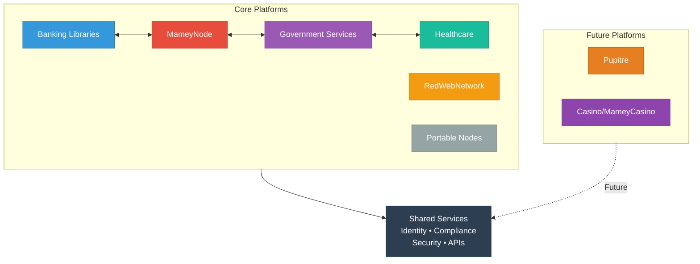

### Data Flow Architecture

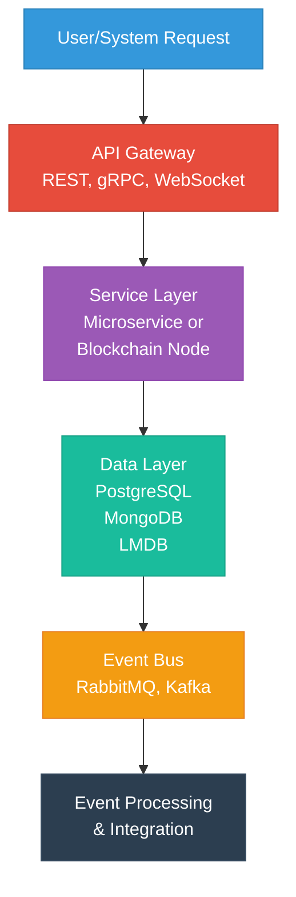

---

## API Integration Points

### RESTful APIs

**Base URL**: `https://api.mamey.io/v1`

**Endpoints**:
- `/banking/*` - Banking operations
- `/blockchain/*` - Blockchain operations
- `/government/*` - Government services
- `/healthcare/*` - Healthcare services
- `/network/*` - Network operations

**Authentication**: JWT tokens, API keys, OAuth 2.0

### gRPC Services

**MameyNode gRPC Services** (9+ services):
- `BankingService` - Banking operations
- `PaymentService` - Payment processing
- `LendingService` - Lending operations
- `DEXService` - Decentralized exchange
- `ComplianceService` - Compliance checking
- `GovernmentService` - Government operations
- `IdentityService` - Identity management
- `NetworkService` - Network operations
- `MetricsService` - Metrics and observability

### WebSocket APIs

**Real-time Updates**:
- Transaction confirmations
- Block notifications
- Event streams
- Status updates

---

## Deployment Pipeline

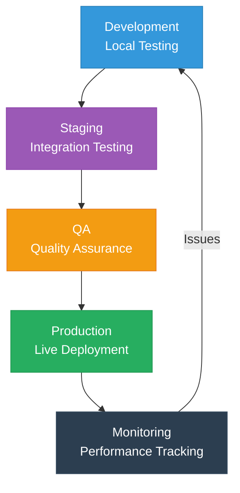

---

## Deployment Architecture

### Deployment Options

```
┌─────────────────────────────────────────────────────────┐
│                  Deployment Architecture                 │
├─────────────────────────────────────────────────────────┤
│                                                          │
│  Option 1: On-Premise                                  │
│  ┌────────────────────────────────────────────────────┐ │
│  │ Customer Infrastructure                            │ │
│  │ • Docker/Kubernetes                               │ │
│  │ • Full control over data                          │ │
│  │ • Air-gapped deployment possible                      │ │
│  └────────────────────────────────────────────────────┘ │
│                                                          │
│  Option 2: Cloud (Managed)                             │
│  ┌────────────────────────────────────────────────────┐ │
│  │ Mamey Cloud Infrastructure                        │ │
│  │ • Multi-tenant or dedicated                       │ │
│  │ • Managed services                                │ │
│  │ • SLA guarantees                                  │ │
│  └────────────────────────────────────────────────────┘ │
│                                                          │
│  Option 3: Hybrid                                      │
│  ┌────────────────────────────────────────────────────┐ │
│  │ Combination of On-Premise + Cloud                 │ │
│  │ • Sensitive data on-premise                       │ │
│  │ • Public services in cloud                        │ │
│  │ • Synchronized data                                │ │
│  └────────────────────────────────────────────────────┘ │
└─────────────────────────────────────────────────────────┘
```

### Container Architecture

**Docker Containers**:
- Each microservice in its own container
- Blockchain nodes as containers
- Database containers (PostgreSQL, MongoDB, Redis)
- Message broker containers (RabbitMQ, Kafka)
- API gateway containers

**Orchestration**:
- Kubernetes for production deployments
- Docker Swarm for smaller deployments
- Helm charts for package management

---

## Security Architecture

### Security Layers

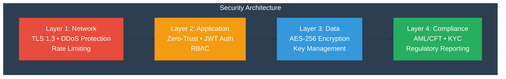

---

## Scalability Architecture

### Scaling Strategy

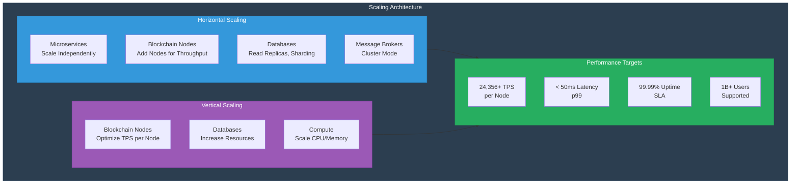

### Horizontal Scaling

- **Microservices**: Scale independently based on load
- **Blockchain Nodes**: Add nodes for increased throughput
- **Databases**: Read replicas, sharding
- **Message Brokers**: Cluster mode for high availability

### Vertical Scaling

- **Blockchain Nodes**: Optimize for higher TPS per node
- **Databases**: Increase resources for larger datasets
- **Compute**: Scale CPU/memory for processing

### Performance Targets

- **Throughput**: 24,356+ TPS per blockchain node
- **Latency**: < 50ms (p99) for API calls
- **Availability**: 99.99% uptime SLA
- **Scalability**: Support for 1 billion+ users

---

## Monitoring & Observability

### Monitoring Architecture

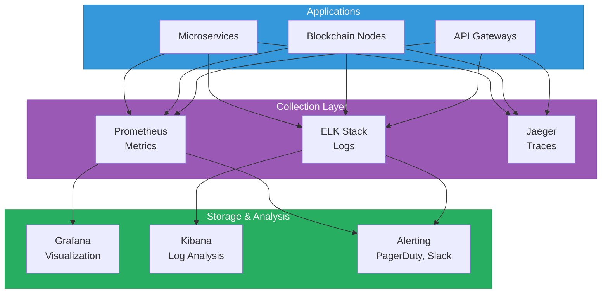

### Monitoring Stack

- **Metrics**: Prometheus, Grafana
- **Logging**: ELK Stack (Elasticsearch, Logstash, Kibana)
- **Tracing**: Jaeger for distributed tracing
- **Alerting**: PagerDuty, Slack integration

### Key Metrics

- **Performance**: TPS, latency, throughput
- **Availability**: Uptime, error rates
- **Business**: Transaction volume, user count
- **Infrastructure**: CPU, memory, disk, network

---

## Integration Patterns

### Pattern 1: Direct API Integration

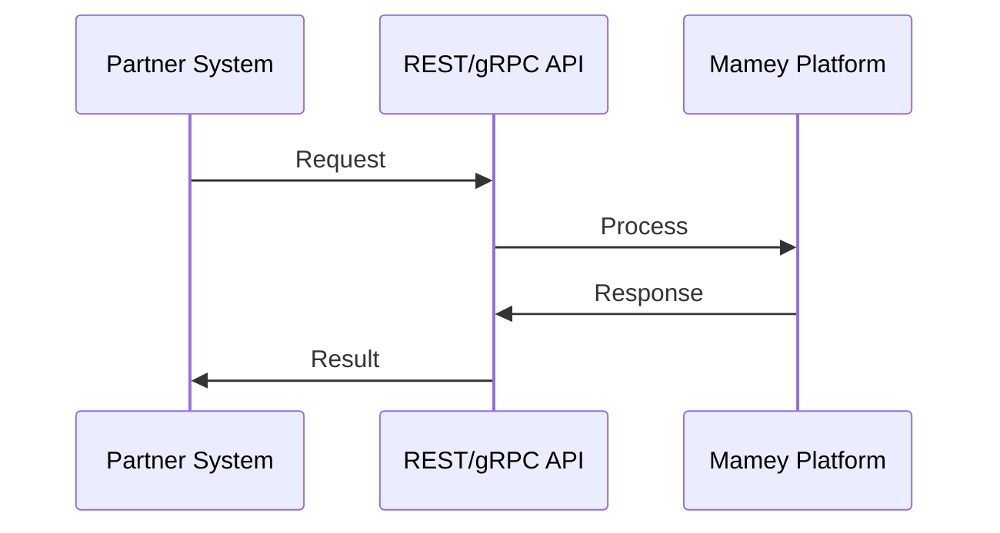

**Use Cases**: Real-time operations, synchronous requests

### Pattern 2: Event-Driven Integration


**Use Cases**: Asynchronous operations, event processing

### Pattern 3: Blockchain Integration

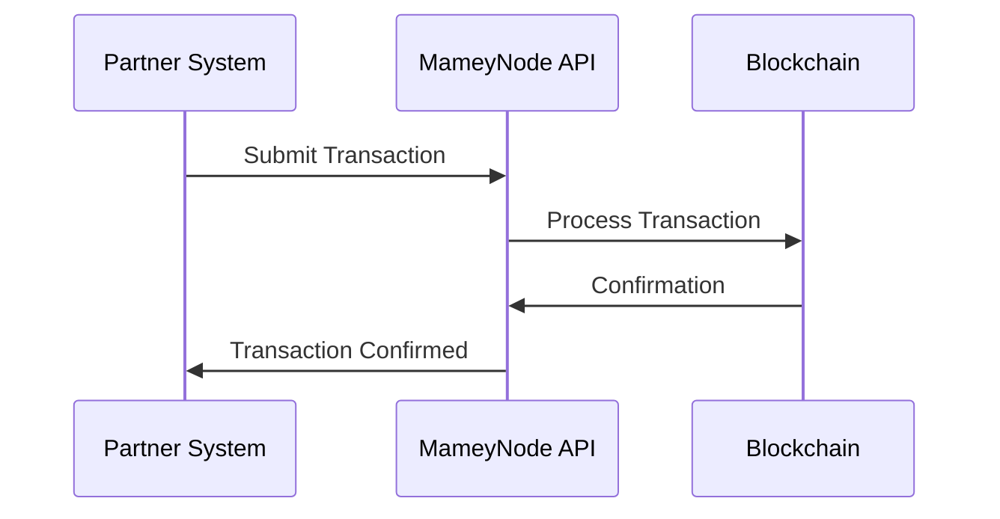

**Use Cases**: Immutable records, decentralized operations

### Pattern 4: Hybrid Integration

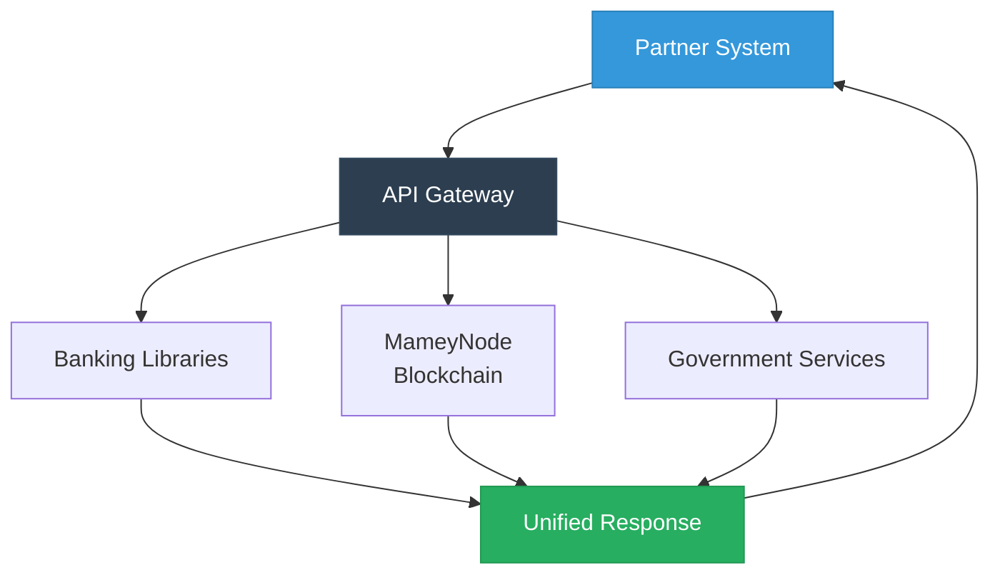

**Use Cases**: Complex workflows, multi-platform operations

---

## SDKs and Tools

### Available SDKs

- **.NET SDK**: For Banking Libraries integration
- **Rust SDK**: For MameyNode blockchain
- **JavaScript/TypeScript SDK**: For web applications
- **Python SDK**: For data analysis and automation
- **Go SDK**: For high-performance integrations

### Development Tools

- **CLI Tools**: Command-line interface for operations
- **Testing Tools**: Integration testing frameworks
- **Documentation**: Complete API documentation
- **Code Examples**: Sample integrations

---

## Next Steps for Partners

1. **Review Architecture**: Understand integration patterns
2. **Choose Integration Method**: API, SDK, or event-driven
3. **Set Up Development Environment**: Access to sandbox/testnet
4. **Develop Integration**: Use SDKs and documentation
5. **Test Integration**: Comprehensive testing in sandbox
6. **Deploy to Production**: With support from Mamey team

---

## Contact

**Technical Partnerships**:  
Email: partners@mamey.io  
Documentation: docs.mamey.io  
Support: support@mamey.io

**Mamey Technologies** - Building better financial infrastructure for the sovereign era

*This document contains technical information. For business inquiries, see the Executive Summary Deck.*


