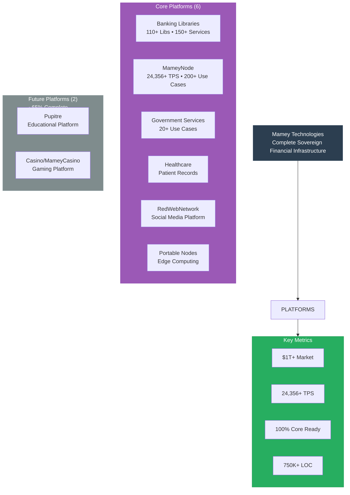

# Mamey Technologies Ecosystem - Infographic Description

**Version**: 1.0  
**Date**: 2024-12-21  
**Organization**: Mamey Technologies (mamey.io)  
**Purpose**: Visual infographic description for design conversion  
**For**: Marketing materials, presentations, website

---

## Infographic Layout Description

### Visual Structure

---

## Color Scheme Recommendations

### Primary Colors
- **Primary Blue**: #2C3E50 (Dark blue for headers)
- **Accent Blue**: #3498DB (Bright blue for highlights)
- **Success Green**: #27AE60 (For checkmarks, success metrics)
- **Warning Orange**: #F39C12 (For important callouts)
- **Error Red**: #E74C3C (For critical metrics)

### Platform Colors
- **Banking Libraries**: #3498DB (Blue)
- **MameyNode**: #E74C3C (Red)
- **Government Services**: #9B59B6 (Purple)
- **Healthcare**: #1ABC9C (Teal)
- **RedWebNetwork**: #F39C12 (Orange)
- **Portable Nodes**: #95A5A6 (Gray)
- **Pupitre**: #E67E22 (Dark Orange)
- **Casino/MameyCasino**: #8E44AD (Dark Purple)

---

## Icon Recommendations

### Platform Icons
- **Banking Libraries**: Building/Stack icon
- **MameyNode**: Blockchain/Network icon
- **Government Services**: Government building/Shield icon
- **Healthcare**: Medical cross/Heart icon
- **RedWebNetwork**: Social media/Network icon
- **Portable Nodes**: Mobile device/Satellite icon
- **Pupitre**: Education/Book icon
- **Casino/MameyCasino**: Gaming/Cards icon

### Metric Icons
- **Performance**: Speedometer/Gauge
- **Market**: Globe/World map
- **Technology**: Code brackets/CPU
- **Security**: Shield/Lock
- **Integration**: Connected nodes/Network

---

## Typography Recommendations

### Headers
- **Main Title**: Bold, 48-72pt, Sans-serif (e.g., Montserrat, Roboto)
- **Section Headers**: Bold, 24-36pt, Sans-serif
- **Subsection Headers**: Semi-bold, 18-24pt, Sans-serif

### Body Text
- **Body**: Regular, 12-16pt, Sans-serif (readable)
- **Metrics**: Bold, 18-24pt, Sans-serif (stand out)
- **Labels**: Regular, 10-12pt, Sans-serif

---

## Layout Guidelines

### Section Spacing
- **Top Margin**: 40-60px
- **Section Spacing**: 30-40px
- **Element Spacing**: 20-30px
- **Bottom Margin**: 40-60px

### Grid System
- **Columns**: 12-column grid
- **Gutter**: 20-30px
- **Margins**: 40-60px on sides

### Visual Hierarchy
1. **Primary**: Main title and key metrics (largest)
2. **Secondary**: Platform cards and major sections
3. **Tertiary**: Supporting information and details

---

## Interactive Elements (for Digital Version)

### Hover Effects
- Platform cards: Slight scale-up (1.05x) and shadow
- Metrics: Highlight with accent color
- Buttons: Color change and slight lift

### Animations (Optional)
- **Entrance**: Fade-in from bottom
- **Metrics**: Count-up animation
- **Platforms**: Staggered appearance

---

## Print Specifications

### Dimensions
- **Standard**: 8.5" x 11" (Letter) or A4
- **Large Format**: 11" x 17" (Tabloid) or A3
- **Poster**: 24" x 36" or larger

### Resolution
- **Print**: 300 DPI minimum
- **Digital**: 72-150 DPI (web), 300 DPI (high-res)

### File Formats
- **Vector**: SVG, PDF (for scalability)
- **Raster**: PNG (high-res), JPG (compressed)

---

## Usage Recommendations

### Where to Use
- **Investor Presentations**: Slide backgrounds, handouts
- **Partner Meetings**: Leave-behind materials
- **Website**: Hero section, about page
- **Marketing Materials**: Brochures, flyers
- **Trade Shows**: Booth displays, banners

### Customization
- **White Label**: Remove branding for partners
- **Regional**: Add local market data
- **Vertical-Specific**: Highlight relevant platforms
- **Language**: Translate for international markets

---

## Data Visualization Recommendations

### Charts/Graphs
- **Market Size**: Pie chart or bar chart
- **Revenue Growth**: Line chart with projections
- **Performance Comparison**: Bar chart vs competitors
- **Platform Distribution**: Donut chart or treemap

### Progress Indicators
- **Development Status**: Progress bars per platform
- **Revenue Projections**: Funnel or growth curve
- **Market Penetration**: Gauge or meter

---

## Call-to-Action Elements

### Primary CTA
- **Text**: "Learn More" or "Get Started"
- **Style**: Prominent button, contrasting color
- **Placement**: Bottom center or top right

### Secondary CTAs
- **Contact**: "Contact Us"
- **Investment**: "Investment Inquiries"
- **Partnership**: "Partner With Us"

---

## Accessibility Considerations

### Color Contrast
- **Text on Background**: Minimum 4.5:1 ratio
- **Large Text**: Minimum 3:1 ratio
- **Interactive Elements**: Clear focus states

### Text Alternatives
- **Icons**: Include text labels
- **Charts**: Provide data tables
- **Images**: Alt text descriptions

---

## Brand Guidelines

### Logo Placement
- **Top Left**: Primary logo
- **Bottom Right**: Secondary/watermark logo
- **Size**: Proportional, not overwhelming

### Brand Colors
- Use Mamey brand colors consistently
- Maintain color associations (blue = banking, etc.)

---

## Design Notes

This infographic should be:
- **Visually Striking**: Eye-catching and memorable
- **Information-Dense**: Packed with key metrics
- **Easy to Scan**: Clear visual hierarchy
- **Professional**: Enterprise-grade quality
- **Versatile**: Works in multiple formats and sizes

---

## Contact for Design

**Design Requests**:  
Email: design@mamey.io  
Brand Guidelines: Available upon request

**Mamey Technologies** - Building better financial infrastructure for the sovereign era

*This document provides specifications for creating visual infographics. For actual design work, contact the design team.*
