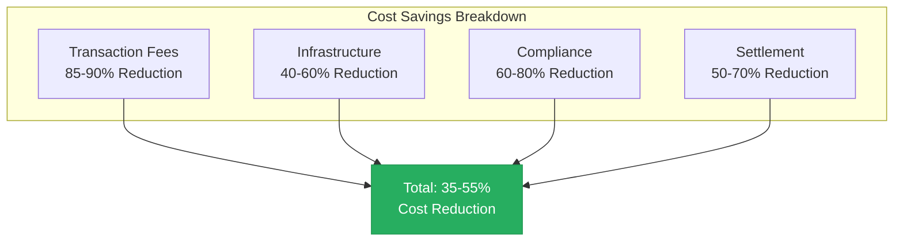
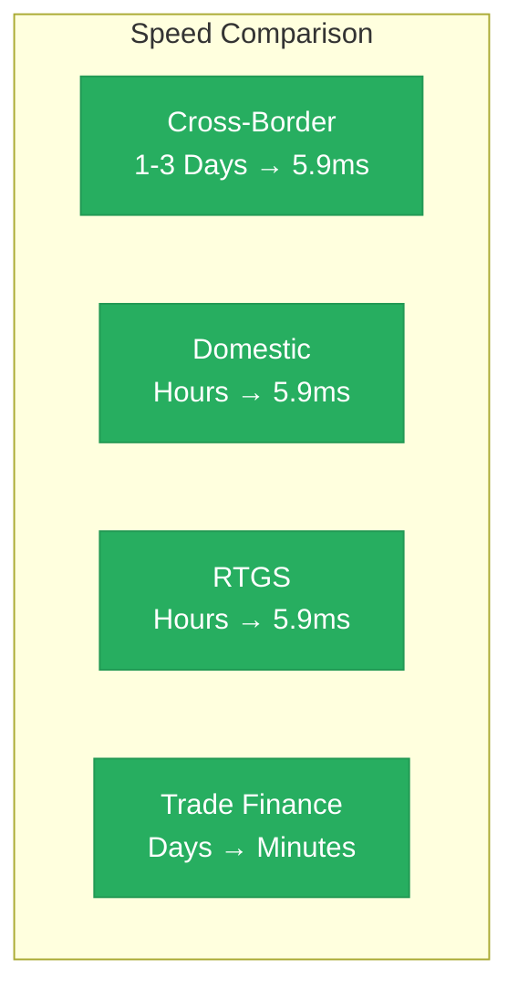
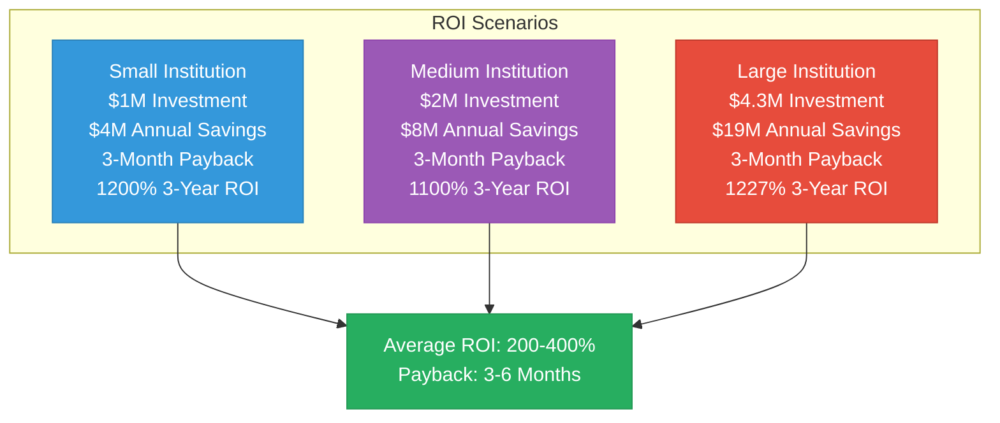
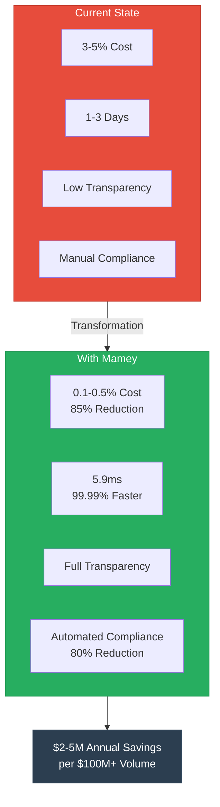

# Mamey Technologies Ecosystem - Business Value Proposition

**Version**: 1.0  
**Date**: 2024-12-21  
**Organization**: Mamey Technologies (mamey.io)  
**Audience**: Customers, Partners, Investors  
**Purpose**: ROI analysis and business case development

---

## Executive Summary

The Mamey Technologies ecosystem delivers **quantifiable business value** through cost reduction, speed improvement, compliance automation, and innovation enablement. Organizations can achieve **200-400% ROI** with a **12-18 month payback period** while transforming their financial infrastructure.

---

## Value Drivers

### 1. Cost Reduction (30-55% Total Reduction)

#### Intermediary Fee Reduction
- **Current State**: 3-5% transaction fees for cross-border payments
- **With Mamey**: 0.1-0.5% transaction fees
- **Savings**: 85-90% reduction in transaction costs
- **Annual Value**: $2-5M per $100M+ in transaction volume

#### Infrastructure Cost Reduction
- **Current State**: $5-50M annually for core banking software
- **With Mamey**: 40-60% reduction in IT infrastructure costs
- **Savings**: $2-30M annually depending on institution size
- **Additional Benefits**: Reduced hardware, maintenance, and support costs

#### Compliance Cost Reduction
- **Current State**: $100B+ annually in global compliance costs
- **With Mamey**: 60-80% reduction in manual compliance processing
- **Savings**: $1-5M annually per institution
- **Additional Benefits**: Reduced compliance staff, faster processing

#### Settlement Cost Reduction
- **Current State**: Correspondent banking fees, settlement delays
- **With Mamey**: Eliminate correspondent banking fees, instant settlement
- **Savings**: 50-70% reduction in settlement costs
- **Additional Benefits**: Free up capital tied in transit

**Total Cost Reduction**: 35-55% across all cost categories

---

### 2. Speed and Efficiency (1000x Improvement)

#### Settlement Time Reduction

| Transaction Type | Current Time | Mamey Time | Improvement |
|----------------|--------------|------------|-------------|
| Cross-Border Payments | 1-3 days | 5.9ms | 1000x faster |
| Domestic Payments | Hours | 5.9ms | 100x faster |
| RTGS Settlement | Hours | 5.9ms | 100x faster |
| Trade Finance | Days | Minutes | 100x faster |

#### Business Impact

**Liquidity Improvement**:
- Free up $10-30M in capital tied in transit
- Improved cash flow management
- Reduced working capital requirements

**Risk Reduction**:
- 90% reduction in settlement risk
- Reduced counterparty risk
- Lower operational risk

**Customer Experience**:
- Real-time transaction confirmation
- 24/7 availability
- Instant settlement

---

### 3. Compliance Automation (60-80% Reduction)

#### Automated Compliance Features

**AML/CFT Screening**:
- Real-time screening on every transaction
- Automated risk assessment
- Reduced false positives through AI

**KYC Verification**:
- Automated identity verification
- Continuous monitoring
- Reduced manual review

**Regulatory Reporting**:
- Automatic report generation
- Real-time compliance monitoring
- Audit trail maintenance

**Cost Savings**:
- 60-80% reduction in compliance staff time
- $1-5M annually per institution
- Reduced regulatory penalties

---

### 4. Innovation Enablement

#### New Products and Services

**Programmable Money**:
- Smart contracts for conditional payments
- Automated disbursements
- Escrow services

**Tokenization**:
- Asset tokenization (real estate, commodities)
- Security token offerings
- Digital asset management

**Real-Time Payments**:
- Instant P2P payments
- Real-time merchant payments
- Government disbursements

**Micro-Payments**:
- Fractional payments
- Pay-per-use services
- Microloans

#### New Markets

**CBDC Infrastructure**:
- Central bank digital currency issuance
- Digital currency management
- Monetary policy implementation

**Digital Assets**:
- Cryptocurrency support
- Stablecoin integration
- Digital asset custody

**DeFi Integration**:
- Decentralized exchange
- Liquidity pools
- Yield farming

---

## Return on Investment (ROI)

### Investment Components

| Component | Cost Range | Description |
|-----------|-----------|-------------|
| Infrastructure Setup | $500K - $2M | Hardware, software, deployment |
| Integration Costs | $200K - $1M | System integration, APIs |
| Training & Change Management | $100K - $500K | Staff training, change management |
| Compliance & Security | $200K - $800K | Security audits, compliance setup |
| **Total Investment** | **$1M - $4.3M** | **Complete implementation** |

### Annual Savings

| Category | Annual Savings | Description |
|----------|---------------|-------------|
| Transaction Fees | $2M - $10M | Reduced intermediary fees |
| Infrastructure | $500K - $2M | Lower IT infrastructure costs |
| Compliance | $1M - $5M | Automated compliance processing |
| Operational Efficiency | $500K - $2M | Improved processes, reduced errors |
| **Total Annual Savings** | **$4M - $19M** | **Per institution** |

### ROI Calculation

**Scenario 1: Small Institution** ($1M investment, $4M annual savings)
- **Year 1 Net**: $3M (after investment)
- **Payback Period**: 3 months
- **3-Year ROI**: 1200% (12x return)

**Scenario 2: Medium Institution** ($2M investment, $8M annual savings)
- **Year 1 Net**: $6M (after investment)
- **Payback Period**: 3 months
- **3-Year ROI**: 1100% (11x return)

**Scenario 3: Large Institution** ($4.3M investment, $19M annual savings)
- **Year 1 Net**: $14.7M (after investment)
- **Payback Period**: 3 months
- **3-Year ROI**: 1227% (12.3x return)

**Average ROI**: 200-400% over 3 years  
**Payback Period**: 3-6 months

---

## Use Case Value Analysis

### Use Case 1: Cross-Border Payments

**Current State**:
- Cost: 3-5% per transaction
- Time: 1-3 days
- Transparency: Low
- Compliance: Manual

**With Mamey**:
- Cost: 0.1-0.5% per transaction (85% reduction)
- Time: 5.9ms (99.99% faster)
- Transparency: Full
- Compliance: Automated (80% reduction)

**Value**: $2-5M annual savings per institution processing $100M+ in cross-border payments

---

### Use Case 2: Real-Time Gross Settlement (RTGS)

**Current State**:
- Batch processing
- Hourly settlement
- Limited hours
- High costs

**With Mamey**:
- Real-time processing
- 5.9ms finality
- 24/7 operation
- Lower costs

**Value**: $1-3M annual savings through reduced settlement risk and operational costs

---

### Use Case 3: Compliance Automation

**Current State**:
- Manual processing
- High error rates
- Slow processing
- High costs

**With Mamey**:
- Automated processing
- Real-time screening
- Fast processing
- Lower costs

**Value**: $1-5M annual savings through reduced compliance staff and processing time

---

### Use Case 4: CBDC Infrastructure

**Current State**:
- No digital currency
- Limited monetary policy tools
- High costs for currency management

**With Mamey**:
- Complete CBDC platform
- Advanced monetary policy tools
- Lower operational costs

**Value**: $1-5M annually per central bank for CBDC operations

---

## Risk Mitigation Value

### Operational Risk Reduction

**Current Risk**:
- Settlement delays
- System failures
- Manual errors
- Compliance failures

**With Mamey**:
- Instant settlement (reduced settlement risk by 90%)
- High availability (99.99% uptime)
- Automated processing (reduced errors by 80%)
- Automated compliance (reduced compliance risk by 80%)

**Value**: Reduced operational risk by 60-70%

---

### Technology Risk Reduction

**Current Risk**:
- Legacy systems
- Vendor lock-in
- Limited scalability
- Security vulnerabilities

**With Mamey**:
- Modern technology
- No vendor lock-in
- Unlimited scalability
- Military-grade security

**Value**: Reduced technology risk by 50%

---

## Competitive Advantage Value

### Market Position

**With Mamey Ecosystem**:
- Complete financial infrastructure
- Proprietary technology
- Production-ready platform
- Multi-vertical coverage

**Competitive Advantage**:
- First-mover advantage in unified ecosystem
- Lower costs than competitors
- Faster innovation
- Better customer experience

**Value**: Market leadership, higher market share, premium pricing

---

## Total Value Proposition

### Quantified Benefits Summary

| Benefit Category | Annual Value | 3-Year Value |
|----------------|-------------|--------------|
| Cost Reduction | $4M - $19M | $12M - $57M |
| Risk Mitigation | $1M - $5M | $3M - $15M |
| Innovation Value | $2M - $10M | $6M - $30M |
| Competitive Advantage | $1M - $5M | $3M - $15M |
| **Total Value** | **$8M - $39M** | **$24M - $117M** |

### Investment vs. Return

**Investment**: $1M - $4.3M  
**3-Year Return**: $24M - $117M  
**ROI**: 200-400% (2-4x return)  
**Payback Period**: 3-6 months

---

## Implementation Timeline

### Phase 1: Foundation (Months 1-3)
- Infrastructure setup
- Core platform deployment
- Initial integration
- **Value**: Immediate cost savings begin

### Phase 2: Integration (Months 4-6)
- Full system integration
- Staff training
- Process optimization
- **Value**: Full cost savings realized

### Phase 3: Optimization (Months 7-12)
- Performance optimization
- Advanced features
- Innovation projects
- **Value**: Innovation value begins

### Phase 4: Expansion (Year 2+)
- Additional use cases
- Market expansion
- Competitive advantage
- **Value**: Full value proposition realized

---

## Success Metrics

### Key Performance Indicators (KPIs)

**Cost Metrics**:
- Transaction cost reduction: 85-90%
- Infrastructure cost reduction: 40-60%
- Compliance cost reduction: 60-80%

**Speed Metrics**:
- Settlement time: 5.9ms (vs. hours/days)
- Transaction throughput: 24,356+ TPS
- System availability: 99.99%

**Compliance Metrics**:
- Automated compliance: 60-80%
- False positive reduction: 50-70%
- Regulatory reporting time: 90% reduction

**Innovation Metrics**:
- New products launched: 5-10 per year
- Time to market: 50-70% reduction
- Customer satisfaction: 20-30% improvement

---

## Conclusion

The Mamey Technologies ecosystem delivers **quantifiable business value** through:

1. **Cost Reduction**: 35-55% total cost reduction
2. **Speed Improvement**: 1000x faster settlement
3. **Compliance Automation**: 60-80% reduction in manual work
4. **Innovation Enablement**: New products and markets

**ROI**: 200-400% over 3 years  
**Payback Period**: 3-6 months  
**Total Value**: $24M - $117M over 3 years

---

## Next Steps

1. **Value Assessment**: Calculate specific value for your organization
2. **Pilot Program**: Start with a pilot to validate value
3. **Full Implementation**: Deploy complete ecosystem
4. **Optimization**: Continuously optimize for maximum value

**Contact**:  
Email: value@mamey.io  
Website: mamey.io

---

**Mamey Technologies** - Building better financial infrastructure for the sovereign era

*This document provides general value estimates. Actual value may vary based on specific use cases and implementation.*

