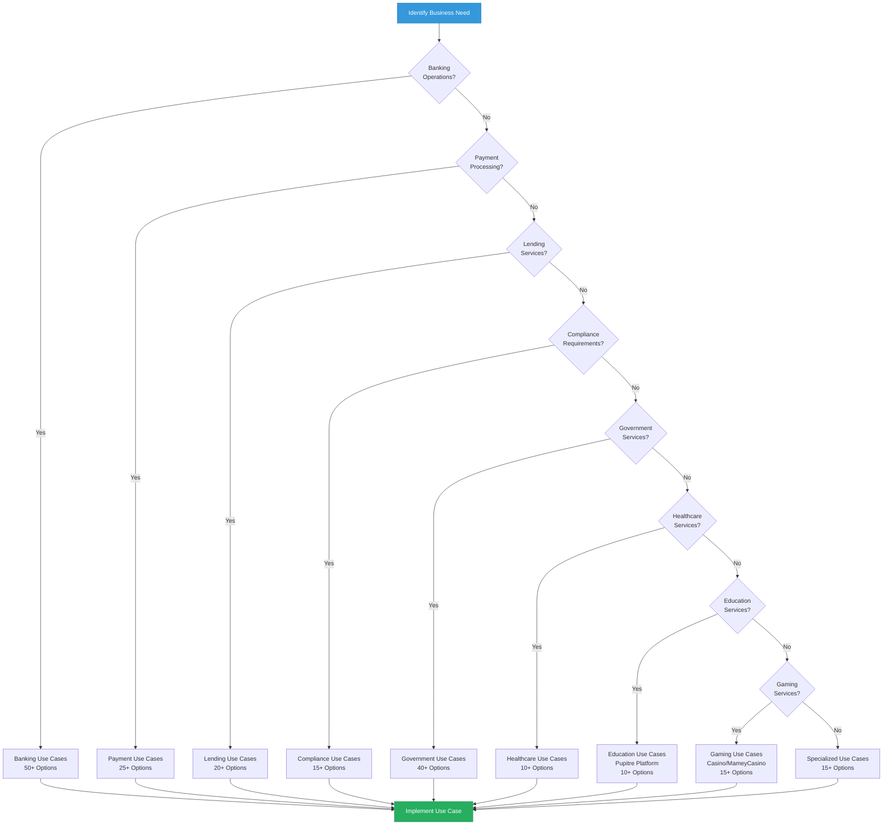
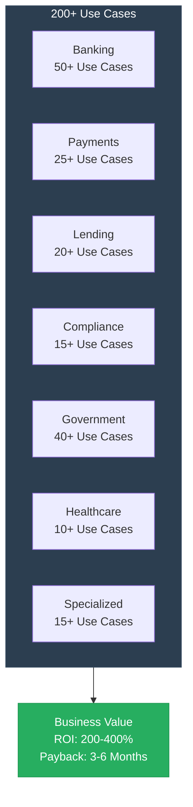
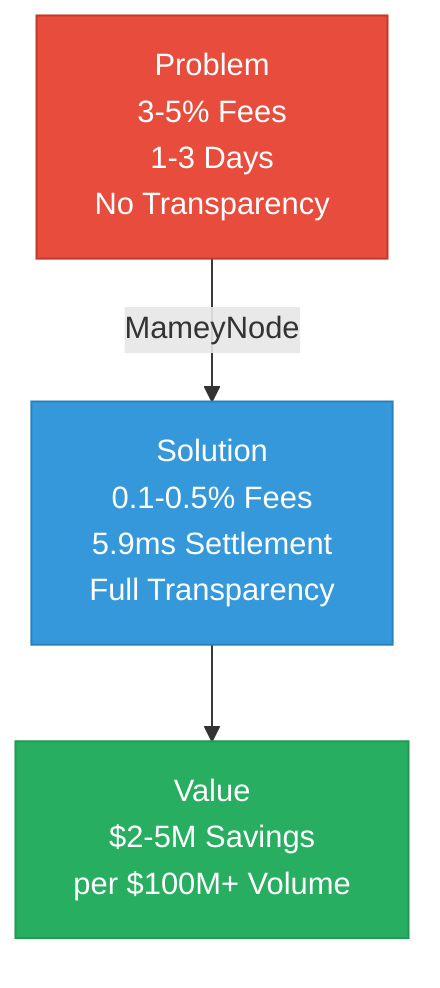

# Mamey Technologies Ecosystem - Use Case Catalog

**Version**: 1.0  
**Date**: 2024-12-21  
**Organization**: Mamey Technologies (mamey.io)  
**Audience**: Customers, Partners, Sales Teams  
**Purpose**: Comprehensive use case reference

---

## Overview

The Mamey Technologies ecosystem supports **200+ use cases** across banking, payments, lending, compliance, government, healthcare, and specialized financial services. This catalog provides detailed use cases with business value and implementation guidance.

### Use Case Selection Guide

---

## Banking Use Cases

### 1. Cross-Border Payments

**Problem**: High costs (3-5%), slow settlement (1-3 days), lack of transparency

**Solution**: MameyNode blockchain with instant settlement (5.9ms), low fees (0.1-0.5%)

**Value**: $2-5M annual savings per $100M+ in transaction volume

**Platforms**: MameyNode, Banking Libraries

**Implementation**: Direct integration with banking systems, API-based

---

### 2. Real-Time Gross Settlement (RTGS)

**Problem**: Batch processing, hourly settlement, limited hours, high costs

**Solution**: Real-time processing, 5.9ms finality, 24/7 operation

**Value**: $1-3M annual savings, reduced settlement risk

**Platforms**: MameyNode, Banking Libraries

**Implementation**: Central bank deployment, interbank integration

---

### 3. Central Bank Digital Currency (CBDC)

**Problem**: No digital currency infrastructure, limited monetary policy tools

**Solution**: Complete CBDC platform with currency issuance, management, and policy tools

**Value**: $1-5M annually per central bank

**Platforms**: MameyNode, Banking Libraries, Government Services

**Implementation**: Central bank deployment, citizen wallet integration

---

### 4. Multi-Currency Accounts

**Problem**: Complex multi-currency management, high FX costs

**Solution**: Unified multi-currency account management with real-time FX

**Value**: 30-50% reduction in FX costs

**Platforms**: Banking Libraries, MameyNode

**Implementation**: Account management system integration

---

### 5. Treasury Management

**Problem**: Manual treasury operations, limited visibility, high costs

**Solution**: Automated treasury management with real-time visibility

**Value**: $500K - $2M annual savings

**Platforms**: Banking Libraries, MameyNode

**Implementation**: Treasury system integration

---

### 6. Custody Services

**Problem**: High custody costs, limited security, manual processes

**Solution**: Hot/warm/cold custody with automated processes

**Value**: 40-60% reduction in custody costs

**Platforms**: Banking Libraries, MameyNode

**Implementation**: Custody system integration

---

### 7. Trade Finance

**Problem**: Paper-based processes, slow processing, high costs

**Solution**: Digital trade finance with letters of credit, bills of lading

**Value**: 50-70% reduction in processing time and costs

**Platforms**: Banking Libraries, MameyNode

**Implementation**: Trade finance system integration

---

### 8. Correspondent Banking

**Problem**: High correspondent banking fees, slow settlement

**Solution**: Direct bank-to-bank settlement, instant processing

**Value**: Eliminate correspondent banking fees, instant settlement

**Platforms**: MameyNode, Banking Libraries

**Implementation**: Correspondent banking network integration

---

## Payment Use Cases

### 9. P2P Payments

**Problem**: Slow processing, high fees, limited availability

**Solution**: Instant P2P payments, low fees, 24/7 availability

**Value**: Improved customer experience, reduced costs

**Platforms**: MameyNode, Banking Libraries

**Implementation**: Payment app integration

---

### 10. Merchant Payments

**Problem**: High processing fees, slow settlement, limited payment methods

**Solution**: Low-cost merchant payments with QR/NFC, instant settlement

**Value**: 30-50% reduction in processing fees

**Platforms**: MameyNode, Banking Libraries

**Implementation**: Payment gateway integration

---

### 11. Remittances

**Problem**: High fees (5-10%), slow processing (1-3 days)

**Solution**: Low-cost remittances (0.1-0.5%), instant processing

**Value**: 85-90% reduction in fees, instant settlement

**Platforms**: MameyNode, Banking Libraries

**Implementation**: Remittance service integration

---

### 12. Bill Payments

**Problem**: Manual bill payment, slow processing, high costs

**Solution**: Automated bill payment and presentment, instant processing

**Value**: Improved customer experience, reduced costs

**Platforms**: MameyNode, Banking Libraries

**Implementation**: Bill payment system integration

---

### 13. Government Disbursements

**Problem**: Slow government payments, high costs, fraud risk

**Solution**: Instant government disbursements with fraud prevention

**Value**: Faster citizen payments, reduced fraud

**Platforms**: MameyNode, Government Services

**Implementation**: Government payment system integration

---

## Lending Use Cases

### 14. Loan Origination

**Problem**: Slow loan processing, high costs, manual underwriting

**Solution**: Automated loan origination with AI-powered underwriting

**Value**: 50-70% reduction in processing time

**Platforms**: Banking Libraries, MameyNode

**Implementation**: Loan origination system integration

---

### 15. Microloans

**Problem**: High processing costs, limited access

**Solution**: Low-cost microloan processing, automated approval

**Value**: Increased access, reduced costs

**Platforms**: MameyNode, Banking Libraries

**Implementation**: Microloan platform integration

---

### 16. Credit Risk Evaluation

**Problem**: Manual credit evaluation, slow processing, high costs

**Solution**: Automated credit risk evaluation with AI

**Value**: 60-80% reduction in evaluation time

**Platforms**: Banking Libraries, MameyNode

**Implementation**: Credit risk system integration

---

## Compliance Use Cases

### 17. AML/CFT Screening

**Problem**: Manual screening, high false positives, slow processing

**Solution**: Automated AML/CFT screening with AI, real-time processing

**Value**: 60-80% reduction in manual work, 50-70% reduction in false positives

**Platforms**: MameyNode, Banking Libraries

**Implementation**: Compliance system integration

---

### 18. KYC Verification

**Problem**: Manual KYC, slow processing, high costs

**Solution**: Automated KYC with identity verification, continuous monitoring

**Value**: 60-80% reduction in processing time

**Platforms**: Government Services, MameyNode

**Implementation**: KYC system integration

---

### 19. Regulatory Reporting

**Problem**: Manual reporting, slow processing, errors

**Solution**: Automated regulatory reporting, real-time generation

**Value**: 90% reduction in reporting time

**Platforms**: Banking Libraries, MameyNode

**Implementation**: Regulatory reporting system integration

---

### 20. Sanctions Screening

**Problem**: Manual screening, slow processing, high costs

**Solution**: Automated sanctions screening, real-time processing

**Value**: 60-80% reduction in processing time

**Platforms**: MameyNode, Banking Libraries

**Implementation**: Sanctions screening system integration

---

## Government Use Cases

### 21. Digital Identity

**Problem**: Fragmented identity systems, limited interoperability

**Solution**: Unified digital identity with DID and verifiable credentials

**Value**: Improved citizen services, reduced fraud

**Platforms**: Government Services, MameyNode

**Implementation**: Identity system integration

---

### 22. Document Verification

**Problem**: Manual verification, slow processing, fraud risk

**Solution**: Automated document verification with blockchain records

**Value**: Faster processing, reduced fraud

**Platforms**: Government Services, MameyNode

**Implementation**: Document verification system integration

---

### 23. Voting and Elections

**Problem**: Paper-based voting, slow counting, fraud risk

**Solution**: Secure electronic voting with blockchain records

**Value**: Faster results, reduced fraud, increased trust

**Platforms**: Government Services, MameyNode

**Implementation**: Voting system integration

---

### 24. Tax Collection

**Problem**: Manual tax collection, slow processing, evasion

**Solution**: Automated tax collection with real-time processing

**Value**: Faster collection, reduced evasion

**Platforms**: Government Services, MameyNode

**Implementation**: Tax system integration

---

### 25. Social Services

**Problem**: Manual distribution, slow processing, fraud risk

**Solution**: Automated social services distribution with identity verification

**Value**: Faster distribution, reduced fraud

**Platforms**: Government Services, MameyNode

**Implementation**: Social services system integration

---

### 26. Land Registry

**Problem**: Paper-based records, slow processing, fraud risk

**Solution**: Digital land registry with blockchain records

**Value**: Faster processing, reduced fraud, increased trust

**Platforms**: Government Services, MameyNode

**Implementation**: Land registry system integration

---

### 27. Business Registry

**Problem**: Manual registration, slow processing

**Solution**: Automated business registration with digital records

**Value**: Faster registration, reduced costs

**Platforms**: Government Services, MameyNode

**Implementation**: Business registry system integration

---

## Healthcare Use Cases

### 28. Patient Records Management

**Problem**: Fragmented records, limited interoperability

**Solution**: Unified patient records with blockchain security

**Value**: Improved care, reduced costs

**Platforms**: Holistic Medicine, Government Services

**Implementation**: Healthcare system integration

---

### 29. Telemedicine

**Problem**: Limited telemedicine infrastructure

**Solution**: Complete telemedicine platform with secure communication

**Value**: Increased access, reduced costs

**Platforms**: Holistic Medicine, RedWebNetwork

**Implementation**: Telemedicine system integration

---

### 30. Wellness Tracking

**Problem**: Limited wellness tracking, fragmented data

**Solution**: Unified wellness tracking with analytics

**Value**: Improved health outcomes

**Platforms**: Holistic Medicine

**Implementation**: Wellness system integration

---

## Education Use Cases (Pupitre Platform)

### 31. AI-First Teaching

**Problem**: Traditional teaching methods, limited personalization, teacher workload

**Solution**: AI-first teaching platform with adaptive AI tutors, personalized learning paths

**Value**: Improved learning outcomes, reduced teacher workload, personalized education

**Platforms**: Pupitre (~65% complete, microservices created)

**Implementation**: Educational platform integration

---

### 32. Student Assessment & Grading

**Problem**: Manual grading, slow feedback, limited analytics

**Solution**: Automated assessment and grading with AI-powered feedback

**Value**: Faster feedback, improved learning, reduced teacher workload

**Platforms**: Pupitre

**Implementation**: Assessment system integration

---

### 33. IEP (Individualized Education Program) Management

**Problem**: Manual IEP management, limited tracking, compliance burden

**Solution**: Automated IEP creation, tracking, and compliance

**Value**: Improved student outcomes, reduced administrative burden

**Platforms**: Pupitre

**Implementation**: IEP system integration

---

### 34. Verifiable Educational Credentials

**Problem**: Paper-based credentials, verification challenges, fraud risk

**Solution**: W3C-compliant verifiable credentials with blockchain records

**Value**: Tamper-proof credentials, instant verification, reduced fraud

**Platforms**: Pupitre, MameyNode (future integration)

**Implementation**: Credential system integration

---

### 35. Gamification & Rewards

**Problem**: Low student engagement, limited motivation

**Solution**: Gamification system with rewards, leaderboards, achievements

**Value**: Increased engagement, improved learning outcomes

**Platforms**: Pupitre

**Implementation**: Gamification system integration

---

## Gaming Use Cases (Casino/MameyCasino Platform)

### 36. Provably Fair Gaming

**Problem**: Opaque RNG systems, trust issues, lack of transparency

**Solution**: Blockchain-native provably fair gaming with cryptographic verification

**Value**: Transparent gaming, increased trust, regulatory compliance

**Platforms**: Casino/MameyCasino (~65% complete, microservices created), MameyNode (future integration)

**Implementation**: Gaming platform integration

---

### 37. AI-Powered Casino Operations

**Problem**: High operational costs, manual dealer operations, limited personalization

**Solution**: AI-first casino engine with AI dealers, fraud detection, personalization

**Value**: 40%+ reduction in operational costs, improved player experience

**Platforms**: Casino/MameyCasino

**Implementation**: Casino operations integration

---

### 38. Responsible Gaming Tools

**Problem**: Limited responsible gaming tools, manual self-exclusion

**Solution**: Built-in responsible gaming with automated self-exclusion, spending limits, time limits

**Value**: Player protection, regulatory compliance, reduced problem gambling

**Platforms**: Casino/MameyCasino

**Implementation**: Responsible gaming system integration

---

### 39. Multi-Game Platform

**Problem**: Limited game selection, high licensing costs

**Solution**: Comprehensive game library with 50+ casino games (table games, slots, instant games, lottery)

**Value**: Complete game selection, reduced licensing costs

**Platforms**: Casino/MameyCasino

**Implementation**: Game platform integration

---

### 40. Hybrid Online/Physical Casino

**Problem**: Separate systems for online and physical casino operations

**Solution**: Unified platform supporting online gaming, live dealer, and physical casino floor management

**Value**: Unified operations, reduced costs, seamless player experience

**Platforms**: Casino/MameyCasino

**Implementation**: Hybrid casino system integration

---

## Specialized Use Cases

### 41. Decentralized Exchange (DEX)

**Problem**: Centralized exchanges, high fees, limited control

**Solution**: Decentralized exchange with AMM, liquidity pools

**Value**: Lower fees, increased control

**Platforms**: MameyNode

**Implementation**: DEX integration

---

### 42. Asset Tokenization

**Problem**: Limited asset liquidity, high transaction costs

**Solution**: Asset tokenization with blockchain records

**Value**: Increased liquidity, reduced costs

**Platforms**: MameyNode, Banking Libraries

**Implementation**: Tokenization system integration

---

### 43. Escrow Services

**Problem**: Manual escrow, slow processing, high costs

**Solution**: Automated escrow with smart contracts

**Value**: Faster processing, reduced costs

**Platforms**: MameyNode

**Implementation**: Escrow system integration

---

### 34. Insurance Services

**Problem**: Manual processing, slow claims, high costs

**Solution**: Automated insurance with smart contracts

**Value**: Faster claims, reduced costs

**Platforms**: MameyNode, Banking Libraries

**Implementation**: Insurance system integration

---

### 45. Supply Chain Finance

**Problem**: Limited financing, slow processing

**Solution**: Supply chain finance with blockchain tracking

**Value**: Increased financing, faster processing

**Platforms**: MameyNode, Banking Libraries

**Implementation**: Supply chain system integration

---

## Use Case Selection Guide

### By Industry

**Banking**:
- Cross-border payments
- RTGS
- CBDC
- Treasury management
- Trade finance

**Government**:
- Digital identity
- Voting
- Tax collection
- Social services
- Land registry

**Healthcare**:
- Patient records
- Telemedicine
- Wellness tracking

**Payments**:
- P2P payments
- Merchant payments
- Remittances
- Bill payments

### By Priority

**High Priority** (Immediate ROI):
- Cross-border payments
- Compliance automation
- RTGS
- Digital identity

**Medium Priority** (6-12 months):
- CBDC
- Trade finance
- Government services
- Healthcare

**Low Priority** (12+ months):
- Specialized services
- Advanced features
- Innovation projects

---

## Implementation Support

### Resources Available

- **Technical Documentation**: Complete API documentation
- **SDKs**: .NET, Rust, JavaScript, Python, Go
- **Integration Guides**: Step-by-step integration instructions
- **Support**: Technical support team
- **Training**: Staff training programs

### Contact

**Use Case Inquiries**:  
Email: usecases@mamey.io  
Documentation: docs.mamey.io

---

**Mamey Technologies** - Building better financial infrastructure for the sovereign era

*This catalog provides a comprehensive overview of use cases. For specific implementation details, contact the use case team.*

