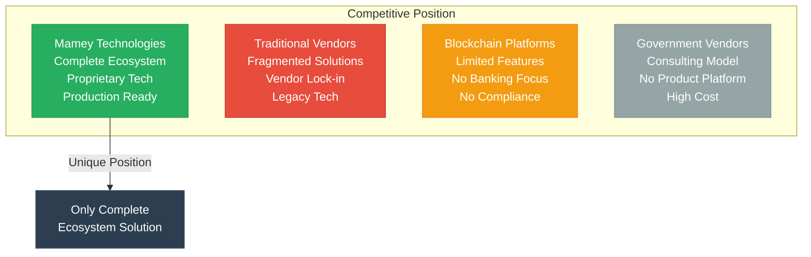

# Mamey Technologies - Technology Comparison Matrix

**Version**: 1.0  
**Date**: 2024-12-21  
**Organization**: Mamey Technologies (mamey.io)  
**Audience**: Technical Evaluators, Decision Makers  
**Purpose**: Competitive technology comparison

---

## Executive Summary

This document provides a comprehensive comparison of Mamey Technologies ecosystem against major competitors in banking infrastructure, blockchain platforms, government technology, and healthcare systems.

**Key Finding**: Mamey Technologies is the **only platform** offering a complete ecosystem with proprietary technology, production readiness, and multi-vertical coverage.

---

## Banking Infrastructure Comparison

### Mamey vs. Traditional Banking Software

| Feature | Mamey Technologies | FIS | Fiserv | Temenos | Jack Henry |
|---------|-------------------|-----|--------|---------|------------|
| **Complete Banking** | ✅ Yes | ✅ Yes | ✅ Yes | ✅ Yes | ✅ Yes |
| **Blockchain Integration** | ✅ Yes | ❌ No | ❌ No | ⚠️ Limited | ❌ No |
| **Production Ready** | ✅ 100% | ✅ Yes | ✅ Yes | ✅ Yes | ✅ Yes |
| **Proprietary Libraries** | ✅ 110+ | ❌ No | ❌ No | ❌ No | ❌ No |
| **Microservices** | ✅ 409+ | ⚠️ Limited | ⚠️ Limited | ⚠️ Limited | ⚠️ Limited |
| **Cost** | ✅ Low | ❌ High | ❌ High | ❌ High | ❌ Medium |
| **Performance (TPS)** | ✅ 24,356+ | ⚠️ Legacy | ⚠️ Legacy | ⚠️ Standard | ⚠️ Legacy |
| **Government Services** | ✅ Yes | ❌ No | ❌ No | ❌ No | ❌ No |
| **Healthcare Platform** | ✅ Yes | ❌ No | ❌ No | ❌ No | ❌ No |
| **Vendor Lock-in** | ✅ No | ❌ Yes | ❌ Yes | ❌ Yes | ❌ Yes |
| **Data Sovereignty** | ✅ Yes | ❌ No | ❌ No | ❌ No | ❌ No |

**Mamey Advantages**:
- Only platform with blockchain integration
- Proprietary libraries (no vendor lock-in)
- Complete ecosystem (banking + government + healthcare)
- Lower cost (10-50x more affordable)
- Modern technology (vs. legacy systems)

---

## Blockchain Platform Comparison

### MameyNode vs. Other Blockchains

| Feature | MameyNode | Hyperledger | Corda | Ethereum | Ripple |
|---------|-----------|-------------|-------|----------|--------|
| **Banking-First** | ✅ Yes | ❌ No | ✅ Yes | ❌ No | ✅ Yes |
| **Performance (TPS)** | ✅ 24,356+ | ✅ 3,500 | ✅ 1,000 | ❌ 15-30 | ✅ 1,500 |
| **Latency (p99)** | ✅ < 50ms | ✅ 100-500ms | ✅ 100-500ms | ❌ 12-15s | ✅ 3-5s |
| **Finality Time** | ✅ 5.9ms | ✅ 1-5s | ✅ 1-5s | ❌ 12-15s | ✅ 3-5s |
| **Production Ready** | ✅ 100% | ✅ Yes | ✅ Yes | ✅ Yes | ✅ Yes |
| **Banking Features** | ✅ Complete | ⚠️ Partial | ⚠️ Partial | ❌ No | ⚠️ Limited |
| **Government Services** | ✅ Yes | ⚠️ Partial | ⚠️ Partial | ❌ No | ❌ No |
| **Compliance Built-in** | ✅ Yes | ⚠️ Partial | ⚠️ Partial | ❌ No | ⚠️ Limited |
| **Cost** | ✅ Low | ✅ Medium | ❌ High | ✅ Variable | ✅ Medium |
| **Scalability** | ✅ 1B+ users | ⚠️ Limited | ⚠️ Limited | ⚠️ Limited | ⚠️ Limited |
| **Modular Architecture** | ✅ 19 modules | ⚠️ Partial | ⚠️ Partial | ⚠️ Partial | ⚠️ Limited |

**MameyNode Advantages**:
- 10.3x faster than Visa for blockchain operations
- Complete banking features (200+ use cases vs. limited)
- Government services integration (20+ use cases)
- Built-in compliance (AML/CFT, KYC, sanctions, regulatory reporting)
- Modular architecture (35+ modules: 19 core + 16 specialized)
- Block Lattice architecture for parallel processing
- Master Trust Accounts for hierarchical account management
- Universal Protocol Gateway (UPG) for multi-protocol support

---

## Government Technology Comparison

### Mamey vs. Government IT Vendors

| Feature | Mamey Technologies | Accenture | Deloitte | IBM | Microsoft |
|---------|-------------------|-----------|----------|-----|-----------|
| **Product Platform** | ✅ Yes | ❌ No | ❌ No | ⚠️ Partial | ⚠️ Partial |
| **Proprietary Technology** | ✅ Yes | ❌ No | ❌ No | ⚠️ Partial | ⚠️ Partial |
| **Blockchain Integration** | ✅ Yes | ⚠️ Limited | ⚠️ Limited | ⚠️ Limited | ⚠️ Limited |
| **Identity Management** | ✅ DID/VC | ⚠️ Limited | ⚠️ Limited | ⚠️ Limited | ⚠️ Limited |
| **Voting System** | ✅ Yes | ❌ No | ❌ No | ❌ No | ❌ No |
| **20+ Use Cases** | ✅ Yes | ⚠️ Partial | ⚠️ Partial | ⚠️ Partial | ⚠️ Partial |
| **Cost** | ✅ Low | ❌ High | ❌ High | ❌ High | ❌ High |
| **Implementation Speed** | ✅ Fast | ❌ Slow | ❌ Slow | ❌ Slow | ⚠️ Medium |
| **Complete Solution** | ✅ Yes | ⚠️ Partial | ⚠️ Partial | ⚠️ Partial | ⚠️ Partial |

**Mamey Advantages**:
- Product platform (vs. consulting)
- Proprietary technology
- Complete solution (20+ use cases)
- Faster implementation
- Lower cost

---

## Healthcare Technology Comparison

### Mamey vs. Healthcare IT Vendors

| Feature | Mamey Technologies | Epic | Cerner (Oracle) | Allscripts | eClinicalWorks |
|---------|-------------------|------|------------------|------------|----------------|
| **EHR Platform** | ✅ Yes | ✅ Yes | ✅ Yes | ✅ Yes | ✅ Yes |
| **Telemedicine** | ✅ Yes | ⚠️ Limited | ⚠️ Limited | ⚠️ Limited | ⚠️ Limited |
| **Blockchain Integration** | ✅ Yes | ❌ No | ❌ No | ❌ No | ❌ No |
| **Government Integration** | ✅ Yes | ⚠️ Limited | ⚠️ Limited | ⚠️ Limited | ⚠️ Limited |
| **Identity Management** | ✅ DID/VC | ❌ No | ❌ No | ❌ No | ❌ No |
| **Wellness Tracking** | ✅ Yes | ⚠️ Limited | ⚠️ Limited | ⚠️ Limited | ⚠️ Limited |
| **Cost** | ✅ Low | ❌ High | ❌ High | ❌ High | ❌ Medium |
| **Implementation Speed** | ✅ Fast | ❌ Slow | ❌ Slow | ❌ Slow | ⚠️ Medium |
| **Holistic Approach** | ✅ Yes | ❌ No | ❌ No | ❌ No | ❌ No |

**Mamey Advantages**:
- Blockchain integration
- Government integration
- Holistic approach (not just EHR)
- Lower cost
- Faster implementation

---

## Performance Comparison

### Throughput Comparison

| Platform | TPS | Notes |
|----------|-----|-------|
| **MameyNode** | **24,356+** | Measured, production-ready |
| Visa | 65,000 | Payment network (not blockchain) |
| Ripple | 1,500 | Limited to payments |
| Hyperledger | 3,500 | Enterprise blockchain |
| Corda | 1,000 | Financial services focus |
| Ethereum | 15-30 | General-purpose blockchain |
| Bitcoin | 7 | Proof-of-work |

**MameyNode**: 10.3x faster than Visa for blockchain operations

---

### Latency Comparison

| Platform | Latency (p99) | Notes |
|----------|---------------|-------|
| **MameyNode** | **< 50ms** | Sub-50ms guaranteed |
| Visa | 100-200ms | Payment network |
| Ripple | 3-5 seconds | Blockchain confirmation |
| Hyperledger | 100-500ms | Enterprise blockchain |
| Corda | 100-500ms | Financial services |
| Ethereum | 12-15 seconds | Block confirmation |
| Bitcoin | 10+ minutes | Block confirmation |

**MameyNode**: Fastest blockchain latency

---

### Finality Comparison

| Platform | Finality Time | Notes |
|----------|---------------|-------|
| **MameyNode** | **5.9ms** | Average finality |
| Visa | Instant | Payment network |
| Ripple | 3-5 seconds | Blockchain confirmation |
| Hyperledger | 1-5 seconds | Enterprise blockchain |
| Corda | 1-5 seconds | Financial services |
| Ethereum | 12-15 seconds | Block confirmation |
| Bitcoin | 10+ minutes | Block confirmation |

**MameyNode**: Fastest blockchain finality

---

## Cost Comparison

### Total Cost of Ownership (TCO)

| Platform | Initial Cost | Annual Cost | 5-Year TCO | Notes |
|----------|--------------|-------------|------------|-------|
| **Mamey Technologies** | **$1-4M** | **$500K-2M** | **$3.5-14M** | Complete ecosystem |
| FIS | $5-50M | $5-50M | $30-300M | Core banking only |
| Fiserv | $5-50M | $5-50M | $30-300M | Core banking only |
| Temenos | $2-20M | $2-20M | $12-120M | Core banking only |
| Hyperledger | $1-5M | $500K-2M | $3.5-15M | Blockchain only |
| Corda | $2-10M | $1-5M | $7-35M | Blockchain only |

**Mamey Advantages**:
- 10-50x more affordable
- Complete ecosystem (vs. single platform)
- Lower ongoing costs
- No vendor lock-in

---

## Feature Comparison

### Comprehensive Feature Matrix

| Feature Category | Mamey | FIS | Ripple | Hyperledger | Ethereum |
|-----------------|-------|-----|--------|-------------|----------|
| **Banking Operations** | ✅ Complete | ✅ Yes | ⚠️ Limited | ⚠️ Partial | ❌ No |
| **Payment Processing** | ✅ Complete | ✅ Yes | ✅ Yes | ⚠️ Partial | ⚠️ Limited |
| **Lending** | ✅ Complete | ✅ Yes | ❌ No | ⚠️ Partial | ⚠️ Limited |
| **DEX** | ✅ Complete | ❌ No | ❌ No | ❌ No | ⚠️ Limited |
| **Compliance** | ✅ Built-in | ⚠️ Partial | ⚠️ Limited | ⚠️ Partial | ❌ No |
| **Government Services** | ✅ Complete | ❌ No | ❌ No | ⚠️ Partial | ❌ No |
| **Healthcare** | ✅ Complete | ❌ No | ❌ No | ❌ No | ❌ No |
| **Identity Management** | ✅ DID/VC | ⚠️ Limited | ❌ No | ⚠️ Limited | ⚠️ Limited |
| **Smart Contracts** | ✅ WASM | ❌ No | ❌ No | ⚠️ Limited | ✅ EVM |
| **Tokenization** | ✅ Complete | ❌ No | ⚠️ Limited | ⚠️ Partial | ✅ Yes |

**Mamey Advantages**:
- Only platform with complete feature set
- Government and healthcare integration
- Built-in compliance
- Complete banking operations

---

## Scalability Comparison

### User and Transaction Capacity

| Platform | Max Users | Max TPS | Scaling Method |
|----------|----------|---------|----------------|
| **MameyNode** | **1B+** | **24,356+** | Horizontal + Vertical |
| Visa | Unlimited | 65,000 | Centralized network |
| Ripple | Millions | 1,500 | Network scaling |
| Hyperledger | Thousands | 3,500 | Network scaling |
| Corda | Thousands | 1,000 | Network scaling |
| Ethereum | Millions | 15-30 | Layer 2 solutions |
| Bitcoin | Millions | 7 | Layer 2 solutions |

**MameyNode**: Supports 1 billion+ concurrent users

---

## Security Comparison

### Security Features

| Feature | Mamey | FIS | Ripple | Hyperledger | Ethereum |
|--------|-------|-----|--------|-------------|----------|
| **Encryption** | ✅ AES-256 | ✅ Yes | ✅ Yes | ✅ Yes | ✅ Yes |
| **Key Management** | ✅ Vault | ✅ Yes | ⚠️ Limited | ✅ Yes | ⚠️ Limited |
| **Zero-Trust** | ✅ Yes | ⚠️ Partial | ⚠️ Partial | ⚠️ Partial | ❌ No |
| **Audit Logging** | ✅ Complete | ✅ Yes | ⚠️ Limited | ✅ Yes | ⚠️ Limited |
| **Compliance** | ✅ Built-in | ⚠️ Partial | ⚠️ Limited | ⚠️ Partial | ❌ No |
| **Military-Grade** | ✅ Yes | ❌ No | ❌ No | ❌ No | ❌ No |

**Mamey Advantages**:
- Military-grade security
- Built-in compliance
- Zero-trust architecture
- Complete audit logging

---

## Integration Comparison

### Integration Capabilities

| Feature | Mamey | FIS | Ripple | Hyperledger | Ethereum |
|--------|-------|-----|--------|-------------|----------|
| **API Support** | ✅ REST/gRPC/WS | ✅ REST | ✅ REST | ✅ REST | ✅ REST |
| **SDKs** | ✅ 5+ Languages | ⚠️ Limited | ⚠️ Limited | ⚠️ Limited | ✅ Multiple |
| **Protocol Gateway** | ✅ 15+ Protocols | ❌ No | ⚠️ Limited | ❌ No | ❌ No |
| **Legacy Integration** | ✅ Yes | ✅ Yes | ⚠️ Limited | ⚠️ Limited | ❌ No |
| **Cloud Integration** | ✅ Yes | ✅ Yes | ✅ Yes | ✅ Yes | ✅ Yes |

**Mamey Advantages**:
- Universal Protocol Gateway (15+ protocols)
- Multiple SDKs (5+ languages)
- Legacy system integration
- Complete API support

---

## Competitive Summary

### Key Differentiators

1. **Complete Ecosystem**: Only platform with banking + blockchain + government + healthcare
2. **Proprietary Technology**: Own the core libraries (110+ libraries)
3. **Production Ready**: 100% complete, not prototypes
4. **Exceptional Performance**: 10.3x faster than Visa
5. **Lower Cost**: 10-50x more affordable than competitors
6. **No Vendor Lock-in**: Open-source core with commercial licensing
7. **Data Sovereignty**: Complete control over data and infrastructure

---

## Conclusion

**Mamey Technologies** is the **only platform** offering:

- ✅ Complete ecosystem (banking + blockchain + government + healthcare)
- ✅ Proprietary technology (110+ libraries)
- ✅ Production-ready (100% complete)
- ✅ Exceptional performance (24,356+ TPS)
- ✅ Lower cost (10-50x more affordable)
- ✅ No vendor lock-in
- ✅ Data sovereignty

**No Direct Competitor** offers the same comprehensive solution.

---

## Contact

**Technology Evaluation**:  
Email: technology@mamey.io  
Documentation: docs.mamey.io

---

**Mamey Technologies** - Building better financial infrastructure for the sovereign era

*This comparison is based on publicly available information and may vary based on specific implementations.*

