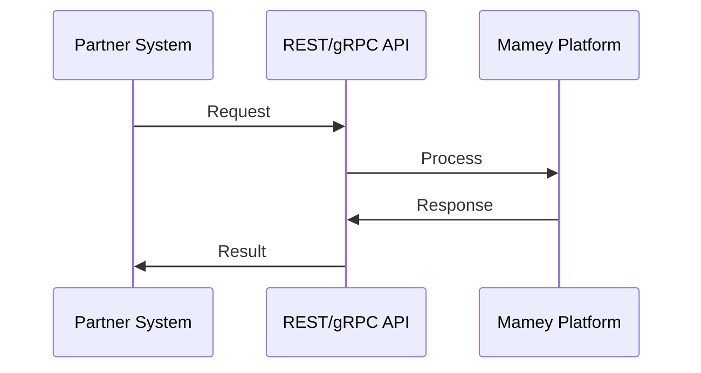
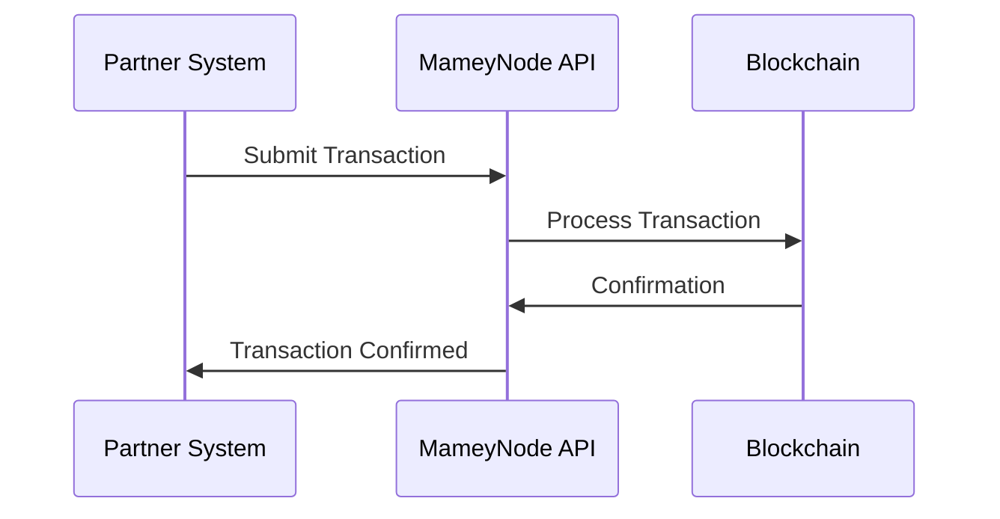
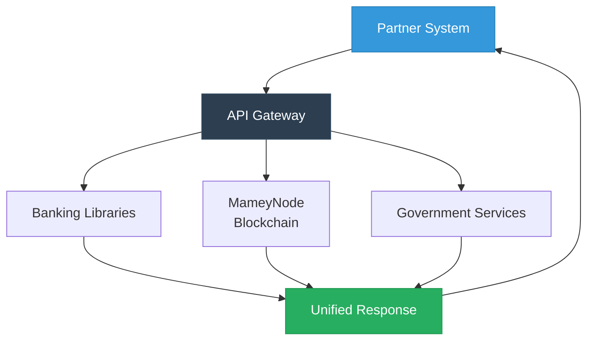
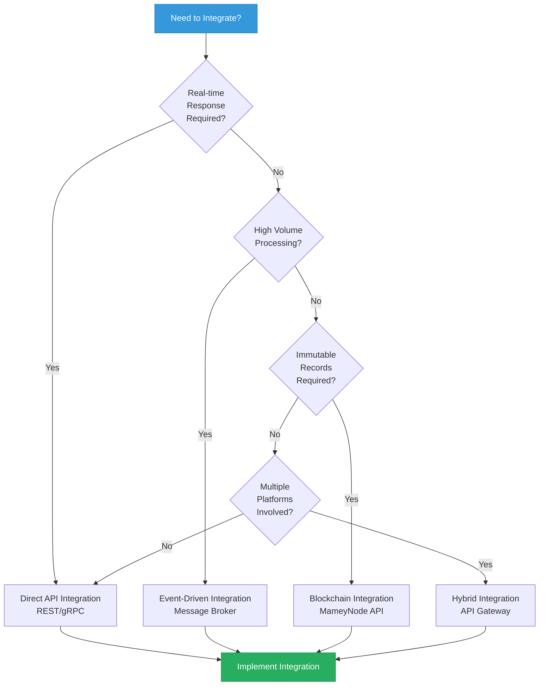
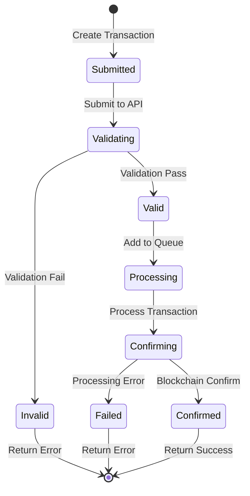

# Mamey Technologies - Platform Integration Guide

**Version**: 1.0  
**Date**: 2024-12-21  
**Organization**: Mamey Technologies (mamey.io)  
**Audience**: Technical Partners, System Integrators, Developers  
**Purpose**: Step-by-step integration guidance

---

## Overview

This guide provides comprehensive instructions for integrating with the Mamey Technologies ecosystem. It covers integration patterns, API usage, SDKs, authentication, and best practices.

**MameyNode Integration**: MameyNode provides three API interfaces (JSON-RPC, WebSocket, gRPC) for blockchain operations. The blockchain uses Block Lattice architecture where each account has its own blockchain, enabling parallel processing. Integration supports Master Trust Accounts, multi-currency operations, and comprehensive compliance checks built into every transaction.

---

## Integration Patterns

### Pattern 1: Direct API Integration

**Use Case**: Real-time operations, synchronous requests



**Implementation**:
1. Obtain API credentials
2. Configure API client
3. Make API calls
4. Handle responses

**Best For**: Real-time operations, immediate responses

---

### Pattern 2: Event-Driven Integration

**Use Case**: Asynchronous operations, event processing


**Implementation**:
1. Set up message broker connection
2. Subscribe to event streams
3. Publish events
4. Process event responses

**Best For**: Asynchronous operations, high-volume processing

---

### Pattern 3: Blockchain Integration

**Use Case**: Immutable records, decentralized operations



**Implementation**:
1. Connect to MameyNode
2. Submit transactions
3. Monitor confirmations
4. Process blockchain events

**Best For**: Immutable records, decentralized operations

---

### Pattern 4: Hybrid Integration

**Use Case**: Complex workflows, multi-platform operations



**Implementation**:
1. Use API Gateway
2. Route to appropriate platforms
3. Aggregate responses
4. Return unified response

**Best For**: Complex workflows, multi-platform operations

---

## Integration Decision Tree



---

## Authentication

### API Key Authentication

**Method**: Header-based API key

**Implementation**:
```http
GET /api/v1/banking/accounts
Authorization: Bearer YOUR_API_KEY
```

**Use Case**: Server-to-server communication

---

### JWT Authentication

**Method**: JSON Web Token

**Implementation**:
```http
POST /api/v1/auth/login
Content-Type: application/json

{
  "username": "your_username",
  "password": "your_password"
}

Response:
{
  "token": "eyJhbGciOiJIUzI1NiIsInR5cCI6IkpXVCJ9...",
  "expires_in": 3600
}
```

**Use Case**: User authentication, session management

---

### OAuth 2.0

**Method**: OAuth 2.0 flow

**Implementation**:
1. Redirect to authorization endpoint
2. User authorizes
3. Receive authorization code
4. Exchange for access token
5. Use access token for API calls

**Use Case**: Third-party application access

---

## API Endpoints

### Banking APIs

**Base URL**: `https://api.mamey.io/v1/banking`

**Endpoints**:
- `GET /accounts` - List accounts
- `GET /accounts/{id}` - Get account details
- `POST /accounts` - Create account
- `POST /transactions` - Create transaction
- `GET /transactions/{id}` - Get transaction details

**Example**:
```bash
curl -X GET https://api.mamey.io/v1/banking/accounts \
  -H "Authorization: Bearer YOUR_API_KEY"
```

---

### Blockchain APIs

**Base URL**: `https://api.mamey.io/v1/blockchain`

**Endpoints**:
- `POST /transactions` - Submit transaction
- `GET /transactions/{id}` - Get transaction status
- `GET /blocks/{hash}` - Get block details
- `GET /accounts/{address}` - Get account balance

**Example**:
```bash
curl -X POST https://api.mamey.io/v1/blockchain/transactions \
  -H "Authorization: Bearer YOUR_API_KEY" \
  -H "Content-Type: application/json" \
  -d '{
    "from": "account1",
    "to": "account2",
    "amount": 1000,
    "currency": "USD"
  }'
```

---

### Government APIs

**Base URL**: `https://api.mamey.io/v1/government`

**Endpoints**:
- `POST /identity/verify` - Verify identity
- `POST /documents/verify` - Verify document
- `POST /voting/vote` - Submit vote
- `GET /voting/results` - Get voting results

**Example**:
```bash
curl -X POST https://api.mamey.io/v1/government/identity/verify \
  -H "Authorization: Bearer YOUR_API_KEY" \
  -H "Content-Type: application/json" \
  -d '{
    "identity_id": "did:mamey:123",
    "verification_type": "kyc"
  }'
```

---

## SDKs

### .NET SDK

**Installation**:
```bash
dotnet add package Mamey.SDK
```

**Usage**:
```csharp
using Mamey.SDK;

var client = new MameyClient("YOUR_API_KEY");
var accounts = await client.Banking.GetAccountsAsync();
```

**Documentation**: docs.mamey.io/sdk/dotnet

---

### JavaScript/TypeScript SDK

**Installation**:
```bash
npm install @mamey/sdk
```

**Usage**:
```javascript
import { MameyClient } from '@mamey/sdk';

const client = new MameyClient('YOUR_API_KEY');
const accounts = await client.banking.getAccounts();
```

**Documentation**: docs.mamey.io/sdk/javascript

---

### Python SDK

**Installation**:
```bash
pip install mamey-sdk
```

**Usage**:
```python
from mamey import MameyClient

client = MameyClient(api_key='YOUR_API_KEY')
accounts = client.banking.get_accounts()
```

**Documentation**: docs.mamey.io/sdk/python

---

### Rust SDK

**Installation**:
```toml
[dependencies]
mamey-sdk = "1.0.0"
```

**Usage**:
```rust
use mamey_sdk::MameyClient;

let client = MameyClient::new("YOUR_API_KEY");
let accounts = client.banking().get_accounts().await?;
```

**Documentation**: docs.mamey.io/sdk/rust

---

### Go SDK

**Installation**:
```bash
go get github.com/mamey/mamey-sdk-go
```

**Usage**:
```go
import "github.com/mamey/mamey-sdk-go"

client := mamey.NewClient("YOUR_API_KEY")
accounts, err := client.Banking.GetAccounts()
```

**Documentation**: docs.mamey.io/sdk/go

---

## WebSocket APIs

### Real-Time Updates

**Connection**:
```javascript
const ws = new WebSocket('wss://api.mamey.io/v1/ws?token=YOUR_TOKEN');

ws.onmessage = (event) => {
  const data = JSON.parse(event.data);
  console.log('Update:', data);
};
```

**Event Types**:
- `transaction.confirmed` - Transaction confirmed
- `block.created` - New block created
- `account.updated` - Account updated
- `compliance.checked` - Compliance check completed

---

## Integration Examples

### Example 1: Cross-Border Payment

**Scenario**: Send cross-border payment

**Implementation**:
```python
from mamey import MameyClient

client = MameyClient(api_key='YOUR_API_KEY')

# Create payment
payment = client.payments.create_cross_border(
    from_account='account1',
    to_account='account2',
    amount=1000,
    from_currency='USD',
    to_currency='EUR'
)

# Monitor status
status = client.payments.get_status(payment.id)
print(f"Status: {status.status}")
```

---

### Example 2: Identity Verification

**Scenario**: Verify user identity

**Implementation**:
```javascript
const client = new MameyClient('YOUR_API_KEY');

// Verify identity
const verification = await client.government.identity.verify({
  identity_id: 'did:mamey:123',
  verification_type: 'kyc',
  documents: ['passport', 'drivers_license']
});

console.log(`Verification Status: ${verification.status}`);
```

---

### Example 3: Blockchain Transaction

**Scenario**: Submit blockchain transaction

**Implementation**:
```rust
use mamey_sdk::MameyClient;

let client = MameyClient::new("YOUR_API_KEY");

// Submit transaction
let tx = client.blockchain()
    .submit_transaction(TransactionRequest {
        from: "account1".to_string(),
        to: "account2".to_string(),
        amount: 1000,
        currency: "USD".to_string(),
    })
    .await?;

// Wait for confirmation
let confirmation = client.blockchain()
    .wait_for_confirmation(&tx.id)
    .await?;

println!("Transaction confirmed: {:?}", confirmation);
```

---

## Transaction State Flow



---

## Error Handling

### Error Response Format

```json
{
  "error": {
    "code": "INVALID_REQUEST",
    "message": "Invalid account ID",
    "details": {
      "field": "account_id",
      "reason": "Account not found"
    }
  }
}
```

### Error Codes

| Code | Description | Action |
|------|-------------|--------|
| `INVALID_REQUEST` | Invalid request parameters | Check request parameters |
| `UNAUTHORIZED` | Authentication failed | Check API key/token |
| `FORBIDDEN` | Insufficient permissions | Check permissions |
| `NOT_FOUND` | Resource not found | Check resource ID |
| `RATE_LIMIT` | Rate limit exceeded | Wait and retry |
| `SERVER_ERROR` | Server error | Retry later |

---

## Rate Limiting

### Limits

- **Standard**: 1,000 requests/minute
- **Premium**: 10,000 requests/minute
- **Enterprise**: Custom limits

### Headers

```http
X-RateLimit-Limit: 1000
X-RateLimit-Remaining: 999
X-RateLimit-Reset: 1609459200
```

### Handling

```python
import time

try:
    response = client.api_call()
except RateLimitError as e:
    wait_time = e.reset_time - time.time()
    time.sleep(wait_time)
    response = client.api_call()
```

---

## Security Best Practices

### 1. API Key Management

- Store API keys securely (environment variables, secrets manager)
- Rotate API keys regularly
- Use different keys for different environments
- Never commit keys to version control

### 2. HTTPS Only

- Always use HTTPS for API calls
- Verify SSL certificates
- Use TLS 1.3 when possible

### 3. Input Validation

- Validate all input parameters
- Sanitize user input
- Use parameterized queries
- Implement rate limiting

### 4. Error Handling

- Don't expose sensitive information in errors
- Log errors securely
- Implement retry logic
- Handle timeouts gracefully

---

## Testing

### Sandbox Environment

**URL**: `https://sandbox.mamey.io`

**Features**:
- Test API calls without affecting production
- Test data provided
- No real transactions
- Free to use

**Usage**:
```python
client = MameyClient(
    api_key='YOUR_SANDBOX_KEY',
    base_url='https://sandbox.mamey.io'
)
```

---

### Integration Testing

**Test Checklist**:
- [ ] Authentication works
- [ ] API calls succeed
- [ ] Error handling works
- [ ] Rate limiting works
- [ ] WebSocket connections work
- [ ] Event processing works

---

## Support and Resources

### Documentation

- **API Reference**: docs.mamey.io/api
- **SDK Documentation**: docs.mamey.io/sdk
- **Integration Guides**: docs.mamey.io/integration
- **Code Examples**: github.com/mamey/examples

### Support

- **Email**: support@mamey.io
- **Slack**: mamey.slack.com
- **Forum**: forum.mamey.io
- **Status Page**: status.mamey.io

---

## Next Steps

1. **Get API Credentials**: Sign up at mamey.io
2. **Choose Integration Pattern**: Select appropriate pattern
3. **Set Up Development Environment**: Install SDKs
4. **Test in Sandbox**: Test integration
5. **Deploy to Production**: Go live

---

## Contact

**Integration Support**:  
Email: integration@mamey.io  
Documentation: docs.mamey.io  
Support: support@mamey.io

---

**Mamey Technologies** - Building better financial infrastructure for the sovereign era

*This guide provides general integration instructions. For specific use cases, contact the integration team.*


