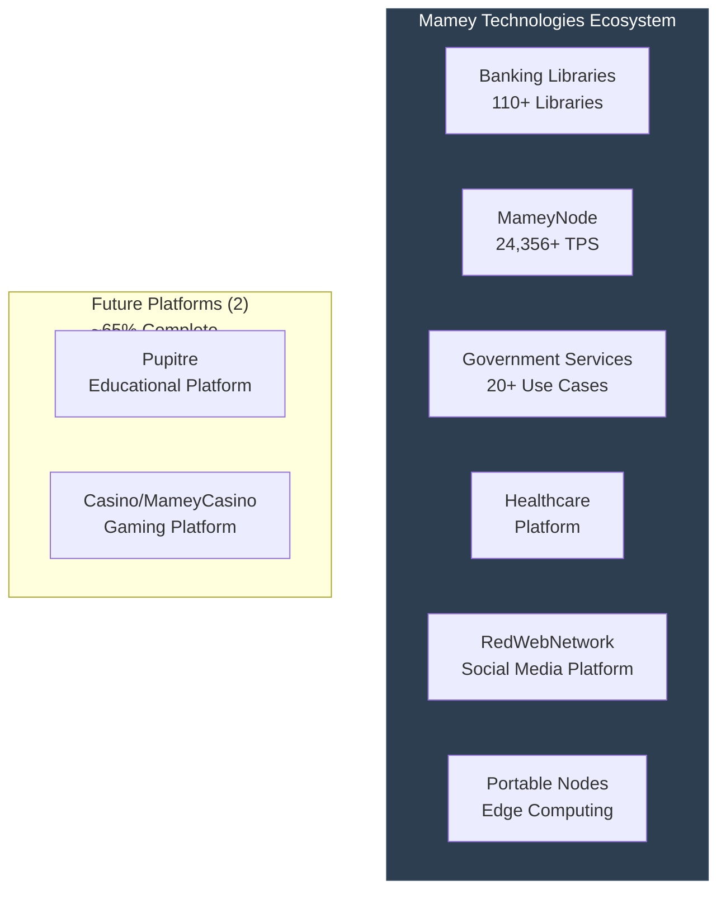
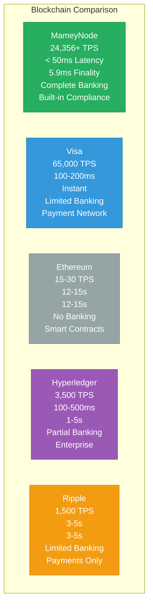

# Mamey Technologies Ecosystem - Frequently Asked Questions

**Version**: 1.0  
**Date**: 2024-12-21  
**Organization**: Mamey Technologies (mamey.io)  
**Audience**: All Stakeholders  
**Purpose**: Answer common questions

---

## General Questions

### What is Mamey Technologies?

Mamey Technologies provides a **complete sovereign financial infrastructure ecosystem** through six integrated platforms: Banking Libraries & Microservices, MameyNode Blockchain, Government Services, Holistic Medicine, RedWebNetwork, and Portable Nodes.

### What makes Mamey Technologies unique?

Mamey Technologies is the **only platform** offering:
- Complete ecosystem (banking + blockchain + government + healthcare)
- Proprietary technology (110+ libraries)
- Production-ready (100% complete)
- Exceptional performance (24,356+ TPS, 10.3x faster than Visa)
- Lower cost (10-50x more affordable)
- No vendor lock-in
- Data sovereignty

### What is the development status?

- **MameyNode Blockchain**: 100% complete, production-ready
- **Banking Libraries**: 75-80% complete, core functionality operational
- **Government Services**: Production-ready
- **Holistic Medicine**: 75-80% complete
- **RedWebNetwork**: 75-80% complete
- **Portable Nodes**: 75-80% complete

---

## Technical Questions

### What is the performance of MameyNode?

- **Throughput**: 24,356+ TPS (measured), 672,380 TPS (1B users benchmark)
- **Latency**: < 50ms (p99)
- **Finality**: ~5.9ms average
- **Scalability**: Supports 1 billion+ concurrent users

### What technologies does Mamey use?

**MameyNode Blockchain**:
- **Language**: Rust (283,076 lines of production code)
- **Architecture**: Block Lattice with DPoS consensus
- **Modules**: 35+ crates (19 core modules + 16 specialized)
- **Database**: LMDB (embedded, high-performance)
- **Node Types**: Banking Node, General Node, Government Node
- **APIs**: JSON-RPC, WebSocket, gRPC (9+ services)
- **Consensus**: Delegated Proof-of-Stake (DPoS)
- **Key Features**: Master Trust Accounts, multi-currency support, Universal Protocol Gateway (UPG)

**Banking Libraries & Microservices**:
- **Framework**: .NET Core, CQRS, Event Sourcing, DDD
- **Databases**: PostgreSQL, MongoDB, Redis
- **Message Brokers**: RabbitMQ, Kafka
- **Infrastructure**: Docker, Kubernetes, cloud-agnostic
- **Security**: Military-grade encryption, zero-trust architecture

### How does MameyNode compare to other blockchains?

| Metric | MameyNode | Visa | Ethereum | Hyperledger | Ripple |
|--------|-----------|------|----------|-------------|--------|
| TPS | 24,356+ | 65,000 | 15-30 | 3,500 | 1,500 |
| Latency | < 50ms | 100-200ms | 12-15s | 100-500ms | 3-5s |
| Finality | 5.9ms | Instant | 12-15s | 1-5s | 3-5s |
| Banking Features | Complete | Limited | None | Partial | Limited |

**MameyNode is 10.3x faster than Visa** for blockchain operations.

---

## Business Questions

### What is the market opportunity?

**Total Addressable Market (TAM)**: $1T+ combined
- Banking Infrastructure: $300+ billion
- Government Services: $1T+ global digital transformation
- Healthcare Technology: $500B+ global healthcare IT
- Blockchain Infrastructure: $50+ billion by 2030
- Edge Computing: $100B+ edge computing market

### What is the revenue potential?

- **Year 1-2**: $50-200M ARR
- **Year 3-5**: $500M-2B ARR
- **Year 5+**: $2-5B ARR

### What is the ROI?

- **ROI**: 200-400% over 3 years
- **Payback Period**: 3-6 months
- **Total Value**: $24M - $117M over 3 years per institution

### What are the cost savings?

- **Transaction Fees**: 85-90% reduction (3-5% → 0.1-0.5%)
- **Infrastructure**: 40-60% reduction in IT costs
- **Compliance**: 60-80% reduction in manual work
- **Settlement**: 50-70% reduction in settlement costs
- **Total**: 35-55% overall cost reduction

---

## Integration Questions

### How do I integrate with Mamey?

**Integration Options**:
1. **Direct API Integration**: REST/gRPC APIs
2. **Event-Driven Integration**: Message broker integration
3. **Blockchain Integration**: Direct blockchain integration
4. **Hybrid Integration**: API Gateway integration

**SDKs Available**: .NET, JavaScript/TypeScript, Python, Rust, Go

See [Platform Integration Guide](08-Platform-Integration-Guide.md) for details.

### What authentication methods are supported?

- **API Key**: Header-based authentication
- **JWT**: JSON Web Token authentication
- **OAuth 2.0**: OAuth 2.0 flow

### Is there a sandbox environment?

Yes, sandbox environment available at `https://sandbox.mamey.io` for testing without affecting production.

---

## Platform Questions

### What is Banking Libraries & Microservices?

Proprietary .NET framework with:
- **110+ Libraries**: Complete banking infrastructure
- **150+ Microservices**: Production-ready banking services
- **CQRS Pattern**: Command/Query separation
- **Event Sourcing**: Complete event history
- **DDD Patterns**: Domain-driven design

### What is MameyNode?

Production-ready blockchain infrastructure:
- **35+ Modules**: 19 core modules + 16 specialized modules
- **500+ Functions**: Comprehensive functionality
- **200+ Use Cases**: Banking, payments, lending, DEX, compliance
- **Performance**: 24,356+ TPS, < 50ms latency

### What is Government Services?

Complete government operations platform:
- **Identity Management**: DID, verifiable credentials
- **Document Verification**: Passports, IDs, certificates
- **Voting System**: Secure elections
- **20+ Use Cases**: Tax, social services, land registry, etc.

### What is Holistic Medicine?

Healthcare and wellness platform:
- **Patient Records**: Secure patient data management
- **Telemedicine**: Remote healthcare delivery
- **Wellness Tracking**: Health and wellness monitoring
- **Compliance**: HIPAA, GDPR built-in

### What is RedWebNetwork?

Social media platform providing:
- **Social Media Features**: Complete Facebook clone functionality (posts, comments, reactions, messaging, groups, pages, events, stories, marketplace, watch, gaming)
- **Real-Time Interactions**: SignalR for live updates
- **Media Processing**: Media storage and CDN integration
- **Identity Integration**: FutureWampumID for sovereign identity
- **Microservices Architecture**: 15+ microservices following Mamey Framework

**Status**: 75-80% complete

### What is Pupitre?

Educational platform for sovereign education systems:
- **AI-First Teaching**: AI as primary educator with human support
- **Sovereign Education**: Modular platform for Indigenous governance
- **Inclusive Design**: Support for special needs, neurodivergence, multilingual
- **Gamification**: Rewards systems, progress visibility, adaptive AI tutors
- **Verifiable Credentials**: W3C-compliant DID and credential layers
- **Microservices Architecture**: 30+ microservices for complete educational lifecycle

**Status**: ~65% complete (microservices created, MameyNode integration planned)

### What is Casino/MameyCasino?

AI-first, blockchain-native gaming platform:
- **AI-First Casino Engine**: AI dealers, game management, fraud detection
- **Provably Fair Gaming**: Blockchain-native gaming with MameyNode integration planned
- **Comprehensive Game Library**: 50+ casino games (table games, slots, instant games, lottery)
- **Hybrid Operations**: Online gaming, live dealer, physical casino floor management
- **Responsible Gaming**: Built-in responsible gaming tools and compliance
- **Microservices Architecture**: 15+ microservices for complete casino operations

**Status**: ~65% complete (microservices created, MameyNode integration planned)

---

## Use Case Questions

### What use cases does Mamey support?

**200+ use cases** across:
- **Banking**: Cross-border payments, RTGS, CBDC, treasury, custody, trade finance
- **Payments**: P2P, merchant, remittances, bill payments, government disbursements
- **Lending**: Loan origination, microloans, credit risk evaluation
- **Compliance**: AML/CFT, KYC, regulatory reporting, sanctions screening
- **Government**: Identity, voting, tax, social services, land registry
- **Healthcare**: Patient records, telemedicine, wellness tracking
- **Specialized**: DEX, tokenization, escrow, insurance

See [Use Case Catalog](06-Use-Case-Catalog.md) for complete list.

### What is the value of cross-border payments?

- **Cost Reduction**: 85% (3-5% → 0.1-0.5%)
- **Speed Improvement**: 99.99% (1-3 days → 5.9ms)
- **Annual Savings**: $2-5M per $100M+ in transaction volume

### What is the value of compliance automation?

- **Manual Work Reduction**: 60-80%
- **Processing Time**: 90% reduction
- **Annual Savings**: $1-5M per institution

---

## Competitive Questions

### Who are your competitors?

**Banking Infrastructure**: FIS, Fiserv, Temenos, Jack Henry  
**Blockchain**: Hyperledger, Corda, Ethereum, Ripple  
**Government**: Accenture, Deloitte, IBM, Microsoft  
**Healthcare**: Epic, Cerner, Allscripts

### What are your competitive advantages?

1. **Complete Ecosystem**: Only platform with complete financial infrastructure
2. **Proprietary Technology**: Own the core libraries (110+ libraries)
3. **Production Ready**: 100% complete, not prototypes
4. **Exceptional Performance**: 10.3x faster than Visa
5. **Lower Cost**: 10-50x more affordable
6. **No Vendor Lock-in**: Open-source core with commercial licensing
7. **Data Sovereignty**: Complete control over data

### How do you compare to FIS/Fiserv?

| Feature | Mamey | FIS/Fiserv |
|---------|-------|------------|
| Cost | Low | High ($5-50M/year) |
| Technology | Modern | Legacy |
| Blockchain | Yes | No |
| Vendor Lock-in | No | Yes |
| Government Services | Yes | No |
| Healthcare | Yes | No |

**Mamey is 10-50x more affordable** with modern technology and complete ecosystem.

---

## Investment Questions

### What is the current valuation?

- **Current**: $10M - $25M (technical assessment)
- **Year 3-5**: $50-200M
- **Year 5+**: $2.5B-50B (based on revenue multiples)

### What is the investment ask?

- **Target**: $5-15 million
- **Valuation**: $20-40 million pre-money
- **Use of Funds**: Sales expansion, product development, operations

### What are the expected returns?

- **Year 1-2**: $50-200M ARR
- **Year 3-5**: $500M-2B ARR
- **Year 5+**: $2-5B ARR
- **ROI**: 50-500x (depending on investment amount)

---

## Deployment Questions

### What deployment options are available?

1. **On-Premise**: Full control, air-gapped deployment possible
2. **Cloud (Managed)**: Mamey-managed infrastructure
3. **Hybrid**: Combination of on-premise and cloud

### What infrastructure is required?

- **Blockchain Nodes**: Standard server hardware
- **Microservices**: Docker/Kubernetes compatible
- **Databases**: PostgreSQL, MongoDB, Redis, LMDB
- **Message Brokers**: RabbitMQ, Kafka

### Is it cloud-agnostic?

Yes, Mamey is cloud-agnostic and works with:
- AWS
- Azure
- Google Cloud
- On-premise
- Hybrid deployments

---

## Security Questions

### What security measures are in place?

- **Encryption**: AES-256 at rest, TLS 1.3 in transit
- **Key Management**: Hashicorp Vault integration
- **Zero-Trust**: Zero-trust architecture
- **Audit Logging**: Complete immutable audit trail
- **Compliance**: Built-in AML/CFT, KYC, regulatory reporting
- **Military-Grade**: Security meets military standards

### Is it compliant with regulations?

Yes, built-in compliance for:
- **AML/CFT**: Anti-money laundering and counter-terrorism financing
- **KYC**: Know Your Customer
- **Regulatory Reporting**: Automatic report generation
- **GDPR**: Data privacy compliance
- **HIPAA**: Healthcare compliance

---

## Support Questions

### What support is available?

- **Technical Support**: Email, Slack, forum
- **Documentation**: Complete API and SDK documentation
- **Training**: Staff training programs
- **Integration Support**: Integration team assistance

### Where can I find documentation?

- **API Documentation**: docs.mamey.io/api
- **SDK Documentation**: docs.mamey.io/sdk
- **Integration Guides**: docs.mamey.io/integration
- **Code Examples**: github.com/mamey/examples

### How do I get started?

1. **Contact**: Reach out to partners@mamey.io
2. **Get API Credentials**: Sign up for sandbox access
3. **Review Documentation**: Study integration guides
4. **Test Integration**: Use sandbox environment
5. **Deploy to Production**: Go live with support

---

## Partnership Questions

### What partnership opportunities are available?

- **Technology Partners**: Integration partnerships
- **System Integrators**: Implementation partnerships
- **Resellers**: Distribution partnerships
- **Strategic Partners**: Joint go-to-market

### How do I become a partner?

Contact partners@mamey.io for partnership opportunities.

---

## Contact

**General Inquiries**: info@mamey.io  
**Investment**: investment@mamey.io  
**Partners**: partners@mamey.io  
**Support**: support@mamey.io  
**Integration**: integration@mamey.io

**Website**: mamey.io  
**Documentation**: docs.mamey.io

---

**Mamey Technologies** - Building better financial infrastructure for the sovereign era

*This FAQ addresses common questions. For specific inquiries, please contact the appropriate team.*

