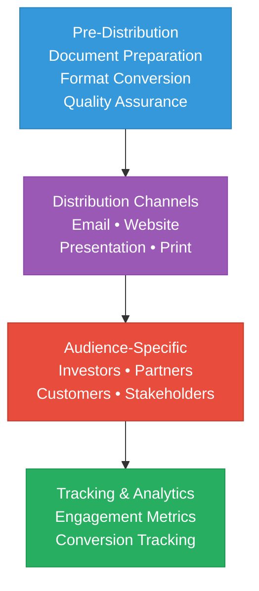

# Mamey Technologies - Distribution Checklist

**Version**: 1.0  
**Date**: 2024-12-21  
**Organization**: Mamey Technologies (mamey.io)  
**Purpose**: Checklist for distributing partner-sharing documents

---

## Distribution Workflow

---

## Pre-Distribution Checklist

### Document Preparation

- [ ] All documents reviewed and approved
- [ ] Version numbers updated
- [ ] Dates updated
- [ ] Contact information verified
- [ ] Confidentiality notices included
- [ ] Branding consistent across all documents

### Format Conversion

- [ ] One-Pager converted to PDF
- [ ] Executive Deck converted to PowerPoint
- [ ] Architecture Overview converted to PDF
- [ ] Business Value Proposition converted to PDF
- [ ] Use Case Catalog converted to PDF
- [ ] Technology Comparison Matrix converted to PDF/Excel
- [ ] Integration Guide converted to PDF
- [ ] FAQ converted to PDF
- [ ] Glossary converted to PDF

### Quality Assurance

- [ ] All links verified and working
- [ ] All images/charts included
- [ ] All data accurate and up-to-date
- [ ] Grammar and spelling checked
- [ ] Formatting consistent
- [ ] Page numbers added (if applicable)

---

## Distribution Channels

### Email Distribution

- [ ] Email list prepared
- [ ] Email template created
- [ ] Documents attached or linked
- [ ] Personalization added (if applicable)
- [ ] Tracking enabled (if applicable)
- [ ] Follow-up scheduled

### Website Distribution

- [ ] Documents uploaded to website
- [ ] Download links created
- [ ] Access controls configured (if needed)
- [ ] SEO metadata added
- [ ] Analytics tracking enabled

### Presentation Distribution

- [ ] Presentation uploaded to sharing platform
- [ ] Access permissions set
- [ ] Download enabled (if applicable)
- [ ] Presentation notes added (if applicable)

### Print Distribution

- [ ] High-resolution PDFs prepared
- [ ] Print specifications verified
- [ ] Printing service selected
- [ ] Quantity determined
- [ ] Delivery method arranged

---

## Audience-Specific Distribution

### For Investors

**Documents to Share**:
- [ ] One-Pager
- [ ] Executive Summary Deck
- [ ] Business Value Proposition
- [ ] Technology Comparison Matrix
- [ ] FAQ

**Distribution Method**:
- [ ] Email with attachments
- [ ] Secure portal access
- [ ] In-person presentation
- [ ] Follow-up materials

**Follow-Up**:
- [ ] Schedule follow-up meeting
- [ ] Answer questions
- [ ] Provide additional materials if needed

---

### For Partners

**Documents to Share**:
- [ ] One-Pager
- [ ] Executive Summary Deck
- [ ] Ecosystem Architecture Overview
- [ ] Platform Integration Guide
- [ ] Use Case Catalog
- [ ] FAQ

**Distribution Method**:
- [ ] Partner portal access
- [ ] Email with links
- [ ] Technical presentation
- [ ] Integration workshop

**Follow-Up**:
- [ ] Technical Q&A session
- [ ] Integration planning
- [ ] Partnership agreement discussion

---

### For Customers

**Documents to Share**:
- [ ] One-Pager
- [ ] Business Value Proposition
- [ ] Use Case Catalog
- [ ] Technology Comparison Matrix
- [ ] FAQ

**Distribution Method**:
- [ ] Sales presentation
- [ ] Email with materials
- [ ] Customer portal access
- [ ] Proposal package

**Follow-Up**:
- [ ] Discovery call
- [ ] Demo scheduling
- [ ] Proposal discussion
- [ ] Implementation planning

---

### For Stakeholders

**Documents to Share**:
- [ ] One-Pager
- [ ] Executive Summary Deck
- [ ] Business Value Proposition
- [ ] FAQ

**Distribution Method**:
- [ ] Board presentation
- [ ] Executive briefing
- [ ] Email update
- [ ] Internal portal

**Follow-Up**:
- [ ] Q&A session
- [ ] Additional information if needed

---

## Security and Confidentiality

### Access Control

- [ ] Access levels defined
- [ ] User authentication required (if applicable)
- [ ] Download restrictions set (if applicable)
- [ ] Watermarking added (if applicable)
- [ ] Expiration dates set (if applicable)

### Confidentiality

- [ ] NDA requirements verified
- [ ] Confidentiality notices included
- [ ] Distribution list approved
- [ ] Recipients authorized
- [ ] Tracking enabled (if applicable)

### Data Protection

- [ ] Personal data removed (if applicable)
- [ ] Sensitive information redacted (if applicable)
- [ ] Encryption used (if applicable)
- [ ] Secure transmission used

---

## Tracking and Analytics

### Distribution Tracking

- [ ] Email opens tracked
- [ ] Document downloads tracked
- [ ] Website views tracked
- [ ] Presentation views tracked
- [ ] Engagement metrics collected

### Analytics Setup

- [ ] Google Analytics configured (if applicable)
- [ ] Custom tracking implemented
- [ ] Dashboard created
- [ ] Reports scheduled

---

## Follow-Up Actions

### Immediate Follow-Up (Within 24 Hours)

- [ ] Confirmation emails sent
- [ ] Questions answered
- [ ] Additional materials provided if needed
- [ ] Meeting requests acknowledged

### Short-Term Follow-Up (Within 1 Week)

- [ ] Follow-up emails sent
- [ ] Engagement tracked
- [ ] Feedback collected
- [ ] Next steps discussed

### Long-Term Follow-Up (Within 1 Month)

- [ ] Relationship status reviewed
- [ ] Additional materials provided
- [ ] Partnership opportunities discussed
- [ ] Success metrics evaluated

---

## Customization Checklist

### White Label Customization

- [ ] Partner branding added
- [ ] Partner logo included
- [ ] Partner colors applied
- [ ] Partner contact information added
- [ ] Custom messaging included

### Regional Customization

- [ ] Local market data added
- [ ] Regional use cases highlighted
- [ ] Local language translation (if applicable)
- [ ] Regional contact information added
- [ ] Currency converted (if applicable)

### Vertical-Specific Customization

- [ ] Industry-specific use cases highlighted
- [ ] Industry metrics included
- [ ] Industry terminology used
- [ ] Industry examples added
- [ ] Industry compliance mentioned

---

## Version Control

### Version Management

- [ ] Version numbers tracked
- [ ] Change log maintained
- [ ] Previous versions archived
- [ ] Version distribution tracked
- [ ] Updates communicated

### Update Distribution

- [ ] Updates identified
- [ ] New versions created
- [ ] Recipients notified
- [ ] Old versions replaced
- [ ] Change log shared

---

## Success Metrics

### Distribution Metrics

- [ ] Number of recipients
- [ ] Open rates (email)
- [ ] Download rates
- [ ] View rates (website)
- [ ] Engagement rates

### Outcome Metrics

- [ ] Meeting requests generated
- [ ] Partnership inquiries received
- [ ] Investment inquiries received
- [ ] Customer inquiries received
- [ ] Conversion rates

---

## Troubleshooting

### Common Issues

- [ ] Large file sizes: Compress or use links
- [ ] Format compatibility: Provide multiple formats
- [ ] Access issues: Verify permissions
- [ ] Broken links: Test all links
- [ ] Missing attachments: Verify attachments

### Support

- [ ] Support contact information provided
- [ ] FAQ referenced
- [ ] Help documentation available
- [ ] Technical support available

---

## Best Practices

### Distribution Best Practices

1. **Personalization**: Personalize messages when possible
2. **Timing**: Send at optimal times for recipients
3. **Format**: Provide multiple formats (PDF, PowerPoint, etc.)
4. **Follow-Up**: Always follow up within 24-48 hours
5. **Tracking**: Track engagement and adjust approach

### Communication Best Practices

1. **Clear Subject Lines**: Use descriptive subject lines
2. **Concise Messages**: Keep messages brief and focused
3. **Call to Action**: Include clear next steps
4. **Professional Tone**: Maintain professional communication
5. **Responsive**: Respond promptly to inquiries

---

## Contact

**Distribution Support**:  
Email: distribution@mamey.io  
Documentation: docs.mamey.io

---

**Mamey Technologies** - Building better financial infrastructure for the sovereign era

*Use this checklist to ensure comprehensive and effective distribution of partner-sharing documents.*

