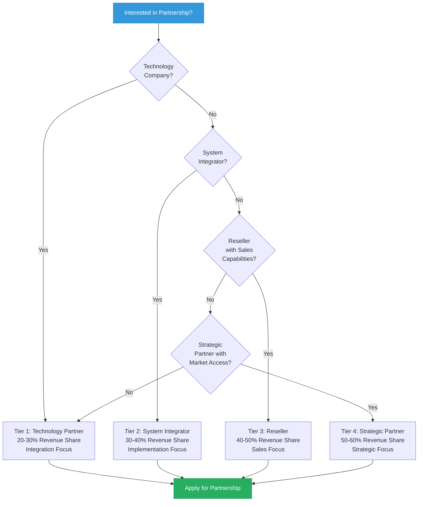
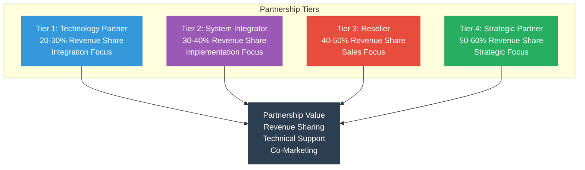
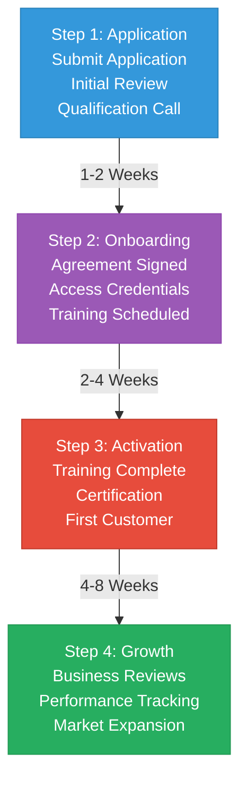

# Mamey Technologies - Partnership Program Guide

**Version**: 1.0  
**Date**: 2024-12-21  
**Organization**: Mamey Technologies (mamey.io)  
**Audience**: Potential Partners  
**Purpose**: Partnership opportunities and program details

---

## Executive Summary

Mamey Technologies offers comprehensive partnership opportunities for technology companies, system integrators, resellers, and strategic partners. Our partnership program provides access to the complete sovereign financial infrastructure ecosystem, enabling partners to deliver innovative solutions to their customers while generating significant revenue opportunities.

**Partnership Value**:
- Access to complete ecosystem (6 core + 2 future platforms)
- Proprietary technology (110+ libraries)
- Production-ready solutions (MameyNode 100% core complete, 200+ use cases)
- Revenue sharing opportunities
- Technical support and training
- Co-marketing opportunities

**MameyNode for Partners**: Partners gain access to a production-ready blockchain infrastructure with 24,356+ TPS, 5.9ms finality, and comprehensive banking/government features. The Block Lattice architecture enables parallel processing, and built-in compliance (AML/CFT, KYC, sanctions screening) reduces integration complexity.

---

## Partnership Selection Guide

---

## Partnership Tiers

### Tier 1: Technology Partner

**Overview**: Integration partnerships for technology companies

**Requirements**:
- Technology company with complementary products
- Technical integration capabilities
- Customer base in financial services, government, or healthcare
- Commitment to joint development

**Benefits**:
- Access to APIs and SDKs
- Technical integration support
- Co-marketing opportunities
- Revenue sharing (20-30%)
- Early access to new features
- Technical training and certification

**Revenue Model**:
- Revenue sharing on integrated solutions
- Referral fees for customer introductions
- Joint go-to-market opportunities

**Investment**: Minimal (integration development)

**Best For**: Technology companies, software vendors, platform providers

---

### Tier 2: System Integrator Partner

**Overview**: Implementation partnerships for system integrators

**Requirements**:
- System integration experience
- Customer relationships in target markets
- Implementation capabilities
- Support infrastructure

**Benefits**:
- Access to complete platform
- Implementation support
- Training and certification
- Co-marketing opportunities
- Revenue sharing (30-40%)
- Priority support

**Revenue Model**:
- Implementation fees
- Ongoing support fees
- Revenue sharing on platform usage
- Referral fees

**Investment**: Moderate (training and certification)

**Best For**: System integrators, consulting firms, implementation partners

---

### Tier 3: Reseller Partner

**Overview**: Distribution partnerships for resellers

**Requirements**:
- Sales capabilities in target markets
- Customer relationships
- Marketing and sales infrastructure
- Commitment to sales targets

**Benefits**:
- Access to sales materials
- Sales training and support
- Co-marketing opportunities
- Revenue sharing (40-50%)
- Priority support
- Sales incentives

**Revenue Model**:
- Revenue sharing on sales
- Sales commissions
- Volume discounts
- Marketing support

**Investment**: Low (sales training)

**Best For**: Resellers, distributors, sales partners

---

### Tier 4: Strategic Partner

**Overview**: Strategic partnerships for major organizations

**Requirements**:
- Strategic alignment
- Significant market presence
- Joint go-to-market opportunity
- Long-term commitment

**Benefits**:
- Exclusive access to features
- Joint product development
- Co-branding opportunities
- Revenue sharing (50-60%)
- Board-level engagement
- Strategic planning

**Revenue Model**:
- Joint revenue sharing
- Strategic investments
- Co-development opportunities
- Market expansion

**Investment**: Significant (strategic commitment)

**Best For**: Large technology companies, financial institutions, government agencies

---

## Partnership Benefits

### Technical Benefits

**Access to Technology**:
- Complete platform access
- APIs and SDKs
- Technical documentation
- Integration support
- Early access to new features

**Support**:
- Technical support
- Integration assistance
- Training and certification
- Best practices guidance
- Community access

---

### Business Benefits

**Revenue Opportunities**:
- Revenue sharing (20-60% depending on tier)
- Referral fees
- Implementation fees
- Support fees
- Joint go-to-market opportunities

**Marketing Support**:
- Co-marketing opportunities
- Sales materials
- Case studies
- Webinars and events
- Brand association

**Market Access**:
- Access to Mamey customer base
- Joint sales opportunities
- Market expansion support
- Customer introductions

---

### Training & Certification

**Partner Training**:
- Technical training
- Sales training
- Product training
- Best practices training
- Certification programs

**Certification Levels**:
- **Bronze**: Basic certification
- **Silver**: Intermediate certification
- **Gold**: Advanced certification
- **Platinum**: Expert certification

---

## Partnership Process

### Step 1: Application

**Application Requirements**:
- Company information
- Partnership tier interest
- Market focus
- Customer base
- Technical capabilities
- Revenue goals

**Application Process**:
1. Submit partnership application
2. Initial review (1-2 weeks)
3. Qualification call
4. Partnership agreement discussion

---

### Step 2: Onboarding

**Onboarding Process**:
1. Partnership agreement signed
2. Access credentials provided
3. Training scheduled
4. Integration planning
5. Go-to-market planning

**Onboarding Timeline**: 2-4 weeks

---

### Step 3: Activation

**Activation Activities**:
1. Training completion
2. Certification (if applicable)
3. First integration/customer
4. Marketing materials ready
5. Sales enablement

**Activation Timeline**: 4-8 weeks

---

### Step 4: Growth

**Growth Support**:
1. Regular business reviews
2. Performance tracking
3. Additional training
4. Market expansion
5. Strategic planning

---

## Revenue Sharing Models

### Model 1: Platform Usage

**Structure**: Revenue share based on platform usage

**Tier 1 (Technology Partner)**: 20-30%  
**Tier 2 (System Integrator)**: 30-40%  
**Tier 3 (Reseller)**: 40-50%  
**Tier 4 (Strategic Partner)**: 50-60%

**Payment**: Monthly revenue share payments

---

### Model 2: Implementation Services

**Structure**: Revenue share on implementation services

**Share**: 30-50% of implementation fees

**Payment**: Upon project completion

---

### Model 3: Referral Fees

**Structure**: One-time referral fee for customer introductions

**Fee**: 5-10% of first-year contract value

**Payment**: Upon contract signing

---

### Model 4: Joint Go-to-Market

**Structure**: Revenue share on joint solutions

**Share**: 40-60% depending on contribution

**Payment**: Monthly revenue share payments

---

## Success Stories

### Technology Partner Success

**Partner**: [Technology Company Name]  
**Integration**: Banking Libraries integration  
**Result**: $5M+ in joint revenue, 50+ customers

---

### System Integrator Success

**Partner**: [System Integrator Name]  
**Implementation**: MameyNode deployment  
**Result**: $10M+ in implementation revenue, 20+ deployments

---

### Reseller Success

**Partner**: [Reseller Name]  
**Sales**: Government Services platform  
**Result**: $15M+ in sales, 30+ customers

---

## Partnership Requirements

### General Requirements

**Company**:
- Established company (2+ years)
- Financial stability
- Market presence
- Customer relationships

**Technical** (for Technology and System Integrator Partners):
- Technical capabilities
- Integration experience
- Support infrastructure
- Quality standards

**Sales** (for Reseller Partners):
- Sales capabilities
- Market knowledge
- Customer relationships
- Sales infrastructure

**Strategic** (for Strategic Partners):
- Strategic alignment
- Market leadership
- Long-term commitment
- Joint opportunities

---

### Commitment Requirements

**Minimum Commitments**:
- **Technology Partner**: 1 integration per year
- **System Integrator**: 3 implementations per year
- **Reseller**: $1M+ in sales per year
- **Strategic Partner**: Joint go-to-market plan

---

## Support & Resources

### Partner Portal

**Access**: partners.mamey.io

**Features**:
- Documentation access
- Training materials
- Sales materials
- Support tickets
- Revenue tracking
- Performance metrics

---

### Partner Support

**Technical Support**:
- Integration assistance
- Technical questions
- Best practices
- Troubleshooting

**Business Support**:
- Sales support
- Marketing support
- Business development
- Strategic planning

**Support Channels**:
- Email: partners@mamey.io
- Portal: partners.mamey.io
- Phone: [Support Number]
- Slack: Partner community

---

## Marketing & Co-Marketing

### Co-Marketing Opportunities

**Joint Marketing**:
- Webinars and events
- Case studies
- Press releases
- Trade shows
- Content marketing

**Marketing Support**:
- Sales materials
- Product collateral
- Case studies
- Webinars
- Events

**Brand Guidelines**:
- Logo usage
- Brand standards
- Co-branding guidelines
- Marketing approval process

---

## Partnership Agreement

### Agreement Terms

**Standard Terms**:
- Partnership duration: 1-3 years
- Renewal: Automatic or negotiated
- Termination: 30-90 days notice
- Exclusivity: Tier-dependent

**Key Provisions**:
- Revenue sharing terms
- Support obligations
- Marketing requirements
- Confidentiality
- IP rights

---

## Application Process

### How to Apply

**1. Review Partnership Tiers**
- Understand partnership options
- Identify best fit
- Review requirements

**2. Submit Application**
- Complete application form
- Provide company information
- Describe partnership goals

**3. Qualification**
- Initial review (1-2 weeks)
- Qualification call
- Partnership discussion

**4. Agreement**
- Partnership agreement
- Terms negotiation
- Agreement signing

**5. Onboarding**
- Access credentials
- Training schedule
- Integration planning

---

## Contact

**Partnership Inquiries**:  
Email: partners@mamey.io  
Phone: [Contact Number]  
Portal: partners.mamey.io

**Partnership Team**:  
- Partnership Director: [Name]  
- Technical Partnerships: [Name]  
- Business Development: [Name]

---

## Next Steps

1. **Review**: Understand partnership opportunities
2. **Apply**: Submit partnership application
3. **Qualify**: Complete qualification process
4. **Agree**: Sign partnership agreement
5. **Activate**: Complete onboarding and training
6. **Grow**: Build successful partnership

---

**Mamey Technologies** - Building better financial infrastructure for the sovereign era

*This guide provides an overview of partnership opportunities. For specific partnership inquiries, contact the partnership team.*

