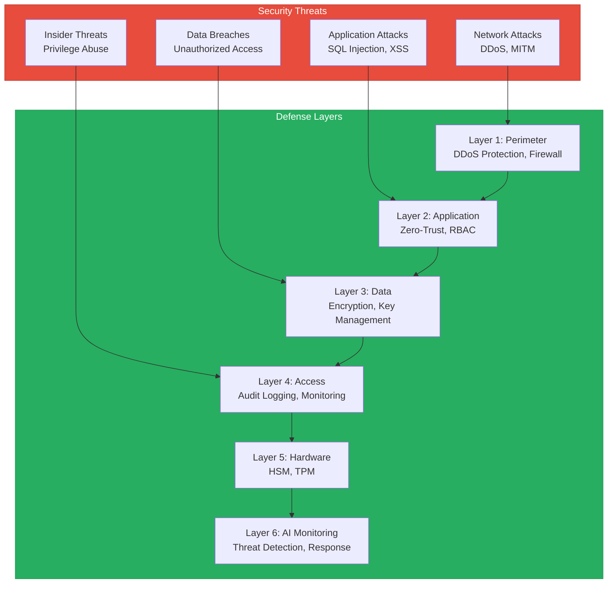
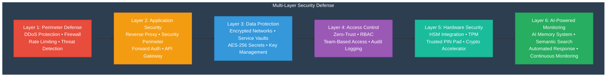

# Mamey Technologies - Compliance & Security Overview

**Version**: 1.0  
**Date**: 2024-12-21  
**Organization**: Mamey Technologies (mamey.io)  
**Audience**: Regulated Industries, Government Partners, Security Evaluators  
**Purpose**: Regulatory and security assurance documentation

---

## Executive Summary

Mamey Technologies provides **military-grade security** and **comprehensive compliance** across all platforms. Our security architecture meets the highest industry standards, and our compliance framework supports regulatory requirements across multiple jurisdictions, including banking, government, and healthcare.

**MameyNode Compliance**: MameyNode is designed with compliance built-in from the ground up. Every transaction automatically undergoes AML/CFT screening, KYC verification, and sanctions checking. The blockchain maintains immutable audit trails for all operations, enabling automated regulatory reporting (SAR, CTR, FBAR, FATCA, CRS). This compliance-by-design approach reduces manual compliance work by 60-80% while ensuring regulatory adherence.

**Security Highlights**:
- Military-grade encryption (AES-256 at rest, TLS 1.3 in transit)
- Zero-trust architecture
- Multi-layer security defense
- Hardware security module (HSM) integration
- Complete audit trails

**Compliance Highlights**:
- AML/CFT compliance (automated)
- KYC verification (automated)
- Regulatory reporting (automated)
- GDPR compliance (data privacy)
- HIPAA compliance (healthcare)
- ISO 27001 (target certification)
- SOC 2 Type II (target certification)

---

## Security Architecture

### Security Threat Model

### Multi-Layer Security Defense

---

## Encryption & Key Management

### Data Encryption

**At Rest**:
- **Algorithm**: AES-256 encryption
- **Scope**: All databases, file systems, backups
- **Key Management**: HSM-backed, multi-party governance
- **Key Rotation**: Every 90 days

**In Transit**:
- **Protocol**: TLS 1.3
- **Scope**: All network communications
- **Certificate Management**: Automated certificate rotation
- **Perfect Forward Secrecy**: Enabled

**Key Management**:
- **HSM Integration**: Hardware security modules
- **Multi-Party Governance**: Multiple key custodians
- **Key Rotation**: Automated rotation every 90 days
- **Backup**: Secure key backup and recovery

---

## Access Control

### Zero-Trust Architecture

**Principles**:
- Never trust, always verify
- Least privilege access
- Continuous verification
- Network segmentation

**Implementation**:
- Service-to-service authentication
- Network segmentation
- Micro-segmentation
- Identity-based access

### Authentication Methods

**Supported Methods**:
- **JWT**: JSON Web Token authentication
- **OAuth 2.0**: OAuth 2.0 flow
- **API Keys**: Header-based authentication
- **Multi-Factor Authentication**: MFA support
- **DID**: Decentralized identifier authentication

### Authorization

**Role-Based Access Control (RBAC)**:
- Role definitions
- Permission management
- Role assignment
- Access reviews

**Attribute-Based Access Control (ABAC)**:
- Attribute definitions
- Policy management
- Dynamic access control
- Context-aware authorization

---

## Compliance Framework

### AML/CFT Compliance

**Anti-Money Laundering (AML)**:
- Real-time transaction monitoring
- Suspicious activity detection
- Risk scoring and assessment
- Automated alerts

**Counter-Terrorism Financing (CFT)**:
- Sanctions screening
- Watchlist monitoring
- Risk assessment
- Regulatory reporting

**Automation**:
- 60-80% reduction in manual work
- Real-time screening
- Automated risk assessment
- Automated reporting

---

### KYC Compliance

**Know Your Customer (KYC)**:
- Identity verification
- Document verification
- Risk assessment
- Continuous monitoring

**Know Your Business (KYB)**:
- Business verification
- Beneficial ownership
- Risk assessment
- Ongoing monitoring

**Automation**:
- Automated verification
- Real-time processing
- Reduced false positives
- Continuous monitoring

---

### Regulatory Reporting

**Automated Reporting**:
- Suspicious Activity Reports (SAR)
- Currency Transaction Reports (CTR)
- Foreign Bank Account Reports (FBAR)
- Regulatory filings

**Compliance Features**:
- Automated report generation
- Real-time compliance monitoring
- Audit trail maintenance
- Regulatory updates

---

### Data Privacy Compliance

**GDPR (General Data Protection Regulation)**:
- Data protection by design
- Right to access
- Right to erasure
- Data portability
- Privacy impact assessments

**CCPA (California Consumer Privacy Act)**:
- Consumer rights
- Data disclosure
- Opt-out mechanisms
- Data protection

**HIPAA (Health Insurance Portability and Accountability Act)**:
- Protected health information (PHI) protection
- Access controls
- Audit logging
- Breach notification

---

## Compliance Certifications

### Target Certifications

**ISO 27001**: Information Security Management
- Information security management system
- Risk management
- Security controls
- Continuous improvement

**SOC 2 Type II**: Security, Availability, Confidentiality
- Security controls
- Availability controls
- Confidentiality controls
- Processing integrity

**PCI-DSS**: Payment Card Industry Compliance
- Payment card data protection
- Secure payment processing
- Compliance validation

**NIST Cybersecurity Framework**: Risk Management
- Identify
- Protect
- Detect
- Respond
- Recover

---

## Audit & Logging

### Audit Trail

**Comprehensive Logging**:
- All system activities logged
- Immutable audit records
- Tamper-proof logs
- Complete audit trail

**Log Management**:
- Centralized logging
- Log retention (7+ years)
- Log analysis
- Compliance reporting

**Audit Features**:
- User activity tracking
- System event logging
- Security event logging
- Compliance event logging

---

## Security Monitoring

### Continuous Monitoring

**Monitoring Systems**:
- Real-time threat detection
- Anomaly detection
- Security event monitoring
- Performance monitoring

**AI-Powered Monitoring**:
- AI memory system
- Semantic search
- Automated threat response
- Predictive analytics

**Alerting**:
- Real-time alerts
- Escalation procedures
- Incident response
- Security operations center (SOC)

---

## Incident Response

### Incident Response Plan

**Response Procedures**:
1. Detection and analysis
2. Containment
3. Eradication
4. Recovery
5. Post-incident review

**Response Team**:
- Security team
- Operations team
- Management team
- External experts (if needed)

**Communication**:
- Internal communication
- Customer notification
- Regulatory notification
- Public communication (if needed)

---

## Security Best Practices

### Development Security

**Secure Development**:
- Security by design
- Code reviews
- Security testing
- Vulnerability scanning

**Dependency Management**:
- Dependency scanning
- Vulnerability patching
- License compliance
- Security updates

### Deployment Security

**Secure Deployment**:
- Infrastructure hardening
- Network segmentation
- Access controls
- Monitoring and logging

**Container Security**:
- Image scanning
- Runtime security
- Network policies
- Resource limits

---

## Compliance by Industry

### Banking Compliance

**Regulatory Requirements**:
- Basel III compliance
- Dodd-Frank compliance
- AML/CFT compliance
- KYC compliance
- Regulatory reporting

**Standards**:
- ISO 20022 (financial messaging)
- ISO 8583 (card networks)
- SWIFT standards
- RTGS standards

---

### Government Compliance

**Regulatory Requirements**:
- Government security standards
- Data sovereignty
- Citizen privacy
- Transparency requirements
- Audit requirements

**Standards**:
- Government security frameworks
- Privacy regulations
- Transparency standards
- Audit standards

---

### Healthcare Compliance

**Regulatory Requirements**:
- HIPAA compliance
- GDPR compliance (if applicable)
- Healthcare regulations
- Patient privacy
- Data protection

**Standards**:
- HL7 standards
- FHIR standards
- Healthcare security standards
- Privacy standards

---

## Security Testing

### Testing Methods

**Penetration Testing**:
- Regular penetration tests
- Vulnerability assessments
- Security audits
- Red team exercises

**Code Security**:
- Static code analysis
- Dynamic code analysis
- Dependency scanning
- Security code reviews

**Infrastructure Security**:
- Infrastructure scanning
- Configuration audits
- Network security testing
- Access control testing

---

## Compliance Reporting

### Reporting Capabilities

**Automated Reports**:
- Compliance status reports
- Security status reports
- Audit reports
- Regulatory reports

**Custom Reports**:
- Custom report generation
- Ad-hoc reporting
- Dashboard views
- Export capabilities

---

## Data Sovereignty

### Data Control

**Data Location**:
- Customer-controlled data location
- On-premise deployment option
- Cloud deployment option
- Hybrid deployment option

**Data Access**:
- Customer-controlled access
- No unauthorized access
- Complete data control
- Data portability

---

## Contact

**Security Inquiries**:  
Email: security@mamey.io  
Security Portal: security.mamey.io

**Compliance Inquiries**:  
Email: compliance@mamey.io  
Compliance Portal: compliance.mamey.io

---

**Mamey Technologies** - Building better financial infrastructure for the sovereign era

*This document provides an overview of security and compliance. For detailed security documentation, contact the security team.*

