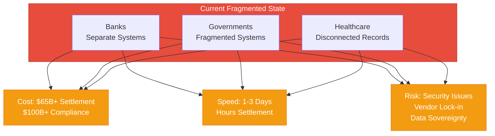
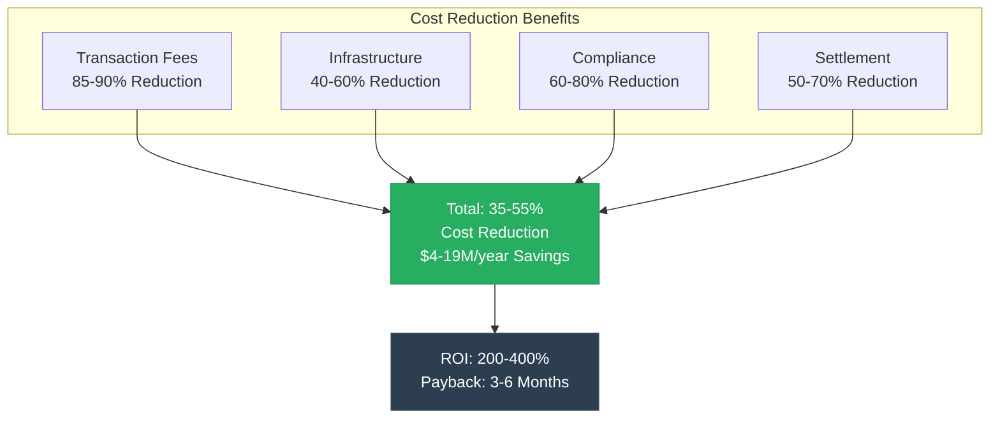

# The Future of Sovereign Financial Infrastructure
## A New Paradigm for Banking, Government, and Healthcare

**Version**: 1.0  
**Date**: 2024-12-21  
**Organization**: Mamey Technologies (mamey.io)  
**Type**: Thought Leadership Whitepaper  
**Audience**: Industry Leaders, Analysts, Decision Makers

---

## Abstract

Traditional financial infrastructure is fragmented, expensive, and slow. Banks, governments, and healthcare providers operate disconnected systems that create inefficiencies, increase costs, and limit innovation. This whitepaper presents a new paradigm: **sovereign financial infrastructure**—a unified ecosystem that enables organizations to maintain complete control over their data and operations while achieving unprecedented performance, cost reduction, and innovation.

**Key Findings**:
- Fragmented infrastructure costs organizations $65B+ annually in settlement costs alone
- Traditional systems are 1000x slower than modern alternatives
- Compliance costs exceed $100B annually globally
- A unified ecosystem can reduce costs by 35-55% while improving performance by 1000x

---

## Introduction: The Infrastructure Crisis

### The Current State

Financial infrastructure today is a patchwork of disconnected systems:

- **Banks** use separate systems for core banking, payments, compliance, and reporting
- **Governments** operate fragmented systems for identity, voting, services, and records
- **Healthcare providers** struggle with disconnected patient records and telemedicine platforms

**The Cost**:
- $65B+ annually in settlement costs
- $100B+ annually in compliance costs
- 1-3 days for cross-border payments
- Hours for domestic settlement
- Manual compliance processing

**The Impact**:
- High costs passed to customers
- Slow processes limiting innovation
- Security risks from fragmented systems
- Vendor lock-in preventing flexibility
- Data sovereignty concerns

---

## The Sovereign Infrastructure Paradigm

### What is Sovereign Infrastructure?

**Sovereign infrastructure** is a unified ecosystem that provides:

1. **Complete Control**: Organizations maintain complete control over data and operations
2. **Unified Platform**: Single ecosystem for all financial operations
3. **Proprietary Technology**: Own the core technology, no vendor lock-in
4. **Data Sovereignty**: Data stays where organizations want it
5. **Performance**: Industry-leading performance metrics
6. **Compliance**: Built-in compliance and security

### The Mamey Approach

Mamey Technologies has built a **complete sovereign financial infrastructure ecosystem** through six core platforms plus two future platforms:

**Core Platforms (6)**:
1. **Banking Libraries & Microservices**: 110+ proprietary .NET libraries, 150+ microservices
2. **MameyNode Blockchain**: Production-ready blockchain (24,356+ TPS, 5.9ms finality, 200+ use cases). Uses Block Lattice architecture with DPoS consensus, designed specifically for regulated financial institutions and governments. Supports Master Trust Accounts, multi-currency operations, and comprehensive compliance automation.
3. **Government Services**: Complete platform for 20+ government use cases
4. **Holistic Medicine**: Healthcare and wellness platform
5. **RedWebNetwork**: Social media platform (posts, messaging, groups, marketplace, gaming)
6. **Portable Nodes**: Mobile and edge computing solutions

**Future Platforms (2)** (~65% complete, microservices created, MameyNode integration planned):
7. **Pupitre**: Educational platform with AI-first teaching, sovereign education capabilities
8. **Casino/MameyCasino**: Gaming platform with AI dealers, provably fair gaming capabilities

**Key Innovation**: These aren't six separate products. They're one unified ecosystem where every component enhances the others. MameyNode provides the blockchain infrastructure that enables all other platforms to operate with immutable records, instant settlement, and built-in compliance.

---

## The Business Case for Sovereign Infrastructure

### Cost Reduction

**Quantified Benefits**:

| Category | Current Cost | With Sovereign Infrastructure | Savings |
|----------|-------------|-------------------------------|---------|
| Transaction Fees | 3-5% | 0.1-0.5% | 85-90% |
| Infrastructure | $5-50M/year | $2-20M/year | 40-60% |
| Compliance | $1-5M/year | $200K-1M/year | 60-80% |
| Settlement | High fees | Eliminated | 50-70% |
| **Total** | **Variable** | **35-55% Reduction** | **$4-19M/year** |

**ROI**: 200-400% over 3 years  
**Payback Period**: 3-6 months

---

### Speed Improvement

**Settlement Times**:

| Transaction Type | Current | Sovereign Infrastructure | Improvement |
|----------------|---------|------------------------|-------------|
| Cross-Border | 1-3 days | 5.9ms | 1000x faster |
| Domestic | Hours | 5.9ms | 100x faster |
| RTGS | Hours | 5.9ms | 100x faster |
| Compliance | Days | Real-time | 100x faster |

**Business Impact**:
- Free up $10-30M in capital tied in transit
- Reduce settlement risk by 90%
- Improve customer experience with real-time confirmation

---

### Compliance Automation

**Current State**:
- Manual compliance processing
- High error rates
- Slow processing
- High costs

**With Sovereign Infrastructure**:
- Automated compliance (60-80% reduction in manual work)
- Real-time screening
- Automated reporting
- Reduced costs ($1-5M annually per institution)

---

## Technical Architecture

### Unified Modular Architecture

**Key Principles**:

1. **Modularity**: Independent modules that work together
2. **Scalability**: Horizontal and vertical scaling
3. **Security**: Multi-layer security defense
4. **Compliance**: Built-in compliance framework
5. **Integration**: Seamless integration across platforms

**Architecture Benefits**:
- Independent scaling of components
- Technology flexibility
- Fault isolation
- Team autonomy
- Incremental updates

---

### Performance Architecture

**Performance Metrics**:
- **Throughput**: 24,356+ TPS (measured)
- **Latency**: < 50ms (p99)
- **Finality**: ~5.9ms average
- **Scalability**: 1 billion+ concurrent users

**Competitive Performance**:
- 10.3x faster than Visa for blockchain operations
- 1000x faster than traditional cross-border payments
- Industry-leading performance across all metrics

---

## Use Cases & Applications

### Banking Use Cases

**Cross-Border Payments**:
- Problem: High costs (3-5%), slow settlement (1-3 days)
- Solution: Low costs (0.1-0.5%), instant settlement (5.9ms)
- Value: $2-5M annual savings per $100M+ in volume

**CBDC Infrastructure**:
- Problem: No digital currency infrastructure
- Solution: Complete CBDC platform
- Value: $1-5M annually per central bank

**Real-Time Settlement**:
- Problem: Batch processing, hourly settlement
- Solution: Real-time processing, 5.9ms finality
- Value: $1-3M annual savings

---

### Government Use Cases

**Digital Identity**:
- Problem: Fragmented identity systems
- Solution: Unified digital identity with DID
- Value: Improved citizen services, reduced fraud

**Voting Systems**:
- Problem: Paper-based voting, slow counting
- Solution: Secure electronic voting
- Value: Faster results, reduced fraud, increased trust

**Document Verification**:
- Problem: Manual verification, fraud risk
- Solution: Automated verification with blockchain
- Value: Faster processing, reduced fraud

---

### Healthcare Use Cases

**Patient Records**:
- Problem: Fragmented records, limited interoperability
- Solution: Unified patient records
- Value: Improved care, reduced costs

**Telemedicine**:
- Problem: Limited telemedicine infrastructure
- Solution: Complete telemedicine platform
- Value: Increased access, reduced costs

---

## Market Opportunity

### Market Size

**Total Addressable Market (TAM)**: $1.95 trillion annually

- Banking Infrastructure: $300+ billion
- Blockchain in Banking: $50+ billion (2030)
- Government Services: $1 trillion+
- Healthcare Technology: $500+ billion
- Edge Computing: $100+ billion

### Market Trends

**Trend 1: Digital Transformation**
- Organizations modernizing infrastructure
- Legacy system replacement
- Cloud adoption

**Trend 2: Regulatory Compliance**
- Increasing regulatory requirements
- Compliance automation
- Real-time monitoring

**Trend 3: Real-Time Processing**
- Real-time payments
- Instant settlement
- Real-time analytics

**Trend 4: Data Sovereignty**
- Data localization requirements
- Privacy regulations
- Sovereign infrastructure

**Trend 5: Blockchain Adoption**
- CBDC initiatives
- Blockchain-based systems
- Tokenization

---

## Implementation Strategy

### Phase 1: Foundation (Months 1-3)

**Activities**:
- Infrastructure setup
- Core platform deployment
- Initial integration
- Staff training

**Outcomes**:
- Platform operational
- Initial cost savings
- Performance improvements

---

### Phase 2: Integration (Months 4-6)

**Activities**:
- Full system integration
- Process optimization
- Advanced features
- Performance tuning

**Outcomes**:
- Full cost savings realized
- Complete integration
- Optimized performance

---

### Phase 3: Optimization (Months 7-12)

**Activities**:
- Performance optimization
- Advanced features
- Innovation projects
- Market expansion

**Outcomes**:
- Innovation value begins
- Market expansion
- Competitive advantage

---

## Challenges & Solutions

### Challenge 1: Legacy System Integration

**Solution**: API-first architecture, protocol gateways, legacy adapters

---

### Challenge 2: Regulatory Compliance

**Solution**: Built-in compliance framework, automated reporting, multi-jurisdiction support

---

### Challenge 3: Data Migration

**Solution**: Migration tools, data transformation, phased migration

---

### Challenge 4: Change Management

**Solution**: Training programs, change management support, gradual rollout

---

## Future Outlook

### The Next Decade

**2025-2030**: Market adoption phase
- Early adopters deploy sovereign infrastructure
- Market validation
- Performance proof

**2030-2035**: Market expansion phase
- Widespread adoption
- Market leadership
- Industry standards

**2035+**: Market transformation phase
- Industry transformation
- New business models
- Global infrastructure

---

## Conclusion

Sovereign financial infrastructure represents a **paradigm shift** in how organizations approach financial operations. By providing complete control, unified platforms, and exceptional performance, sovereign infrastructure enables organizations to:

- **Reduce Costs**: 35-55% cost reduction
- **Improve Performance**: 1000x faster settlement
- **Automate Compliance**: 60-80% reduction in manual work
- **Enable Innovation**: New products and services
- **Maintain Control**: Complete data sovereignty

**The Future**: Organizations that adopt sovereign infrastructure today will have a significant competitive advantage in the next decade. The question isn't whether to adopt—it's when and how.

---

## About Mamey Technologies

Mamey Technologies provides a **complete sovereign financial infrastructure ecosystem** through six integrated platforms. With 750,000+ lines of production code, proven performance metrics, and comprehensive compliance, Mamey Technologies is leading the transformation of global financial infrastructure.

**Contact**:  
Email: info@mamey.io  
Website: mamey.io

---

**Mamey Technologies** - Building better financial infrastructure for the sovereign era

*This whitepaper presents Mamey Technologies' vision for the future of financial infrastructure. For more information, visit mamey.io.*

