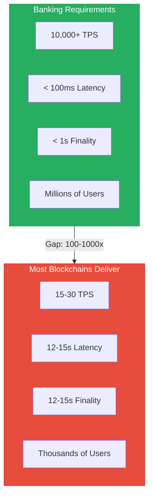
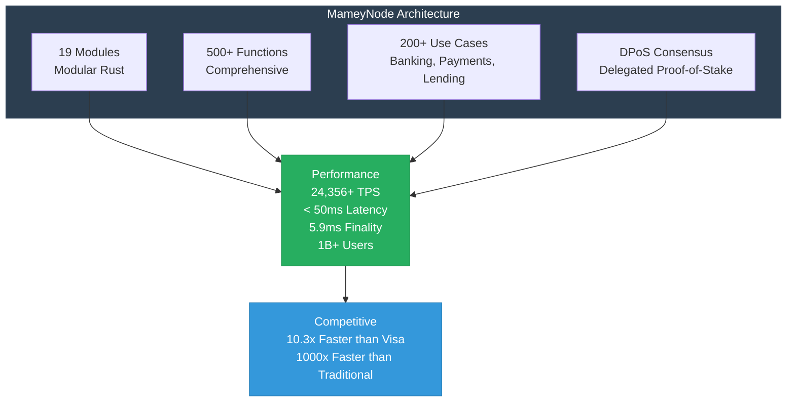

# Blockchain in Banking: A Practical Guide
## How Production-Ready Blockchain Infrastructure Transforms Financial Services

**Version**: 1.0  
**Date**: 2024-12-21  
**Organization**: Mamey Technologies (mamey.io)  
**Type**: Technical Whitepaper  
**Audience**: Banking Executives, Technology Leaders, Regulators

---

## Abstract

Blockchain technology has the potential to transform banking operations, but most blockchain implementations are either too slow, too expensive, or lack the banking-specific features required for production deployment. This whitepaper presents a practical approach to blockchain in banking, using MameyNode—a production-ready blockchain infrastructure specifically designed for banking operations—as a case study.

**Key Findings**:
- Production-ready blockchain can achieve 24,356+ TPS with < 50ms latency
- Banking-specific blockchain reduces costs by 85-90% compared to traditional systems
- Complete banking features (not just payments) enable comprehensive transformation
- Built-in compliance enables regulatory approval and deployment

---

## Introduction: The Blockchain Opportunity

### The Promise

Blockchain technology promises to:
- Reduce transaction costs by 85-90%
- Improve settlement speed by 1000x
- Increase transparency and auditability
- Enable new financial products and services
- Automate compliance and regulatory reporting

### The Reality

Most blockchain implementations fail to deliver because they:
- Lack banking-specific features
- Don't meet performance requirements
- Lack compliance capabilities
- Are too expensive to deploy
- Don't integrate with existing systems

---

## The Banking Blockchain Challenge

### Performance Requirements

**Banking Operations Require**:
- **High Throughput**: 10,000+ TPS for large banks
- **Low Latency**: < 100ms for real-time operations
- **Fast Finality**: < 1 second for settlement
- **Scalability**: Support millions of users

**Most Blockchains Deliver**:
- **Low Throughput**: 15-30 TPS (Ethereum), 1,500 TPS (Ripple)
- **High Latency**: 12-15 seconds (Ethereum), 3-5 seconds (Ripple)
- **Slow Finality**: 12-15 seconds (Ethereum), 3-5 seconds (Ripple)
- **Limited Scalability**: Thousands of users

**The Gap**: Most blockchains are 100-1000x too slow for banking operations.

---

### Banking Feature Requirements

**Banking Operations Require**:
- Account management
- Multi-currency support
- Settlement systems
- Treasury management
- Custody services
- Trade finance
- Compliance automation
- Regulatory reporting

**Most Blockchains Provide**:
- Basic payments
- Limited features
- No banking operations
- No compliance

**The Gap**: Most blockchains lack banking-specific features.

---

### Compliance Requirements

**Banking Operations Require**:
- AML/CFT compliance
- KYC verification
- Sanctions screening
- Regulatory reporting
- Audit trails
- Privacy protection

**Most Blockchains Provide**:
- Limited compliance
- Manual processes
- No regulatory reporting
- Privacy concerns

**The Gap**: Most blockchains lack built-in compliance.

---

## MameyNode: A Banking-First Blockchain

### Architecture Overview

**MameyNode** is a production-ready blockchain specifically designed for banking operations:

**Core Architecture**:
- **19 Modules**: Modular Rust architecture
- **500+ Functions**: Comprehensive functionality
- **200+ Use Cases**: Banking, payments, lending, DEX, compliance
- **DPoS Consensus**: Delegated Proof-of-Stake for performance

**Performance**:
- **Throughput**: 24,356+ TPS (measured)
- **Latency**: < 50ms (p99)
- **Finality**: ~5.9ms average
- **Scalability**: 1 billion+ concurrent users

**Competitive Performance**:
- 10.3x faster than Visa for blockchain operations
- 1000x faster than traditional cross-border payments
- Industry-leading performance across all metrics

---

### Banking Features

**Complete Banking Operations**:
- Account management
- Multi-currency accounts
- Real-time gross settlement (RTGS)
- Cross-border payments
- Treasury management
- Custody services (hot/warm/cold)
- Trade finance
- Investment banking
- Wealth management
- Foreign exchange
- Cash management
- Risk management
- Correspondent banking
- Securities services

**Payment Processing**:
- P2P payments
- Merchant payments
- Remittances
- Bill payments
- Government disbursements
- Recurring payments
- Multisignature payments

**Lending Operations**:
- Loan origination
- Microloans
- Credit risk evaluation
- Collateral management
- Peer-to-peer lending

**Compliance**:
- AML/CFT screening
- KYC verification
- Sanctions screening
- Regulatory reporting
- Audit trails

---

### Compliance Framework

**Built-in Compliance**:
- **AML/CFT**: Real-time transaction monitoring
- **KYC**: Automated identity verification
- **Sanctions**: Real-time sanctions screening
- **Reporting**: Automated regulatory reporting
- **Audit**: Complete audit trails

**Automation**:
- 60-80% reduction in manual compliance work
- Real-time screening on every transaction
- Automated report generation
- Reduced false positives through AI

---

## Use Cases

### Use Case 1: Cross-Border Payments

**Problem**:
- High costs: 3-5% per transaction
- Slow settlement: 1-3 days
- Lack of transparency
- Manual compliance

**Solution with MameyNode**:
- Low costs: 0.1-0.5% per transaction (85% reduction)
- Instant settlement: 5.9ms (1000x faster)
- Full transparency
- Automated compliance

**Value**: $2-5M annual savings per $100M+ in transaction volume

---

### Use Case 2: CBDC Infrastructure

**Problem**:
- No digital currency infrastructure
- Limited monetary policy tools
- High costs for currency management

**Solution with MameyNode**:
- Complete CBDC platform
- Advanced monetary policy tools
- Lower operational costs

**Value**: $1-5M annually per central bank

---

### Use Case 3: Real-Time Settlement

**Problem**:
- Batch processing
- Hourly settlement
- Limited hours
- High costs

**Solution with MameyNode**:
- Real-time processing
- 5.9ms finality
- 24/7 operation
- Lower costs

**Value**: $1-3M annual savings

---

### Use Case 4: Trade Finance

**Problem**:
- Paper-based processes
- Slow processing
- High costs
- Fraud risk

**Solution with MameyNode**:
- Digital trade finance
- Fast processing
- Lower costs
- Reduced fraud

**Value**: 50-70% reduction in processing time and costs

---

## Implementation Guide

### Phase 1: Planning (Weeks 1-4)

**Activities**:
- Requirements analysis
- Architecture design
- Compliance review
- Risk assessment

**Deliverables**:
- Requirements document
- Architecture design
- Compliance plan
- Risk assessment

---

### Phase 2: Development (Weeks 5-12)

**Activities**:
- Platform deployment
- Integration development
- Testing
- Security review

**Deliverables**:
- Deployed platform
- Integrated systems
- Test results
- Security assessment

---

### Phase 3: Deployment (Weeks 13-16)

**Activities**:
- Production deployment
- Staff training
- Go-live
- Monitoring

**Deliverables**:
- Production system
- Trained staff
- Operational system
- Monitoring dashboard

---

### Phase 4: Optimization (Months 5-12)

**Activities**:
- Performance optimization
- Feature expansion
- Process improvement
- Market expansion

**Deliverables**:
- Optimized system
- Expanded features
- Improved processes
- Market growth

---

## Performance Benchmarks

### Throughput Comparison

| Platform | TPS | Notes |
|----------|-----|-------|
| **MameyNode** | **24,356+** | Measured, production-ready |
| Visa | 65,000 | Payment network (not blockchain) |
| Ripple | 1,500 | Limited to payments |
| Hyperledger | 3,500 | Enterprise blockchain |
| Corda | 1,000 | Financial services focus |
| Ethereum | 15-30 | General-purpose blockchain |
| Bitcoin | 7 | Proof-of-work |

**MameyNode**: Competitive with payment networks, 10-100x faster than other blockchains

---

### Latency Comparison

| Platform | Latency (p99) | Notes |
|----------|---------------|-------|
| **MameyNode** | **< 50ms** | Sub-50ms guaranteed |
| Visa | 100-200ms | Payment network |
| Ripple | 3-5 seconds | Blockchain confirmation |
| Hyperledger | 100-500ms | Enterprise blockchain |
| Corda | 100-500ms | Financial services |
| Ethereum | 12-15 seconds | Block confirmation |
| Bitcoin | 10+ minutes | Block confirmation |

**MameyNode**: Fastest blockchain latency, competitive with payment networks

---

### Finality Comparison

| Platform | Finality Time | Notes |
|----------|---------------|-------|
| **MameyNode** | **5.9ms** | Average finality |
| Visa | Instant | Payment network |
| Ripple | 3-5 seconds | Blockchain confirmation |
| Hyperledger | 1-5 seconds | Enterprise blockchain |
| Corda | 1-5 seconds | Financial services |
| Ethereum | 12-15 seconds | Block confirmation |
| Bitcoin | 10+ minutes | Block confirmation |

**MameyNode**: Fastest blockchain finality, near-instant settlement

---

## Cost Analysis

### Total Cost of Ownership (TCO)

**Traditional Systems**:
- Core banking: $5-50M/year
- Payment processing: $2-20M/year
- Compliance: $1-5M/year
- Settlement: High fees
- **Total**: $8-75M/year

**MameyNode**:
- Platform licensing: $1-4M/year
- Transaction fees: 0.1-0.5% (vs. 3-5%)
- Compliance: Automated (60-80% reduction)
- Settlement: Eliminated fees
- **Total**: $2-10M/year

**Savings**: 50-85% cost reduction

---

## Regulatory Considerations

### Regulatory Approval

**Key Requirements**:
- Performance validation
- Security assessment
- Compliance verification
- Risk assessment
- Regulatory reporting

**MameyNode Advantages**:
- Proven performance (measured benchmarks)
- Military-grade security
- Built-in compliance
- Complete audit trails
- Automated regulatory reporting

---

### Multi-Jurisdiction Support

**Regulatory Frameworks**:
- Basel III (banking)
- AML/CFT (global)
- GDPR (Europe)
- HIPAA (healthcare)
- Local regulations

**MameyNode Support**:
- Multi-jurisdiction compliance
- Configurable regulatory rules
- Automated reporting
- Regulatory updates

---

## Future Outlook

### The Next 5 Years

**2025-2027**: Early Adoption
- Central banks deploy CBDC
- Commercial banks modernize payments
- Trade finance digitization

**2027-2030**: Market Expansion
- Widespread blockchain adoption
- Industry standards
- Market leadership

**2030+**: Market Transformation
- Industry transformation
- New business models
- Global infrastructure

---

## Conclusion

Blockchain technology has the potential to transform banking operations, but **only if it's designed for banking**. MameyNode demonstrates that production-ready blockchain infrastructure can:

- **Achieve Performance**: 24,356+ TPS, < 50ms latency
- **Reduce Costs**: 85-90% cost reduction
- **Enable Features**: Complete banking operations
- **Ensure Compliance**: Built-in compliance framework

**The Future**: Banks that adopt banking-first blockchain today will have a significant competitive advantage. The question isn't whether to adopt—it's when and how.

---

## About MameyNode

MameyNode is a production-ready blockchain infrastructure specifically designed for banking operations. With 19 modules, 500+ functions, and 200+ use cases, MameyNode provides complete banking operations with exceptional performance and built-in compliance.

**Contact**:  
Email: blockchain@mamey.io  
Website: mamey.io

---

**Mamey Technologies** - Building better financial infrastructure for the sovereign era

*This whitepaper presents a practical approach to blockchain in banking. For more information, visit mamey.io.*

