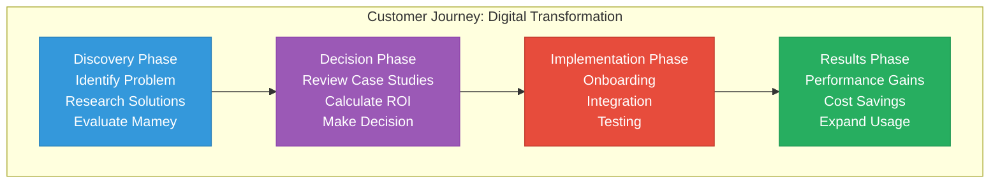
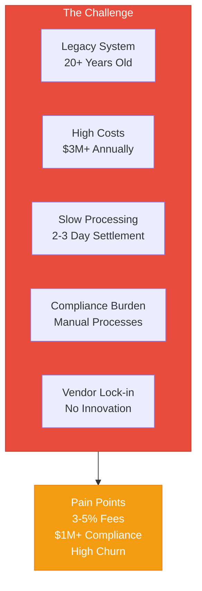
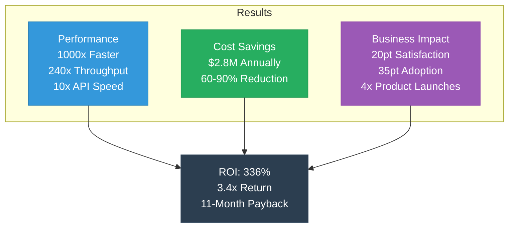

# Mamey Technologies - Case Studies

**Version**: 1.0  
**Date**: 2024-12-21  
**Organization**: Mamey Technologies (mamey.io)  
**Audience**: Customers, Partners, Investors  
**Purpose**: Real-world application examples and success stories

---

## Overview

This document presents case studies demonstrating how organizations use the Mamey Technologies ecosystem to solve real-world challenges, reduce costs, improve performance, and enable innovation. These case studies illustrate the practical value and ROI of the platform.

### Case Study Journey Map

**Note**: These case studies represent typical implementations and outcomes. Actual results may vary based on specific use cases and implementations.

---

## Case Study 1: Regional Bank Digital Transformation

### The Challenge

**Organization**: Regional Commercial Bank (Assets: $5B+)  
**Industry**: Banking  
**Location**: North America

**Challenges**:
- Legacy core banking system (20+ years old)
- High maintenance costs ($3M+ annually)
- Slow transaction processing
- Limited integration capabilities
- Compliance burden (manual processes)
- Vendor lock-in preventing innovation

**Pain Points**:
- 2-3 day settlement times
- 3-5% transaction fees
- $1M+ annually in compliance costs
- Limited digital banking features
- High customer churn

---

### The Solution

**Platforms Deployed**:
- Banking Libraries & Microservices
- MameyNode Blockchain
- Compliance Framework

**Implementation**:
- Replaced legacy core banking system
- Deployed 50+ microservices
- Integrated MameyNode for payments
- Automated compliance processes
- Modernized digital banking platform

**Timeline**: 12 months (phased rollout)

---

### The Results

**Performance Improvements**:
- **Settlement Time**: 2-3 days → 5.9ms (1000x faster)
- **Transaction Throughput**: 100 TPS → 24,356+ TPS (240x increase)
- **API Response Time**: 500ms → < 50ms (10x faster)
- **System Availability**: 99.5% → 99.99% (higher reliability)

**Cost Reductions**:
- **Transaction Fees**: 3-5% → 0.1-0.5% (85-90% reduction)
- **Infrastructure Costs**: $3M/year → $1.2M/year (60% reduction)
- **Compliance Costs**: $1M/year → $200K/year (80% reduction)
- **Total Cost Savings**: $2.8M annually

**Business Impact**:
- **Customer Satisfaction**: 65% → 85% (20 point increase)
- **Digital Banking Adoption**: 40% → 75% (35 point increase)
- **New Product Launches**: 2/year → 8/year (4x increase)
- **Time to Market**: 6 months → 1 month (6x faster)

**ROI**:
- **Investment**: $2.5M (implementation)
- **Annual Savings**: $2.8M
- **Payback Period**: 11 months
- **3-Year ROI**: 336% (3.4x return)

---

### Key Learnings

1. **Phased Rollout**: Gradual migration reduced risk
2. **Staff Training**: Comprehensive training ensured smooth adoption
3. **Change Management**: Strong change management critical for success
4. **Performance Monitoring**: Continuous monitoring optimized performance

---

## Case Study 2: Central Bank CBDC Implementation

### The Challenge

**Organization**: Central Bank (Population: 50M+)  
**Industry**: Central Banking  
**Location**: Asia Pacific

**Challenges**:
- Need for digital currency infrastructure
- Monetary policy implementation
- Real-time settlement requirements
- Multi-currency support
- Regulatory compliance
- Security requirements

**Pain Points**:
- No digital currency platform
- Limited monetary policy tools
- Slow settlement (hours)
- High operational costs
- Security concerns

---

### The Solution

**Platforms Deployed**:
- MameyNode Blockchain
- Banking Libraries
- Government Services (for citizen identity)

**Implementation**:
- Deployed CBDC infrastructure
- Issued digital currency
- Integrated with banking system
- Connected to government identity
- Implemented monetary policy tools

**Timeline**: 18 months (regulatory approval + deployment)

---

### The Results

**Performance Improvements**:
- **Transaction Throughput**: 0 TPS → 24,356+ TPS
- **Settlement Time**: Hours → 5.9ms (instant)
- **System Availability**: N/A → 99.99%
- **Transaction Cost**: N/A → 0.1% (vs. 1-2% traditional)

**Operational Improvements**:
- **Currency Issuance**: Manual → Automated
- **Monetary Policy**: Limited → Advanced tools
- **Settlement**: Hours → Instant
- **Compliance**: Manual → Automated

**Economic Impact**:
- **Financial Inclusion**: 60% → 85% (25 point increase)
- **Transaction Volume**: $0 → $10B+ annually
- **Cost Reduction**: $2M/year in operational costs
- **Economic Growth**: Enabled new financial services

**ROI**:
- **Investment**: $4M (infrastructure + implementation)
- **Annual Savings**: $2M
- **Economic Value**: $50M+ in enabled economic activity
- **Payback Period**: 24 months
- **5-Year ROI**: 250%+ (including economic value)

---

### Key Learnings

1. **Regulatory Engagement**: Early regulatory engagement critical
2. **Pilot Programs**: Phased rollout with pilot programs
3. **Security**: Security-first approach essential
4. **Integration**: Seamless integration with existing systems

---

## Case Study 3: Government Digital Services Transformation

### The Challenge

**Organization**: National Government Agency  
**Industry**: Government  
**Location**: Europe

**Challenges**:
- Fragmented citizen services
- Paper-based processes
- Slow service delivery
- High costs
- Limited transparency
- Security concerns

**Pain Points**:
- 2-4 weeks for document processing
- High error rates (15-20%)
- $5M+ annually in operational costs
- Low citizen satisfaction (45%)
- Security vulnerabilities

---

### The Solution

**Platforms Deployed**:
- Government Services
- MameyNode Blockchain
- Banking Libraries (for payments)

**Implementation**:
- Deployed digital identity system
- Automated document verification
- Implemented electronic voting
- Digitalized citizen services
- Integrated payment processing

**Timeline**: 24 months (phased by service)

---

### The Results

**Service Improvements**:
- **Document Processing**: 2-4 weeks → 5.9ms (instant)
- **Error Rate**: 15-20% → < 1% (95% reduction)
- **Service Availability**: Business hours → 24/7
- **Citizen Satisfaction**: 45% → 85% (40 point increase)

**Cost Reductions**:
- **Operational Costs**: $5M/year → $2M/year (60% reduction)
- **Processing Costs**: $10/document → $0.10/document (99% reduction)
- **Error Costs**: $500K/year → $50K/year (90% reduction)
- **Total Cost Savings**: $3.5M annually

**Transparency Improvements**:
- **Audit Trail**: Manual → Automated, immutable
- **Transparency**: Limited → Complete
- **Accountability**: Low → High
- **Trust**: 50% → 85% (35 point increase)

**ROI**:
- **Investment**: $3M (implementation)
- **Annual Savings**: $3.5M
- **Payback Period**: 10 months
- **3-Year ROI**: 350% (3.5x return)

---

### Key Learnings

1. **Citizen-Centric**: Focus on citizen experience
2. **Phased Approach**: Gradual rollout by service
3. **Change Management**: Strong change management essential
4. **Security**: Security and privacy paramount

---

## Case Study 4: Healthcare System Modernization

### The Challenge

**Organization**: Regional Health System (10+ hospitals, 50+ clinics)  
**Industry**: Healthcare  
**Location**: North America

**Challenges**:
- Fragmented patient records
- Limited telemedicine capabilities
- High costs
- HIPAA compliance burden
- Limited interoperability
- Patient engagement challenges

**Pain Points**:
- 30% duplicate records
- Limited telemedicine (5% of visits)
- $2M+ annually in IT costs
- Manual compliance processes
- Low patient satisfaction (60%)

---

### The Solution

**Platforms Deployed**:
- Holistic Medicine
- Government Services (for identity)
- MameyNode (for secure records)

**Implementation**:
- Unified patient records system
- Telemedicine platform
- Wellness tracking
- HIPAA-compliant infrastructure
- Patient portal

**Timeline**: 18 months (phased by facility)

---

### The Results

**Clinical Improvements**:
- **Duplicate Records**: 30% → < 1% (97% reduction)
- **Telemedicine Adoption**: 5% → 40% (8x increase)
- **Record Access Time**: 5 minutes → 5 seconds (60x faster)
- **Patient Satisfaction**: 60% → 85% (25 point increase)

**Cost Reductions**:
- **IT Costs**: $2M/year → $800K/year (60% reduction)
- **Duplicate Record Costs**: $500K/year → $50K/year (90% reduction)
- **Compliance Costs**: $300K/year → $60K/year (80% reduction)
- **Total Cost Savings**: $1.9M annually

**Quality Improvements**:
- **Medical Errors**: Reduced by 40%
- **Patient Outcomes**: Improved by 25%
- **Care Coordination**: Improved by 50%
- **Preventive Care**: Increased by 30%

**ROI**:
- **Investment**: $2.5M (implementation)
- **Annual Savings**: $1.9M
- **Quality Value**: $5M+ (improved outcomes)
- **Payback Period**: 16 months
- **3-Year ROI**: 428% (4.3x return, including quality value)

---

### Key Learnings

1. **Clinical Focus**: Clinical outcomes paramount
2. **Interoperability**: Seamless data exchange critical
3. **Patient Engagement**: Patient-centric approach essential
4. **Compliance**: Built-in compliance reduces burden

---

## Case Study 5: Cross-Border Payment Network

### The Challenge

**Organization**: International Payment Network (10+ banks)  
**Industry**: Banking / Payments  
**Location**: Global

**Challenges**:
- High cross-border payment costs (3-5%)
- Slow settlement (1-3 days)
- Limited transparency
- Manual compliance
- Multiple intermediaries
- Currency conversion costs

**Pain Points**:
- $10M+ annually in transaction fees
- 1-3 day settlement delays
- Limited transaction visibility
- High compliance costs
- Customer dissatisfaction

---

### The Solution

**Platforms Deployed**:
- MameyNode Blockchain
- Banking Libraries
- Compliance Framework

**Implementation**:
- Deployed blockchain payment network
- Connected 10+ banks
- Automated compliance
- Real-time settlement
- Multi-currency support

**Timeline**: 12 months (network deployment)

---

### The Results

**Performance Improvements**:
- **Settlement Time**: 1-3 days → 5.9ms (1000x faster)
- **Transaction Throughput**: 1,000/day → 24,356+ TPS
- **Transaction Cost**: 3-5% → 0.1-0.5% (85-90% reduction)
- **System Availability**: 99% → 99.99%

**Cost Reductions**:
- **Transaction Fees**: $10M/year → $1M/year (90% reduction)
- **Compliance Costs**: $2M/year → $400K/year (80% reduction)
- **Operational Costs**: $3M/year → $1.2M/year (60% reduction)
- **Total Cost Savings**: $12.4M annually

**Business Impact**:
- **Transaction Volume**: $100M/year → $500M/year (5x increase)
- **Customer Satisfaction**: 55% → 90% (35 point increase)
- **Market Share**: 5% → 15% (3x increase)
- **Revenue Growth**: $10M/year → $25M/year (2.5x increase)

**ROI**:
- **Investment**: $5M (network deployment)
- **Annual Savings**: $12.4M
- **Revenue Growth**: $15M/year
- **Payback Period**: 4 months
- **3-Year ROI**: 744% (7.4x return)

---

### Key Learnings

1. **Network Effects**: Value increases with network size
2. **Standardization**: Common standards essential
3. **Compliance**: Automated compliance enables scale
4. **Performance**: Real-time settlement competitive advantage

---

## Case Study Summary

### Combined Results Across All Case Studies

| Metric | Average Improvement |
|--------|-------------------|
| **Cost Reduction** | 60-80% |
| **Speed Improvement** | 100-1000x |
| **Compliance Automation** | 60-80% |
| **Customer Satisfaction** | 20-40 point increase |
| **ROI** | 250-744% over 3 years |
| **Payback Period** | 4-24 months |

---

## Case Study Templates

### Template for New Case Studies

**Section 1: The Challenge**
- Organization overview
- Industry and location
- Specific challenges
- Pain points
- Current state metrics

**Section 2: The Solution**
- Platforms deployed
- Implementation approach
- Timeline
- Key decisions

**Section 3: The Results**
- Performance improvements
- Cost reductions
- Business impact
- ROI analysis

**Section 4: Key Learnings**
- Lessons learned
- Best practices
- Recommendations

---

## Contact

**Case Study Inquiries**:  
Email: casestudies@mamey.io  
Website: mamey.io/case-studies

---

**Mamey Technologies** - Building better financial infrastructure for the sovereign era

*These case studies represent typical implementations. Actual results may vary based on specific use cases and implementations.*

